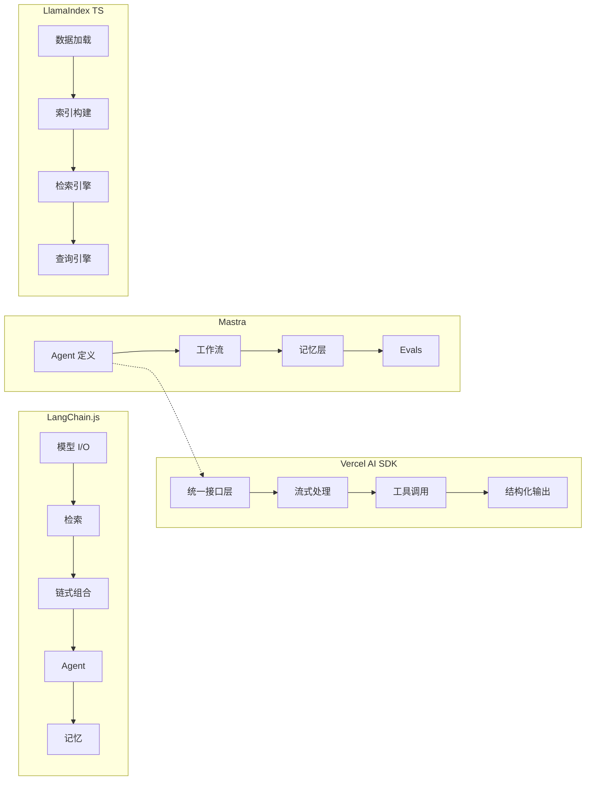
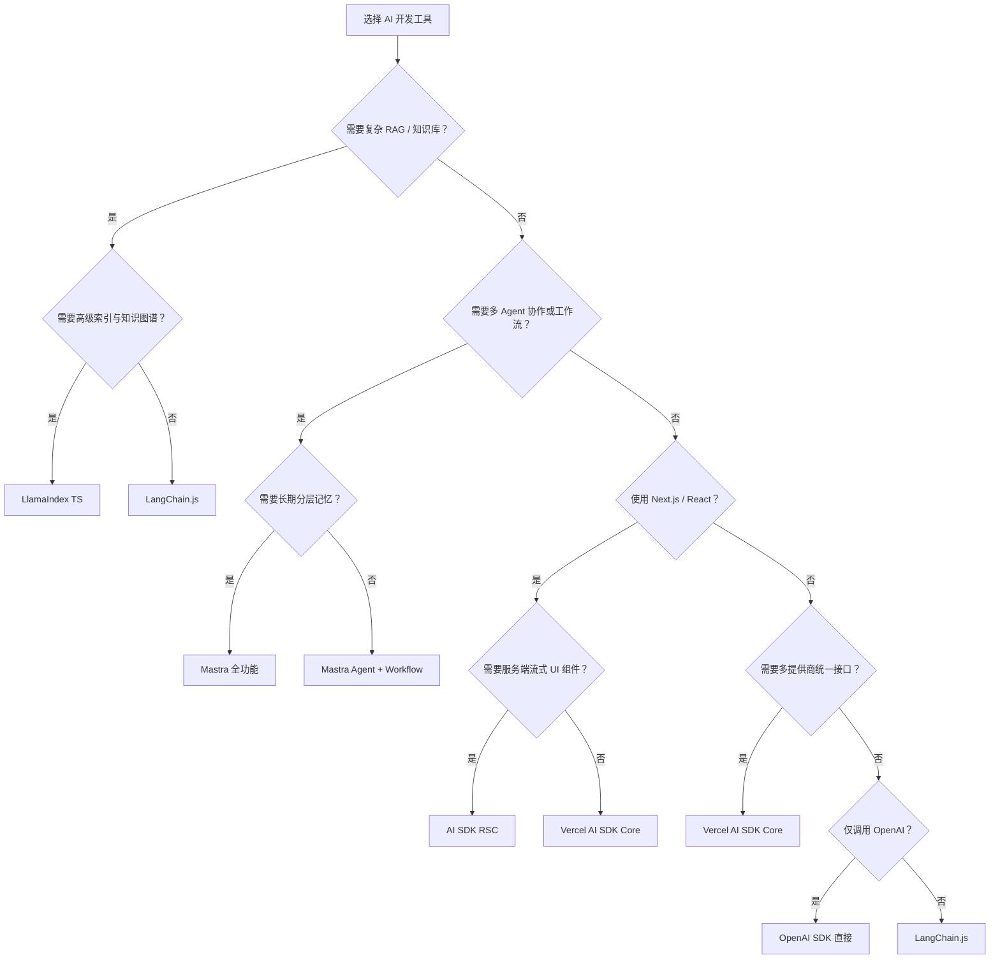

# AI 开发工具对比矩阵

> 系统对比主流 JavaScript/TypeScript AI 开发库与框架的核心能力、架构风格、生态成熟度与适用场景，帮助你为 AI 项目选择最合适的技术栈。

---

## 核心指标对比

| 指标 | Vercel AI SDK | LangChain.js | Mastra | LlamaIndex TS | OpenAI SDK (direct) |
|------|---------------|--------------|--------|---------------|---------------------|
| **发布年份** | 2023 | 2023 (JS 版本) | 2024 | 2023 (TS 版本) | 2020 |
| **维护方** | Vercel | LangChain Inc. | Mastra Inc. / 社区 | LlamaIndex Inc. | OpenAI |
| **架构风格** | 最小抽象 + 类型安全 | 链式组合 + 丰富生态 | Agent 优先 + 工作流驱动 | 数据增强 + 索引检索 | 直接 API 封装 |
| **包体积 (min+gzip)** | ~8KB (核心) | ~180KB+ (核心) | ~45KB (核心) | ~120KB+ (核心) | ~25KB |
| **TypeScript 支持** | 极佳（原生设计） | 良好 | 极佳（原生设计） | 良好 | 良好 |
| **学习曲线** | 平缓 | 陡峭 | 中等 | 陡峭 | 极平缓 |
| **官方维护活跃度** | 极高 | 极高 | 高 | 高 | 极高 |
| **社区插件/集成数** | 30+ 提供商适配器 | 500+ | 快速增长中 | 200+ | 仅 OpenAI |
| **与前端框架集成** | 深度 (React/Vue/Svelte) | 弱 | 中等 (Next.js 示例) | 弱 | 无 |
| **中文资料丰富度** | 中等 | 中等 | 较少 | 较少 | 丰富 |

---

## 功能特性矩阵

| 特性 | Vercel AI SDK | LangChain.js | Mastra | LlamaIndex TS | OpenAI SDK |
|------|---------------|--------------|--------|---------------|------------|
| **流式输出 (Streaming)** | ✅ 核心设计 | ✅ | ✅ (基于 AI SDK) | ⚠️ (需额外配置) | ✅ |
| **结构化输出 (Schema)** | ✅ Zod 原生集成 | ✅ (with Structured Output) | ✅ (基于 AI SDK) | ✅ | ⚠️ (手动解析) |
| **Tool Calling / 函数调用** | ✅ 完整支持 | ✅ | ✅ (基于 AI SDK) | ⚠️ (通过 Agent) | ✅ |
| **RAG / 检索增强** | ❌ (需外部) | ✅ 核心能力 | ⚠️ (基础支持) | ✅✅ 最强 | ❌ |
| **Agent 编排** | ⚠️ (基础工具循环) | ✅ LangGraph | ✅✅ 核心设计 | ✅ ReAct Agent | ❌ |
| **工作流引擎** | ❌ | ✅ LangGraph | ✅ 原生支持 | ⚠️ (基础) | ❌ |
| **记忆 / 上下文管理** | ❌ (需外部) | ✅ Memory 模块 | ✅✅ 分层记忆 | ✅ Chat Memory | ❌ |
| **多模态 (图像/音频)** | ✅ 部分支持 | ✅ | ⚠️ (基础) | ⚠️ (基础) | ✅ |
| **本地模型支持** | ✅ Ollama 等 | ✅ | ✅ | ✅ | ❌ |
| **多提供商统一接口** | ✅✅ 最强 | ✅ | ✅ (基于 AI SDK) | ⚠️ (有限) | ❌ |
| **评估 / Evals** | ❌ | ✅ LangSmith | ✅ 内置 Evals | ⚠️ (基础) | ❌ |
| **提示词模板管理** | ❌ | ✅ Prompt Templates | ⚠️ (基础) | ✅ | ❌ |
| **文档加载与解析** | ❌ | ✅ Document Loaders | ❌ | ✅✅ 最强 | ❌ |
| **向量存储集成** | ❌ | ✅ Vector Stores | ⚠️ (基础) | ✅✅ 最强 | ❌ |

---

## 适用场景推荐

| 场景 | 首选 | 次选 | 理由 |
|------|------|------|------|
| 前端 AI 聊天界面 / 流式 UI | **Vercel AI SDK** | Mastra | useChat / useCompletion 钩子最完善，与 React 深度集成 |
| 结构化数据提取与表单生成 | **Vercel AI SDK** | Mastra | `generateObject` / `streamObject` 类型安全且易用 |
| Next.js 全栈 + 服务端流式渲染 | **AI SDK RSC** | Vercel AI SDK | Server Components 原生流式 UI，零客户端状态管理 |
| 多 Agent 协作系统 | **Mastra** | LangChain.js | AgentNetwork + Workflow 编排直观，类型安全 |
| 复杂审批/业务流程自动化 | **Mastra Workflow** | LangGraph | 步骤编排、条件分支、并行执行、状态持久化 |
| 需要长期记忆的个人助手 | **Mastra Memory** | LangChain Memory | 语义+实体+工作记忆三层架构，自动实体提取 |
| 企业知识库 / 复杂文档问答 | **LlamaIndex TS** | LangChain.js | 高级索引策略、知识图谱、多模态文档解析 |
| 100+ 数据源集成 / 快速原型 | **LangChain.js** | LlamaIndex TS | 生态最丰富，预构建集成最多 |
| 简单 API 调用 / 最小依赖 | **OpenAI SDK** | Vercel AI SDK | 零抽象，最直接，包体积最小 |
| 跨提供商统一调用层 | **Vercel AI SDK** | — | 一行代码切换 OpenAI/Anthropic/Google 等 |
| AI 应用监控与评估 | **LangChain + LangSmith** | Mastra Evals | LangSmith 生态最成熟，Mastra Evals 快速增长 |

---

## 运行时与部署对比

| 框架/库 | Node.js | Edge / Cloudflare | Vercel Serverless | Bun | Deno | Docker |
|---------|---------|-------------------|-------------------|-----|------|--------|
| **Vercel AI SDK** | ✅ | ✅ **首选** | ✅ **原生优化** | ✅ | ✅ | ✅ |
| **LangChain.js** | ✅ | ⚠️ (部分兼容) | ✅ | ✅ | ⚠️ | ✅ |
| **Mastra** | ✅ | ⚠️ (开发中) | ✅ | ✅ | ⚠️ | ✅ |
| **LlamaIndex TS** | ✅ | ❌ | ✅ | ✅ | ⚠️ | ✅ |
| **OpenAI SDK** | ✅ | ✅ | ✅ | ✅ | ✅ | ✅ |

---

## 架构模型对比

---

## 决策建议

---

> **关联文档**
>
> - [AI SDK 与 Mastra 完整开发指南](../guide/ai-sdk-guide.md) — API 详解、最佳实践与项目示例
> - [前端框架对比](./frontend-frameworks-compare.md)
> - [后端框架对比](./backend-frameworks-compare.md)
> - `jsts-code-lab/` — 代码实验与示例（待补充 AI 相关章节）
