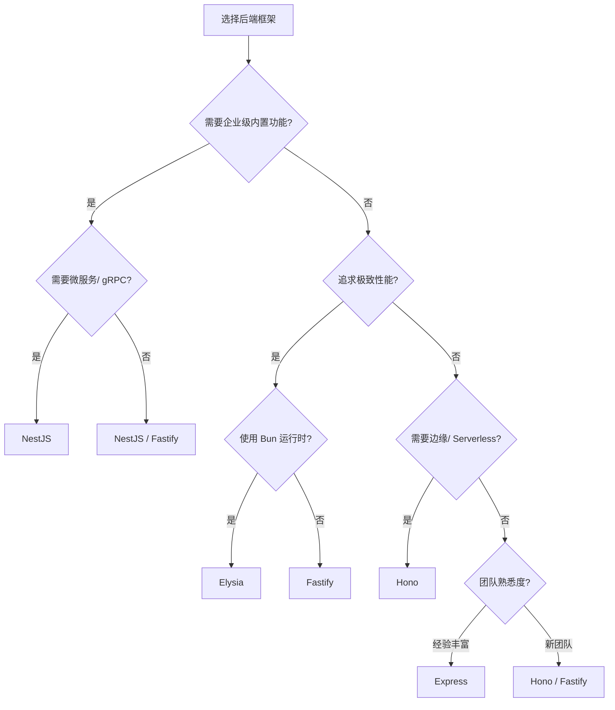

# 后端框架对比矩阵

> 系统对比主流 Node.js 后端框架的核心特性、性能、生态成熟度与适用场景，帮助你为项目选择最合适的后端框架。

---

## 核心指标对比

| 指标 | Express | NestJS | Fastify | Hono | Elysia | Koa |
|------|---------|--------|---------|------|--------|-----|
| **发布年份** | 2010 | 2017 | 2017 | 2021 | 2022 | 2013 |
| **维护方** | OpenJS Foundation | 社区 (Kamil Mysliwiec) | 社区 (Matteo Collina) | 社区 (Yusuke Wada) | 社区 (saltyaom) | 社区 (Koajs Team) |
| **架构风格** | 极简中间件 | 企业级模块化 (Angular 风格) | 插件化 + Schema 优先 | 边缘优先 / Web 标准 | 编译时优化 + 类型安全 | 洋葱模型中间件 |
| **TypeScript 支持** | 需配置 | 原生内置 | 优秀 | 原生内置 | 原生内置 (Bun 优先) | 需配置 |
| **包体积 (gzip)** | ~570KB | ~580KB | ~180KB | ~15KB | ~20KB | ~80KB |
| **路由性能** | 中等 | 中等 | 极高 (~2x Express) | 极高 | 极高 (~20x Express) | 中等 |
| **学习曲线** | 平缓 | 陡峭 | 中等 | 平缓 | 平缓 | 中等 |
| **企业级生态** | 极强 | 强 | 中等 | 弱 | 弱 | 弱 |
| **边缘运行支持** | ❌ | ⚠️ (实验性) | ⚠️ | ✅ 核心设计 | ✅ 核心设计 | ❌ |

---

## 功能特性矩阵

| 特性 | Express | NestJS | Fastify | Hono | Elysia | Koa |
|------|---------|--------|---------|------|--------|-----|
| **内置依赖注入** | ❌ | ✅ | ❌ | ❌ | ✅ (编译时) | ❌ |
| **Schema 验证集成** | ⚠️ (需中间件) | ✅ (class-validator) | ✅ (内置 JSON Schema) | ⚠️ (需中间件) | ✅ (内置) | ⚠️ (需中间件) |
| **OpenAPI/Swagger** | ⚠️ (第三方) | ✅ (内置 @nestjs/swagger) | ✅ (fastify-swagger) | ⚠️ (第三方) | ⚠️ (第三方) | ⚠️ (第三方) |
| **GraphQL 支持** | ⚠️ (apollo-server) | ✅ (@nestjs/graphql) | ⚠️ (mercurius) | ❌ | ⚠️ (实验性) | ⚠️ (apollo-server) |
| **WebSocket 支持** | ⚠️ (socket.io) | ✅ (@nestjs/websockets) | ⚠️ (fastify-websocket) | ⚠️ (第三方) | ✅ (内置) | ⚠️ (第三方) |
| **gRPC 支持** | ❌ | ✅ (@nestjs/microservices) | ❌ | ❌ | ❌ | ❌ |
| **Serverless 适配** | ⚠️ | ⚠️ | ✅ | ✅ 核心设计 | ✅ 核心设计 | ⚠️ |
| **运行时兼容性** | Node.js | Node.js / Bun | Node.js | Node.js / Deno / Bun / CF Workers | Bun (优先) | Node.js |

---

## 适用场景推荐

| 场景 | 首选 | 次选 | 理由 |
|------|------|------|------|
| 企业级大型后端服务 | **NestJS** | Fastify | 内置 DI、模块化、Swagger、gRPC、微服务全套方案 |
| 极致性能 API 服务 | **Fastify** | Elysia | JSON Schema 验证 + 极低开销，适合高并发 |
| 边缘计算 / Serverless | **Hono** | Elysia | 多运行时兼容，Cloudflare Workers / Deno Deploy 原生支持 |
| Bun 生态优先项目 | **Elysia** | Hono | 编译时类型推导、端到端类型安全、Bun 深度优化 |
| 快速原型 / 小型项目 | **Express** | Hono | 生态最成熟，文档最丰富，招聘友好 |
| 中间件-heavy 架构 | **Koa** | Fastify | 洋葱模型优雅处理异步流，适合复杂中间件链 |
| 全栈 TypeScript (Next.js 后端) | **Next.js API Routes** | NestJS | 前后端同构，减少上下文切换 |
| 微服务网关 | **NestJS** | Fastify | 内置 TCP / Redis / MQTT / gRPC 微服务传输 |

---

## 决策建议

---

> **关联文档**
>
> - [ORM 对比](./orm-compare.md)
> - [部署平台对比](./deployment-platforms-compare.md)
> - `jsts-code-lab/19-backend-development/` — 后端开发模式与示例代码