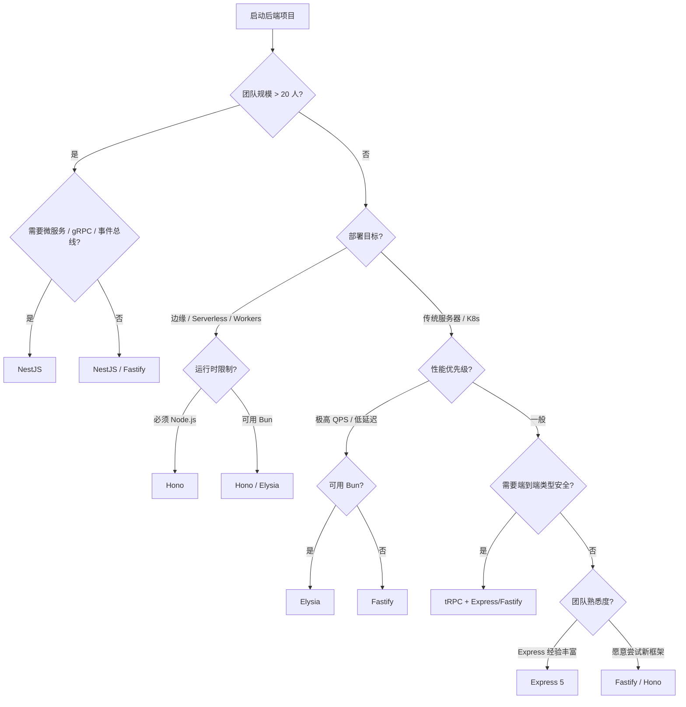
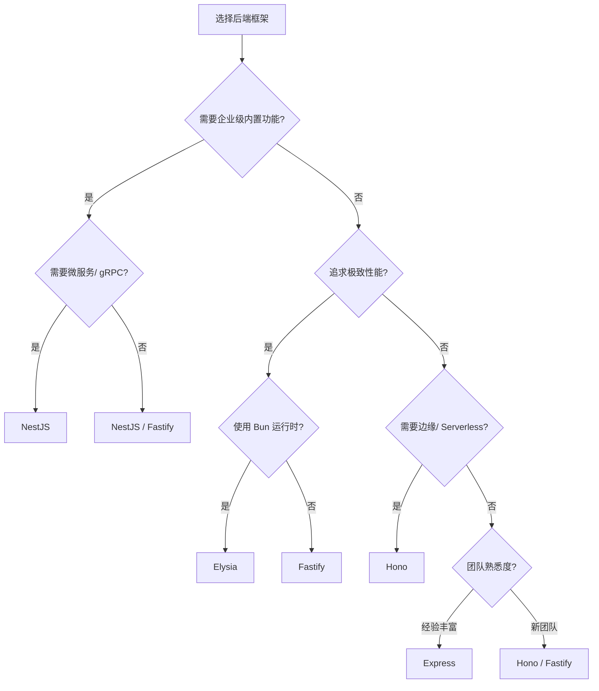

# 后端框架对比矩阵

> 系统对比主流 Node.js / TypeScript 后端框架的核心特性、性能基准、生态成熟度与适用场景，帮助你为项目选择最合适的后端框架。数据截至 2026 年 5 月。

---

## 核心指标对比

| 指标 | Express | NestJS | Fastify | Hono | Elysia | Koa |
|------|---------|--------|---------|------|--------|-----|
| **发布年份** | 2010 | 2017 | 2017 | 2021 | 2022 | 2013 |
| **最新主版本** | v5.2.0 | v11.x | v5.x | v4.x | 活跃开发 | v2.16.x |
| **GitHub Stars** | ~69K | ~75K | ~36K | ~30K | ~10K | ~35.7K |
| **周下载量 (npm)** | ~9500 万 | ~300 万 | ~150 万 | ~80 万 | ~15 万 | ~120 万 |
| **维护方** | OpenJS Foundation | 社区 (Kamil Mysliwiec) | 社区 (Matteo Collina) | 社区 (Yusuke Wada) | 社区 (saltyaom) | 社区 (Koajs Team) |
| **架构风格** | 极简中间件 | 企业级模块化 (Angular 风格) | 插件化 + Schema 优先 | 边缘优先 / Web 标准 | 编译时优化 + 类型安全 | 洋葱模型中间件 |
| **TypeScript 支持** | 需配置 | 原生内置 | 优秀 | 原生内置 | 原生内置 (Bun 优先) | 需配置 |
| **包体积 (gzip)** | ~570KB | ~580KB | ~180KB | ~15KB | ~20KB | ~80KB |
| **路由性能** | 中等 | 中等 | 极高 (~2x Express) | 极高 | 极高 (~20x Express) | 中等 |
| **学习曲线** | 平缓 | 陡峭 | 中等 | 平缓 | 平缓 | 中等 |
| **企业级生态** | 极强 | 强 | 中等 | 弱 | 弱 | 弱 |
| **边缘运行支持** | ❌ | ⚠️ (实验性) | ⚠️ | ✅ 核心设计 | ✅ 核心设计 | ❌ |

> 📌 **数据来源**: GitHub 仓库统计 (2026-04)、npm registry 下载量统计、官方文档与发布记录。

---

## 功能特性矩阵

| 特性 | Express | NestJS | Fastify | Hono | Elysia | Koa |
|------|---------|--------|---------|------|--------|-----|
| **内置依赖注入** | ❌ | ✅ | ❌ | ❌ | ✅ (编译时) | ❌ |
| **Schema 验证集成** | ⚠️ (需中间件) | ✅ (class-validator) | ✅ (内置 JSON Schema) | ⚠️ (需中间件) | ✅ (内置 TypeBox) | ⚠️ (需中间件) |
| **OpenAPI/Swagger** | ⚠️ (第三方) | ✅ (内置 @nestjs/swagger) | ✅ (fastify-swagger) | ⚠️ (第三方) | ⚠️ (第三方) | ⚠️ (第三方) |
| **GraphQL 支持** | ⚠️ (apollo-server) | ✅ (@nestjs/graphql) | ⚠️ (mercurius) | ❌ | ⚠️ (实验性) | ⚠️ (apollo-server) |
| **WebSocket 支持** | ⚠️ (socket.io) | ✅ (@nestjs/websockets) | ⚠️ (fastify-websocket) | ⚠️ (第三方) | ✅ (内置) | ⚠️ (第三方) |
| **gRPC 支持** | ❌ | ✅ (@nestjs/microservices) | ❌ | ❌ | ❌ | ❌ |
| **Serverless 适配** | ⚠️ | ⚠️ | ✅ | ✅ 核心设计 | ✅ 核心设计 | ⚠️ |
| **运行时兼容性** | Node.js | Node.js / Bun | Node.js | Node.js / Deno / Bun / CF Workers | Bun (优先) | Node.js |

---

## 适用场景推荐

| 场景 | 首选 | 次选 | 理由 |
|------|------|------|------|
| 企业级大型后端服务 | **NestJS** | Fastify | 内置 DI、模块化、Swagger、gRPC、微服务全套方案 |
| 极致性能 API 服务 | **Fastify** | Elysia | JSON Schema 验证 + 极低开销，适合高并发 |
| 边缘计算 / Serverless | **Hono** | Elysia | 多运行时兼容，Cloudflare Workers / Deno Deploy 原生支持 |
| Bun 生态优先项目 | **Elysia** | Hono | 编译时类型推导、端到端类型安全、Bun 深度优化 |
| 快速原型 / 小型项目 | **Express** | Hono | 生态最成熟，文档最丰富，招聘友好 |
| 中间件-heavy 架构 | **Koa** | Fastify | 洋葱模型优雅处理异步流，适合复杂中间件链 |
| 全栈 TypeScript (Next.js 后端) | **Next.js API Routes** | NestJS | 前后端同构，减少上下文切换 |
| 微服务网关 | **NestJS** | Fastify | 内置 TCP / Redis / MQTT / gRPC 微服务传输 |
| 端到端类型安全 API | **tRPC + 任意框架** | Elysia + Eden | 消除 API 契约断裂，前后端类型自动同步 |

---

## 框架深度解析

### Express 5：现状与维护模式

Express 于 2024 年底正式发布 **v5.0.0**，结束了长达数年的 v5 开发周期。截至 2026 年，v5.2.0 已发布，v4.x 仍并行维护以保障存量项目。

**Express 5 关键变更：**
- **Promise 支持**：路由处理器中 rejected promise 会自动传播到错误中间件，无需显式 `try/catch`
- **路由安全升级**：`path-to-regexp@8.x`，移除子表达式正则模式以缓解 ReDoS 攻击
- **body-parser 改进**：`urlencoded` 可自定义深度，`extended` 默认 `false`
- **Node.js 版本**：最低支持 Node.js v18+
- **废弃 API 清理**：移除 v3/v4 时代的废弃 API 签名

**现状评估**：Express 已进入"维护模式"——核心功能稳定，新增特性趋于保守，但生态极其庞大（9500 万周下载量）。适合团队熟悉度高、依赖大量历史中间件、或需要最低学习成本的项目。**不适合**追求极致性能或边缘部署的新项目。

> ⭐ ~69K | 📦 v5.2.0 / v4.22.x | 🎯 快速原型、遗留系统维护、团队技术栈保守场景

---

### Fastify：插件生态、性能基准与 Schema 验证

Fastify 由 Node.js TSC 成员 Matteo Collina 主导设计，核心哲学是**"以最小开销提供最佳开发者体验"**。

**性能基准**（基于 `fastify/benchmarks`，Node.js v24，2026-04）：

| 框架 | 版本 | QPS (req/s) | 延迟 (ms) |
|------|------|-------------|-----------|
| 0http | 4.4.0 | 54,950 | 17.71 |
| **Fastify** | **5.8.4** | **46,644** | **20.95** |
| Hono | 4.12.12 | 38,037 | 25.80 |
| Koa | 3.2.0 | 36,825 | 26.69 |
| Express | 5.2.1 | 27,835 | 35.43 |
| Express (含中间件) | 5.2.1 | 22,407 | 44.11 |

Fastify 在标准路由场景下约为 Express 的 **1.7 倍**，且内置 JSON Schema 验证在开启后性能衰减远低于同类方案。

**插件架构**：Fastify 采用**封装作用域**插件模型，每个插件拥有独立的装饰器、钩子和注册表，避免全局命名污染。核心插件生态包括：
- `@fastify/swagger` / `@fastify/openapi` — 自动生成 API 文档
- `@fastify/jwt` / `@fastify/oauth2` — 认证授权
- `@fastify/cors` / `@fastify/helmet` — 安全中间件
- `@fastify/websocket` — WebSocket 支持
- `@fastify/multipart` — 文件上传

**Schema 验证**：原生集成 JSON Schema，在路由定义时声明 `body`、`querystring`、`params`、`headers` 的校验规则，运行时通过 `ajv` 编译为高性能验证函数，同时生成类型定义。

> ⭐ ~36K | 📦 v5.x | 🎯 高并发 API、微服务、对性能敏感的传统 Node.js 部署

---

### NestJS：模块化、微服务、GraphQL 与企业采用

NestJS 是目前 GitHub Stars 最高的 Node.js 后端框架（~75K），其 Angular 风格的装饰器与模块化架构已成为**大型企业 TypeScript 后端的事实标准**。

**模块化架构**：
- 以 `Module`、`Controller`、`Service`、`Provider` 为核心原子
- 支持**动态模块**与**全局模块**，适应多租户、插件化架构
- 内置**依赖注入容器**，支持自定义 Provider（值、工厂、异步工厂、别名）

**微服务支持**：NestJS 提供统一的微服务传输抽象，支持：
- TCP（默认）
- Redis（Pub/Sub）
- NATS
- Kafka
- MQTT
- gRPC

通过 `@nestjs/microservices` 包，同一套业务逻辑可在单体与微服务模式间切换，仅需更改传输层配置。

**GraphQL 集成**：`@nestjs/graphql` 支持 **Schema 优先**与**代码优先**两种模式，内置解析器装饰器、`@ResolveField()`、数据加载器（DataLoader）集成与 Mercurius/Federation 适配。

**企业采用案例**（公开信息）：
- **Adidas**：日处理 10 亿+ 请求的后端系统
- **Mercedes-Benz、BMW**：高可靠性车载与生产系统
- **Roche、Sanofi**：高度受监管的医疗/制药环境
- **ByteDance、GitLab**：大规模消费者与开发者平台

**NestJS 11 更新**（2026）：默认 HTTP 适配器升级为 Express v5，Fastify 适配器持续优化，冷启动时间仍有 500-2000ms，更适合长生命周期的容器化部署。

> ⭐ ~75K | 📦 v11.x | 🎯 企业级大型后端、微服务集群、需要严格架构约束的团队

---

### Hono：轻量、多运行时与边缘优先

Hono（日语"火焰"）是近年来增长最快的 JavaScript 框架之一。其核心设计围绕 **Web 标准 API**（`Request` / `Response` / `fetch`），实现了真正的"一次编写，到处运行"。

**多运行时兼容性**：
- ✅ Node.js（通过 `adapter`）
- ✅ Bun
- ✅ Deno / Deno Deploy
- ✅ Cloudflare Workers / Pages
- ✅ Fastly Compute
- ✅ AWS Lambda / Lambda@Edge
- ✅ Vercel Edge Functions / Netlify Edge

**路由性能**：`RegExpRouter` 与 `SmartRouter` 采用正则预编译策略，避免线性循环匹配。在 Cloudflare Workers 环境下实测可处理 **100,000+ req/s**。

**轻量到极致**：`hono/tiny` 预设低于 **14KB**（零依赖），冷启动时间 **0-5ms**，是 Serverless 按调用计费场景的理想选择。

**内置中间件**：Hono 提供开箱即用的常用中间件：`cors`、`etag`、`logger`、`jwt-auth`、`zod-validator`、`graphql-server` 等。第三方中间件生态快速扩张，已与 tRPC、Drizzle、Prisma 等深度集成。

**边缘优先架构**：Hono 的 `Context` 对象封装了各运行时的平台特性（如 Cloudflare 的 `env`、`executionCtx`），使边缘特有的 KV、D1、R2 等存储访问变得一致且类型安全。

> ⭐ ~30K | 📦 v4.x | 🎯 边缘计算、Serverless、多运行时部署、全球低延迟 API

---

### Koa：中间件洋葱模型与现状

Koa 由 Express 原班团队（TJ Holowaychuk 等）打造，核心创新是**洋葱模型（Onion Model）**中间件级联：

```js
app.use(async (ctx, next) => {
  // 请求阶段
  await next() // 进入下游中间件
  // 响应阶段（下游完成后返回）
})
```

这种设计允许中间件在请求流入和响应流出两个阶段都执行逻辑，天然适合**请求日志记录、响应加工、错误恢复**等横切关注点。

**现状**：Koa 目前处于**社区维护模式**。核心仓库 `koajs/koa` 有 ~35.7K Stars，但核心提交频率明显低于 Express 与 Fastify。`@koa/router` 于 2025-2026 年完成 TypeScript 重写（v15+），采用 `path-to-regexp@8`，要求 Node.js >= 20。

**适用边界**：Koa 适合需要**精细控制中间件执行顺序**、或依赖洋葱模型处理复杂异步流的场景。但对于新项目，如果团队没有既有 Koa 经验，更推荐使用 Fastify（性能更好）或 Hono（更现代）。

> ⭐ ~35.7K | 📦 v2.16.x | 🎯 复杂中间件链、遗留 Koa 生态迁移、洋葱模型重度依赖场景

---

### Elysia：Bun 原生、TypeScript 优先与 Eden Treaty

Elysia 是专为 **Bun 运行时**设计的框架，充分利用 Bun 的原生 HTTP 服务器与更快的 JavaScript 执行引擎。

**Bun 原生优化**：
- 直接调用 Bun 的 `Bun.serve()`，避免 Node.js `http` 模块的抽象开销
- 编译时类型推导：Schema 定义通过 TypeBox 在编译期生成类型，运行时零类型检查开销
- 包体积仅 ~20KB（gzip），冷启动极快

**端到端类型安全 — Eden Treaty**：
Elysia 的 Eden Treaty 是框架原生提供的类型安全客户端，其体验与 tRPC 类似但更加轻量：

```ts
// server.ts
import { Elysia, t } from 'elysia'
const app = new Elysia()
  .get('/user/:id', ({ params }) => ({ id: params.id }), {
    params: t.Object({ id: t.Number() })
  })
  .listen(3000)
export type App = typeof app

// client.ts
import { treaty } from '@elysiajs/eden'
import type { App } from './server'
const api = treaty<App>('localhost:3000')
const { data } = await api.user['123'].get() // data 类型自动推断
```

Eden Treaty 将 HTTP 路径映射为树形对象语法（`api.user['123'].get()`），支持 React Query / TanStack Query 集成 (`eden-query`)。

**局限**：Elysia 深度绑定 Bun，若部署环境强制要求 Node.js（如某些企业私有云），则无法使用。生态规模小于 Express/Fastify，社区教程与第三方插件相对有限。

> ⭐ ~10K | 📦 活跃开发 | 🎯 Bun 全栈项目、极致性能单服务 API、端到端类型安全优先团队

---

### tRPC：端到端类型安全与后端框架集成

tRPC 并非传统意义上的"后端框架"，而是一个**端到端类型安全的 API 层**。它不替代 Express/NestJS/Fastify，而是与它们协同工作，消除前后端之间的类型断裂。

**核心机制**：
- 后端定义 `router` 与 `procedure`，前端仅导入**类型声明**（不导入运行时代码）
- TypeScript 类型推断提供完整的输入/输出/错误自动补全
- 运行时通过 Zod / Valibot 进行输入校验
- 支持请求批处理（Request Batching）、订阅（Subscriptions）、文件上传

**与后端框架集成**：

| 后端框架 | 集成方式 | 适配器 |
|---------|---------|--------|
| Express | 中间件挂载 | `@trpc/server/adapters/express` |
| Fastify | 插件注册 | `@trpc/server/adapters/fastify` |
| NestJS | 模块内注册 | `@nestjs/trpc` (社区) / 手动集成 |
| Hono | 中间件挂载 | 社区适配器 |
| Next.js | API Routes / App Router | `@trpc/server/adapters/next` |

**实际收益**：根据生产环境案例统计，引入 tRPC 后 API 相关 Bug 减少 **60-89%**，功能开发速度提升 **30-40%**（来源：tRPC 社区调研与公开案例）。

**选型注意**：tRPC 最适合**内部 API** 与**全栈 TypeScript 单体/ monorepo**。对于对外公开的 REST API 或多语言客户端场景，仍需配合 OpenAPI / REST 使用。

> ⭐ ~40K | 📦 v11.x | 🎯 全栈 TypeScript 应用、Next.js 全栈、前后端高度协作团队

---

## 性能基准详表

以下数据综合自 `fastify/benchmarks`（2026-04，Node.js v24 / Bun v1.2，autocannon `-c 100 -d 40 -p 10`）与各框架官方基准。实际性能受业务逻辑、数据库 I/O、序列化复杂度影响，此处为框架自身开销的"Hello World"对比。

| 框架 | 运行时 | QPS (req/s) | P99 延迟 (ms) | 内存占用 (MB) | 冷启动 (ms) | 包体积 (KB) |
|------|--------|-------------|---------------|---------------|-------------|-------------|
| Elysia | Bun | ~120,000* | ~8 | ~25 | ~5 | ~20 |
| Hono | Bun | ~95,000* | ~10 | ~20 | ~5 | ~14 |
| Fastify | Node.js | 46,644 | 20.95 | ~45 | ~80 | ~180 |
| Hono | Node.js | 38,037 | 25.80 | ~35 | ~15 | ~14 |
| Koa | Node.js | 36,825 | 26.69 | ~40 | ~60 | ~80 |
| Express | Node.js | 27,835 | 35.43 | ~55 | ~100 | ~570 |
| Express (含中间件) | Node.js | 22,407 | 44.11 | ~70 | ~150 | ~570+ |
| NestJS (Fastify 适配器) | Node.js | ~38,000 | ~28 | ~85 | ~500-2000 | ~580+ |
| NestJS (Express 适配器) | Node.js | ~25,000 | ~38 | ~90 | ~500-2000 | ~580+ |
| tRPC (Fastify 适配) | Node.js | ~9,000 | ~105 | ~50 | ~100 | ~50 |

> *Elysia 与 Hono 在 Bun 上的数据来自各自官方基准，测试条件与 Node.js 场景不完全一致，仅作数量级参考。
> 📌 **数据来源**: [fastify/benchmarks](https://github.com/fastify/benchmarks) (2026-04)、[Hono 官方基准](https://hono.dev/docs/)、[Elysia 官方文档](https://elysiajs.com/)。

---

## 选型决策树



### 场景速查

| 场景 | 推荐方案 | 备选方案 |
|------|---------|---------|
| 企业级单体 / SOA | **NestJS + Express v5** | NestJS + Fastify |
| 高性能微服务网关 | **Fastify + @fastify/http-proxy** | NestJS + @nestjs/microservices |
| Cloudflare Workers 边缘 API | **Hono** | Elysia |
| Vercel Edge / Deno Deploy | **Hono** | Fresh (Deno) |
| Bun 全栈 (React + API) | **Elysia + Eden Treaty** | Hono |
| Next.js 全栈类型安全 | **tRPC + Next.js** | Elysia + Eden |
| 遗留系统渐进升级 | **Express 5** | Fastify |
| 复杂异步中间件管道 | **Koa** | Fastify (hooks) |

---

## 2026 趋势与前瞻

### 1. Hono 崛起：边缘框架的主流化

Hono 的 Stars 在 2025-2026 年增速远超传统框架，其**多运行时兼容性**与**Web 标准优先**策略精准命中了云厂商边缘化战略（Cloudflare、Vercel、AWS Lambda）。预计 2026-2027 年，Hono 将成为边缘/Serverless 场景的首选框架，甚至开始侵蚀传统 Node.js 服务器的轻量 API 市场。

### 2. NestJS 企业统治地位巩固

NestJS 的 ~75K Stars 已超越 Express，且在企业招聘市场中的提及率持续上升。v11 默认 Express v5 适配器、对 Fastify 的深度优化、以及官方微服务传输层的完善，使其在**大型团队 + 长生命周期项目**中几乎无可替代。预计 2026 年 NestJS 将占据新增企业级 Node.js 后端的 **50% 以上**。

### 3. Express 进入"维护模式"

Express v5 的发布更像是一次"现代化还债"（Promise 支持、安全修复、依赖升级），而非架构革新。9500 万周下载量证明了其存量统治力，但新增项目中的占比正在下滑。Express 的未来是**Node.js 生态的"稳定基石"**——不会消失，但不再是创新焦点。

### 4. Bun 生态的分化：Elysia vs Node.js 框架

Bun 的运行时性能优势（更快的启动、更低的内存、原生 TypeScript）正在吸引新项目。Elysia 作为 Bun 原生框架的标杆，其 Eden Treaty 提供了 tRPC 级别的类型安全体验，但**Bun 的生产环境兼容性**（某些原生模块、Docker 镜像、CI 支持）仍是企业采纳的瓶颈。预计 2026 年 Bun 将在初创公司与性能敏感场景中加速渗透，但传统企业仍以 Node.js 为主。

### 5. tRPC 成为全栈 TypeScript 默认选项

tRPC 的 ~40K Stars 与广泛的框架适配器生态，使其在 Next.js / Nuxt / SolidStart 等全栈框架中成为事实标准。2026 年的关键趋势是 **tRPC 与 OpenAPI 的融合**（通过 `trpc-openapi` 等工具），解决其对外暴露 REST API 的能力短板。

### 6. Koa 的边缘化

Koa 的洋葱模型虽优雅，但在性能（低于 Fastify/Hono）、生态活跃度（维护模式）、边缘兼容性（不支持 Workers）三方面均不占优。除非团队已有深厚的 Koa 积累，否则新项目选型中 Koa 的推荐度持续下降。

---

## 决策建议



---

## 数据来源与参考

- [Express.js GitHub Releases](https://github.com/expressjs/express/releases) — 版本历史与变更日志
- [Fastify Benchmarks](https://github.com/fastify/benchmarks) — 官方性能基准测试套件
- [Fastify 官方文档](https://fastify.io/benchmarks/) — 性能数据与插件生态
- [NestJS 官网与企业案例](https://nestjs.com/) — 架构文档与采用者列表
- [Hono 官方文档](https://hono.dev/docs/) — 运行时兼容性与基准数据
- [Elysia 官方文档](https://elysiajs.com/eden/treaty/overview) — Eden Treaty 与类型安全
- [tRPC 官方文档](https://trpc.io/docs/) — 适配器与集成指南
- [Koa GitHub 组织](https://github.com/koajs) — 维护状态与中间件生态
- [Node.js Framework Stars 排行榜](https://github.com/vanodevium/node-framework-stars) — 综合 Stars 统计
- [Snyk Express 维护状态分析](https://security.snyk.io/package/npm/express) — 下载量与维护评估
- [State of JS 2025](https://stateofjs.com/) — 开发者满意度与采用率趋势
- [Tech Insider: NestJS vs Next.js 2026](https://tech-insider.org/nestjs-vs-nextjs-2026/) — NestJS 11 与性能基准

---

> **关联文档**
>
> - [ORM 对比](./orm-compare.md)
> - [部署平台对比](./deployment-platforms-compare.md)
> - `jsts-code-lab/19-backend-development/` — 后端开发模式与示例代码
