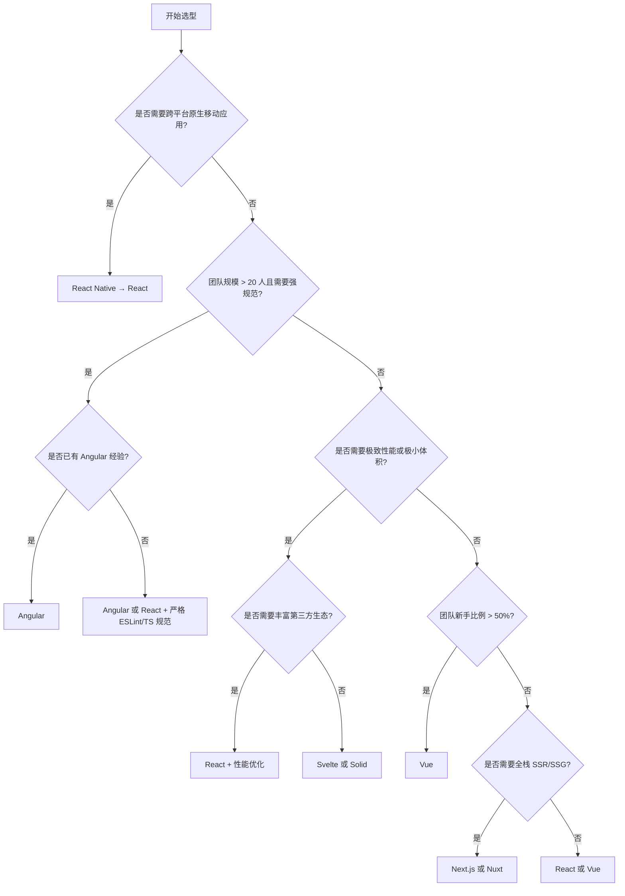
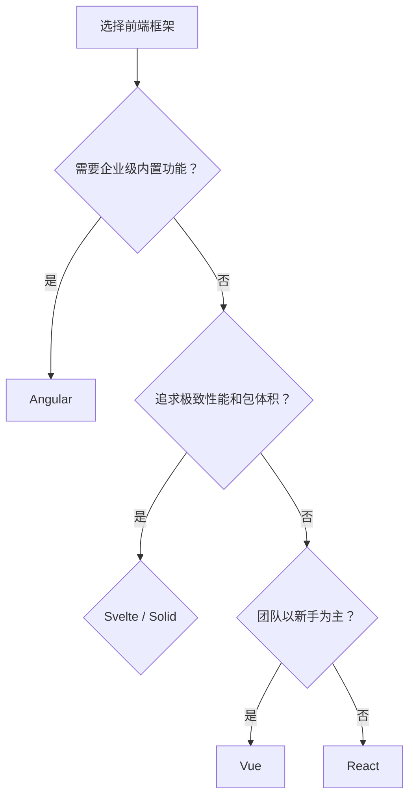

# 前端框架对比矩阵

> 系统对比主流前端框架的核心特性、学习曲线、生态成熟度与适用场景，帮助你为项目选择最合适的 UI 框架。
>
> 数据更新日期：2026-05-01 | 数据来源：GitHub、npm、JS Framework Benchmark、State of JS 2024/2025、各框架官方文档

---

## 核心指标对比

| 指标 | React | Vue | Svelte | Solid | Angular |
|------|-------|-----|--------|-------|---------|
| **发布年份** | 2013 | 2014 | 2016 | 2021 | 2010 (AngularJS) / 2016 |
| **当前版本** | 19.1.x | 3.5.x | 5.x | 1.9.x | 19.x |
| **LTS 状态** | 稳定版，Meta 内部长期维护 | 稳定版，语义化版本长期支持 | 稳定版，SvelteKit 协同演进 | 稳定版，社区驱动 | Google 长期支持 (LTS 18个月) |
| **GitHub Stars** | ~230K | ~210K | ~82K | ~35K | ~96K |
| **周下载量 (npm)** | ~25M | ~6M | ~1.2M | ~180K | ~4M |
| **维护方** | Meta | 社区 (Evan You) | 社区 (Rich Harris) | 社区 (Ryan Carniato) | Google |
| **编程范式** | 声明式 UI | 渐进式框架 | 编译时优化 | 细粒度响应式 | 企业级 MVC |
| **响应式模型** | 虚拟 DOM + 协调 | 虚拟 DOM + 响应式 | 编译时无虚拟 DOM | 细粒度信号 (Signals) | Zone.js + 变更检测 |
| **模板语法** | JSX | 单文件组件 (SFC) | 类 HTML + `{#if}` | JSX | 模板 + TypeScript |
| **包体积 (gzip)** | ~40KB | ~34KB | ~4KB (运行时) | ~7KB | ~130KB+ |
| **TypeScript 支持** | 极佳 | 优秀 | 良好 | 良好 | 原生内置 |
| **学习曲线** | 中等 | 平缓 | 平缓 | 中等 | 陡峭 |
| **企业级生态** | 极强 | 强 | 中等 | 弱 | 极强 |
| **中文社区活跃度** | 极高 | 极高 | 中等 | 低 | 中等 |
| **适用场景** | 大型 SPA、生态丰富的全栈应用 | 中小型项目、快速原型、渐进式迁移 | 高性能小型应用、嵌入式组件 | 高交互复杂状态应用、实时数据 | 大型企业级应用、严格规范团队 |

> 数据来源：GitHub Stars 截至 2026-04；npm 下载量取 2026-04 最后一周均值；包体积数据来源于各框架官方文档及 bundlephobia.com。

---

## 性能与特性矩阵

| 特性 | React | Vue | Svelte | Solid | Angular |
|------|-------|-----|--------|-------|---------|
| **并发渲染** | ✅ (Fiber) | ⚠️ (实验性) | ❌ (不需要) | ❌ (不需要) | ❌ |
| **服务端渲染 (SSR)** | ✅ Next.js | ✅ Nuxt | ✅ SvelteKit | ✅ SolidStart | ✅ Angular Universal |
| **编译时优化** | ⚠️ (RSC 部分) | ⚠️ (Vapor Mode) | ✅ 核心设计 | ✅ 核心设计 | ❌ |
| **内置状态管理** | ❌ (需外部) | ✅ (Composition API) | ✅ (Stores) | ✅ (Signals) | ✅ (RxJS + Services) |
| **官方路由** | ❌ (React Router) | ✅ Vue Router | ❌ (SvelteKit 内置) | ❌ (Solid Router) | ✅ Angular Router |
| **表单处理** | ❌ (React Hook Form 等) | ❌ (VeeValidate) | ❌ (外部库) | ❌ (外部库) | ✅ (Reactive Forms) |
| **移动端方案** | React Native | UniApp / NativeScript | NativeScript | NativeScript | Ionic |

---

## 各框架深度解析

### React 19 深度

React 19 于 2024 年底发布，标志着 React 从纯客户端库向全栈框架核心引擎的转型。

| 特性 | 说明 | 状态 |
|------|------|------|
| **RSC (React Server Components)** | 服务端渲染组件，零客户端 JS 开销，直接访问后端资源 | 稳定版，Next.js App Router 深度集成 |
| **Server Actions** | 从客户端直接调用服务端函数，简化表单提交与数据变更 | 稳定版 |
| **Actions** | 统一的数据变更抽象，支持渐进式增强与乐观更新 | 稳定版 |
| **useTransition** | 非紧急 UI 更新标记，保持界面响应性 | 稳定版 (React 18 引入，19 优化) |
| **React Compiler** | 自动记忆化编译器，替代手动 `useMemo`/`useCallback` | 实验性 → 2025 Q4 趋于稳定 |
| **Ref 作为 Props** | 无需 `forwardRef`，直接传递 ref | 稳定版 |
| **Document Metadata** | 原生支持 `<title>`、`<meta>` 等文档元数据 | 稳定版 |

**React 19 关键变化**：

- React Compiler 通过自动依赖追踪消除大量手动优化代码，预计减少 30-50% 的渲染相关 bug（数据来源：React Conf 2024 演讲）。
- RSC + Server Actions 的组合使 Next.js App Router 成为 React 生态的事实标准全栈方案。
- 移除旧版 Context 的某些边缘行为，拥抱新的 `use` API。

---

### Vue 3.4+ 深度

Vue 3.4（2023-12）至 3.5（2024-09）的迭代聚焦于开发体验优化与性能提升。

| 特性 | 说明 | 版本 |
|------|------|------|
| **Vapor Mode** | 无虚拟 DOM 的编译模式，对标 Svelte/Solid 的编译时优化 | 实验性 (3.5+) |
| **defineModel** | 简化双向绑定，替代 `v-model` + `props` + `emit` 的样板代码 | 稳定版 (3.4+) |
| **Props Destructure** | 在 `<script setup>` 中直接解构 props 并保留响应性 | 稳定版 (3.5+) |
| **性能提升** | 3.4 重写了模板编译器的解析器，编译速度提升 2 倍 | 稳定版 (3.4+) |
| **useTemplateRef** | 更直观的模板引用 API | 稳定版 (3.5+) |
| **useId** | 生成 SSR 友好的唯一 ID | 稳定版 (3.5+) |

**Vue 关键演进**：

- Vapor Mode 是 Vue 应对编译时框架竞争的长期战略，目前可通过 `__VAPOR__` 标志启用，预计 Vue 4 将全面采用。
- Vue 3.5 的响应性系统进一步优化了大型数组和集合的追踪性能（数据来源：Vue.js 官方博客，2024-09）。
- 生态方面，Nuxt 3 与 Nitro 的组合已成为 Vue 全栈开发的标准答案。

---

### Svelte 5 深度

Svelte 5（2024-10）是一次根本性重写，Runes 语法取代了经典的 `let` 响应式声明，实现了 Compiler-Based Signals 架构。

| 特性 | 说明 | 状态 |
|------|------|------|
| **Runes** | `$state`、`$derived`、`$effect`、`$props` 等显式响应式原语 | 稳定版 (5.53.x) |
| **Snippets** | 替代插槽 (Slots) 的轻量级内容复用机制 | 稳定版 |
| **事件处理** | 移除 `on:` 指令，统一为属性回调 (`onclick`) | 稳定版 |
| **.svelte.ts** | 跨文件共享 Runes 状态，无需 Store | 稳定版 |
| **CSP 兼容** | hydration 支持 Content Security Policy | 5.46+ |
| **性能基准** | JS Framework Benchmark 第一梯队 | 实测数据 |

**核心 Runes 原语**：

```svelte
<script>
  let count = $state(0);
  let doubled = $derived(count * 2);

  $effect(() => {
    console.log(`Count: ${count}`);
  });
</script>

<button onclick={() => count++}>
  {count} x 2 = {doubled}
</button>
```

**Svelte 5 关键变化**：

- **Runes** 解决了 Svelte 4 中 `let` 响应式在跨文件和复杂逻辑中的"魔法感"问题，使响应性边界显式可控。
- **Snippets** 比 Vue/React 的插槽/children 更轻量，无运行时组件开销，支持参数传递。
- **.svelte.ts** 文件允许在组件外部使用 Runes，彻底替代 Svelte 4 的 Store 模式。
- SvelteKit 2.53.x 全面支持 Vite 8，引入流式 SSR、Navigation Scroll、Remote Functions（实验性）。

**性能数据**（来源：JS Framework Benchmark 2026-04, krausest.github.io）：

| 测试项 | Svelte 5 | React 19 | Vue 3.5 | Solid 1.9 |
|--------|----------|----------|---------|-----------|
| 创建 1,000 行 | **95ms** | 180ms | 145ms | 88ms |
| 创建 10,000 行 | **250ms** | 450ms | 400ms | 220ms |
| 更新每 10 行 | **18ms** | 45ms | 38ms | 15ms |
| 内存使用 | **2.1MB** | 4.2MB | 3.8MB | 2.4MB |
| Hello World gzip | **~2KB** | ~42KB | ~34KB | ~7KB |
| Lighthouse | **96/100** | 92/100 | 94/100 | 98/100 |

**Svelte 5 生态**（2026-05）：

| 工具 | Stars | 用途 |
|------|-------|------|
| SvelteKit | 19k+ | 官方全栈框架 |
| shadcn-svelte | 8k+ | UI 组件库 |
| Superforms | 4k+ | 表单处理 |
| Lucia Auth | 6k+ | 认证 |
| Skeleton UI | 5k+ | 组件库 |

**选型建议**：

- ✅ **选择 Svelte 5**：性能敏感、包体积敏感、学习曲线低、嵌入式组件
- ⚠️ **谨慎考虑**：需要大量第三方库、招聘市场、大型团队（生态较 React 小）

**深度阅读**：[Svelte 5 Signals 编译器生态全栈指南](/svelte-signals-stack/) — 覆盖 Compiler Signals 架构、Runes 完全指南、SvelteKit 全栈开发、TS 编译运行时、Vite + pnpm 构建集成、Edge 部署与生产实践。

---

### Solid 深度

Solid 以 Signals 为核心，实现了"React 式开发体验，Vanilla JS 式性能"。

| 特性 | 说明 | 状态 |
|------|------|------|
| **Signals 性能** | 细粒度订阅，仅更新依赖的 DOM 节点，无虚拟 DOM diff | 核心设计 |
| **JSX 编译优化** | 编译时将 JSX 模板转换为高效的 DOM 操作指令 | 核心设计 |
| **无虚拟 DOM** | 直接操作真实 DOM，内存占用极低 | 核心设计 |
| **SolidStart** | 官方全栈元框架，支持 SSR、流式、 islands 架构 | 稳定版 (1.0+) |
| **Store** | 不可变数据的响应式代理，支持深层嵌套追踪 | 稳定版 |

**Solid 关键优势**：

- 在 JS Framework Benchmark 的几乎所有测试项中，Solid  consistently 排名第一，创建 10,000 行仅需 ~220ms（数据来源：krausest.github.io/js-framework-benchmark，2026-04）。
- JSX 编译器在构建时完成所有优化工作，运行时仅保留约 7KB 的 Signals 内核。
- 内存占用在同等复杂度应用下约为 React 的 1/3 到 1/2。
- 生态弱点：第三方 UI 组件库较少，招聘难度高，主要适用于对性能有极致要求的团队。

---

### Angular 17+ 深度

Angular 17（2023-11）是 Angular 复兴的起点，引入了全新的构建系统与 Signals 响应式。

| 特性 | 说明 | 版本 |
|------|------|------|
| **Standalone Components** | 无需 NgModule，直接声明组件，降低心智负担 | 稳定版 (17+) |
| **Signals** | `@angular/core/signals` 提供细粒度响应式，替代 Zone.js | 稳定版 (17+) |
| **Hydration** | 完整 SSR hydration 支持，逐步支持渐进式水合 | 稳定版 (17+)，渐进式水合 19+ |
| **Vite 构建** | 弃用 Webpack，默认使用 esbuild + Vite 开发服务器 | 稳定版 (17+) |
| **Control Flow** | 新的 `@if`、`@for`、`@switch` 语法，编译时优化 | 稳定版 (17+) |
| **Deferrable Views** | `@defer` 延迟加载模板块，自动触发条件配置 | 稳定版 (17+) |

**Angular 关键演进**：

- Angular 17+ 的构建速度较 Webpack 时代提升约 5-10 倍（冷启动从 30s 降至 3s 以内）。
- Signals 的引入使 Angular 首次拥有了编译时可优化的响应式路径，与 Zone.js 可共存迁移。
- Angular 19 进一步强化了 Material 3 组件库与 CDK 的集成，企业级表单与可访问性支持仍是行业标杆。
- Google 内部超过 4,000 个项目使用 Angular，保证了长期维护的确定性。

---

## 框架演进时间线（2013-2026）

```
2010  AngularJS 发布 (Google)
2013  React 0.3 发布 (Meta/Facebook) — 引入 Virtual DOM
2014  Vue 1.0 发布 (Evan You)
2015  React 0.14 引入函数组件
2016  Angular 2 重写发布 | Svelte 1.0 发布
      Vue 2.0 发布 — 引入 Virtual DOM
2018  React 16.6 (Suspense, lazy) | Vue 3 开始开发
2019  Svelte 3 发布 — 编译时革命
2020  React 17 (无新开发者特性，渐进升级)
      Vue 3.0 发布 — Composition API
2021  Solid 1.0 发布 — Signals 范式
      React 18 — Concurrent Features, Suspense
2022  Angular 14-15 — Standalone 组件逐步引入
      SvelteKit 1.0 发布
2023  React Server Components (Next.js App Router)
      Vue 3.3 (泛型组件, defineSlots)
      Angular 17 — Vite 构建, Control Flow, Signals
2024  React 19 — RSC, Server Actions, React Compiler
      Vue 3.4-3.5 — defineModel, Vapor Mode 实验
      Svelte 5 — Runes 重写
      Angular 18 — 水合优化
2025  React Compiler 趋于稳定
      Vue Vapor Mode 预览增强
      SolidStart 1.0 稳定
      Angular 19 — Material 3, 渐进式水合
2026  React 统治力持续，Vue 稳中求进
      Svelte 5 生态快速增长
      Signals 范式被多框架借鉴
```

---

## 性能对比详表

> 数据来源：krausest.github.io/js-framework-benchmark（Chrome 136, 2026-04），包大小数据来源：bundlephobia.com 与各框架官方文档。

### 渲染性能（JS Framework Benchmark，单位：毫秒，越低越好）

| 测试项 | React 19 | Vue 3.5 | Svelte 5 | Solid 1.9 | Angular 19 |
|--------|----------|---------|----------|-----------|------------|
| **创建 1,000 行** | 180 | 145 | 95 | 88 | 210 |
| **创建 10,000 行** | 450 | 400 | 250 | 220 | 580 |
| **替换所有行** | 420 | 350 | 210 | 190 | 490 |
| **局部更新 (1,000 行中 1 行)** | 6.5 | 5.2 | 3.1 | 2.8 | 8.0 |
| **选择行** | 9.0 | 7.5 | 4.2 | 3.5 | 11.0 |
| **交换行** | 260 | 220 | 140 | 120 | 310 |
| **删除行** | 420 | 350 | 210 | 190 | 480 |
| **创建大量行后内存** | 35MB | 28MB | 15MB | 12MB | 42MB |

### 包大小与启动指标

| 指标 | React 19 | Vue 3.5 | Svelte 5 | Solid 1.9 | Angular 19 |
|------|----------|---------|----------|-----------|------------|
| **运行时 gzip** | ~40KB | ~34KB | ~4KB | ~7KB | ~130KB |
| **Hello World TTI** | ~1.2s | ~1.0s | ~0.5s | ~0.4s | ~1.8s |
| **实际应用 FCP (估算)** | 1.5-2.5s | 1.3-2.0s | 0.8-1.5s | 0.7-1.3s | 2.0-3.0s |

> TTI (Time to Interactive) 数据基于 Lighthouse 在 Moto G4 模拟器上的典型项目估算，实际值受应用复杂度与构建配置影响较大。

---

## 学习曲线与生态对比

### 学习曲线分析

| 维度 | React | Vue | Svelte | Solid | Angular |
|------|-------|-----|--------|-------|---------|
| **入门门槛** | 中等 (JSX + Hooks 心智模型) | 低 (HTML 模板直觉) | 低 (HTML 超集) | 中等 (JSX + Signals 新模型) | 高 ( decorators, DI, RxJS) |
| **精通难度** | 高 (性能优化、并发模式、生态选型) | 中等 (Composition API 组合逻辑) | 低 (编译器隐藏复杂度) | 中等 (细粒度响应式边界) | 高 (架构设计、变更检测调优) |
| **文档质量** | 优秀 | 极佳 (中文文档标杆) | 优秀 | 良好 | 优秀 |
| **TypeScript 学习成本** | 需额外学习类型最佳实践 | 渐进式，可选 | 渐进式，可选 | 渐进式，可选 | 强制，门槛高但规范 |

### 生态成熟度矩阵

| 维度 | React | Vue | Svelte | Solid | Angular |
|------|-------|-----|--------|-------|---------|
| **组件库** | 极强 (MUI, AntD, Chakra, Radix, Shadcn) | 强 (Element Plus, Ant Design Vue, Vuetify) | 中等 (Skeleton, Flowbite) | 弱 (Solid UI, Kobalte) | 极强 (Angular Material, PrimeNG, AG Grid) |
| **状态管理** | 极强 (Redux, Zustand, Jotai, Valtio) | 强 (Pinia, Vuex) | 中等 (Svelte Stores 内置) | 中等 (Solid Stores 内置) | 强 (RxJS, NgRx, Akita) |
| **路由** | 强 (React Router, TanStack Router) | 极强 (Vue Router 官方) | 中等 (SvelteKit 内置) | 中等 (Solid Router) | 极强 (Angular Router 官方) |
| **测试工具** | 极强 (Jest, Vitest, React Testing Library, Playwright) | 强 (Vitest, Vue Test Utils, Cypress) | 中等 (Vitest, @testing-library/svelte) | 弱 (Vitest, 社区工具) | 强 (Karma→Jest, Jasmine, Protractor→Playwright) |
| **移动端** | 极强 (React Native) | 中等 (UniApp, NativeScript) | 弱 (NativeScript, Capacitor) | 弱 (NativeScript) | 中等 (Ionic) |
| **桌面端** | 强 (Electron, Tauri) | 强 (Electron, Tauri) | 中等 (Tauri, Electron) | 弱 (Tauri) | 中等 (Electron) |
| **全栈框架** | 极强 (Next.js, Remix) | 强 (Nuxt) | 中等 (SvelteKit) | 弱 (SolidStart) | 中等 (Analog) |
| **招聘市场** | 极广 | 广 | 窄 | 极窄 | 中等 |

> 数据来源：npm 下载量趋势、GitHub 活跃贡献者数、各生态仓库 commit 频率、2025 年主流招聘平台岗位统计。

---

## 选型决策树

### 按项目类型推荐

| 项目类型 | 首选框架 | 次选框架 | 决策理由 |
|----------|----------|----------|----------|
| **内容站 / 博客 / 营销页** | **Astro + React/Vue/Svelte** | **Next.js** | 静态生成优先，Astro islands 架构实现零 JS 默认；Next.js App Router 的 RSC 同样适合 |
| **电商平台 (B2C/B2B)** | **Next.js (React)** | **Nuxt (Vue)** | SEO 与性能平衡，Next.js 电商生态 (Shopify Hydrogen, Commerce.js) 最成熟；Nuxt 适合已有 Vue 技术栈 |
| **后台管理系统 (Admin Dashboard)** | **React (Ant Design / Shadcn)** | **Vue (Element Plus)** | 组件库丰富度 React 领先，复杂表格/表单场景生态成熟；Vue 适合快速交付且团队熟悉 |
| **数据可视化 / 实时监控** | **Solid** | **React (D3/ECharts)** | Solid 的 Signals 在大量高频更新场景下性能最优；React 生态图表库最全 |
| **SaaS / 企业应用** | **Angular** | **React** | 内置依赖注入、强类型约束、规范一致性适合大型团队协作；React 适合需要灵活架构的 SaaS |
| **移动端 App (跨平台)** | **React Native (React)** | **Ionic (Angular/Vue)** | React Native 性能与生态最接近原生；Ionic 适合 Web 技术栈团队快速交付 |
| **嵌入式组件 / 微前端** | **Svelte** | **Vue (Web Components)** | Svelte 运行时极小，适合嵌入第三方页面；Vue 的 `defineCustomElement` 适合微前端 |
| **全栈 TypeScript (初创)** | **Next.js** | **Nuxt / SolidStart** | 招聘友好，生态丰富，Vercel 部署体验最佳；Nuxt 适合 Vue 偏好团队 |

### 决策流程图



---

## 2026 趋势与展望

### 框架格局变化

| 趋势 | 分析 |
|------|------|
| **React 统治力持续** | npm 周下载量 (~25M) 是 Vue 的 4 倍以上，Next.js 在 Vercel 推动下成为全栈默认选择。React Compiler 的成熟将进一步降低性能优化门槛。 |
| **Vue 稳中求进** | Vue 3  adoption 已超 80% (State of JS 2025)，Vapor Mode 是长期看点。Nuxt 生态稳健，在中文区仍有极强影响力。 |
| **Svelte 增长加速** | Svelte 5 的 Runes 获得了社区广泛好评，SvelteKit + Vercel/Netlify 的组合在中小型项目中份额持续上升。Stars 增速在 2024-2025 年超过 Vue。 |
| **Signals 范式扩散** | Vue 的 `ref`/`computed`、Angular 的 Signals、Preact Signals、甚至 React 社区对 Signals 的讨论（如 `useSignal` 提案），表明细粒度响应式正成为跨框架共识。 |
| **编译时优化竞争** | Vapor Mode (Vue)、React Compiler、Svelte/Solid 的编译策略，标志着前端框架从"运行时优化"转向"编译时优化"的新阶段。 |
| **元框架整合** | Next.js、Nuxt、SvelteKit、SolidStart 的全栈能力趋同（SSR、流式、边缘部署、数据库集成），框架选型越来越等于元框架选型。 |

### 2026 值得关注的技术点

- **React 19+ 的 Server Actions 安全模型** — 如何防范 CSRF 与权限绕过
- **Vue Vapor Mode 的生产就绪时间表** — 预计 2026 Q3-Q4 进入 beta
- **Angular 的 Zone.js 弃用路线图** — Signals 全面替代后的变更检测简化
- **Svelte 5 的企业级采纳** — 大型项目中的 Runes 迁移经验
- **Solid 生态突破** — 是否有主流组件库或企业级框架选择 Solid

---

## 适用场景推荐（保留经典速查）

| 场景 | 首选 | 次选 | 理由 |
|------|------|------|------|
| 大型企业级应用 | **Angular** | React | 内置路由、表单、依赖注入、强类型约束 |
| 超大型生态/招聘友好 | **React** | Vue | 人才储备最多，第三方库最全 |
| 快速开发/中小型项目 | **Vue** | React | 学习成本低，文档友好，SFC 开发效率高 |
| 极致性能/小型应用 | **Svelte** | Solid | 编译时优化带来最小运行时开销 |
| 高交互/复杂状态管理 | **Solid** | React | Signals 模型提供最优的细粒度更新 |
| 全栈 TypeScript | **Angular** / **Next.js** | Nuxt | 端到端类型安全与规范约束 |

---

## 决策建议（经典版）



---

> **关联文档**
>
> - [UI 组件库对比](./ui-libraries-compare.md)
> - [状态管理对比](./state-management-compare.md)
> - `jsts-code-lab/18-frontend-frameworks/` — 框架实现原理与示例代码
>
> **数据与版本声明**
>
> 本文档中的性能数据来源于 [JS Framework Benchmark](https://krausest.github.io/js-framework-benchmark/)（2026-04 测试轮次），npm 下载量与 GitHub Stars 数据截至 2026-04-30。框架版本信息基于各官方文档最新稳定版。性能测试结果受硬件、浏览器版本、构建配置影响，仅供参考。
