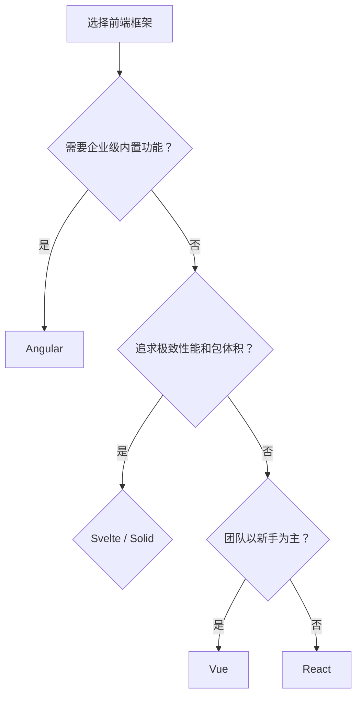

# 前端框架对比矩阵

> 系统对比主流前端框架的核心特性、学习曲线、生态成熟度与适用场景，帮助你为项目选择最合适的 UI 框架。

---

## 核心指标对比

| 指标 | React | Vue | Svelte | Solid | Angular |
|------|-------|-----|--------|-------|---------|
| **发布年份** | 2013 | 2014 | 2016 | 2021 | 2010 (AngularJS) / 2016 |
| **维护方** | Meta | 社区 (Evan You) | 社区 (Rich Harris) | 社区 (Ryan Carniato) | Google |
| **编程范式** | 声明式 UI | 渐进式框架 | 编译时优化 | 细粒度响应式 | 企业级 MVC |
| **响应式模型** | 虚拟 DOM + 协调 | 虚拟 DOM + 响应式 | 编译时无虚拟 DOM | 细粒度信号 (Signals) | Zone.js + 变更检测 |
| **模板语法** | JSX | 单文件组件 (SFC) | 类 HTML + `{#if}` | JSX | 模板 + TypeScript |
| **包体积 (gzip)** | ~40KB | ~34KB | ~4KB (运行时) | ~7KB | ~130KB+ |
| **TypeScript 支持** | 极佳 | 优秀 | 良好 | 良好 | 原生内置 |
| **学习曲线** | 中等 | 平缓 | 平缓 | 中等 | 陡峭 |
| **企业级生态** | 极强 | 强 | 中等 | 弱 | 极强 |
| **中文社区活跃度** | 极高 | 极高 | 中等 | 低 | 中等 |

---

## 性能与特性矩阵

| 特性 | React | Vue | Svelte | Solid | Angular |
|------|-------|-----|--------|-------|---------|
| **并发渲染** | ✅ (Fiber) | ⚠️ (实验性) | ❌ (不需要) | ❌ (不需要) | ❌ |
| **服务端渲染 (SSR)** | ✅ Next.js | ✅ Nuxt | ✅ SvelteKit | ✅ SolidStart | ✅ Angular Universal |
| **编译时优化** | ⚠️ (RSC 部分) | ⚠️ (Vapor Mode) | ✅ 核心设计 | ✅ 核心设计 | ❌ |
| **内置状态管理** | ❌ (需外部) | ✅ (Composition API) | ✅ (Stores) | ✅ (Signals) | ✅ (RxJS + Services) |
| **官方路由** | ❌ (React Router) | ✅ Vue Router | ❌ (SvelteKit 内置) | ❌ (Solid Router) | ✅ Angular Router |
| **表单处理** | ❌ (React Hook Form 等) | ❌ (VeeValidate) | ❌ (外部库) | ❌ (外部库) | ✅ (Reactive Forms) |
| **移动端方案** | React Native | UniApp / NativeScript | NativeScript | NativeScript | Ionic |

---

## 适用场景推荐

| 场景 | 首选 | 次选 | 理由 |
|------|------|------|------|
| 大型企业级应用 | **Angular** | React | 内置路由、表单、依赖注入、强类型约束 |
| 超大型生态/招聘友好 | **React** | Vue | 人才储备最多，第三方库最全 |
| 快速开发/中小型项目 | **Vue** | React | 学习成本低，文档友好，SFC 开发效率高 |
| 极致性能/小型应用 | **Svelte** | Solid | 编译时优化带来最小运行时开销 |
| 高交互/复杂状态管理 | **Solid** | React | Signals 模型提供最优的细粒度更新 |
| 全栈 TypeScript | **Angular** / **Next.js** | Nuxt | 端到端类型安全与规范约束 |

---

## 决策建议

---

> **关联文档**
>
> - [UI 组件库对比](./ui-libraries-compare.md)
> - [状态管理对比](./state-management-compare.md)
> - `jsts-code-lab/18-frontend-frameworks/` — 框架实现原理与示例代码