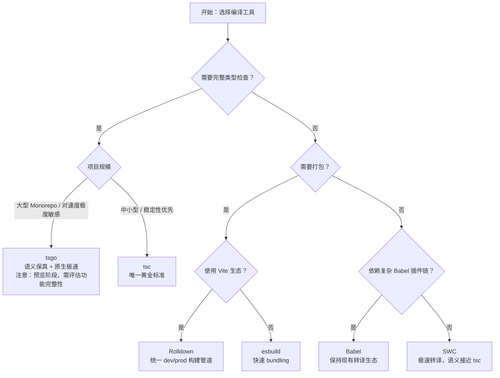

# JavaScript / TypeScript 编译器与转译器对比矩阵

> 最后更新：2026 年 4 月

## 引言

本矩阵聚焦**编译语义**维度，而非单纯的功能罗列。开发者在使用 TypeScript 时，往往面临"转译结果是否 100% 等价于 `tsc`"的隐性问题。不同工具对类型擦除、装饰器展开、模块降级等关键语义的处理存在差异，这些差异会直接影响运行时行为与调试体验。本文通过 6 款主流工具的横向对比，帮助你在速度与语义保真度之间做出理性权衡。

## 核心对比表

| 维度 | tsc | Babel | SWC | esbuild | Rolldown | tsgo (TypeScript 7.0) |
|------|-----|-------|-----|---------|----------|----------------------|
| **类型擦除策略** | 🟢 100% 标准语义 | 🟡 高度兼容，存在 `const enum` / `namespace` 等 edge cases | 🟡 高度兼容，极少数枚举 / `using` 差异 | 🟡 基本兼容，`enum` 与命名空间处理有差异 | 🟡 基于 Oxc，快速但部分边界场景仍在完善 | 🟢 目标 100% tsc 兼容（预览阶段已接近） |
| **装饰器支持** | 🟢 Legacy + Stage 3 双模式 | 🟢 通过插件分别支持两种模式 | 🟢 Legacy + Stage 3 | 🟡 Stage 3 为主，legacy 支持有限 | 🟡 Oxc 对 Stage 3 装饰器 lowering 仍在完善 | 🟢 与 tsc 完全一致 |
| **模块语法降级** | 🟢 ESM→CJS / UMD / AMD | 🟢 高度可定制的 CJS 转换 | 🟢 ESM→CJS 等 | 🟢 内置多 format 输出 | 🟢 Bundler 级别，format 丰富 | 🟢 完整支持 |
| **Source Map 生成质量** | 🟢 列级精确 | 🟢 高质量，支持 inputSourceMap 链式 | 🟢 高质量 | 🟡 快但部分场景精度略低 | 🟢 基于 Oxc，精度良好 | 🟢 目标与 tsc 一致 |
| **增量编译 / 并行构建** | 🟡 增量编译（单线程） | 🔵 依赖外部构建工具缓存 | 🟢 原生并行 | 🟢 Go goroutine 原生并行 | 🟢 Rust 多线程并行 | 🟢 Go 共享内存并行 + 增量构建 |
| **与 `isolatedDeclarations` 兼容性** | 🟢 原生支持并强制执行 | ⚪ 不适用（不生成 .d.ts） | 🟡 实验性 .d.ts 生成支持 | ⚪ 不适用（不生成 .d.ts） | ⚪ 需插件生成 .d.ts | 🟢 原生支持 |
| **与 Node.js native TS (type stripping) 兼容性** | 🟢 可通过 `verbatimModuleSyntax` 严格限定 | 🟢 本质上处理 erasable syntax | 🟢 兼容 | 🟢 兼容 | 🟢 兼容 | 🟢 兼容 |
| **类型检查能力** | 🟢 完整类型检查 | 🔴 仅转译 | 🔴 仅转译 | 🔴 仅转译 | 🔴 仅转译 / 打包 | 🟢 完整类型检查（Go 原生实现） |
| **典型适用场景** | 库开发、语义敏感型项目 | 遗留项目、复杂插件链 | Next.js、大型应用 | 快速 bundling、工具链内部 | Vite 生态、现代 Web 应用 | 超大型 Monorepo、追求速度且不愿牺牲语义 |

## 逐工具语义分析

### tsc

作为 TypeScript 的参考实现，`tsc` 是语义保真度的唯一黄金标准。它同时负责类型检查与代码生成，因此在类型擦除、装饰器展开、模块降级等所有环节都保持绝对一致。对于需要发布 npm 库或运行时有严格语义要求的项目，`tsc` 仍是不二之选；其唯一的短板是大型项目下的单线程编译速度。

### Babel

`@babel/preset-typescript` 使 Babel 能够以极低的接入成本处理 `.ts` 文件，但它的定位是"JavaScript 转译器 + 类型语法剥离"。由于 Babel 不解析类型语义，`const enum` 的常量内联、命名空间合并等需要类型系统辅助的擦除行为，其结果可能与 `tsc` 存在细微差异；若项目中已经深度依赖 Babel 插件生态，建议搭配 `tsc --noEmit` 做独立类型检查。

### SWC

用 Rust 重写的 SWC 是目前生产环境中最成熟的"tsc 极速替代品"，在 Next.js 等框架中已默认采用。SWC 的类型擦除语义非常接近 `tsc`，日常开发中几乎不会遇到差异；但它仍然是一个纯转译器，不提供类型检查能力，因此需要与 `tsc` 或编辑器 LSP 配合工作。

### esbuild

esbuild 以 Go 语言实现了极快的解析与打包流水线，其类型擦除实现追求"足够好且足够快"。这意味着在 `enum` 常量折叠、`namespace` 合并、`export =` 等边缘语法上，esbuild 的输出可能与 `tsc` 不一致。它最适合作为构建工具链的内部依赖（如 Vite 的依赖预编译）或原型开发，而不推荐直接用于发布 TypeScript 库的编译。

### Rolldown

Rolldown 是 Vite 生态向 Rust 统一工具链迈进的关键一环，底层依托 Oxc 完成解析与转译。作为 bundler，它的核心优势在于用单一引擎替代了 esbuild + Rollup 的双引擎架构，消除了 dev/prod 构建行为差异；但在 2026 年 4 月，其装饰器 lowering 与部分高级 TypeScript 语义的实现仍处于快速迭代中，建议 Vite 8+ 用户优先尝试。

### tsgo (TypeScript 7.0 Go rewrite)

代号 Project Corsa 的 `tsgo` 是微软对 TypeScript 编译器的原生重写，目标是在保持 100% 语义兼容的前提下实现 10 倍以上的性能飞跃。截至 2026 年 4 月，tsgo 的 `noEmit` 类型检查与增量构建已具备早期生产可用性，但完整的 JS 产物输出、watch 模式与自定义插件 API 仍在收尾阶段，适合在大型 Monorepo 中作为 CI 加速的并行验证工具。

## 工程选型决策树

## 性能基准

### 转译速度对比 (10 万行 TypeScript)

| 工具 | 时间 | 相对 tsc | 内存占用 |
|------|------|---------|---------|
| **esbuild** | ~0.3s | 50x | ~200MB |
| **SWC** | ~0.8s | 20x | ~300MB |
| **Rolldown** | ~1.0s | 15x | ~250MB |
| **Babel** | ~1.7s | 10x | ~500MB |
| **tsc** | ~16.7s | 1x (基准) | ~1.5GB |
| **tsgo** | ~1.5s (类型检查) | 10x | ~300MB |

📊 来源: 各项目官方 benchmark (2026-04)

### 构建工具集成

| 工具 | Vite | Next.js | Rollup | Webpack | 独立使用 |
|------|:----:|:-------:|:------:|:-------:|:--------:|
| **tsc** | 类型检查 | 类型检查 | 类型检查 | 类型检查 | ✅ |
| **SWC** | ❌ | ✅ 默认 | ❌ | ❌ | ✅ |
| **esbuild** | ✅ 默认 | ⚠️ 可选 | ✅ | ⚠️ | ✅ |
| **Babel** | ❌ | ❌ | ✅ 插件 | ✅ 默认 | ✅ |
| **Rolldown** | ✅ 未来默认 | ❌ | ❌ | ❌ | ⚠️ |
| **tsgo** | ⚠️ 实验 | ❌ | ❌ | ❌ | ⚠️ |

## 2026 趋势

| 趋势 | 描述 |
|------|------|
| **tsgo Alpha → Beta** | 2026 Q4 发布 Beta，目标 10x 速度提升 |
| **Rolldown 1.0** | Vite 8 可能默认使用 Rolldown 替代 esbuild |
| **tsc 维护模式** | 功能冻结，专注 tsgo 迁移 |
| **SWC 巩固地位** | Next.js + Vercel 生态深度绑定 |
| **Node.js 原生 TS** | type stripping 成为运行标准 |
| **Oxc 统一工具链** | lint + format + build + minify 单一工具 |

## 参考资源

- [TypeScript 官方文档](https://www.typescriptlang.org/docs/) 📚
- [Babel TypeScript Preset](https://babeljs.io/docs/babel-preset-typescript) 📚
- [SWC 文档](https://swc.rs/docs/) 📚
- [esbuild 文档](https://esbuild.github.io/) 📚
- [Rolldown 文档](https://rolldown.rs/) 📚
- [Oxc 文档](https://oxc.rs/) 📚
- [TypeScript 7.0 / Project Corsa 公告](https://devblogs.microsoft.com/typescript/) 📚
- [Node.js TypeScript Type Stripping 文档](https://nodejs.org/api/typescript.html) 📚