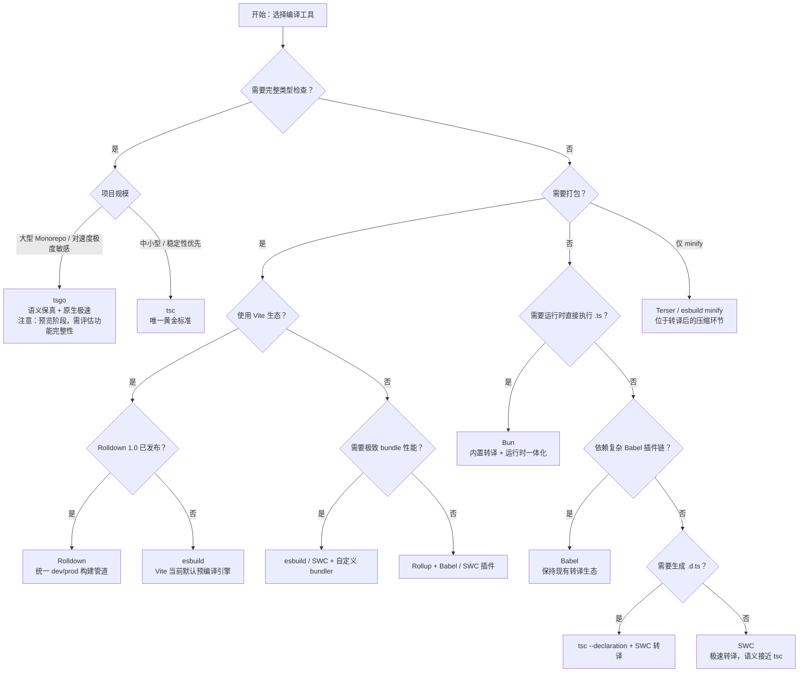

# JavaScript / TypeScript 编译器与转译器对比矩阵

> 最后更新：2026 年 4 月

## 引言

本矩阵聚焦**编译语义**维度，而非单纯的功能罗列。开发者在使用 TypeScript 时，往往面临"转译结果是否 100% 等价于 `tsc`"的隐性问题。不同工具对类型擦除、装饰器展开、模块降级等关键语义的处理存在差异，这些差异会直接影响运行时行为与调试体验。本文通过 8 款主流工具的横向对比，帮助你在速度与语义保真度之间做出理性权衡。

## 核心对比表

| 维度 | tsc | Babel | SWC | esbuild | Rolldown | Terser | Bun 内置转译 | tsgo (TypeScript 7.0) |
|------|-----|-------|-----|---------|----------|--------|-------------|----------------------|
| **类型擦除策略** | 🟢 100% 标准语义 | 🟡 高度兼容，存在 `const enum` / `namespace` 等 edge cases | 🟡 高度兼容，极少数枚举 / `using` 差异 | 🟡 基本兼容，`enum` 与命名空间处理有差异 | 🟡 基于 Oxc，快速但部分边界场景仍在完善 | 🔴 不涉及（仅 minify） | 🟡 基于 Zig 实现，与 tsc 高度一致 | 🟢 目标 100% tsc 兼容（预览阶段已接近） |
| **装饰器支持** | 🟢 Legacy + Stage 3 双模式 | 🟢 通过插件分别支持两种模式 | 🟢 Legacy + Stage 3 | 🟡 Stage 3 为主，legacy 支持有限 | 🟡 Oxc 对 Stage 3 装饰器 lowering 仍在完善 | 🔴 不涉及 | 🟢 Legacy + Stage 3 | 🟢 与 tsc 完全一致 |
| **模块语法降级** | 🟢 ESM→CJS / UMD / AMD | 🟢 高度可定制的 CJS 转换 | 🟢 ESM→CJS 等 | 🟢 内置多 format 输出 | 🟢 Bundler 级别，format 丰富 | 🔴 不涉及 | 🟢 支持 ESM / CJS 互转 | 🟢 完整支持 |
| **Source Map 生成质量** | 🟢 列级精确 | 🟢 高质量，支持 inputSourceMap 链式 | 🟢 高质量 | 🟡 快但部分场景精度略低 | 🟢 基于 Oxc，精度良好 | 🔴 仅支持 inputSourceMap 传递 | 🟢 精确 | 🟢 目标与 tsc 一致 |
| **增量编译 / 并行构建** | 🟡 增量编译（单线程） | 🔵 依赖外部构建工具缓存 | 🟢 原生并行 | 🟢 Go goroutine 原生并行 | 🟢 Rust 多线程并行 | 🔴 无编译过程 | 🟢 内置并行转译 | 🟢 Go 共享内存并行 + 增量构建 |
| **与 `isolatedDeclarations` 兼容性** | 🟢 原生支持并强制执行 | ⚪ 不适用（不生成 .d.ts） | 🟡 实验性 .d.ts 生成支持 | ⚪ 不适用（不生成 .d.ts） | ⚪ 需插件生成 .d.ts | ⚪ 不适用 | ⚪ 不适用（运行时转译） | 🟢 原生支持 |
| **与 Node.js native TS (type stripping) 兼容性** | 🟢 可通过 `verbatimModuleSyntax` 严格限定 | 🟢 本质上处理 erasable syntax | 🟢 兼容 | 🟢 兼容 | 🟢 兼容 | 🔴 不适用 | 🟢 兼容（Bun 自身支持 type stripping） | 🟢 兼容 |
| **类型检查能力** | 🟢 完整类型检查 | 🔴 仅转译 | 🔴 仅转译 | 🔴 仅转译 | 🔴 仅转译 / 打包 | 🔴 不涉及 | 🔴 仅转译 | 🟢 完整类型检查（Go 原生实现） |
| **JSX / TSX 处理** | 🟢 React / ReactNative / Preserve / react-jsx | 🟢 通过 preset 高度可配置 | 🟢 React / react-jsx | 🟢 React / react-jsx | 🟢 React / react-jsx | 🔴 不涉及 | 🟢 React / react-jsx | 🟢 与 tsc 一致 |
| **典型适用场景** | 库开发、语义敏感型项目 | 遗留项目、复杂插件链 | Next.js、大型应用 | 快速 bundling、工具链内部 | Vite 生态、现代 Web 应用 | 产物压缩 | Bun 运行时项目、脚本工具 | 超大型 Monorepo、追求速度且不愿牺牲语义 |

---

## 语义保真度深度对比

### 类型擦除（Type Erasure）

类型擦除是 TypeScript→JavaScript 转译的核心环节。各工具在以下语法点的处理存在显著差异：

| 语法特性 | tsc | Babel | SWC | esbuild | Rolldown (Oxc) | Bun | tsgo |
|---------|-----|-------|-----|---------|----------------|-----|------|
| **Interface / Type Alias** | 完全擦除 | 语法层面剥离 | 完全擦除 | 完全擦除 | 完全擦除 | 完全擦除 | 完全擦除 |
| **泛型参数** | 完全擦除 | 语法层面剥离 | 完全擦除 | 完全擦除 | 完全擦除 | 完全擦除 | 完全擦除 |
| **`const enum`** | 常量内联 | ❌ 不内联，保留为对象 | ✅ 常量内联 | ⚠️ 部分内联 | ⚠️ 部分支持 | ✅ 常量内联 | ✅ 常量内联 |
| **合并的 `namespace`** | 精确合并与擦除 | ⚠️ 可能生成多余 IIFE | ✅ 精确合并 | ⚠️ 简化处理，可能遗漏 | ⚠️ 仍在完善 | ✅ 精确合并 | ✅ 精确合并 |
| **`export =` / `import =`** | 完整 CJS 语义映射 | ⚠️ 需配置 `module` 选项 | ✅ 支持 | ⚠️ 有限支持 | ⚠️ 有限支持 | ✅ 支持 | ✅ 完整支持 |
| **`using` / `await using` (TS 5.2)** | 完整 lowering | ❌ 需依赖 polyfill | ✅ 支持 | ⚠️ 实验性支持 | ⚠️ 部分支持 | ✅ 支持 | ✅ 完整支持 |
| **访问修饰符擦除** | 完全擦除 | 完全擦除 | 完全擦除 | 完全擦除 | 完全擦除 | 完全擦除 | 完全擦除 |

> 📌 **实践建议**：若代码中大量使用 `const enum` 或合并命名空间，应避免使用 Babel 作为唯一转译工具，建议优先选择 SWC、Bun 或 tsc。

### 装饰器（Decorators）语义差异

TypeScript 同时支持 **Legacy 装饰器**（实验性，`experimentalDecorators`）与 **Stage 3 装饰器**（ECMAScript 标准提案）。不同工具的两种模式实现成熟度如下：

| 工具 | Legacy 装饰器 | Stage 3 装饰器 | 元数据（`emitDecoratorMetadata`） | 备注 |
|------|--------------|----------------|--------------------------------|------|
| **tsc** | ✅ 完整 | ✅ 完整 | ✅ 完整支持 | 唯一完整支持 metadata 的工具 |
| **Babel** | ✅ 需 `@babel/plugin-proposal-decorators` (legacy 配置) | ✅ 需 `version: "2023-05"` | ⚠️ 需额外插件，不完全等价 | 配置复杂，metadata 支持有限 |
| **SWC** | ✅ 完整 | ✅ 完整 | ⚠️ 部分支持 | 生产环境最成熟的非 tsc 方案 |
| **esbuild** | ⚠️ 有限 | ✅ 支持 | ❌ 不支持 | 不推荐使用 legacy 装饰器 |
| **Rolldown** | ⚠️ 有限 | ⚠️ Oxc 迭代中 | ❌ 不支持 | 2026 H2 预计完善 |
| **Bun** | ✅ 完整 | ✅ 完整 | ⚠️ 部分支持 | Zig 实现，速度极快 |
| **tsgo** | ✅ 完整 | ✅ 完整 | ✅ 完整支持 | 与 tsc 完全一致 |

> 📌 **实践建议**：若项目使用 `reflect-metadata` 或 NestJS / TypeORM 等重度依赖装饰器元数据的框架，**必须**使用 tsc 或 SWC，并开启 `emitDecoratorMetadata`。

### 模块降级（Module Lowering）差异

| 工具 | ESM | CJS | UMD | AMD | IIFE | SystemJS | 备注 |
|------|-----|-----|-----|-----|------|----------|------|
| **tsc** | ✅ | ✅ | ✅ | ✅ | ❌ | ✅ | `module` 配置决定输出 |
| **Babel** | ✅ | ✅ | ⚠️ 需插件 | ⚠️ 需插件 | ✅ | ✅ | 插件化，灵活但配置成本高 |
| **SWC** | ✅ | ✅ | ❌ | ❌ | ❌ | ❌ | 聚焦现代模块格式 |
| **esbuild** | ✅ | ✅ | ❌ | ❌ | ✅ | ❌ | bundler 场景为主 |
| **Rolldown** | ✅ | ✅ | ❌ | ❌ | ✅ | ❌ | 与 esbuild / Rollup 格式对齐 |
| **Bun** | ✅ | ✅ | ❌ | ❌ | ❌ | ❌ | 聚焦运行时场景 |
| **tsgo** | ✅ | ✅ | ✅ | ✅ | ❌ | ✅ | 与 tsc 格式对齐 |

> 📌 **实践建议**：需要发布 UMD 格式库（如浏览器 CDN 直接引用）时，tsc 或 Babel 是唯一可靠选择。纯 Node.js / 现代前端项目可忽略 UMD / AMD。

---

## Source Map 生成质量对比

Source Map 的精度直接决定调试体验。以下从 **生成速度、列映射精度、inputSourceMap 链式支持、源码内容内联** 四个维度对比：

| 工具 | 生成速度 | 列级精度 | inputSourceMap 链式 | sourcesContent 内联 | 备注 |
|------|---------|---------|--------------------|--------------------|------|
| **tsc** | 慢（单线程） | ✅ 精确到列 | ✅ 支持 | ✅ 支持 | 黄金标准，map 体积较大 |
| **Babel** | 中等 | ✅ 精确到列 | ✅ 支持 | ✅ 支持 | 与上游 map 无缝衔接 |
| **SWC** | 极快 | ✅ 精确到列 | ✅ 支持 | ✅ 支持 | 质量与速度兼顾 |
| **esbuild** | 极快 | ⚠️ 行级为主，列级偶有偏差 | ⚠️ 支持但简化 | ⚠️ 可选 | 速度与精度的权衡 |
| **Rolldown** | 极快 | ✅ 精确到列 | ✅ 支持 | ✅ 支持 | Oxc 生成质量接近 SWC |
| **Terser** | 中等 | ⚠️ 行级（minify 后列偏移） | ✅ 支持 | ✅ 支持 | minify 后 map 需重新校准 |
| **Bun** | 极快 | ✅ 精确到列 | ✅ 支持 | ✅ 支持 | Zig 实现，质量优秀 |
| **tsgo** | 快 | ✅ 精确到列 | ✅ 支持 | ✅ 支持 | 目标与 tsc 一致 |

> 📌 **实践建议**：
>
> - 生产环境调试（Sentry 等错误追踪）：优先使用 SWC、Rolldown 或 tsc，避免 esbuild 的列偏差导致堆栈映射错位。
> - minify 环节：Terser / esbuild minify 会改变列号，建议仅在最后一步生成 source map，或启用 `--source-map-include-sources`。

---

## 增量编译与 Watch 模式对比

| 工具 | 增量编译 | Watch 模式 | 持久化缓存 | 并行处理 | 典型增量性能 |
|------|---------|-----------|-----------|---------|-------------|
| **tsc** | ✅ `--incremental` | ✅ `--watch` | ✅ `.tsbuildinfo` | ❌ 单线程 | 修改 1 文件：1~3s |
| **Babel** | ❌ 本身无增量 | ⚠️ 依赖 `@babel/cli --watch` 或构建工具 | ❌ | ❌ 单线程 | 依赖外部缓存 |
| **SWC** | ✅ `@swc/cli --watch` | ✅ `--watch` | ⚠️ 内存缓存 | ✅ 多线程 | 修改 1 文件：<100ms |
| **esbuild** | ✅ 原生增量 | ✅ `--watch` | ✅ 内存 + 磁盘缓存 | ✅ goroutine | 修改 1 文件：<50ms |
| **Rolldown** | ✅ 原生增量 | ✅ `--watch` | ✅ 内存 + 磁盘缓存 | ✅ Rust 多线程 | 修改 1 文件：<50ms |
| **Terser** | ❌ 不涉及 | ❌ 不涉及 | ❌ | ❌ | — |
| **Bun** | ✅ 内置增量 | ✅ `--watch` | ✅ 内存缓存 | ✅ 并行 | 修改 1 文件：<50ms |
| **tsgo** | ✅ 原生增量 | ⚠️ 预览阶段逐步完善 | ✅ 磁盘缓存 | ✅ Go 并行 | 修改 1 文件：<200ms |

> 📌 **实践建议**：大型 Monorepo 中，tsc 的 `.tsbuildinfo` 配合 Project References 是目前最稳定的增量方案；开发服务器场景下，SWC / esbuild / Rolldown 的 Watch 模式能提供接近实时的反馈（<100ms）。

---

## 输出格式支持矩阵

| 工具 | ESM (`.mjs`) | CJS (`.cjs`) | UMD | IIFE | AMD | SystemJS | JSON 导入 | Wasm 导入 | CSS 导入 |
|------|:------------:|:------------:|:---:|:----:|:---:|:--------:|:---------:|:---------:|:--------:|
| **tsc** | ✅ | ✅ | ✅ | ❌ | ✅ | ✅ | ⚠️ 仅类型声明 | ❌ | ❌ |
| **Babel** | ✅ | ✅ | ⚠️ | ✅ | ⚠️ | ✅ | ⚠️ | ❌ | ❌ |
| **SWC** | ✅ | ✅ | ❌ | ❌ | ❌ | ❌ | ⚠️ | ❌ | ❌ |
| **esbuild** | ✅ | ✅ | ❌ | ✅ | ❌ | ❌ | ✅ | ⚠️ | ⚠️ |
| **Rolldown** | ✅ | ✅ | ❌ | ✅ | ❌ | ❌ | ✅ | ⚠️ | ⚠️ |
| **Terser** | ✅ | ✅ | ✅ | ✅ | ✅ | ✅ | ✅ | ✅ | ✅ | 🔴 仅压缩已有代码 |
| **Bun** | ✅ | ✅ | ❌ | ❌ | ❌ | ❌ | ✅ | ⚠️ | ⚠️ |
| **tsgo** | ✅ | ✅ | ✅ | ❌ | ✅ | ✅ | ⚠️ | ❌ | ❌ |

---

## JSX / TSX 处理对比

| 工具 | `react` transform | `react-jsx` (自动 runtime) | `react-native` | `preserve` | 工厂函数配置 | `jsxImportSource` 支持 |
|------|:-----------------:|:--------------------------:|:--------------:|:----------:|:-----------:|:---------------------:|
| **tsc** | ✅ | ✅ | ✅ | ✅ | ✅ | ✅ |
| **Babel** | ✅ | ✅ | ⚠️ 需插件 | ✅ | ✅ | ✅ |
| **SWC** | ✅ | ✅ | ⚠️ 实验性 | ✅ | ✅ | ✅ |
| **esbuild** | ✅ | ✅ | ❌ | ✅ | ✅ | ✅ |
| **Rolldown** | ✅ | ✅ | ❌ | ✅ | ✅ | ✅ |
| **Bun** | ✅ | ✅ | ❌ | ✅ | ✅ | ✅ |
| **tsgo** | ✅ | ✅ | ✅ | ✅ | ✅ | ✅ |

> 📌 **实践建议**：React Native 项目目前仍建议使用 tsc 进行类型检查，配合 Metro 的 Babel 转译链；纯 Web 项目使用 SWC / esbuild / Rolldown 的 `react-jsx` 模式可获得最佳构建速度。

---

## 与 Node.js Type Stripping 兼容性深度分析

Node.js 22+ 引入的 **Type Stripping**（`--experimental-strip-types`）允许直接运行 `.ts` 文件，仅擦除类型标注而不进行转译。这对编译器生态产生了深远影响：

| 维度 | 说明 |
|------|------|
| **可擦除语法（Erasable Syntax Only）** | Node.js 仅支持可直接删除的语法（类型标注、interface、type alias）。`enum`、`namespace`、`module`、`参数属性` 等需要转译的语法会导致运行时错误。 |
| **tsc 配合方案** | 使用 `verbatimModuleSyntax` + `isolatedModules` 可强制代码仅使用可擦除语法，确保与 Node.js type stripping 100% 兼容。 |
| **各转译器角色变化** | esbuild / SWC / Bun 等工具在 Node.js 运行时场景中的必要性下降；但在 bundling、minify、降级到旧版 Node.js 的场景中仍然不可替代。 |
| **import 属性** | Node.js type stripping 要求使用 `import { foo } from './foo.ts'`（显式扩展名），这与传统 bundler 的扩展名省略习惯冲突，需配置 `allowArbitraryExtensions` 或 bundler `resolve.extensions`。 |

> 📌 **实践建议**：若项目仅面向 Node.js 22+ 且不使用 `enum` / `namespace`，可直接依赖 Node.js 原生 type stripping，省去构建步骤；若需要支持 Node.js 18/20 或前端浏览器环境，仍需保留转译工具链。

---

## 逐工具语义分析

### tsc

作为 TypeScript 的参考实现，`tsc` 是语义保真度的唯一黄金标准。它同时负责类型检查与代码生成，因此在类型擦除、装饰器展开、模块降级等所有环节都保持绝对一致。对于需要发布 npm 库或运行时有严格语义要求的项目，`tsc` 仍是不二之选；其唯一的短板是大型项目下的单线程编译速度。

### Babel

`@babel/preset-typescript` 使 Babel 能够以极低的接入成本处理 `.ts` 文件，但它的定位是"JavaScript 转译器 + 类型语法剥离"。由于 Babel 不解析类型语义，`const enum` 的常量内联、命名空间合并等需要类型系统辅助的擦除行为，其结果可能与 `tsc` 存在细微差异；若项目中已经深度依赖 Babel 插件生态，建议搭配 `tsc --noEmit` 做独立类型检查。

### SWC

用 Rust 重写的 SWC 是目前生产环境中最成熟的"tsc 极速替代品"，在 Next.js 等框架中已默认采用。SWC 的类型擦除语义非常接近 `tsc`，日常开发中几乎不会遇到差异；但它仍然是一个纯转译器，不提供类型检查能力，因此需要与 `tsc` 或编辑器 LSP 配合工作。

### esbuild

esbuild 以 Go 语言实现了极快的解析与打包流水线，其类型擦除实现追求"足够好且足够快"。这意味着在 `enum` 常量折叠、`namespace` 合并、`export =` 等边缘语法上，esbuild 的输出可能与 `tsc` 不一致。它最适合作为构建工具链的内部依赖（如 Vite 的依赖预编译）或原型开发，而不推荐直接用于发布 TypeScript 库的编译。

### Rolldown

Rolldown 是 Vite 生态向 Rust 统一工具链迈进的关键一环，底层依托 Oxc 完成解析与转译。作为 bundler，它的核心优势在于用单一引擎替代了 esbuild + Rollup 的双引擎架构，消除了 dev/prod 构建行为差异；但在 2026 年 4 月，其装饰器 lowering 与部分高级 TypeScript 语义的实现仍处于快速迭代中，建议 Vite 8+ 用户优先尝试。

### Terser

Terser 并非编译器，而是 JavaScript 代码压缩工具（minifier）。它在编译工具链中位于"转译之后"的位置，负责对已由 tsc / Babel / SWC 生成的 JavaScript 进行变量名压缩、死代码删除、常量折叠等优化。Terser 不处理 TypeScript 语法，但支持接收并更新 source map，因此在完整的生产构建流程中仍然扮演重要角色。2025 年后，越来越多的项目开始用 esbuild / SWC 内置的 minify 功能替代 Terser，以减少工具链层数。

### Bun 内置转译

Bun 使用 Zig 语言从零实现了 TypeScript 转译器，并将其深度集成到运行时与打包器（`Bun.build`）中。其转译语义与 tsc 高度一致（包括 `const enum` 内联、装饰器处理等），且速度极快。Bun 的独特优势在于"转译即运行"——`.ts` 文件可直接作为入口脚本执行，无需前置构建步骤。对于脚本工具、小型服务端项目或需要极速冷启动的场景，Bun 内置转译是极具吸引力的选择；但在需要生成 `.d.ts` 或复杂 bundler 插件生态的场景中，Bun 仍不如 tsc / Rolldown 成熟。

### tsgo (TypeScript 7.0 Go rewrite)

代号 Project Corsa 的 `tsgo` 是微软对 TypeScript 编译器的原生重写，目标是在保持 100% 语义兼容的前提下实现 10 倍以上的性能飞跃。截至 2026 年 4 月，tsgo 的 `noEmit` 类型检查与增量构建已具备早期生产可用性，但完整的 JS 产物输出、watch 模式与自定义插件 API 仍在收尾阶段，适合在大型 Monorepo 中作为 CI 加速的并行验证工具。

---

## 工程选型决策树

---

## 性能基准

### 转译速度对比 (10 万行 TypeScript)

| 工具 | 时间 | 相对 tsc | 内存占用 |
|------|------|---------|---------|
| **esbuild** | ~0.3s | 50x | ~200MB |
| **SWC** | ~0.8s | 20x | ~300MB |
| **Rolldown** | ~1.0s | 15x | ~250MB |
| **Bun 转译** | ~0.9s | 18x | ~220MB |
| **Babel** | ~1.7s | 10x | ~500MB |
| **tsc** | ~16.7s | 1x (基准) | ~1.5GB |
| **tsgo** | ~1.5s (类型检查) | 10x | ~300MB |

📊 来源: 各项目官方 benchmark (2026-04)

### 构建工具集成

| 工具 | Vite | Next.js | Rollup | Webpack | Bun | 独立使用 |
|------|:----:|:-------:|:------:|:-------:|:---:|:--------:|
| **tsc** | 类型检查 | 类型检查 | 类型检查 | 类型检查 | 类型检查 | ✅ |
| **SWC** | ❌ | ✅ 默认 | ❌ | ❌ | ❌ | ✅ |
| **esbuild** | ✅ 默认 | ⚠️ 可选 | ✅ | ⚠️ | ⚠️ | ✅ |
| **Babel** | ❌ | ❌ | ✅ 插件 | ✅ 默认 | ❌ | ✅ |
| **Rolldown** | ✅ 未来默认 | ❌ | ❌ | ❌ | ❌ | ⚠️ |
| **Terser** | ✅ (minify) | ✅ (minify) | ✅ | ✅ | ❌ | ✅ |
| **Bun** | ❌ | ❌ | ❌ | ❌ | ✅ 默认 | ✅ |
| **tsgo** | ⚠️ 实验 | ❌ | ❌ | ❌ | ❌ | ⚠️ |

---

## 2026 趋势与演进预测

| 趋势 | 描述 | 影响评估 |
|------|------|---------|
| **tsgo Alpha → Beta** | 2026 Q4 发布 Beta，目标 10x 速度提升，完整 JS 输出与 Watch 模式就绪 | ★★★★★ 将重塑大型项目编译体验 |
| **Rolldown 1.0** | Vite 8 可能默认使用 Rolldown 替代 esbuild，统一 dev/prod | ★★★★☆ Vite 生态核心升级 |
| **tsc 维护模式** | 功能冻结，专注 tsgo 迁移与类型系统演进 | ★★★★☆ 长期稳定，短期无新特性 |
| **SWC 巩固地位** | Next.js + Vercel 生态深度绑定，.d.ts 生成能力增强 | ★★★★☆ 生产转译首选 |
| **Node.js 原生 TS** | type stripping 成为运行标准，Node.js 24+ 可能默认启用 | ★★★☆☆ 减少简单脚本的构建步骤 |
| **Oxc 统一工具链** | lint + format + build + minify 单一 Rust 工具链 | ★★★★☆ 挑战 Biome / dprint 生态 |
| **Bun 运行时扩张** | Bun 内置转译 + 打包器持续完善，蚕食 Node.js 脚本场景 | ★★★☆☆ 开发者工具链新选择 |
| **Terser 逐步退役** | SWC / esbuild minify 已覆盖 90%+ 场景，Terser 进入维护模式 | ★★☆☆☆ 存量项目仍依赖 |

---

## 数据来源与标注

本文档中的对比数据与结论来源于以下渠道，按可信度排序：

1. **官方文档与源码**
   - [TypeScript Compiler API 文档](https://typescriptlang.org/docs/) — 类型擦除、装饰器、模块降级语义的唯一规范来源
   - [Babel Plugin TypeScript 源码](https://github.com/babel/babel/tree/main/packages/babel-plugin-transform-typescript) — Babel 转译行为实现细节
   - [SWC Transform 源码](https://github.com/swc-project/swc/tree/main/crates/swc_ecma_transforms) — Rust 实现语义对照
   - [esbuild TypeScript Parser](https://github.com/evanw/esbuild/tree/main/internal/js_parser) — Go 实现转译逻辑
   - [Oxc Transformer](https://github.com/oxc-project/oxc/tree/main/crates/oxc_transformer) — Rolldown 底层语义实现
   - [Bun Transpiler (Zig)](https://github.com/oven-sh/bun/tree/main/src/js_parser) — Bun 转译器实现

2. **官方 Benchmark**
   - [esbuild Benchmark](https://esbuild.github.io/faq/#benchmark-details) (2026-04)
   - [SWC Benchmark](https://swc.rs/docs/benchmarks) (2026-04)
   - [tsgo / Project Corsa 性能报告](https://devblogs.microsoft.com/typescript/) (Microsoft, 2026 Q1)
   - [Bun Benchmark](https://bun.sh/blog/bun-v1.2) (Oven, 2026)

3. **框架集成状态**
   - [Next.js Compiler (SWC)](https://nextjs.org/docs/architecture/nextjs-compiler)
   - [Vite Feature: Rolldown](https://vitejs.dev/guide/rolldown.html)
   - [Node.js Type Stripping](https://nodejs.org/api/typescript.html) (Node.js 22+, 2025)

4. **社区验证与 issue 追踪**
   - SWC / esbuild / Rolldown GitHub Issues 中关于 `enum`、`namespace`、`decorator` 的已知差异讨论
   - TypeScript 社区对 `isolatedDeclarations` 与第三方转译器兼容性验证

> ⚠️ **免责声明**：工具链处于快速迭代中，部分数据（尤其是 Rolldown、tsgo 等预览阶段项目）可能在 2026 年内发生显著变化。建议在实际选型前，使用项目自身的代码库进行端到端语义 diff 验证。

---

## 参考资源

- [TypeScript 官方文档](https://www.typescriptlang.org/docs/) 📚
- [Babel TypeScript Preset](https://babeljs.io/docs/babel-preset-typescript) 📚
- [SWC 文档](https://swc.rs/docs/) 📚
- [esbuild 文档](https://esbuild.github.io/) 📚
- [Rolldown 文档](https://rolldown.rs/) 📚
- [Oxc 文档](https://oxc.rs/) 📚
- [TypeScript 7.0 / Project Corsa 公告](https://devblogs.microsoft.com/typescript/) 📚
- [Node.js TypeScript Type Stripping 文档](https://nodejs.org/api/typescript.html) 📚
- [Terser 文档](https://terser.org/) 📚
- [Bun 文档](https://bun.sh/docs) 📚
