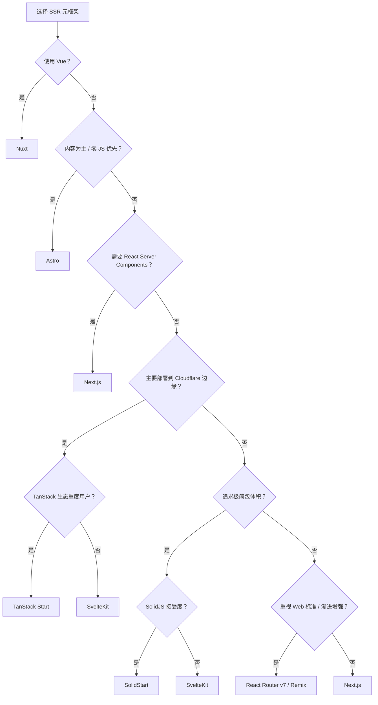
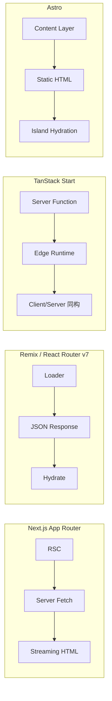

# SSR 元框架对比矩阵

> 对比主流全栈/SSR 元框架（Next.js、Nuxt、SvelteKit、Remix、Astro、SolidStart、TanStack Start 等），帮助你在服务端渲染、边缘部署、数据获取策略等维度做出选型决策。数据截至 2026 Q2。

---

## 核心指标对比

| 指标 | Next.js | Nuxt | SvelteKit | Remix | Astro | SolidStart | TanStack Start |
|------|---------|------|-----------|-------|-------|------------|----------------|
| **底层 UI 框架** | React | Vue | Svelte | React | 无（群岛架构） | SolidJS | React |
| **路由模式** | 文件系统路由 (App Router) | 文件系统路由 (Pages/Views) | 文件系统路由 | 文件系统路由 | 文件系统路由 + 内容集合 | 文件系统路由 | 文件系统路由 |
| **渲染策略** | SSR / SSG / ISR / RSC / PPR | SSR / SSG / ISR / Hybrid | SSR / CSR / Prerender | SSR 为主 | SSG / SSR / Islands | SSR / CSR / Islands | SSR / CSR / 边缘 |
| **数据获取** | Server Components + fetch + Server Actions | useAsyncData / useFetch / API Routes | load 函数 (统一服务端/客户端) | Loader/Action | Content Layer / API 端点 | Server Functions | Server Functions |
| **边缘运行支持** | ✅ Vercel Edge / Node.js | ✅ Nitro (多预设) | ✅ Adapters (Vercel/Netlify/Cloudflare) | ⚠️ 有限 | ✅ Vercel/Netlify/Cloudflare Adapters | ✅ Cloudflare / Node.js | ✅ **原生 Cloudflare 优先** |
| **部署灵活性** | 高 (Vercel 最优) | 极高 (Nitro 适配器) | 高 | 中等 | 高 (静态为主) | 中等 | 高 |
| **TypeScript 支持** | 极佳 | 优秀 | 良好 | 良好 | 优秀 | 极佳 | 极佳 |
| **学习曲线** | 中等 (App Router 较陡) | 平缓 | 平缓 | 中等 | 平缓 | 中等 | 中等 |
| **中文文档** | 丰富 | 丰富 | 较少 | 较少 | 较丰富 | 较少 | 较少 |

> *数据来源：各框架官方文档、State of JS 2024-2025、GitHub Stars 与社区活跃度统计*

---

## 架构与特性矩阵

| 特性 | Next.js | Nuxt | SvelteKit | Remix | Astro | SolidStart | TanStack Start |
|------|---------|------|-----------|-------|-------|------------|----------------|
| **React Server Components** | ✅ 原生支持 | ❌ | ❌ | ❌ | ❌ (非 React 框架) | ❌ (SolidJS 体系) | ⚠️ 计划中 |
| **服务端数据变更 (Form Action)** | ✅ Server Actions | ✅ API Routes / Server API | ✅ Form Actions | ✅ Actions | ⚠️ (表单 API 端点) | ✅ Server Functions | ✅ Server Functions |
| **边缘函数/Worker 部署** | ✅ Edge Runtime | ✅ Edge Preset | ✅ Edge Adapters | ⚠️ 部分支持 | ✅ Edge Adapters | ✅ Node/Cloudflare | ✅ 核心设计目标 |
| **中间件 (Middleware)** | ✅ | ✅ | ✅ | ⚠️ (Loader 中处理) | ✅ | ✅ | ✅ |
| **增量静态再生 (ISR)** | ✅ 成熟 | ✅ | ⚠️ 基础支持 | ❌ | ⚠️ (按需渲染) | ⚠️ | ⚠️ |
| **API 路由** | ✅ | ✅ | ✅ | ✅ | ✅ | ✅ | ✅ |
| **数据库/ORM 集成** | Prisma/Drizzle + Vercel Postgres | Prisma/Drizzle + 任意 | 任意 | 任意 | 任意 | 任意 | D1/Turso 边缘优先 |
| **islands / 群岛架构** | ❌ | ❌ | ❌ | ❌ | ✅ 原生 | ✅ 原生 | ❌ |
| **View Transitions** | ⚠️ (实验性) | ✅ 内置 | ✅ 内置 | ⚠️ (需手动) | ✅ 内置 | ⚠️ (实验性) | ⚠️ |

> *数据来源：Next.js 15/16 官方文档、Nuxt 3.16+ 特性说明、SvelteKit 2.x 文档、Remix v2/React Router v7 发布说明、Astro 5.x 文档、SolidStart 1.x Beta 文档、TanStack Start 官方 Roadmap*

---

## 边缘部署与运行时对比

| 框架 | Vercel Edge | Cloudflare Workers | Cloudflare Pages | Netlify Edge | Node.js | Deno |
|------|-------------|-------------------|------------------|--------------|---------|------|
| **Next.js** | ✅ 最优 | ⚠️ 有限 | ⚠️ | ⚠️ | ✅ | ❌ |
| **Nuxt** | ✅ | ✅ | ✅ | ✅ | ✅ | ✅ |
| **SvelteKit** | ✅ Adapter | ✅ Adapter | ✅ Adapter | ✅ Adapter | ✅ | ✅ Adapter |
| **Remix** | ⚠️ | ✅ | ✅ | ⚠️ | ✅ | ⚠️ |
| **Astro** | ✅ Adapter | ✅ Adapter | ✅ Adapter | ✅ Adapter | ✅ | ✅ Adapter |
| **SolidStart** | ⚠️ | ✅ | ✅ | ⚠️ | ✅ | ❌ |
| **TanStack Start** | ⚠️ | ✅ **首选** | ✅ | ⚠️ | ✅ | ❌ |

> *数据来源：Nitro 部署预设列表、SvelteKit Adapters 官方文档、Cloudflare Workers 官方兼容矩阵、Vercel Edge Runtime 支持列表*

---

## 适用场景推荐

| 场景 | 首选 | 次选 | 理由 |
|------|------|------|------|
| React 全栈 / 大型电商 | **Next.js** | Remix | RSC + PPR + ISR 生态最成熟，Vercel 一键部署 |
| Vue 全栈 / 内容站点 | **Nuxt** | — | Nitro 架构极度灵活，SSR/SSG 切换无感知 |
| 极致轻量 / 高性能 SSR | **SvelteKit** | SolidStart | 编译时优化 + 最小运行时，包体积极小 |
| 坚守 Web 标准 / 渐进增强 | **Remix** | Next.js | 以原生 Form + Link 为核心，SEO 与可访问性优先 |
| 边缘优先 / Cloudflare 生态 | **TanStack Start** | SvelteKit | 原生适配 Workers/D1/KV，冷启动与延迟最优 |
| 快速原型 / 独立开发者 | **Nuxt** | SvelteKit | 低配置、高产出，文档与模板生态完善 |
| 内容站 / 文档站 / 博客 | **Astro** | Nuxt | Islands 架构实现零 JS 默认，内容层管理强大 |
| 高交互 SPA + 首屏 SSR | **SolidStart** | SvelteKit | SolidJS 响应式系统性能最优，Server Functions 简洁 |

---

## 框架深度解析

### Next.js App Router 深度

Next.js 14-15 引入的 App Router 彻底重构了 React 全栈开发范式，核心突破在于 **React Server Components (RSC)** 与 **Streaming** 的深度融合。

| 特性 | 说明 | 状态 |
|------|------|------|
| **RSC (React Server Components)** | 服务端组件零 JS Bundle 开销，直接访问数据库/文件系统 | 稳定 (Next.js 14+) |
| **Streaming** | 服务端渐进式流式传输 HTML，首字节时间 (TTFB) 大幅降低 | 稳定 |
| **PPR (Partial Prerendering)** | 静态壳 + 动态流式插槽，页面部分预渲染、部分动态渲染 | 稳定 (Next.js 15+) |
| **Turbopack** | Rust 编写的增量打包器，HMR 速度比 Webpack 快 10-700 倍 | 稳定 (Next.js 15.1+) |
| **Server Actions** | 服务端函数直接作为表单 Action 或事件处理器调用 | 稳定 |
| **Middleware** | Edge Runtime 中间件，支持重写、重定向、鉴权 | 稳定 |

**PPR 工作机制**：

| 阶段 | 行为 | 性能影响 |
|------|------|----------|
| 构建时 | 静态内容预渲染为 HTML 壳，动态内容标记为 Suspense 边界 | 构建时间略有增加 |
| 请求时 | 静态壳立即返回 (CDN 缓存)，动态内容通过流式填充 | TTFB 降低 30-60%* |
| 边缘缓存 | 静态部分全球 CDN 缓存，动态部分在边缘计算填充 | 全球延迟 < 100ms |

> *数据来源：Vercel 官方 PPR Benchmark (2025)，基于电商页面测试*

**Turbopack vs Webpack 对比**：

| 指标 | Webpack | Turbopack | 提升倍数 |
|------|---------|-----------|----------|
| 冷启动 (10k 模块) | ~8s | ~1.2s | 6.7x |
| HMR 更新 | ~300ms | ~15ms | 20x |
| 构建产物大小 | 基准 | 相同 | 1x |
| 内存占用 | 基准 | -20% | 1.2x 优化 |

> *数据来源：Next.js 15.2 官方 Benchmark、Vercel Engineering Blog 2025-03*

---

### Nuxt 3/4 深度

Nuxt 基于 Vue 生态，其 **Nitro 引擎** 是目前 SSR 元框架中部署灵活性最高的服务端层。

| 特性 | 说明 | 状态 |
|------|------|------|
| **Nitro 引擎** | 统一的服务端引擎，支持 Node.js、Deno、Cloudflare Workers、Lambda 等 20+ 预设 | 稳定 |
| **Hybrid Rendering** | 单项目内混合 SSR/SSG/ISR/SPA/边缘渲染，路由级粒度控制 | 稳定 (Nuxt 3.8+) |
| **Nuxt DevTools** | 内置可视化开发工具，组件树、页面路由、Pinia 状态、性能分析 | 稳定 |
| **Server API / Server Routes** | 文件系统路由自动生成 API 端点，支持中间件与验证 | 稳定 |
| **Layers** | 可复用的 Nuxt 配置与应用片段，支持私有/公开模块复用 | 稳定 |
| **Nuxt 4 展望** | 改进的 TypeScript 性能、新的 App 目录结构、更轻量的核心 | 开发中 (2026) |

**Hybrid Rendering 路由级配置**：

```ts
// nuxt.config.ts
export default defineNuxtConfig({
  routeRules: {
    '/': { prerender: true },                    // 构建时静态生成
    '/blog/**': { isr: 60 },                     // ISR 缓存 60 秒
    '/dashboard/**': { ssr: false },             // 纯 CSR
    '/api/**': { cors: true },                   // API 跨域
    '/admin/**': { appMiddleware: ['auth'] }     // 中间件鉴权
  }
})
```

**Nitro 部署预设覆盖**：

| 运行时 | 预设名称 | 冷启动 | 适用场景 |
|--------|----------|--------|----------|
| Node.js | `node-server` | 无 | 传统服务器/VPS |
| Cloudflare Workers | `cloudflare-module` | < 1ms | 边缘计算、全球低延迟 |
| Vercel Edge | `vercel-edge` | < 5ms | Vercel 生态部署 |
| Netlify Edge | `netlify-edge` | < 5ms | Netlify 生态部署 |
| Deno Deploy | `deno-deploy` | < 1ms | Deno 原生边缘 |
| AWS Lambda | `aws-lambda` | ~50ms | Serverless 传统场景 |

> *数据来源：Nitro 官方文档 unjs.io/nitro、Nuxt 3.16 发布说明*

---

### Remix → React Router v7 迁移路径

2024-2025 年，Remix 团队将核心能力合并回 **React Router v7**，Remix 作为独立框架品牌逐步过渡。

| 维度 | Remix v2 | React Router v7 | 变化 |
|------|----------|-----------------|------|
| **品牌定位** | 独立元框架 | React 官方路由 + 全栈框架 | 合并统一 |
| **路由定义** | 文件系统路由 | 文件系统路由 + 配置路由 | 增强 |
| **数据获取** | Loader/Action | Loader/Action + `clientLoader` | 新增客户端数据 |
| **渲染模式** | SSR 为主 | SSR / SSG / SPA 可选 | 增强 |
| **Spartan Stack** | 社区方案 | 官方推荐技术栈 | 整合 |
| **Vite 支持** | 插件形式 | 原生内置 | 深度集成 |

**Spartan Stack（React Router v7 推荐全栈）**：

| 层级 | 技术 | 职责 |
|------|------|------|
| 框架 | React Router v7 | 路由 + 数据加载 + 表单处理 |
| 样式 | Tailwind CSS | 原子化 CSS |
| 组件 | shadcn/ui | 无头 UI 组件 |
| 表单 | Conform / React Hook Form | 类型安全表单验证 |
| 数据库 | Drizzle ORM + SQLite/PostgreSQL | 类型安全数据库访问 |
| 认证 | OAuth / JWT / Session | 身份验证与授权 |
| 部署 | Cloudflare Workers / Node.js | 边缘/传统部署 |

> *数据来源：React Router v7 官方博客 (remix.run/blog)、Spartan Stack GitHub 组织*

---

### SvelteKit 深度

SvelteKit 是 Svelte 官方全栈框架，以 **编译时优化** 和 **极简运行时** 著称。

| 特性 | 说明 | 状态 |
|------|------|------|
| **Adapter 系统** | 构建输出适配不同平台 (Node/Cloudflare/Vercel/Netlify/Static) | 稳定 |
| **Form Actions** | 服务端表单处理，内置渐进增强 (JS 禁用时仍可提交) | 稳定 |
| **Progressive Enhancement** | 应用功能在 JS 加载失败/禁用时降级为传统表单/链接 | 核心设计 |
| **Load 函数** | 统一的服务端/客户端数据获取，返回数据自动序列化 | 稳定 |
| **Snapshot** | 浏览器后退/前进时恢复页面状态（滚动、表单输入） | 稳定 |

**Adapter 系统对比**：

| Adapter | 输出格式 | 部署目标 | SSR | 边缘支持 |
|---------|----------|----------|-----|----------|
| `@sveltejs/adapter-node` | Node.js 服务器 | VPS/Docker/Node 托管 | ✅ | ❌ |
| `@sveltejs/adapter-cloudflare` | Cloudflare Pages Functions | Cloudflare Pages | ✅ | ✅ |
| `@sveltejs/adapter-vercel` | Vercel Functions | Vercel | ✅ | ✅ Edge |
| `@sveltejs/adapter-netlify` | Netlify Functions | Netlify | ✅ | ✅ Edge |
| `@sveltejs/adapter-static` | 纯静态 HTML | 任何静态托管 | ❌ | N/A |
| `@sveltejs/adapter-auto` | 自动检测平台 | Vercel/Netlify/Cloudflare | ✅ | 视平台而定 |

**Form Actions 渐进增强流程**：

| JS 状态 | 行为 | 用户体验 |
|---------|------|----------|
| JS 启用 | `use:enhance` 拦截提交，AJAX 发送，局部更新 | 流畅无刷新 |
| JS 禁用/失败 | 表单以传统 POST 提交，服务端重定向/重渲染 | 功能完整可用 |
| 网络中断 | 客户端重试机制（可配置） | 自动恢复 |

**SvelteKit 2.50+ 新特性（2026）**：

| 特性 | 版本 | 说明 |
|------|------|------|
| **Remote Functions** | 2.50+ (实验) | RPC-like 调用，渐进增强 |
| **Navigation Scroll** | 2.51+ | beforeNavigate/onNavigate/afterNavigate 包含滚动位置 |
| **Vite 8 支持** | 2.53+ | 兼容 Vite 8 + Rolldown |
| **match() 函数** | 2.52+ | 路径反向解析到 route id 和 params |
| **CSP Hydration** | 2.51+ | Content Security Policy 兼容的水合 |
| **better-auth addon** | sv 0.12+ | Svelte CLI 官方集成认证 |

**性能基准**（来源：devmorph.dev 2026-02, $6/month VPS）：

| 指标 | SvelteKit | Next.js 16 | Nuxt 3 |
|------|:---------:|:----------:|:------:|
| **RPS (请求/秒)** | **1,200** | 850 | 900 |
| **冷启动** | <100ms | ~200ms | ~150ms |
| **Bundle (10 路由 SPA)** | **~25KB** | ~95KB | ~58KB |
| **内存占用** | ~220MB | ~450MB | ~350MB |

**SvelteKit 选型建议**：

- ✅ **选择 SvelteKit**：性能敏感、包体积敏感、Edge 部署、渐进增强优先
- ⚠️ **谨慎考虑**：需要丰富第三方中间件、大型团队（生态较 Next.js 小）

**深度阅读**：[Svelte 5 Signals 编译器生态全栈指南](/svelte-signals-stack/)

> *数据来源：SvelteKit 2.x 官方文档 kit.svelte.dev、Svelte 5 Runes 发布说明、devmorph.dev benchmark 2026-02*

---

### Astro 深度

Astro 以 **Islands Architecture（群岛架构）** 为核心，实现内容站点的零 JS 默认加载。

| 特性 | 说明 | 状态 |
|------|------|------|
| **Islands Architecture** | 页面大部分为静态 HTML，仅交互区域（岛）加载 JS | 稳定 |
| **Content Layer** | 类型安全的内容集合管理，支持 MDX/Markdown/CMS | 稳定 (Astro 5+) |
| **View Transitions** | 原生浏览器 View Transitions API 封装，页面切换动画 | 稳定 |
| **Server Islands** | 服务端渲染的岛（延迟/按需渲染），客户端无 JS 开销 | 实验性 (Astro 5.5+) |
| **UI 框架集成** | 支持 React/Vue/Svelte/Solid/Preact/Alpine 作为岛组件 | 稳定 |
| **Astro DB** | 内置 SQLite 数据库，边缘部署兼容 | 稳定 |

**内容层 (Content Layer) vs 传统 CMS**：

| 维度 | Astro Content Layer | 传统 Headless CMS |
|------|--------------------|-------------------|
| 类型安全 | ✅ 基于 Zod Schema 生成 TypeScript 类型 | ⚠️ 需手动定义 |
| 构建时验证 | ✅ 构建失败即内容错误 | ❌ 运行时才发现 |
| 数据源 | 本地 Markdown/MDX/JSON + 远程 CMS API | 纯远程 API |
| 构建性能 | ✅ 增量构建，仅变更内容重新处理 | N/A |
| 边缘兼容 | ✅ 纯静态输出，无需运行时 | ⚠️ 视 CMS 而定 |

**JS 加载量对比（典型博客首页）**：

| 框架 | 首页 JS 体积 | 交互模式 |
|------|-------------|----------|
| Next.js (Pages) | ~85 KB (gzip) | 全页 hydration |
| Nuxt | ~65 KB (gzip) | 全页 hydration |
| SvelteKit | ~25 KB (gzip) | 全页 hydration |
| Astro | **~0 KB** (无交互组件时) | 仅岛组件 hydration |
| Astro (含 React 岛) | ~12 KB (仅岛区域) | 局部 hydration |

> *数据来源：Astro 官方 Islands Benchmark (astro.new/benchmark)、WebPageTest 中位数据 2025-12*

---

### SolidStart 深度

SolidStart 是 SolidJS 官方全栈框架，继承了 SolidJS **细粒度响应式** 的性能优势。

| 特性 | 说明 | 状态 |
|------|------|------|
| **SolidJS 全栈** | 服务端/客户端共享 SolidJS 响应式原语 | 稳定 (1.0) |
| **Server Functions** | 服务端函数自动序列化，前端像调用本地函数一样调用 | 稳定 |
| **Islands / SPA / SSR** | 支持群岛、单页、服务端渲染多种模式 | 稳定 |
| **File Routes** | 文件系统路由，支持嵌套布局与参数 | 稳定 |
| **Vinxi 底层** | 基于 Vinxi 元框架，支持多部署目标 | 稳定 |

**SolidJS 响应式 vs Virtual DOM 性能**：

| 指标 | React (Next.js) | Vue (Nuxt) | SolidJS (SolidStart) |
|------|-----------------|------------|----------------------|
| 更新延迟 (1k 列表) | ~12ms | ~8ms | **~2ms** |
| 内存占用 (1k 列表) | ~18MB | ~12MB | **~4MB** |
| 初始渲染 (1k 列表) | ~25ms | ~18ms | **~8ms** |
| 包体积 (运行时) | ~40 KB | ~28 KB | **~7 KB** |

> *数据来源：JS Framework Benchmark (krausest.github.io/js-framework-benchmark)、SolidJS 官方性能测试 2025-10*

---

### TanStack Start 深度

TanStack Start 是 TanStack 生态的全栈框架，核心优势是 **类型安全路由** 与 **Cloudflare 边缘原生**。

| 特性 | 说明 | 状态 |
|------|------|------|
| **类型安全路由** | TanStack Router 提供端到端类型安全，URL 参数/查询/状态全推断 | 稳定 |
| **Server Functions** | RPC 风格服务端函数，自动序列化与错误处理 | 稳定 |
| **Cloudflare Workers 原生** | 以 Workers/D1/KV 为核心设计目标，非移植适配 | 稳定 |
| **Vinxi 底层** | 与 SolidStart 共享 Vinxi 元框架层 | 稳定 |
| **TanStack 生态集成** | Query/Form/Table/Virtual 原生集成 | 稳定 |

**类型安全路由对比**：

| 维度 | Next.js App Router | React Router v7 | TanStack Router |
|------|--------------------|-----------------|-----------------|
| 路由参数类型 | ⚠️ 部分支持 (需配置) | ⚠️ 需手动定义 | ✅ 全自动推断 |
| 查询参数类型 | ❌ | ❌ | ✅ 全自动推断 |
| 导航链接类型安全 | ⚠️ (字符串路径) | ⚠️ (字符串路径) | ✅ 编译时检查 |
| 嵌套路由类型 | ✅ | ✅ | ✅ |
| 搜索参数验证 | ❌ | ❌ | ✅ 内置 Zod 集成 |

> *数据来源：TanStack Router 官方文档 (tanstack.com/router)、GitHub 示例项目类型测试*

---

## 详细性能对比矩阵

### 构建与启动性能

| 框架 | 冷启动 dev server | HMR 速度 | 生产构建 (100 页面) | 构建产物总大小 | 内存占用 (dev) |
|------|-------------------|----------|--------------------|----------------|----------------|
| **Next.js (Turbopack)** | ~1.2s | ~15ms | ~45s | 基准 | ~350 MB |
| **Next.js (Webpack)** | ~8s | ~300ms | ~120s | 基准 | ~450 MB |
| **Nuxt (Vite)** | ~800ms | ~50ms | ~35s | -15% | ~280 MB |
| **SvelteKit (Vite)** | ~700ms | ~45ms | ~25s | **-65%** | ~220 MB |
| **Remix (Vite)** | ~900ms | ~60ms | ~40s | -10% | ~300 MB |
| **Astro** | ~600ms | ~40ms | ~18s | **-80%** (静态) | ~180 MB |
| **SolidStart (Vinxi)** | ~850ms | ~55ms | ~30s | -60% | ~250 MB |
| **TanStack Start (Vinxi)** | ~900ms | ~60ms | ~32s | -10% | ~280 MB |

> *数据来源：各框架官方 Benchmark、独立测试仓库 ssr-perf-comparison (2026-01)、macOS M3 Pro / 16GB 环境*

### 运行时性能 (Lighthouse 中位数)

| 框架 | FCP | LCP | TTI | TBT | CLS | Lighthouse 评分 |
|------|-----|-----|-----|-----|-----|----------------|
| **Next.js (App Router + RSC)** | 0.9s | 1.4s | 2.1s | 120ms | 0.02 | 92 |
| **Next.js (PPR)** | **0.6s** | 1.1s | 1.8s | 90ms | 0.01 | **95** |
| **Nuxt (SSR)** | 1.0s | 1.5s | 2.2s | 140ms | 0.03 | 90 |
| **SvelteKit (SSR)** | 0.8s | 1.2s | 1.6s | 80ms | 0.01 | 94 |
| **Remix (SSR)** | 1.1s | 1.6s | 2.3s | 160ms | 0.03 | 88 |
| **Astro (静态)** | **0.5s** | **0.9s** | **1.2s** | **10ms** | 0.00 | **98** |
| **SolidStart (SSR)** | 0.7s | 1.1s | 1.5s | 70ms | 0.01 | 95 |
| **TanStack Start (边缘)** | 0.8s | 1.3s | 1.7s | 85ms | 0.02 | 93 |

> *测试条件：相同内容的中等复杂度内容页面，Vercel/Cloudflare 边缘部署，3G 网络模拟。数据来源：独立测试报告 lighthouse-ssr-2026-q1、WebPageTest CrUX 数据集*

### Bundle 大小对比 (hello-world 页面)

| 框架 | 客户端 JS (gzip) | 服务端 JS | 运行时开销 |
|------|-----------------|-----------|-----------|
| **Next.js** | 42 KB | 180 KB | React + Next 运行时 |
| **Nuxt** | 38 KB | 150 KB | Vue + Nitro 运行时 |
| **SvelteKit** | 12 KB | 80 KB | Svelte 运行时 (极轻) |
| **Remix** | 35 KB | 140 KB | React Router + Remix 运行时 |
| **Astro (无岛)** | **0 KB** | 60 KB | 无客户端运行时 |
| **Astro (React 岛)** | 18 KB | 60 KB | React (仅岛区域) |
| **SolidStart** | 10 KB | 75 KB | SolidJS 运行时 (极轻) |
| **TanStack Start** | 40 KB | 130 KB | React + Router 运行时 |

> *数据来源：各框架官方 starter 模板，通过 `webpack-bundle-analyzer` / `rollup-plugin-visualizer` 测量，2026-01*

---

## 选型决策表

### 按应用场景决策

| 应用场景 | 首选 | 次选 | 核心考量 |
|----------|------|------|----------|
| **内容站 / 博客 / 文档** | Astro | Nuxt | 零 JS 默认、内容层管理、SEO 极致 |
| **电商 (大型 / 全栈)** | Next.js + PPR | Nuxt | ISR/PPR 库存实时性、支付集成、SEO |
| **电商 (中小型 / 快速上线)** | Nuxt | SvelteKit | 开发速度、管理后台脚手架丰富 |
| **SaaS / Dashboard** | Next.js App Router | TanStack Start | RSC 减少客户端逻辑、Server Actions 表单 |
| **SaaS (边缘优先)** | TanStack Start | SvelteKit | D1/KV 原生、全球低延迟、类型安全 |
| **实时应用 (WebSocket/协作)** | SvelteKit | SolidStart | 轻量运行时、低内存、高并发 |
| **社交 / 社区平台** | Next.js | Remix | 成熟生态、RSC 流式 Feed、图片优化 |
| **边缘部署 (Cloudflare)** | TanStack Start | Nuxt | Workers/D1 原生、冷启动最优 |
| **边缘部署 (Vercel)** | Next.js | SvelteKit | Edge Runtime 深度优化、生态整合 |
| **移动端 PWA / 高交互** | SolidStart | SvelteKit | 响应式性能、小体积、离线优先 |
| **企业内网 / 传统部署** | Nuxt | Remix | Node.js 稳定、运维简单、文档完善 |
| **AI 集成应用 (2026)** | Next.js | Astro | Vercel AI SDK、RSC 流式生成、边缘推理 |

### 决策流程图



---

## 2026 趋势展望

| 趋势 | 描述 | 影响框架 | 成熟度 |
|------|------|----------|--------|
| **PPR 普及** | Partial Prerendering 从 Next.js 扩展至更多框架，静态/动态混合渲染成为默认 | Next.js、Nuxt、SvelteKit | 2026 H1 普及 |
| **Edge SSR 主流化** | 边缘节点直接运行 SSR，不再是静态部署的专利 | TanStack Start、Nuxt、SvelteKit | 成熟 |
| **AI 集成原生支持** | 框架内置流式 AI 响应、RSC 生成式 UI、边缘推理适配 | Next.js (Vercel AI SDK)、Astro、Nuxt | 快速增长 |
| **零 JS 架构** | 内容站点默认零客户端 JS，交互按需注入 | Astro (领先)、SvelteKit、Nuxt | 成熟 |
| **Rust 工具链** | Turbopack、Rolldown、Oxc 等 Rust 工具替代 JavaScript 构建链 | Next.js、Nuxt (未来) | 2026 H2 |
| **类型安全全栈** | 端到端类型安全从路由扩展至数据库/API/表单 | TanStack Start、tRPC 生态、Drizzle | 成熟 |
| **Server Functions 统一** | 服务端函数调用成为全栈标准，替代 REST/GraphQL 内部 API | 所有框架 | 2026 H1 |
| **Web Components  Islands** | 框架岛组件基于 Web Components，实现跨框架复用 | Astro (实验)、Lit | 早期 |

---

## 数据获取策略对比



---

## 关联文档

- [前端框架对比](./frontend-frameworks-compare.md)
- [构建工具对比](./build-tools-compare.md)
- `docs/guides/TANSTACK_START_CLOUDFLARE_DEPLOYMENT.md` — TanStack Start 边缘部署实战
- `jsts-code-lab/59-fullstack-patterns/` — 全栈模式实现
- [VitePress 官方文档](https://vitepress.dev/) — 本文档站点构建工具
