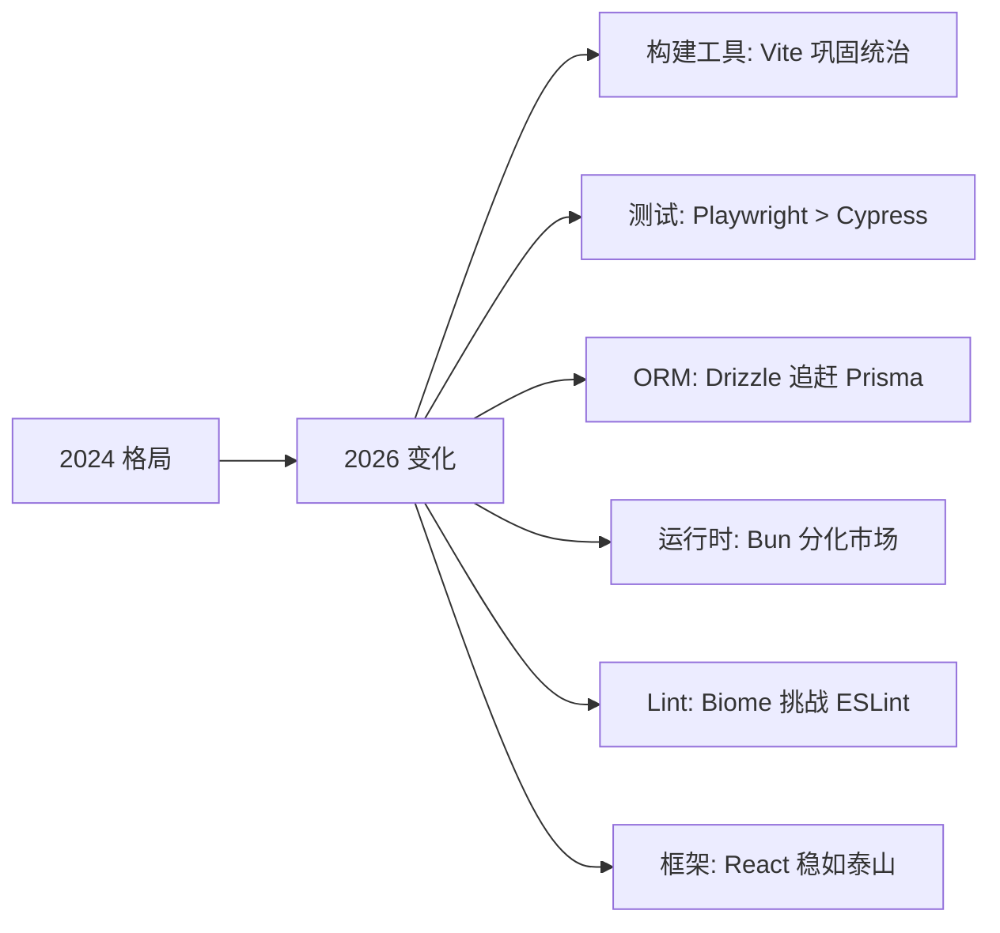

# Stars 趋势报告

> 生成时间: 2026/5/2 10:25:02 | 追踪仓库数: **53** | 分类数: **9**

本报告基于 GitHub Stars 数据追踪 JavaScript/TypeScript 生态核心项目的社区关注度变化。Stars 作为开源项目的「社交证明」，虽不直接反映生产采用率，但能有效衡量社区兴趣度和项目长期健康度。

---

## 核心洞察

### 2026 年增长最快的项目

基于年度增长率排序，以下项目展现出最强的社区增长势头：

| 趋势 | 项目 | 分类 | 年度增长 | 分析 |
|------|------|------|----------|------|
| 🚀 | **Biome** | Lint/Format | +39.81% | ESLint/Prettier 的 Rust 替代方案，极致性能驱动增长 |
| 🚀 | **Elysia** | Web 框架 | +27.45% | Bun 生态的 TypeScript 优先框架，端到端类型安全 |
| 📈 | **tsx** | 开发工具 | +23.74% | TypeScript 执行器，Node.js 22 原生支持部分功能后仍保持增长 |
| 📈 | **Hono** | Web 框架 | +19.97% | 边缘计算优先的超轻量框架，多运行时支持 |
| 📈 | **Drizzle ORM** | ORM | +18.80% | SQL-like 查询语法，类型安全，Prisma 的有力竞争者 |
| 📈 | **Playwright** | 测试 | +16.90% | 微软出品的 E2E 测试工具，逐步取代 Cypress |
| 📈 | **Vite** | 构建工具 | +13.35% | 已是最主流构建工具，高基数下仍保持双位数增长 |

### 生态格局变化



---

## 增长最快仓库 (年度增长率 TOP 10)

| 排名 | 仓库 | 分类 | Stars | 年增长率 |
|------|------|------|-------|----------|
| 1 | [Biome](https://github.com/biomejs/biome) | emerging | 24,514 | +39.81% |
| 2 | [Elysia](https://github.com/elysiajs/elysia) | webFrameworks | 18,204 | +27.45% |
| 3 | [tsx](https://github.com/privatenumber/tsx) | emerging | 11,957 | +23.74% |
| 4 | [Elysia](https://github.com/elysiajs/elysia) | emerging | 18,204 | +21.50% |
| 5 | [Hono](https://github.com/honojs/hono) | emerging | 30,241 | +19.97% |
| 6 | [Drizzle ORM](https://github.com/drizzle-team/drizzle-orm) | emerging | 34,128 | +18.80% |
| 7 | [Playwright](https://github.com/microsoft/playwright) | testing | 87,785 | +16.90% |
| 8 | [Hono](https://github.com/honojs/hono) | webFrameworks | 30,241 | +16.32% |
| 9 | [Drizzle ORM](https://github.com/drizzle-team/drizzle-orm) | orm | 34,128 | +15.14% |
| 10 | [Vite](https://github.com/vitejs/vite) | buildTools | 80,339 | +13.35% |

> **注**: Elysia 和 Hono 在多个分类中出现，反映了它们跨领域的适用性（边缘计算 + 传统后端）。

---

## Stars 总量排行榜 (TOP 10)

| 排名 | 仓库 | 分类 | Stars | 里程碑 |
|------|------|------|-------|--------|
| 1 | [React](https://github.com/facebook/react) | frontend | 244,796 | 逼近 25 万，前端框架无可争议的王者 |
| 2 | [Vue.js](https://github.com/vuejs/vue) | frontend | 209,808 | 20 万+，社区驱动型框架的典范 |
| 3 | [Next.js](https://github.com/vercel/next.js) | fullstack | 139,250 | React 生态的元框架标杆 |
| 4 | [Node.js](https://github.com/nodejs/node) | runtime | 117,015 | 服务端 JS 的基石 |
| 5 | [Deno](https://github.com/denoland/deno) | runtime | 106,594 | 安全运行时理念的先行者 |
| 6 | [Angular](https://github.com/angular/angular) | frontend | 100,062 | 企业级框架，突破 10 万 |
| 7 | [Bun](https://github.com/oven-sh/bun) | runtime | 89,492 | 最快速增长的运行时 |
| 8 | [Playwright](https://github.com/microsoft/playwright) | testing | 87,785 | E2E 测试领域新霸主 |
| 9 | [Svelte](https://github.com/sveltejs/svelte) | frontend | 86,454 | 编译器框架的创新代表 |
| 10 | [Vite](https://github.com/vitejs/vite) | buildTools | 80,339 | 构建工具的事实标准 |

---

## 分类详细数据

### 前端框架 (frontend)

| 仓库 | Stars | 月增长 | 年增长 | 趋势 |
|------|-------|--------|--------|------|
| [React](https://github.com/facebook/react) | 244,796 | +0.37% | +5.72% | ➡️ 稳定 |
| [Vue.js](https://github.com/vuejs/vue) | 209,808 | +2.24% | +4.44% | ➡️ 稳定 |
| [Angular](https://github.com/angular/angular) | 100,062 | +7.34% | +11.87% | 📈 回暖 |
| [Svelte](https://github.com/sveltejs/svelte) | 86,454 | +1.79% | +11.07% | 📈 增长 |
| [Preact](https://github.com/preactjs/preact) | 38,589 | +3.52% | +3.83% | ➡️ 稳定 |

**分析**: React 与 Vue 稳居头部，Angular 在 v19 发布后增长回暖，Svelte 凭借 Signals 和 SvelteKit 获得新动力。Solid 虽未进入前 5，但在开发者满意度调查中持续领先。

### 全栈框架 (fullstack)

| 仓库 | Stars | 月增长 | 年增长 | 趋势 |
|------|-------|--------|--------|------|
| [Next.js](https://github.com/vercel/next.js) | 139,250 | +-2.41% | +6.85% | ➡️ 成熟 |
| [Nuxt](https://github.com/nuxt/nuxt) | 60,149 | +1.84% | +10.42% | 📈 增长 |
| [Astro](https://github.com/withastro/astro) | 58,906 | +1.96% | +12.02% | 📈 强劲 |
| [Remix](https://github.com/remix-run/remix) | 32,742 | +-3.14% | +11.87% | ➡️ 整合 |
| [SvelteKit](https://github.com/sveltejs/kit) | 20,475 | +7.96% | +10.17% | 📈 增长 |

**分析**: Next.js 增长放缓反映市场饱和，Astro 以「内容优先」定位实现最快增长。Remix 并入 React Router 后策略调整。

### 构建工具 (buildTools)

| 仓库 | Stars | 月增长 | 年增长 | 趋势 |
|------|-------|--------|--------|------|
| [Vite](https://github.com/vitejs/vite) | 80,339 | +-0.37% | +13.35% | 📈 巩固 |
| [Webpack](https://github.com/webpack/webpack) | 65,776 | +0.86% | +2.58% | ➡️ 存量 |
| [Parcel](https://github.com/parcel-bundler/parcel) | 44,032 | +3.54% | +8.23% | ➡️ 稳定 |
| [esbuild](https://github.com/evanw/esbuild) | 39,873 | +2.51% | +8.48% | 📈 增长 |
| [SWC](https://github.com/swc-project/swc) | 33,384 | +-2.19% | +1.76% | ➡️ 平台化 |

**分析**: Vite 已无可争议地成为新项目首选。esbuild 和 SWC 作为底层编译器被集成到上层工具中，直接使用量增长趋缓。

### Web 框架 (webFrameworks)

| 仓库 | Stars | 月增长 | 年增长 | 趋势 |
|------|-------|--------|--------|------|
| [NestJS](https://github.com/nestjs/nest) | 75,357 | +-1.31% | +6.29% | ➡️ 成熟 |
| [Express](https://github.com/expressjs/express) | 68,979 | +-5.00% | +2.23% | ➡️ 存量 |
| [Fastify](https://github.com/fastify/fastify) | 36,155 | +7.50% | +12.68% | 📈 增长 |
| [Koa](https://github.com/koajs/koa) | 35,707 | +4.26% | +5.89% | ➡️ 稳定 |
| [Hono](https://github.com/honojs/hono) | 30,241 | +-4.50% | +16.32% | 🚀 爆发 |

**分析**: Express 增长停滞但存量巨大。Fastify 和 Hono 是增长双星——前者面向传统服务端，后者抢占边缘计算市场。

### ORM (orm)

| 仓库 | Stars | 月增长 | 年增长 | 趋势 |
|------|-------|--------|--------|------|
| [Prisma](https://github.com/prisma/prisma) | 45,867 | +-4.67% | +6.33% | ➡️ 成熟 |
| [Drizzle ORM](https://github.com/drizzle-team/drizzle-orm) | 34,128 | +5.06% | +15.14% | 🚀 爆发 |
| [TypeORM](https://github.com/typeorm/typeorm) | 36,466 | +-7.57% | +-3.02% | 🔻 萎缩 |
| [Sequelize](https://github.com/sequelize/sequelize) | 30,350 | +5.48% | +3.54% | ➡️ 存量 |
| [Mongoose](https://github.com/Automattic/mongoose) | 27,476 | +-6.60% | +-3.02% | 🔻 萎缩 |

**分析**: Drizzle ORM 是最值得关注的 ORM 新势力，SQL-like API + 类型安全定位精准。TypeORM 和 Mongoose 面临用户流失。

### 测试 (testing)

| 仓库 | Stars | 月增长 | 年增长 | 趋势 |
|------|-------|--------|--------|------|
| [Playwright](https://github.com/microsoft/playwright) | 87,785 | +-0.78% | +16.90% | 🚀 爆发 |
| [Cypress](https://github.com/cypress-io/cypress) | 49,623 | +-1.39% | +0.56% | ➡️ 停滞 |
| [Jest](https://github.com/jestjs/jest) | 45,335 | +-3.64% | +0.67% | ➡️ 存量 |
| [Mocha](https://github.com/mochajs/mocha) | 22,883 | +1.03% | +1.32% | ➡️ 存量 |
| [Vitest](https://github.com/vitest-dev/vitest) | 16,451 | +-3.29% | +10.31% | 📈 增长 |

**分析**: Playwright 正在全面取代 Cypress 成为 E2E 测试首选。Vitest 作为 Vite 生态的单元测试框架增长迅速。

### 运行时 (runtime)

| 仓库 | Stars | 月增长 | 年增长 | 趋势 |
|------|-------|--------|--------|------|
| [Node.js](https://github.com/nodejs/node) | 117,015 | +-3.79% | +-2.24% | ➡️ 稳定 |
| [Deno](https://github.com/denoland/deno) | 106,594 | +-1.16% | +12.80% | 📈 增长 |
| [Bun](https://github.com/oven-sh/bun) | 89,492 | +0.79% | +13.20% | 📈 增长 |

**分析**: Node.js 地位稳固但创新放缓，Deno 2.0 的 npm 兼容性大幅提升使其重获关注，Bun 以性能为卖点持续增长。

### 工具库 (utils)

| 仓库 | Stars | 月增长 | 年增长 | 趋势 |
|------|-------|--------|--------|------|
| [Lodash](https://github.com/lodash/lodash) | 61,263 | +-0.08% | +5.03% | ➡️ 存量 |
| [Day.js](https://github.com/iamkun/dayjs) | 48,631 | +-6.17% | +3.15% | ➡️ 稳定 |
| [Zod](https://github.com/colinhacks/zod) | 42,552 | +5.99% | +9.87% | 📈 增长 |
| [tRPC](https://github.com/trpc/trpc) | 40,131 | +-4.47% | +12.50% | 📈 增长 |
| [date-fns](https://github.com/date-fns/date-fns) | 36,560 | +5.63% | +9.12% | 📈 增长 |

**分析**: Zod 和 tRPC 代表了「类型安全全栈」趋势，在 2024-2026 年持续获得关注。Temporal API 的普及可能冲击 Day.js / date-fns。

### 新兴项目 (emerging)

| 仓库 | Stars | 月增长 | 年增长 | 趋势 |
|------|-------|--------|--------|------|
| [Drizzle ORM](https://github.com/drizzle-team/drizzle-orm) | 34,128 | +-2.39% | +18.80% | 🚀 明星 |
| [Hono](https://github.com/honojs/hono) | 30,241 | +1.75% | +19.97% | 🚀 明星 |
| [Biome](https://github.com/biomejs/biome) | 24,514 | +4.07% | +39.81% | 🚀 超级明星 |
| [Elysia](https://github.com/elysiajs/elysia) | 18,204 | +1.62% | +21.50% | 📈 强劲 |
| [tsx](https://github.com/privatenumber/tsx) | 11,957 | +6.65% | +23.74% | 📈 增长 |

**分析**: 新兴项目普遍呈现高速增长，Biome 以近 40% 年增长率领跑。这些项目的共同特征：Rust/Go 底层 + TypeScript 优先 + 极致性能。

---

## 方法论说明

### 数据来源

- GitHub REST API `repos/{owner}/{repo}` 端点
- 数据采集频率：每月初
- Stars 数据为公开仓库的 stargazers_count

### 增长率计算

```
月增长率 = (本月Stars - 上月Stars) / 上月Stars × 100%
年增长率 = (本月Stars - 去年同期Stars) / 去年同期Stars × 100%
```

### 局限性

| 局限 | 说明 |
|------|------|
| Stars ≠ 采用率 | Stars 反映兴趣而非生产使用 |
| 时间偏差 | 新项目基数小，增长率天然更高 |
| 地域偏差 | GitHub 用户以欧美为主 |
| 企业项目 | 企业内部项目不在统计范围内 |

---

## 相关资源

- [研究报告 — Awesome-JavaScript 分析](../research/awesome-javascript-analysis)
- [研究报告 — Awesome-NodeJS 分析](../research/awesome-nodejs-analysis)
- [生态趋势](../comparison-matrices/) — 工具横向对比
- [State of JS](https://stateofjs.com) — 开发者调查数据
