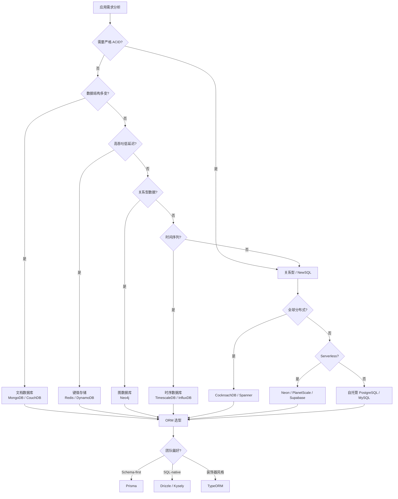
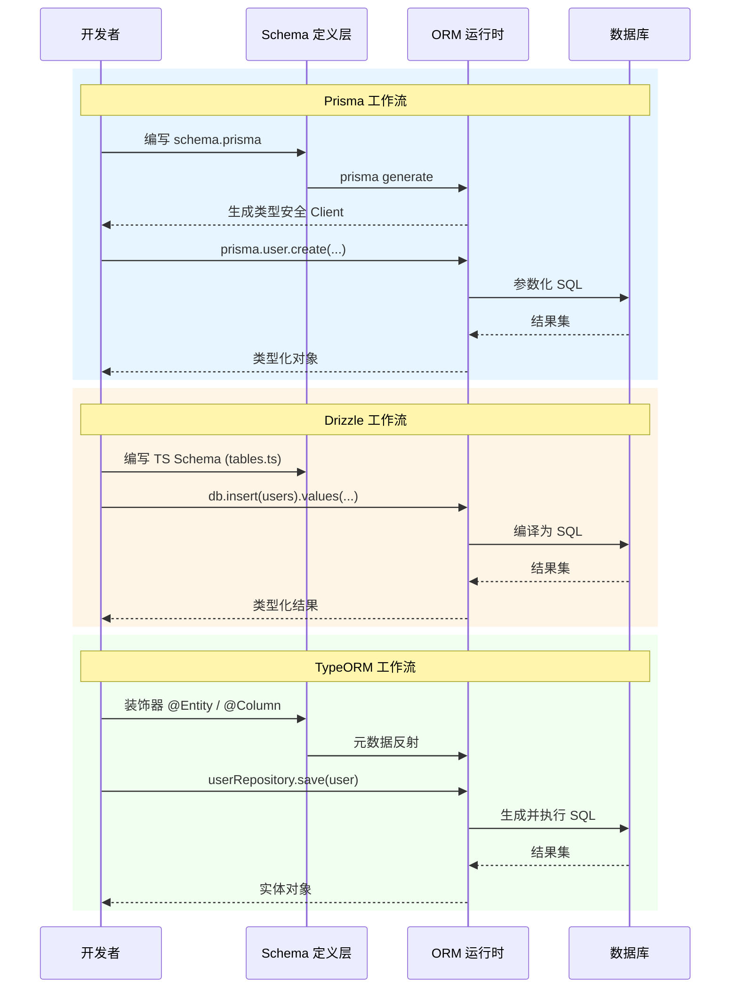

# 数据库基础理论：从关系模型到NewSQL

## 引言

现代应用程序的数据持久化层是整个系统架构中最关键的组成部分之一。从 Edgar F. Codd 于 1970 年提出关系模型的开创性论文，到今天云原生时代 Serverless 数据库的蓬勃发展，数据库技术经历了半个多世纪的演进与革新。对于 JavaScript/TypeScript 生态的开发者而言，理解数据库基础理论不仅是写出高效查询的前提，更是做出正确技术选型的根本依据。

本文采用"理论严格表述"与"工程实践映射"双轨并行的写作策略：一方面，我们将从形式化的角度重新审视关系模型、ACID 语义、CAP 定理等核心理论；另一方面，我们将这些理论与 JS/TS 生态中的具体工具和实践相对应，帮助读者建立从抽象理论到工程实现的完整认知链路。

---

## 理论严格表述

### 2.1 关系模型的形式化定义

Edgar F. Codd 在 1970 年发表的论文《A Relational Model of Data for Large Shared Data Banks》中，首次提出了关系模型的形式化框架，彻底改变了数据管理的方式。

**定义 2.1（域，Domain）**
域 `D` 是一组具有相同数据类型的原子值的集合。例如，整数域 `INTEGER = {..., -2, -1, 0, 1, 2, ...}`，字符串域 `STRING = {"a", "ab", "hello", ...}`。

**定义 2.2（属性，Attribute）**
属性是域的命名角色。设属性名为 `A`，其对应的域为 `dom(A)`。一个属性集 `R = {A₁, A₂, ..., Aₙ}` 定义了关系的模式（Schema）。

**定义 2.3（元组，Tuple）**
给定模式 `R = {A₁, A₂, ..., Aₙ}`，一个元组 `t` 是一个从属性到值的映射 `t: R → ∪Dᵢ`，满足 `t(Aᵢ) ∈ dom(Aᵢ)`。换言之，元组是关系表中的一行数据。

**定义 2.4（关系，Relation）**
关系 `r` 是模式 `R` 上的一组元组的集合，即 `r ⊆ dom(A₁) × dom(A₂) × ... × dom(Aₙ)`。由于关系是集合，元组之间无序且不可重复（在数据库实现中通过主键约束保证）。

关系模型的核心优势在于其**声明式（Declarative）**特性：用户只需描述"想要什么数据"，而非"如何获取数据"。查询优化器负责将高级声明转换为高效的执行计划。

### 2.2 ACID 属性的形式化语义

事务（Transaction）是数据库执行的基本工作单位。Jim Gray 于 1981 年系统阐述了事务的 ACID 属性，为数据库可靠性奠定了理论基础。

**定义 2.5（事务）**
事务 `T` 是一个有限的数据库操作序列 `T = {op₁, op₂, ..., opₙ}`，这些操作要么全部成功执行（提交，Commit），要么全部不执行（回滚，Rollback）。

**原子性（Atomicity）**
原子性要求事务是不可分割的最小执行单元。形式化地，设事务 `T` 对数据库状态 `DB` 的作用为函数 `f_T: DB → DB`，则原子性保证：

- 若 `T` 成功提交，则 `DB' = f_T(DB)`；
- 若 `T` 失败回滚，则数据库状态保持不变：`DB' = DB`。

实现原子性的核心机制是**预写日志（Write-Ahead Logging, WAL）**：在修改数据页之前，先将变更记录到持久化的日志中。若系统崩溃，恢复管理器通过重放（Redo）或撤销（Undo）日志来确保一致性。

**一致性（Consistency）**
一致性有两层含义：

1. **数据库一致性**：事务执行前后，数据库必须满足所有完整性约束（主键约束、外键约束、CHECK 约束、触发器等）。形式化地，设 `Consistent(DB)` 为谓词，表示数据库状态满足所有约束，则一致性要求：
   `Consistent(DB) ∧ T commits ⇒ Consistent(f_T(DB))`
2. **应用一致性**：事务执行保持应用层面的业务规则不变。例如，转账操作必须保证"转出账户扣款 = 转入账户加款"。

值得注意的是，一致性是 ACID 中最容易被误解的属性。它并非独立保证，而是由原子性、隔离性和持久性共同支撑的结果。

**隔离性（Isolation）**
隔离性确保并发执行的事务不会相互干扰。设事务 `T₁` 和 `T₂` 并发执行，理想情况下其效果应等价于某一串行执行顺序（Serial Execution）。形式化地，设并发调度 `S` 产生的结果为 `Result(S)`，若存在串行调度 `S_serial` 使得 `Result(S) = Result(S_serial)`，则称 `S` 是**可串行化（Serializable）**的。

SQL 标准定义了四个隔离级别，按严格程度递增排列：

| 隔离级别 | 脏读（Dirty Read） | 不可重复读（Non-repeatable Read） | 幻读（Phantom Read） |
|---------|-------------------|--------------------------------|-------------------|
| Read Uncommitted | 可能 | 可能 | 可能 |
| Read Committed | 不可能 | 可能 | 可能 |
| Repeatable Read | 不可能 | 不可能 | 可能* |
| Serializable | 不可能 | 不可能 | 不可能 |

> *注：在 PostgreSQL 的 Repeatable Read 实现中，幻读实际上被防止了（通过快照隔离），但这并非 SQL 标准的要求。

**持久性（Durability）**
持久性保证一旦事务提交，其变更将永久保存，即使发生系统故障。形式化地：
`T commits at time t ⇒ ∀t' > t, DB(t') contains changes of T`

实现持久性的关键技术包括：WAL 日志同步刷盘（`fsync`）、组提交（Group Commit）、以及现代数据库中的复制机制（同步/异步副本）。

### 2.3 CAP 定理与 BASE 理论

**定理 2.6（CAP 定理，Brewer, 2000）**
对于分布式数据存储系统，在出现网络分区（Partition）的情况下，不可能同时满足以下三个属性中的超过两个：

- **一致性（Consistency, C）**：所有节点在同一时刻看到相同的数据；
- **可用性（Availability, A）**：每个请求都能在有限时间内收到非错误响应；
- **分区容错性（Partition Tolerance, P）**：系统在网络分区发生时仍能继续运行。

CAP 定理的形式化证明基于以下观察：当网络分区发生时，若系统继续响应请求，则要么牺牲一致性（允许分区两侧的节点看到不同数据），要么牺牲可用性（拒绝部分请求直到分区恢复）。因此，分布式系统只能在 **CP**（一致性+分区容错）、**AP**（可用性+分区容错）或 **CA**（单节点系统，无分区问题）之间做出选择。

**BASE 理论**是对 CAP 定理中 AP 系统的实践补充，由 eBay 的架构师于 2008 年提出：

- **Basically Available**：基本可用，系统在某些故障情况下允许部分功能降级；
- **Soft State**：软状态，允许系统中的数据存在中间状态，且该状态不影响系统整体可用性；
- **Eventually Consistent**：最终一致性，不保证数据在所有副本上立时一致，但保证在没有新更新的情况下，最终所有副本会达到一致状态。

BASE 理论代表了 NoSQL 系统对大规模分布式场景下一致性模型的务实折中。

### 2.4 SQL 的代数基础

SQL（Structured Query Language）的理论基础是**关系代数（Relational Algebra）**。关系代数由 Codd 提出，是一组对关系进行操作的算子集合。

**基本算子：**

1. **选择（Selection, σ）**
   `σ_θ(r) = {t ∈ r | θ(t) = true}`
   选择算子按谓词条件过滤元组，对应 SQL 的 `WHERE` 子句。时间复杂度为 `O(|r|)`。

2. **投影（Projection, π）**
   `π_{A₁,...,Aₖ}(r) = {t[A₁,...,Aₖ] | t ∈ r}`
   投影算子从关系中提取指定属性列，对应 SQL 的 `SELECT` 子句。需注意投影会自动去重（集合语义）。

3. **并集（Union, ∪）、差集（Difference, −）、交集（Intersection, ∩）**
   标准集合运算，要求参与运算的关系具有相同的模式（并兼容）。

4. **笛卡尔积（Cartesian Product, ×）**
   `r × s = {t ∪ q | t ∈ r ∧ q ∈ s}`
   对应 SQL 的 `CROSS JOIN`。结果集大小为 `|r| × |s|`，是连接操作的基础。

5. **连接（Join, ⋈）**
   `r ⋈_θ s = σ_θ(r × s)`
   连接是选择和笛卡尔积的组合。自然连接（Natural Join）要求同名属性值相等。

6. **重命名（Rename, ρ）**
   `ρ_{S(B₁,...,Bₙ)}(r)` 将关系 `r` 重命名为 `S`，属性重命名为 `B₁` 到 `Bₙ`。

**扩展算子：**

1. **分组聚合（Group By, γ）**
   `γ_{G; agg₁(A₁)→B₁, ..., aggₖ(Aₖ)→Bₖ}(r)`
   按属性集 `G` 分组，并对每组计算聚合函数。对应 SQL 的 `GROUP BY`。

2. **排序（Order By, τ）**
   `τ_{A}(r)` 按属性 `A` 对元组排序。排序不是关系代数的基本算子（因为关系是集合，无序），但 SQL 标准将其作为查询的最后处理步骤。

关系代数的**闭包性（Closure Property）**保证了任何关系代数表达式的结果仍然是关系，这使得复杂查询可以通过算子组合来构建。

### 2.5 NoSQL 的分类及其理论模型

NoSQL（Not Only SQL）是对非关系型数据库的统称。根据数据模型，NoSQL 可分为四大类：

**2.5.1 键值存储（Key-Value Store）**
数据模型为简单的键值对映射：`f: K → V`，其中 `K` 是键空间，`V` 是任意值（通常是二进制大对象）。

理论基础是**关联数组（Associative Array）**或**字典（Dictionary）**。由于模型极简，键值存储可实现极高的读写吞吐量和低延迟。

代表性系统：Redis、Amazon DynamoDB、Riak。

**2.5.2 文档数据库（Document Store）**
数据模型是半结构化文档的集合，通常以 JSON 或 BSON 格式存储。文档具有自描述性，无需预定义模式（Schema-less）。

理论基础是**嵌套关系模型（Nested Relational Model）**和**半结构化数据模型**。每个文档可视为一棵树，支持路径查询。

代表性系统：MongoDB、CouchDB、Firestore。

**2.5.3 列族存储（Wide-Column Store / Column Family）**
数据模型将数据按列族（Column Family）组织，而非按行。同一列族的数据在物理上连续存储，适合分析型负载。

理论基础来自 Google 的 Bigtable 论文（2006），采用**稀疏多维有序映射**：`(row_key, column_key, timestamp) → value`。

代表性系统：Apache Cassandra、HBase、ScyllaDB。

**2.5.4 图数据库（Graph Database）**
数据模型由**节点（Vertex）**、**边（Edge）**和**属性（Property）**组成，形式化表示为属性图（Property Graph）`G = (V, E, λ, σ)`，其中 `λ` 是标签函数，`σ` 是属性函数。

理论基础包括**图论（Graph Theory）**和**资源描述框架（RDF）**。图数据库使用专门的查询语言（如 Cypher、Gremlin）来表达图遍历和模式匹配。

代表性系统：Neo4j、Amazon Neptune、ArangoDB（多模型）。

### 2.6 NewSQL 的分布式一致性

NewSQL 是一类兼具 NoSQL 的可扩展性和关系型数据库的 ACID 保证的分布式数据库系统。

**2.6.1 Spanner 的 TrueTime**

Google Spanner 是 NewSQL 的标杆之作。其核心创新是 **TrueTime API**，通过 GPS 和原子钟提供全局时间参考，保证时钟不确定度 `ε` 通常小于 7 毫秒。

Spanner 使用**外部一致性（External Consistency）**的分布式提交协议：事务提交时等待 `2ε` 时间，确保提交时间戳反映真实的因果顺序。形式化地，若事务 `T₁` 在 `T₂` 开始前提交，则 `commit_ts(T₁) < commit_ts(T₂)`。

这一机制使得 Spanner 能够在全球分布式部署中提供可串行化隔离，同时保持高可用性。

**2.6.2 CockroachDB 的 MVCC**

CockroachDB 采用**多版本并发控制（Multi-Version Concurrency Control, MVCC）**实现快照隔离。每条数据记录保存多个时间戳版本，读操作读取事务开始时的快照版本，写操作创建新版本。

CockroachDB 使用**混合逻辑时钟（Hybrid Logical Clock, HLC）**替代物理时钟，结合 Lamport 时间戳和物理时钟，避免了 TrueTime 对专用硬件的依赖。

其分布式事务采用**两阶段提交（2PC）**的变体，结合**写意向（Write Intents）**和**事务记录（Transaction Record）**来实现原子提交和冲突检测。

### 2.7 时序数据库的专用模型

时序数据库（Time-Series Database, TSDB）专为时间序列数据优化，其数据模型可形式化为：
`TS = {(timestamp, metric, tags, value) | timestamp ∈ T, metric ∈ M, tags ∈ TagSpace, value ∈ ℝ}`

时序数据具有如下特性：

- **高写入吞吐**：通常为顺序追加写；
- **时间范围查询**：查询通常带有时间窗口条件；
- **数据降采样（Downsampling）**：历史数据通过聚合降低精度以节省存储；
- **标签索引**：通过多维标签快速过滤时间序列。

代表性系统：InfluxDB、TimescaleDB（PostgreSQL 扩展）、Prometheus（内存优先的监控 TSDB）。

---

## 工程实践映射

### 3.1 JS/TS 生态中的数据库选择矩阵

JavaScript/TypeScript 生态中的数据库选择丰富多样。下表从多个维度对比主流数据库：

| 数据库 | 类型 | 部署模式 | 事务支持 | 典型适用场景 | JS/TS 驱动 |
|-------|------|---------|---------|------------|-----------|
| PostgreSQL | 关系型 | 自托管/托管/Serverless | 完整 ACID | 复杂查询、GIS、JSON 操作 | `pg`, `postgres` |
| MySQL | 关系型 | 自托管/托管 | 完整 ACID | Web 应用、读写分离 | `mysql2` |
| SQLite | 关系型 | 嵌入式 | ACID（文件级） | 移动应用、测试、边缘部署 | `better-sqlite3` |
| MongoDB | 文档型 | 自托管/Atlas | 多文档事务（4.0+） | 快速迭代、灵活 Schema | `mongodb`, `mongoose` |
| Redis | 键值型 | 自托管/托管 | 事务（有限） | 缓存、会话、实时排行榜 | `ioredis`, `redis` |
| CockroachDB | NewSQL | 分布式/托管 | 可串行化 | 全球分布式 OLTP | `pg`（兼容 PostgreSQL） |

对于现代 JS/TS 后端开发，**PostgreSQL** 通常是默认选择，原因在于：其 JSONB 类型提供了文档存储的灵活性；强大的扩展生态（PostGIS、pgvector）；以及对 SQL 标准的卓越兼容性。

### 3.2 SQL vs NoSQL 的选型决策树

在实际项目中，数据库选型应遵循以下决策逻辑：

```
是否需要复杂的多表连接和聚合分析？
├── 是 → PostgreSQL / MySQL（关系型）
└── 否 → 数据结构是否高度多变且无需严格关系？
    ├── 是 → MongoDB / CouchDB（文档型）
    └── 否 → 是否需要极高的读写吞吐和低延迟？
        ├── 是 → Redis / KeyDB（键值型）
        └── 否 → 是否需要处理复杂的网络关系？
            ├── 是 → Neo4j（图数据库）
            └── 否 → 时序数据？
                ├── 是 → TimescaleDB / InfluxDB
                └── 否 → 默认选择 PostgreSQL
```

### 3.3 TypeORM / Prisma / Drizzle / Kysely 的 ORM 策略对比

JS/TS 生态中的 ORM 工具在 2020 年代经历了显著的演进，从传统的 Active Record 模式转向更现代的 Schema-first 和类型安全 SQL 构建模式。

| 特性 | TypeORM | Prisma | Drizzle ORM | Kysely |
|------|---------|--------|-------------|--------|
| 设计哲学 | 装饰器驱动 Active Record / Data Mapper | Schema-first，生成类型安全客户端 | SQL-like，类型安全 SQL builder | 类型安全查询构建器（无 Schema） |
| 类型生成 | 运行时反射 | 编译时生成（Prisma Client） | 从 TS Schema 推导 | 手写类型定义 |
| 迁移工具 | TypeORM CLI | Prisma Migrate | Drizzle Kit | 无内置（需配合其他工具） |
| 连接池 | 内置 | 内置（Rust 实现） | 依赖驱动 | 依赖驱动 |
| Raw SQL | 支持 | 支持（`$queryRaw`） | 原生就是 SQL | 原生就是 SQL |
| 生态成熟度 | 高（2016+） | 高（2019+） | 快速增长（2022+） | 中等（2021+） |

**选型建议：**

- **Prisma**：适合团队重视开发效率和类型安全的项目，Schema 定义清晰，生态成熟，是大多数新项目的首选。
- **Drizzle ORM**：适合希望 ORM 尽可能贴近 SQL、避免"魔法"的团队，包体积极小，对 Serverless 友好。
- **TypeORM**：适合需要复杂继承映射和装饰器风格的大型企业项目，但需注意其活跃度已不如 Prisma 和 Drizzle。
- **Kysely**：适合不想引入 Schema 层、只想获得类型安全 SQL 构建能力的场景，常与 Zod 等库配合进行运行时验证。

### 3.4 数据库连接池管理

数据库连接是昂贵的资源（涉及 TCP 握手、认证、内存分配），连接池（Connection Pool）是生产环境中必不可少的组件。

**PgBouncer** 是 PostgreSQL 生态中最流行的连接池中间件，提供三种模式：

- **Session Pooling**：连接在客户端会话期间保持，直到断开；
- **Transaction Pooling**：连接在事务结束后立即归还到池中（推荐模式）；
- **Statement Pooling**：连接在单个语句执行后归还（最激进，限制较多）。

**Prisma Connection Pool** 是 Prisma 内置的连接池实现（基于 Rust），支持：

- 最小/最大连接数配置（`connection_limit`）
- 连接超时和空闲超时
- 连接池预热（Warm-up）

在 Serverless 环境中（如 Vercel、AWS Lambda），连接池面临**连接风暴（Connection Storm）**问题：每个函数实例都可能创建新的数据库连接，导致数据库连接数耗尽。解决方案包括：

- 使用 Prisma Accelerate（托管连接池）
- 使用 Supabase/Neon 的连接池功能
- 使用 AWS RDS Proxy 等托管代理

### 3.5 迁移工具对比

数据库模式迁移（Schema Migration）是版本控制数据库结构变更的核心实践。

**Prisma Migrate** 的工作流：

1. 在 `schema.prisma` 中定义数据模型；
2. 运行 `prisma migrate dev` 生成迁移文件（SQL）；
3. 运行 `prisma migrate deploy` 在生产环境执行迁移。

Prisma Migrate 的优势是自动化程度高，能够检测模式漂移（Schema Drift），并提供修复建议。

**Drizzle Kit** 是 Drizzle ORM 的官方迁移工具，采用"推式"（Push）和"生成式"（Generate）两种策略：

- `drizzle-kit push`：直接将 TypeScript Schema 推送到数据库（适合开发环境）；
- `drizzle-kit generate`：生成 SQL 迁移文件（适合生产环境）。

**node-pg-migrate** 是 PostgreSQL 的纯 JavaScript 迁移工具，不依赖 ORM，适合使用原始 SQL 驱动或 Kysely 的项目。迁移文件是 JavaScript/TypeScript 模块，使用链式 API 定义 `up` 和 `down` 操作。

### 3.6 Serverless 环境中的数据库考量

Serverless 架构（无服务器函数）对数据库提出了独特挑战：

**挑战 1：冷启动与连接管理**
无服务器函数实例是短暂的，传统持久连接模型不适用。解决方案：

- **Neon**：采用"计算-存储分离"架构，按需启动计算节点，通过页面服务器（Page Server）与存储层通信，支持连接池和自动挂起。
- **PlanetScale**：基于 Vitess 的 MySQL 分支，提供无服务器友好的连接管理和分支（Branching）功能。
- **Supabase**：提供 PostgreSQL 即服务，内置连接池（PgBouncer）和 Realtime 扩展。

**挑战 2：读写延迟**
无服务器函数可能运行在与数据库不同的区域。解决方案：

- 选择支持边缘部署的数据库（如 Cloudflare D1、Turso/libSQL）；
- 使用全球分布式数据库（如 CockroachDB、Spanner）。

**挑战 3：事务边界**
无服务器函数的执行时间受限（通常 10-30 秒），长事务可能超时。最佳实践：

- 将事务拆分为多个短事务；
- 使用 Sagas 模式或事件溯源处理跨服务事务；
- 避免在事务中调用外部 API。

**边缘数据库（Edge Database）**是新兴趋势。Cloudflare D1 和 Turso（基于 SQLite 的 libSQL）专为边缘计算设计，将数据副本分布到全球 CDN 节点，实现毫秒级读取延迟。其代价是写入必须通过单一主节点或采用冲突解决机制。

---

## Mermaid 图表

### 数据库选型决策流程图



### ORM 策略对比时序图



---

## 理论要点总结

1. **关系模型的形式化根基**：关系是元组的集合，域、属性、键构成了数据库的数学基础。声明式查询语言（SQL）的成功在于将"做什么"与"怎么做"分离。

2. **ACID 是可靠性的基石**：原子性通过 WAL 保证，隔离性通过锁和 MVCC 实现，持久性通过同步刷盘和复制保证。一致性是其他三个属性的结果，而非独立机制。

3. **CAP 与 BASE 是分布式系统的权衡框架**：网络分区不可避免时，必须在一致性（C）和可用性（A）之间做出选择。BASE 理论为 AP 系统提供了工程实践指导。

4. **NoSQL 不是银弹**：键值、文档、列族、图四种模型各有适用场景。选型应基于数据访问模式，而非技术潮流。

5. **NewSQL 代表了分布与一致的统一尝试**：Spanner 的 TrueTime 和 CockroachDB 的 MVCC 展示了在不牺牲可扩展性的前提下实现强一致性的可能路径。

6. **Serverless 重塑了数据库连接范式**：传统连接池在短暂的无服务器函数中失效，推动了 Neon、PlanetScale、Turso 等新一代云原生数据库的兴起。

---

## 参考资源

1. Codd, E. F. (1970). "A Relational Model of Data for Large Shared Data Banks." *Communications of the ACM*, 13(6), 377-387. —— 关系模型的奠基论文，提出了关系、元组、属性、域的形式化定义。

2. Brewer, E. (2000). "Towards Robust Distributed Systems." *PODC 2000 Keynote*. —— CAP 定理的首次提出，后经 Gilbert & Lynch 于 2002 年形式化证明。

3. Kleppmann, M. (2017). *Designing Data-Intensive Applications: The Big Ideas Behind Reliable, Scalable, and Maintainable Systems*. O'Reilly Media. —— 现代数据系统设计的权威参考书，涵盖关系模型、NoSQL、分布式一致性、流处理等主题。

4. Elmasri, R., & Navathe, S. B. (2015). *Fundamentals of Database Systems* (7th ed.). Pearson. —— 数据库系统的经典教材，深入讲解关系代数、查询优化、事务管理和分布式数据库。

5. Corbett, J. C., et al. (2013). "Spanner: Google's Globally-Distributed Database." *ACM Transactions on Computer Systems*, 31(3), 1-22. —— Google Spanner 的原始论文，详细描述了 TrueTime API 和外部一致性协议。
