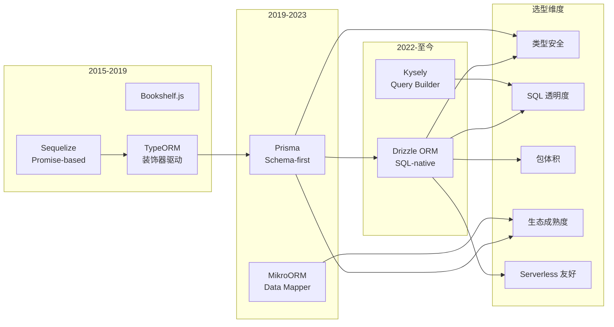

# ORM 深度：对象-关系阻抗失配

## 引言

对象-关系映射（Object-Relational Mapping, ORM）是连接面向对象编程世界与关系数据库世界的桥梁。然而，这两种范式在根本理念上存在深刻差异：面向对象编程强调封装、继承、多态和导航式对象图；关系模型则基于集合论，强调数据的无状态性、规范化和声明式查询。这种范式之间的鸿沟被称为**对象-关系阻抗失配（Object-Relational Impedance Mismatch）**，是 ORM 领域最核心、最持久的理论问题。

本文将从理论层面系统梳理阻抗失配的六大冲突维度，剖析 ORM 的三种经典架构模式（Active Record、Data Mapper、Unit of Work），并深入探讨 Lazy Loading 与 Eager Loading 的理论基础。在工程实践层面，我们将逐一分析 JS/TS 生态中五大主流 ORM/查询构建器——Prisma、TypeORM、Drizzle ORM、Kysely 和 MikroORM——的设计哲学、API 风格、类型安全策略以及在复杂查询场景下的能力与局限。

---

## 理论严格表述

### 2.1 对象-关系阻抗失配的六大冲突

Scott W. Ambler 于 2003 年系统总结了对象模型与关系模型之间的结构性冲突，归纳为六个核心维度。

#### 2.1.1 粒度冲突（Granularity）

**问题描述**：面向对象系统通常使用细粒度的对象模型，而关系数据库使用粗粒度的表行。一个业务对象可能由多个对象组成（如 `Order` 包含多个 `OrderLineItem`），但在数据库中通常对应两张独立的表。

**形式化表述**：设对象模型为 `O = {o₁, o₂, ..., oₙ}`，关系模型为 `R = {r₁, r₂, ..., rₘ}`。粒度冲突表现为映射函数 `φ: O → R` 不是一一对应的——多个对象可能映射到同一张表，或一个对象的属性分散在多张表中。

**工程表现**：在 TypeORM 中，`@Embedded()` 装饰器允许将值对象（Value Object）映射到同一张表的多个列，以缓解粒度冲突。Prisma 则通过复合类型（Composite Types，PostgreSQL 特有）和嵌入文档（MongoDB）来支持类似能力。

#### 2.1.2 继承冲突（Inheritance）

**问题描述**：面向对象支持单继承或多继承，而关系模型没有继承的概念。将类层次结构映射到关系表是 ORM 中最困难的问题之一。

**映射策略**：

| 策略 | 描述 | 优点 | 缺点 |
|------|------|------|------|
| **单表继承（Single Table Inheritance, STI）** | 整个继承层次映射到一张表，使用鉴别器列（Discriminator）区分类型 | 简单、无连接开销 | 表宽、大量 NULL 值、约束困难 |
| **类表继承（Class Table Inheritance, CTI）** | 每个类对应一张表，子表通过外键关联父表 | 规范化、约束清晰 | 查询需要多表连接、性能差 |
| **具体表继承（Concrete Table Inheritance）** | 每个具体类对应一张表，重复父类属性 | 查询高效 | 数据冗余、模式变更困难 |

**形式化分析**：设继承层次为 `C₁ ⊂ C₂ ⊂ ... ⊂ Cₖ`（`C₁` 为最具体类）。STI 的映射为 `φ_STI(Cᵢ) = r`，CTI 的映射为 `φ_CTI(Cᵢ) = rᵢ` 且存在外键 `FK(rᵢ) → PK(rᵢ₋₁)`。

TypeORM 支持全部三种策略（通过 `@TableInheritance()` 和 `@ChildEntity()` 配置）。Prisma 原生不支持继承映射，需通过组合或手动联合类型模拟。Drizzle 作为 SQL-like ORM，也不提供内置继承支持，开发者需自行设计表结构。

#### 2.1.3 身份冲突（Identity）

**问题描述**：面向对象使用内存地址作为对象身份（Object Identity），而关系数据库使用主键（Primary Key）标识元组。同一数据库行在应用层可能被加载为多个对象实例，导致身份不一致。

**形式化表述**：设数据库元组为 `t`，其主键为 `pk(t)`。应用层对象实例为 `o = load(t)`。身份冲突表现为：
`load(t₁) = o₁, load(t₁) = o₂, 但 o₁ ≠ o₂`（按引用比较）

**解决方案**：ORM 引入**身份映射（Identity Map）**模式——在单个工作单元（Unit of Work）内，保证同一主键的对象只存在一个实例。MikroORM 和 TypeORM 都实现了身份映射。Prisma 通过其客户端的内部缓存机制隐式实现类似功能。

#### 2.1.4 关联冲突（Association）

**问题描述**：对象模型使用双向引用（如 `user.orders` 和 `order.user`）表示关联，而关系模型仅通过外键（单向）维护关联。对象模型中的集合语义（如 `Set`、`List`、`Map`）与关系模型中的多值依赖也存在差异。

**形式化表述**：对象关联是**有向图** `G_o = (O, E_o)`，边 `e = (o₁, o₂) ∈ E_o` 表示对象引用。关系关联是**外键约束** `FK(rᵢ.A) → PK(rⱼ)`，本质上是逻辑断言而非物理引用。

**工程影响**：ORM 必须将对象的双向导航转换为单向外键。以 Prisma 为例，Schema 中定义 `user Order[]` 和 `order User? @relation(fields: [userId], references: [id])` 即是在对象层面表达双向关系，而底层数据库仅存储 `userId` 外键。

#### 2.1.5 导航冲突（Navigation）

**问题描述**：面向对象通过遍历对象图（如 `order.user.address.city`）访问数据，而关系模型通过连接（Join）一次性获取相关数据。对象导航通常是多次查询（N+1 问题），而关系连接是单次查询。

**形式化对比**：设对象图深度为 `d`，对象导航的时间复杂度在最坏情况下为 `O(d × n)`（N+1 问题）。关系代数通过连接算子可在单次查询中获取所有相关数据，时间复杂度取决于连接算法（Nested Loop `O(|r|×|s|)`、Hash Join `O(|r|+|s|)`、Merge Join `O(|r|log|r| + |s|log|s|)`）。

#### 2.1.6 数据获取冲突（Data Retrieval）

**问题描述**：面向对象倾向于按需加载（Lazy Loading）——仅在访问对象属性时才查询数据库。关系模型倾向于预先获取所有需要的数据（Eager Loading / Join）。两种策略在性能和语义上存在根本张力。

**形式化分析**：设查询 `Q` 需要访问对象 `o` 及其关联对象集合 `{a₁, a₂, ..., aₖ}`。

- Lazy Loading 的总成本为 `C_lazy = cost(load(o)) + Σ cost(load(aᵢ))`；
- Eager Loading 的总成本为 `C_eager = cost(load(o ⋈ a₁ ⋈ ... ⋈ aₖ))`。

当 `k` 较大或关联数据访问命中率高时，`C_eager < C_lazy`；反之，若仅访问少量关联数据，则 `C_lazy` 可能更优。

### 2.2 ORM 的架构模式

Martin Fowler 在《Patterns of Enterprise Application Architecture》中系统总结了三种核心的数据持久化模式。

#### 2.2.1 Active Record

**定义**：Active Record 将数据访问逻辑与领域逻辑封装在同一个类中。每个类对应一张数据库表，类的实例对应表中的一行，类的方法对应 CRUD 操作。

**形式化结构**：

```
class User extends ActiveRecord {
  // 领域逻辑
  validateEmail() { ... }

  // 数据访问逻辑（继承自基类）
  // save(), find(), update(), delete()
}
```

**优点**：简单直观，适合快速开发、领域逻辑简单的应用。
**缺点**：违反了单一职责原则（SRP）；难以应对复杂查询和跨事务操作；测试困难（与数据库紧耦合）。

**代表实现**：Ruby on Rails ActiveRecord、TypeORM（可选模式）、Sequelize。

#### 2.2.2 Data Mapper

**定义**：Data Mapper 将领域对象与数据库映射完全分离。领域对象（Domain Object）是纯粹的 POJO/POCO，不包含任何数据访问逻辑；映射器（Mapper）负责将对象转换为数据库行，反之亦然。

**形式化结构**：

```
class User {        // 纯领域对象
  name: string;
  email: string;
}

class UserMapper {   // 映射器
  insert(user: User): void;
  findById(id: number): User;
  update(user: User): void;
}
```

**优点**：领域对象与持久化解耦，便于单元测试（可 mock Mapper）；支持复杂映射策略（如继承映射、值对象嵌入）。
**缺点**：需要更多样板代码；学习曲线较陡。

**代表实现**：Hibernate（Java）、Entity Framework Core（.NET）、MikroORM、TypeORM（可选模式）。

#### 2.2.3 Unit of Work

**定义**：Unit of Work 维护一个受业务事务影响的对象列表，协调这些对象的变更写入，并处理并发问题（乐观锁/悲观锁）。

**工作流**：

1. 创建 Unit of Work 实例；
2. 通过 Unit of Work 注册新对象、标记修改、标记删除；
3. 提交时，Unit of Work 计算变更集（Change Set），按正确顺序生成并执行 SQL。

**形式化表述**：设 Unit of Work `U` 维护三个集合：`new(U)`、`dirty(U)`、`removed(U)`。提交操作定义为：
`commit(U) = execute(insert(new(U))); execute(update(dirty(U))); execute(delete(removed(U)))`

**代表实现**：Hibernate Session、Entity Framework DbContext、MikroORM EntityManager、TypeORM EntityManager。

### 2.3 Lazy Loading vs Eager Loading 的理论

**Lazy Loading（延迟加载）**：在首次访问对象的关联属性时才触发数据库查询。实现方式包括：

- **代理模式（Proxy Pattern）**：返回关联对象的代理（Proxy），在代理的方法调用时拦截并加载真实数据；
- **幽灵对象（Ghost Object）**：返回一个部分初始化的对象，在访问未加载属性时查询数据库。

**Eager Loading（贪婪加载）**：在加载主对象时，通过 JOIN 或批量查询预先加载关联对象。

**形式化比较**：设用户 `U` 有 `N` 篇帖子 `P`。

| 策略 | 查询次数 | 适用场景 |
|------|---------|---------|
| Lazy Loading | N+1（最坏情况） | 关联数据访问率低 |
| Eager Loading (JOIN) | 1 | 关联数据访问率高 |
| Eager Loading (BATCH) | 2 | 折中方案，避免大 JOIN |

**N+1 查询问题**：是 Lazy Loading 最常见的性能陷阱。形式化地，若查询 `Q` 返回 `n` 个主对象，每个主对象触发 `k` 个关联查询，则总查询次数为 `1 + n×k`。当 `n` 很大时，这将导致严重的性能退化。

### 2.4 领域模型与持久化模型的分离

在复杂系统中，推荐将**领域模型（Domain Model）**与**持久化模型（Persistence Model）**显式分离：

- **领域模型**：包含业务规则、不变量、领域事件，是核心业务的精确表达。通常采用**充血模型（Rich Domain Model）**设计。
- **持久化模型**：是数据库表的直接映射，仅用于数据存储和检索。通常采用**贫血模型（Anemic Model）**设计。

两者之间通过**映射层（Mapping Layer）**转换。这种分离的代价是增加了代码量和转换开销，但收益是领域模型的纯粹性和演化的独立性。

---

## 工程实践映射

### 3.1 Prisma 的 Schema-first 设计

Prisma 是当前 JS/TS 生态中最具影响力的 ORM 之一，其核心理念是 **Schema-first**：数据库模式（Schema）是唯一的真实来源（Single Source of Truth），所有类型、客户端 API 和迁移文件都从 Schema 生成。

**Prisma Schema Language（PSL）**示例：

```prisma
generator client {
  provider = "prisma-client-js"
}

datasource db {
  provider = "postgresql"
  url      = env("DATABASE_URL")
}

model User {
  id        Int      @id @default(autoincrement())
  email     String   @unique
  name      String?
  posts     Post[]
  createdAt DateTime @default(now())
  updatedAt DateTime @updatedAt
}

model Post {
  id       Int     @id @default(autoincrement())
  title    String
  content  String?
  published Boolean @default(false)
  author   User    @relation(fields: [authorId], references: [id])
  authorId Int
}
```

**生成流程**：

1. 开发者编写 `schema.prisma`；
2. 运行 `prisma generate`，Prisma 引擎解析 Schema 并生成类型安全的 TypeScript 客户端；
3. 生成的 `PrismaClient` 提供完全类型化的 CRUD API。

**Prisma Client 的使用**：

```typescript
import { PrismaClient } from '@prisma/client'

const prisma = new PrismaClient()

// 类型安全的查询，IDE 自动补全
const userWithPosts = await prisma.user.findUnique({
  where: { id: 1 },
  include: { posts: true }  // Eager Loading
})

// 关联创建
const newUser = await prisma.user.create({
  data: {
    email: 'alice@example.com',
    name: 'Alice',
    posts: {
      create: [
        { title: 'Hello World', published: true }
      ]
    }
  },
  include: { posts: true }
})
```

**Prisma 的优势**：

- **类型安全**：所有查询在编译时类型检查，无需额外运行时验证库；
- **自动补全**：生成的 API 与 Schema 严格对应，IDE 体验极佳；
- **迁移管理**：`prisma migrate dev` 自动生成 SQL 迁移脚本；
- **中间件**：支持查询中间件（Logging、Metrics、Caching）。

**Prisma 的局限**：

- 不支持继承映射（需手动模拟）；
- 复杂聚合和窗口函数支持有限（需使用 `$queryRaw`）；
- 运行时包体积较大（约 15MB+，含 Rust Query Engine 二进制文件）。

### 3.2 TypeORM 的装饰器驱动

TypeORM 是最成熟的 JS/TS ORM 之一，采用**装饰器驱动（Decorator-driven）**的 Active Record / Data Mapper 双模式设计。

**Data Mapper 模式示例**：

```typescript
import { Entity, PrimaryGeneratedColumn, Column,
         OneToMany, ManyToOne, JoinColumn, Repository } from 'typeorm'

@Entity()
export class User {
  @PrimaryGeneratedColumn()
  id: number

  @Column({ unique: true })
  email: string

  @Column({ nullable: true })
  name: string | null

  @OneToMany(() => Post, post => post.author)
  posts: Post[]
}

@Entity()
export class Post {
  @PrimaryGeneratedColumn()
  id: number

  @Column()
  title: string

  @Column({ type: 'text', nullable: true })
  content: string | null

  @ManyToOne(() => User, user => user.posts)
  @JoinColumn({ name: 'author_id' })
  author: User

  @Column({ name: 'author_id' })
  authorId: number
}
```

**Repository 模式**：

```typescript
import { AppDataSource } from './data-source'

const userRepository = AppDataSource.getRepository(User)

// 基础 CRUD
const user = await userRepository.findOne({ where: { id: 1 } })

// 关联查询（Eager Loading）
const userWithPosts = await userRepository.findOne({
  where: { id: 1 },
  relations: { posts: true }
})

// 复杂条件
const users = await userRepository.find({
  where: { email: Like('%@example.com') },
  order: { createdAt: 'DESC' },
  take: 10,
  skip: 0
})
```

**TypeORM 的继承映射**：

```typescript
@Entity()
@TableInheritance({ column: { type: 'varchar', name: 'type' } })
export abstract class Content {
  @PrimaryGeneratedColumn()
  id: number

  @Column()
  title: string
}

@ChildEntity()
export class Photo extends Content {
  @Column()
  url: string
}

@ChildEntity()
export class Video extends Content {
  @Column()
  duration: number
}
```

**TypeORM 的现状**：TypeORM 在 0.3.x 版本后引入了大量破坏性变更，社区活跃度有所下降。对于新项目，Prisma 或 Drizzle 通常是更优选择，但 TypeORM 在需要复杂继承映射和已有大型代码库的项目中仍有价值。

### 3.3 Drizzle ORM 的 SQL-like API

Drizzle ORM 是 2022 年后快速崛起的新一代 ORM，其设计哲学是 **"If you know SQL, you know Drizzle"**——API 尽可能贴近原生 SQL，同时提供完整的类型安全。

**Schema 定义（TypeScript）**：

```typescript
import { pgTable, serial, varchar, text, integer,
         timestamp, boolean, uniqueIndex } from 'drizzle-orm/pg-core'
import { relations } from 'drizzle-orm'

export const users = pgTable('users', {
  id: serial('id').primaryKey(),
  email: varchar('email', { length: 255 }).notNull().unique(),
  name: varchar('name', { length: 255 }),
  createdAt: timestamp('created_at').defaultNow().notNull(),
})

export const posts = pgTable('posts', {
  id: serial('id').primaryKey(),
  title: varchar('title', { length: 255 }).notNull(),
  content: text('content'),
  published: boolean('published').default(false).notNull(),
  authorId: integer('author_id').notNull().references(() => users.id),
})

// 关系定义
export const usersRelations = relations(users, ({ many }) => ({
  posts: many(posts),
}))

export const postsRelations = relations(posts, ({ one }) => ({
  author: one(users, {
    fields: [posts.authorId],
    references: [users.id],
  }),
}))
```

**查询构建**：

```typescript
import { eq, like, desc, sql } from 'drizzle-orm'
import { db } from './db'

// 单表查询
const user = await db.select().from(users).where(eq(users.id, 1))

// 关联查询（JOIN）
const result = await db
  .select({
    userId: users.id,
    userName: users.name,
    postTitle: posts.title,
  })
  .from(users)
  .innerJoin(posts, eq(users.id, posts.authorId))
  .where(eq(posts.published, true))
  .orderBy(desc(posts.createdAt))

// 聚合查询
const stats = await db
  .select({
    authorId: posts.authorId,
    count: sql<number>`count(*)`,
  })
  .from(posts)
  .groupBy(posts.authorId)

// 子查询
const subquery = db.select({ id: users.id }).from(users).where(eq(users.email, 'test@example.com')).as('sub')
const result2 = await db.select().from(posts).where(eq(posts.authorId, subquery.id))
```

**Drizzle 的核心优势**：

- **零运行时开销**：API 调用直接编译为 SQL 字符串，无额外的查询解析层；
- **极小体积**：核心包仅约 15KB，对 Serverless 场景极为友好；
- **SQL 透明性**：生成的 SQL 直观可预测，便于优化和调试；
- **多数据库支持**：PostgreSQL、MySQL、SQLite 均有一致的 API。

**Drizzle 的局限**：

- 关系查询语法相比 Prisma 更冗长；
- 生态系统较新，部分高级功能（如迁移冲突解决）仍在完善中。

### 3.4 Kysely 的查询构建器

Kysely 是一个**类型安全的关系型 SQL 查询构建器**，它不提供 Schema 定义层，而是要求开发者手动定义表接口。

**类型定义**：

```typescript
import { Generated, Selectable, Insertable, Updateable } from 'kysely'

export interface Database {
  users: UsersTable
  posts: PostsTable
}

export interface UsersTable {
  id: Generated<number>
  email: string
  name: string | null
  createdAt: Generated<Date>
}

export interface PostsTable {
  id: Generated<number>
  title: string
  content: string | null
  published: boolean
  authorId: number
}
```

**查询构建**：

```typescript
import { Kysely, PostgresDialect } from 'kysely'
import { Pool } from 'pg'

const db = new Kysely<Database>({
  dialect: new PostgresDialect({
    pool: new Pool({ connectionString: process.env.DATABASE_URL })
  })
})

// 基础查询
const user = await db
  .selectFrom('users')
  .where('id', '=', 1)
  .selectAll()
  .executeTakeFirst()

// JOIN 查询
const postsWithAuthors = await db
  .selectFrom('posts')
  .innerJoin('users', 'users.id', 'posts.authorId')
  .where('posts.published', '=', true)
  .select(['posts.id', 'posts.title', 'users.name as authorName'])
  .execute()

// 插入
const newUser = await db
  .insertInto('users')
  .values({ email: 'alice@example.com', name: 'Alice' })
  .returningAll()
  .executeTakeFirst()

// CTE（Common Table Expression）
const result = await db
  .with('recent_posts', (qb) =>
    qb.selectFrom('posts')
      .where('createdAt', '>', sql<Date>`now() - interval '7 days'`)
      .selectAll()
  )
  .selectFrom('recent_posts')
  .selectAll()
  .execute()
```

**Kysely 的定位**：Kysely 不是完整的 ORM，而是"类型安全的 SQL"。它适合：

- 不想引入 ORM 抽象层，但希望获得编译时类型检查的团队；
- 需要直接控制 SQL 生成的高级场景；
- 与 Zod 等运行时验证库配合，实现"编译时 + 运行时"双重安全。

### 3.5 MikroORM 的 Data Mapper 实现

MikroORM 是一个受 PHP Doctrine 启发的 Data Mapper ORM，在 Node.js 生态中提供了最完整的 Data Mapper + Unit of Work 实现。

**实体定义**：

```typescript
import { Entity, PrimaryKey, Property, OneToMany,
         ManyToOne, Collection, Cascade } from '@mikro-orm/core'

@Entity()
export class User {
  @PrimaryKey()
  id!: number

  @Property({ unique: true })
  email!: string

  @Property({ nullable: true })
  name?: string

  @OneToMany(() => Post, post => post.author, { cascade: [Cascade.ALL] })
  posts = new Collection<Post>(this)

  @Property()
  createdAt = new Date()
}

@Entity()
export class Post {
  @PrimaryKey()
  id!: number

  @Property()
  title!: string

  @Property({ nullable: true })
  content?: string

  @ManyToOne(() => User)
  author!: User

  @Property()
  published = false
}
```

**Unit of Work 模式**：

```typescript
import { MikroORM, EntityManager } from '@mikro-orm/core'

const orm = await MikroORM.init({ ... })
const em = orm.em.fork()  // 创建新的 EntityManager（Unit of Work）

// 创建对象
const user = new User()
user.email = 'alice@example.com'
user.name = 'Alice'
em.persist(user)  // 注册到 Unit of Work

// 修改对象
user.name = 'Alice Updated'
// 无需显式调用 update，Unit of Work 跟踪变更

// 提交
await em.flush()  // 自动生成并执行 INSERT/UPDATE SQL

// 查询（Identity Map 保证同一主键只返回一个实例）
const u1 = await em.findOne(User, { id: 1 })
const u2 = await em.findOne(User, { id: 1 })
console.log(u1 === u2)  // true
```

**MikroORM 的特色功能**：

- **自动批处理（Auto-batching）**：自动将多个独立查询合并为批量查询，减少 N+1 问题；
- **结果缓存**：内置查询结果缓存，支持 Redis 作为后端；
- **Populate 策略**：灵活的 Eager Loading 控制（`em.find(User, {}, { populate: ['posts'] })`）；
- **事件系统**：支持生命周期钩子（`@BeforeCreate()`、`@AfterUpdate()` 等）。

### 3.6 Raw SQL 与 ORM 的混合策略

在实际工程中，完全依赖 ORM 或完全使用 Raw SQL 都不是最优解。推荐的混合策略如下：

**使用 ORM 的场景**：

- 标准 CRUD 操作（占比通常 80% 以上）；
- 需要类型安全和自动补全的查询；
- 简单到中等复杂度的关联查询。

**使用 Raw SQL 的场景**：

- 复杂聚合和统计分析；
- 需要使用数据库特定的高级功能（窗口函数、CTE、Lateral Join、递归查询）；
- 性能关键路径，需要精确控制执行计划。

**在 Prisma 中使用 Raw SQL**：

```typescript
// 类型安全 Raw Query（使用 Prisma.$queryRaw 和模板字面量标签）
const result = await prisma.$queryRaw<{ id: number; name: string }[]>`
  SELECT id, name FROM users
  WHERE created_at > ${new Date('2024-01-01')}
  ORDER BY id DESC
`

// 注意：模板字面量中的变量会自动参数化，防止 SQL 注入
```

**在 Drizzle 中使用 Raw SQL**：

```typescript
import { sql } from 'drizzle-orm'

const result = await db.execute(sql`
  WITH ranked_posts AS (
    SELECT *, ROW_NUMBER() OVER (PARTITION BY author_id ORDER BY created_at DESC) as rn
    FROM posts
  )
  SELECT * FROM ranked_posts WHERE rn <= 5
`)
```

### 3.7 复杂查询的 ORM 限制与绕过

现代 SQL 提供了远超标准 CRUD 的强大功能，但 ORM 对这些功能的支持程度参差不齐。

#### 3.7.1 CTE（Common Table Expression）

CTE 允许定义临时结果集，常用于递归查询和复杂分解。

- **Prisma**：不支持原生 CTE，需使用 `$queryRaw`。
- **Drizzle**：通过 `with()` 方法原生支持 CTE。
- **Kysely**：通过 `with()` 方法原生支持 CTE。
- **TypeORM**：不支持原生 CTE，需使用 `QueryBuilder` 的 `getRawMany()` 或原生查询。
- **MikroORM**：不支持原生 CTE，需使用原生查询。

#### 3.7.2 窗口函数（Window Functions）

窗口函数（`ROW_NUMBER()`、`RANK()`、`LAG()`、`LEAD()`、`SUM() OVER (...)` 等）在分析查询中不可或缺。

- **Prisma**：不支持，需 `$queryRaw`。
- **Drizzle**：通过 `sql` 模板函数支持。
- **Kysely**：通过 `over()` 和 `partitionBy()` 方法支持。
- **TypeORM/MikroORM**：不支持，需原生查询。

#### 3.7.3 Lateral Join

Lateral Join 允许子查询引用主查询的列，是实现"每组取 Top N"的优雅方案。

```sql
SELECT u.id, u.name, p.title
FROM users u
LEFT JOIN LATERAL (
  SELECT title FROM posts
  WHERE author_id = u.id
  ORDER BY created_at DESC
  LIMIT 3
) p ON true
```

所有主要 ORM 均不支持 Lateral Join 的原生 API，需使用 Raw SQL。

---

## Mermaid 图表

### ORM 架构模式对比

```mermaid
graph TB
    subgraph ActiveRecord["Active Record 模式"]
        AR_Domain["领域对象 + 数据访问"]
        AR_DB[(数据库)]
        AR_Domain -->|直接操作| AR_DB
    end

    subgraph DataMapper["Data Mapper 模式"]
        DM_Domain["纯领域对象"]
        DM_Mapper["Mapper / Repository"]
        DM_DB[(数据库)]
        DM_Domain <-->|对象 <-> 数据行| DM_Mapper
        DM_Mapper -->|SQL| DM_DB
    end

    subgraph UnitOfWork["Unit of Work 模式"]
        UoW_Domain["领域对象集合"]
        UoW_Registry["变更注册表<br/>new / dirty / removed"]
        UoW_Commit["Commit / Flush"]
        UoW_DB[(数据库)]
        UoW_Domain -->|注册变更| UoW_Registry
        UoW_Registry -->|生成变更集| UoW_Commit
        UoW_Commit -->|批量执行 SQL| UoW_DB
    end
```



### JS/TS ORM 生态演进与选型矩阵



---

## 理论要点总结

1. **阻抗失配是 ORM 的根本挑战**：粒度、继承、身份、关联、导航、数据获取六大冲突源于对象模型与关系模型的范式差异，不存在完美的自动映射方案。

2. **ORM 模式的选择影响架构演进**：Active Record 适合快速开发和小型项目，Data Mapper 适合复杂领域模型和长期维护的项目，Unit of Work 是管理事务边界和并发控制的核心机制。

3. **Lazy Loading 是把双刃剑**：它提供了对象导航的便利性，但极易引发 N+1 查询问题。在现代应用中，显式的 Eager Loading 策略和批量查询通常是更可控的选择。

4. **类型安全是新一代 ORM 的核心卖点**：Prisma 的 Schema-first 生成、Drizzle 的 SQL-like 类型推导、Kysely 的手动类型定义代表了三种不同的类型安全实现路径。

5. **ORM 与 Raw SQL 的混合是工程现实**：标准 CRUD 使用 ORM 保证开发效率，复杂查询使用 Raw SQL 保证表达能力和性能。关键在于在项目中建立清晰的边界约定。

6. **领域模型与持久化模型的分离是高级实践**：在复杂业务系统中，显式分离领域模型和持久化模型，配合 Anti-Corruption Layer，可以保护核心业务逻辑免受数据层演化的影响。

---

## 参考资源

1. Fowler, M. (2002). *Patterns of Enterprise Application Architecture*. Addison-Wesley Professional. —— 企业应用架构模式的权威参考书，系统阐述了 Active Record、Data Mapper、Unit of Work、Identity Map、Lazy Loading 等核心模式的形式化定义和适用场景。

2. Ambler, S. W. (2003). "The Object-Relational Impedance Mismatch." *Agile Data*. —— 对象-关系阻抗失配问题的系统性分析，提出了粒度、继承、身份、关联、导航、数据获取六大冲突维度。

3. Prisma 官方文档. "Prisma Schema Reference." <https://www.prisma.io/docs/orm/reference/prisma-schema-reference> —— Prisma Schema Language 的完整参考，涵盖所有模型定义、字段修饰符、关系配置和数据库特性映射。

4. TypeORM 官方文档. "TypeORM Documentation." <https://typeorm.io/> —— TypeORM 的完整文档，包括装饰器参考、Repository API、QueryBuilder、继承映射和迁移管理。

5. Drizzle ORM 官方文档. "Drizzle ORM Documentation." <https://orm.drizzle.team/> —— Drizzle ORM 和 Drizzle Kit 的官方文档，展示了 SQL-like API 的设计哲学和类型安全实现机制。
