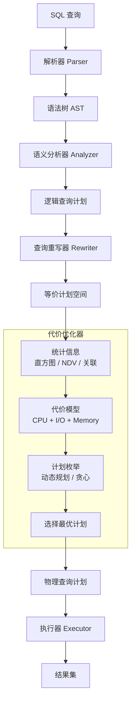

# 查询优化：从索引到执行计划

## 引言

数据库查询优化是连接理论数据库学与工程实践的核心领域。一个看似简单的 `SELECT` 语句，在数据库内部可能经历语法解析、语义检查、查询重写、优化器枚举、执行计划生成和物理执行等多个阶段。理解这一过程的原理，是构建高性能数据访问层的前提。

本文从理论层面系统阐述查询优化的数学基础——关系代数等价变换和代价模型，深入分析 B-Tree 索引的结构与复杂度，剖析查询执行计划的各种扫描和连接策略。在工程实践层面，我们将聚焦于 JS/TS 开发者日常工作中最常遇到的问题：如何解读 `EXPLAIN ANALYZE` 输出、如何设计有效的索引策略、如何处理分页性能陷阱，以及如何构建多层缓存架构。

---

## 理论严格表述

### 2.1 查询优化的理论基础

**定义 2.1（查询优化器）**
查询优化器是数据库管理系统中负责将逻辑查询计划（Logical Query Plan）转换为高效物理查询计划（Physical Query Plan）的组件。其目标是找到执行成本最低的等价计划。

**2.1.1 关系代数等价变换**

查询优化器的理论基础是**关系代数的等价性（Equivalence）**。两个关系代数表达式 `E₁` 和 `E₂` 是等价的，当且仅当对于所有可能的数据库实例，它们产生相同的结果集。

核心等价规则包括：

**规则 1：选择下推（Selection Pushdown）**
`σ_θ(r ⋈ s) ≡ σ_θ(r) ⋈ s`（当 `θ` 仅涉及 `r` 的属性时）
选择下推是最重要、最常用的优化规则——尽早过滤数据可以显著减少后续操作的数据量。

**规则 2：投影下推（Projection Pushdown）**
`π_A(r ⋈ s) ≡ π_A(π_B(r) ⋈ π_C(s))`
其中 `B` 和 `C` 是各自关系在连接中需要的属性子集。投影下推减少中间结果集的宽度。

**规则 3：连接交换律（Join Commutativity）**
`r ⋈ s ≡ s ⋈ r`

**规则 4：连接结合律（Join Associativity）**
`(r ⋈ s) ⋈ t ≡ r ⋈ (s ⋈ t)`

规则 3 和 4 允许优化器改变连接的顺序。对于 `n` 个表的连接，可能的连接顺序数为 Catalan 数 `C(n-1) = (2(n-1))! / ((n-1)! × n!)`， grows exponentially。因此，优化器通常采用动态规划（Dynamic Programming）或贪心启发式来枚举连接顺序。

**规则 5：选择与投影的交换**
`π_A(σ_θ(r)) ≡ σ_θ(π_A(r))`（当 `θ` 仅涉及 `A` 中的属性时）

**2.1.2 代价模型（Cost Model）**

优化器通过**代价模型**估计不同执行计划的执行成本。代价通常表示为 I/O 成本、CPU 成本和内存成本的加权和。

**基数估计（Cardinality Estimation）**：
设关系 `r` 的元组数为 `|r|`（基数）。选择操作 `σ_{A=c}(r)` 的结果基数估计为：
`Est(|σ_{A=c}(r)|) = |r| / V(A, r)`
其中 `V(A, r)` 是属性 `A` 的不同值数量（即 NDV, Number of Distinct Values）。这个公式基于**均匀分布假设（Uniformity Assumption）**——假设属性值均匀分布。

更精确的估计使用**直方图（Histogram）**：将属性值的分布划分为多个桶（Bucket），在每个桶内假设均匀分布。PostgreSQL 和 MySQL 8.0 都支持多列直方图统计信息。

**选择性（Selectivity）**：
选择性 `sel(θ)` 定义为满足条件 `θ` 的元组比例。选择操作的代价与选择性直接相关：低选择性（过滤掉大量数据）的操作应尽早执行。

### 2.2 B-Tree 索引的结构与复杂度

B-Tree（Balanced Tree）是数据库中最广泛使用的索引结构，由 Bayer 和 McCreight 于 1972 年发明。

**定义 2.2（B-Tree）**
阶数为 `m` 的 B-Tree 满足以下性质：

1. 每个节点最多有 `m` 个子节点；
2. 每个非根节点至少有 `⌈m/2⌉` 个子节点；
3. 根节点至少有 2 个子节点（除非它是叶子）；
4. 所有叶子节点位于同一层（平衡性）；
5. 节点内的键按非降序排列。

在数据库实现中（如 PostgreSQL 的 B-Tree、InnoDB 的 B+Tree），通常使用 **B+Tree 变体**：所有数据指针仅存在于叶子节点，内部节点仅存储导航键。叶子节点通过链表连接，支持高效的范围扫描。

**复杂度分析**：

- **查找**：`O(log_m N)`，其中 `N` 是索引条目总数。由于 `m` 通常较大（InnoDB 页大小 16KB，每页可存储数百个键），树高通常不超过 3-4 层。
- **插入**：`O(log_m N)`，最坏情况下需要分裂节点（Cascading Splits）。
- **删除**：`O(log_m N)`，可能触发节点合并或借用。
- **范围扫描**：`O(log_m N + k)`，其中 `k` 是结果集大小。叶子节点的链表结构使范围扫描无需回溯内部节点。

**2.2.1 复合索引的最左前缀原则**

复合索引（Composite Index）是在多个列上建立的索引，形式化为有序元组 `(c₁, c₂, ..., cₖ)`。

**定理 2.3（最左前缀原则）**
对于复合索引 `(c₁, c₂, ..., cₖ)`，查询能够使用该索引的条件是其 `WHERE` 子句包含索引的最左前缀：

- `(c₁)` 可用；
- `(c₁, c₂)` 可用；
- `(c₂)` **不可用**（除非数据库支持索引跳跃扫描）；
- `(c₁, c₃)` 只能使用 `c₁` 部分。

形式化地，设查询条件为 `θ`，复合索引为 `I = (A₁, A₂, ..., Aₙ)`。若 `θ` 可表示为 `A₁ = v₁ AND A₂ = v₂ AND ... AND Aₖ = vₖ AND ...`，则索引可用于前 `k` 列，其中 `k` 是连续匹配的最长前缀长度。

**示例**：索引 `(last_name, first_name, age)`

- `WHERE last_name = 'Smith'` → 使用索引；
- `WHERE last_name = 'Smith' AND first_name = 'John'` → 使用索引前两列；
- `WHERE first_name = 'John'` → 不使用索引（最左前缀缺失）；
- `WHERE last_name = 'Smith' AND age = 30` → 仅使用 `last_name` 列。

### 2.3 覆盖索引的理论

**定义 2.4（覆盖索引，Covering Index）**
若索引 `I` 包含了查询 `Q` 所需的所有列（包括 `SELECT`、`WHERE`、`ORDER BY` 中的列），则称 `I` 是 `Q` 的覆盖索引。使用覆盖索引时，数据库无需访问表的数据页（Heap/Clustered Index），仅通过索引页即可回答查询。

**性能收益**：覆盖索引消除了回表操作（Index Lookup / Bookmark Lookup），将随机 I/O 转换为顺序 I/O，通常可将查询性能提升一个数量级。

**形式化条件**：设查询 `Q` 的投影属性集为 `Π(Q)`，谓词属性集为 `Σ(Q)`，排序属性集为 `Ω(Q)`。索引 `I` 覆盖 `Q` 当且仅当：
`Π(Q) ∪ Σ(Q) ∪ Ω(Q) ⊆ columns(I)`

**工程权衡**：覆盖索引增加了索引的宽度和存储开销。对于写密集型表，过多的宽索引会显著降低写入性能。遵循"读取频繁、写入不频繁"的列才适合加入覆盖索引。

### 2.4 查询执行计划的形式化

数据库执行计划是树形结构，每个节点代表一个物理操作符。以下是核心操作符的分类：

**2.4.1 扫描操作符（Scan Operators）**

| 操作符 | 描述 | 代价模型 | 适用场景 |
|-------|------|---------|---------|
| **Seq Scan** | 顺序扫描整个表 | `O(N_pages)` | 小表、高选择性查询、无可用索引 |
| **Index Scan** | 通过索引定位，再回表取数据 | `O(log N + k × page_cost)` | 中低选择性，需要非索引列 |
| **Index Only Scan** | 仅扫描索引，不回表 | `O(log N + k)` | 覆盖索引可用时 |
| **Bitmap Scan** | 索引生成位图，合并后批量回表 | `O(log N + N_bitmap_pages + k × page_cost)` | 多条件 OR/AND、低选择性 |

**Bitmap Scan 的原理**：当查询条件涉及多个索引时（如 `WHERE a = 1 AND b = 2`，`a` 和 `b` 各有索引），数据库可分别扫描两个索引生成位图（Bitmap），通过位运算（AND/OR）合并位图，然后按物理顺序批量访问数据页。这避免了随机 I/O，优于多次 Index Scan。

**2.4.2 连接操作符（Join Operators）**

| 操作符 | 算法 | 时间复杂度 | 空间复杂度 | 适用场景 |
|-------|------|-----------|-----------|---------|
| **Nested Loop Join** | 对外表每行扫描内表 | `O(|R| × |S|)` | `O(1)` | 小表驱动、内表有索引 |
| **Hash Join** | 构建哈希表，探测匹配 | `O(|R| + |S|)` | `O(|R|)` | 等值连接、大表、无索引 |
| **Merge Join** | 排序后双指针归并 | `O(|R|log|R| + |S|log|S|)` | `O(1)` | 等值连接、已排序数据 |

**Nested Loop Join**：最简单，对外表 `R` 的每一行 `r`，扫描内表 `S` 寻找匹配。若内表有索引且 `S` 较小，复杂度可降为 `O(|R| × log|S|)`。在 PostgreSQL 中，这是唯一支持非等值连接（`<`、`>`、`LIKE`）的连接算法。

**Hash Join**：分两个阶段——**构建阶段（Build Phase）**扫描较小的表 `R` 构建内存哈希表；**探测阶段（Probe Phase）**扫描较大的表 `S`，在哈希表中查找匹配。要求 `R` 能够放入内存（或工作内存 `work_mem`），否则需要分批处理（Grace Hash Join），性能显著下降。

**Merge Join**：要求输入数据按连接键排序。若数据已排序（如有索引），则效率极高；否则需要额外的排序开销。

---

## 工程实践映射

### 3.1 EXPLAIN ANALYZE 的解读

`EXPLAIN` 是数据库提供的查询计划查看工具，`EXPLAIN ANALYZE` 不仅显示计划，还实际执行查询并报告真实耗时和行数。

**PostgreSQL EXPLAIN ANALYZE 示例**：

```sql
EXPLAIN (ANALYZE, BUFFERS, FORMAT JSON)
SELECT u.name, p.title, p.created_at
FROM users u
JOIN posts p ON p.author_id = u.id
WHERE u.created_at > '2024-01-01'
  AND p.published = true
ORDER BY p.created_at DESC
LIMIT 20;
```

**关键字段解读**：

| 字段 | 含义 | 优化提示 |
|------|------|---------|
| `cost=0.00..1234.56` | 代价估计（启动代价..总代价） | 总代价过高时考虑索引优化 |
| `actual time=0.023..45.67` | 实际执行时间（毫秒） | 与估计差距大说明统计信息过时 |
| `rows=100` | 估计返回行数 | 与实际 `rows` 差距大需 `ANALYZE` |
| `loops=5` | 节点执行次数 | Nested Loop 的内表会多次执行 |
| `Buffers: shared read=1000` | 读取的共享缓冲区页数 | 高值表示大量 I/O，考虑索引 |
| `Planning Time` | 优化器生成计划的时间 | 通常 < 1ms，复杂查询可能更高 |
| `Execution Time` | 实际执行时间 | 关注的主要指标 |

**红色警报模式识别**：

1. **Seq Scan on 大表**：大表上的顺序扫描通常是性能瓶颈。检查 `WHERE` 条件是否利用了索引，或统计信息是否过时。

2. **Nested Loop 内表是 Seq Scan**：若外表较大且内表无索引，Nested Loop 的代价为 `O(|R| × |S|)`，极其昂贵。考虑添加索引或改用 Hash Join。

3. **Bitmap Heap Scan + Recheck Cond**：Bitmap Scan 后的 Recheck 表示索引条件不能精确过滤，需要回表验证。若 Recheck 比例高，说明索引选择性不足。

4. **高 `actual rows` vs `planned rows` 偏差**：当实际行数远大于估计行数时，优化器可能选择了次优计划。运行 `ANALYZE table_name` 更新统计信息。

**MySQL EXPLAIN 解读要点**：

MySQL 的 `EXPLAIN` 输出为表格形式，关键列包括：

- `type`：访问类型，从优到劣依次为 `system > const > eq_ref > ref > range > index > ALL`。`ALL` 表示全表扫描。
- `key`：实际使用的索引。`NULL` 表示未使用索引。
- `rows`：估计扫描的行数。
- `Extra`：额外信息。`Using index` 表示覆盖索引；`Using where` 表示回表后过滤；`Using filesort` 表示需要额外排序（性能警告）。

### 3.2 索引设计最佳实践

**3.2.1 何时创建索引**

索引的收益场景：

- 频繁用于 `WHERE`、`JOIN`、`ORDER BY`、`GROUP BY` 的列；
- 具有高选择性（NDV 高）的列；
- 外键列（自动创建索引可加速级联操作和连接）。

索引的成本：

- 每次 `INSERT`、`UPDATE`、`DELETE` 需要维护索引结构（B-Tree 的分裂与合并）；
- 索引占用额外存储空间；
- 过多的索引会增加优化器的选择负担（计划枚举空间增大）。

**3.2.2 复合索引设计原则**

1. **等值查询列在前，范围查询列在后**：
   索引 `(status, created_at)` 优于 `(created_at, status)`，因为 `status = 'published'` 是等值条件，`created_at > '2024-01-01'` 是范围条件。等值列在前可以精确定位前缀，范围列在后利用有序性。

2. **高选择性列在前**：
   选择性高的列放在前面可以更快缩小扫描范围。

3. **避免冗余索引**：
   索引 `(a)` 和 `(a, b)` 中，前者是冗余的（后者覆盖前者的所有用例，除非 `b` 极大增加索引维护成本）。

4. **考虑覆盖索引**：
   对于频繁查询但很少更新的表，设计覆盖索引消除回表。

**3.2.3 何时避免索引**

- 频繁更新的列（索引维护成本高）；
- 低选择性列（如布尔值、状态仅有几种取值）；
- 小表（全表扫描可能快于索引查找）；
- 写远多于读的表（索引维护开销可能超过查询收益）。

**3.2.4 部分索引（Partial Index）**

PostgreSQL 支持部分索引——仅对满足条件的行建立索引：

```sql
CREATE INDEX idx_posts_published_recent
ON posts(created_at)
WHERE published = true AND created_at > '2024-01-01';
```

部分索引显著减小索引体积，提高查询效率，特别适合"热数据"查询场景。

### 3.3 慢查询日志分析

**PostgreSQL 慢查询配置**：

```ini
# postgresql.conf
log_min_duration_statement = 1000   -- 记录执行超过 1000ms 的查询
log_statement = 'all'               -- 可选：记录所有语句（开发环境）
log_line_prefix = '%t [%p]: [%l-1] user=%u,db=%d,app=%a,client=%h '
```

**pgBadger** 是 PostgreSQL 的高性能日志分析工具，可生成 HTML 报告，包含：

- 最慢查询排行
- 查询频率热力图
- 等待事件分析
- 临时文件使用统计

**MySQL 慢查询配置**：

```sql
SET GLOBAL slow_query_log = 'ON';
SET GLOBAL long_query_time = 1;     -- 超过 1 秒
SET GLOBAL log_queries_not_using_indexes = 'ON';
```

**pt-query-digest**（Percona Toolkit）是 MySQL 慢查询分析的标准工具：

```bash
pt-query-digest /var/log/mysql/slow.log > slow-query-report.txt
```

### 3.4 Prisma 的查询优化

Prisma Client 提供了多种机制来控制查询行为，避免常见的性能陷阱。

**3.4.1 select / include 字段限制**

默认情况下，Prisma 返回模型的所有标量字段。通过 `select` 显式指定字段，减少数据传输：

```typescript
// 不良：返回所有字段
const users = await prisma.user.findMany()

// 良好：仅返回需要的字段
const users = await prisma.user.findMany({
  select: { id: true, email: true, name: true }
})
```

**3.4.2 关联查询控制**

```typescript
// 不良：可能触发 N+1
const users = await prisma.user.findMany()
for (const user of users) {
  const posts = await prisma.post.findMany({ where: { authorId: user.id } })
  // 1 + N 次查询
}

// 良好：使用 include 进行 Eager Loading
const usersWithPosts = await prisma.user.findMany({
  include: { posts: true }
  // 1 次查询（通过 JOIN 或批量查询）
})

// 更好：控制关联返回的字段
const usersWithPosts = await prisma.user.findMany({
  include: {
    posts: {
      select: { id: true, title: true },
      where: { published: true },
      orderBy: { createdAt: 'desc' },
      take: 5  // 每用户最多 5 篇
    }
  }
})
```

**3.4.3 批量操作**

Prisma 支持批量创建和更新，减少往返次数：

```typescript
// 批量创建
await prisma.user.createMany({
  data: [
    { email: 'a@example.com', name: 'A' },
    { email: 'b@example.com', name: 'B' },
    { email: 'c@example.com', name: 'C' },
  ],
  skipDuplicates: true
})

// 批量更新（通过唯一键）
await prisma.user.updateMany({
  where: { status: 'pending' },
  data: { status: 'active' }
})
```

**3.4.4 交互式事务**

```typescript
await prisma.$transaction(async (tx) => {
  const user = await tx.user.create({ data: { email: 'test@example.com' } })
  await tx.profile.create({ data: { userId: user.id, bio: 'Hello' } })
})
```

### 3.5 数据库分页策略

分页是 Web 应用中最常见的查询模式，但不同策略在性能和功能上有显著差异。

**3.5.1 Offset Pagination（偏移分页）**

```sql
SELECT * FROM posts
ORDER BY created_at DESC
LIMIT 20 OFFSET 1000;
```

**原理**：跳过前 `OFFSET` 行，返回接下来的 `LIMIT` 行。

**优点**：实现简单；支持跳转到任意页。
**缺点**：

- **性能退化**：`OFFSET` 值增大时，数据库仍需扫描并丢弃 `OFFSET` 行，时间复杂度为 `O(OFFSET + LIMIT)`；
- **数据漂移**：在分页过程中若有新数据插入/删除，导致同一数据出现在多页或遗漏。

**适用场景**：数据量小（< 10,000 行）、不需要深度分页、对数据一致性要求不高的管理后台。

**3.5.2 Cursor Pagination（游标分页）**

```sql
SELECT * FROM posts
WHERE (created_at, id) < ('2024-03-15T10:00:00Z', 12345)
ORDER BY created_at DESC, id DESC
LIMIT 20;
```

**原理**：以上一页最后一条记录的唯一排序键作为游标，查询比该游标"更小"的记录。

**优点**：

- **性能稳定**：时间复杂度始终为 `O(LIMIT)`，与深度无关；
- **无数据漂移**：基于不可变游标，不受插入/删除影响。
**缺点**：
- 不支持跳转到任意页（只能上一页/下一页）；
- 要求游标列具有唯一性（通常使用复合游标 `(created_at, id)`）。

**适用场景**：无限滚动（Infinite Scroll）、社交 feeds、消息列表等需要高性能深度分页的场景。

**3.5.3 Keyset Pagination（键集分页）**

键集分页是游标分页的理论名称，强调使用键值集合（Keyset）而非偏移量定位数据。

**在 Prisma 中实现 Cursor Pagination**：

```typescript
const posts = await prisma.post.findMany({
  take: 20,
  skip: 1,           // 跳过游标行本身
  cursor: { id: lastPostId },  // 上一页最后一条的 ID
  orderBy: { createdAt: 'desc' }
})
```

**3.5.4 混合策略：Seek Method**

对于需要同时支持跳页和深度分页的场景，可以采用混合策略：

- 前几页使用 Offset Pagination（用户可跳页）；
- 深度分页自动切换为 Cursor Pagination（保证性能）。

### 3.6 全文搜索

**3.6.1 PostgreSQL 全文搜索**

PostgreSQL 内置全文搜索功能，基于 `tsvector`（文档向量）和 `tsquery`（查询向量）：

```sql
-- 创建 GIN 索引加速全文搜索
CREATE INDEX idx_posts_search ON posts
USING GIN (to_tsvector('english', title || ' ' || coalesce(content, '')));

-- 执行搜索
SELECT * FROM posts
WHERE to_tsvector('english', title || ' ' || coalesce(content, ''))
      @@ plainto_tsquery('english', 'database optimization');
```

**工程实践**：对于需要中文支持的场景，需安装 `zhparser` 或 `pg_jieba` 扩展。更复杂的搜索需求（如拼写纠错、自动补全、权重排序）建议使用专用搜索引擎。

**3.6.2 Meilisearch**

Meilisearch 是专为开发者设计的开源搜索引擎，提供即插即用的搜索体验：

```typescript
import { MeiliSearch } from 'meilisearch'

const client = new MeiliSearch({ host: 'http://localhost:7700' })
const index = client.index('posts')

// 索引文档
await index.addDocuments([
  { id: 1, title: 'Introduction to ORM', content: '...' }
])

// 搜索
const results = await index.search('ORM optimization', {
  attributesToHighlight: ['title', 'content'],
  limit: 20
})
```

Meilisearch 的优势：毫秒级响应、开箱即用的拼写容错、中文支持良好、支持同义词和停用词配置。适合中小型应用的站内搜索。

**3.6.3 Algolia**

Algolia 是托管搜索即服务平台，提供全球分布式搜索索引。对于需要全球低延迟搜索的应用（如电商、SaaS 文档站），Algolia 是行业标准选择。

### 3.7 缓存层

缓存是数据库查询优化的最后一道防线——当索引和查询优化到达极限时，缓存通过空间换时间提供数量级的性能提升。

**3.7.1 Redis 缓存策略**

**Cache-Aside（旁路缓存）模式**：

```typescript
import { createClient } from 'redis'

const redis = createClient({ url: process.env.REDIS_URL })
await redis.connect()

async function getUserWithCache(userId: number) {
  const cacheKey = `user:${userId}`

  // 1. 尝试读取缓存
  const cached = await redis.get(cacheKey)
  if (cached) {
    return JSON.parse(cached)
  }

  // 2. 缓存未命中，查询数据库
  const user = await prisma.user.findUnique({ where: { id: userId } })
  if (user) {
    // 3. 写入缓存，设置 TTL
    await redis.setEx(cacheKey, 3600, JSON.stringify(user))
  }

  return user
}
```

**缓存失效策略**：

- **TTL（Time-To-Live）**：设置固定过期时间，简单但可能导致数据不一致；
- **写时失效（Write-through Invalidation）**：数据更新时立即删除/更新缓存；
- **版本戳（Version Stamping）**：在缓存键中嵌入版本号，更新时递增版本，旧版本自然过期。

**3.7.2 Prisma Accelerate**

Prisma Accelerate 是 Prisma 官方提供的全球边缘缓存和连接池服务：

```typescript
import { PrismaClient } from '@prisma/client/edge'
import { withAccelerate } from '@prisma/extension-accelerate'

const prisma = new PrismaClient()
  .$extends(withAccelerate())

// 自动缓存查询结果
const users = await prisma.user.findMany({
  cacheStrategy: { ttl: 60, swr: 300 }  // 缓存 60 秒，SWR 300 秒
})
```

Prisma Accelerate 的优势在于与 Prisma Client 的无缝集成，无需修改查询代码即可启用缓存。其缓存分布在全球 CDN 边缘节点，适合多区域部署的应用。

**3.7.3 数据库查询结果缓存（内置）**

部分数据库和 ORM 支持内置查询结果缓存：

- **MySQL Query Cache**（MySQL 5.7 及之前）：在服务器端缓存 `SELECT` 结果，但因锁竞争严重已在 MySQL 8.0 中移除；
- **MikroORM Result Cache**：通过装饰器配置缓存策略，支持 Redis 后端；
- **PostgreSQL 无内置查询缓存**：需依赖外部缓存层。

**3.7.4 多级缓存架构**

生产环境通常采用多级缓存：

```
L1: 应用内存缓存（Node.js 进程内 Map / LRU Cache）
    ↓ 未命中
L2: 分布式缓存（Redis / Memcached）
    ↓ 未命中
L3: Prisma Accelerate / CDN 边缘缓存（全局）
    ↓ 未命中
数据库
```

**缓存穿透（Cache Penetration）**：查询不存在的数据，导致每次请求都打到数据库。
**解决方案**：缓存空值（设置短 TTL）或使用布隆过滤器（Bloom Filter）预先判断数据是否存在。

**缓存雪崩（Cache Avalanche）**：大量缓存同时过期，导致数据库瞬时压力激增。
**解决方案**：随机化 TTL（如 `TTL = base + rand(0, 300)`）、使用互斥锁防止并发重建。

**缓存击穿（Cache Breakdown）**：热点数据过期瞬间，大量并发请求同时查询数据库。
**解决方案**：互斥锁（Mutex）或逻辑过期（永不过期，后台异步刷新）。

---

## Mermaid 图表

### 查询优化器工作流程



### 分页策略性能对比

```mermaid
xychart-beta
    title "分页策略性能对比（查询 1,000,000 行数据）"
    x-axis ["第1页", "第10页", "第50页", "第100页", "第500页", "第1000页"]
    y-axis "查询耗时 (ms)" 0 --> 5000
    bar [5, 15, 50, 120, 2500, 5000]
    bar [5, 5, 5, 5, 5, 5]
    line [5, 15, 50, 120, 2500, 5000]
    line [5, 5, 5, 5, 5, 5]
    legend ["Offset Pagination", "Cursor Pagination"]
```

---

## 理论要点总结

1. **查询优化的核心是等价变换与代价估计**：优化器通过关系代数等价规则重写查询，利用统计信息和代价模型选择最低成本的物理执行计划。

2. **索引的本质是空间换时间**：B-Tree 索引将 `O(N)` 的扫描降为 `O(log N)` 的查找，但维护索引需要写入开销。复合索引的最左前缀原则决定了索引的适用边界。

3. **覆盖索引是最有效的单查询优化手段**：当索引包含查询所需全部列时，消除回表操作，将随机 I/O 转为顺序 I/O。

4. **执行计划中的操作符反映了算法的本质**：Seq Scan、Index Scan、Index Only Scan、Bitmap Scan 各有适用场景；Nested Loop、Hash Join、Merge Join 的选择取决于数据大小、是否有索引和内存可用性。

5. **Offset Pagination 是深度分页的性能陷阱**：随着偏移量增大，性能线性退化。Cursor/Keyset Pagination 保持 `O(LIMIT)` 的稳定性能，是生产环境中的推荐方案。

6. **缓存是优化的最后防线，不是银弹**：缓存引入了一致性复杂度（穿透、雪崩、击穿）。多级缓存架构（L1 内存 → L2 Redis → L3 边缘）是现代应用的标准实践。

---

## 参考资源

1. Silberschatz, A., Korth, H. F., & Sudarshan, S. (2019). *Database System Concepts* (7th ed.). McGraw-Hill. —— 数据库系统概念的经典教材，详细讲解了查询处理、优化器架构、索引结构和代价模型。

2. PostgreSQL 官方文档. "Using EXPLAIN." <https://www.postgresql.org/docs/current/using-explain.html> —— PostgreSQL 查询计划解读的权威指南，包含所有节点类型、代价计算和实际案例分析。

3. Markus Winand. "Use The Index, Luke!" <https://use-the-index-luke.com/> —— 免费的在线索引和查询优化教程，通过可视化示例深入讲解 B-Tree 索引、最左前缀、覆盖索引和分页策略。

4. PostgreSQL 官方文档. "Query Planning." <https://www.postgresql.org/docs/current/planner-optimizer.html> —— PostgreSQL 查询规划器的内部工作原理，涵盖统计信息收集、连接顺序选择和代价估算。

5. Kleppmann, M. (2017). *Designing Data-Intensive Applications*, Chapter 3: "Storage and Retrieval." O'Reilly Media. —— 深入讨论 B-Tree、LSM-Tree、全文索引和列存储的理论基础与工程权衡。
