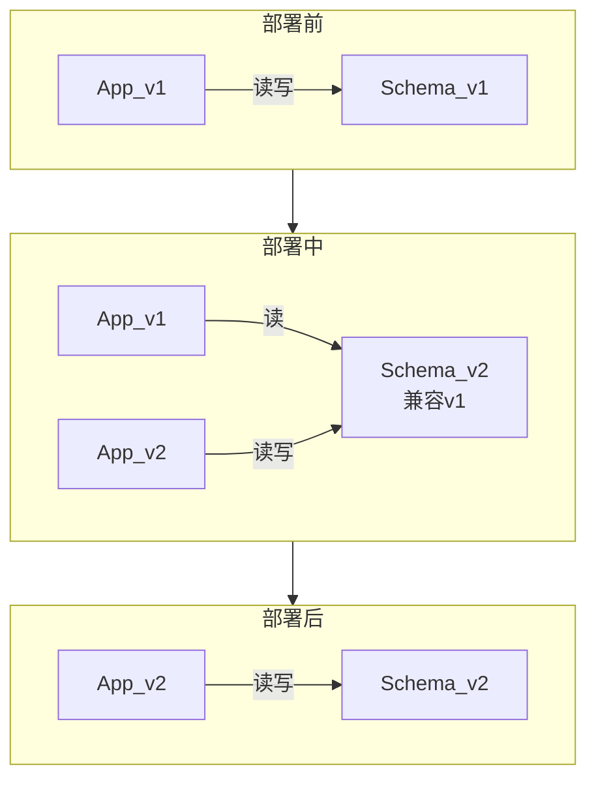
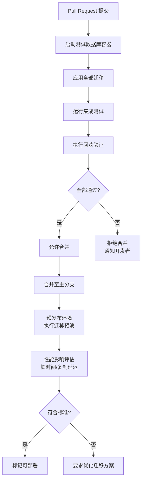

# 数据库迁移：从版本控制到零停机

## 引言

数据库迁移（Database Migration）是软件工程中最具风险的操作之一。与应用程序代码不同，数据库 schema 的变更具有持久性、共享性与状态依赖性——一旦执行，数据结构的改变将永久影响所有依赖该数据库的服务与组件。在分布式系统与微服务架构日益普及的 2026 年，数据库迁移的复杂性进一步加剧：多服务共享数据库、蓝绿部署策略、滚动更新机制、以及全球分布式数据库的拓扑结构，均对迁移的可靠性、可回滚性与零停机能力提出了严苛要求。

本文从理论与工程的双轨视角，系统阐述数据库迁移的完整知识体系。在理论层面，我们将给出迁移的形式化定义，建立破坏性变更与非破坏性变更的分类框架，深入剖析扩展-收缩模式（Expand-Contract Pattern）作为零停机迁移的核心策略，探讨蓝绿部署、金丝雀发布与影子模式在数据库场景下的理论映射，并建立数据库版本控制的数学模型。在工程层面，我们将详细映射 Prisma Migrate、Drizzle Kit、TypeORM 迁移系统的具体工作流，探讨 Liquibase 与 Flyway 在 Node.js 项目中的应用场景，给出零停机迁移的工程策略（双写模式、在线 DDL 工具），阐述 CI 中的迁移验证机制，以及迁移回滚与灾难恢复的完整方案。

通过本文的框架，技术决策者应能够为其组织建立一套安全、可验证、可回滚的数据库迁移工程体系。

## 理论严格表述

### 数据库迁移的形式化定义

数据库迁移在数学上可定义为从数据库状态 $S_i$ 到状态 $S_{i+1}$ 的状态转换函数：

$$\text{Migrate}: S_i \times M_i \to S_{i+1}$$

其中，$S_i = (Schema_i, Data_i, Constraints_i, Indexes_i)$ 表示第 $i$ 个版本的数据库状态，包含模式（Schema）、数据（Data）、约束（Constraints）与索引（Indexes）四个维度。$M_i$ 为迁移脚本，描述了从 $S_i$ 到 $S_{i+1}$ 的变换操作序列。

一个严格定义的数据库迁移必须满足两个基本性质：

#### 性质一：幂等性（Idempotency）

幂等性要求迁移脚本在多次执行下产生相同的结果。形式化表述为：

$$\forall k \geq 1, \quad \text{Migrate}(S_i, M_i)^k = \text{Migrate}(S_i, M_i)$$

即执行 $k$ 次迁移 $M_i$ 与应用一次的结果相同。在实际工程中，幂等性通过以下机制保证：

- 使用 `IF NOT EXISTS` 创建表、索引、约束。
- 使用 `CREATE OR REPLACE` 更新视图与存储过程。
- 在迁移元数据表（如 `__migrations`）中记录已执行的迁移标识，避免重复执行。

#### 性质二：可回滚性（Rollbackability）

可回滚性要求对于每个正向迁移 $M_i$，存在对应的逆向迁移 $M_i^{-1}$，使得：

$$\text{Migrate}(S_{i+1}, M_i^{-1}) = S_i$$

即应用逆向迁移能够将数据库状态精确恢复至迁移前的状态。可回滚性的挑战在于数据丢失场景：若正向迁移包含 `DROP COLUMN` 操作，该列的数据在删除后无法通过简单的 schema 逆操作恢复，必须依赖事前备份或逻辑删除策略。

在严格的形式化框架下，可回滚性应进一步区分为：

- **Schema 回滚**：通过逆向 DDL 操作恢复表结构。
- **数据回滚**：通过备份还原或逻辑删除机制恢复数据内容。
- **应用兼容性回滚**：确保回滚后的 schema 与当前运行版本的应用代码兼容。

### 迁移的分类体系

数据库迁移可根据多个维度进行分类，建立清晰的分类体系是制定迁移策略的前提。

#### 分类维度一：破坏性变更 vs 非破坏性变更

**非破坏性变更（Non-Breaking Change）**是指不破坏现有应用代码兼容性的 schema 变更。典型操作包括：

- 新增可空列（`ADD COLUMN ... NULL`）
- 新增表（`CREATE TABLE`）
- 新增索引（`CREATE INDEX`），不影响写入路径
- 创建新视图（`CREATE VIEW`）

非破坏性变更的关键特征是：应用代码在不修改的情况下，仍能正常读写数据库。这类变更通常可以直接执行，风险较低。

**破坏性变更（Breaking Change）**是指会破坏现有应用代码兼容性的 schema 变更。典型操作包括：

- 删除列（`DROP COLUMN`）
- 修改列类型（`ALTER COLUMN TYPE`）
- 重命名列（`RENAME COLUMN`）
- 添加非空约束（`ALTER COLUMN SET NOT NULL`）到已有空数据的列
- 删除表（`DROP TABLE`）

破坏性变更的直接执行会导致正在运行的应用实例抛出异常（如查询不存在的列、插入不符合约束的数据）。在零停机部署场景下，破坏性变更必须通过特定的兼容策略分阶段执行。

#### 分类维度二：结构变更 vs 数据变更

**结构变更（Schema Migration）**仅修改数据库的结构定义，不迁移或转换数据。例如创建表、添加索引、修改约束等。

**数据变更（Data Migration）**涉及已有数据的转换、清洗或迁移。例如：

- 将旧格式数据转换为新格式
- 拆分/合并列数据
- 填充新增列的默认值
- 跨表数据迁移

数据变更的复杂性在于其通常不可瞬时完成，尤其对于大表（数千万行以上），全表更新可能触发长时间锁表、大量 WAL（Write-Ahead Log）写入以及 replication lag。

#### 分类维度三：在线变更 vs 离线变更

**在线变更（Online Migration）**在应用持续提供服务的过程中执行，用户无感知。在线变更是零停机架构的核心要求。

**离线变更（Offline Migration）**需要暂停应用服务或进入维护窗口（Maintenance Window）执行。离线变更简单直接，但现代云原生应用通常要求 99.99% 以上的可用性，使得维护窗口难以安排。

### 扩展-收缩模式（Expand-Contract Pattern）

扩展-收缩模式是实现破坏性变更向非破坏性变更转换的核心设计模式，由 Martin Fowler 在《Evolutionary Database Design》中系统阐述。该模式将破坏性变更分解为四个阶段：

**阶段一：扩展（Expand）**

在原有 schema 基础上新增结构，同时保留旧结构。例如，将 `full_name` 列拆分为 `first_name` 与 `last_name`：

- 新增 `first_name` 与 `last_name` 列（可空）
- 在应用写入路径中，同时写入新旧列（双写）
- 触发后台任务，将历史数据从 `full_name` 填充至新列

此阶段中，旧代码继续读取 `full_name`，新代码可选择读取新列。数据库状态为“新旧并存”。

**阶段二：迁移（Migrate）**

将历史数据从旧结构迁移至新结构。对于大表，此过程应分批（Batch）执行，避免单次事务过大：

```sql
UPDATE users
SET first_name = SPLIT_PART(full_name, ' ', 1),
    last_name = SPLIT_PART(full_name, ' ', 2)
WHERE id BETWEEN :start AND :end;
```

迁移过程需监控数据库负载与 replication lag，必要时降低批次大小或暂停迁移。

**阶段三：验证（Verify）**

验证新列数据的完整性与一致性：

```sql
SELECT COUNT(*) FROM users
WHERE first_name IS NULL OR last_name IS NULL;
```

确认所有数据已正确迁移后，将新列设为 `NOT NULL`（若业务要求）。

**阶段四：收缩（Contract）**

移除旧结构，完成变更：

- 应用代码停止写入 `full_name`，仅读写新列
- 部署新版本应用
- 删除 `full_name` 列

扩展-收缩模式的形式化价值在于：它将原子性的破坏性变更 $M_{breaking}$ 分解为序列化的非破坏性变更 $[M_{expand}, M_{migrate}, M_{verify}, M_{contract}]$，每个子迁移均可独立回滚，从而将风险从“单点高风险”分散为“多点低风险”。

### 零停机部署的理论框架

零停机部署（Zero-Downtime Deployment）要求系统在版本更新过程中持续对外提供服务。在数据库迁移场景下，零停机部署面临的核心挑战是“schema 版本与代码版本的不一致窗口”——在部署过程中，数据库可能同时服务于旧版本应用（$App_{old}$）与新版本应用（$App_{new}$），因此 schema 必须在过渡期间同时兼容两者。

#### 蓝绿部署（Blue-Green Deployment）

蓝绿部署维护两个完全相同的生产环境：蓝环境（Blue，当前运行）与绿环境（Green，待部署）。部署流程如下：

1. 绿环境部署 $App_{new}$，但流量仍指向蓝环境。
2. 在绿环境执行数据库迁移 $M_i$（此时蓝环境的 $App_{old}$ 仍读写旧 schema）。
3. **关键约束**：$M_i$ 必须是非破坏性变更，确保旧应用仍能正常工作。
4. 执行冒烟测试验证绿环境。
5. 切换流量至绿环境。
6. 蓝环境作为热备保留，若发现问题可瞬时回滚（切换流量回蓝环境）。

蓝绿部署的数据库约束形式化为：在流量切换前的任意时刻，$App_{old}$ 与 $App_{new}$ 必须能够同时正确操作 $S_{i+1}$。这要求迁移 $M_i$ 只能是扩展性变更（新增表/列/索引），不能是收缩性变更（删除/重命名/修改类型）。

#### 金丝雀发布（Canary Deployment）

金丝雀发布将流量逐步从旧版本迁移至新版本，而非瞬时全量切换。流程如下：

1. 部署少量 $App_{new}$ 实例（如 5% 流量）。
2. 监控关键业务指标（错误率、延迟、吞吐量）。
3. 若指标正常，逐步增加 $App_{new}$ 比例（10% → 25% → 50% → 100%）。
4. 在金丝雀阶段，数据库 schema 必须同时兼容新旧版本应用。

金丝雀发布的数据库兼容性要求比蓝绿部署更严格：因为在过渡期间，$App_{old}$ 与 $App_{new}$ 实例同时接收生产流量，任何 schema 不兼容都会导致部分请求失败。

#### 影子模式（Shadow Mode）

影子模式将生产流量同时镜像至新版本应用，但新版本不返回响应给用户（仅内部处理）。此模式用于验证 $App_{new}$ 在生产负载下的行为，尤其适用于涉及复杂数据处理的迁移场景。

影子模式的数据库挑战在于：$App_{new}$ 的写操作不能影响生产数据。通常通过以下策略解决：

- 将写操作路由至影子数据库（Shadow DB）。
- 使用数据库事务，在影子模式下始终回滚（`ROLLBACK`）。
- 对比新旧版本的写操作差异，验证数据一致性。

### 数据库版本控制的数学模型

数据库版本控制旨在管理迁移脚本的历史序列与并发协作。其数学模型可借鉴图论与序理论。

#### 线性版本模型（Linear Versioning）

最简单的模型是线性序列：

$$S_0 \xrightarrow{M_1} S_1 \xrightarrow{M_2} S_2 \xrightarrow{M_3} \dots \xrightarrow{M_n} S_n$$

每个迁移具有严格的先后依赖关系：$M_i$ 必须在 $M_{i-1}$ 执行成功后才能执行。该模型由迁移元数据表强制执行：

| id | name | checksum | applied_at |
|----|------|----------|------------|
| 1 | init_schema | abc123 | 2026-01-01 |
| 2 | add_users_email | def456 | 2026-01-15 |

线性模型的优势在于简单、确定、易于审计。其局限在于无法优雅处理分支开发场景。

#### 分支合并模型（Branching & Merging）

在多团队协作环境中，不同功能分支可能独立产生迁移：

```
main:    M1 → M2
          ↓
featureA:  M3
          ↓
featureB:  M4
```

若 $M_3$ 与 $M_4$ 互不冲突（如修改不同表），合并时只需按时间戳排序执行。若存在冲突（如同时修改同一表结构），则需要人工解决依赖关系。

形式化地，定义迁移的冲突关系 $\bowtie$：$M_i \bowtie M_j$ 当且仅当二者操作的对象集合有交集，即 $\text{Objects}(M_i) \cap \text{Objects}(M_j) \neq \emptyset$。合并算法需检测 $\bowtie$ 关系，并在存在冲突时中止自动合并，要求人工介入。

大多数现代迁移工具（Prisma Migrate、Flyway、Liquibase）采用线性模型，通过强制按顺序执行与校验和（Checksum）机制确保一致性。在团队协作中，最佳实践是将迁移文件视为“不可变历史记录”——一旦提交并部署，即禁止修改，错误修正通过新增迁移完成。

## 工程实践映射

### Prisma Migrate 的完整工作流

Prisma Migrate 是 Prisma ORM 的数据库 schema 迁移系统，采用声明式（Declarative）迁移模型：开发者通过修改 `schema.prisma` 文件描述目标状态，Prisma Migrate 自动生成并执行达到该状态所需的 SQL 迁移。

#### 开发阶段：`prisma migrate dev`

`prisma migrate dev` 是开发环境的核心命令，其工作流如下：

1. **Schema 差异检测**：Prisma 比较当前 `schema.prisma` 与数据库实际 schema，计算差异 $\Delta$。
2. **迁移文件生成**：根据 $\Delta$ 生成 SQL 迁移文件，存放于 `prisma/migrations/` 目录，文件名为时间戳前缀（如 `20260501120000_add_user_profile`）。
3. **交互式确认**：若存在潜在数据丢失操作（如删除列），Prisma 提示确认。
4. **迁移执行**：在开发数据库上执行生成的 SQL。
5. **Prisma Client 重新生成**：自动触发 `prisma generate`，更新类型定义。

开发阶段的关键实践：

- 迁移文件应纳入版本控制（Git），作为 schema 变更的历史记录。
- 团队应约定 `migrate dev` 仅在本地开发环境使用，生产环境严禁直接执行。
- 对于数据迁移（Data Migration），需在生成的迁移 SQL 中手动补充 DML 语句，Prisma Migrate 默认仅生成 DDL。

#### 部署阶段：`prisma migrate deploy`

`prisma migrate deploy` 是生产环境的标准部署命令，其特性包括：

- **只读生成**：不读取 `schema.prisma`，直接执行 `prisma/migrations/` 目录中尚未执行的迁移。
- **严格顺序执行**：按文件名排序，依次执行，跳过已记录在 `_prisma_migrations` 表中的迁移。
- **失败即停**：若某条迁移失败，后续迁移暂停执行，需人工介入（`prisma migrate resolve`）。
- **无交互模式**：默认非交互，适合 CI/CD 流水线。

生产部署的标准流程：

```bash
# CI/CD 流水线中
npx prisma migrate deploy
# 成功后继续部署应用
npm run deploy
```

#### 迁移冲突解决：`prisma migrate resolve`

当生产环境迁移因网络中断、锁超时或语法错误而失败时，数据库可能处于“部分应用”状态。`prisma migrate resolve` 用于手动标记迁移状态：

```bash
# 标记某迁移为已执行（跳过实际执行）
npx prisma migrate resolve --applied 20260501120000_add_user_profile

# 标记某迁移为回滚（从元数据表中移除记录）
npx prisma migrate resolve --rolled-back 20260501120000_add_user_profile
```

`migrate resolve` 是灾难恢复的关键工具，但需谨慎使用——手动标记迁移状态可能导致数据库 schema 与迁移历史不一致。

#### Prisma Migrate 的零停机策略

Prisma Migrate 本身不内置零停机迁移策略，但可通过以下实践实现：

1. **分阶段迁移**：将所有破坏性变更拆分为多个非破坏性迁移，遵循 Expand-Contract Pattern。
2. **预览环境验证**：在预发布环境（Staging）执行完整迁移流程，验证执行时间与锁表影响。
3. **大表变更使用在线 DDL**：对于 PostgreSQL，利用 `pg_online_schema_change` 或 `pg_repack`；对于 MySQL，使用 `pt-online-schema-change` 或 `gh-ost` 替代原生 `ALTER TABLE`。

### Drizzle Kit 的迁移生成机制

Drizzle ORM 采用与 Prisma 类似的声明式 schema 定义，但其迁移工具 Drizzle Kit 提供了更细粒度的控制与更贴近原生 SQL 的体验。

#### Schema 定义与迁移生成

Drizzle 的 schema 使用 TypeScript DSL 定义：

```typescript
import { pgTable, serial, varchar, timestamp } from 'drizzle-orm/pg-core';

export const users = pgTable('users', {
  id: serial('id').primaryKey(),
  email: varchar('email', { length: 255 }).notNull(),
  createdAt: timestamp('created_at').defaultNow(),
});
```

执行 `drizzle-kit generate` 时，Drizzle Kit 比较 schema 定义与目标数据库状态，生成 SQL 迁移文件。与 Prisma 的关键差异在于：

- **SQL 优先哲学**：生成的 SQL 文件透明可编辑，鼓励开发者审查与修改生成的 SQL。
- **无运行时依赖**：迁移文件为纯 SQL，可在任何支持该数据库的客户端执行。
- **快照机制**：Drizzle Kit 在 `drizzle/meta/` 目录维护 JSON 快照，用于差异计算。

#### 迁移执行：`drizzle-kit migrate`

`drizzle-kit migrate` 执行生成的 SQL 文件，机制类似 Flyway：

1. 读取 `drizzle/migrations/` 目录下的 SQL 文件。
2. 检查 `__drizzle_migrations` 元数据表，过滤已执行文件。
3. 按顺序执行未执行的迁移，使用事务包裹（若数据库支持 DDL 事务）。
4. 记录执行日志至元数据表。

#### Drizzle Kit 的工程实践要点

1. **显式事务控制**：对于 PostgreSQL，Drizzle Kit 默认将每个迁移包裹在事务中，确保原子性。但 MySQL 的 DDL 操作隐式提交事务，需特别注意。
2. **多环境配置**：通过 `drizzle.config.ts` 中的 `dbCredentials` 与 `breakpoints` 配置，支持开发、预发布、生产多环境。
3. **与 CI/CD 集成**：

```typescript
// drizzle.config.ts
import { defineConfig } from 'drizzle-kit';

export default defineConfig({
  schema: './src/schema.ts',
  out: './drizzle/migrations',
  dialect: 'postgresql',
  dbCredentials: {
    url: process.env.DATABASE_URL!,
  },
});
```

在 CI 流水线中：

```bash
npx drizzle-kit migrate
```

Drizzle Kit 的轻量级设计使其特别适合追求 SQL 透明度与最小化工具链复杂度的团队。

### TypeORM 的迁移系统

TypeORM 的迁移系统采用命令式（Imperative）迁移模型，开发者通过 TypeScript/JavaScript 代码定义迁移逻辑，而非声明式 schema 文件。

#### 迁移文件的创建与结构

通过 CLI 创建迁移：

```bash
npx typeorm migration:create -n AddUserProfile
# 或基于实体差异自动生成
npx typeorm migration:generate -n AddUserProfile -d data-source.ts
```

生成的迁移文件结构：

```typescript
import { MigrationInterface, QueryRunner } from 'typeorm';

export class AddUserProfile1714587600000 implements MigrationInterface {
  public async up(queryRunner: QueryRunner): Promise<void> {
    await queryRunner.addColumn('users', new TableColumn({
      name: 'profile',
      type: 'jsonb',
      isNullable: true,
    }));
  }

  public async down(queryRunner: QueryRunner): Promise<void> {
    await queryRunner.dropColumn('users', 'profile');
  }
}
```

#### 命令式模型的优势与局限

**优势**：

- **完全可编程**：可在迁移中嵌入复杂逻辑，如条件判断、数据转换、外部 API 调用。
- **跨数据库抽象**：`QueryRunner` 提供统一的 API，自动适配 PostgreSQL、MySQL、SQLite 等数据库的方言差异。
- **细粒度控制**：开发者精确控制每个操作的执行顺序与错误处理。

**局限**：

- **手动维护负担**：无法通过修改实体自动同步迁移，需手动编写或依赖 `migration:generate`。
- **类型安全较弱**：迁移代码在编译时缺乏对数据库 schema 的严格类型检查。
- **学习曲线陡峭**：需要熟悉 TypeORM 的 `QueryRunner` API，对仅熟悉 SQL 的开发者不够友好。

#### TypeORM 迁移的执行与回滚

执行迁移：

```bash
npx typeorm migration:run -d data-source.ts
```

回滚最近一次迁移：

```bash
npx typeorm migration:revert -d data-source.ts
```

TypeORM 的 `migration:revert` 仅回滚最后一次迁移，且依赖 `down` 方法的正确实现。对于生产环境的复杂回滚场景，通常不建议依赖自动回滚，而应采用数据库级备份还原或预编写的反向迁移脚本。

#### TypeORM 的工程实践建议

1. **实体与迁移解耦**：避免在迁移文件中引用实体类，因为实体随时间演进，旧迁移引用的实体定义可能已改变。迁移应使用原始的 `QueryRunner` API 操作。
2. **数据迁移分离**：对于大表数据迁移，在 TypeORM 迁移中调用分批处理逻辑，避免单个大事务。
3. **迁移测试**：在 CI 中建立独立的测试数据库，对每个 Pull Request 执行 `migration:run` 与 `migration:revert`，验证迁移的可执行性与可回滚性。

### Liquibase 与 Flyway 在 Node.js 项目中的应用

虽然 Liquibase 与 Flyway 源于 JVM 生态，但它们在多语言项目与严格审计场景中具有不可替代的价值，尤其在 Node.js 后端与 Java 服务共享数据库的异构环境中。

#### Liquibase：变更集（ChangeSet）模型

Liquibase 使用 XML、YAML 或 JSON 定义“变更集”（ChangeSet），每个变更集包含一个或多个数据库变更操作：

```xml
<?xml version="1.0" encoding="UTF-8"?>
<databaseChangeLog xmlns="http://www.liquibase.org/xml/ns/dbchangelog">
  <changeSet id="1" author="dev-team">
    <createTable tableName="users">
      <column name="id" type="bigint" autoIncrement="true">
        <constraints primaryKey="true"/>
      </column>
      <column name="email" type="varchar(255)">
        <constraints nullable="false" unique="true"/>
      </column>
    </createTable>
  </changeSet>
</databaseChangeLog>
```

Liquibase 的核心优势：

- **跨平台一致性**：同一套变更集可在 PostgreSQL、MySQL、Oracle、SQL Server 上执行，Liquibase 自动处理方言差异。
- **丰富的前置条件**：通过 `preConditions` 实现条件化迁移，例如“仅在表不存在时创建”。
- **强大的回滚支持**：多数变更类型自动生成逆向操作，支持 `liquibase rollback`。
- **数据库差异报告**：`liquibase diff` 可生成两个数据库间的 schema 差异报告。

在 Node.js 项目中使用 Liquibase：

- 通过 Docker 或本地安装运行 Liquibase CLI。
- 将 `changelog.xml` 纳入版本控制，与 Node.js 代码同步发布。
- 在 CI/CD 中调用 Liquibase CLI 先于应用部署执行。

#### Flyway：SQL 优先的极简哲学

Flyway 采用“SQL 优先”的迁移模型，迁移文件按版本号命名（如 `V1__init_schema.sql`、`V2__add_users_index.sql`），Flyway 按文件名顺序执行。

```sql
-- V2__add_users_index.sql
CREATE INDEX idx_users_email ON users(email);
```

Flyway 的核心优势：

- **零配置**：约定优于配置，只需按命名规范放置 SQL 文件。
- **校验和验证**：每个迁移文件的 MD5 校验和存入 `flyway_schema_history` 表，文件被篡改后拒绝执行。
- **社区版免费**：核心功能在开源版中完全可用。

在 Node.js 项目中的集成模式：

- 将迁移文件存放于 `migrations/` 目录。
- 使用 `node-flywaydb` npm 包或 Docker 化 Flyway 在 CI 中执行。
- 与 Prisma/Drizzle 混用：ORM 负责应用层数据访问，Flyway 负责复杂的 schema 迁移与审计。

#### 选型对比：Liquibase vs Flyway vs ORM 内置迁移

| 维度 | Liquibase | Flyway | ORM 内置迁移 |
|------|-----------|--------|-------------|
| 配置复杂度 | 高 | 低 | 极低 |
| 跨数据库 | 优秀 | 良好 | 依赖 ORM |
| 回滚支持 | 强大 | 基础 | 基础 |
| 学习曲线 | 陡峭 | 平缓 | 平缓 |
| Node.js 原生集成 | 弱 | 中等 | 强 |
| 审计合规 | 强 | 中等 | 弱 |

对于纯 Node.js 项目，ORM 内置迁移通常是首选；对于多语言共享数据库或强审计合规场景，Liquibase 或 Flyway 是更稳健的选择。

### 零停机迁移的工程策略

零停机迁移是生产数据库操作的最高标准，要求应用在迁移过程中持续可用。以下为核心工程策略。

#### 策略一：双写模式（Dual-Write Pattern）

双写模式是 Expand-Contract Pattern 在写入路径上的具体实现。在迁移过渡期内，应用同时向新旧结构写入数据：

1. **扩展阶段**：应用代码在写入 `full_name` 的同时，解析并写入 `first_name` 与 `last_name`。
2. **读取路径**：根据应用版本切换读取来源。旧版本读 `full_name`，新版本读 `first_name`/`last_name`。
3. **数据回填**：后台任务逐步将历史数据从旧结构迁移至新结构。
4. **验证阶段**：对比新旧结构的数据一致性，确认无误后停止写入旧结构。
5. **收缩阶段**：移除旧结构。

双写模式的形式化保证：在任意时刻，数据库中的数据满足最终一致性（Eventual Consistency），即 $\lim_{t \to \infty} Data_{old} = Data_{new}$。该模式适用于需要重构数据模型的场景，如列拆分、表拆分、从单体表迁移到多表结构。

#### 策略二：在线 DDL 工具

对于大表的 schema 变更（如添加索引、修改列类型），原生 `ALTER TABLE` 操作可能触发长时间的表锁或元数据锁，导致应用无法读写。在线 DDL 工具通过“影子表”机制实现无锁变更。

**pt-online-schema-change（Percona Toolkit）**：

工作流程：

1. 创建与原表结构相同的空影子表（`_users_new`）。
2. 在影子表上执行 `ALTER TABLE`（此时不锁原表）。
3. 创建触发器，将原表的 INSERT、UPDATE、DELETE 操作同步至影子表。
4. 分批将原表数据复制到影子表。
5. 复制完成后，原子性重命名表：`RENAME TABLE users TO _users_old, _users_new TO users`。
6. 删除旧表与触发器。

**gh-ost（GitHub Online Schema Migration）**：

gh-ost 是 GitHub 开源的 MySQL 在线 schema 变更工具，相比 pt-osc 的改进包括：

- **无触发器**：通过读取 MySQL binlog 异步同步增量变更，避免触发器带来的性能开销与锁竞争。
- **可暂停与动态调整**：支持在迁移过程中暂停、调整复制速率，精细控制对主库的压力。
- **可测试与可回滚**：支持在影子表上测试变更效果，发现问题可随时安全中断。

对于 PostgreSQL，原生支持多种在线 DDL 操作（如 `CREATE INDEX CONCURRENTLY`、`ADD COLUMN` 不锁表），但对于复杂变更，可使用 `pg_repack` 或 `pg_online_schema_change` 工具。

#### 策略三：读写分离与副本升级

在读写分离架构中，可以利用副本（Replica）进行“低风险验证”：

1. 在只读副本上执行迁移，验证执行计划与性能影响。
2. 对于支持逻辑复制（Logical Replication）的数据库（如 PostgreSQL 10+），可创建逻辑复制槽，在副本上执行长时间迁移而不影响主库。
3. 切换主备角色前，确保 schema 兼容新旧版本应用。

### 迁移测试：在 CI 中验证迁移

迁移测试是防止“生产环境迁移失败”的最后防线。完整的 CI 迁移验证应包含以下层级。

#### 层级一：语法与可执行性验证

在 CI 流水线中，对每次提交的迁移文件执行以下步骤：

1. 启动临时的测试数据库容器（如 Docker 化的 PostgreSQL/MySQL）。
2. 将迁移应用于空数据库（验证迁移能否从零开始执行）。
3. 将迁移应用于已存在历史数据的数据库（验证迁移在真实数据上的行为）。
4. 执行回滚操作（验证 `down` 迁移或逆向操作的可行性）。

对于 Prisma：

```bash
# docker-compose 启动测试数据库后
npx prisma migrate deploy
# 验证后清理容器
```

对于 Drizzle：

```bash
npx drizzle-kit migrate
```

#### 层级二：性能影响预估

对于可能影响大表的迁移，应在预发布环境或数据库副本上执行“预演”：

1. 记录迁移执行时间 $T_{execution}$。
2. 监控锁等待时间 $T_{lock}$。
3. 评估 replication lag $\Delta_{replica}$。
4. 若 $T_{lock} > Threshold_{lock}$ 或 $\Delta_{replica} > Threshold_{lag}$，则拒绝该迁移进入生产环境，要求改用在线 DDL 工具或分批次执行。

#### 层级三：应用兼容性测试

迁移不仅是数据库操作，还必须确保应用代码与新旧 schema 的兼容性：

1. **蓝绿兼容性测试**：在 CI 中同时启动连接旧 schema 与新 schema 的应用实例，验证两者能否共存。
2. **ORM 类型校验**：确保 TypeScript 类型定义与数据库 schema 同步。Prisma 的 `prisma generate`、Drizzle 的 `drizzle-kit generate` 可在此阶段自动验证类型一致性。
3. **集成测试覆盖**：运行核心业务流程的集成测试，确认迁移后关键查询路径未被破坏。

#### 层级四：数据一致性验证

对于涉及数据转换的迁移，实施数据校验逻辑：

```sql
-- 验证迁移后数据完整性
SELECT COUNT(*) AS mismatch_count
FROM users
WHERE full_name IS NOT NULL
  AND (first_name IS NULL OR last_name IS NULL);
```

在 CI 中执行此类校验查询，确保数据迁移的完整性。

### 迁移回滚策略与灾难恢复

尽管通过严格的测试与分阶段部署可以大幅降低风险，生产环境中的迁移失败仍是不可完全避免的事件。建立系统化的回滚与灾难恢复机制是性能工程的必要组成。

#### 回滚策略的层级体系

**层级一：迁移级回滚（Migration-Level Rollback）**

适用于迁移执行失败但尚未造成数据损坏的场景。大多数迁移工具支持自动回滚：

- Prisma：`prisma migrate resolve --rolled-back <migration_name>`
- TypeORM：`typeorm migration:revert`
- Flyway：`flyway undo`（需编写 undo 迁移）
- Liquibase：`liquibase rollbackCount 1`

迁移级回滚的约束条件：

- 回滚操作本身必须是幂等的。
- 回滚必须在业务低峰期执行，避免加剧系统压力。
- 若迁移涉及数据转换，逆向操作可能无法自动恢复原始数据。

**层级二：数据库级回滚（Database-Level Rollback）**

当迁移导致数据损坏、严重性能退化或应用大面积故障时，需要执行数据库级回滚：

- **时间点恢复（Point-in-Time Recovery, PITR）**：利用数据库的连续备份与 WAL 归档，将数据库恢复至迁移执行前的某个时间点 $t_{before}$。
  - PostgreSQL：通过 `pg_basebackup` + WAL 归档实现 PITR。
  - MySQL：通过 `mysqlbinlog` 回放 binlog 至目标时间点。
- **快照还原（Snapshot Restore）**：云数据库服务（AWS RDS、Google Cloud SQL、Azure Database）通常支持基于存储快照的快速还原，RTO（Recovery Time Objective）可控制在分钟级。

数据库级回滚的代价：

- 自 $t_{before}$ 之后的数据变更将全部丢失，除非通过逻辑备份进行选择性恢复。
- 还原过程可能导致服务长时间不可用。

**层级三：应用级兼容回滚（Application-Level Rollback）**

在零停机架构中，迁移失败后可能需要回滚应用版本至迁移前的代码版本。此时必须确保：

- 回滚后的应用代码（$App_{old}$）能够与当前数据库 schema（$S_{new}$）兼容。这正是 Expand-Contract Pattern 的核心价值——在收缩阶段前，$S_{new}$ 始终向后兼容 $S_{old}$。
- 若迁移已执行收缩操作（如删除旧列），则应用回滚将失败，因为旧代码期望的列已不存在。

#### 灾难恢复预案（Runbook）

每个涉及生产环境的迁移都应配套详细的灾难恢复预案（Runbook），包括：

1. **迁移前检查清单**：
   - [ ] 数据库完整备份已完成（或确认自动备份窗口覆盖）。
   - [ ] 迁移脚本在预发布环境验证通过。
   - [ ] 迁移执行时间 $T_{execution}$ 在维护窗口内（若非在线迁移）。
   - [ ] 应用回滚包（Docker Image/Artifact）已准备就绪。
   - [ ] 值班工程师已确认，通信渠道畅通。

2. **迁移中监控指标**：
   - 数据库连接数、活跃查询数
   - 锁等待队列长度
   - Replication lag（主从延迟）
   - 应用错误率与 P99 延迟
   - 业务核心指标（订单转化率、支付成功率）

3. **回滚触发条件**：
   - 应用错误率上升超过基线 $2\times$
   - 核心 API P99 延迟超过阈值 $> 5s$
   - 数据库连接池耗尽
   - 任何业务指标异常下降

4. **回滚执行步骤**：
   - 步骤 1：停止应用流量（或切换至只读模式）。
   - 步骤 2：执行迁移回滚（或数据库还原）。
   - 步骤 3：验证 schema 与应用兼容性。
   - 步骤 4：逐步恢复流量，持续监控。
   - 步骤 5：事后复盘（Blameless Postmortem）。

#### 长期数据修复策略

对于已造成数据损坏但无法简单回滚的场景，需执行数据修复（Data Remediation）：

- **逻辑修复脚本**：编写幂等的修复脚本，遍历受影响数据并修正。脚本应在副本上预演，验证结果后再于生产环境执行。
- **事件溯源（Event Sourcing）**：若系统采用事件溯源架构，可通过重放事件日志重建正确状态。
- **人工介入**：对于极端复杂的损坏场景，可能需要 DBA 手动执行修复操作，此时必须在隔离环境中充分演练。

## Mermaid 图表

### 扩展-收缩模式（Expand-Contract Pattern）流程


### 零停机部署中的数据库兼容性模型



### 数据库迁移 CI 验证流水线



## 理论要点总结

1. **迁移的形式化约束**：数据库迁移在数学上是状态转换函数，必须满足幂等性与可回滚性。幂等性通过迁移元数据表与条件化 DDL 保证；可回滚性要求每个正向迁移存在精确的逆向操作，并在数据层面建立备份或逻辑删除机制。

2. **破坏性变更的分解原理**：扩展-收缩模式（Expand-Contract Pattern）将原子性破坏性变更分解为序列化的非破坏性变更阶段，使数据库在过渡期内同时兼容新旧版本应用。这是零停机部署的理论基石，要求开发团队接受“schema 变更落后于代码变更”的时序约束。

3. **版本控制的线性序约束**：数据库迁移历史在数学上构成线性序列，每个迁移具有严格的全序关系。现代迁移工具通过校验和与元数据表强制这一线性序。在团队协作中，应避免分支上的迁移冲突，将迁移文件视为不可变历史记录。

4. **零停机的兼容性窗口**：蓝绿部署与金丝雀发布要求在流量切换的过渡期内，数据库 schema 必须同时满足旧应用与新应用的读写假设。这一兼容性窗口的存在，从根本上限制了单次迁移的操作类型，排除了删除、重命名、类型修改等破坏性操作。

5. **测试的分层防御**：迁移测试应覆盖四个层级——语法可执行性、性能影响预估、应用兼容性、数据一致性。CI 流水线中的自动迁移验证是防止生产事故的最有效手段，其投入产出比远高于事后修复。

6. **灾难恢复的多层预案**：迁移回滚策略应建立从迁移级回滚到数据库级还原的多层体系。对于无法自动回滚的场景，必须预先制定详细的 Runbook，明确回滚触发条件、执行步骤与监控指标。Expand-Contract Pattern 的额外价值在于，它将应用级回滚的可能性保留至收缩阶段之前。

## 参考资源

1. **Prisma Migrate Documentation**. Prisma 官方文档详细阐述了声明式迁移模型、`prisma migrate dev/deploy/resolve` 的完整工作流、迁移 Shadow Database 的机制，以及生产环境部署的最佳实践。其迁移锁与校验和机制为数据一致性提供了重要保障。详见 [prisma.io/docs/orm/prisma-migrate](https://www.prisma.io/docs/orm/prisma-migrate)。

2. **Drizzle Kit Documentation**. Drizzle ORM 官方文档系统介绍了 Drizzle Kit 的迁移生成算法、SQL 优先设计哲学、多数据库方言支持，以及与 TypeScript 生态的深度集成。其透明的 SQL 输出与轻量级架构对追求可控性的团队极具价值。详见 [orm.drizzle.team/docs/migrations](https://orm.drizzle.team/docs/migrations)。

3. **Martin Fowler, *Evolutionary Database Design***. Martin Fowler 与 Pramod Sadalage 合作提出的演进式数据库设计方法论，系统阐述了扩展-收缩模式（Expand-Contract Pattern）、数据库重构的分类体系，以及如何在敏捷开发中管理 schema 变更。该文是理解零停机迁移设计模式的经典参考。详见 [martinfowler.com/articles/evodb.html](https://martinfowler.com/articles/evodb.html)。

4. **GitLab, *Database Migration Style Guide***. GitLab 的数据库迁移风格指南是业界最详尽的数据库工程实践文档之一，涵盖迁移的分类（常规迁移、后置迁移、Batched Background Migrations）、锁表行为分析、复制延迟控制、以及复杂的零停机变更案例。对于在 CI/CD 环境中管理大规模数据库迁移的团队，该指南具有极高的实操价值。详见 [docs.gitlab.com/ee/development/database/migration_style_guide.html](https://docs.gitlab.com/ee/development/database/migration_style_guide.html)。

5. **GitHub, *gh-ost: GitHub's Online Schema Migration***. gh-ost 的技术文档与源码揭示了无触发器在线 DDL 的实现原理，包括 binlog 解析、增量同步、原子性表切换等核心机制。对于需要在大规模 MySQL 集群上执行 schema 变更的工程团队，gh-ost 的设计思想具有重要参考价值。详见 [github.com/github/gh-ost](https://github.com/github/gh-ost)。
