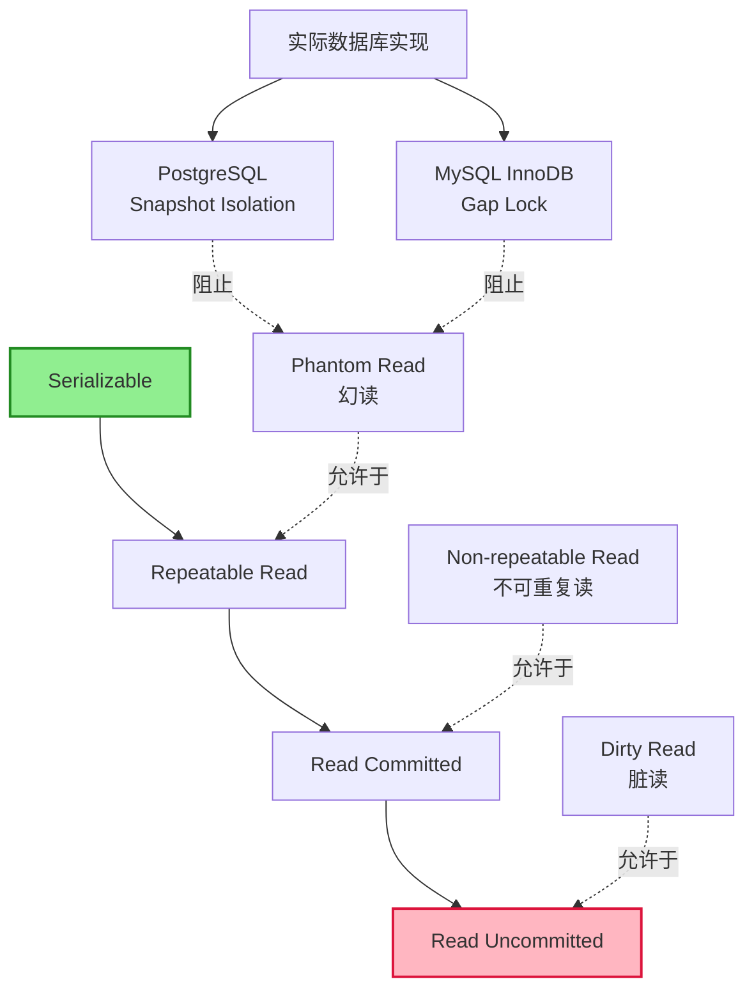
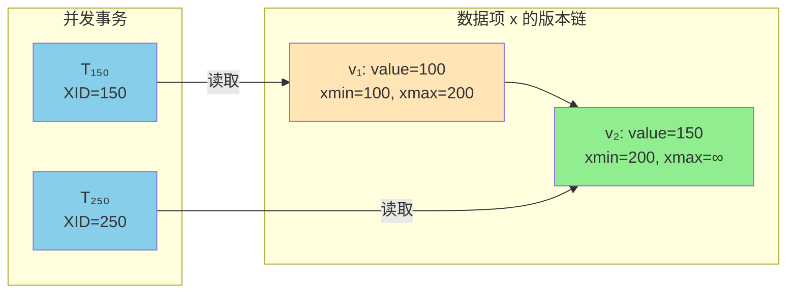
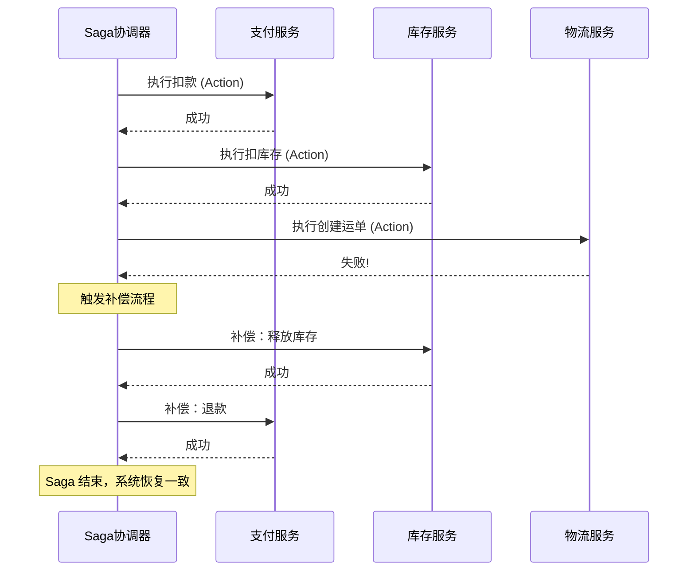
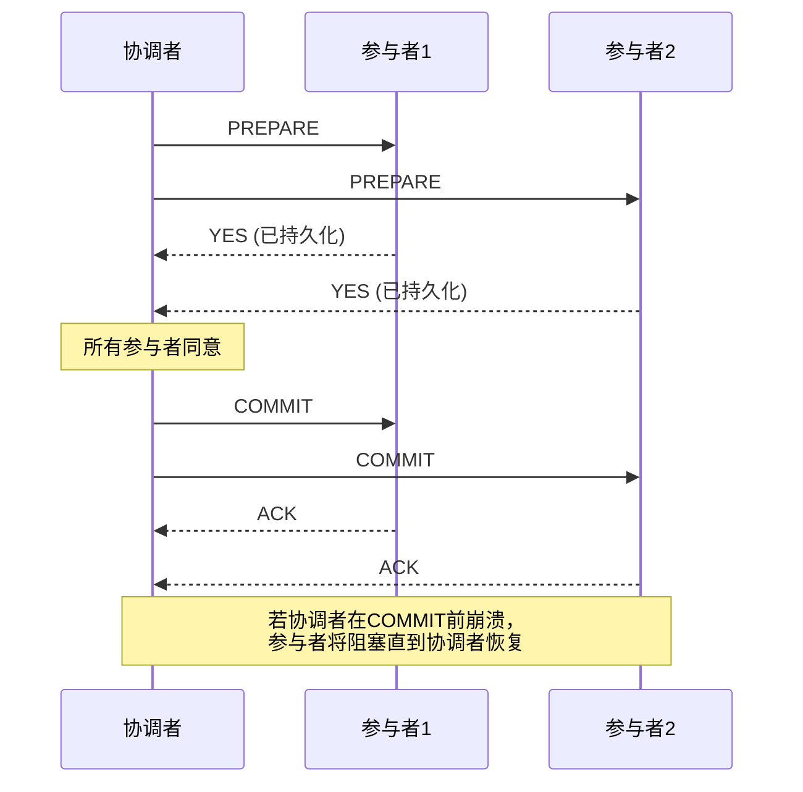

# 事务与并发控制：一致性保证

## 引言

在多用户并发访问的数据库系统中，事务（Transaction）是维护数据一致性的核心抽象。当数十个乃至数千个客户端同时读写同一组数据记录时，如果没有严格的并发控制机制，数据完整性将在瞬间崩塌。从银行转账的扣款与加款必须原子完成，到电商库存的扣减不能超卖，再到分布式微服务之间的最终一致性协调——事务与并发控制贯穿于每一个关键业务场景。

本文采用"理论严格表述"与"工程实践映射"双轨并行的写作策略。在理论层面，我们将从形式化语义的角度重新定义 ACID、隔离级别、两阶段锁（2PL）与多版本并发控制（MVCC），揭示各种异常现象（Dirty Read、Non-repeatable Read、Phantom Read）产生的本质原因。在工程层面，我们将深入 Prisma、TypeORM、Drizzle 等主流 ORM 的事务 API 实现，剖析 PostgreSQL 的 MVCC 底层机制（`xmin`/`xmax` 系统列），探讨行级锁、`SELECT FOR UPDATE`、乐观锁（版本号字段）的实践技巧，并延伸至 Saga、2PC、TCC 等分布式事务模式在 Node.js 生态中的落地方案。

---

## 理论严格表述

### 2.1 事务的形式化定义与 ACID 语义

**定义 2.1（事务，Transaction）**
事务 `T` 是一个有限的数据库操作序列 `T = ⟨op₁, op₂, ..., opₙ⟩`，其中每个 `opᵢ` 属于基本操作集合 `{read(x), write(x), commit, abort}`。事务的执行必须满足以下四个属性——即 ACID。

**定义 2.2（原子性，Atomicity）**
设数据库状态为 `DB`，事务 `T` 对状态的作用可建模为状态转换函数 `f_T: DB → DB`。原子性要求：

- 若 `T` 成功提交（`commit`），则 `DB' = f_T(DB)`；
- 若 `T` 失败或主动中止（`abort`），则 `DB' = DB`，即所有已执行操作的效果必须完全撤销。

实现原子性的核心机制是**预写日志（Write-Ahead Logging, WAL）**与**回滚段（Rollback Segment）**。所有修改在生效前必须先写入持久化的日志，确保崩溃恢复时能够通过 Redo/Undo 操作重建一致性状态。

**定义 2.3（一致性，Consistency）**
设 `Consistent(DB)` 为谓词，表示数据库状态满足所有完整性约束（实体完整性、参照完整性、用户定义约束）。一致性要求：

```
Consistent(DB) ∧ T commits ⇒ Consistent(f_T(DB))
```

即事务执行前后，数据库都必须处于合法状态。值得注意的是，数据库层面的一致性是由原子性、隔离性和持久性共同支撑的**结果属性**，而非独立机制。

**定义 2.4（隔离性，Isolation）**
隔离性要求并发执行的事务互不干扰。设事务集合 `{T₁, T₂, ..., Tₙ}` 的并发调度为 `S`，若存在某个串行调度 `S_serial`（即事务按某种全序依次执行），使得对任意初始数据库状态 `DB` 都有 `Result(S, DB) = Result(S_serial, DB)`，则称 `S` 是**可串行化（Serializable）**的。

可串行化是隔离性的最高标准，但实现代价高昂。SQL 标准因此定义了四个**隔离级别（Isolation Levels）**，在一致性与并发性能之间提供权衡空间。

**定义 2.5（持久性，Durability）**
持久性保证一旦事务提交，其效果将永久保存：

```
T commits at time t ⇒ ∀t' > t, DB(t') reflects all changes of T
```

即使发生操作系统崩溃、电源故障或存储介质损坏，已提交事务的变更也必须能够通过日志重放恢复。

### 2.2 隔离级别的形式化定义与异常现象

SQL-92 标准定义了四个隔离级别，其形式化语义可以通过事务操作中允许的"现象（Phenomena）"来刻画。

**定义 2.6（脏读，Dirty Read）**
事务 `T₁` 修改了数据项 `x` 但尚未提交，事务 `T₂` 读取了 `T₁` 未提交的 `x` 值。若 `T₁` 随后回滚，则 `T₂` 读取到的数据从未真实存在过。

形式化地，调度 `S` 中存在脏读，当且仅当存在操作序列：

```
w₁(x) ... r₂(x) ... (a₁ ∨ c₁)
```

其中 `w₁(x)` 表示 `T₁` 写入 `x`，`r₂(x)` 表示 `T₂` 读取 `x`，`a₁` 表示 `T₁` 中止，`c₁` 表示 `T₁` 提交（即使提交，未提交时的读取仍然构成脏读）。

**定义 2.7（不可重复读，Non-repeatable Read）**
事务 `T₁` 两次读取同一数据项 `x`，在这两次读取之间，事务 `T₂` 修改并提交了 `x`，导致 `T₁` 两次读取到不同的值。

形式化地：

```
r₁(x) ... w₂(x) ... c₂ ... r₁(x), 且两次读取值不同
```

**定义 2.8（幻读，Phantom Read）**
事务 `T₁` 执行了范围查询 `Q`（如 `SELECT * FROM orders WHERE amount > 100`），随后事务 `T₂` 插入或删除了满足 `Q` 条件的记录并提交。当 `T₁` 再次执行相同查询时，结果集发生了变化，仿佛出现了"幻影"记录。

幻读与不可重复读的本质区别在于操作粒度：不可重复读针对**单个数据项**，而幻读针对**满足谓词的数据集合**。

| 隔离级别 | 脏读 | 不可重复读 | 幻读 | 形式化保证 |
|---------|------|-----------|------|-----------|
| Read Uncommitted | 允许 | 允许 | 允许 | 无 |
| Read Committed | 禁止 | 允许 | 允许 | 仅禁止 P1 |
| Repeatable Read | 禁止 | 禁止 | 允许* | 禁止 P1, P2 |
| Serializable | 禁止 | 禁止 | 禁止 | 完全可串行化 |

> *注：PostgreSQL 的 Repeatable Read 实现基于快照隔离（Snapshot Isolation），实际上也防止了幻读，但这超出了 SQL-92 标准的要求。MySQL InnoDB 的 Repeatable Read 通过间隙锁（Gap Lock）同样可以防止幻读。

### 2.3 并发控制协议：两阶段锁（2PL）与 MVCC

**定义 2.9（两阶段锁，Two-Phase Locking, 2PL）**
2PL 协议要求每个事务在执行过程中分为两个阶段：

1. **扩张阶段（Growing Phase）**：事务可以获取锁，但不能释放锁；
2. **收缩阶段（Shrinking Phase）**：事务可以释放锁，但不能获取新锁。

**定理 2.1（2PL 正确性定理）**
若所有事务都遵循 2PL 协议，则它们的任何并发调度都是可串行化的。

*证明概要*：2PL 保证了事务之间锁获取顺序的偏序关系，该偏序的无环性等价于调度的可串行化。若存在循环等待（`T₁ → T₂ → ... → Tₙ → T₁`），则与 2PL 的收缩阶段定义矛盾。

**严格两阶段锁（Strict 2PL, S2PL）**是 2PL 的强化变体：事务在收缩阶段只释放共享锁（S-Lock），排他锁（X-Lock）必须等到事务提交或回滚后才能释放。S2PL 不仅保证可串行化，还避免了级联回滚（Cascading Abort）。

**定义 2.10（多版本并发控制，Multi-Version Concurrency Control, MVCC）**
MVCC 的核心思想是：每次写操作不直接覆盖旧数据，而是创建一个新的版本（Version）。读操作根据事务的时间戳或事务 ID 选择合适的数据版本读取，从而避免读写冲突。

设数据项 `x` 的版本序列为 `⟨v₁, v₂, ..., vₙ⟩`，每个版本 `vᵢ` 附带两个时间戳：

- `begin_ts(vᵢ)`：创建该版本的事务开始时间或事务 ID；
- `end_ts(vᵢ)`：使该版本失效的事务时间（通常为 `∞` 直到被更新）。

事务 `T`（时间戳为 `ts(T)`）读取 `x` 时，选择满足 `begin_ts(v) ≤ ts(T) < end_ts(v)` 的最新版本。写操作则创建新版本 `v_new`，设置 `begin_ts(v_new) = ts(T)`，并将旧版本的 `end_ts` 更新为 `ts(T)`。

MVCC 的优势在于**读操作不阻塞写操作，写操作不阻塞读操作**，极大地提高了并发度。大多数现代数据库（PostgreSQL、MySQL InnoDB、Oracle、SQL Server）都采用了 MVCC 或其变体。

### 2.4 乐观锁与悲观锁的形式化权衡

**定义 2.11（悲观并发控制，Pessimistic Concurrency Control）**
悲观控制假设冲突频繁发生，事务在访问数据前先获取锁（共享锁或排他锁），将潜在冲突串行化。其形式化模型是基于锁的调度器：

```
lock(T, x, mode) → access(T, x) → unlock(T, x)
```

若 `lock(T₁, x, X)` 时 `x` 已被 `T₂` 以 X 模式锁定，则 `T₁` 进入等待队列，直到 `T₂` 释放锁。

**定义 2.12（乐观并发控制，Optimistic Concurrency Control, OCC）**
乐观控制假设冲突罕见，事务执行分为三个阶段：

1. **读取阶段（Read Phase）**：事务自由读取数据，所有修改保存在私有工作区（Private Workspace）；
2. **验证阶段（Validation Phase）**：事务提交前，检查其读取的数据集是否被其他已提交事务修改；
3. **写入阶段（Write Phase）**：验证通过后，将私有工作区的修改写入数据库。

形式化地，设事务 `T` 的读取集为 `RS(T)`，写入集为 `WS(T)`。验证阶段检查：

```
∀T' committed after T started: WS(T') ∩ RS(T) = ∅
```

若条件不满足，则 `T` 中止并回滚（或重试）。

**权衡分析**：

| 维度 | 悲观锁 | 乐观锁 |
|-----|--------|--------|
| 冲突频率高时 | 性能较好（提前阻塞） | 大量回滚，性能差 |
| 冲突频率低时 | 锁开销浪费 | 零锁开销，性能极好 |
| 死锁风险 | 存在（需检测/预防） | 不存在 |
| 实现复杂度 | 中等（锁管理器） | 较高（版本验证逻辑） |
| 典型应用 | 银行转账、库存扣减 | 读多写少、冲突概率低的场景 |

### 2.5 死锁的形式化检测与预防

**定义 2.13（死锁，Deadlock）**
当一组事务中的每个事务都在等待组内另一个事务释放锁，且这种等待形成循环时，称为死锁。

形式化地，设等待图为有向图 `G = (V, E)`，其中顶点 `V` 为活跃事务，边 `(Tᵢ, Tⱼ) ∈ E` 当且仅当 `Tᵢ` 正在等待 `Tⱼ` 持有的锁。死锁存在当且仅当 `G` 中存在有向环。

**死锁检测（Deadlock Detection）**
数据库系统定期构建等待图并运行环检测算法（如 DFS）。一旦发现环，选择**牺牲者（Victim）**事务中止，打破循环。牺牲者的选择通常基于成本估算：已执行时间、已获取锁数量、回滚成本等。

**死锁预防（Deadlock Prevention）**
预防策略通过限制锁请求顺序来消除循环等待的可能性：

1. **一次性锁（Preclaiming）**：事务开始前一次性申请所有需要的锁；
2. **有序锁（Ordered Locking）**：为所有数据项定义全局顺序，事务必须按此顺序申请锁；
3. **等待-死亡（Wait-Die）**：老事务等待新事务，新事务请求老事务持有的锁时立即中止（"老等待，新死亡"）；
4. **伤害-等待（Wound-Wait）**：老事务抢占新事务的资源（新事务被"伤害"并回滚），新事务等待老事务（"老伤害，新等待"）。

### 2.6 分布式事务的理论基础

当数据分布在多个节点或服务上时，本地 ACID 无法直接扩展。**分布式事务**旨在跨多个资源管理器维持原子性。

**定义 2.14（两阶段提交，Two-Phase Commit, 2PC）**
2PC 是分布式事务的经典协议，分为两个阶段：

1. **投票阶段（Voting Phase）**：协调者（Coordinator）向所有参与者（Participants）发送 `Prepare` 请求；参与者执行本地事务，若可以提交则回复 `Yes` 并将状态持久化，否则回复 `No`；
2. **提交阶段（Commit Phase）**：若所有参与者回复 `Yes`，协调者发送 `Commit` 指令；若有任一参与者回复 `No`，则发送 `Abort` 指令。

2PC 的阻塞问题：若协调者在投票阶段后崩溃，参与者持有锁等待协调者恢复，期间无法释放资源。这就是 2PC 的**同步阻塞缺陷**。

**定义 2.15（Saga 模式）**
Saga 将长事务拆分为一系列本地事务 `⟨L₁, L₂, ..., Lₙ⟩`，每个本地事务有对应的**补偿事务（Compensating Transaction）`Cᵢ`**。若 `Lₖ` 失败，则执行 `⟨Cₖ₋₁, Cₖ₋₂, ..., C₁⟩` 进行回滚。

Saga 牺牲了隔离性（不存在全局锁），但通过补偿机制保证了**最终一致性**。根据协调方式，Saga 分为：

- **编排式 Saga（Choreography Saga）**：每个服务完成本地事务后发送事件，触发下一个服务的操作；
- **编排式 Saga（Orchestration Saga）**：由中央协调器统一调度各服务的执行顺序。

**定义 2.16（TCC，Try-Confirm-Cancel）**
TCC 是 Saga 的精细化变体，要求每个业务操作提供三个接口：

- **Try**：预留资源，执行业务校验，但不最终提交；
- **Confirm**：真正执行业务，使用 Try 阶段预留的资源；
- **Cancel**：释放 Try 阶段预留的资源，执行回滚。

TCC 通过显式的资源预留和释放，提供了比 Saga 更强的隔离性，但实现复杂度也更高。

---

## 工程实践映射

### 3.1 Prisma 的事务 API

Prisma ORM 提供了多层事务抽象，从简单的批量操作到交互式事务（Interactive Transactions）。

**批量事务（Batch Transactions）**
`prisma.$transaction` 接受一个 Promise 数组，所有操作在同一个数据库事务中执行：

```typescript
import { PrismaClient } from '@prisma/client';

const prisma = new PrismaClient();

async function transferFunds(fromId: string, toId: string, amount: number) {
  const [fromAccount, toAccount] = await prisma.$transaction([
    prisma.account.update({
      where: { id: fromId },
      data: { balance: { decrement: amount } },
    }),
    prisma.account.update({
      where: { id: toId },
      data: { balance: { increment: amount } },
    }),
  ]);

  if (fromAccount.balance < 0) {
    throw new Error('Insufficient funds');
  }

  return { fromAccount, toAccount };
}
```

批量事务的限制在于无法在前一个操作的结果基础上执行后续操作的逻辑判断（如上例中的余额检查发生在事务提交后）。

**交互式事务（Interactive Transactions）**
Prisma 4.x 起支持交互式事务，通过回调函数提供事务上下文 `tx`：

```typescript
async function transferFundsInteractive(
  fromId: string,
  toId: string,
  amount: number
) {
  return prisma.$transaction(async (tx) => {
    const fromAccount = await tx.account.update({
      where: { id: fromId },
      data: { balance: { decrement: amount } },
    });

    if (fromAccount.balance < 0) {
      throw new Error('Insufficient funds'); // 自动触发回滚
    }

    const toAccount = await tx.account.update({
      where: { id: toId },
      data: { balance: { increment: amount } },
    });

    return { fromAccount, toAccount };
  }, {
    isolationLevel: 'Serializable', // 可选: ReadCommitted | RepeatableRead | Serializable
    maxWait: 5000,  // 等待获取连接的最大时间(ms)
    timeout: 10000, // 事务执行超时时间(ms)
  });
}
```

交互式事务通过回调中的 `tx` 对象确保所有操作在同一个数据库连接和事务上下文中执行。抛出异常时，Prisma 自动执行 `ROLLBACK`。

**乐观锁实现（版本号字段）**
Prisma 本身没有内置的乐观锁装饰器，但可以通过 `version` 字段配合原子更新实现：

```prisma
// schema.prisma
model Product {
  id      String @id @default(uuid())
  name    String
  stock   Int
  version Int    @default(0)
}
```

```typescript
async function decrementStock(productId: string, quantity: number) {
  const result = await prisma.product.updateMany({
    where: {
      id: productId,
      stock: { gte: quantity },
      version: currentVersion,
    },
    data: {
      stock: { decrement: quantity },
      version: { increment: 1 },
    },
  });

  if (result.count === 0) {
    throw new Error('Concurrent modification or insufficient stock');
  }
}
```

`updateMany` 配合 `version` 条件实现了 Compare-And-Swap（CAS）语义，这是乐观锁的经典实现。

### 3.2 TypeORM 的 QueryRunner 事务

TypeORM 提供了更底层的事务控制，通过 `QueryRunner` 直接管理数据库连接和事务边界。

**基本事务模式**

```typescript
import { DataSource } from 'typeorm';
import { Account } from './entity/Account';

async function transferTypeORM(
  dataSource: DataSource,
  fromId: string,
  toId: string,
  amount: number
) {
  const queryRunner = dataSource.createQueryRunner();
  await queryRunner.connect();
  await queryRunner.startTransaction();

  try {
    const fromAccount = await queryRunner.manager.findOne(Account, {
      where: { id: fromId },
      lock: { mode: 'pessimistic_write' }, // SELECT FOR UPDATE
    });

    if (!fromAccount || fromAccount.balance < amount) {
      throw new Error('Insufficient funds');
    }

    fromAccount.balance -= amount;
    await queryRunner.manager.save(fromAccount);

    const toAccount = await queryRunner.manager.findOne(Account, {
      where: { id: toId },
    });

    toAccount!.balance += amount;
    await queryRunner.manager.save(toAccount!);

    await queryRunner.commitTransaction();
    return { fromAccount, toAccount: toAccount! };
  } catch (err) {
    await queryRunner.rollbackTransaction();
    throw err;
  } finally {
    await queryRunner.release();
  }
}
```

**关键要点**：

- `queryRunner.manager` 是绑定到当前事务的 EntityManager，所有通过它执行的查询共享同一个数据库连接和事务上下文；
- `lock: { mode: 'pessimistic_write' }` 映射为 `SELECT FOR UPDATE`，获取排他行级锁；
- 必须在 `finally` 块中释放 `QueryRunner`，否则连接池将耗尽。

**隔离级别配置**

```typescript
await queryRunner.startTransaction('SERIALIZABLE');
// 可选值: READ UNCOMMITTED | READ COMMITTED | REPEATABLE READ | SERIALIZABLE
```

**乐观锁（`@Version` 装饰器）**
TypeORM 内置乐观锁支持：

```typescript
import { Entity, PrimaryGeneratedColumn, Column, VersionColumn } from 'typeorm';

@Entity()
export class Product {
  @PrimaryGeneratedColumn('uuid')
  id: string;

  @Column()
  name: string;

  @Column('int')
  stock: number;

  @VersionColumn()
  version: number;
}
```

```typescript
// TypeORM 自动在 UPDATE 中加入 version 条件
await manager.save(product); // UPDATE product SET ... WHERE id = ? AND version = ?
// 若 version 已变化，抛出 OptimisticLockVersionMismatchError
```

### 3.3 Drizzle ORM 的事务支持

Drizzle 采用"SQL-like" API 设计，事务语法贴近原生 SQL：

```typescript
import { drizzle } from 'drizzle-orm/node-postgres';
import { eq } from 'drizzle-orm';
import { accounts } from './schema';

const db = drizzle(pool);

async function transferDrizzle(fromId: string, toId: string, amount: number) {
  return await db.transaction(async (tx) => {
    const [fromAccount] = await tx
      .update(accounts)
      .set({ balance: sql`${accounts.balance} - ${amount}` })
      .where(eq(accounts.id, fromId))
      .returning();

    if (!fromAccount || Number(fromAccount.balance) < 0) {
      tx.rollback();
      throw new Error('Insufficient funds');
    }

    const [toAccount] = await tx
      .update(accounts)
      .set({ balance: sql`${accounts.balance} + ${amount}` })
      .where(eq(accounts.id, toId))
      .returning();

    return { fromAccount, toAccount };
  }, {
    isolationLevel: 'serializable',
  });
}
```

Drizzle 的事务 API 特点：

- 显式的 `tx.rollback()` 调用，提供更细粒度的控制；
- `sql` 模板标签允许嵌入原始 SQL 表达式，同时保持参数化查询的安全性；
- 事务选项直接透传给底层 PostgreSQL 驱动（`pg`）。

### 3.4 PostgreSQL 的 MVCC 实现：`xmin` 与 `xmax`

PostgreSQL 的 MVCC 实现不依赖回滚段（如 Oracle），而是通过**系统列（System Columns）**直接在数据行中维护版本信息。

每个表行隐式包含以下系统列：

| 系统列 | 含义 |
|--------|------|
| `xmin` | 插入该行的事务 ID（Transaction ID, XID） |
| `xmax` | 删除/更新该行的事务 ID；若为 0 表示行仍然有效 |
| `cmin` | 插入命令在该事务内的命令 ID |
| `cmax` | 删除命令在该事务内的命令 ID |
| `ctid` | 该行在物理存储中的位置（块号, 块内偏移） |

**可见性规则**
事务 `T`（XID 为 `xid_T`）能否看到某一行，由以下规则决定：

1. `xmin` 对应的事务必须已提交；
2. `xmin` 对应的事务的 XID 必须小于 `T` 的 XID（对于已提交事务）；
3. `xmax` 必须为 0，或 `xmax` 对应的事务未提交，或 `xmax` 对应的事务的 XID 大于 `T` 的 XID。

```sql
-- 查看行的系统列（需使用表名别名绕过 * 的默认排除）
SELECT xmin, xmax, ctid, * FROM accounts WHERE id = 'abc';
```

**快照（Snapshot）与事务隔离**
PostgreSQL 的 `REPEATABLE READ` 和 `SERIALIZABLE` 级别通过**事务快照**实现。事务启动时获取当前活跃事务 ID 的快照，后续所有查询都只读取在该快照中已提交的数据版本。这保证了同一个事务内多次读取看到的数据视图完全一致。

**VACUUM 与死元组**
UPDATE 操作在 PostgreSQL 中不修改原行，而是将原行的 `xmax` 设为当前 XID，并插入一个新行（新 `xmin`）。被标记为删除的旧行称为**死元组（Dead Tuple）**。`VACUUM` 进程负责清理这些死元组，回收存储空间并更新可见性映射（Visibility Map）。

### 3.5 行级锁：`SELECT FOR UPDATE` 与锁模式

PostgreSQL 提供了多种行级锁模式，由 `SELECT` 的 `FOR` 子句控制：

```sql
-- 排他锁：阻止其他事务同时修改或加排他锁
SELECT * FROM accounts WHERE id = 'abc' FOR UPDATE;

-- 共享锁：阻止修改，但允许其他共享锁
SELECT * FROM accounts WHERE id = 'abc' FOR SHARE;

-- 无阻塞锁：立即返回，若无法获取锁则返回空结果或报错
SELECT * FROM accounts WHERE id = 'abc' FOR UPDATE NOWAIT;

-- 跳过已锁定行
SELECT * FROM accounts WHERE status = 'pending' FOR UPDATE SKIP LOCKED;
```

`FOR UPDATE SKIP LOCKED` 是实现**作业队列（Job Queue）**的经典模式：多个工作进程并发拉取待处理任务，已锁定的行被跳过，天然避免了竞争：

```typescript
// 使用 Prisma 实现作业队列
const job = await prisma.$transaction(async (tx) => {
  const job = await tx.$queryRaw<{ id: string }[]>`
    SELECT id FROM jobs
    WHERE status = 'pending'
    ORDER BY created_at ASC
    FOR UPDATE SKIP LOCKED
    LIMIT 1
  `;

  if (job.length === 0) return null;

  await tx.job.update({
    where: { id: job[0].id },
    data: { status: 'processing' },
  });

  return job[0];
});
```

### 3.6 死锁监控与日志分析

**PostgreSQL 死锁检测**
PostgreSQL 内置死锁检测器，通过 `deadlock_timeout` 参数（默认 1 秒）周期性检查等待图。发现死锁时，选择一个牺牲者事务并返回错误：

```
ERROR: deadlock detected
DETAIL: Process 12345 waits for ShareLock on transaction 67890; blocked by process 54321.
```

**监控查询**

```sql
-- 查看当前锁等待情况
SELECT
  blocked_locks.pid AS blocked_pid,
  blocked_activity.usename AS blocked_user,
  blocking_locks.pid AS blocking_pid,
  blocking_activity.usename AS blocking_user,
  blocked_activity.query AS blocked_statement,
  blocking_activity.query AS blocking_statement
FROM pg_catalog.pg_locks blocked_locks
JOIN pg_catalog.pg_stat_activity blocked_activity ON blocked_activity.pid = blocked_locks.pid
JOIN pg_catalog.pg_locks blocking_locks
  ON blocking_locks.locktype = blocked_locks.locktype
  AND blocking_locks.relation = blocked_locks.relation
  AND blocking_locks.pid != blocked_locks.pid
JOIN pg_catalog.pg_stat_activity blocking_activity ON blocking_activity.pid = blocking_locks.pid
WHERE NOT blocked_locks.granted;
```

**Node.js 层的死锁处理**

```typescript
async function withDeadlockRetry<T>(
  fn: () => Promise<T>,
  maxRetries = 3
): Promise<T> {
  for (let i = 0; i < maxRetries; i++) {
    try {
      return await fn();
    } catch (err) {
      const isDeadlock = err instanceof Error &&
        err.message.includes('deadlock detected');

      if (!isDeadlock || i === maxRetries - 1) {
        throw err;
      }

      // 指数退避
      await new Promise(r => setTimeout(r, Math.pow(2, i) * 100));
    }
  }
  throw new Error('Unreachable');
}
```

### 3.7 分布式事务在 Node.js 中的实现

**Saga 模式：编排式实现**

使用 Temporal.io 或自建状态机实现 Saga：

```typescript
interface SagaStep {
  action: () => Promise<void>;
  compensate: () => Promise<void>;
}

class SagaOrchestrator {
  private steps: SagaStep[] = [];
  private executed: SagaStep[] = [];

  addStep(step: SagaStep) {
    this.steps.push(step);
  }

  async execute() {
    for (const step of this.steps) {
      try {
        await step.action();
        this.executed.unshift(step); // 记录已执行步骤，用于反向补偿
      } catch (err) {
        await this.compensate();
        throw err;
      }
    }
  }

  private async compensate() {
    for (const step of this.executed) {
      try {
        await step.compensate();
      } catch (compErr) {
        // 补偿失败需人工介入或记录到待处理队列
        console.error('Compensation failed:', compErr);
      }
    }
  }
}

// 使用示例
const saga = new SagaOrchestrator();

saga.addStep({
  action: async () => await paymentService.charge(orderId, amount),
  compensate: async () => await paymentService.refund(orderId),
});

saga.addStep({
  action: async () => await inventoryService.reserve(itemId, qty),
  compensate: async () => await inventoryService.release(itemId, qty),
});

saga.addStep({
  action: async () => await shippingService.createShipment(orderId),
  compensate: async () => await shippingService.cancelShipment(orderId),
});

await saga.execute();
```

**2PC 实现：使用 `tm` 库或自研**
Node.js 生态中纯 JavaScript 的 2PC 实现较少，通常依赖外部协调器（如 Seata、Atomikos）。但在同构数据库分片场景中，可以使用 PostgreSQL 的**预备事务（Prepared Transactions）**：

```typescript
// 节点 1
await client1.query('BEGIN');
await client1.query('UPDATE accounts SET balance = balance - 100 WHERE id = 1');
await client1.query("PREPARE TRANSACTION 'txn-001-node1'");

// 节点 2
await client2.query('BEGIN');
await client2.query('UPDATE accounts SET balance = balance + 100 WHERE id = 2');
await client2.query("PREPARE TRANSACTION 'txn-001-node2'");

// 协调者决策：两阶段提交
if (allPrepared) {
  await client1.query("COMMIT PREPARED 'txn-001-node1'");
  await client2.query("COMMIT PREPARED 'txn-001-node2'");
} else {
  await client1.query("ROLLBACK PREPARED 'txn-001-node1'");
  await client2.query("ROLLBACK PREPARED 'txn-001-node2'");
}
```

**重要警告**：预备事务在崩溃后不会自动清理，长期悬挂的事务会阻塞 `VACUUM` 并导致表膨胀。生产环境必须配置 `max_prepared_transactions` 并监控悬挂事务。

**TCC 模式：TypeScript 接口设计**

```typescript
interface TccAction<TContext> {
  try(context: TContext): Promise<void>;
  confirm(context: TContext): Promise<void>;
  cancel(context: TContext): Promise<void>;
}

class InventoryTcc implements TccAction<{ itemId: string; qty: number }> {
  async try(ctx) {
    // 冻结库存：更新 stock = stock - qty, reserved = reserved + qty
    const result = await db.update(inventory)
      .set({ stock: sql`stock - ${ctx.qty}`, reserved: sql`reserved + ${ctx.qty}` })
      .where(and(
        eq(inventory.itemId, ctx.itemId),
        gte(inventory.stock, ctx.qty)
      ));

    if (result.rowCount === 0) throw new Error('Insufficient stock');
  }

  async confirm(ctx) {
    // 正式扣减：reserved = reserved - qty
    await db.update(inventory)
      .set({ reserved: sql`reserved - ${ctx.qty}` })
      .where(eq(inventory.itemId, ctx.itemId));
  }

  async cancel(ctx) {
    // 释放预留：stock = stock + qty, reserved = reserved - qty
    await db.update(inventory)
      .set({
        stock: sql`stock + ${ctx.qty}`,
        reserved: sql`reserved - ${ctx.qty}`
      })
      .where(eq(inventory.itemId, ctx.itemId));
  }
}
```

---

## Mermaid 图表

### 图 1：隔离级别与异常现象的包含关系



### 图 2：MVCC 版本链与事务可见性



### 图 3：Saga 模式的执行与补偿流程



### 图 4：两阶段提交协议时序



---

## 理论要点总结

1. **ACID 是数据库可靠性的基石**：原子性通过 WAL 实现，隔离性通过锁或 MVCC 实现，持久性通过磁盘写入与日志重放实现，一致性是前三者的结果属性。

2. **隔离级别是性能与一致性的权衡**：Serializable 提供最高一致性但并发度最低；Read Committed 是大多数应用的合理默认值，在 PostgreSQL 中通过 MVCC 实现高效读取；Repeatable Read 适合报表类长事务。

3. **MVCC 是现代数据库的标配**：PostgreSQL 通过 `xmin`/`xmax` 系统列实现行级版本管理，读写互不阻塞，但需 `VACUUM` 维护死元组。理解 MVCC 是排查"幻读"、"不可重复读"问题的关键。

4. **乐观锁适合读多写少，悲观锁适合强一致性场景**：乐观锁通过版本号/CAS 避免锁开销，但冲突时需要重试；悲观锁通过 `SELECT FOR UPDATE` 提前阻塞，适合金融转账、库存扣减等高竞争场景。

5. **分布式事务没有银弹**：2PC 提供强一致性但存在同步阻塞问题；Saga 提供最终一致性且扩展性好，但牺牲了隔离性；TCC 通过资源预留提供了折中方案，但实现复杂度高。在 Node.js 微服务架构中，Saga 模式通常是首选。

6. **死锁是可串行化调度的必然代价**：2PL 保证可串行化的同时引入了死锁风险。生产环境应配置合理的超时、实现指数退避重试，并通过监控查询持续跟踪等待图。

---

## 参考资源

1. **PostgreSQL Documentation** — *Chapter 13: Concurrency Control*. PostgreSQL Global Development Group, 2024. 官方文档对 MVCC、快照隔离、锁机制和死锁检测有最权威的阐述。<https://www.postgresql.org/docs/current/transaction-iso.html>

2. **Silberschatz, A., Korth, H. F., & Sudarshan, S.** — *Database System Concepts* (7th Edition). McGraw-Hill, 2019. 数据库理论的经典教材，第15-17章系统阐述了事务处理、并发控制和恢复机制的形式化理论。

3. **Martin Fowler** — *Patterns of Enterprise Application Architecture*. Addison-Wesley, 2002. 第5章详细讨论了乐观离线锁（Optimistic Offline Lock）和悲观离线锁（Pessimistic Offline Lock）的模式实现。

4. **Fowler, M., & Lewis, J.** — *Patterns of Distributed Systems*. MartinFowler.com, 2014. 深入分析了 Saga、2PC、TCC 等分布式事务模式的适用场景与实现细节。<https://martinfowler.com/articles/patterns-of-distributed-systems/>

5. **Kleppmann, M.** — *Designing Data-Intensive Applications* (Chapter 7: Transactions). O'Reilly Media, 2017. 第7章以极其清晰的方式阐述了隔离级别的弱读异常、可串行化快照隔离（SSI）以及分布式事务的权衡，是工程师理解事务理论的最佳读物。
