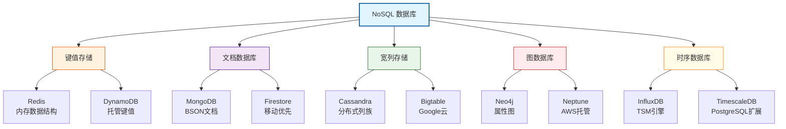
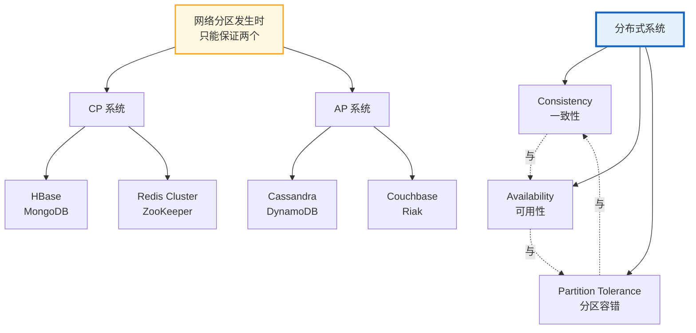
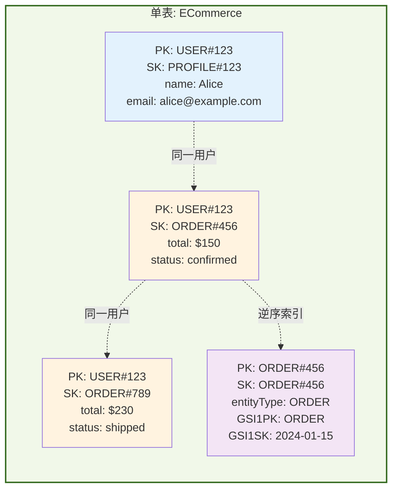
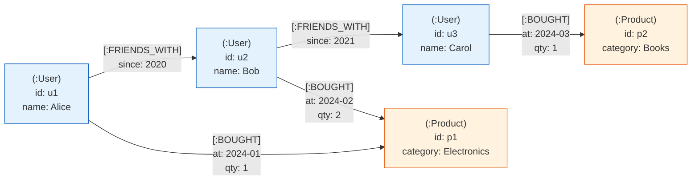

# NoSQL数据库：从键值到图

## 引言

2009 年，Johan Oskarsson 在旧金山组织了一场关于"开源、分布式、非关系型数据库"的 meetup，"NoSQL"一词由此进入主流技术视野。这场运动的本质并非否定 SQL，而是对关系模型在超大规模互联网场景下局限性的回应：当数据量突破单节点存储上限、当schema频繁演变、当毫秒级延迟成为硬性要求时，传统关系数据库的强一致性事务和固定表结构反而成为了扩展性的枷锁。

十五年后的今天，NoSQL 已不再是"Not Only SQL"的简单口号，而是演化为一个包含键值存储（KV Store）、文档数据库（Document Store）、宽列存储（Wide-Column Store）、图数据库（Graph Database）和时序数据库（Time-Series Database）的完整生态。对于 JavaScript/TypeScript 开发者而言，从 MongoDB 的灵活文档到 Redis 的内存数据结构，从 DynamoDB 的 Serverless 单表设计到 Neo4j 的图遍历查询——NoSQL 工具链已深度融入现代应用架构的每一层。

本文采用"理论严格表述"与"工程实践映射"双轨并行的写作策略。在理论层面，我们将从 CAP 定理的形式化语义出发，剖析 BASE 理论的松弛一致性模型，探讨不同 NoSQL 品类的数据模型本质与查询复杂度边界。在工程层面，我们将深入 MongoDB 的 Mongoose ODM、Redis 的复合数据结构、DynamoDB 的单表设计范式、Neo4j 的 Cypher 查询语言以及 InfluxDB 的时序索引，帮助读者建立从抽象理论到具体实现的完整认知链路。

---

## 理论严格表述

### 2.1 NoSQL 的分类与数据模型本质

NoSQL 并非单一技术，而是基于不同数据模型优化路径的数据库品类集合。理解其分类的最佳方式是从**数据结构的数学抽象**出发：

**定义 2.1（键值存储，Key-Value Store）**
键值存储的数据模型是有序或无序的映射（Map/Dictionary）：

```
KV: K → V
```

其中 `K` 通常为字符串或字节数组，`V` 为不透明二进制块（Opaque Blob）。键值存储不提供基于值内容的查询能力，所有操作均为 `O(1)` 复杂度的点查（Point Lookup）。典型代表：Redis、RocksDB、Amazon DynamoDB（底层）。

**定义 2.2（文档数据库，Document Store）**
文档数据库的数据模型是层次化的半结构化文档，通常以 JSON 或 BSON 表示。其数学抽象为**有根有序树（Rooted Ordered Tree）**：

```
Document = {key: Value}
Value = scalar | Document | [Value]
```

文档之间无预设的 schema 约束，支持嵌套对象和数组。查询能力基于文档内容的字段匹配，支持复合索引和聚合管道。典型代表：MongoDB、Couchbase、Firestore。

**定义 2.3（宽列存储，Wide-Column Store）**
宽列存储将数据组织为稀疏的多维映射，其模型介于关系表和键值存储之间：

```
(row_key, column_family, column_qualifier, timestamp) → cell_value
```

同一行内的列可以动态扩展，不同行可以拥有完全不同的列集合（稀疏性）。时间戳维度支持多版本数据。典型代表：Apache Cassandra、HBase、Google Bigtable。

**定义 2.4（图数据库，Graph Database）**
图数据库的数据模型是**属性图（Property Graph）**：

```
G = (V, E, λ, σ)
```

其中 `V` 是顶点集合，`E ⊆ V × V` 是边集合，`λ: V ∪ E → Label` 为标签函数，`σ: (V ∪ E) × Key → Value` 为属性函数。图数据库的查询语言（如 Cypher、Gremlin）本质上是图遍历算法的声明式表达。典型代表：Neo4j、Amazon Neptune、JanusGraph。

**定义 2.5（时序数据库，Time-Series Database）**
时序数据库针对时间序列数据优化，其数据模型为：

```
(series_id, timestamp) → {measurements, tags}
```

其中 `series_id` 由一组 tag 的笛卡尔积确定，`timestamp` 为单调递增的时间戳。时序数据库的核心优化在于**时间范围查询**和**降采样聚合（Downsampling）**。典型代表：InfluxDB、TimescaleDB、Prometheus。

### 2.2 CAP 定理的形式化语义

**定理 2.1（CAP Theorem，Brewer, 2000; Gilbert & Lynch, 2002）**
在一个分布式数据存储系统中，不可能同时满足以下三个属性：

- **一致性（Consistency, C）**：所有节点在同一时间看到的数据完全一致。形式化地，任何读取操作 `read(k)` 必须返回最近一次成功的写入操作 `write(k, v)` 的值，或返回错误。
- **可用性（Availability, A）**：每个请求都能在有限时间内收到非错误的响应，但不保证响应包含最新写入。
- **分区容错性（Partition Tolerance, P）**：系统在任意网络分区（节点间通信中断）的情况下仍能继续运行。

*证明概要*：假设网络发生分区，将节点分为 `G₁` 和 `G₂` 两组，组间无法通信。若客户端向 `G₁` 写入 `write(k, v₁)`，同时向 `G₂` 发起 `read(k)`。为保证一致性，`G₂` 必须返回 `v₁` 或错误；但 `G₂` 无法与 `G₁` 通信以获取 `v₁`，因此要么放弃一致性（返回旧值），要么放弃可用性（返回错误或阻塞）。∎

**CAP 的实践含义**：

| 系统类型 | 取舍 | 代表系统 |
|---------|------|---------|
| CP（一致性+分区容错） | 牺牲可用性 | HBase, MongoDB（默认）, Redis Cluster |
| AP（可用性+分区容错） | 牺牲强一致性 | Cassandra, DynamoDB, Couchbase |
| CA（一致性+可用性） | 牺牲分区容错 | 传统单节点 RDBMS |

需要强调的是，CAP 描述的是**网络分区发生时的极端取舍**，而非系统常态。大多数现代数据库通过可调一致性（Tunable Consistency）在不同操作间动态调整 C 与 A 的权衡。

### 2.3 BASE 理论的语义

BASE 是 NoSQL 系统在放弃 ACID 强一致性后提出的替代保证，由 eBay 架构师 Dan Pritchett 于 2008 年提出：

**定义 2.6（BASE）**

- **Basically Available（基本可用）**：系统在面对故障时允许部分功能降级，但核心功能保持可用。例如，在分区期间，系统可能拒绝某些查询或返回缓存数据，但不完全宕机。
- **Soft state（软状态）**：系统的状态可以在一段时间内不一致，无需外部输入即可自行变化（如异步复制导致的副本延迟）。
- **Eventual consistency（最终一致性）**：若系统在一定时间内没有新的更新操作，则所有副本最终将达到一致状态。形式化地，设 `write(k, v)` 在时间 `t` 提交，则存在时间 `t' > t`，使得对所有节点 `n`，`read_n(k, t') = v`。

BASE 并非与 ACID 对立的"反事务"哲学，而是对**大规模分布式系统物理现实**的承认：当复制延迟不可避免时，与其追求不可能的全局瞬时一致，不如明确界定一致性窗口并设计补偿机制。

### 2.4 文档模型的灵活性 vs 关系模型的严格性

文档数据库与关系数据库的核心差异在于**schema 约束的强弱**和**连接操作的效率**：

| 维度 | 关系模型 | 文档模型 |
|-----|---------|---------|
| Schema | 强schema，DDL定义表结构 | 灵活schema，文档自描述 |
| 数据关联 | 外键+JOIN，规范化存储 | 嵌套子文档或引用ID，反规范化 |
| 查询模式 | 声明式SQL，优化器自动选择计划 | 命令式聚合管道，需手动设计索引 |
| 水平扩展 | 分片复杂（跨分片JOIN困难） | 天然适合按文档分片 |
| 事务边界 | 多表ACID事务成熟 | 单文档原子性保证，跨文档事务较新 |

**嵌套 vs 引用的决策形式化**

设文档 `A` 与集合 `B` 存在一对多关系，`|B|` 为每个 `A` 对应的 `B` 文档数量：

- 若 `|B|` 小且增长有限（如用户的地址列表），**嵌套**更优：避免应用层多次查询，读取局部性好；
- 若 `|B|` 大且无限增长（如用户的订单历史），**引用**更优：避免文档体积膨胀超过存储引擎限制（MongoDB 单文档 16MB），支持独立查询和分页。

### 2.5 图数据库的遍历复杂度

图数据库的核心操作是**遍历（Traversal）**，其复杂度取决于图算法的选择：

**定义 2.7（广度优先搜索，BFS）**
BFS 从起点出发，逐层探索邻居节点。时间复杂度为 `O(V + E)`，空间复杂度为 `O(V)`（队列存储）。BFS 保证找到最短路径（按边数计算），适用于无权图的最短路径查询。

**定义 2.8（深度优先搜索，DFS）**
DFS 从起点出发，沿一条路径尽可能深入，直到无法继续再回溯。时间复杂度 `O(V + E)`，空间复杂度 `O(h)`（`h` 为图高度，递归栈深度）。DFS 适用于连通性检测、拓扑排序和环检测。

**定义 2.9（Dijkstra 最短路径）**
对于带权图，`Dijkstra` 算法在边权非负时找到单源最短路径。使用优先队列的实现时间复杂度为 `O((V + E) log V)`。

图数据库（如 Neo4j）通过**索引自由邻接（Index-Free Adjacency）**优化遍历性能：每个节点直接存储指向其邻居的物理指针，无需通过全局索引查找。这使得图遍历的时间复杂度与结果集大小成正比，而非与总数据量成正比——这是关系数据库通过 JOIN 模拟图查询时无法比拟的优势。

### 2.6 时序数据库的专用索引

时序数据的查询模式具有强烈的**时间局部性**：最近的数据被频繁查询，历史数据主要参与聚合计算。时序数据库通常采用以下索引策略：

1. **LSM-Tree（Log-Structured Merge Tree）**：InfluxDB 的 TSM（Time-Structured Merge Tree）引擎基于 LSM-Tree，将顺序写入优化到极致。写入先进入内存中的 MemTable，满后刷入不可变的 SSTable，后台通过合并（Compaction）回收空间。

2. **时间分区（Time Partitioning）**：按时间范围（如天或小时）将数据分片，查询时仅需扫描相关分区，避免全表扫描。

3. **降采样与保留策略（Retention Policy）**：自动将高精度历史数据聚合为低精度摘要（如 1 分钟数据保留 7 天，1 小时数据保留 1 年），控制存储成本。

---

## 工程实践映射

### 3.1 MongoDB 在 Node.js 中的使用

MongoDB 是 Node.js 生态中最流行的文档数据库，提供了原生驱动、Mongoose ODM 和 Prisma 适配器三种接入方式。

**原生驱动（MongoDB Node.js Driver）**

```typescript
import { MongoClient, ObjectId } from 'mongodb';

const client = new MongoClient(process.env.MONGODB_URI!);
const db = client.db('ecommerce');
const orders = db.collection('orders');

// 单文档原子操作（findAndModify 保证原子性）
const result = await orders.findOneAndUpdate(
  { _id: new ObjectId(orderId), status: 'pending' },
  {
    $set: { status: 'confirmed', confirmedAt: new Date() },
    $inc: { version: 1 }
  },
  { returnDocument: 'after' }
);

// 聚合管道：计算月度销售额
const monthlyRevenue = await orders.aggregate([
  { $match: { status: 'completed' } },
  {
    $group: {
      _id: { $dateToString: { format: '%Y-%m', date: '$createdAt' } },
      total: { $sum: '$amount' },
      count: { $sum: 1 }
    }
  },
  { $sort: { _id: -1 } },
  { $limit: 12 }
]).toArray();
```

原生驱动提供最高的灵活性和性能，但需要手动处理 schema 验证、关系引用和类型安全。

**Mongoose ODM**
Mongoose 是 MongoDB 的标志性 ODM，提供 schema 定义、中间件、虚拟属性和查询构建器：

```typescript
import mongoose, { Schema, Document } from 'mongoose';

interface IOrder extends Document {
  userId: mongoose.Types.ObjectId;
  items: Array<{ productId: string; qty: number; price: number }>;
  amount: number;
  status: 'pending' | 'confirmed' | 'shipped' | 'cancelled';
  createdAt: Date;
}

const OrderSchema = new Schema<IOrder>({
  userId: { type: Schema.Types.ObjectId, ref: 'User', required: true, index: true },
  items: [{
    productId: { type: String, required: true },
    qty: { type: Number, required: true, min: 1 },
    price: { type: Number, required: true }
  }],
  amount: { type: Number, required: true },
  status: { type: String, enum: ['pending', 'confirmed', 'shipped', 'cancelled'], default: 'pending' },
  createdAt: { type: Date, default: Date.now, index: -1 }
}, {
  timestamps: true,
  // 自动管理乐观锁版本号
  optimisticConcurrency: true,
  versionKey: '__v'
});

// 复合索引：加速状态+时间的查询
OrderSchema.index({ status: 1, createdAt: -1 });

// 虚拟属性：计算订单商品总数
OrderSchema.virtual('totalItems').get(function() {
  return this.items.reduce((sum, item) => sum + item.qty, 0);
});

const Order = mongoose.model<IOrder>('Order', OrderSchema);
```

**关键陷阱**：Mongoose 的 `populate()` 方法本质上是应用层的多次查询（`N+1` 风险），对于大规模数据应使用聚合管道的 `$lookup` 阶段在数据库层完成 JOIN：

```typescript
// 低效：N+1 查询
const orders = await Order.find().populate('userId');

// 高效：数据库层 $lookup
const ordersWithUsers = await Order.aggregate([
  { $match: { status: 'confirmed' } },
  {
    $lookup: {
      from: 'users',
      localField: 'userId',
      foreignField: '_id',
      as: 'user'
    }
  },
  { $unwind: '$user' }
]);
```

**Prisma MongoDB 适配器**
Prisma 从 3.x 版本开始支持 MongoDB 作为数据源：

```prisma
// schema.prisma
datasource db {
  provider = "mongodb"
  url      = env("DATABASE_URL")
}

model Order {
  id        String   @id @default(auto()) @map("_id") @db.ObjectId
  userId    String   @db.ObjectId
  items     OrderItem[]
  amount    Float
  status    String
  createdAt DateTime @default(now())

  @@index([status, createdAt(sort: Desc)])
}

type OrderItem {
  productId String
  qty       Int
  price     Float
}
```

Prisma 的 MongoDB 支持提供了类型安全的查询 API，但功能较 PostgreSQL 适配器有所限制（如不支持部分原生数据库特性）。

### 3.2 Redis 的数据结构与使用模式

Redis 不仅是缓存，更是一个支持多种数据结构的内存数据存储。理解每种结构的底层实现和适用场景是高效使用 Redis 的关键。

**String：最基本的数据类型**

```typescript
import { createClient } from 'redis';

const redis = createClient({ url: process.env.REDIS_URL });
await redis.connect();

// 缓存序列化对象
await redis.set(`user:${userId}`, JSON.stringify(user), { EX: 3600 });

// 原子计数器
await redis.incrBy(`product:${productId}:views`, 1);

// 分布式锁（Redlock 简化版）
const lockKey = `lock:order:${orderId}`;
const lockValue = crypto.randomUUID();
const acquired = await redis.set(lockKey, lockValue, { NX: true, EX: 30 });
if (acquired) {
  try {
    await processOrder(orderId);
  } finally {
    // 安全释放：仅当值匹配时才删除（防止误删他人锁）
    await redis.eval(
      'if redis.call("get", KEYS[1]) == ARGV[1] then return redis.call("del", KEYS[1]) else return 0 end',
      { keys: [lockKey], arguments: [lockValue] }
    );
  }
}
```

**Hash：紧凑的对象存储**

```typescript
// 存储用户会话，字段可独立更新
await redis.hSet(`session:${sessionId}`, {
  userId: userId,
  loginAt: Date.now().toString(),
  ip: clientIp
});

// 获取单个字段
const userId = await redis.hGet(`session:${sessionId}`, 'userId');

// 获取整个对象
const session = await redis.hGetAll(`session:${sessionId}`);
```

Hash 在内存中的编码为 `ziplist`（小数据）或 `hashtable`（大数据），比存储 JSON String 更节省空间。

**List：队列与栈**

```typescript
// 消息队列（生产者）
await redis.lPush('queue:emails', JSON.stringify(emailTask));

// 消费者（阻塞弹出）
while (true) {
  const result = await redis.brPop('queue:emails', 30); // 阻塞等待 30 秒
  if (result) {
    const task = JSON.parse(result.element);
    await sendEmail(task);
  }
}
```

`BLPOP`/`BRPOP` 实现了简单的阻塞消息队列，但缺乏 ACK 机制。对于可靠性要求高的场景，应使用 Redis Stream。

**Stream：持久化的日志结构**

```typescript
// 生产者
await redis.xAdd('stream:events', '*', {
  type: 'order_created',
  orderId: orderId,
  amount: amount.toString()
});

// 消费者组（Consumer Group）
await redis.xGroupCreate('stream:events', 'processors', '$', { MKSTREAM: true });

// 消费者读取
const messages = await redis.xReadGroup(
  'processors',
  `consumer-${workerId}`,
  [{ key: 'stream:events', id: '>' }], // '>' 表示未投递的消息
  { COUNT: 10, BLOCK: 5000 }
);

// 处理成功后确认
for (const msg of messages) {
  for (const item of msg.messages) {
    await processMessage(item.message);
    await redis.xAck('stream:events', 'processors', item.id);
  }
}
```

Redis Stream 提供了近似 Apache Kafka 的语义：持久化日志、消费者组、消息确认（ACK）和待处理条目列表（PEL）。

**Sorted Set：排行榜与范围查询**

```typescript
// 实时排行榜
await redis.zAdd('leaderboard:weekly', {
  score: playerScore,
  value: playerId
});

// 获取前 100 名
const topPlayers = await redis.zRevRangeWithScores('leaderboard:weekly', 0, 99);

// 获取玩家排名（0-based）
const rank = await redis.zRevRank('leaderboard:weekly', playerId);
```

Sorted Set 底层实现为**跳表（Skip List）+ 哈希表**的组合，保证 `O(log N)` 的插入、删除和范围查询性能。

**Pub/Sub：实时消息广播**

```typescript
// 发布者
await redis.publish('notifications:user-123', JSON.stringify({ type: 'new_message' }));

// 订阅者（需独立连接，因 Pub/Sub 连接进入订阅模式后无法执行其他命令）
const subscriber = redis.duplicate();
await subscriber.connect();
await subscriber.subscribe('notifications:user-123', (message) => {
  const data = JSON.parse(message);
  ws.send(data); // 推送到 WebSocket 客户端
});
```

Pub/Sub 的致命弱点是**不持久化消息**：若订阅者离线，期间发布的消息将永久丢失。对于可靠性要求高的场景，应使用 Stream 替代。

### 3.3 DynamoDB 的单表设计

Amazon DynamoDB 是一个全托管的键值/文档数据库，其数据建模哲学与传统关系数据库截然不同。**单表设计（Single-Table Design）**是 DynamoDB 社区的最佳实践：将所有相关实体存储在同一个表中，通过复合主键（Partition Key + Sort Key）和全局二级索引（GSI）支持多种访问模式。

**访问模式驱动设计**
DynamoDB 的设计流程从查询模式出发，而非从实体关系出发：

1. 列出所有需要支持的访问模式（如"根据用户 ID 查询订单"、"根据日期范围查询订单"）；
2. 为主键和 Sort Key 设计前缀，使同一 Partition Key 下可以共存多种实体；
3. 使用 GSI 创建逆序或交叉索引，支持反向查询。

```typescript
import { DynamoDBClient } from '@aws-sdk/client-dynamodb';
import { DynamoDBDocumentClient, PutCommand, QueryCommand } from '@aws-sdk/lib-dynamodb';

const client = DynamoDBDocumentClient.from(new DynamoDBClient({}));
const TABLE_NAME = 'ECommerce';

// 实体存入单表：通过 PK/SK 前缀区分实体类型
async function createOrder(order: Order, user: User) {
  await client.send(new PutCommand({
    TableName: TABLE_NAME,
    Item: {
      PK: `USER#${order.userId}`,
      SK: `ORDER#${order.id}`,
      entityType: 'ORDER',
      ...order
    }
  }));
}

// 查询 1：获取用户的所有订单
async function getUserOrders(userId: string) {
  const result = await client.send(new QueryCommand({
    TableName: TABLE_NAME,
    KeyConditionExpression: 'PK = :pk AND begins_with(SK, :sk)',
    ExpressionAttributeValues: {
      ':pk': `USER#${userId}`,
      ':sk': 'ORDER#'
    }
  }));
  return result.Items;
}

// GSI: 按日期查询订单（GSI1PK = 'ORDER', GSI1SK = createdAt）
async function getOrdersByDateRange(start: string, end: string) {
  const result = await client.send(new QueryCommand({
    TableName: TABLE_NAME,
    IndexName: 'GSI1',
    KeyConditionExpression: 'GSI1PK = :pk AND GSI1SK BETWEEN :start AND :end',
    ExpressionAttributeValues: {
      ':pk': 'ORDER',
      ':start': start,
      ':end': end
    }
  }));
  return result.Items;
}
```

**单表设计的核心权衡**：

- **优势**：减少跨表查询，利用 DynamoDB 的物理分区保证低延迟；事务操作（TransactWriteItems）在同表内更简单；
- **代价**：数据反规范化程度高，更新操作可能需要多处同步；索引设计需要前瞻性规划，后期变更成本高；查询灵活性远低于 SQL。

### 3.4 Neo4j 的图查询（Cypher）

Neo4j 的 Cypher 查询语言是一种声明式图模式匹配语言，其语法直观表达节点、关系和路径。

```typescript
import neo4j from 'neo4j-driver';

const driver = neo4j.driver(
  process.env.NEO4J_URI!,
  neo4j.auth.basic(process.env.NEO4J_USER!, process.env.NEO4J_PASSWORD!)
);
const session = driver.session();

// 创建节点和关系
await session.run(`
  CREATE (u:User {id: $userId, name: $name})
  CREATE (p:Product {id: $productId, category: $category})
  CREATE (u)-[:BOUGHT {at: datetime(), qty: $qty}]->(p)
`, { userId, name, productId, category, qty });

// 查询：查找用户的二度好友（朋友的朋友）中购买过某品类的用户
const result = await session.run(`
  MATCH (u:User {id: $userId})-[:FRIENDS_WITH*1..2]-(friend:User)
  MATCH (friend)-[:BOUGHT]->(p:Product {category: $category})
  WHERE friend <> u
  RETURN friend.id AS friendId, friend.name AS name,
         count(p) AS purchaseCount, collect(DISTINCT p.id) AS productIds
  ORDER BY purchaseCount DESC
  LIMIT 10
`, { userId, category });

// 最短路径：用户 A 到用户 B 的最短社交路径
const pathResult = await session.run(`
  MATCH path = shortestPath(
    (a:User {id: $fromId})-[:FRIENDS_WITH*]-(b:User {id: $toId})
  )
  RETURN [node in nodes(path) | node.name] AS pathNames,
         length(path) AS hops
`, { fromId, toId });
```

**Cypher 的核心概念**：

- `(n:Label {prop: value})`：带标签和属性的节点；
- `-[:REL_TYPE]->`：有向关系；
- `[:FRIENDS_WITH*1..3]`：可变长度路径（1 到 3 跳）；
- `shortestPath()`：内置最短路径函数，使用双向 BFS 算法。

### 3.5 InfluxDB 的时序数据

InfluxDB 是专为时序数据设计的数据库，在 IoT、监控和指标收集场景中广泛应用。

```typescript
import { InfluxDB, Point } from '@influxdata/influxdb-client';

const influxDB = new InfluxDB({ url: process.env.INFLUX_URL!, token: process.env.INFLUX_TOKEN! });
const writeApi = influxDB.getWriteApi('my-org', 'metrics');

// 写入时序点
const point = new Point('cpu_usage')
  .tag('host', 'server-01')
  .tag('region', 'us-east-1')
  .floatField('value', 78.5)
  .timestamp(new Date());

writeApi.writePoint(point);
await writeApi.close();

// 查询：过去 1 小时的平均 CPU 使用率，按 5 分钟降采样
const queryApi = influxDB.getQueryApi('my-org');
const fluxQuery = `
  from(bucket: "metrics")
    |> range(start: -1h)
    |> filter(fn: (r) => r._measurement == "cpu_usage")
    |> aggregateWindow(every: 5m, fn: mean, createEmpty: false)
    |> yield(name: "mean")
`;

const result = await queryApi.collectRows(fluxQuery);
```

**Flux 查询语言要点**：

- `from(bucket)` 指定数据源；
- `range(start, stop)` 限定时间范围；
- `filter(fn: (r) => ...)` 按标签或字段过滤；
- `aggregateWindow(every: 5m, fn: mean)` 按时间窗口聚合；
- `pivot()` 将字段从行转为列（宽表格式）。

### 3.6 Elasticsearch 的全文搜索

Elasticsearch 基于 Apache Lucene，提供分布式全文搜索和分析能力。

```typescript
import { Client } from '@elastic/elasticsearch';

const es = new Client({ node: process.env.ELASTICSEARCH_URL });

// 索引文档
await es.index({
  index: 'products',
  id: productId,
  document: {
    name: 'Wireless Bluetooth Headphones',
    description: 'Premium over-ear headphones with active noise cancellation',
    category: 'Electronics',
    price: 299.99,
    tags: ['audio', 'wireless', 'noise-cancelling'],
    createdAt: new Date().toISOString()
  }
});

// 全文搜索 + 过滤 + 聚合
const searchResult = await es.search({
  index: 'products',
  query: {
    bool: {
      must: [
        {
          multi_match: {
            query: 'wireless headphones',
            fields: ['name^3', 'description', 'tags'],
            type: 'best_fields',
            fuzziness: 'AUTO'
          }
        }
      ],
      filter: [
        { range: { price: { gte: 100, lte: 500 } } },
        { term: { category: 'Electronics' } }
      ]
    }
  },
  aggs: {
    price_stats: { stats: { field: 'price' } },
    categories: { terms: { field: 'category' } }
  },
  sort: [{ _score: 'desc' }, { price: 'asc' }],
  from: 0,
  size: 20
});
```

**关键概念**：

- **倒排索引（Inverted Index）**：将文档中的每个词项映射到包含它的文档列表，使全文搜索从 `O(N)` 降为 `O(log N)`；
- **相关性评分（BM25）**：Elasticsearch 默认使用 BM25 算法计算查询与文档的相关性得分；
- **分析器（Analyzer）**：索引前对文本进行分词、小写化、停用词过滤的标准化处理链。

### 3.7 NoSQL vs SQL：选型决策矩阵

| 场景特征 | 推荐选择 | 理由 |
|---------|---------|------|
| 复杂事务、强一致性（金融核心） | PostgreSQL / MySQL | ACID 成熟，外键约束，SQL 表达力强 |
| 快速迭代、schema 多变（初创 MVP） | MongoDB | 无需 DDL 迁移，文档自描述 |
| 缓存、会话、实时排行榜 | Redis | 内存级延迟，丰富的数据结构 |
| 超大规模、全球分布（AWS 生态） | DynamoDB | Serverless 自动扩展，按需付费 |
| 社交网络、推荐引擎、知识图谱 | Neo4j | 图遍历效率远超关系 JOIN |
| 物联网传感器、监控指标 | InfluxDB / TimescaleDB | 时序优化存储，高效降采样 |
| 站内搜索、日志分析 | Elasticsearch | 分布式倒排索引，聚合分析强大 |
| 高写入吞吐量、宽表（日志、事件） | Cassandra / ScyllaDB | LSM-Tree 优化顺序写入，线性扩展 |

**混合架构（Polyglot Persistence）**是现代应用的常态：关系数据库承载核心业务数据，Redis 处理缓存和实时计算，Elasticsearch 提供搜索能力，MongoDB 存储日志和非结构化内容。关键在于明确定义每个数据存储的职责边界，避免数据同步失控。

---

## Mermaid 图表

### 图 1：NoSQL 分类与数据模型映射



### 图 2：CAP 定理的分布式取舍



### 图 3：DynamoDB 单表设计的实体布局



### 图 4：Neo4j 属性图模型示例



---

## 理论要点总结

1. **NoSQL 的本质是面向特定数据模型的优化**：键值存储优化点查，文档数据库优化半结构化数据，图数据库优化遍历查询，时序数据库优化时间范围聚合。选型应从数据访问模式出发，而非盲目追求"扩展性"。

2. **CAP 定理界定了分布式系统的理论边界**：网络分区不可避免时，必须在一致性和可用性之间做出明确取舍。CP 系统适合金融交易等强一致性场景；AP 系统适合社交媒体、电商购物车等可用性优先场景。

3. **BASE 是对大规模分布式现实的务实承认**：最终一致性不是缺陷，而是设计选择。关键在于量化一致性窗口（如"复制延迟 < 500ms"），并设计补偿机制处理边界情况。

4. **单表设计是 DynamoDB 的灵魂**：通过复合主键和 GSI 的巧妙设计，单表可以支持多种访问模式。但这是以牺牲查询灵活性和增加应用层复杂度为代价的，不适合需要即席查询（Ad-hoc Query）的场景。

5. **图数据库的 Index-Free Adjacency 是遍历效率的根本**：关系数据库通过 JOIN 模拟图查询的时间复杂度随结果集和表大小双重增长，而图数据库的遍历复杂度仅与结果集大小成正比。当关系本身就是查询的核心时，图数据库是必然选择。

6. **Polyglot Persistence 是现代架构的常态**：没有单一数据库能满足所有需求。理性做法是为每种数据访问模式选择最优存储，并通过事件驱动架构（Event-Driven Architecture）或变更数据捕获（CDC）保持数据同步。

---

## 参考资源

1. **MongoDB Documentation** — *The MongoDB Manual*. MongoDB, Inc., 2024. 官方文档对文档模型设计、聚合管道、索引策略和事务有详尽的工程指导。<https://docs.mongodb.com/manual/>

2. **Redis Documentation** — *Redis Data Types and Commands*. Redis Ltd., 2024. 官方文档详细说明了每种数据结构的底层实现（如 Skip List、ziplist、listpack）和 Big-O 复杂度，是优化 Redis 使用的必读资料。<https://redis.io/docs/latest/>

3. **Amazon Web Services** — *Amazon DynamoDB Documentation: Single-Table Design*. AWS, 2024. AWS 官方博客和文档中 Rick Houlihan 关于单表设计的系列演讲和示例是理解 DynamoDB 数据建模的权威来源。<https://docs.aws.amazon.com/amazondynamodb/>

4. **Kleppmann, M.** — *Designing Data-Intensive Applications* (Chapter 2: Data Models and Query Languages; Chapter 5: Replication; Chapter 9: Consistency and Consensus). O'Reilly Media, 2017. 第2章系统比较了关系模型、文档模型和图模型的语义差异；第5章和第9章深入分析了复制延迟、一致性和共识算法，是理解 NoSQL 理论根基的终极读物。
