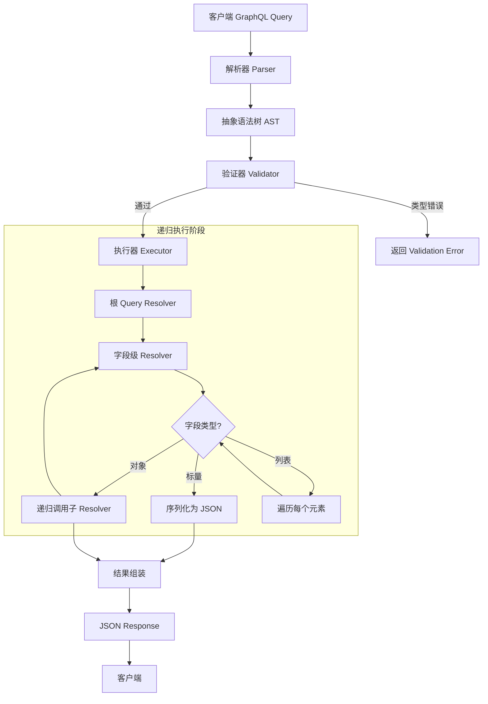
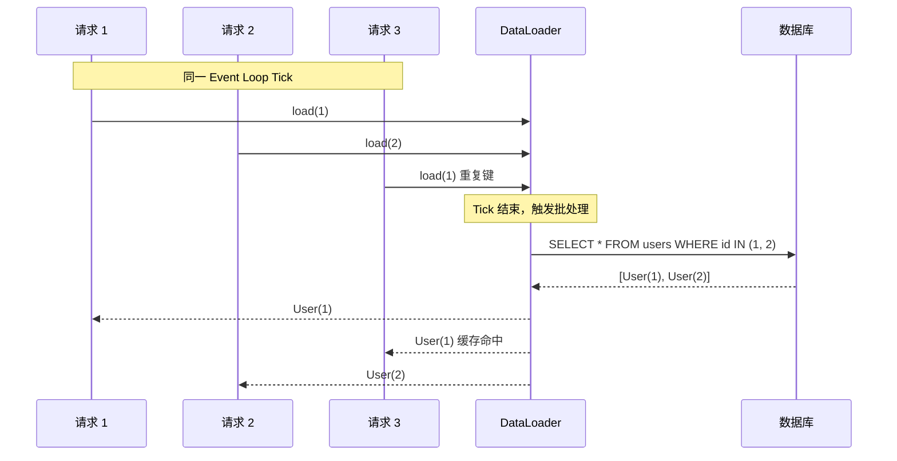
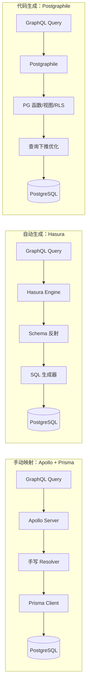
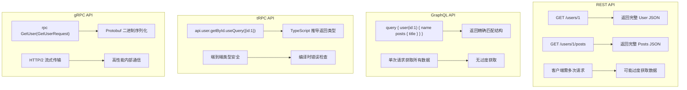

# GraphQL与数据库：从查询到数据层

## 引言

GraphQL 自 2015 年由 Meta（原 Facebook）开源以来，已经从一种替代 REST 的 API 查询语言演变为现代数据架构中的核心组件。与传统 REST API 相比，GraphQL 允许客户端精确声明所需的数据结构，服务器则返回与查询形状完全匹配的结果——这一特性既减少了网络传输开销，也为前后端协作带来了新的范式。

然而，GraphQL 的价值远不止于 API 层。当 GraphQL 与数据库深度集成时，它成为一种声明式数据访问层（Declarative Data Access Layer）：通过 Schema 定义数据模型，通过 Resolver 映射数据获取逻辑，通过类型系统保证查询的正确性。本文将从形式化理论出发，系统梳理 GraphQL 的类型系统、解析执行引擎、N+1 查询问题与批处理机制，并深入探讨 Prisma、Hasura、Postgraphile 等工具如何将 GraphQL 与数据库无缝连接，最终对比 REST、GraphQL、tRPC、gRPC 在数据层的适用场景与权衡。

---

## 理论严格表述

### 2.1 GraphQL 类型系统的形式化基础

GraphQL 的核心创新之一是将**类型系统**提升到 API 设计的中心位置。这种类型系统既服务于客户端（保证查询的静态可验证性），也服务于服务端（驱动解析执行的运行时行为）。

**定义 2.1（GraphQL Schema 的语法范畴）**

GraphQL Schema 定义了查询空间的类型结构。其基本语法范畴包括：

- **标量类型（Scalar Types）**：`Int`、`Float`、`String`、`Boolean`、`ID`，以及自定义标量。标量是类型的原子单元，不可再分解。
- **对象类型（Object Types）**：形如 `type User { id: ID! name: String! email: String }` 的复合类型，由若干字段（Field）组成。
- **枚举类型（Enum Types）**：值的有限集合，如 `enum Status { ACTIVE INACTIVE }`。
- **接口（Interface）与联合（Union）**：多态抽象机制。接口定义字段契约，联合表示"或"关系。
- **输入类型（Input Types）**：专用于参数传递的复合类型，与对象类型正交。

GraphQL 的类型系统是一种**结构性类型系统（Structural Type System）**而非名义类型系统（Nominal Type System）。两个类型若具有相同的字段结构，则被视为兼容。这与 TypeScript 的类型系统哲学高度一致，也是 GraphQL Code Generator 能够自动生成 TypeScript 类型的理论基础。

**定义 2.2（查询的类型正确性）**

给定 Schema `S` 和查询文档 `Q`，GraphQL 查询的类型正确性（Type Correctness）要求：

1. `Q` 中引用的每个字段必须存在于对应类型的定义中；
2. 每个参数的类型必须与 Schema 中定义的类型兼容；
3. 片段展开（Fragment Spread）必须满足接口或联合的类型条件；
4. 查询的返回类型 `τ(Q)` 可由 Schema 推导得出。

形式化地，类型正确性可表示为：`S ⊢ Q : τ`，即"在 Schema `S` 下，查询 `Q` 具有类型 `τ`"。

GraphQL 规范进一步定义了**查询验证（Validation）**阶段：在解析查询产生抽象语法树（AST）后，验证器按照规则集检查 AST 的类型正确性。任何违反类型规则的查询在执行前即被拒绝，这种"尽早失败（Fail Fast）"策略是 GraphQL 类型安全的关键保障。

### 2.2 GraphQL 解析执行引擎的形式化

GraphQL 服务器处理请求的完整生命周期可分为四个阶段：**解析（Parse）→ 验证（Validate）→ 执行（Execute）→ 响应（Response）**。这一流水线具有明确的输入输出契约，可用形式化模型描述。

**定义 2.3（查询解析函数）**

解析器 `Parse` 将查询字符串 `s` 映射为抽象语法树 `AST`：

```
Parse: String → AST ∪ {Error}
```

解析遵循上下文无关文法（Context-Free Grammar），生成由操作定义（OperationDefinition）、字段选择（Field）、片段（Fragment）等节点组成的树形结构。若字符串不符合文法，解析器返回语法错误。

**定义 2.4（验证函数）**

验证器 `Validate` 在 AST 和 Schema 的联合上下文中检查语义正确性：

```
Validate: (AST, Schema) → {Valid} ∪ {Error₁, Error₂, ...}
```

GraphQL 规范定义了超过 30 条验证规则，包括但不限于：

- 字段必须存在于父类型上（FieldsOnCorrectType）
- 片段不能形成循环依赖（NoFragmentCycles）
- 变量必须被使用（NoUnusedVariables）
- 指令只能出现在允许的位置（KnownDirectives）

**定义 2.5（执行函数与 Resolver）**

执行阶段是 GraphQL 引擎的核心。给定已验证的 AST `T`、Schema `S`、根值（Root Value）`root` 和上下文 `ctx`，执行函数 `Execute` 递归地遍历 AST，对每个字段调用对应的 **Resolver** 函数：

```
Execute: (T, S, root, ctx, variables) → Result
```

Resolver 是类型 `Resolver(parent, args, ctx, info) → value` 的函数。其中：

- `parent`：父字段的返回值；
- `args`：字段参数的字典；
- `ctx`：请求上下文（通常包含数据库连接、认证信息等）；
- `info`：字段的 AST 元数据（包含选择集、Schema 引用等）。

执行引擎遵循**深度优先、左到右**的遍历策略。对于每个对象类型的字段，引擎调用其 Resolver；对于标量类型的字段，Resolver 的返回值直接序列化为响应 JSON。这种递归下降的执行模型使得 GraphQL 天然适合树形数据结构的查询。

**定理 2.6（执行结果的形状一致性）**

设查询 `Q` 的 AST 为 `T`，若 `T` 通过验证且所有 Resolver 正常返回（无异常），则执行结果 JSON 的结构与 `T` 的形状（Shape）一致：结果对象的键与 AST 中选择的字段一一对应，嵌套层次与 AST 的嵌套深度一致。

```
Structure(Result) ≅ Shape(T)
```

这一定理是 GraphQL "你所查询即所得（You ask for what you get）"承诺的形式化表达。

### 2.3 N+1 查询问题的形式化分析

GraphQL 的递归执行模型在带来灵活性的同时，也引入了一个经典的数据库性能问题：**N+1 查询问题（N+1 Query Problem）**。

**定义 2.7（N+1 查询问题）**

考虑如下查询场景：查询 `N` 个作者（Author），每个作者关联 `M` 本书（Book）。若 Resolver 的实现采用"逐对象查询"策略，则：

1. 根查询执行 1 次 SQL 获取 `N` 个作者；
2. 对于每个作者的 `books` 字段，Resolver 各执行 1 次 SQL 获取其书籍。

总查询次数为 `1 + N`（当 `M` 为常数时），即 **N+1 问题**。若嵌套层级更深，问题呈指数级放大。

形式化地，设查询树深度为 `d`，第 `i` 层返回 `nᵢ` 个对象，第 `i` 层每个对象的子字段查询代价为 `cᵢ`，则总查询代价为：

```
Total Cost = c₀ + n₁ × c₁ + n₁ × n₂ × c₂ + ... + ∏(nᵢ) × c_d
```

当 `cᵢ` 为数据库查询时，每一层乘法项都代表一次数据库往返（Round Trip），导致性能灾难。

**定义 2.8（查询复杂度分析）**

为量化 GraphQL 查询的潜在代价，GraphQL 社区提出了**查询复杂度（Query Complexity）**模型。设每个字段 `f` 具有复杂度权重 `w(f)`，则查询的静态复杂度为所有命中的字段权重的加权和：

```
Complexity(Q) = Σ w(fᵢ) × multiplicity(fᵢ)
```

其中 `multiplicity(fᵢ)` 取决于列表字段的预期长度。复杂度分析常用于查询深度限制（Depth Limiting）和复杂度限流（Complexity Limiting），防止恶意或低效的查询耗尽服务器资源。

### 2.4 DataLoader 的批处理与去重理论

DataLoader 由 Meta 的 Lee Byron 于 2010 年代提出，是解决 N+1 问题的标准方案。其核心思想是**将同一事件循环（Event Loop Tick）内的同类查询批量化为单个请求**。

**定义 2.9（批处理函数）**

DataLoader 的核心是批处理函数 `batchFunction: keys → Promise<values>`，满足：

```
∀i, result[i] = value corresponding to keys[i]
```

即批处理函数接收一组键，返回一组与键一一对应的值（允许 `null` 或 `Error` 表示缺失值）。

**定理 2.10（DataLoader 的单一请求保证）**

在单个事件循环 Tick 内，对于任意 DataLoader 实例 `loader` 和任意键集合 `K = {k₁, k₂, ..., kₙ}`，若所有对 `loader.load(kᵢ)` 的调用发生在同一 Tick 内，则 `loader` 保证只调用一次 `batchFunction(K)`，且结果通过 Promise 分发给各个调用者。

形式化地：

```
|{ batchFunction calls in one tick }| ≤ 1
```

**定义 2.11（去重与缓存）**

DataLoader 内置两种优化机制：

1. **去重（Deduplication）**：同一 Tick 内对相同键的多次 `load(key)` 调用只产生一次 `batchFunction` 调用中的键条目。
2. **缓存（Caching）**：在 DataLoader 实例的生命周期内，`load(key)` 的结果被缓存，重复调用直接返回缓存值。

缓存策略可通过 `clear(key)`、`clearAll()`、`prime(key, value)` 等 API 显式控制。在 GraphQL 场景中，通常每个请求创建一个独立的 DataLoader 实例，以避免请求间的缓存污染。

**定义 2.12（跨层批处理的代数性质）**

DataLoader 的批处理具有**结合性（Associativity）**和**幂等性（Idempotency）**（在缓存命中的情况下）。设 `B` 为批处理操作，`⊕` 为结果合并操作，则：

```
B(K₁) ⊕ B(K₂) = B(K₁ ∪ K₂)  （结合性，当 K₁ ∩ K₂ = ∅ 时）
```

这允许在复杂查询图中多层使用 DataLoader，每层独立批处理，而不会破坏查询语义。

### 2.5 GraphQL Schema 与数据库 Schema 的映射理论

将 GraphQL 映射到关系型数据库需要解决**范式差异**问题：GraphQL 的图结构（对象类型通过字段相互引用）与关系模型的表结构（通过外键关联）存在本质差异。

**定义 2.13（Schema 映射的三类策略）**

| 策略 | 描述 | 代表工具 |
|------|------|---------|
| **手动映射** | 开发者手写 Resolver，显式编写 SQL/ORM 查询 | Apollo Server + Prisma/Raw SQL |
| **代码生成映射** | 从数据库 Schema 生成 GraphQL Schema 和 Resolver | Postgraphile |
| **反射映射** | 数据库变更自动反射到 GraphQL Schema | Hasura |

**定义 2.14（关系到图的映射函数）**

设数据库 Schema 为 `DB = {T₁, T₂, ..., Tₙ}`，其中每个表 `Tᵢ` 具有列集 `C(Tᵢ)` 和外键集 `FK(Tᵢ)`。映射函数 `Φ: DB → GQL` 定义如下：

1. 每张表 `Tᵢ` 映射为一个对象类型 `Type(Tᵢ)`；
2. 每列 `c ∈ C(Tᵢ)` 映射为字段 `Field(c)`，类型由列的数据类型推导；
3. 每个外键 `fk ∈ FK(Tᵢ)` 映射为关系字段（Relation Field），方向由外键的引用目标决定；
4. 主键列映射为 `ID` 标量类型，并标记为非空（`!`）。

形式化地，映射满足：

```
∀T ∈ DB, ∃! G ∈ GQL: G = Type(T)
∀c ∈ C(T), ∃! f ∈ Fields(G): name(f) = c ∧ type(f) = ScalarType(domain(c))
```

这种映射是**有损的（Lossy）**：关系模型中的约束（如 CHECK、UNIQUE、触发器）在 GraphQL 层面不可见；反之，GraphQL 的联合类型、接口等概念在关系模型中没有直接对应。因此，映射通常需要附加的元数据层（如 Hasura 的 Metadata、Postgraphile 的 Smart Tags）来补全语义。

**定义 2.15（查询下推的形式化）**

在自动映射系统中，关键优化是**查询下推（Query Pushdown）**：将 GraphQL 查询的选择集（Selection Set）尽可能下推到数据库查询中，避免全表扫描后在内存中过滤。

设 GraphQL 查询的选择集为 `S = {f₁, f₂, ..., fₙ}`，则理想的数据库查询投影为：

```sql
SELECT f₁, f₂, ..., fₙ FROM T WHERE ...
```

而非：

```sql
SELECT * FROM T WHERE ...
```

查询下推的程度取决于映射工具的智能程度。Hasura 和 Postgraphile 通过分析 AST 将字段选择、参数过滤、分页甚至嵌套关系查询转换为高效的 SQL。

---

## 工程实践映射

### 3.1 Apollo Server + Prisma：类型安全的全栈数据层

Apollo Server 是 Node.js 生态中最流行的 GraphQL 服务器实现，与 Prisma 结合可构建端到端类型安全的数据层。

**架构概览**

```
Client Query → Apollo Server → Resolver → Prisma Client → PostgreSQL
     ↑                                                  ↓
     └────────── 类型生成 (GraphQL Code Generator) ←────┘
```

在 Apollo Server 中集成 Prisma 的标准模式如下：

```typescript
import { ApolloServer } from '@apollo/server';
import { startStandaloneServer } from '@apollo/server/standalone';
import { PrismaClient } from '@prisma/client';

const prisma = new PrismaClient();

const typeDefs = `#graphql
  type User {
    id: ID!
    email: String!
    name: String
    posts: [Post!]!
  }

  type Post {
    id: ID!
    title: String!
    content: String
    published: Boolean!
    author: User!
  }

  type Query {
    users: [User!]!
    user(id: ID!): User
    posts(published: Boolean): [Post!]!
  }

  type Mutation {
    createUser(email: String!, name: String): User!
    createPost(title: String!, content: String, authorId: ID!): Post!
  }
`;

const resolvers = {
  Query: {
    users: () => prisma.user.findMany({ include: { posts: true } }),
    user: (_: unknown, { id }: { id: string }) =>
      prisma.user.findUnique({ where: { id }, include: { posts: true } }),
    posts: (_: unknown, { published }: { published?: boolean }) =>
      prisma.post.findMany({ where: { published } }),
  },
  Mutation: {
    createUser: (_: unknown, args: { email: string; name?: string }) =>
      prisma.user.create({ data: args }),
    createPost: (_: unknown, args: { title: string; content?: string; authorId: string }) =>
      prisma.post.create({ data: args }),
  },
  User: {
    posts: (parent: { id: string }) =>
      prisma.post.findMany({ where: { authorId: parent.id } }),
  },
  Post: {
    author: (parent: { authorId: string }) =>
      prisma.user.findUnique({ where: { id: parent.authorId } }),
  },
};

const server = new ApolloServer({ typeDefs, resolvers });
const { url } = await startStandaloneServer(server, {
  context: async () => ({ prisma }),
  listen: { port: 4000 },
});
```

**N+1 问题的工程解决**

上述实现中，`User.posts` 和 `Post.author` 的 Resolver 存在 N+1 问题。集成 DataLoader 的改进方案：

```typescript
import DataLoader from 'dataloader';

function createLoaders(prisma: PrismaClient) {
  return {
    userById: new DataLoader(async (ids: readonly string[]) => {
      const users = await prisma.user.findMany({
        where: { id: { in: [...ids] } },
      });
      const userMap = new Map(users.map((u) => [u.id, u]));
      return ids.map((id) => userMap.get(id) ?? null);
    }),
    postsByAuthorId: new DataLoader(async (authorIds: readonly string[]) => {
      const posts = await prisma.post.findMany({
        where: { authorId: { in: [...authorIds] } },
      });
      const postsMap = new Map<string, typeof posts>();
      for (const post of posts) {
        const list = postsMap.get(post.authorId) ?? [];
        list.push(post);
        postsMap.set(post.authorId, list);
      }
      return authorIds.map((id) => postsMap.get(id) ?? []);
    }),
  };
}

// 在 Apollo Server 上下文中为每个请求创建新的 loaders
const server = new ApolloServer({
  typeDefs,
  resolvers: {
    User: {
      posts: (parent, _args, ctx) => ctx.loaders.postsByAuthorId.load(parent.id),
    },
    Post: {
      author: (parent, _args, ctx) => ctx.loaders.userById.load(parent.authorId),
    },
  },
});

const { url } = await startStandaloneServer(server, {
  context: async () => ({ prisma, loaders: createLoaders(prisma) }),
  listen: { port: 4000 },
});
```

DataLoader 将原本 `N` 次独立的 `findUnique` 调用合并为一次 `findMany({ where: { id: { in: [...ids] } } })`，从根本上消除了 N+1 问题。

### 3.2 GraphQL Code Generator：从 Schema 到 TypeScript 的自动类型推导

GraphQL Code Generator 是连接 GraphQL Schema 与前端/后端 TypeScript 类型的桥梁。它解析 GraphQL Schema 和操作文档，生成完全类型安全的代码。

**核心配置**

```typescript
// codegen.ts
import type { CodegenConfig } from '@graphql-codegen/cli';

const config: CodegenConfig = {
  schema: './schema.graphql',
  documents: ['./src/**/*.graphql'],
  generates: {
    './src/generated/graphql.ts': {
      plugins: ['typescript', 'typescript-operations', 'typescript-resolvers'],
      config: {
        contextType: '../context#Context',
        mappers: {
          User: '../models#UserModel',
          Post: '../models#PostModel',
        },
        useIndexSignature: true,
      },
    },
  },
};

export default config;
```

生成的 TypeScript 类型示例：

```typescript
// src/generated/graphql.ts（片段）
export type User = {
  __typename?: 'User';
  id: Scalars['ID']['output'];
  email: Scalars['String']['output'];
  name?: Maybe<Scalars['String']['output']>;
  posts: Array<Post>;
};

export type QueryUserArgs = {
  id: Scalars['ID']['input'];
};

export type QueryResolvers<ContextType = Context, ParentType extends ResolversParentTypes['Query'] = ResolversParentTypes['Query']> = {
  users?: Resolver<Array<ResolversTypes['User']>, ParentType, ContextType>;
  user?: Resolver<Maybe<ResolversTypes['User']>, ParentType, ContextType, RequireFields<QueryUserArgs, 'id'>>;
  posts?: Resolver<Array<ResolversTypes['Post']>, ParentType, ContextType, Partial<QueryPostsArgs>>;
};
```

通过配置 `typescript-resolvers` 插件，GraphQL Code Generator 不仅生成类型定义，还生成 Resolver 函数的完整类型签名，确保每个 Resolver 的参数类型、返回类型和上下文类型严格匹配 Schema 定义。

### 3.3 Hasura：自动从 PostgreSQL 生成 GraphQL API

Hasura 是一个开源的 GraphQL 引擎，能够实时从 PostgreSQL（及其他数据库）反射出完整的 GraphQL API，无需手写 Resolver。

**核心特性**

1. **即时 GraphQL API**：连接数据库后，Hasura 自动将表、视图、函数、枚举暴露为 GraphQL Schema；
2. **实时订阅**：基于 PostgreSQL 的逻辑复制（Logical Replication）实现 GraphQL Subscription；
3. **权限系统**：行级安全（Row-Level Security, RLS）的声明式配置，支持角色、条件和列级权限；
4. **远程 Schema 拼接**：可将外部 GraphQL API（如自定义业务逻辑服务）与数据库 Schema 合并为统一端点。

**Hasura 元数据配置示例**

```yaml
# tables.yaml（Hasura Metadata 片段）
- table:
    schema: public
    name: users
  select_permissions:
    - role: user
      permission:
        columns:
          - id
          - email
          - name
        filter:
          id:
            _eq: X-Hasura-User-Id
  array_relationships:
    - name: posts
      using:
        foreign_key_constraint_on:
          column: author_id
          table:
            schema: public
            name: posts
```

Hasura 的查询下推能力极为强大。对于如下 GraphQL 查询：

```graphql
query GetUsersWithPosts {
  users(where: { email: { _ilike: "%@example.com" } }, limit: 10) {
    id
    email
    posts(where: { published: { _eq: true } }, order_by: { created_at: desc }) {
      title
      published
    }
  }
}
```

Hasura 会将其转换为高度优化的 SQL：

```sql
SELECT
  json_build_object(
    'id', hdb_catalog."users"."id",
    'email', hdb_catalog."users"."email",
    'posts', (
      SELECT coalesce(json_agg("posts"."title", "posts"."published"), '[]')
      FROM "posts"
      WHERE "posts"."author_id" = "users"."id"
        AND "posts"."published" = true
      ORDER BY "posts"."created_at" DESC
    )
  )
FROM "users"
WHERE "users"."email" ILIKE '%@example.com'
LIMIT 10;
```

Hasura 的**查询计划缓存**进一步优化了重复查询的性能：相同结构（参数值不同）的查询会被预编译并缓存执行计划。

### 3.4 Postgraphile：PostgreSQL 优先的自动 GraphQL 层

Postgraphile 是另一款从 PostgreSQL 自动生成 GraphQL API 的工具，与 Hasura 相比更强调**PostgreSQL 原生能力**的充分利用。

**核心差异对比**

| 特性 | Hasura | Postgraphile |
|------|--------|--------------|
| 数据库支持 | PostgreSQL, SQL Server, BigQuery | 仅 PostgreSQL |
| 架构 | 独立服务（Go 编写） | Node.js 中间件/库 |
| 扩展方式 | Actions, Event Triggers, Remote Schema | PostgreSQL 函数、插件系统 |
| 权限模型 | Hasura 元数据层 | PostgreSQL RLS + 行级安全 |
| 订阅实现 | 轮询 + 逻辑复制 | PostgreSQL LISTEN/NOTIFY |
| 查询计划 | 查询计划缓存 | 查询计划缓存 +  persisted queries |

Postgraphile 的哲学是"PostgreSQL 已经提供了你需要的所有功能"——权限用 RLS，计算用函数/视图，验证用约束和触发器。GraphQL 层只是这些能力的薄映射。

**Postgraphile 集成示例**

```typescript
import { createPostGraphileSchema } from 'postgraphile';
import { ApolloServer } from '@apollo/server';
import { Pool } from 'pg';

const pgPool = new Pool({ connectionString: process.env.DATABASE_URL });

const schema = await createPostGraphileSchema(pgPool, 'public', {
  watchPg: true,           // 监听数据库变更自动刷新 Schema
  dynamicJson: true,       // 支持 JSON 标量
  setofFunctionsContainNulls: false,
  ignoreRBAC: false,       // 尊重 PostgreSQL RLS
  ignoreIndexes: false,    // 利用索引优化 GraphQL 查询
  appendPlugins: [
    // 自定义插件扩展 Schema
  ],
});

const server = new ApolloServer({ schema });
```

Postgraphile 的**智能注释（Smart Comments）**允许通过 PostgreSQL 注释控制 GraphQL 暴露行为：

```sql
-- 隐藏敏感列
COMMENT ON COLUMN users.password_hash IS E'@omit';

-- 自定义 GraphQL 字段名
COMMENT ON COLUMN users.created_at IS E'@name registrationDate';

-- 将函数暴露为 GraphQL 查询
COMMENT ON FUNCTION search_posts(text) IS E'@name searchPosts';
```

### 3.5 Prisma Client 在 GraphQL Resolver 中的高级模式

在复杂业务场景中，Resolver 需要处理权限、过滤、分页、排序和事务。Prisma Client 的 Fluent API 与 GraphQL 参数天然契合。

**分页与游标模式**

```typescript
const resolvers = {
  Query: {
    userFeed: async (
      _: unknown,
      args: { cursor?: string; take?: number; skip?: number }
    ) => {
      const take = args.take ?? 10;
      const posts = await prisma.post.findMany({
        take: take + 1, // 多取一条判断是否还有下一页
        skip: args.skip ?? 0,
        cursor: args.cursor ? { id: args.cursor } : undefined,
        orderBy: { createdAt: 'desc' },
        where: { published: true },
        include: { author: true },
      });

      const hasNextPage = posts.length > take;
      const nodes = hasNextPage ? posts.slice(0, -1) : posts;
      const endCursor = nodes.length > 0 ? nodes[nodes.length - 1].id : null;

      return {
        nodes,
        pageInfo: {
          hasNextPage,
          endCursor,
          totalCount: await prisma.post.count({ where: { published: true } }),
        },
      };
    },
  },
};
```

**事务中的多操作 Resolver**

```typescript
const resolvers = {
  Mutation: {
    publishPost: async (_: unknown, { id }: { id: string }, ctx: Context) => {
      // 校验权限
      const post = await prisma.post.findUnique({ where: { id } });
      if (!post || post.authorId !== ctx.userId) {
        throw new Error('Unauthorized');
      }

      // 原子操作：更新文章 + 记录日志
      const [updatedPost, log] = await prisma.$transaction([
        prisma.post.update({
          where: { id },
          data: { published: true, publishedAt: new Date() },
        }),
        prisma.auditLog.create({
          data: {
            action: 'PUBLISH_POST',
            entityType: 'Post',
            entityId: id,
            userId: ctx.userId,
          },
        }),
      ]);

      return updatedPost;
    },
  },
};
```

### 3.6 GraphQL 订阅的实时数据架构

GraphQL Subscription 是实现实时数据推送的标准机制。在数据库场景中，订阅通常用于通知客户端数据变更（新增、更新、删除）。

**基于 Pub/Sub 的订阅实现**

```typescript
import { PubSub } from 'graphql-subscriptions';
import { ApolloServer } from '@apollo/server';
import { WebSocketServer } from 'ws';
import { useServer } from 'graphql-ws/use/ws';

const pubsub = new PubSub();

const typeDefs = `#graphql
  type Subscription {
    postPublished: Post!
    userUpdated(userId: ID!): User!
  }
`;

const resolvers = {
  Subscription: {
    postPublished: {
      subscribe: () => pubsub.asyncIterator(['POST_PUBLISHED']),
    },
    userUpdated: {
      subscribe: (_: unknown, { userId }: { userId: string }) =>
        pubsub.asyncIterator([`USER_UPDATED_${userId}`]),
    },
  },
};

// 在 Mutation 中触发事件
const mutationResolvers = {
  Mutation: {
    publishPost: async (_: unknown, { id }: { id: string }) => {
      const post = await prisma.post.update({
        where: { id },
        data: { published: true },
        include: { author: true },
      });
      await pubsub.publish('POST_PUBLISHED', { postPublished: post });
      return post;
    },
  },
};
```

**生产环境中的 Redis Pub/Sub**

单进程内存的 `graphql-subscriptions` 无法在分布式部署中工作。生产环境通常使用 Redis Pub/Sub 或 MQTT 作为消息代理：

```typescript
import { RedisPubSub } from 'graphql-redis-subscriptions';
import Redis from 'ioredis';

const pubsub = new RedisPubSub({
  publisher: new Redis(process.env.REDIS_URL),
  subscriber: new Redis(process.env.REDIS_URL),
});
```

**基于数据库变更的订阅**

Hasura 采用 PostgreSQL 的逻辑复制槽（Replication Slot）监听 WAL（Write-Ahead Log）变更，实现"数据库驱动"的订阅：

```
PostgreSQL WAL → Logical Decoder → Hasura Event System → WebSocket → Client
```

这种方式不依赖应用层显式触发事件，任何对数据库的直接写入（包括迁移脚本、后台任务）都会自动通知订阅者，保证了实时性的完整性。

### 3.7 对比：REST vs GraphQL vs tRPC vs gRPC 在数据层的应用

四种主流 API 范式在数据访问层各有优势和适用边界。

| 维度 | REST | GraphQL | tRPC | gRPC |
|------|------|---------|------|------|
| **类型系统** | 无内置（OpenAPI/Swagger 补全） | 强类型 Schema | TypeScript 推导 | Protocol Buffers |
| **查询灵活性** | 固定端点，服务端决定响应结构 | 客户端决定查询结构 | 服务端暴露过程 | 服务端定义 RPC |
| **传输协议** | HTTP/1.1, HTTP/2 | HTTP/1.1, HTTP/2 | HTTP/1.1, HTTP/2 | HTTP/2 |
| **序列化** | JSON | JSON | JSON / 二进制 | Protobuf（二进制） |
| **代码生成** | OpenAPI Generator | GraphQL Code Generator | 无需（类型即代码） | protoc |
| **浏览器支持** | 原生 | 原生（需要库） | 原生（需要库） | 需要 gRPC-Web 代理 |
| **缓存策略** | HTTP 缓存成熟 | 需自定义（DataLoader/APQ） | 无内置 HTTP 缓存 | 无内置 HTTP 缓存 |
| **实时通信** | 轮询 / WebSocket | Subscription (WebSocket/SSE) | Subscription (WebSocket) | 双向流 |
| **学习曲线** | 低 | 中高 | 低 | 中高 |
| **JS/TS 生态** | fetch/axios | Apollo Client / urql | @trpc/client | @grpc/grpc-js |

**工程选型建议**

- **REST**：公共 API、CDN 缓存场景、与遗留系统集成。HTTP 缓存（`Cache-Control`、`ETag`）是其不可替代的优势。
- **GraphQL**：前端需求多变、移动端带宽敏感、聚合多个数据源（BFF 模式）。Schema 的强类型契约特别适合大型团队协作。
- **tRPC**：全 TypeScript 技术栈、内部微服务通信、追求极致开发体验。tRPC 的"类型即 API"哲学消除了所有序列化/反序列化开销和类型漂移风险。
- **gRPC**：高性能内部服务通信、多语言环境、流式数据处理。Protobuf 的二进制序列化效率远超 JSON，但浏览器支持需要 gRPC-Web 转接层。

在数据库访问层，GraphQL 的独特价值在于**声明式数据获取**与**类型安全 Schema**的结合：客户端精确控制返回数据的形状，服务端通过 Resolver 灵活映射到底层数据库查询。然而，GraphQL 也引入了额外的复杂性（N+1 问题、查询复杂度控制、缓存策略），不适合简单的 CRUD 场景。

---

## Mermaid 图表

### GraphQL 查询执行引擎流程



### DataLoader 批处理与去重机制



### GraphQL-数据库映射架构对比



### REST vs GraphQL vs tRPC vs gRPC 数据流对比



---

## 理论要点总结

1. **GraphQL 的类型系统是一种结构性类型系统**：Schema 定义了查询空间的合法结构，验证器在执行前保证查询的类型正确性（`S ⊢ Q : τ`）。这种"尽早失败"策略是 GraphQL 可靠性的基石。

2. **执行引擎的递归下降模型是 N+1 问题的根源**：每个字段的独立 Resolver 调用在嵌套查询中产生指数级数据库往返。DataLoader 通过单 Tick 批处理和去重，将 `N` 次查询合并为 `1` 次，从根本上解决了该问题。

3. **Schema-数据库映射存在范式差异**：关系模型的表结构到 GraphQL 的图结构是有损映射。手动映射（Apollo+Prisma）提供最大灵活性，自动反射（Hasura）提供最快开发速度，代码生成（Postgraphile）提供最强 PostgreSQL 原生集成。

4. **查询下推是自动 GraphQL 层的关键优化**：将 GraphQL 选择集、过滤条件、分页参数转换为数据库层面的投影和限制，避免全表扫描后在内存中过滤。

5. **GraphQL Subscription 的实现策略取决于实时性要求**：应用层 Pub/Sub（Redis）适合显式业务事件，数据库层变更监听（Hasura 逻辑复制）适合"任何数据变更都必须推送"的场景。

6. **REST/GraphQL/tRPC/gRPC 的选型应基于场景而非偏好**：REST 的 HTTP 缓存不可取代，GraphQL 的声明式查询适合前端驱动的开发，tRPC 在全 TypeScript 栈中开发效率最高，gRPC 在高性能内部通信中无可替代。

---

## 参考资源

1. GraphQL Specification. "GraphQL Specification (October 2021 Edition)." <https://spec.graphql.org/October2021/> —— GraphQL 查询语言、类型系统、验证规则和执行语义的权威规范，由 GraphQL 技术委员会维护。

2. Apollo Server Documentation. "Apollo Server Introduction." <https://www.apollographql.com/docs/apollo-server/> —— Apollo Server 的官方文档，涵盖 Schema 定义、Resolver 编写、上下文管理、错误处理、插件系统和性能监控。

3. Hasura Documentation. "Hasura GraphQL Engine." <https://hasura.io/docs/latest/index/> —— Hasura 的完整文档，包括数据库连接、Schema 反射、权限配置、订阅实现、Actions/Remote Schema 扩展和查询优化。

4. Prisma Documentation. "Prisma Client Reference." <https://www.prisma.io/docs/orm/reference/prisma-client-reference> —— Prisma Client API 的完整参考，涵盖查询 API、关系加载、事务、聚合、原始查询和性能优化。

5. Byron, L. "DataLoader Source Code and Documentation." <https://github.com/graphql/dataloader> —— DataLoader 的原始实现和文档，详细解释了批处理函数的契约、缓存策略和 Promise 分发机制。

6. Postgraphile Documentation. "Postgraphile —— Instant GraphQL API." <https://www.graphile.org/postgraphile/> —— Postgraphile 的官方文档，展示了如何利用 PostgreSQL 的函数、视图、RLS 和 Smart Comments 构建高性能 GraphQL API。

7. GraphQL Code Generator Documentation. "Codegen —— Generate anything from GraphQL." <https://the-guild.dev/graphql/codegen> —— GraphQL Code Generator 的配置指南和插件生态，展示了从 Schema 生成 TypeScript 类型、React Hooks、Vue Composables 的全流程。
