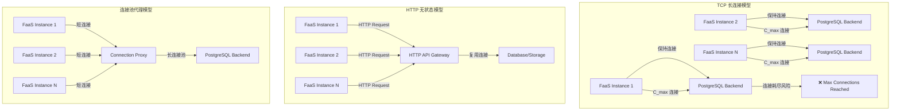
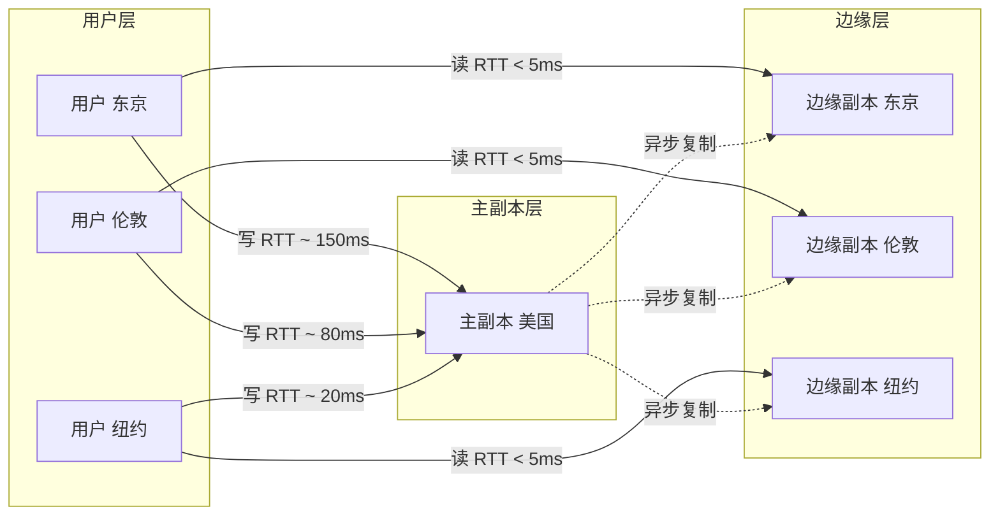
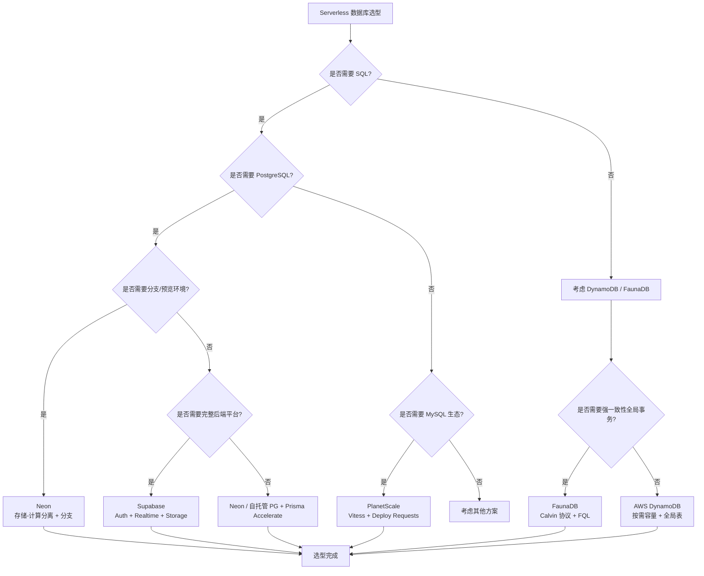

# Serverless数据库：从连接池到边缘

## 引言

Serverless 计算范式彻底改变了应用部署的方式：开发者只需编写业务逻辑，无需关心服务器的配置、扩展和运维。然而，当 Serverless 函数（如 AWS Lambda、Vercel Functions、Cloudflare Workers）与传统数据库相遇时，一个根本性的矛盾浮出水面——**有状态连接与无状态执行环境的不匹配**。

传统数据库基于 TCP 长连接协议设计，依赖连接池来摊销连接建立的开销。但在 Serverless 环境中，函数实例短暂存在、并发度高、冷启动频繁，传统连接池模型面临连接耗尽、冷启动延迟和连接泄漏的三重挑战。与此同时，边缘计算（Edge Computing）的兴起进一步将数据库推向了全球分布的架构：数据需要靠近用户部署，延迟模型从"数据中心内部"扩展到了"全球网络拓扑"。

本文将从连接模型的形式化分析出发，系统探讨 Serverless 数据库的核心挑战与理论权衡，并深入剖析 Neon、PlanetScale、Supabase、Turso、FaunaDB 和 DynamoDB 等代表性产品的工程实现与选型策略。

---

## 理论严格表述

### 2.1 数据库连接模型的形式化分类

数据库与客户端之间的通信协议可分为两大类：**TCP 长连接模型**与 **HTTP 请求-响应模型**。这两种模型在连接语义、状态管理和资源占用方面存在本质差异。

**定义 2.1（TCP 连接模型的形式化）**

TCP 连接模型基于 OSI 传输层的面向连接协议。设数据库服务器为 `S`，客户端为 `C`，则一个数据库会话 `Session` 定义为三元组：

```
Session = (TCP_Connection, Auth_State, Transaction_Context)
```

其中：

- `TCP_Connection` 是底层 TCP 四元组 `(src_ip, src_port, dst_ip, dst_port)`；
- `Auth_State` 包含认证后的用户权限和会话变量；
- `Transaction_Context` 记录当前事务的隔离级别、锁持有情况和未提交变更。

TCP 连接的状态ful特性意味着：一旦连接建立，后续的查询复用同一上下文，避免了重复的认证和会话初始化开销。然而，每个连接消耗服务器端的进程/线程资源（PostgreSQL 的 Backend Process、MySQL 的 Thread）。

**定义 2.2（连接池的形式化模型）**

连接池 `Pool` 是连接的缓存集合，其状态可用五元组描述：

```
Pool = (C_min, C_max, C_idle, C_active, Queue)
```

其中：

- `C_min`：最小连接数，保证预热；
- `C_max`：最大连接数，限制资源消耗；
- `C_idle`：当前空闲连接集合；
- `C_active`：当前活跃连接集合；
- `Queue`：等待连接的请求队列。

连接池的分配策略满足以下不变式：

```
|C_idle| + |C_active| ≤ C_max
|C_active| ≤ C_max - |C_idle|
```

当一个请求到达时，若 `C_idle > 0`，则分配一个空闲连接；若 `C_idle = 0` 且 `|C_active| < C_max`，则创建新连接；否则请求进入 `Queue` 等待或超时失败。

**定义 2.3（HTTP 连接模型的形式化）**

HTTP-based 数据库访问（如 DynamoDB HTTP API、Neon Serverless Driver、Turso HTTP API）将每个查询建模为无状态的 HTTP 请求：

```
Request = (Method, Endpoint, Headers, Body, Auth_Token)
Response = (Status_Code, Headers, Body)
```

每个请求携带完整的认证信息（JWT Token 或 API Key），服务器无需维护会话状态。这种模型的优势在于：

1. **无连接限制**：HTTP 基于请求复用（HTTP/2 多路复用、HTTP/3 QUIC），不占用数据库后端进程；
2. **天然负载均衡**：每个请求可路由到不同的后端节点；
3. **边缘缓存友好**：HTTP 语义支持 CDN 和边缘缓存。

但其劣势也很明显：每个请求需要额外的序列化开销（HTTP Headers、JSON 编码），且无法利用事务的会话状态（除非通过显式的"事务端点"模拟）。

**定理 2.4（连接模型的资源复杂度对比）**

设并发请求数为 `N`，每个请求的 CPU 处理时间为 `T_cpu`，网络往返时间为 `T_rtt`：

- **TCP 长连接（有连接池）**：资源占用为 `O(C_max)`，与请求数 `N` 无关（只要 `N ≤ C_max × Throughput_per_conn`）。
- **TCP 长连接（无连接池）**：资源占用为 `O(N)`，每个请求创建一个连接。
- **HTTP 无状态**：资源占用为 `O(N × T_cpu / T_rtt)`，取决于请求处理效率，但无硬性连接上限。

### 2.2 Serverless 环境中连接池的形式化挑战

Serverless 函数（Function-as-a-Service, FaaS）的执行环境具有三个核心特征：**事件驱动（Event-Driven）**、**短暂生命周期（Ephemeral）**和**自动扩展（Auto-Scaling）**。这些特征与传统连接池的前提假设严重冲突。

**定义 2.5（FaaS 执行模型）**

设一个 Serverless 函数的并发实例集合为 `Instances = {I₁, I₂, ..., I_k}`，每个实例的生命周期为 `Lifetime(Iᵢ) = [t_start, t_end]`，其中 `t_end - t_start` 通常为数毫秒到数分钟。

每个实例独立维护自己的连接池 `Pool(Iᵢ)`。设全局数据库的最大连接数为 `DB_max`，则系统必须满足：

```
Σ |Pool(Iᵢ)| ≤ DB_max
```

**定理 2.6（Serverless 连接爆炸定理）**

在突发流量（Traffic Spike）场景下，设并发实例数从 `k` 突增到 `k'`，每个实例的连接池大小为 `C_max`，则瞬时连接需求为：

```
Connection_Demand = k' × C_max
```

若 `k' × C_max > DB_max`，则必然出现连接耗尽（Connection Exhaustion），导致请求等待超时或直接被数据库拒绝。

这一定理揭示了 Serverless 与连接池的根本矛盾：**连接池的设计假设是客户端数量可控且长期存在，而 FaaS 的实例数量无上限且生命周期不可预测**。

**定义 2.7（冷启动的延迟分解）**

Serverless 函数的冷启动延迟 `T_cold` 可分解为：

```
T_cold = T_init + T_pool_create + T_first_query
```

其中：

- `T_init`：函数运行时的初始化时间（Node.js 运行时加载、模块导入）；
- `T_pool_create`：连接池初始化的耗时（建立 `C_min` 个 TCP 连接、完成 TLS 握手、数据库认证）；
- `T_first_query`：首次查询的执行时间。

在数据库场景中，`T_pool_create` 通常是最大的组成部分。PostgreSQL 的 TLS + 认证流程在跨可用区时可能达到 50-100ms，远高于函数本身的执行时间。

**定义 2.8（连接泄漏的形式化）**

连接泄漏（Connection Leak）指连接被分配后未被正确归还到连接池。在 FaaS 环境中，泄漏的主要原因包括：

1. 函数超时（Timeout）导致连接未释放；
2. 函数实例被冻结（Freeze）后未清理状态；
3. 异常路径未执行 `connection.release()`。

形式化地，设实例 `I` 在时间 `t` 被冻结，其持有的活跃连接集合为 `C_active(I, t)`。若数据库层面未检测到连接断开（TCP Keepalive 未超时），则这些连接在数据库端继续占用资源，但客户端已无法使用——形成**僵尸连接（Zombie Connection）**。

### 2.3 边缘数据库的延迟模型

边缘计算将计算和数据推向靠近用户的网络边缘（CDN PoP、5G MEC、区域数据中心）。边缘数据库的延迟模型需要从**读写路径**的角度重新分析。

**定义 2.9（读写路径的形式化）**

设用户位于地理位置 `L_user`，数据的主副本位于 `L_primary`，边缘副本位于 `L_edge`：

- **写路径延迟**：`T_write = RTT(L_user, L_primary) + T_commit`
- **读路径延迟（无边缘缓存）**：`T_read = RTT(L_user, L_primary) + T_query`
- **读路径延迟（有边缘缓存）**：`T_read = RTT(L_user, L_edge) + T_cache`

其中 `RTT(a, b)` 表示两地之间的网络往返时间。在全球分布场景中，`RTT(L_user, L_primary)` 可能达到 100-300ms，而 `RTT(L_user, L_edge)` 通常小于 20ms。

**定义 2.10（一致性-延迟权衡的形式化）**

边缘数据库面临的核心权衡是：读请求应路由到边缘副本以降低延迟，还是路由到主副本以保证一致性？

设一致性模型为 `Consistency ∈ {Strong, Eventual, Causal}`，则：

| 一致性模型 | 读路径 | 写路径 | 典型延迟 |
|-----------|--------|--------|---------|
| 强一致性 | 主副本 | 主副本 | `2 × RTT(user, primary)` |
| 因果一致性 | 边缘副本 + 向量时钟校验 | 主副本 | `RTT(user, edge) + validation` |
| 最终一致性 | 边缘副本 | 主副本 + 异步复制 | `RTT(user, edge)` |

**定理 2.11（PACELC 定理在边缘数据库中的表述）**

PACELC 定理是 CAP 定理的扩展，指出：

> 即使没有网络分区（Partition），分布式系统也必须在延迟（Latency）和一致性（Consistency）之间做出权衡。

形式化地：

```
If Partition then Availability vs Consistency
Else Latency vs Consistency
```

边缘数据库通常选择 **PA/EL**（分区时可用，否则低延迟）或 **PC/EC**（分区时一致，否则一致）的权衡策略。Turso 的全球复制属于 PA/EL：读操作路由到最近的副本以获得低延迟，写操作异步复制到所有副本。

### 2.4 数据一致性在分布式 Serverless 中的权衡

Serverless 架构天然倾向于分布式：函数可能在不同区域执行，数据库副本可能分布在全球。这种分布性引入了一致性挑战。

**定义 2.12（会话一致性的形式化）**

在 Serverless 环境中，"会话"的概念被弱化：两次连续的函数调用可能被路由到不同的实例，甚至不同的区域。传统数据库的"读己所写（Read Your Writes）"保证在以下场景中可能失效：

- 函数 `F₁` 在区域 `R₁` 写入数据到主副本；
- 函数 `F₂` 在区域 `R₂` 读取数据，但边缘副本尚未同步。

形式化地，设写入操作 `W` 在时间 `t_w` 提交于主副本，同步延迟为 `Δ_sync`，则：

```
∀ read R at time t_r: t_r ≥ t_w + Δ_sync ⇒ R sees W
                          t_r < t_w + Δ_sync ⇒ R may miss W
```

为解决此问题，一些系统（如 DynamoDB 的全局表）提供**一致性读（Consistent Read）**选项，将读请求路由到主副本，代价是延迟增加。

**定义 2.13（连接池代理的形式化角色）**

连接池代理（如 Prisma Accelerate、PgBouncer、AWS RDS Proxy）位于 FaaS 函数和数据库之间，将短生命周期的客户端连接复用为长生命周期的数据库连接。

形式化地，设代理的连接池为 `Proxy_Pool`，数据库的连接池为 `DB_Pool`，则代理的作用是将多对多的映射关系转化为可控的多对一映射：

```
∀ instance I: |Pool(I)| can be large
Σ |Pool(I)| → Proxy_Pool
|Proxy_Pool| << Σ |Pool(I)|
Proxy_Pool → DB_Pool (with controlled multiplexing)
```

代理层的核心机制包括：

1. **连接复用（Multiplexing）**：多个客户端连接共享一个数据库连接；
2. **会话状态分离（Session State Decomposition）**：将 `SET` 命令、事务状态、预备语句（Prepared Statement）与物理连接解耦；
3. **连接预热（Warm Pool）**：维持最小数量的数据库连接，避免冷启动。

---

## 工程实践映射

### 3.1 Neon：Serverless PostgreSQL 的架构创新

Neon 是一款开源的 Serverless PostgreSQL 平台，其核心创新在于将存储与计算分离（Storage-Compute Separation），并引入了**分支（Branching）**和**即时恢复（Instant Recovery）**能力。

**架构核心：存储-计算分离**

```
┌─────────────────────────────────────────┐
│           Compute Nodes                 │
│  ┌─────────┐ ┌─────────┐ ┌─────────┐  │
│  │ Postgres│ │ Postgres│ │ Postgres│  │
│  │  (Ephemeral)        │  │  (Scale to Zero)    │
│  └────┬────┘ └────┬────┘ └────┬────┘  │
│       │           │           │         │
│       └───────────┼───────────┘         │
│                   ↓                     │
│         Neon Storage Layer              │
│  ┌─────────────────────────────────┐    │
│  │  Pageserver (持久化页存储)       │    │
│  │  Safekeeper (WAL 复制)          │    │
│  │  S3 (冷数据归档)                │    │
│  └─────────────────────────────────┘    │
└─────────────────────────────────────────┘
```

Neon 的 Compute Node 是无状态的 PostgreSQL 实例，可按需启动和关闭。所有数据持久化在独立的 Storage Layer 中。这种架构带来三个关键优势：

1. **即时扩缩容**：Compute Node 可在毫秒级启动，无需数据迁移；
2. **分支即数据库**：基于写时复制（Copy-on-Write）技术，创建数据库分支仅需毫秒，适用于预览环境和 CI/CD；
3. **Scale to Zero**：无活跃查询时自动关闭 Compute Node，成本降至零。

**Neon Serverless Driver**

Neon 提供了专为 Serverless 优化的 HTTP 驱动，替代传统的 TCP 连接：

```typescript
import { neon } from '@neondatabase/serverless';

// HTTP-based 查询，无连接开销
const sql = neon(process.env.DATABASE_URL);

// 单次查询
const posts = await sql`SELECT * FROM posts WHERE published = true`;

// 批量查询（HTTP/2 多路复用）
const [users, posts] = await Promise.all([
  sql`SELECT * FROM users LIMIT 10`,
  sql`SELECT * FROM posts LIMIT 10`,
]);
```

Neon 的 Serverless Driver 使用 HTTP/2 请求多路复用，单个 TCP 连接可并发处理多个查询，彻底规避了 FaaS 环境中的连接池问题。

**Prisma 与 Neon 的集成**

```typescript
import { PrismaNeon } from '@prisma/adapter-neon';
import { neonConfig, Pool } from '@neondatabase/serverless';
import { PrismaClient } from '@prisma/client';
import ws from 'ws';

// 为 WebSocket 连接配置（事务场景）
neonConfig.webSocketConstructor = ws;

const pool = new Pool({ connectionString: process.env.DATABASE_URL });
const adapter = new PrismaNeon(pool);
const prisma = new PrismaClient({ adapter });

// 正常使用 Prisma Client API
const user = await prisma.user.create({
  data: { email: 'user@example.com', name: 'Alice' },
});
```

### 3.2 PlanetScale：Vitess-based MySQL 的 Serverless 演进

PlanetScale 基于 Google 开源的 Vitess 项目构建了 Serverless MySQL 平台。Vitess 最初为 YouTube 设计，用于水平扩展 MySQL，PlanetScale 将其改造为云原生 Serverless 数据库服务。

**Vitess 的核心抽象**

Vitess 引入了两个关键抽象：

1. **VTGate**：无状态的 SQL 代理层，负责路由、分片、负载均衡和连接池管理；
2. **VTTablet**：每个 MySQL 实例前的 sidecar，管理连接池、查询缓存和复制拓扑。

```
Client → VTGate → VTTablet → MySQL
              ↓
         Topology Service (etcd)
```

VTGate 的多租户连接池将大量短暂的客户端连接复用为有限的数据库后端连接，天然适合 Serverless 环境。

**PlanetScale 的独特功能**

| 功能 | 说明 |
|------|------|
| **Deploy Requests** | 数据库变更的 Pull Request 工作流。Schema 修改通过分支进行，合并前自动运行 Schema Diff 和兼容性检查 |
| **Schema Diff** | 对比两个数据库分支的 Schema 差异，检测破坏性变更（Breaking Changes） |
| **Revert** | 基于 Vitess 的 VReplication，可在秒级回滚到任意历史 Schema 和数据状态 |
| **Branching** | 每个代码分支可对应一个数据库分支，实现环境隔离 |

**PlanetScale 在 Vercel/Netlify 中的集成**

```typescript
import { connect } from '@planetscale/database';

const conn = connect({
  host: process.env.DATABASE_HOST,
  username: process.env.DATABASE_USERNAME,
  password: process.env.DATABASE_PASSWORD,
});

// HTTP-based 查询，无需连接池
const results = await conn.execute('SELECT * FROM users WHERE id = ?', [userId]);
```

PlanetScale 的驱动使用 HTTP/2 与 VTGate 通信，完全规避了传统 MySQL 连接在 Serverless 中的问题。

**Deploy Request 工作流示例**

```bash
# 创建开发分支
pscale branch create mydb develop

# 在开发分支上修改 Schema
pscale shell mydb develop
> ALTER TABLE users ADD COLUMN bio VARCHAR(500);

# 提交 Deploy Request（类似 Git PR）
pscale deploy-request create mydb develop --into main

# PlanetScale 自动执行：
# 1. Schema Diff 生成
# 2. 兼容性检查（是否删除列、修改类型等破坏性变更）
# 3. 部署到主分支（零停机，使用 Vitess 的在线 Schema 变更）
```

### 3.3 Supabase：Firebase 替代方案的开放生态

Supabase 定位为"开源 Firebase 替代方案"，但其底层是完全成熟的 PostgreSQL，通过一系列扩展模块提供认证、实时、存储和边缘函数能力。

**Supabase 的架构组件**

```
┌─────────────────────────────────────────┐
│           Supabase Platform             │
│  ┌─────────┐ ┌─────────┐ ┌─────────┐  │
│  │  Auth   │ │ PostgREST│ │ Realtime │  │
│  │ (GoTrue)│ │ (自动API)│ │ (WAL监听)│  │
│  └─────────┘ └─────────┘ └─────────┘  │
│  ┌─────────┐ ┌─────────┐ ┌─────────┐  │
│  │ Storage │ │ Edge Functions │ │ pg_graphql│  │
│  │ (S3 API)│ │ (Deno/WASM)    │ │ (GraphQL) │  │
│  └─────────┘ └─────────┘ └─────────┘  │
│              ↓                          │
│         PostgreSQL + Extensions         │
└─────────────────────────────────────────┘
```

**PostgREST：自动 REST API**

Supabase 使用 PostgREST 自动从 PostgreSQL Schema 生成完整的 RESTful API，无需手写后端代码：

```typescript
import { createClient } from '@supabase/supabase-js';

const supabase = createClient(
  process.env.SUPABASE_URL,
  process.env.SUPABASE_ANON_KEY
);

// 等效于 SELECT * FROM posts WHERE published = true ORDER BY created_at DESC LIMIT 10
const { data, error } = await supabase
  .from('posts')
  .select('*')
  .eq('published', true)
  .order('created_at', { ascending: false })
  .limit(10);

// 等效于 INSERT INTO posts (title, content) VALUES (...)
const { data: newPost } = await supabase
  .from('posts')
  .insert({ title: 'Hello', content: 'World' })
  .select()
  .single();
```

PostgREST 自动将 Supabase JS 客户端的链式调用转换为优化的 PostgreSQL 查询，并利用 PostgreSQL 的 RLS 进行权限控制。

**Row-Level Security（RLS）的声明式权限**

Supabase 将权限下沉到数据库层，通过 RLS 策略实现细粒度访问控制：

```sql
-- 启用 RLS
ALTER TABLE posts ENABLE ROW LEVEL SECURITY;

-- 策略：用户只能查看已发布的文章或自己的草稿
CREATE POLICY "Posts access policy" ON posts
  FOR SELECT
  USING (published = true OR auth.uid() = author_id);

-- 策略：用户只能更新自己的文章
CREATE POLICY "Posts update policy" ON posts
  FOR UPDATE
  USING (auth.uid() = author_id);
```

客户端查询时无需传递复杂的过滤条件，数据库自动根据当前用户的 JWT 令牌应用策略。

**Realtime：基于 WAL 的实时推送**

Supabase Realtime 监听 PostgreSQL 的逻辑复制流，将 INSERT/UPDATE/DELETE 事件通过 WebSocket 推送给客户端：

```typescript
const channel = supabase
  .channel('table-db-changes')
  .on(
    'postgres_changes',
    { event: '*', schema: 'public', table: 'posts' },
    (payload) => {
      console.log('Change received!', payload);
      // payload.new: 新数据
      // payload.old: 旧数据（UPDATE/DELETE）
    }
  )
  .subscribe();
```

### 3.4 Turso/libSQL：SQLite 的边缘化革命

Turso 是 Fly.io 团队基于 libSQL（SQLite 的开源分支）构建的边缘数据库平台。其核心理念是：将 SQLite 的轻量、零配置特性与全球边缘分布相结合。

**SQLite 的边缘适配**

传统 SQLite 是嵌入式数据库，不支持网络协议。Turso 通过以下改造使其适配边缘场景：

1. **libSQL 协议**：基于 HTTP 的轻量级查询协议，支持交互式事务；
2. **全球复制**：写操作路由到主副本，读操作路由到最近的边缘副本；
3. **嵌入式副本**：边缘位置的 libSQL 实例可作为本地缓存，支持离线读取。

**Turso 的延迟模型**

```
用户（东京） → 边缘副本（东京）→ 本地读取（< 5ms）
                        ↓
                  主副本（美国）← 写操作同步（~100ms）
```

Turso 默认提供**最终一致性**的读操作，适合读多写少、对延迟敏感的边缘应用（如内容展示、配置读取）。

**Turso 在 Cloudflare Workers 中的使用**

```typescript
import { createClient } from '@libsql/client/web';

const client = createClient({
  url: process.env.TURSO_DATABASE_URL,
  authToken: process.env.TURSO_AUTH_TOKEN,
});

// 单次查询
const result = await client.execute({
  sql: 'SELECT * FROM users WHERE id = ?',
  args: [userId],
});

// 交互式事务（HTTP-based）
const tx = await client.transaction();
try {
  await tx.execute({ sql: 'INSERT INTO orders (...) VALUES (...)' });
  await tx.execute({ sql: 'UPDATE inventory SET count = count - 1' });
  await tx.commit();
} catch (e) {
  await tx.rollback();
}
```

**Drizzle ORM 与 Turso 的集成**

```typescript
import { drizzle } from 'drizzle-orm/libsql';
import { createClient } from '@libsql/client/web';
import { users, posts } from './schema';

const client = createClient({ url: process.env.TURSO_URL!, authToken: process.env.TURSO_TOKEN! });
const db = drizzle(client);

// 类型安全的查询
const result = await db
  .select()
  .from(users)
  .leftJoin(posts, eq(users.id, posts.authorId))
  .where(eq(users.id, userId));
```

### 3.5 FaunaDB：Serverless 文档数据库的函数式查询

FaunaDB 是一款专为 Serverless 设计的分布式文档数据库，其独特之处在于**原生函数式查询语言 FQL（Fauna Query Language）**和**全球 ACID 事务**支持。

**FQL 的函数式模型**

FQL 将查询建模为可组合的函数调用，而非 SQL 的声明式语句：

```typescript
import { Client, fql } from 'fauna';

const client = new Client({ secret: process.env.FAUNA_SECRET });

// 等效于 SQL: SELECT * FROM users WHERE email = 'alice@example.com'
const result = await client.query(fql`
  Users.byEmail("alice@example.com")
`);

// 复杂查询：获取用户及其最近 10 篇文章
const result2 = await client.query(fql`
  let user = Users.byId(${userId})
  {
    user: user,
    posts: Posts.byAuthor(user).order(desc(.createdAt)).take(10)
  }
`);
```

FQL 的函数式模型天然适合组合和复用：用户可定义自定义函数（User-Defined Functions, UDF）封装业务逻辑：

```typescript
// 在数据库中创建 UDF
await client.query(fql`
  Function.create({
    name: "getUserWithPosts",
    body: (userId) => {
      let user = Users.byId(userId)
      {
        user: user,
        posts: Posts.byAuthor(user).order(desc(.createdAt)).take(10)
      }
    }
  })
`);

// 调用 UDF
const result = await client.query(fql`getUserWithPosts(${userId})`);
```

**FaunaDB 的全球 ACID 事务**

FaunaDB 使用 Calvin 协议实现跨区域的强一致性事务，与 Spanner 的 TrueTime 不同，FaunaDB 采用**确定性并发控制（Deterministic Concurrency Control）**：

1. 事务在进入执行阶段前已获得全局排序（Sequencer 层）；
2. 所有副本按相同顺序执行事务，无需两阶段提交（2PC）；
3. 读操作可在任意副本执行，因为副本状态严格一致。

这一定时模型使得 FaunaDB 能够提供：

- 串行化隔离级别（Serializable Isolation）
- 跨文档、跨集合的 ACID 事务
- 全球一致的读操作（无需路由到主副本）

然而，Calvin 模型的代价是**写延迟**：所有写操作必须经过 Sequencer 排序，全球分布时的写延迟通常高于主从复制模型。

### 3.6 DynamoDB：AWS 的 Serverless NoSQL 王者

DynamoDB 是 AWS 推出的全托管 NoSQL 数据库，其 Serverless 特性体现在**按需容量模式（On-Demand Capacity）**和**全局表（Global Tables）**。

**数据模型与分区键设计**

DynamoDB 的核心数据模型基于**键-值 + 文档**的混合结构：

```typescript
import { DynamoDBClient } from '@aws-sdk/client-dynamodb';
import { DynamoDBDocumentClient, PutCommand, QueryCommand } from '@aws-sdk/lib-dynamodb';

const client = DynamoDBDocumentClient.from(new DynamoDBClient({}));

// 单表设计（Single Table Design）示例
// 实体类型通过 GSI 区分
await client.send(new PutCommand({
  TableName: 'AppTable',
  Item: {
    PK: 'USER#123',      // 分区键
    SK: 'PROFILE',       // 排序键
    entityType: 'User',
    name: 'Alice',
    email: 'alice@example.com',
  },
}));

await client.send(new PutCommand({
  TableName: 'AppTable',
  Item: {
    PK: 'USER#123',
    SK: 'POST#456',
    entityType: 'Post',
    title: 'Hello World',
    createdAt: new Date().toISOString(),
  },
}));

// 查询某个用户的所有文章
const result = await client.send(new QueryCommand({
  TableName: 'AppTable',
  KeyConditionExpression: 'PK = :pk AND begins_with(SK, :sk)',
  ExpressionAttributeValues: {
    ':pk': 'USER#123',
    ':sk': 'POST#',
  },
}));
```

DynamoDB 的**单表设计（Single Table Design）**通过复合键（Composite Keys）和全局二级索引（GSI）在一张表中支持多种访问模式，这是其性能优化的核心范式。

**按需容量与自动扩展**

```typescript
// AWS CDK 配置
const table = new dynamodb.Table(this, 'MyTable', {
  partitionKey: { name: 'PK', type: dynamodb.AttributeType.STRING },
  sortKey: { name: 'SK', type: dynamodb.AttributeType.STRING },
  billingMode: dynamodb.BillingMode.PAY_PER_REQUEST, // 按需容量
  pointInTimeRecovery: true,
  globalSecondaryIndexes: [
    {
      indexName: 'GSI1',
      partitionKey: { name: 'GSI1PK', type: dynamodb.AttributeType.STRING },
      sortKey: { name: 'GSI1SK', type: dynamodb.AttributeType.STRING },
    },
  ],
});
```

按需容量模式下，DynamoDB 根据实际请求量自动扩展读写容量，无需预设吞吐量。代价是单位请求成本高于预置容量模式，适合流量不可预测的工作负载。

**全局表与多区域复制**

```typescript
// AWS CDK 配置全局表
const globalTable = new dynamodb.Table(this, 'GlobalTable', {
  partitionKey: { name: 'id', type: dynamodb.AttributeType.STRING },
  billingMode: dynamodb.BillingMode.PAY_PER_REQUEST,
  replicationRegions: ['us-west-2', 'eu-west-1', 'ap-northeast-1'],
  stream: dynamodb.StreamViewType.NEW_AND_OLD_IMAGES,
});
```

DynamoDB 全局表基于**最后写入者胜出（Last Writer Wins）**的冲突解决策略，提供多主（Multi-Master）复制。任何区域的写入在秒级同步到其他区域。但全局表不保证跨项事务（跨表事务仅支持同一区域）。

### 3.7 Prisma Accelerate：连接池代理的普惠化

Prisma Accelerate 是 Prisma 官方推出的连接池代理和全局缓存服务，旨在解决 Prisma Client 在 Serverless 环境中的连接问题。

**Prisma Accelerate 的架构**

```
FaaS Function → Prisma Client → Prisma Accelerate (Edge Network)
                                      ↓
                              Connection Pool Proxy
                                      ↓
                                 PostgreSQL / MySQL
```

Prisma Accelerate 部署在边缘网络上，提供：

1. **连接池代理**：将大量短暂的 Prisma Client 实例连接复用为有限的数据库长连接；
2. **查询缓存**：将重复查询的结果缓存在边缘节点，减少对数据库的访问；
3. **连接字符串保护**：数据库凭证不暴露在 FaaS 环境中，仅通过 Accelerate 的 API Key 访问。

**使用方式**

```typescript
import { PrismaClient } from '@prisma/client/edge';
import { withAccelerate } from '@prisma/extension-accelerate';

const prisma = new PrismaClient({
  datasourceUrl: process.env.DATABASE_URL, // 指向 Accelerate 的 URL
}).$extends(withAccelerate());

// 正常查询自动经过 Accelerate 代理
const users = await prisma.user.findMany();

// 显式缓存控制
const cachedUsers = await prisma.user.findMany({
  cacheStrategy: { ttl: 60, swr: 300 }, // 缓存 60 秒，stale-while-revalidate 300 秒
});
```

**连接池代理的形式化优势**

设无代理时，每个 FaaS 实例维护 `C` 个连接，`N` 个并发实例需要 `N × C` 个数据库连接。加入 Accelerate 代理后：

```
Before:  DB_connections = N × C
After:   DB_connections = Accelerate_Pool_Size << N × C
```

代理将连接需求从 `O(N)` 降低到 `O(1)`（相对于 FaaS 实例数），使传统数据库（如 AWS RDS、自托管 PostgreSQL）在 Serverless 场景中可用。

---

## Mermaid 图表

### Serverless 数据库连接模型对比



### 边缘数据库的读写路径与一致性模型



### Serverless 数据库选型决策矩阵



---

## 理论要点总结

1. **TCP 长连接与 Serverless 的执行模型存在根本性冲突**：传统连接池假设客户端数量有限且长期存活，而 FaaS 实例短暂、并发无界。连接爆炸定理表明，突发流量下 `k' × C_max > DB_max` 的失效不可避免。

2. **HTTP-based 数据库访问是 Serverless 的零摩擦方案**：Neon Serverless Driver、PlanetScale HTTP API、Turso HTTP 协议将每个查询建模为无状态请求，消除了连接管理的复杂性，代价是损失事务会话状态（除非显式模拟）。

3. **连接池代理是折中方案**：Prisma Accelerate、PgBouncer、AWS RDS Proxy 位于 FaaS 和数据库之间，将多对多的短连接映射为有限的长连接。代理的核心技术是连接复用和会话状态分离。

4. **边缘数据库的延迟模型由读写路径决定**：读操作路由到边缘副本可将延迟从 `RTT(user, primary)` 降低到 `RTT(user, edge)`，但写入仍受主副本距离限制。PACELC 定理表明，低延迟和强一致性在无分区时也无法兼得。

5. **Serverless 数据库的选型应基于一致性需求和生态锁定**：Neon/PlanetScale/Supabase 提供 PostgreSQL/MySQL 兼容性，适合现有 SQL 生态迁移；DynamoDB/FaunaDB 提供原生 Serverless 体验，但需要接受专有数据模型和查询语言。

6. **冷启动延迟是 Serverless 数据库不可忽视的成本**：连接建立（TCP + TLS + Auth）在跨可用区时可达 50-100ms。HTTP-based 驱动和连接预热是缓解冷启动的关键手段。

---

## 参考资源

1. Neon Documentation. "Neon Serverless Postgres." <https://neon.tech/docs/introduction> —— Neon 的官方文档，涵盖存储-计算分离架构、分支管理、Serverless Driver 和与 Prisma/Drizzle 的集成。

2. PlanetScale Documentation. "PlanetScale Documentation." <https://planetscale.com/docs> —— PlanetScale 的官方文档，详细介绍了 Vitess 架构、Deploy Requests、Schema Diff 和分支工作流。

3. Supabase Documentation. "Supabase Documentation." <https://supabase.com/docs> —— Supabase 的完整文档，包括 PostgreSQL 扩展、PostgREST API、Auth、Realtime、Storage 和 Edge Functions。

4. Turso Documentation. "Turso —— SQLite for Production." <https://docs.turso.tech/> —— Turso 和 libSQL 的官方文档，展示了 SQLite 边缘化的架构、HTTP 协议和全球复制机制。

5. AWS Documentation. "Amazon DynamoDB Developer Guide." <https://docs.aws.amazon.com/dynamodb/> —— AWS DynamoDB 的权威文档，涵盖数据模型设计、单表设计范式、按需容量、全局表和 DAX 缓存。

6. Elhemali, D., et al. (2022). "Amazon DynamoDB: A Scalable, Predictably Performant, and Fully Managed NoSQL Database Service." *USENIX ATC 2022*. —— DynamoDB 的架构论文，详细描述了分区管理、自适应容量、全局表复制和请求路由机制。

7. Prisma Documentation. "Prisma Accelerate." <https://www.prisma.io/data-platform/accelerate> —— Prisma Accelerate 的产品文档，解释了连接池代理、边缘缓存和查询结果缓存的工作原理。

8. Calderbank, M., et al. (2021). "FaunaDB Distributed Transaction Protocol." *Fauna Technical Whitepaper*. —— FaunaDB 的 Calvin 协议实现白皮书，描述了确定性排序、全局 ACID 事务和分布式一致性模型。
