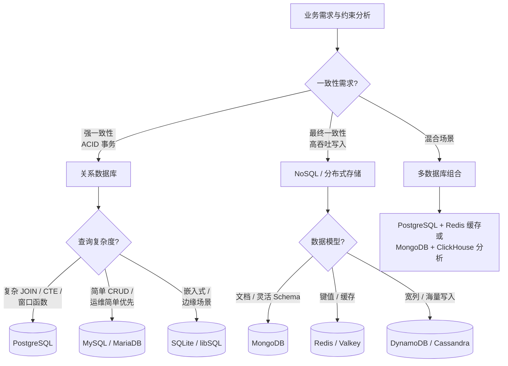
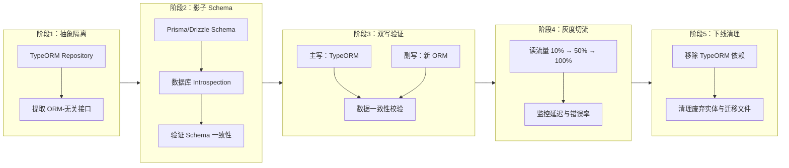
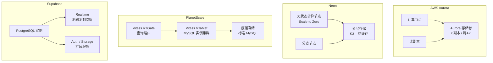

# 数据库与ORM选型终极指南

## 引言

数据库选型是软件架构中最具长期锁定效应的决策之一。一旦业务数据达到一定规模，更换底层存储引擎的成本将呈指数级增长——不仅涉及数据迁移的技术复杂度，更牵动着查询模式、事务语义、运维流程乃至团队知识结构的全面重构。ORM（Object-Relational Mapping）工具的选型同样具有深远影响：一个类型安全但表达能力受限的 ORM 可能在复杂查询场景下成为生产力的瓶颈；而一个灵活但缺乏编译期检查的 ORM 则可能在长期演进中积累隐式的类型债务。

本章不提供"最佳数据库"或"最佳 ORM"的简单答案，而是构建一套**形式化的多属性决策模型**。我们将从理论层面的 CAP 权衡、一致性谱系与查询模式分析出发，映射到工程层面的 2026 年技术全景图——涵盖 PostgreSQL、MySQL、MongoDB、Redis、SQLite、DynamoDB 的适用边界，Prisma、TypeORM、Drizzle、Kysely、MikroORM 的能力矩阵，以及从 TypeORM 向现代 ORM 迁移的实战策略。最后，我们将审视云服务商的数据库产品格局，并探讨 AI 辅助查询优化、自动索引与 Serverless 数据库主流化等未来趋势。

---

## 理论严格表述

### 数据库选型的多属性决策模型

数据库选型本质上是一个**多目标优化问题**。我们需要在一致性（Consistency）、可用性（Availability）、分区容错性（Partition Tolerance）、延迟（Latency）、吞吐量（Throughput）、运维复杂度（Operational Complexity）与团队经验（Team Expertise）之间寻找帕累托最优解。

#### CAP 定理的再审视

CAP 定理（Brewer, 2000）指出：分布式数据存储系统不可能同时满足一致性（C）、可用性（A）与分区容错性（P）。然而，CAP 常被简化为"三选二"的误导性框架。更精确的表述是：

- **分区容错性（P）是分布式系统的隐含前提**。若系统不部署在网络分区可能发生的场景中（如单机 SQLite），P 不成为约束；一旦系统具有分布式特性，P 必须被满足。
- CAP 中的 C 与 A 是**光谱而非开关**。一致性从强一致性（Linearizability）到最终一致性（Eventual Consistency）之间存在多个中间级别；可用性同样可以从 99.999% 到 99% 连续变化。
- **PACELC 定理**（Abadi, 2010）扩展了 CAP，指出即使没有网络分区（P），系统也必须在延迟（Latency）与一致性（Consistency）之间权衡。

**工程映射**：PostgreSQL 主从复制在同步模式下趋近 CP，在异步模式下趋近 AP；CockroachDB 与 Spanner 通过共识算法（Raft/Paxos）提供可调节的一致性级别；MongoDB 的副本集默认提供最终一致性，但可通过 `writeConcern` 与 `readConcern` 向更强一致性调节。

#### 一致性需求的层次化分析

一致性需求应从业务场景出发，而非技术偏好：

| 一致性级别 | 定义 | 典型场景 | 代表系统 |
|-----------|------|---------|---------|
| 强一致性（Linearizability） | 所有操作看似在全局时间点原子执行 | 金融交易、库存扣减 | Spanner、CockroachDB、PostgreSQL（单节点） |
| 顺序一致性 | 所有进程看到的操作顺序一致 | 分布式协作编辑 | etcd、ZooKeeper |
| 因果一致性 | 因果相关的操作对所有观察者顺序一致 | 社交网络评论流 | MongoDB（因果会话） |
| 读己之写一致性 | 用户总能读取到自己写入的数据 | 用户个人资料更新 | 大多数主从复制数据库 |
| 最终一致性 | 若无新写入，所有副本最终收敛 | 商品推荐、计数器 | Cassandra、DynamoDB、Redis 主从 |

#### 查询模式的形式化分类

查询模式（Query Pattern）是数据库选型中最常被低估的维度。我们可从以下四个正交维度对查询需求进行分解：

1. **访问模式（Access Pattern）**：点查（Point Lookup）vs 范围扫描（Range Scan）vs 全表聚合（Full Table Aggregation）
2. **数据关系拓扑（Relationship Topology）**：深度嵌套（图状）vs 宽而浅（星型）vs 扁平（键值）
3. **时间维度（Temporal Dimension）**：时序数据（ append-only + 时间范围查询）vs 当前状态（ mutable + 等值查询）
4. **空间维度（Spatial Dimension）**：地理空间查询（GIS）需求的有无

**决策映射**：

- 点查为主、无复杂关系 → 键值存储（Redis、DynamoDB）
- 范围扫描为主、强事务需求 → 关系数据库（PostgreSQL、MySQL）
- 嵌套文档、灵活 Schema → 文档数据库（MongoDB）
- 时序 append-only → 时序数据库（TimescaleDB、InfluxDB）
- 图状遍历 → 图数据库（Neo4j、Amazon Neptune）

### ORM 选型的形式化评估维度

ORM 是应用代码与数据库之间的**抽象层**，其设计在类型安全、灵活性、性能与开发者体验之间进行权衡。我们建立五个核心评估维度：

#### 维度一：类型安全（Type Safety）

类型安全衡量 ORM 在编译期捕获查询错误的能力。

- **完全类型安全**：Schema 变更自动反映在 TypeScript 类型中，查询构建过程完全类型化。代表：Prisma、Drizzle。
- **部分类型安全**：模型定义有类型，但查询构建（如原始 SQL）可能绕过类型检查。代表：TypeORM（`Repository` 模式类型安全，`QueryBuilder` 复杂场景易失效）。
- **运行时类型安全**：依赖运行时校验（如 Zod、Joi），编译期无保证。代表：Sequelize（需配合额外校验库）。

#### 维度二：性能（Performance）

ORM 性能可从三个层面评估：

1. **查询生成效率**：ORM 生成的 SQL 是否最优。例如 Prisma 的查询引擎（Rust 编写）在 N+1 问题上通过自动 `JOIN` 或 `in` 查询进行了优化；TypeORM 的 `find` 默认行为易产生 N+1。
2. **运行时开销**：ORM 层的对象映射、关系解析带来的 CPU 与内存开销。
3. **连接管理**：连接池的实现效率、对 prepared statement 的支持。

#### 维度三：灵活性（Flexibility）

灵活性衡量 ORM 表达复杂查询、数据库特定功能与自定义逻辑的能力。

- **高灵活性**：允许直接编写原始 SQL，查询构建器支持任意复杂度的组合。代表：Kysely、Drizzle。
- **中等灵活性**：提供查询构建器，但某些数据库特性需通过原始查询或扩展机制访问。代表：Prisma（通过 `$queryRaw` 和扩展功能补充）。
- **低灵活性**：强约定、弱配置，偏离主路径时成本高。代表：早期的 Waterline、部分低代码平台 ORM。

#### 维度四：迁移能力（Migration Capability）

迁移能力包括：Schema 版本控制、迁移生成自动化、迁移回滚支持、多环境迁移一致性。

- **声明式迁移**：开发者描述目标状态，工具自动生成迁移脚本。代表：Prisma Migrate。
- **命令式迁移**：开发者手写迁移脚本（Up/Down），工具负责执行顺序管理。代表：TypeORM Migrations、Drizzle Kit（支持两种模式）。

#### 维度五：学习曲线（Learning Curve）

学习曲线受文档质量、社区规模、错误信息清晰度与概念抽象层次影响。

- **低学习曲线**：概念贴近 SQL，API 直观。代表：Drizzle（"SQL-like" API）、Kysely。
- **中等学习曲线**：有特定领域概念（如 Prisma 的 Relation Fields、Client Extensions），但文档完善。代表：Prisma。
- **高学习曲线**：概念抽象复杂（如 Active Record vs Data Mapper 模式）、配置繁琐、错误信息晦涩。代表：TypeORM（在大型项目中配置与调试成本显著）。

### 技术债务在数据库选型中的长期影响

数据库选型的技术债务具有**累积性**与**迁移刚性**两个显著特征：

1. **查询模式债务**：选择了不适合当前查询模式的数据库（如用 MongoDB 处理复杂多表关联），导致应用层被迫实现本应由数据库层处理的 JOIN、事务与聚合逻辑。这种债务不会随时间自动消解，反而会随着数据量增长而放大。
2. **一致性模型债务**：在需要强一致性的场景中选择了最终一致性存储，应用层需自行实现分布式锁、幂等性校验与补偿事务。这些机制的复杂度往往被低估。
3. **生态锁定债务**：深度绑定某一云厂商的专有数据库（如 AWS DynamoDB 或 Azure Cosmos DB），迁移时需重写大量查询逻辑与数据访问层。
4. **ORM 抽象泄漏债务**：ORM 无法表达某些数据库特性时，开发者被迫在代码库中散落地编写原始 SQL，导致抽象层逐渐" Swiss Cheese 化"（千疮百孔）。

**缓解策略**：

- 在选型阶段进行**概念验证（PoC）**，用真实数据量与查询模式测试候选数据库。
- 在数据访问层引入**仓库模式（Repository Pattern）**，隔离 ORM 的具体实现，为 future 替换预留接口。
- 对关键业务实体保留**数据库无关的领域模型**，避免 ORM 的注解/装饰器污染核心业务逻辑。

---

## 工程实践映射

### 2026年数据库选型全景图

#### 关系数据库

**PostgreSQL**

- **核心优势**：功能最丰富的开源关系数据库，支持高级索引（GIN、GiST、BRIN）、JSONB、窗口函数、CTE、并行查询、逻辑复制。
- **适用场景**：复杂 OLTP、地理空间数据（PostGIS）、混合工作负载（HTAP，通过 Citus 或 TimescaleDB 扩展）、需要严格 ACID 与标准 SQL 兼容性的应用。
- **2026年状态**：PostgreSQL 17/18 持续优化并行 vacuum、增量排序与逻辑复制的性能，云托管版本（Neon、Supabase、AWS RDS Aurora PostgreSQL）已支持 Serverless 自动扩缩容。

**MySQL / MariaDB**

- **核心优势**：生态庞大、运维工具成熟、主从复制配置简单、在简单读写场景下性能优异。
- **适用场景**：传统 LAMP/LEMP 栈、WordPress/Drupal 等 CMS、对 DBA 人才储备要求低的团队。
- **2026年注意**：MySQL 8.4 在 JSON 函数、CTE 与窗口函数上已大幅追赶 PostgreSQL，但在复杂查询优化器、扩展类型与标准 SQL 兼容性上仍有差距。MariaDB 与 MySQL 的兼容性分叉值得关注。

#### 文档数据库

**MongoDB**

- **核心优势**：灵活的文档模型、水平扩展（Sharding）成熟、聚合管道（Aggregation Pipeline）功能丰富、变更流（Change Streams）支持实时数据同步。
- **适用场景**：快速演化的 Schema、内容管理、产品目录、IoT 数据摄入、需要地理空间索引的应用。
- **2026年状态**：MongoDB 8.0 增强了时间序列集合、可查询加密与向量搜索（Atlas Vector Search），在 AI 应用中的文档+向量混合存储场景增长迅速。

#### 键值与缓存存储

**Redis**

- **核心优势**：亚毫秒级延迟、数据结构丰富（String、Hash、List、Set、Sorted Set、Stream、JSON、Vector）、主从复制与哨兵/集群高可用。
- **适用场景**：会话缓存、速率限制、实时排行榜、消息队列（Streams）、向量相似度搜索（Redis Stack）。
- **2026年注意**：Redis 的许可证变更（SSPL）促使社区关注 Valkey（AWS 主导的开源分支）。在选型时需评估许可风险与长期支持路线。

**DynamoDB**

- **核心优势**：完全托管、自动分片、与 AWS 生态深度集成、按需计费模式。
- **适用场景**：AWS 原生 Serverless 架构、海量键值查询、需要全球表（Global Tables）的多区域部署。
- **限制**：复杂查询能力弱（需依赖 GSI/LSI 预先设计访问模式）、无原生 JOIN、无跨表事务（除支持的事务功能外）。

#### 嵌入式与边缘数据库

**SQLite**

- **核心优势**：零配置、单文件存储、跨平台、公共领域许可（Public Domain）。
- **适用场景**：桌面应用（Electron、Tauri）、移动应用、IoT 边缘设备、测试环境、中小型 Web 应用（配合 libSQL/Turso 实现边缘复制）。
- **2026年演进**：Turso 基于 libSQL（SQLite 分支）提供边缘数据库即服务，将 SQLite 的部署范围从单机扩展到全球边缘节点。

#### 专用数据库速览

| 数据库类型 | 代表产品 | 最佳场景 | Node.js 驱动 |
|-----------|---------|---------|-------------|
| 时序数据库 | TimescaleDB, InfluxDB | 指标监控、IoT 传感器 | `pg`, `@influxdata/influxdb-client` |
| 图数据库 | Neo4j, Amazon Neptune | 知识图谱、社交网络、欺诈检测 | `neo4j-driver` |
| 向量数据库 | pgvector, Pinecone, Weaviate | RAG、语义搜索、推荐系统 | `pgvector` (SQL), 各厂商 REST SDK |
| 搜索数据库 | Elasticsearch, Meilisearch | 全文搜索、日志分析 | `@elastic/elasticsearch`, `meilisearch` |
| 列式数据库 | ClickHouse, Apache Druid | OLAP、实时分析、大规模聚合 | `@clickhouse/client` |

### ORM 选型决策树

#### 五维能力矩阵

| 维度 | Prisma | TypeORM | Drizzle | Kysely | MikroORM |
|------|--------|---------|---------|--------|----------|
| 类型安全 | ★★★★★ | ★★★☆☆ | ★★★★★ | ★★★★★ | ★★★★☆ |
| 查询性能 | ★★★★☆ | ★★★☆☆ | ★★★★★ | ★★★★★ | ★★★★☆ |
| 灵活性 | ★★★☆☆ | ★★★★☆ | ★★★★★ | ★★★★★ | ★★★★☆ |
| 迁移能力 | ★★★★★ | ★★★☆☆ | ★★★★☆ | ★★★☆☆ | ★★★★☆ |
| 学习曲线 | ★★★★☆ | ★★★☆☆ | ★★★★★ | ★★★★☆ | ★★★☆☆ |
| 生态成熟度 | ★★★★★ | ★★★★☆ | ★★★★☆ | ★★★☆☆ | ★★★☆☆ |

（评分基于 2026 年 Q1 的社区活跃度、企业采用率与工具链完善度）

#### 各 ORM 深度解析

**Prisma**

- **定位**：Schema-first、类型安全、全功能 ORM。
- **核心优势**：
  - 声明式 Schema 语言自动生成类型安全的客户端。
  - Prisma Migrate 提供声明式迁移工作流，支持 shadow database 保证迁移一致性。
  - Prisma Studio 提供可视化数据管理界面。
  - 查询引擎（Rust 实现）自动优化 N+1 查询（通过 `include` 的批量获取）。
- **局限**：
  - 不支持某些数据库高级特性（如 PostgreSQL 的 `LISTEN/NOTIFY` 需通过原生客户端补充）。
  - 复杂查询的表达能力受限（如递归 CTE、 lateral JOIN 需使用 `$queryRaw`）。
  - Bundle 体积较大（查询引擎二进制文件约 10-20MB）。
- **适用团队**：追求开发效率、类型安全与迁移自动化的中小型至大型团队。

**TypeORM**

- **定位**：装饰器驱动、Data Mapper / Active Record 双模式 ORM。
- **核心优势**：
  - 装饰器语法贴近传统 Java/.NET ORM（如 Hibernate、Entity Framework），迁移成本低。
  - QueryBuilder 表达能力强大，接近原生 SQL 的灵活性。
  - 支持多种数据库（PostgreSQL、MySQL、SQLite、MongoDB、Oracle、MSSQL）。
- **局限**：
  - 类型安全在复杂 QueryBuilder 场景下易失效（返回类型为 `any` 或需手动断言）。
  - 项目维护活跃度下降（2023-2025 年间核心维护者时间减少），新特性迭代缓慢。
  - 大型项目中装饰器与元数据反射引入的隐式逻辑难以调试。
- **适用团队**：已有大量 TypeORM 代码库的团队，或从 Java 背景迁移的开发者。

**Drizzle**

- **定位**：SQL-like、类型安全、轻量 ORM。
- **核心优势**：
  - API 设计哲学为"如果你会 SQL，你就会 Drizzle"。查询语法几乎与 SQL 一一对应。
  - 零运行时依赖，Bundle 体积极小（纯 TypeScript + 类型推断）。
  - 对 PostgreSQL 高级特性支持友好（如 `jsonb`、`array`、`with` CTE）。
  - 同时支持关系型查询与原始 SQL，灵活性极高。
- **局限**：
  - 生态相对年轻（2023 年发布 1.0），某些边缘场景（如复杂迁移、多schema 管理）的工具链不如 Prisma 成熟。
  - 关系查询语法（`with` / `relations`）的学习曲线对纯前端开发者稍陡。
- **适用团队**：追求 SQL 透明度、Bundle 体积敏感、对数据库特性有深度需求的团队。

**Kysely**

- **定位**：类型安全 SQL 查询构建器（Query Builder），非完整 ORM。
- **核心优势**：
  - 完全类型化的查询构建，从 `select` 到 `where` 到 `join` 的类型推断极为精准。
  - 不隐藏 SQL，所有操作均可预测地映射到 SQL 语句。
  - 插件生态丰富（如用于 Prisma 的 `kysely-prisma` 桥接）。
- **局限**：
  - 无内置迁移工具（需配合 `kysely-ctl` 或外部迁移方案）。
  - 无模型定义层，需自行管理表结构与类型映射（通常配合 Zod 或手写类型）。
  - 关系加载需手动构建 JOIN，无自动 N+1 解决机制。
- **适用团队**：SQL 能力强、偏好显式控制查询、对 ORM 的"魔法"保持警惕的开发者。

**MikroORM**

- **定位**：Data Mapper 模式、支持单元工作单元（Unit of Work）的 TypeScript ORM。
- **核心优势**：
  - 实现了 Hibernate 风格的 Unit of Work 与 Identity Map，自动追踪实体变更并批量提交。
  - 支持懒加载（Lazy Loading）与急加载（Eager Loading）的精细控制。
  - 对 MongoDB 的支持是一流公民（非附赠功能）。
- **局限**：
  - 学习曲线陡峭（需理解 Unit of Work、Identity Map、Flush 等概念）。
  - 社区规模与生态小于 Prisma 与 TypeORM。
  - 在 Serverless 环境中的冷启动性能需关注（Identity Map 的初始化开销）。
- **适用团队**：来自 Java/.NET 背景、熟悉 Hibernate 模式、需要强对象追踪能力的团队。

#### 选型决策树

```
团队是否需要声明式 Schema + 自动生成迁移?
├── 是 → 优先考虑 Prisma（全功能）或 Drizzle Kit（轻量）
│   └── 是否需要极致 Bundle 体积控制?
│       ├── 是 → Drizzle
│       └── 否 → Prisma
└── 否 → 团队是否偏好手写 SQL 或 QueryBuilder?
    ├── 是 → 是否需要编译期类型安全?
    │   ├── 是 → Kysely（QueryBuilder）或 Drizzle（ORM）
    │   └── 否 → 原生 `pg` / `mysql2` + Zod
    └── 否 → 团队是否有 Hibernate / Entity Framework 背景?
        ├── 是 → MikroORM（Data Mapper + Unit of Work）
        └── 否 → TypeORM（需谨慎评估长期维护风险）
```

### 从 TypeORM 迁移到 Prisma/Drizzle 的策略

TypeORM 在 2023-2025 年间经历了社区活跃度的显著下降，许多团队开始评估向 Prisma 或 Drizzle 的迁移。迁移策略应遵循**渐进式替换**原则，避免大爆炸式重写。

#### 阶段一：数据访问层抽象

在现有 TypeORM 代码库中引入 Repository 接口，将 TypeORM 的具体实现隐藏于接口之后：

```typescript
// 抽象接口（ORM 无关）
interface IUserRepository {
  findById(id: string): Promise<User | null>;
  findByEmail(email: string): Promise<User | null>;
  save(user: User): Promise<void>;
}

// TypeORM 实现
class TypeORMUserRepository implements IUserRepository {
  constructor(private repo: Repository<UserEntity>) {}
  // ...
}
```

#### 阶段二：影子 Schema 建立

在 Prisma 或 Drizzle 中建立与现有数据库兼容的 Schema 定义，验证迁移工具生成的 DDL 与现有表结构一致：

```prisma
// Prisma schema 影子映射
model User {
  id        String   @id @default(uuid())
  email     String   @unique
  createdAt DateTime @default(now()) @map("created_at")

  @@map("users")
}
```

使用 `prisma db pull`（Introspection）自动从现有数据库生成 Prisma Schema，减少手工映射错误。

#### 阶段三：双写与灰度切流

对关键实体实施双写：TypeORM 与目标 ORM 同时写入，读取仍走 TypeORM。通过数据校验脚本比对双写结果的一致性：

```typescript
// 双写封装
class DualWriteUserRepository implements IUserRepository {
  constructor(
    private primary: TypeORMUserRepository,
    private secondary: PrismaUserRepository,
  ) {}

  async save(user: User): Promise<void> {
    await this.primary.save(user);
    try {
      await this.secondary.save(user);
    } catch (e) {
      // 记录不一致告警，但不阻塞主流程
      logger.warn('Secondary write failed', { userId: user.id, error: e });
    }
  }
}
```

#### 阶段四：读流量迁移与 TypeORM 下线

逐步将读取流量从 TypeORM 迁移到目标 ORM，监控查询性能与错误率。最终移除 TypeORM 依赖与相关代码。

**迁移时间线估算**（基于中等复杂度代码库，约 100 张表）：

| 阶段 | 工作量 | 时间估算 |
|------|--------|---------|
| 数据访问层抽象 | 20% | 2-3 周 |
| 影子 Schema 与验证 | 15% | 1-2 周 |
| 双写实施 | 25% | 3-4 周 |
| 读流量迁移 | 30% | 4-6 周 |
| TypeORM 清理 | 10% | 1-2 周 |

### 数据库云服务商对比

云托管数据库（DBaaS）已成为 2026 年的默认选择。以下是主流服务商的核心差异：

#### AWS RDS / Aurora

- **产品矩阵**：RDS（托管 PostgreSQL/MySQL/SQL Server/Oracle）、Aurora（兼容 PostgreSQL/MySQL 的 AWS 自研引擎）。
- **核心优势**：与 AWS 生态（IAM、CloudWatch、Lambda、DMS）深度集成；Aurora 提供存储计算分离架构，读副本延迟可低至 10ms 以内。
- **Serverless 能力**：Aurora Serverless v2 支持秒级自动扩缩容，适合波动剧烈的工作负载。
- **定价模型**：按实例规格 + 存储 + I/O 计费；Aurora Serverless 按 ACU（Aurora Capacity Unit）计费。
- **适用场景**：深度绑定 AWS 的企业级应用、需要高可用多可用区部署的关键业务。

#### Neon

- **核心优势**：PostgreSQL 的 Serverless 原生重构，采用存储计算分离架构；分支（Branching）功能允许为每个 PR 创建独立的数据库分支；自动扩缩容至零（Scale to Zero）。
- **定价模型**：按计算时间 + 存储 + 数据传输计费；免费 tier  generous，适合开发与小规模生产。
- **适用场景**：Serverless/Edge 架构、需要数据库分支进行预览环境部署的团队、初创公司。
- **局限**：仅支持 PostgreSQL；某些 PostgreSQL 扩展需申请启用。

#### PlanetScale

- **核心优势**：基于 Vitess（YouTube 开源的分片中间件）的 MySQL 平台；分支与部署请求（Deploy Request）工作流将数据库变更纳入 Git 工作流；强大的连接管理与查询性能分析。
- **定价模型**：按存储 + 行读取 + 行写入计费（非传统按连接/实例计费）。
- **适用场景**：MySQL 生态团队、需要数据库分支与 schema 变更工作流的团队。
- **局限**：不支持外键约束（Vitess 的已知限制），需在应用层处理引用完整性。

#### Supabase

- **核心优势**：开源 Firebase 替代方案，基于 PostgreSQL；提供实时订阅（Realtime）、身份验证（Auth）、对象存储（Storage）、边缘函数（Edge Functions）的一体化平台。
- **定价模型**：按项目 + 数据库大小 + 边缘函数调用计费。
- **适用场景**：全栈应用、需要实时数据同步的协作应用、快速原型开发。
- **局限**：作为一体化平台，某些高级数据库调优参数的暴露程度不如纯 DBaaS。

#### MongoDB Atlas

- **核心优势**：MongoDB 的官方托管服务；提供自动分片、全球集群、Atlas Search（基于 Lucene 的全文搜索）、Atlas Vector Search（向量搜索）。
- **定价模型**：按集群规格 + 存储 + 数据传输 + 额外服务（Search/Vector）计费。
- **适用场景**：MongoDB 工作负载、需要向量+文档混合存储的 AI 应用、全球分布式部署。

#### 云服务商决策矩阵

| 维度 | AWS Aurora | Neon | PlanetScale | Supabase | MongoDB Atlas |
|------|-----------|------|-------------|----------|--------------|
| 数据库引擎 | PostgreSQL/MySQL | PostgreSQL | MySQL (Vitess) | PostgreSQL | MongoDB |
| Serverless | v2 (ACU) | 原生（Scale to Zero） | 否（连接池） | 否（固定实例） | Serverless Instances |
| 分支能力 | 有限 | ★★★★★ | ★★★★★ | ★★★★☆ | 有限 |
| 边缘/全球 | Global DB | 边缘代理 | 无 | 无 | Global Clusters |
| 定价透明度 | 复杂 | 简单 | 简单 | 简单 | 中等 |
| 生态锁定 | AWS 强锁定 | 低 | 中 | 中 | MongoDB 生态 |

### 未来趋势

#### AI 辅助查询优化

2025-2026 年，主流数据库与 ORM 开始集成 AI 辅助功能：

- **自动索引建议**：PostgreSQL 的 `pg_qualstats` + 扩展、AWS RDS 的 Performance Insights、MongoDB Atlas 的 Performance Advisor 均提供基于工作负载的索引建议。未来趋势是实时自动创建与删除索引（需配合在线索引构建避免锁表）。
- **查询改写**：自然语言到 SQL 的生成（Text-to-SQL）在简单查询场景已可用（如 Supabase 的 AI SQL Editor、GitHub Copilot 的数据库上下文感知），但在复杂业务逻辑中仍需人工校验。
- **异常检测**：基于机器学习的查询性能基线建立，自动识别计划回退（Plan Regression）与慢查询激增。

#### Serverless 数据库主流化

Serverless 数据库从"可选方案"演变为"默认架构"：

- **Scale to Zero**：Neon、Supabase、PlanetScale 均支持无活跃连接时暂停计费，对开发与低频应用极具吸引力。
- **连接池代理**：PgBouncer、Supavisor（Supabase 的连接池）解决了 Serverless 函数（Vercel/Netlify/AWS Lambda）高并发短连接对数据库的冲击。
- **边缘数据库**：Turso（libSQL）将 SQLite 复制到全球边缘节点，实现 `< 50ms` 的读取延迟，适合用户分布全球化的应用。

#### ORM 的演化方向

- **查询编译时优化**：Drizzle 与 Prisma 正在探索在构建时（build time）而非运行时分析查询模式，预生成最优 SQL。
- **边缘运行时兼容**：ORM 需适配 Cloudflare Workers、Deno Deploy 等边缘运行时（无 Node.js 原生模块、有 WASM 执行限制）。Drizzle 的零依赖特性使其在边缘环境中具有天然优势；Prisma 通过 Edge Client（基于 Prisma Client JS 的轻量版本）逐步适配。
- **数据库即代码（Database as Code）**：PlanetScale 的 Deploy Request、Neon 的分支、Prisma 的 Shadow Database 正在将数据库 Schema 变更纳入与应用程序代码相同的版本控制与 CI/CD 流程，减少"配置漂移"。

---

## Mermaid 图表

### 数据库选型多维决策模型



### ORM 选型五维雷达

```mermaid
radarChart
    title ORM 能力雷达图（2026）
    axis ["类型安全", "查询性能", "灵活性", "迁移能力", "学习曲线"]

    curve Prisma [5, 4, 3, 5, 4]
    curve TypeORM [3, 3, 4, 3, 3]
    curve Drizzle [5, 5, 5, 4, 5]
    curve Kysely [5, 5, 5, 3, 4]
    curve MikroORM [4, 4, 4, 4, 3]
```

### 渐进式 ORM 迁移流程



### 云数据库产品架构对比



---

## 理论要点总结

1. **数据库选型是多属性权衡，而非单维度优化**。CAP 定理揭示了分布式系统的基本约束，但现实中的决策还需纳入延迟、吞吐量、运维成本与团队经验。PACELC 定理提醒我们：即使没有网络分区，延迟与一致性的权衡依然存在。

2. **一致性需求应从业务场景推导，而非技术偏好驱动**。金融交易需要 Linearizability，社交媒体时间线可接受最终一致性，而大多数电商订单状态更新只需读己之写一致性。选择过强的一致性会牺牲可用性与性能；选择过弱的一致性则会在应用层引入补偿逻辑的复杂度。

3. **ORM 的选型本质是抽象层次的博弈**。Prisma 提供高阶抽象与类型安全，代价是灵活性的边界；Kysely 提供 SQL 的透明表达，代价是手动管理迁移与关系加载；Drizzle 在两者之间找到了 2026 年的最佳平衡点，但其生态成熟度仍需时间验证。

4. **技术债务在数据库层具有迁移刚性**。查询模式债务、一致性模型债务与生态锁定债务会随数据量增长而复利式放大。缓解之道在于：选型阶段进行概念验证、数据访问层引入仓库模式抽象、关键领域模型保持 ORM 无关。

5. **云数据库市场已进入 Serverless 与边缘化阶段**。Neon 的 Scale to Zero、Turso 的边缘复制、AWS Aurora Serverless v2 的自动扩缩容正在重塑数据库的运维范式。2026 年的默认选择不再是"租用一台 RDS 实例"，而是"根据工作负载自动分配计算资源"。

6. **从 TypeORM 的迁移应遵循渐进式替换策略**。大爆炸式重写风险极高，双写验证、灰度切流与接口隔离是控制风险的关键工程实践。迁移周期通常以月计，团队需预留足够的验证与回滚窗口。

7. **AI 正在重塑数据库的运维与查询模式**。自动索引建议、查询计划异常检测与自然语言到 SQL 的生成已从演示走向生产。但 AI 辅助不应取代人类对业务语义的理解——复杂的跨表 JOIN 与事务边界仍需架构师的审慎判断。

8. **边缘数据库（Edge Database）是 2026 年的新兴变量**。Turso 将 SQLite 的零配置特性与全球边缘复制结合，为 Vercel/Cloudflare Workers 等边缘运行时提供了 stateful 的持久化选项，填补了 Serverless 架构中"数据库距离过远"的空白。

9. **"数据库即代码"正在统一应用与数据的版本控制**。PlanetScale 的 Deploy Request、Neon 的分支、Prisma 的 Shadow Database 将 Schema 变更纳入 Git 工作流，使数据库迁移成为 CI/CD 流水线的一等公民，显著降低了配置漂移的风险。

10. **没有银弹，只有基于约束的最优解**。PostgreSQL 的通用性、Redis 的延迟、MongoDB 的灵活性、DynamoDB 的扩展性——每种数据库都有其舒适区。优秀的架构师不是选择"最好的"数据库，而是为每个工作负载选择"最合适的"数据库，并在必要时接受多数据库共存的复杂性。

---

## 参考资源

- Brewer, E. (2000). "Towards Robust Distributed Systems." *PODC 2000 Keynote*. CAP 定理的原始提出，奠定了分布式数据库一致性与可用性权衡的理论基础。
- Abadi, D. J. (2012). "Consistency Tradeoffs in Modern Distributed Database System Design." *IEEE Computer*, 45(2), 37-42. 系统阐述 PACELC 定理，扩展了 CAP 在延迟维度的分析框架。
- DB-Engines Ranking. <https://db-engines.com/en/ranking>. 权威的数据库流行度排名，基于搜索引擎查询、技术讨论频率、招聘信息与社交媒体提及的多维加权计算，每月更新。
- State of Databases 2025. <https://stateofdatabases.com/>. 开发者调查数据，涵盖数据库与 ORM 的采用率、满意度与趋势分析。
- Prisma Documentation. <https://www.prisma.io/docs>. Prisma 官方文档，包含 Schema 参考、迁移指南、性能优化与最佳实践。
- Drizzle ORM Documentation. <https://orm.drizzle.team/>. Drizzle ORM 官方文档，详细说明其 SQL-like API、类型系统与数据库支持矩阵。
- TypeORM Documentation. <https://typeorm.io/>. TypeORM 官方文档，尽管维护活跃度下降，仍是理解 Data Mapper 与 Active Record 模式的重要参考。
- AWS RDS & Aurora Documentation. <https://docs.aws.amazon.com/rds/>. AWS 托管关系数据库的官方文档，涵盖架构设计、性能调优与定价模型。
- Neon Documentation. <https://neon.tech/docs/intro>. Neon Serverless PostgreSQL 的官方文档，详细说明其存储计算分离架构与分支功能。
- PlanetScale Documentation. <https://planetscale.com/docs>. PlanetScale MySQL 平台的官方文档，涵盖 Deploy Request 工作流与连接管理。
- Supabase Documentation. <https://supabase.com/docs>. Supabase 一体化平台的官方文档，涵盖 PostgreSQL、Auth、Realtime 与 Edge Functions。
- Kleppmann, M. (2017). *Designing Data-Intensive Applications*. O'Reilly Media. 第5章（复制）、第7章（事务）与第9章（一致性与共识）为数据库选型提供了系统性的理论框架。
