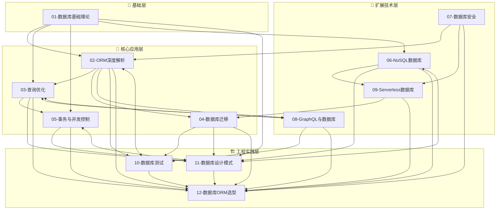

# 数据库与 ORM 专题

## 专题概述

在当代 Web 与移动端应用架构中，**数据持久化层** 是支撑业务逻辑的核心基础设施。无论是用户身份信息、交易记录、内容资产，还是实时产生的遥测数据，都需要通过数据库系统进行可靠的存储、高效的检索与安全的访问控制。数据库技术的选择与使用方式，直接影响应用的性能上限、可扩展性、数据一致性保障以及开发迭代效率。

对象关系映射（ORM, Object-Relational Mapping）作为应用程序与关系型数据库之间的抽象层，极大地提升了开发效率——开发者可以使用熟悉的面向对象语法操作数据库，而无需编写大量的手写 SQL。然而，ORM 也是一把双刃剑：不当的使用方式可能导致 N+1 查询问题、过度内存占用、隐式的复杂查询生成，以及调试困难等"泄漏抽象"现象。本专题旨在建立对数据库与 ORM 技术的系统性认知，既掌握 ORM 带来的生产力提升，也理解其底层原理与局限性，从而在实际工程中做出明智的技术决策。

本专题的十二大核心维度包括：

- **数据库基础理论**：关系模型、ACID 特性、范式理论、索引原理、执行计划分析
- **ORM 深度解析**：Active Record vs Data Mapper、Prisma/Drizzle/TypeORM 的架构对比、迁移生成机制
- **查询优化**：索引策略、查询计划解读、慢查询诊断、覆盖索引与最左前缀原则
- **数据库迁移**：Schema 变更策略、迁移版本控制、零停机部署、回滚机制
- **事务与并发控制**：隔离级别、锁机制、乐观锁与悲观锁、分布式事务、SAGA 模式
- **NoSQL 数据库**：文档数据库（MongoDB）、键值存储（Redis）、宽列存储（Cassandra）、图数据库（Neo4j）的适用场景
- **数据库安全**：SQL 注入防护、最小权限原则、数据加密（传输中、静态）、审计日志、合规性（GDPR、CCPA）
- **GraphQL 与数据库**：Resolver 模式、N+1 问题与 DataLoader、Prisma 集成、查询复杂度限制
- **Serverless 数据库**：PlanetScale、Neon、Supabase、Turso 等新一代云原生数据库的连接池管理、冷启动优化、边缘部署策略
- **数据库测试**：测试数据库隔离策略、工厂模式与 fixtures、集成测试性能优化、契约测试
- **数据库设计模式**：CQRS、Event Sourcing、读写分离、分库分表、多租户数据架构
- **数据库与 ORM 选型指南**：根据业务特征、团队规模、性能需求、运维能力进行技术栈决策

数据库与 ORM 技术贯穿于应用架构的始终，与性能工程、应用设计等专题存在深度交叉。掌握本专题知识，将使你能够在数据建模、查询优化、架构演进等关键决策点上做出专业判断。

---

## 专题文件导航

本专题共包含 **12 篇核心文章** 与本索引文件，系统覆盖数据库与 ORM 领域的理论基础、技术深度与实践选型。以下按推荐学习顺序排列，每篇文章均附有核心内容摘要与直达链接。

### 01. 数据库基础理论

📄 [`01-database-fundamentals.md`](./01-database-fundamentals.md)

数据库系统的理论基石。系统回顾关系模型的数学基础（集合论与谓词逻辑），深入讲解 ACID 四大特性（原子性、一致性、隔离性、持久性）的实现机制与权衡空间。详细解析数据库范式（1NF、2NF、3NF、BCNF）的判定标准与反规范化（Denormalization）策略的适用场景。涵盖 B-Tree 与 B+Tree 索引结构、哈希索引、全文索引、空间索引（GiST/GIN）的内部原理；SQL 查询的执行流程（解析、优化、执行）；以及 `EXPLAIN` / `EXPLAIN ANALYZE` 执行计划的解读方法。本章还介绍主流关系型数据库（PostgreSQL、MySQL、SQLite、SQL Server）的架构差异与选型考量。

> **核心关键词**：Relational Model、ACID、Normalization、B-Tree Index、Query Execution Plan、PostgreSQL、MySQL

---

### 02. ORM 深度解析

📄 [`02-orm-deep-dive.md`](./02-orm-deep-dive.md)

ORM 是现代应用开发中使用最广泛的数据访问技术之一。本章深入 ORM 的两种核心架构模式：Active Record（以 Ruby on Rails、Eloquent、Django ORM 为代表）与 Data Mapper（以 Hibernate、Doctrine、TypeORM 为代表）的设计哲学差异与适用场景。重点剖析 Prisma 的 schema-first 设计理念、查询引擎（Query Engine）的 Rust 实现、迁移生成与类型安全的独特优势；Drizzle ORM 的 SQL-like API 设计、极致的类型推断与零运行时开销理念；TypeORM 的装饰器驱动模型、Repository 模式与成熟的生态体系。涵盖 ORM 的查询构建器（Query Builder）与原始 SQL 的混用策略、关联加载的三种模式（Eager、Lazy、Query）、级联操作与生命周期钩子的正确使用方式，以及 ORM 性能陷阱的识别与规避方法。

> **核心关键词**：Active Record、Data Mapper、Prisma、Drizzle、TypeORM、Schema-First、Query Builder、Type Safety

---

### 03. 查询优化

📄 [`03-query-optimization.md`](./03-query-optimization.md)

慢查询是数据库性能问题的首要表现。本章系统讲解查询优化的完整方法论：从索引设计原则（选择性、基数、最左前缀、覆盖索引）到复合索引的列顺序决策树；从查询计划中的 Seq Scan、Index Scan、Index Only Scan、Bitmap Heap Scan 等算子的含义，到连接算法（Nested Loop、Hash Join、Merge Join）的选择条件与性能特征。深入探讨 ORM 生成的 SQL 审计技巧、N+1 查询问题的识别与解决方案（批量加载、Join Fetch、DataLoader）、分页优化的深度分页问题与游标分页（Cursor-based Pagination）实现。覆盖 PostgreSQL 的 `VACUUM` / `ANALYZE`、MySQL 的 `OPTIMIZE TABLE` 等统计信息维护操作，以及查询提示（Query Hints）与计划引导（Plan Guides）的谨慎使用。

> **核心关键词**：Index Design、Query Plan、N+1 Problem、Cursor Pagination、Covering Index、Hash Join、Seq Scan

---

### 04. 数据库迁移

📄 [`04-database-migrations.md`](./04-database-migrations.md)

数据库 Schema 的演进是应用生命周期中不可避免的挑战。本章从迁移的基本概念出发，讲解前向迁移（Forward Migration）与回滚迁移（Rollback Migration）的设计原则，以及迁移脚本的幂等性要求。深入对比 Prisma Migrate、Drizzle Kit、TypeORM Migrations、Flyway、Liquibase 等主流迁移工具的工作流差异。重点探讨零停机 Schema 变更（Zero-Downtime Migration）的技术实现：扩展-收缩模式（Expand-Contract Pattern）、在线 DDL 工具（pt-online-schema-change、gh-ost、pg-online-schema-change）、以及影子库（Shadow Database）在迁移验证中的应用。涵盖多环境迁移策略（开发、测试、预发布、生产）、迁移与代码部署的协同节奏（蓝绿部署、金丝雀发布中的数据兼容性保障）、以及迁移失败时的应急回滚流程。

> **核心关键词**：Schema Migration、Zero-Downtime、Expand-Contract、Prisma Migrate、gh-ost、Blue-Green Deployment

---

### 05. 事务与并发控制

📄 [`05-transactions-concurrency.md`](./05-transactions-concurrency.md)

事务是数据库保证数据一致性的核心机制。本章系统讲解 SQL 标准定义的四种隔离级别（Read Uncommitted、Read Committed、Repeatable Read、Serializable）及其实际实现差异（PostgreSQL 的 MVCC、MySQL InnoDB 的锁机制）。深入分析脏读、不可重复读、幻读三大并发异常的产生条件与解决方案。涵盖锁的粒度（行锁、表锁、页锁、间隙锁、临键锁）、死锁的检测与预防策略、乐观锁（版本号/时间戳）与悲观锁（`SELECT FOR UPDATE`）的选型决策。在分布式系统场景下，探讨两阶段提交（2PC）、三阶段提交（3PC）、SAGA 模式（编排式与协调式）、以及事件溯源（Event Sourcing）在最终一致性保障中的应用。同时介绍 JavaScript/TypeScript 生态中事务管理的最佳实践（Prisma 的交互式事务、TypeORM 的 `transaction` 方法）。

> **核心关键词**：ACID、Isolation Level、MVCC、Deadlock、Optimistic Locking、2PC、SAGA、Event Sourcing

---

### 06. NoSQL 数据库

📄 [`06-nosql-databases.md`](./06-nosql-databases.md)

Not Only SQL——NoSQL 数据库在特定场景下提供了关系型数据库无法比拟的灵活性与扩展性。本章系统分类讲解四大 NoSQL 范式：文档数据库（MongoDB 的 BSON 存储、聚合管道、副本集与分片架构）、键值存储（Redis 的数据结构、持久化策略、集群模式、缓存与消息队列双角色）、宽列存储（Cassandra 的 LSM-Tree、一致性哈希、可调一致性级别）、以及图数据库（Neo4j 的属性图模型、Cypher 查询语言、图遍历算法）。深入探讨 CAP 定理与 BASE 模型的理论含义，NoSQL 与关系型数据库的选型决策树，以及 Polyglot Persistence（多语言持久化）架构在复杂系统中的应用。同时覆盖 MongoDB 的 Schema 验证、Redis 的缓存模式（Cache Aside、Read Through、Write Through、Write Behind）及其实现细节。

> **核心关键词**：MongoDB、Redis、Cassandra、Neo4j、CAP Theorem、BASE、Polyglot Persistence、Cache Pattern

---

### 07. 数据库安全

📄 [`07-database-security.md`](./07-database-security.md)

数据安全是应用安全的最后一道防线。本章从数据库安全的纵深防御体系出发，系统讲解 SQL 注入攻击的原理、常见 payload 模式、以及参数化查询/预编译语句的防护机制。深入探讨最小权限原则（Principle of Least Privilege）在数据库用户角色设计中的实践：应用账号只授予必要的 DML 权限，禁止直接 DDL 操作；管理操作通过独立的特权账号进行。涵盖数据传输加密（TLS/SSL 配置、证书管理）、静态数据加密（TDE、列级加密、应用层加密）、敏感数据脱敏与掩码技术。讲解审计日志的配置与合规性要求（GDPR 的数据可携带权与删除权、CCPA、HIPAA）、数据库活动监控（DAM）工具集成，以及供应链安全（依赖库漏洞扫描、数据库驱动安全更新）。

> **核心关键词**：SQL Injection、Parameterized Query、Least Privilege、TLS/SSL、Encryption at Rest、GDPR、Audit Log

---

### 08. GraphQL 与数据库

📄 [`08-graphql-databases.md`](./08-graphql-databases.md)

GraphQL 作为现代 API 查询语言，与数据库层的交互模式与传统 REST 有显著差异。本章深入讲解 GraphQL Resolver 的执行模型，以及 Resolver 层如何与数据库/ORM 进行交互。重点剖析 GraphQL 场景下 N+1 查询问题的放大效应，以及 DataLoader 批处理与缓存机制的原理与实现。涵盖 Prisma 与 GraphQL 的深度集成（`@prisma/client` 作为数据源、Prisma 在 Resolver 中的最佳实践）、查询复杂度分析（Query Complexity Analysis）与深度限制（Depth Limiting）的防护策略、以及字段级权限控制与数据授权的实现模式。同时探讨 Federation 架构下多数据源（Database、REST、 gRPC）的统一查询接口设计，以及订阅（Subscription）功能与数据库变更数据捕获（CDC）的集成方案。

> **核心关键词**：GraphQL、Resolver、DataLoader、N+1 Problem、Query Complexity、Prisma、Federation、CDC

---

### 09. Serverless 数据库

📄 [`09-serverless-databases.md`](./09-serverless-databases.md)

Serverless 架构的兴起催生了新一代云原生数据库。本章系统介绍 Serverless 数据库的核心特征：自动扩缩容、按使用计费、无连接管理负担、以及全球分布能力。深入剖析 PlanetScale 的 Vitess 分片架构与分支部署（Branch-based Deployment）工作流、Neon 的存储-计算分离架构与 Serverless Driver 的无连接池设计、Supabase 的 PostgreSQL 封装与实时订阅（Realtime）能力、Turso 的 libSQL 与边缘复制（Edge Replication）策略。重点探讨 Serverless 环境下的数据库连接管理难题（连接池耗尽、冷启动延迟）、无服务器驱动（Serverless Driver）的 HTTP-over-SQL 协议原理、以及 Prisma 加速引擎（Accelerate）在边缘场景下的连接池代理机制。涵盖边缘计算与数据库的结合模式（D1、Turso、FaunaDB 的全球一致性与本地读取延迟权衡）。

> **核心关键词**：Serverless Database、PlanetScale、Neon、Supabase、Turso、Edge Replication、Connection Pool、Prisma Accelerate

---

### 10. 数据库测试

📄 [`10-database-testing.md`](./10-database-testing.md)

数据库层的测试是保障数据操作正确性的关键。本章建立数据库测试的完整框架：单元测试中数据库依赖的隔离策略（内存数据库 SQLite、Testcontainers 启动真实数据库实例、事务回滚模式）。深入讲解测试数据管理方案——工厂模式（Factory Pattern，以 `faker` 与工厂库配合）与 fixtures 的优劣对比、数据库状态在测试间的隔离与清理策略（ truncation vs deletion vs 事务回滚）。涵盖集成测试中 ORM 查询的正确性验证、迁移测试（正向迁移与回滚迁移的自动化验证）、以及性能回归测试（查询执行时间的基准监控）。同时介绍数据库契约测试（Consumer-Driven Contract Testing）在微服务架构中的应用，以及快照测试在验证复杂查询结果中的使用技巧。

> **核心关键词**：Database Testing、Testcontainers、Factory Pattern、Transaction Rollback、Migration Test、Contract Test

---

### 11. 数据库设计模式

📄 [`11-database-design-patterns.md`](./11-database-design-patterns.md)

复杂业务系统需要超越基础范式的数据库架构模式。本章系统讲解 CQRS（命令查询职责分离）模式的动机、架构形态（同库 CQRS、异库 CQRS、事件驱动 CQRS）及其实现复杂度与收益权衡。深入 Event Sourcing 事件溯源模式——以不可变事件流作为真相来源、快照（Snapshot）优化、投影（Projection）构建读模型、以及事件版本控制与升级策略。涵盖读写分离架构的延迟一致性管理、分库分表（Sharding）的拆分策略（范围分片、哈希分片、目录分片）与跨分片查询解决方案、多租户架构的三种数据隔离模式（独立数据库、共享数据库独立 Schema、共享 Schema 行级隔离）。同时探讨物化视图（Materialized View）在报表场景中的应用、以及变更数据捕获（CDC）在数据同步与事件发布中的架构价值。

> **核心关键词**：CQRS、Event Sourcing、Read-Write Splitting、Sharding、Multi-Tenancy、Materialized View、CDC

---

### 12. 数据库与 ORM 选型指南

📄 [`12-database-orm-selection-guide.md`](./12-database-orm-selection-guide.md)

技术选型是架构师的核心能力。本篇作为本专题的收官之作，提供数据库与 ORM 的系统化决策框架。通过多维评估矩阵对比 PostgreSQL、MySQL、SQLite、MongoDB、Redis 等数据库在事务支持、扩展性、查询灵活性、运维复杂度维度的表现。深入对比 Prisma、Drizzle、TypeORM、Sequelize、Knex.js 在类型安全、性能、生态成熟度、学习曲线方面的差异。覆盖不同业务场景的选型建议：内容管理系统（CMS）、电商平台、实时协作工具、物联网数据平台、金融交易系统。详解从原型到生产的数据库架构演进路径、ORM 迁移的成本评估方法、以及团队技术栈统一与多样化之间的平衡策略。同时提供数据库 Schema 设计评审 checklist 与 ORM 代码审查关注点清单。

> **核心关键词**：Technology Selection、Decision Matrix、Prisma vs Drizzle vs TypeORM、PostgreSQL vs MySQL、Architecture Evolution

---

## 学习路径建议

数据库与 ORM 的知识体系既需要理论深度，也需要工程实践。以下是按能力层级划分的推荐学习路径：

### 🌱 初级（Junior Developer）

**目标**：掌握基础的数据库操作与 ORM 使用，理解数据建模基础

1. 从 **01-数据库基础理论** 开始，理解关系模型、ACID、基础范式，掌握 `SELECT`/`INSERT`/`UPDATE`/`DELETE` 的熟练编写
2. 学习 **02-ORM 深度解析** 中你所使用 ORM 的入门章节（Prisma/Drizzle/TypeORM），能够完成 CRUD 与简单关联查询
3. 阅读 **07-数据库安全** 的 SQL 注入防护章节，确保所有数据库操作使用参数化查询
4. 了解 **04-数据库迁移** 的基础概念，能够在团队工作流中执行迁移命令

**预期成果**：能够独立完成基础的数据模型设计与 ORM 操作，编写安全的查询语句，理解迁移工作流。

### 🚀 中级（Mid-Level Developer）

**目标**：能够设计合理的数据模型，诊断并优化查询性能，管理事务与并发

1. 深入 **03-查询优化**，掌握索引设计原则，能够使用 `EXPLAIN` 分析查询计划并识别优化机会
2. 完整学习 **05-事务与并发控制**，理解隔离级别差异，能够在业务代码中正确使用事务边界
3. 实践 **04-数据库迁移**，参与零停机迁移的策划与执行，理解扩展-收缩模式
4. 学习 **10-数据库测试**，在项目中建立数据库集成测试体系，使用 Testcontainers 或事务回滚策略
5. 阅读 **06-NoSQL 数据库** 中与你业务相关的章节（如 Redis 缓存、MongoDB 文档存储），理解 Polyglot Persistence 的适用场景

**预期成果**：能够设计带索引优化的数据模型，管理复杂事务场景，建立数据库测试与迁移规范。

### 🏆 高级（Senior Developer / Data Architect）

**目标**：设计可扩展的数据架构，主导技术选型与演进决策

1. 深入 **11-数据库设计模式**，评估并实施 CQRS、Event Sourcing、读写分离、分库分表等高级架构
2. 学习 **08-GraphQL 与数据库**，在 GraphQL 服务中实施 DataLoader 优化与查询复杂度控制
3. 掌握 **09-Serverless 数据库**，评估 Serverless 数据库在边缘场景与无服务器架构中的适用性
4. 研读 **12-数据库与 ORM 选型指南**，建立团队的技术选型决策记录（ADR）体系
5. 深入 **02-ORM 深度解析** 的高级章节，理解 ORM 查询引擎的内部机制与性能边界

**预期成果**：能够设计支撑百万级并发的数据架构，主导数据库技术栈选型，建立数据层的最佳实践规范。

### 🎯 专家（Staff+ / Principal Engineer）

**目标**：推动组织级数据架构卓越，影响数据库技术生态

1. 建立跨团队的数据治理委员会，定义数据模型标准、命名规范与 Schema 评审流程
2. 推动数据库性能的平台化监控，建立慢查询自动告警与索引推荐系统
3. 在 **11-数据库设计模式** 的基础上，建立企业级事件溯源与 CQRS 的参考架构与实现模板
4. 深入参与开源数据库/ORM 项目的贡献，或基于业务特性自研数据访问框架
5. 将数据安全与合规要求（GDPR、CCPA）融入开发流程的每个阶段，建立数据隐私设计（Privacy by Design）文化

**预期成果**：数据架构成为组织核心竞争力，数据库性能与可靠性指标处于行业领先水平，数据实践对外输出影响力。

---

## 知识关联图谱

以下 Mermaid 图展示了本专题 12 篇文章之间的知识依赖关系与逻辑脉络。箭头方向表示推荐阅读顺序，双向连线表示内容交叉引用。

### 图谱解读

- **基础层**：**01-数据库基础理论** 是所有后续文章的根基，提供了关系模型、SQL 语法与索引原理的通用语言
- **核心应用层**：这四篇文章覆盖了日常开发中最频繁接触的数据库技能——ORM 使用、查询优化、迁移管理与事务控制。它们相互之间存在较强的实践关联，建议在学习过程中交替阅读
- **扩展技术层**：在掌握关系型数据库的核心技能后，可向外扩展到 NoSQL、安全、GraphQL 与 Serverless 等新范式。这些主题可根据实际技术栈选择性深入
- **工程实践层**：**10-数据库测试**、**11-数据库设计模式** 与 **12-数据库与 ORM 选型指南** 是知识向架构能力转化的关键，建议在具备一定项目经验后再深入阅读

---

## 交叉引用

数据库与 ORM 是应用架构的中枢，与以下专题存在深度的知识交叉：

### [应用设计专题](/application-design/)

数据库 Schema 设计与应用架构设计是同一枚硬币的两面。领域驱动设计（DDD）中的聚合根（Aggregate Root）与边界上下文（Bounded Context）直接决定了数据库表的结构与关联关系；微服务架构中的服务拆分策略需要与数据所有权（Database per Service）原则协同考虑。应用设计专题中的分层架构（Controller -> Service -> Repository -> Model）与 **02-ORM 深度解析** 中的 Repository 模式紧密相关。**11-数据库设计模式** 中的 CQRS 与 Event Sourcing 也是应用架构层面的核心模式。建议在学习数据库设计模式时，结合应用设计专题进行交叉阅读。

### [性能工程专题](/performance-engineering/)

数据库性能是应用性能的核心组成部分。**03-查询优化** 与性能工程专题中的 **03-打包优化**、**05-网络优化** 形成互补——前者关注数据访问效率，后者关注资源交付效率。数据库连接池的配置、查询缓存策略、N+1 查询的识别与修复，都是性能优化的常见战场。**06-NoSQL 数据库** 中的 Redis 缓存模式与性能工程专题的 **06-缓存策略** 高度重叠。建议在遇到性能问题时，同时从应用层与数据库层两个视角进行诊断。

---

## 权威引用与延伸阅读

本专题的知识体系建立在数据库领域的经典理论与现代工业实践之上。以下列出核心参考文献与推荐资源。

### 经典理论

- **Edgar F. Codd, "A Relational Model of Data for Large Shared Data Banks"**（1970）：关系数据库的奠基论文，提出了关系模型的数学基础。所有现代 SQL 数据库的理论源头。
- **Martin Kleppmann, "Designing Data-Intensive Applications"**（O'Reilly, 2017）：分布式数据系统的现代圣经。深入讲解数据模型、存储引擎、编码格式、复制、分区、事务、一致性模型等核心概念。强烈推荐每一位后端开发者阅读。
- **Christopher J. Date, "An Introduction to Database Systems"**：关系数据库理论的经典教材，系统讲解关系代数、范式理论与 SQL 标准。

### 数据库系统文档

- **[PostgreSQL Documentation](https://www.postgresql.org/docs/)**：开源关系型数据库中最详尽的官方文档，涵盖从基础 SQL 到高级扩展（扩展类型、自定义索引、PL/pgSQL）的完整内容。查询优化章节尤为出色。
- **[MySQL Reference Manual](https://dev.mysql.com/doc/refman/8.0/en/)**：最流行的开源数据库官方文档，InnoDB 存储引擎章节是理解事务与锁机制的必读材料。
- **[MongoDB Manual](https://www.mongodb.com/docs/manual/)**：文档数据库的权威参考，涵盖数据建模、聚合框架、副本集与分片架构。
- **[Redis Documentation](https://redis.io/documentation)**：键值存储的参考文档，数据类型与持久化章节的必读性极高。

### ORM 与数据访问

- **[Prisma Documentation](https://www.prisma.io/docs)**：现代 TypeScript ORM 的官方文档，schema 定义、查询 API、迁移工作流与性能优化的完整指南。
- **[Drizzle ORM Documentation](https://orm.drizzle.team/docs/overview)**：SQL-like ORM 的官方文档，强调类型安全与零运行时开销的设计理念。
- **[TypeORM Documentation](https://typeorm.io/)**：最成熟的 TypeScript ORM 文档，Repository 模式、Active Record 模式与高级查询功能的参考。

### 数据库设计模式

- **Greg Young, "CQRS, Task Based UIs, Event Sourcing agh!"**：CQRS 与事件溯源模式的经典演讲与博客文章，阐释了命令与查询分离的设计动机。
- **[Microsoft Azure - CQRS Pattern](https://docs.microsoft.com/en-us/azure/architecture/patterns/cqrs)**：微软云架构中心对 CQRS 模式的官方文档，包含架构图与实现考量。
- **Martin Fowler, "Patterns of Enterprise Application Architecture"**（Addison-Wesley）：企业应用架构模式的经典目录，包含 Repository、Unit of Work、Lazy Loading 等数据访问模式。

### 安全与合规

- **[OWASP SQL Injection Prevention Cheat Sheet](https://cheatsheetseries.owasp.org/cheatsheets/SQL_Injection_Prevention_Cheat_Sheet.html)**：SQL 注入防护的权威指南，覆盖参数化查询、存储过程、转义与 ORM 使用建议。
- **[GDPR Official Text](https://gdpr.eu/)**：《通用数据保护条例》官方文本与解读，数据库设计中的数据隐私合规必读。

### Serverless 与云原生数据库

- **[PlanetScale Documentation](https://planetscale.com/docs)**：Vitess-based Serverless MySQL 平台的文档，分支部署与工作流集成的最佳实践。
- **[Neon Documentation](https://neon.tech/docs/introduction)**：Serverless PostgreSQL 的文档，存储-计算分离架构的详细解释。
- **[Turso Documentation](https://docs.turso.tech/)**：边缘 SQLite 数据库的文档，libSQL 与边缘复制的技术细节。

---

## 延伸阅读

- **[数据库与ORM深度研究](../30-knowledge-base/30.8-research/tsjs-stack-panorama-2026/DATABASE_ORM_THEORY.md)** — 关系模型、SQL语义、ORM设计模式与查询优化的形式化分析，为专题中的 [01 数据库基础理论](./01-database-fundamentals.md)、[02 ORM深度解析](./02-orm-deep-dive.md) 和 [03 查询优化](./03-query-optimization.md) 提供理论纵深。
- **[数据管理架构研究](../30-knowledge-base/30.8-research/tsjs-stack-panorama-2026/DATA_MANAGEMENT_ARCHITECTURE.md)** — 数据一致性模型、事务隔离级别、CAP定理与分布式数据库的形式化推导，直接支撑 [05 事务与并发](./05-transactions-concurrency.md) 和 [11 数据库设计模式](./11-database-design-patterns.md) 的架构论证。

## 快速开始

如果你是第一次访问本专题，建议按以下顺序开始：

1. 📖 阅读 **01-数据库基础理论**，回顾关系模型与 SQL 核心概念，确保基础扎实（约 1 小时）
2. 🔧 选择你团队当前使用的 ORM（Prisma / Drizzle / TypeORM），阅读 **02-ORM 深度解析** 对应章节（约 1.5 小时）
3. 🛡️ 通读 **07-数据库安全** 的 SQL 注入与权限管理章节，检查现有项目的安全实践（约 30 分钟）
4. 🔍 找出项目中执行最频繁的 3 条查询，使用 `EXPLAIN` 分析并参考 **03-查询优化** 进行优化（约 2 小时）

数据库技术的学习曲线虽然陡峭，但一旦建立系统性认知，将使你在架构设计与技术选型中具备不可替代的核心竞争力。愿本专题成为你数据工程之旅的深度参考。
