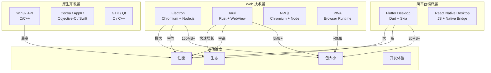
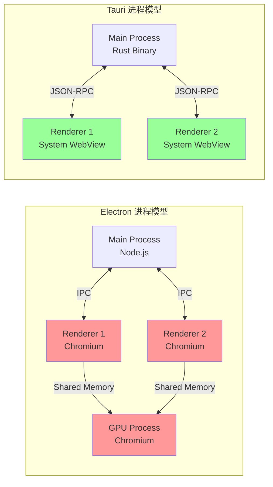

# 桌面开发基础：从原生到跨平台

## 引言

桌面应用程序的开发范式在过去十年经历了根本性的转变。从传统的原生 Win32 API、macOS Cocoa 和 Linux GTK 开发，到基于 Web 技术的跨平台框架（Electron、Tauri），再到使用单一代码库编译为多平台原生代码的方案（Flutter Desktop、React Native Desktop），开发者面对的选择空前丰富。每种方案都在"性能"、"开发效率"、"生态成熟度"和"平台一致性"之间做出了不同的权衡。

对于 JavaScript/TypeScript 生态的开发者而言，桌面开发既是机遇也是挑战：机遇在于可以使用熟悉的前端技术栈（HTML/CSS/JS/TS）构建功能完整的桌面应用；挑战在于需要理解底层操作系统机制、进程模型、IPC 通信和原生 API 集成，才能构建出真正高质量的生产级应用。

本文从理论层面建立桌面应用的形式化分类框架，剖析进程模型、窗口管理、操作系统 API 抽象和沙盒安全模型的核心原理。在工程实践层面，我们将逐一分析 Electron、Tauri、Flutter Desktop 和 React Native Desktop 的架构设计、渲染模型和开发工作流，并探讨自动更新、代码签名和 CI/CD 等生产环境必需的基础设施。

---

## 理论严格表述

### 2.1 桌面应用的形式化分类

桌面应用可根据技术栈与平台耦合度，形式化地分为四个层次：

**定义 2.1（原生应用，Native Application）**
直接使用操作系统提供的原生 API 和 UI 框架开发的应用程序。形式化地，原生应用 `A_native` 与平台 `P` 的耦合度为完全耦合：
`A_native = f_P(API_P)`
其中 `API_P` 是平台 `P` 提供的完整 API 集合（Win32/WinRT、Cocoa/AppKit、GTK/Qt）。

**定义 2.2（混合应用，Hybrid Application）**
使用 Web 技术（HTML/CSS/JS）构建 UI，通过 WebView 容器嵌入原生外壳的应用。形式化地：
`A_hybrid = WebView_P × JS_Bridge × Native_Shell_P`
其中 `WebView_P` 是平台 `P` 的 Web 渲染引擎，`JS_Bridge` 是 JavaScript 与原生代码的通信桥梁。

**定义 2.3（PWA，Progressive Web App）**
基于标准 Web 技术，通过浏览器或系统级 Web 运行时提供类原生体验的应用。PWA 的形式化特征包括：Service Worker 离线能力、Web App Manifest 安装元数据、以及 Push Notification 等原生功能绑定。

**定义 2.4（跨平台框架应用）**
使用抽象层将统一 API 映射到多个平台原生实现的桌面应用。形式化地：
`A_cross = Framework(Write-Once) → {Compile_to_P₁, Compile_to_P₂, ..., Compile_to_Pₙ}`
其中框架负责将高级抽象翻译为各平台的原生调用（如 Flutter 的 Skia 渲染、React Native 的原生组件桥接）。

| 类型 | 代表技术 | 开发语言 | UI 渲染 | 性能 | 包大小 |
|------|---------|---------|--------|------|--------|
| 原生 | Win32, Cocoa, GTK | C/C++, Swift, Rust | 平台原生渲染 | 最高 | 最小 |
| 混合 | Electron, Tauri, NW.js | JS/TS | Chromium / WebView | 中等 | 大(Chromium) / 小(WebView) |
| PWA | Chrome PWA, Edge PWA | JS/TS | 浏览器引擎 | 中等 | 无（通过浏览器运行） |
| 跨平台编译 | Flutter, React Native | Dart, JS/TS | Skia / 原生组件桥接 | 高 | 中等 |

### 2.2 进程模型理论

现代桌面应用普遍采用**多进程架构（Multi-Process Architecture）**，其核心动机是隔离性、稳定性和安全性。

**定义 2.5（主进程，Main Process）**
主进程是桌面应用的入口点，负责创建和管理窗口、处理系统事件、执行原生 API 调用、管理应用生命周期。在 Electron 中，主进程是 Node.js 环境；在 Tauri 中，主进程是 Rust 二进制；在 Flutter 中，主进程是 Dart VM 的宿主。

**定义 2.6（渲染进程，Renderer Process）**
渲染进程负责解析和渲染 HTML/CSS（混合应用）或执行 UI 绘制指令（跨平台框架）。每个窗口通常对应独立的渲染进程，崩溃不会影响其他窗口。

**形式化进程模型**：
设桌面应用 `A` 的进程集合为 `Proc(A) = {main, renderer₁, renderer₂, ..., rendererₙ, utility₁, ...}`。

- **Electron**：`Proc_Electron = {main(Node.js), renderer₁(Chromium), renderer₂(Chromium), ..., GPU(Chromium)}`
  - 主进程：Node.js + Chromium 嵌入层（`libchromiumcontent`）
  - 渲染进程：完整的 Chromium 渲染引擎（Blink + V8）
  - 每个 `BrowserWindow` 创建独立的渲染进程

- **Tauri**：`Proc_Tauri = {main(Rust), renderer₁(system WebView), renderer₂(system WebView)}`
  - 主进程：Rust 二进制，通过 `wry` 库创建系统 WebView
  - 渲染进程：平台原生 WebView（Windows: WebView2, macOS: WKWebView, Linux: WebKitGTK）

- **Flutter Desktop**：`Proc_Flutter = {main(Dart VM + Flutter Engine), GPU}`
  - 单进程模型（默认）：Dart 代码和渲染在同一进程
  - 通过 Flutter Engine 的 Embedder API 与平台集成

**2.2.1 IPC 通信模型**

由于渲染进程与主进程运行在独立的地址空间，它们必须通过**进程间通信（Inter-Process Communication, IPC）**交换数据。

**定义 2.7（IPC 通道）**
IPC 通道 `C` 是进程间传递消息的抽象管道，形式化为：
`C: Proc₁ × Message → Proc₂`

常见的 IPC 机制包括：

| 机制 | 实现方式 | 延迟 | 吞吐量 | 适用场景 |
|------|---------|------|--------|---------|
| **消息传递（Message Passing）** | 命名管道 / Unix Domain Socket | 低 | 中 | 频繁小消息（Electron IPC） |
| **共享内存（Shared Memory）** | 内存映射文件 | 极低 | 高 | 大数据传输（视频帧、文件） |
| **RPC（Remote Procedure Call）** | gRPC / JSON-RPC | 中 | 中 | 结构化 API 调用（Tauri Commands） |

**Electron IPC 模型**：
Electron 实现了基于 Chromium IPC 管道的**异步消息传递**和**同步消息传递**：

- `ipcRenderer.send(channel, data)`：异步发送，无返回值；
- `ipcRenderer.invoke(channel, data)`：异步调用，返回 Promise；
- `ipcRenderer.sendSync(channel, data)`：同步调用（阻塞渲染进程，不推荐）。

底层实现使用 Chromium 的 `Mojo` IPC 系统或命名管道，消息序列化为 JSON 或二进制格式传输。

**Tauri IPC 模型**：
Tauri 使用基于 JSON-RPC 的 **Command 系统**：前端通过 `invoke('command_name', payload)` 调用 Rust 后端函数。底层使用 WebView 的脚本注入机制（`window.__TAURI__` 对象）和 Rust 的异步运行时（Tokio）实现通信。

### 2.3 窗口管理理论

**定义 2.8（窗口模型）**
桌面应用的窗口模型定义了应用与操作系统窗口管理器的交互方式。主要模式包括：

**单窗口模型（Single Document Interface, SDI）**
应用只有一个主窗口，所有内容在该窗口内呈现。形式化地：`Windows(A) = {w_main}`。

**多窗口模型（Multiple Document Interface / Multi-Window）**
应用可同时打开多个独立窗口。形式化地：`Windows(A) = {w₁, w₂, ..., wₙ}`。

- 每个窗口可有独立的渲染进程（Electron）；
- 窗口间通信需通过主进程中转。

**无窗口模型（Tray / Headless）**
应用没有可见窗口，仅以系统托盘图标或后台服务形式存在。形式化地：`Windows(A) = ∅`。

**窗口生命周期状态机**：

```
[Created] --show--> [Visible]
[Visible] --minimize--> [Minimized]
[Minimized] --restore--> [Visible]
[Visible] --hide--> [Hidden]
[Hidden] --show--> [Visible]
[Any State] --close--> [Destroyed]
```

### 2.4 操作系统 API 抽象层

跨平台桌面框架必须将各操作系统的异构 API 抽象为统一的接口层。

**Windows API 栈**：

- **Win32**：最底层的 C API，提供窗口、消息、文件、进程等核心功能；
- **WinRT / UWP**：现代 Windows API，基于 COM 的面向对象接口；
- **Windows App SDK**：WinUI 3 的运行时，是微软推荐的现代桌面开发路径。

**macOS API 栈**：

- **Cocoa / AppKit**：Objective-C/Swift 框架，提供 NSWindow、NSView、NSApplication 等核心类；
- **Foundation**：基础服务（字符串、集合、I/O、网络）；
- **AVFoundation / Core * 系列**：多媒体、图形、定位等专用框架。

**Linux API 栈**：

- **GTK（GIMP Toolkit）**：GNOME 桌面环境的基础，C 语言绑定；
- **Qt**：跨平台 C++ 框架，提供完整的 UI 和应用基础设施；
- **Wayland / X11**：显示服务器协议，负责窗口合成和输入事件分发。

**跨平台框架的抽象策略**：

- **Electron/Tauri**：不直接抽象原生 UI，而是提供 WebView + JS Bridge。原生功能通过预定义 API（文件对话框、通知、剪贴板）暴露，底层在各平台调用对应原生 API；
- **Flutter**：通过 Embedder API 将 Skia 渲染指令转换为平台窗口和事件循环，同时提供 `dart:io` 和插件系统访问原生功能；
- **React Native Desktop**：通过 "Bridge" 将 JavaScript 调用序列化为消息，发送到原生端执行对应平台代码。

### 2.5 沙盒安全模型

桌面应用的沙盒（Sandbox）限制了进程对系统资源的访问权限，是防止恶意代码或漏洞利用的关键机制。

**Chromium 沙盒模型**：
Electron 继承了 Chromium 的多层沙盒架构：

1. **渲染进程沙盒**：通过操作系统提供的机制（Windows ACL、macOS Seatbelt、Linux namespaces/seccomp）限制渲染进程的系统调用；
2. **站点隔离（Site Isolation）**：每个站点运行在独立的渲染进程中，防止跨站脚本攻击；
3. **上下文隔离（Context Isolation）**：JavaScript 上下文与页面上下文分离（详见下一章）。

**Tauri 的安全模型**：
Tauri 采用"能力（Capability）"模型定义前端可访问的 Rust 命令：

```json
{
  "permissions": [
    "fs:allow-read",
    "fs:allow-write",
    "dialog:allow-open"
  ]
}
```

前端只能调用白名单中声明的 Rust 命令，且 Rust 的所有权系统提供了内存安全保证。

### 2.6 应用打包与分发的理论

桌面应用的分发涉及多个形式化阶段：

**构建阶段（Build）**：
`Build: SourceCode × TargetPlatform → BinaryArtifacts`

- 编译源代码为平台特定的可执行文件；
- 打包资源文件（HTML、CSS、图片、字体）；
- 链接运行时依赖（Chromium、WebView2、Flutter Engine）。

**签名阶段（Code Signing）**：
`Sign: BinaryArtifacts × Certificate → SignedArtifacts`

- 使用数字证书对可执行文件和安装包签名；
- 保证软件来源可信，防止篡改；
- 未签名的应用在 macOS 和 Windows 上会触发安全警告。

**公证阶段（Notarization，macOS 特有）**：
`Notarize: SignedArtifacts × AppleID → NotarizedArtifacts`

- 将应用上传到 Apple 服务器进行自动化恶意软件扫描；
- 通过后在应用中添加公证凭证（Ticket）；
- macOS 10.15+ 强制要求公证，否则无法运行。

**分发阶段（Distribution）**：
`Distribute: SignedArtifacts → {AppStore, DMG, MSI, NSIS, Portable}`

- **macOS**：App Store（沙盒限制多）、DMG（磁盘映像，用户拖拽安装）；
- **Windows**：MSI（Windows Installer）、NSIS（Nullsoft Scriptable Install System）、Portable（免安装 ZIP）；
- **Linux**：AppImage（单文件可执行）、Snap（Ubuntu 商店）、Flatpak（跨发行版）、DEB/RPM（包管理器）。

---

## 工程实践映射

### 3.1 Electron 的架构

Electron 由 GitHub 于 2013 年创建，是 Web 技术桌面化最成功的框架。其核心架构可概括为：**Chromium（渲染）+ Node.js（主进程）+ Native APIs（桥接）**。

**架构层次**：

```
┌─────────────────────────────────────────┐
│           Application Layer             │
│  ┌──────────┐  ┌──────────┐            │
│  │ Renderer │  │ Renderer │  ...       │
│  │ (Chromium│  │ (Chromium│            │
│  │  + Web APIs)│  + Web APIs)│         │
│  └────┬─────┘  └────┬─────┘            │
│       │ IPC         │ IPC               │
├───────┼─────────────┼───────────────────┤
│       ▼             ▼                   │
│  ┌─────────────────────────────────┐   │
│  │         Main Process            │   │
│  │  (Node.js + Electron Native APIs)│   │
│  │  - 文件系统、网络、通知           │   │
│  │  - 窗口管理、菜单、对话框         │   │
│  └─────────────────────────────────┘   │
└─────────────────────────────────────────┘
```

**主进程核心代码示例**：

```typescript
import { app, BrowserWindow, ipcMain, dialog } from 'electron'
import path from 'path'

let mainWindow: BrowserWindow | null

function createWindow() {
  mainWindow = new BrowserWindow({
    width: 1200,
    height: 800,
    webPreferences: {
      preload: path.join(__dirname, 'preload.js'),
      contextIsolation: true,      // 启用上下文隔离
      nodeIntegration: false,      // 禁用渲染进程 Node.js 集成
      sandbox: true,               // 启用沙盒
    }
  })

  mainWindow.loadURL('http://localhost:5173')
}

// IPC 处理：打开文件对话框
ipcMain.handle('dialog:openFile', async () => {
  const result = await dialog.showOpenDialog(mainWindow!, {
    properties: ['openFile'],
    filters: [{ name: 'Images', extensions: ['jpg', 'png', 'gif'] }]
  })
  return result.filePaths
})

app.whenReady().then(createWindow)
```

**预加载脚本（Preload Script）**：

```typescript
// preload.ts
import { contextBridge, ipcRenderer } from 'electron'

contextBridge.exposeInMainWorld('electronAPI', {
  openFile: () => ipcRenderer.invoke('dialog:openFile'),
  onUpdateMessage: (callback: (msg: string) => void) =>
    ipcRenderer.on('update-message', (_event, value) => callback(value))
})
```

**渲染进程中使用**：

```typescript
// renderer.ts
// `window.electronAPI` 由 preload 脚本注入
const filePath = await window.electronAPI.openFile()
console.log('Selected file:', filePath)
```

**Electron 的关键配置（安全最佳实践）**：

- `contextIsolation: true`：预加载脚本与页面 JavaScript 运行在不同上下文，防止原型污染攻击；
- `nodeIntegration: false`：禁止渲染进程直接访问 Node.js API，所有原生功能通过 IPC 调用主进程；
- `sandbox: true`：启用 Chromium 渲染进程沙盒；
- `allowRunningInsecureContent: false`：禁止 HTTPS 页面加载 HTTP 内容。

### 3.2 Tauri 的架构

Tauri 是 2020 年后兴起的 Electron 替代方案，采用 **Rust 后端 + 系统 WebView 前端** 的架构，目标是在保持 Web 技术栈开发体验的同时，大幅减小包体积和提升安全性。

**架构层次**：

```
┌─────────────────────────────────────────┐
│           Application Layer             │
│  ┌──────────┐  ┌──────────┐            │
│  │  WebView │  │  WebView │  ...       │
│  │ (System  │  │ (System  │            │
│  │  WebView)│  │  WebView)│            │
│  └────┬─────┘  └────┬─────┘            │
│       │ invoke      │ invoke           │
├───────┼─────────────┼───────────────────┤
│       ▼             ▼                   │
│  ┌─────────────────────────────────┐   │
│  │         Rust Core (Tauri)       │   │
│  │  - Commands (RPC over JSON)     │   │
│  │  - State Management             │   │
│  │  - Event System                 │   │
│  │  - Plugin System                │   │
│  └─────────────────────────────────┘   │
│  ┌─────────────────────────────────┐   │
│  │    OS Abstraction (tao / wry)   │   │
│  │  - Window Management (tao)      │   │
│  │  - WebView Control (wry)        │   │
│  └─────────────────────────────────┘   │
└─────────────────────────────────────────┘
```

**Tauri 的核心组件**：

- **tao**：跨平台窗口创建库，抽象了 Windows/macOS/Linux 的窗口事件循环；
- **wry**：跨平台 WebView 控制库，在各平台使用原生 WebView 实现（WebView2 / WKWebView / WebKitGTK）；
- **Tauri Runtime**：提供 Command 系统、State Management、Event System 和 Plugin API。

**Tauri Command 示例**：

```rust
// src-tauri/src/main.rs
use tauri::{Manager, State};
use std::sync::Mutex;

// 应用状态
struct AppState {
    counter: Mutex<i32>,
}

// Command：可被前端调用的 Rust 函数
#[tauri::command]
fn greet(name: &str) -> String {
    format!("Hello, {}! You've been greeted from Rust.", name)
}

#[tauri::command]
fn increment_counter(state: State<AppState>) -> i32 {
    let mut counter = state.counter.lock().unwrap();
    *counter += 1;
    *counter
}

fn main() {
    tauri::Builder::default()
        .manage(AppState { counter: Mutex::new(0) })
        .invoke_handler(tauri::generate_handler![greet, increment_counter])
        .run(tauri::generate_context!())
        .expect("error while running tauri application");
}
```

**前端调用**：

```typescript
import { invoke } from '@tauri-apps/api/core'

const message = await invoke('greet', { name: 'World' })
console.log(message)  // "Hello, World! You've been greeted from Rust."

const count = await invoke('increment_counter')
console.log(count)    // 1
```

### 3.3 Flutter Desktop 的渲染模型

Flutter 由 Google 开发，使用 Dart 语言和自绘渲染引擎 Skia（Impeller 在新版本中逐步替代），在不同平台上提供像素级一致的 UI。

**渲染管线**：

```
Dart 代码（Widget Tree）
    ↓
Flutter Framework（Element Tree / Render Tree）
    ↓
Flutter Engine（Skia/Impeller 绘制指令）
    ↓
Platform Embedder（平台窗口 + 表面）
    ↓
GPU（OpenGL / Metal / Vulkan / DirectX）
```

**Flutter Desktop 的架构特点**：

- **自绘引擎**：不依赖平台原生组件，所有 UI 由 Flutter Engine 绘制，确保跨平台一致性；
- **平台通道（Platform Channel）**：Dart 代码通过 MethodChannel 与平台原生代码通信，访问系统功能；
- **单一代码库**：一套 Dart 代码编译为 Windows（.exe）、macOS（.app）和 Linux 可执行文件。

**与 JS/TS 生态的关联**：虽然 Flutter 使用 Dart 而非 JavaScript，但 Flutter Desktop 对 JS/TS 开发者仍具参考价值——特别是其自绘渲染架构和平台通道设计，代表了跨平台框架的另一条技术路径。

### 3.4 React Native Desktop

React Native 最初为移动应用开发设计，通过社区扩展支持了桌面平台：

- **react-native-windows**：微软官方维护，支持 Windows 10/11 的 UWP 和 Win32 应用；
- **react-native-macos**：基于 react-native-windows 的分支，支持 macOS 应用；
- **react-native-web + Electron/Tauri**：间接的桌面支持路径。

**架构特点**：
React Native Desktop 保留了移动版的"Bridge"架构——JavaScript 代码通过序列化消息与原生端通信，原生端创建和管理真实的平台 UI 组件（`View` → `UIView`/`Panel`，`Text` → `UILabel`/`TextBlock`）。

**适用场景**：已有 React Native 移动应用代码库，希望扩展桌面端的团队。对于从零开始的桌面项目，Electron 或 Tauri 通常是更成熟的选择。

### 3.5 NW.js vs Electron 的对比

NW.js（原 node-webkit）是与 Electron 最相似的框架，两者常被比较：

| 维度 | Electron | NW.js |
|------|---------|-------|
| 进程模型 | 主进程 + 渲染进程分离 | 单进程或混合进程 |
| Node.js 集成 | 仅主进程 | 所有渲染进程均可直接访问 |
| 包大小 | 较大（含完整 Chromium） | 较大（含完整 Chromium） |
| 上下文隔离 | 原生支持 | 需手动配置 |
| 社区生态 | 极大（VS Code、Slack、Discord） | 较小 |
| 安全模型 | 更严格（分离进程 + 沙盒） | 较宽松 |

Electron 在安全性设计和生态成熟度上全面领先 NW.js，是当前 Web 技术桌面化的默认选择。

### 3.6 桌面应用的自动更新

自动更新是现代桌面应用的标配功能，其形式化流程为：
`CheckUpdate → Download → Verify → Install → Restart`

**Electron Auto Updater**：
Electron 提供 `autoUpdater` 模块，支持两种更新机制：

- **Squirrel（Windows）**：通过 Squirrel.Windows 框架实现后台更新；
- **Squirrel.Mac**：macOS 的自动更新框架。

通常需要配合更新服务器使用（如 nuts、electron-release-server、或私有 S3 存储桶）。

```typescript
import { autoUpdater } from 'electron-updater'

autoUpdater.checkForUpdatesAndNotify()

autoUpdater.on('update-available', () => {
  dialog.showMessageBox({
    type: 'info',
    title: 'Update available',
    message: 'A new version is available. It will be downloaded in the background.',
  })
})

autoUpdater.on('update-downloaded', () => {
  autoUpdater.quitAndInstall()
})
```

**Tauri Updater**：
Tauri 提供内置的更新器，通过 JSON 端点检查更新：

```json
{
  "version": "v1.2.0",
  "notes": "Bug fixes and performance improvements",
  "pub_date": "2024-01-15T12:00:00Z",
  "signature": "...",
  "url": "https://releases.example.com/app-v1.2.0.zip"
}
```

Tauri 的更新包使用 Ed25519 签名验证，安全性高于 Electron 的默认配置。

### 3.7 代码签名与公证

**Windows 代码签名**：

- **标准代码签名证书**：由 DigiCert、Sectigo 等 CA 颁发，签名后 SmartScreen 警告逐渐减少；
- **EV（Extended Validation）证书**：需要组织身份验证，签名后可立即消除 SmartScreen 警告，是商业软件的标准选择；
- **Azure Code Signing**：微软提供的托管签名服务，通过 Azure Key Vault 管理证书。

签名流程（使用 `signtool`）：

```powershell
signtool sign /f certificate.pfx /p password /tr http://timestamp.digicert.com /td sha256 /fd sha256 MyApp.exe
```

**macOS 代码签名与公证**：

1. 使用 Apple Developer ID 证书对应用签名；
2. 将应用打包为 `.zip` 或 `.dmg`；
3. 使用 `altool` 或 `notarytool` 上传到 Apple 公证服务；
4. 公证通过后，将凭证附加到应用中（"Staple"）；
5. 分发 `.dmg` 或提交 Mac App Store。

```bash
# 签名
 codesign --deep --force --verify --verbose --sign "Developer ID Application: Your Name" MyApp.app

# 公证
 xcrun notarytool submit MyApp.dmg --apple-id your@email.com --team-id TEAMID --wait

# 附加凭证
 xcrun stapler staple MyApp.dmg
```

### 3.8 桌面应用的 CI/CD

桌面应用的多平台构建是 CI/CD 的主要挑战。GitHub Actions 提供了免费的 macOS、Windows 和 Linux 运行器，是桌面应用 CI/CD 的首选平台。

**GitHub Actions 多平台构建示例**：

```yaml
name: Build and Release

on:
  push:
    tags:
      - 'v*'

jobs:
  build:
    strategy:
      matrix:
        os: [ubuntu-latest, windows-latest, macos-latest]
    runs-on: ${{ matrix.os }}

    steps:
      - uses: actions/checkout@v4

      - name: Setup Node.js
        uses: actions/setup-node@v4
        with:
          node-version: '20'

      - name: Setup Rust (for Tauri)
        if: matrix.os != 'ubuntu-latest' || true
        uses: dtolnay/rust-action@stable

      - name: Install dependencies
        run: npm ci

      - name: Build Tauri App
        run: npm run tauri build
        env:
          TAURI_SIGNING_PRIVATE_KEY: ${{ secrets.TAURI_SIGNING_PRIVATE_KEY }}

      - name: Upload artifacts
        uses: actions/upload-artifact@v4
        with:
          name: app-${{ matrix.os }}
          path: |
            src-tauri/target/release/bundle/**/*.msi
            src-tauri/target/release/bundle/**/*.dmg
            src-tauri/target/release/bundle/**/*.AppImage
```

**关键实践**：

- **签名密钥管理**：将代码签名证书和私钥存储在 GitHub Secrets 中，构建时注入；
- **版本自动化**：使用 `semantic-release` 或 `changesets` 自动根据提交信息生成版本号和变更日志；
- **更新服务器**：使用 S3 + CloudFront 或 GitHub Releases 作为更新包分发源；
- **测试矩阵**：在每个目标平台上运行端到端测试（使用 Playwright 或 Spectron）。

---

## Mermaid 图表

### 桌面应用技术栈分类与演进



### Electron 与 Tauri 进程模型对比



---

## 理论要点总结

1. **桌面应用的形式化分类基于平台耦合度**：原生应用耦合度最高、性能最优；混合应用通过 WebView 实现跨平台，牺牲了部分性能换取开发效率；跨平台编译框架（Flutter、React Native）试图在两者之间找到平衡。

2. **多进程架构是现代桌面应用的安全基石**：主进程负责系统交互，渲染进程负责 UI 展示，两者通过 IPC 通信。这种隔离防止了 UI 层面的漏洞直接影响系统资源。

3. **IPC 机制的选择决定了通信效率**：消息传递适合控制指令，共享内存适合大数据传输，RPC 适合结构化 API 调用。Electron 的 IPC 基于 Chromium Mojo，Tauri 的 Command 基于 JSON-RPC。

4. **沙盒安全模型是防御纵深的关键**：Chromium 的沙盒限制了渲染进程的系统调用能力，Tauri 的能力（Capability）模型限制了前端可调用的 Rust 命令范围。

5. **自动更新、代码签名和 CI/CD 是生产级桌面应用的标配**：缺少自动更新意味着用户长期运行在旧版本上；缺少代码签名意味着安全警告和用户信任缺失；缺少多平台 CI/CD 意味着发布流程不可持续。

6. **包大小和启动速度是用户留存的关键指标**：Tauri 凭借系统 WebView 实现了 5MB+ 的包体积，相比 Electron 的 150MB+ 具有显著优势，这在下载转化率敏感的场景中至关重要。

---

## 参考资源

1. Electron 官方文档. "Architecture Overview." <https://www.electronjs.org/docs/latest/tutorial/architecture> —— Electron 官方架构文档，详细解释了主进程与渲染进程的分离、Chromium 和 Node.js 的集成方式，以及上下文隔离的安全设计。

2. Tauri 官方文档. "Architecture." <https://tauri.app/start/architecture/> —— Tauri 架构文档，涵盖 tao/wry 抽象层、Command 系统、权限模型和插件系统的设计原理。

3. Flutter 官方文档. "Desktop Support." <https://docs.flutter.dev/desktop> —— Flutter 桌面支持的完整文档，包括平台嵌入器、平台通道、构建配置和分发指南。

4. Microsoft 官方文档. "React Native for Windows + macOS." <https://microsoft.github.io/react-native-windows/> —— react-native-windows 和 react-native-macos 的官方文档，涵盖组件映射、原生模块开发和 Windows 特定 API 集成。

5. Chromium 官方文档. "Sandbox Design." <https://chromium.googlesource.com/chromium/src/+/HEAD/docs/design/sandbox.md> —— Chromium 多进程沙盒的深层技术文档，解释了 Windows ACL、macOS Seatbelt 和 Linux namespaces/seccomp 的具体实现机制。
