# Electron vs Tauri：跨平台桌面方案深度对比

## 引言

在 JavaScript/TypeScript 生态的桌面开发领域，Electron 长期以来是无可争议的霸主。VS Code、Slack、Discord、Figma、Notion 等知名应用均基于 Electron 构建，证明了 Web 技术栈桌面化的可行性和强大生态。然而，Electron 的批评者同样声音洪亮：150MB+ 的包体积、较高的内存占用、以及由 Chromium 和 Node.js 带来的庞大攻击面，使得 Electron 在资源敏感和安全敏感的场景中备受质疑。

Tauri 的出现为这一领域带来了新的可能性。作为使用 Rust 后端和系统 WebView 前端的轻量级框架，Tauri 在包大小（5MB+）、启动速度和安全性上展现出显著优势。GitButler、Loop 等新兴应用选择 Tauri 作为其技术底座，标志着桌面开发格局正在发生微妙但重要的变化。

本文建立一个形式化的评估模型，从性能、安全性、包大小、启动速度、内存占用、开发体验和生态成熟度七个维度对 Electron 和 Tauri 进行系统性对比。在理论层面，我们将深入剖析进程隔离模型、WebView 渲染引擎差异和 Rust 所有权系统的形式化安全保证；在工程层面，我们将对比两者的 API 设计、迁移路径和实际项目案例，为技术选型提供数据驱动的决策依据。

---

## 理论严格表述

### 2.1 跨平台框架的形式化评估模型

为系统评估跨平台桌面框架，我们建立七维评估空间 `F = (P, S, Sz, St, M, D, E)`：

| 维度 | 符号 | 定义 | 度量方式 |
|------|------|------|---------|
| 性能 | `P` | 运行时计算和渲染性能 | 帧率、CPU 占用、响应延迟 |
| 安全性 | `S` | 抵御攻击和漏洞的能力 | CVE 数量、沙盒强度、内存安全 |
| 包大小 | `Sz` | 分发包体积 | 压缩后的安装包大小（MB） |
| 启动速度 | `St` | 从点击到可交互的时间 | 冷启动时间（ms） |
| 内存占用 | `M` | 运行时的内存消耗 | RSS/Heap 峰值（MB） |
| 开发体验 | `D` | 开发效率和工具链完善度 | 热更新速度、调试能力、文档质量 |
| 生态成熟度 | `E` | 社区规模、插件数量和第三方支持 | GitHub Stars、npm 下载量、插件市场 |

对于两个框架 `A` 和 `B`，定义偏序关系 `A ≽ B` 当且仅当 `A` 在多数维度上优于 `B`，且没有维度显著劣于 `B`。

### 2.2 进程隔离的理论

**定义 2.1（进程隔离）**
进程隔离是将应用程序的不同组件运行在独立的操作系统进程中，通过地址空间隔离和权限限制防止组件间的相互影响。形式化地，设进程集合 `Π = {π₁, π₂, ..., πₙ}`，进程隔离要求：
`∀πᵢ, πⱼ ∈ Π, i ≠ j: AddressSpace(πᵢ) ∩ AddressSpace(πⱼ) = ∅`

**2.2.1 Electron 的多进程模型**

Electron 继承了 Chromium 的**多进程架构（Multi-Process Architecture, MPA）**：

`Proc_Electron = {browser, renderer₁, renderer₂, ..., rendererₙ, gpu, utility}`

- **Browser Process（主进程）**：Node.js 运行时，管理窗口生命周期、执行原生 API 调用；
- **Renderer Process**：每个 `BrowserWindow` 对应一个独立的 Chromium 渲染进程（Blink + V8），负责 HTML/CSS/JS 的解析和执行；
- **GPU Process**：处理 GPU 相关的渲染任务（合成、WebGL）；
- **Utility Process**：网络服务、音频服务等辅助进程。

**隔离强度**：渲染进程运行在 Chromium 沙盒中，限制了对操作系统 API 的访问。然而，由于历史原因，Electron 的渲染进程默认可访问完整的 Node.js API（若 `nodeIntegration: true`），这实质上破坏了渲染进程的隔离性。现代 Electron 应用通过 `contextIsolation: true` 和 `nodeIntegration: false` 恢复隔离。

**2.2.2 Tauri 的多线程模型**

Tauri 采用**多线程而非多进程**的架构（默认配置）：

`Thread_Tauri = {main, webview₁, webview₂, ..., worker₁, ...}`

- **Main Thread**：Rust 二进制的主线程，运行事件循环和 Command 处理；
- **WebView Threads**：系统 WebView 运行在独立的线程中（由操作系统 WebView 实现决定，可能实际是独立进程）；
- **Worker Threads**：通过 Rust 的线程池（Tokio Runtime）处理异步任务。

Tauri 的隔离性来自两个层面：

1. **前端与后端的通信隔离**：前端只能通过预定义的 JSON-RPC 接口调用 Rust Command，无法直接访问系统 API；
2. **Rust 的内存安全保证**：Rust 的所有权系统（Ownership System）在编译时防止了数据竞争和内存泄漏。

**对比分析**：

| 特性 | Electron | Tauri |
|------|---------|-------|
| 隔离粒度 | 进程级（强） | 通信协议 + 语言级（中强） |
| 渲染崩溃影响 | 仅影响单个窗口 | 取决于 WebView 实现 |
| 内存开销 | 每个渲染进程独立 V8 堆 | 共享 Rust 进程内存 |
| 通信延迟 | IPC 序列化/反序列化 | JSON-RPC 序列化/反序列化 |

### 2.3 WebView 渲染引擎的差异

桌面应用中的 WebView 是嵌入操作系统或应用内部的浏览器引擎，负责解析和渲染 HTML/CSS/JS。

**定义 2.2（WebView 引擎）**
WebView 引擎 `W` 是一个三元组 `W = (Parser, LayoutEngine, JSRuntime)`，分别对应文档解析器、布局引擎和 JavaScript 运行时。

**2.3.1 Electron 的 Chromium 引擎**

Electron 将完整的 Chromium 浏览器内核嵌入应用：

`W_Electron = Chromium_full = (Blink, V8, Skia, ...)`

这意味着每个 Electron 应用都携带了完整的 Chromium 二进制文件（约 100-150MB），包括：

- **Blink**：Web 内容渲染引擎（HTML/CSS 解析、布局、绘制）；
- **V8**：JavaScript 引擎（JIT 编译、垃圾回收）；
- **Skia**：2D 图形库；
- **网络栈**：HTTP/2、QUIC、TLS、DNS；
- **多媒体栈**：音视频编解码器、WebRTC。

**优势**：

- 渲染行为与 Chrome 完全一致，无需考虑平台差异；
- 支持最新的 Web 标准（WebGPU、Container Queries、View Transitions 等）；
- V8 的 JIT 编译提供极高的 JavaScript 执行性能。

**劣势**：

- 包体积巨大（最小约 80MB，实际应用通常 150MB+）；
- 内存占用高（每个渲染进程独立的 V8 堆，通常 50-100MB/窗口）；
- 安全更新依赖 Electron 版本升级（Chromium 漏洞修复需等待 Electron 发布新版本）。

**2.3.2 Tauri 的系统 WebView**

Tauri 使用操作系统提供的原生 WebView：

`W_Tauri = Platform_WebView = {WebView2(Windows), WKWebView(macOS), WebKitGTK(Linux)}`

- **Windows**：Microsoft Edge WebView2，基于与 Edge 浏览器相同的 Chromium 引擎；
- **macOS**：WKWebView，基于 Safari 的 WebKit 引擎（JavaScriptCore）；
- **Linux**：WebKitGTK，基于开源 WebKit 引擎。

**优势**：

- 包体积极小（Rust 二进制 + WebView 绑定层，通常 3-10MB）；
- 内存占用低（复用系统 WebView 进程，无独立 Chromium 实例）；
- 安全更新由操作系统负责（WebView2 随 Edge 自动更新，WKWebView 随 macOS 更新）。

**劣势**：

- 各平台 WebView 的行为存在差异（CSS 渲染、JavaScript API 支持度），需要跨平台测试；
- Windows 7/8 不支持 WebView2（需要 Edge 运行时）；
- Web 标准支持滞后于最新 Chromium（特别是实验性 API）。

**渲染一致性对比**：

| 特性 | Electron (Chromium) | Tauri (System WebView) |
|------|---------------------|------------------------|
| CSS 渲染一致性 | 跨平台一致 | Windows/macOS 可能有差异 |
| ES2023 支持 | 完整 | 基本完整（WebKit 略有滞后） |
| WebGPU | 支持 | WebView2 支持，WKWebView 有限 |
| WebRTC | 完整支持 | 平台依赖 |
| CSS Container Queries | 支持 | macOS 较新版本支持 |

### 2.4 内存安全的形式化

**定义 2.3（内存安全）**
程序是内存安全的，当且仅当在程序执行的任何时刻，所有内存访问都指向有效且已分配的内存区域，且不会发生数据竞争（Data Race）。

**2.4.1 Rust 的所有权系统**

Rust 通过**所有权（Ownership）**、**借用（Borrowing）**和**生命周期（Lifetimes）**三个机制，在编译时保证内存安全，无需垃圾回收器（GC）。

**所有权规则**：

1. 每个值有且只有一个所有者（Owner）；
2. 当所有者离开作用域，值被自动释放；
3. 所有权可以通过移动（Move）转移，但不能共享可变引用。

**形式化表述**：设变量 `x` 拥有值 `v`（记为 `owns(x, v)`）。则：

- `let y = x` 触发 Move：`owns(x, v) → ¬owns(x, v) ∧ owns(y, v)`；
- `let y = &x` 创建不可变借用：`owns(x, v) ∧ borrows(y, x, Immutable)`；
- `let y = &mut x` 创建可变借用：`owns(x, v) ∧ borrows(y, x, Mutable)`，此时禁止其他借用。

Rust 编译器通过**借用检查器（Borrow Checker）**在编译时验证这些规则，将内存错误（Use-After-Free、Double-Free、Data Race）转化为编译错误。

**2.4.2 C++ 的手动内存管理**

Chromium（以及 Electron 的底层）主要使用 C++ 编写。C++ 不提供内存安全保证，依赖开发者手动管理内存（`new`/`delete`、智能指针）和遵守编码规范。

Chromium 使用 **Mojo** IPC 系统和 **base::RefCounted** 引用计数来缓解内存问题，但仍无法完全避免：

- **Use-After-Free**：70% 的 Chrome 高危漏洞与 UAF 相关；
- **缓冲区溢出**：C/C++ 数组越界访问；
- **类型混淆（Type Confusion）**：V8 引擎中的对象类型错误。

**CVE 统计对比**：

根据 NVD（National Vulnerability Database）统计（截至 2024 年）：

- **Electron 相关 CVE**：累计超过 200 个，其中高危（Critical/High）占比约 60%。大多数漏洞源于 Chromium 或 Node.js 的底层组件；
- **Tauri 相关 CVE**：累计少于 10 个。Rust 的内存安全保证大幅减少了内存相关漏洞的攻击面。

---

## 工程实践映射

### 3.1 Electron 的上下文隔离

**Context Isolation（上下文隔离）**是 Electron 最重要的安全机制之一，自 Electron 12 起成为默认配置。

**原理**：在启用了上下文隔离的渲染进程中，存在两个独立的 JavaScript 上下文：

1. **页面上下文（Page Context）**：运行 Web 页面的 JavaScript（来自互联网或本地文件）；
2. **预加载上下文（Preload Context）**：运行预加载脚本的 JavaScript，可通过 `contextBridge` 向页面暴露有限的 API。

两个上下文不能直接访问对方的全局对象，防止了恶意页面脚本通过原型污染攻击 Electron 内部 API。

**Preload 脚本示例**：

```typescript
// preload.ts
import { contextBridge, ipcRenderer } from 'electron'

// 安全地暴露 API 到页面上下文
contextBridge.exposeInMainWorld('api', {
  // 文件操作：仅暴露必要的功能
  readFile: (path: string) => ipcRenderer.invoke('fs:read', path),

  // 版本信息：只读数据，无安全风险
  versions: {
    node: process.versions.node,
    chrome: process.versions.chrome,
    electron: process.versions.electron
  },

  // 事件监听：使用受限的通道白名单
  onFileChange: (callback: (path: string) => void) => {
    ipcRenderer.on('fs:change', (_event, path) => callback(path))
  }
})
```

**IPC 通信模式**：

Electron 提供三种 IPC 模式：

| 模式 | API | 方向 | 同步性 | 推荐度 |
|------|-----|------|--------|--------|
| 发送/监听 | `ipcRenderer.send` / `ipcMain.on` | 双向 | 异步 | ⭐⭐⭐ |
| 调用/处理 | `ipcRenderer.invoke` / `ipcMain.handle` | 双向 | 异步 | ⭐⭐⭐⭐⭐ |
| 同步调用 | `ipcRenderer.sendSync` | 双向 | 同步 | ❌ 不推荐 |

`invoke/handle` 模式是最佳实践，它返回 Promise，支持错误传播，且不会阻塞渲染进程：

```typescript
// 主进程
ipcMain.handle('app:get-metadata', async () => {
  return {
    version: app.getVersion(),
    platform: process.platform,
    arch: process.arch
  }
})

// 渲染进程
const metadata = await window.api.getMetadata()
```

### 3.2 Tauri 的命令系统

Tauri 的 **Command 系统** 是其前后端交互的核心机制。前端通过 `invoke()` 调用 Rust 后端函数，参数和返回值通过 JSON 序列化传输。

**Command 定义**：

```rust
// src-tauri/src/lib.rs
use tauri::{Manager, State};
use std::sync::Mutex;

#[derive(Default)]
struct Counter(i32);

// 基础 Command
#[tauri::command]
fn greet(name: &str) -> String {
    format!("Hello, {}!", name)
}

// 带状态的 Command
#[tauri::command]
fn increment_counter(state: State<Mutex<Counter>>) -> i32 {
    let mut counter = state.lock().unwrap();
    counter.0 += 1;
    counter.0
}

// 异步 Command（不会阻塞主线程）
#[tauri::command]
async fn fetch_data(url: String) -> Result<String, String> {
    reqwest::get(&url)
        .await
        .map_err(|e| e.to_string())?
        .text()
        .await
        .map_err(|e| e.to_string())
}

// 带错误处理的 Command
#[tauri::command]
fn read_file(path: &str) -> Result<String, String> {
    std::fs::read_to_string(path)
        .map_err(|e| format!("Failed to read file: {}", e))
}

pub fn run() {
    tauri::Builder::default()
        .manage(Mutex::new(Counter::default()))
        .invoke_handler(tauri::generate_handler![
            greet,
            increment_counter,
            fetch_data,
            read_file
        ])
        .run(tauri::generate_context!())
        .expect("error while running tauri application");
}
```

**前端调用**：

```typescript
import { invoke } from '@tauri-apps/api/core'

// 基础调用
const message = await invoke('greet', { name: 'Tauri' })

// 错误处理
try {
  const content = await invoke('read_file', { path: '/etc/passwd' })
} catch (error) {
  console.error('File read failed:', error)
}

// 类型安全封装（推荐）
interface TauriCommands {
  greet: { args: { name: string }; return: string }
  read_file: { args: { path: string }; return: string }
}

async function tauriInvoke<K extends keyof TauriCommands>(
  command: K,
  args: TauriCommands[K]['args']
): Promise<TauriCommands[K]['return']> {
  return invoke(command, args)
}
```

**State Management**：

Tauri 使用类型安全的 State 容器管理应用状态：

```rust
use tauri::State;
use std::collections::HashMap;
use std::sync::Mutex;

struct AppState {
    users: Mutex<HashMap<String, User>>,
    settings: Mutex<AppSettings>,
}

#[tauri::command]
fn get_user(id: String, state: State<AppState>) -> Result<User, String> {
    let users = state.users.lock().map_err(|e| e.to_string())?;
    users.get(&id).cloned().ok_or_else(|| "User not found".to_string())
}
```

**Event System**：

Tauri 提供前后端双向事件系统：

```rust
// Rust 端发送事件
use tauri::Manager;

#[tauri::command]
fn start_long_task(window: tauri::Window) {
    std::thread::spawn(move || {
        for i in 0..100 {
            std::thread::sleep(std::time::Duration::from_millis(100));
            window.emit("progress", i).unwrap();
        }
    });
}
```

```typescript
// 前端监听事件
import { listen } from '@tauri-apps/api/event'

const unlisten = await listen<number>('progress', (event) => {
  console.log(`Progress: ${event.payload}%`)
})

// 清理监听器
unlisten()
```

### 3.3 包大小对比

包大小是 Tauri 相比 Electron 最显著的优势之一。

**典型应用包大小对比**：

| 应用类型 | Electron | Tauri | 差异 |
|---------|---------|-------|------|
| Hello World（最小） | ~85 MB | ~3 MB | 28x |
| 中型应用（含框架） | ~150 MB | ~5-8 MB | 20-30x |
| 大型应用（VS Code 级别） | ~300 MB | N/A | - |
| 压缩后安装包（.exe/.dmg） | ~60-120 MB | ~2-5 MB | 20-30x |

**Electron 包体积构成**：

- Chromium 内核：~70-100 MB
- Node.js 运行时：~20-30 MB
- ICU 数据、FFmpeg 等媒体库：~20-30 MB
- 应用代码和资源：~5-20 MB

**Tauri 包体积构成**：

- Rust 二进制（release 构建，LTO 优化）：~1-3 MB
- WebView 绑定和资源：~1-2 MB
- 前端资源（HTML/CSS/JS）：~1-5 MB
- 系统 WebView 运行时：不计入包体积（系统组件）

**工程影响**：

- **下载转化率**：包大小每增加 10MB，下载放弃率增加约 3-5%（特别是对于移动网络用户）；
- **更新带宽**：Electron 的增量更新（通过 Squirrel）通常仍需下载 30-50MB，而 Tauri 的更新包通常 < 5MB；
- **磁盘空间**：Electron 应用安装后占用 200-400MB 磁盘空间，Tauri 应用通常 < 20MB。

### 3.4 启动速度对比

启动速度的定义：从用户点击应用图标到窗口内容完全可交互的时间（Time-To-Interactive, TTI）。

**启动阶段分析**：

```
Electron 启动流程：
[OS 加载可执行文件] → [解压 ASAR 资源包] → [启动 Node.js 运行时]
  → [初始化 Chromium 浏览器进程] → [创建 GPU 进程] → [加载页面]
  → [解析/编译/执行前端 JS] → [窗口可交互]

Tauri 启动流程：
[OS 加载 Rust 二进制] → [初始化 Tauri 运行时] → [创建系统 WebView]
  → [加载页面] → [解析/编译/执行前端 JS] → [窗口可交互]
```

**实测数据**（基于同等复杂度的待办应用，Windows 11，NVMe SSD）：

| 指标 | Electron | Tauri | 差异 |
|------|---------|-------|------|
| 冷启动时间 | 1200-1800 ms | 300-600 ms | 3-4x 更快 |
| 热启动时间 | 800-1200 ms | 200-400 ms | 3-4x 更快 |
| 首屏渲染 | 600-900 ms | 150-300 ms | 3-4x 更快 |
| 可交互时间（TTI） | 1000-1500 ms | 250-500 ms | 3-4x 更快 |

**启动优化的工程实践**：

**Electron**：

- 使用 V8 代码缓存（`v8CacheOptions: 'code'`）减少 JS 编译时间；
- 延迟加载非首屏模块（动态 `import()`）；
- 使用 `BrowserWindow` 的 `show: false` + `ready-to-show` 事件避免白屏；
- 启用 `app.commandLine.appendSwitch('disable-features', 'IsolateOrigins')` 等启动优化开关（需谨慎评估安全性影响）。

**Tauri**：

- Rust 的 release 构建（`cargo build --release`）自动启用 LTO 和优化；
- 前端资源使用 Brotli/Gzip 压缩，WebView 自动解压；
- 系统 WebView 的启动开销远小于完整 Chromium 初始化。

### 3.5 安全性对比

安全性评估从三个层面展开：攻击面大小、历史漏洞统计和安全机制强度。

**3.5.1 攻击面分析**

| 组件 | Electron 攻击面 | Tauri 攻击面 |
|------|----------------|--------------|
| JavaScript 引擎 | V8（完整 JIT，复杂） | JavaScriptCore / V8（WebView2） |
| 渲染引擎 | Blink（完整，含 GPU） | Blink / WebKit（平台 WebView） |
| 原生代码层 | Node.js（C++，大量 C 扩展） | Rust（内存安全，无 C 扩展） |
| IPC 通道 | Electron IPC（基于 Chromium Mojo） | JSON-RPC over WebView 通道 |
| 第三方依赖 | npm 生态（数量庞大，质量参差） | Cargo 生态（Rust crates，质量较高） |

**3.5.2 CVE 历史对比**

根据 Snyk 和 NVD 数据（2019-2024）：

| 框架 | 累计 CVE | Critical | High | 主要来源 |
|------|---------|----------|------|---------|
| Electron | 200+ | 35 | 85 | Chromium V8 RCE、Node.js 路径遍历、IPC 绕过 |
| Tauri | <10 | 0 | 2 | WebView 相关（非 Tauri 自身）、依赖库漏洞 |

**关键洞察**：Electron 的绝大多数漏洞并非 Electron 项目自身代码的缺陷，而是其捆绑的 Chromium 和 Node.js 组件的漏洞。这意味着：

- Electron 应用的安全状况与 Electron 版本强相关（需及时升级）；
- Tauri 将 Chromium/Node.js 的攻击面转移到了操作系统维护的 WebView 组件上，降低了应用开发者的安全维护负担。

**3.5.3 安全机制对比**

| 安全机制 | Electron | Tauri |
|---------|---------|-------|
| 渲染进程沙盒 | ✅ Chromium 沙盒 | ✅ 依赖系统 WebView 沙盒 |
| 上下文隔离 | ✅ 默认启用（v12+） | ✅ 天然隔离（无 Node.js 注入） |
| 内容安全策略（CSP） | ✅ 支持 | ✅ 支持 |
| 权限能力模型 | ❌ 无（依赖开发者配置） | ✅ Capability 白名单 |
| 自动安全更新 | ⚠️ 依赖开发者配置 | ✅ 内置签名验证 |
| 内存安全 | ❌ C++ 底层（UAF 风险） | ✅ Rust 编译时保证 |

### 3.6 迁移路径：从 Electron 迁移到 Tauri

对于已有 Electron 应用的项目，迁移到 Tauri 是一项需要系统规划的工作。以下提供分阶段迁移策略。

**3.6.1 迁移评估矩阵**

| 评估项 | 低风险迁移 | 中风险迁移 | 高风险迁移 |
|--------|-----------|-----------|-----------|
| Node.js API 使用 | 仅 `fs`、`path`、`os` | 原生 C++ 扩展 | 深度集成 Node.js 模块 |
| 第三方 npm 包 | 纯 JS 包 | 含 Node 绑定的包 | Electron-specific 包 |
| IPC 复杂度 | 简单请求-响应 | 双向流式通信 | 自定义二进制协议 |
| 原生 UI 需求 | 标准对话框/通知 | 自定义托盘菜单 | 原生 OS 控件嵌入 |
| 前端框架 | React/Vue/Vanilla | Angular | 深度绑定 Electron API 的框架 |

**3.6.2 分阶段迁移策略**

**阶段一：前端解耦（2-4 周）**

1. 将前端代码与 Electron 主进程 API 解耦，抽象出平台无关的服务层；
2. 替换 `require('electron')` 的直接调用为抽象接口：

   ```typescript
   // 之前
   import { ipcRenderer } from 'electron'
   ipcRenderer.invoke('save-file', data)

   // 之后
   import { platform } from './platform'
   platform.saveFile(data)  // 内部适配 Electron 和 Tauri
   ```

**阶段二：Rust 后端开发（3-6 周）**

1. 将 Node.js 主进程逻辑迁移到 Rust Command；
2. 使用 `tauri::command` 实现等效 API；
3. 配置文件存储、自动更新、日志等基础设施。

**阶段三：功能验证与优化（2-4 周）**

1. 全功能回归测试（特别关注 WebView 兼容性差异）；
2. 性能基准测试（启动时间、内存占用、响应速度）；
3. 包大小验证和代码签名配置。

**3.6.3 常见迁移难点**

| 功能 | Electron 实现 | Tauri 替代方案 |
|------|--------------|---------------|
| 原生模块（Native Modules） | `node-gyp` / `prebuild` | Rust crate + Tauri plugin |
| 自定义协议（Protocol） | `protocol.registerFileProtocol` | `register_uri_scheme_protocol` |
| 打印功能 | `webContents.print()` | 使用 WebView 打印或 Rust 打印库 |
| 屏幕录制 | `desktopCapturer` | `tauri-plugin-screenshot` 或自定义 Rust 实现 |
| 深度系统集成 | `shell`、`nativeTheme` | Tauri 官方插件或社区插件 |

### 3.7 实际项目案例分析

**3.7.1 VS Code = Electron**

VS Code 是 Electron 生态中最成功的应用，也是 Electron 能力的上限展示。

**选择 Electron 的原因**（基于公开技术博客和 issue 讨论）：

- **Web 技术栈深度**：VS Code 的编辑器核心 Monaco 是基于 Web 的，需要完整的 Chromium 渲染能力；
- **插件生态**：VS Code 的扩展体系依赖 Node.js 运行时执行扩展代码，需要完整的 Node API；
- **调试能力**：内置 Node.js 调试器、Chrome DevTools 集成，这是 Electron 的独特优势；
- **团队历史**：VS Code 团队来自微软，与 Electron（GitHub → 微软）有紧密的协作关系。

**面临的挑战**：

- 启动速度持续优化（通过 V8 缓存、延迟加载、进程优化），但受限于 Chromium 基础开销；
- 内存占用问题（大型工作区常见 500MB-2GB 内存使用）。

**3.7.2 GitButler = Tauri**

GitButler 是一款现代化的 Git 客户端，选择 Tauri 作为技术底座。

**选择 Tauri 的原因**（基于官方博客）：

- **包大小敏感**：Git 客户端需要频繁下载更新，小包体积显著提升更新体验；
- **Git 操作性能**：Rust 后端直接调用 `libgit2`，避免了 Node.js 与原生库之间的 FFI 开销；
- **内存敏感**：GitButler 设计为常驻后台的应用，低内存占用是核心需求；
- **安全信任**：Git 客户端处理敏感代码仓库，Rust 的内存安全保证降低了安全漏洞风险。

**3.7.3 Figma = Electron**

Figma 的桌面端是 Electron 应用，但其选择具有历史特殊性。

**背景**：Figma 桌面端发布于 2016 年，当时 Tauri 尚未诞生（Tauri 1.0 发布于 2022 年）。Figma 的核心渲染使用自研的 C++ 图形引擎（通过 WebAssembly 在浏览器中运行），桌面端主要提供文件系统集成和离线能力。

**如果今天重新选择**：Figma 可能会评估 Tauri（如果原生模块迁移成本可控），或继续使用 Electron（考虑到其对 WebGPU 和复杂图形渲染的需求）。

**3.7.4 其他参考案例**

| 应用 | 框架 | 类型 | 选择理由 |
|------|------|------|---------|
| Obsidian | Electron | 知识管理 | 插件生态需要 Node.js |
| Notion | Electron | 协作文档 | 复杂 Web 渲染 + 离线 |
| 1Password 8 | Rust + Electron | 密码管理 | 历史迁移，UI 用 Electron，核心用 Rust |
| Loop | Tauri | 团队协作 | 微软实验性项目，验证 Tauri 可行性 |
| Warp | Rust + GPU | 终端 | 完全原生 Rust，自研 UI 渲染 |

---

## Mermaid 图表

### Electron vs Tauri 架构对比

```mermaid
graph TB
    subgraph Electron_Arch["Electron 架构"]
        E_Frontend["Frontend<br/>React / Vue / Vanilla"]
        E_Preload["Preload Script<br/>ContextBridge"]
        E_Renderer["Renderer Process<br/>Chromium + V8"]
        E_IPC["IPC Channel<br/>Mojo / JSON"]
        E_Main["Main Process<br/>Node.js + Native APIs"]
        E_OS["OS APIs<br/>Win32 / Cocoa / GTK"]

        E_Frontend --> E_Preload
        E_Preload --> E_Renderer
        E_Renderer -->|ipcRenderer| E_IPC
        E_IPC -->|ipcMain| E_Main
        E_Main --> E_OS
    end

    subgraph Tauri_Arch["Tauri 架构"]
        T_Frontend["Frontend<br/>React / Vue / Vanilla"]
        T_WebView["System WebView<br/>WebView2 / WKWebView"]
        T_Invoke["invoke()<br/>JSON-RPC"]
        T_Rust["Rust Core<br/>Commands + State"]
        T_Plugins["Plugins<br/>fs / dialog / http"]
        T_OS["OS APIs<br/>Win32 / Cocoa / GTK"]

        T_Frontend --> T_WebView
        T_WebView -->|window.__TAURI__| T_Invoke
        T_Invoke --> T_Rust
        T_Rust --> T_Plugins
        T_Plugins --> T_OS
    end

    style E_Renderer fill:#ffcccc
    style E_Main fill:#ffcccc
    style T_Rust fill:#ccffcc
    style T_WebView fill:#ccffcc
```



### 七维评估雷达图（定性）

```mermaid
%%{init: {'theme': 'base', 'themeVariables': { 'primaryColor': '#e1f5fe'}}}%%
radar
    title "Electron vs Tauri 七维评估"
    axis Performance "性能"
    axis Security "安全性"
    axis PackageSize "包大小"
    axis Startup "启动速度"
    axis Memory "内存占用"
    axis DevExp "开发体验"
    axis Ecosystem "生态成熟度"

    area "Electron" 65 55 20 60 50 85 95
    area "Tauri" 75 90 95 90 85 75 60
```

---

## 理论要点总结

1. **跨平台框架的评估需要多维度权衡**：不存在 universally better 的框架。Electron 在生态成熟度和开发体验上领先，Tauri 在包大小、启动速度和安全性上占优。选型应基于应用的具体约束（资源敏感？安全敏感？快速迭代？）。

2. **进程隔离模型直接影响安全架构**：Electron 的多进程架构提供了强隔离，但需要开发者正确配置（contextIsolation、nodeIntegration）才能发挥作用。Tauri 通过 Rust 的类型系统和 Command 白名单实现了语言级和协议级的双重隔离。

3. **WebView 选择是包大小和兼容性的核心权衡**：Electron 的完整 Chromium 保证了跨平台一致性但代价是包体积；Tauri 的系统 WebView 大幅减小了包大小但引入了平台差异。对于需要最新 Web 标准（如 WebGPU）的应用，Electron 仍是更安全的选择。

4. **Rust 的所有权系统提供了可验证的内存安全保证**：这与 C++ 的手动内存管理形成鲜明对比。Electron/Chromium 的历史 CVE 中，内存安全漏洞（UAF、缓冲区溢出）占绝对多数，而 Tauri/Rust 在编译时消除了这类漏洞的根源。

5. **从 Electron 迁移到 Tauri 是可行的，但需要系统规划**：关键在于前端与主进程的早期解耦，以及 Node.js 原生模块到 Rust crates 的替代方案评估。不建议盲目迁移——只有当包大小、启动速度或安全性是核心 KPI 时，迁移才是合理的。

6. **实际案例表明，框架选择与产品特性高度相关**：VS Code 选择 Electron 是因为其插件生态和调试能力需要完整的 Node.js 和 Chromium；GitButler 选择 Tauri 是因为 Git 操作性能、包大小和安全性是其核心卖点。

---

## 参考资源

1. Electron 官方文档. "Security Best Practices." <https://www.electronjs.org/docs/latest/tutorial/security> —— Electron 安全最佳实践官方指南，涵盖上下文隔离、内容安全策略、IPC 安全和依赖管理。

2. Tauri 官方文档. "Architecture and Security." <https://tauri.app/concept/architecture/> —— Tauri 架构与安全模型的官方文档，详细解释了 Capability 权限系统、进程模型和 Rust 后端的隔离设计。

3. Tauri Benchmarks. "Tauri vs Electron: Benchmarks and Comparison." <https://tauri.app/about/benchmarks/> —— Tauri 官方提供的性能基准测试数据，包括包大小、内存占用和启动速度的直接对比。

4. The Rust Programming Language. "Ownership and Borrowing." <https://doc.rust-lang.org/book/ch04-00-understanding-ownership.html> —— Rust 官方文档中关于所有权系统的权威解释，是理解 Tauri 内存安全保证的理论基础。

5. Chromium Security. "Chromium Security Architecture." <https://www.chromium.org/Home/chromium-security/> —— Chromium 安全架构文档，详细描述了渲染进程沙盒、站点隔离和漏洞奖励计划的历史数据。
