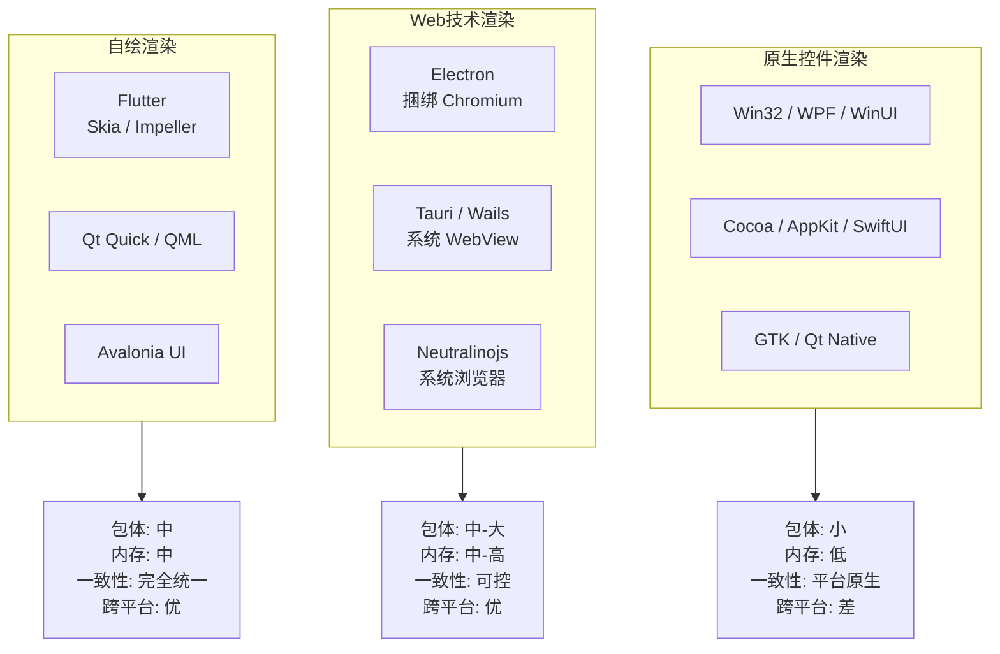
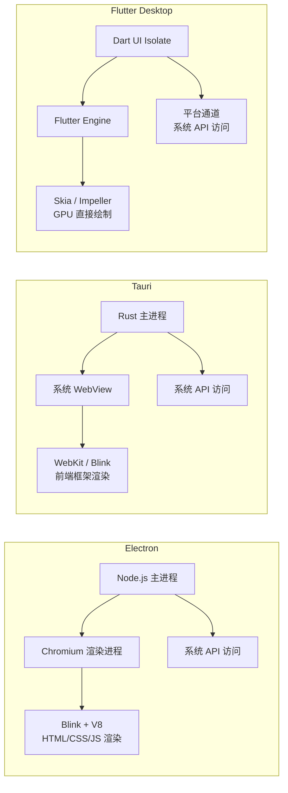
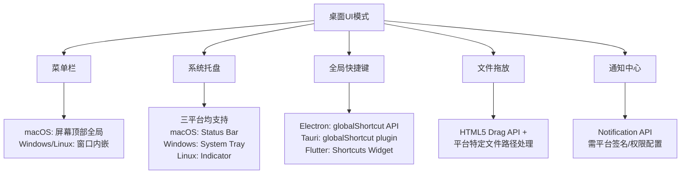
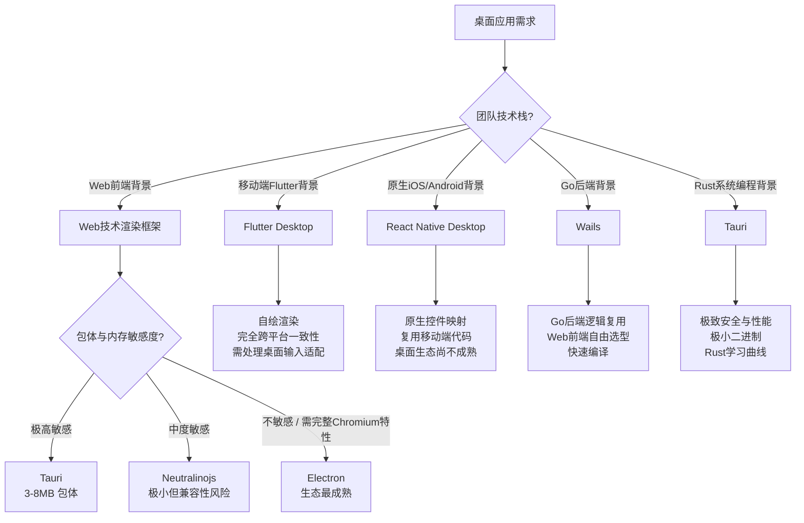

# 桌面UI框架：从原生到Web技术

## 引言

桌面应用开发在 2020 年代经历了深刻的范式转移。曾经，原生工具包（Win32、Cocoa、GTK）是桌面 UI 的唯一选择，开发者必须为每个平台维护独立的代码库。随后，Electron 以"用 Web 技术构建桌面应用"的口号打破了平台壁垒，但代价是臃肿的 Bundle 与高昂的内存占用。紧接着，Tauri 用 Rust 重写了后端宿主，将 WebView 的内存 footprint 压缩了一个数量级；Flutter Desktop 携带自绘渲染引擎进入战场，承诺像素级的跨平台一致性；React Native Desktop 试图将移动端的组件复用哲学延伸至桌面；Wails 与 Neutralinojs 则分别在 Go 后端集成与轻量级方案上探索新的可能性。

本章从桌面 UI 框架的**渲染理论**出发——区分原生控件渲染、Web 技术渲染与自绘渲染三大技术路线，剖析 UI 线程模型与 GPU 加速的理论基础，再映射到 2026 年的工程全景：Electron 与 React/Vue/Svelte 的集成实践、Tauri 的安全模型与前端无关性、Flutter Desktop 的 Widget 系统、React Native Desktop 的平台适配层、Wails 的 Go 后端绑定，以及 Neutralinojs 的极简主义。最后，我们将深入桌面专属的 UI 模式——菜单栏、系统托盘、全局快捷键、文件拖放与通知中心——并探讨 macOS、Windows 与 Linux 的平台适配策略。

---

## 理论严格表述

### 桌面UI框架的分类学

桌面 UI 框架可按**渲染目标**与**控件来源**两个维度进行分类。渲染目标回答"像素如何上屏"，控件来源回答"控件的外观与行为由谁定义"。

#### 第一类：原生控件渲染（Native Widget Rendering）

**原理**：应用直接调用操作系统提供的原生控件 API（如 Win32 `CreateWindowEx`、macOS `NSView`、Linux GTK `GtkWidget`），控件的外观、行为与无障碍支持完全由操作系统负责。

**特征**：

- 像素级遵循平台设计规范（HIG: Human Interface Guidelines）。
- 自动继承系统级主题变化（如暗黑模式、高对比度、字体缩放）。
- 无障碍支持（Accessibility）由操作系统原生提供，无需额外实现。
- 性能最优：无中间抽象层，渲染路径最短。

**代表框架**：

- Windows: Win32 API, WPF (DirectX 托管层), WinUI 3, UWP
- macOS: Cocoa/AppKit, SwiftUI (AppKit/Swift 层)
- Linux: GTK, Qt (Qt 虽有自绘能力，但默认使用平台样式引擎)
- 跨平台: wxWidgets, JavaFX (部分平台)

#### 第二类：Web技术渲染（Web Technology Rendering）

**原理**：应用嵌入一个 Web 渲染引擎（WebView），UI 以 HTML/CSS/JavaScript 描述，由 WebView 的排版引擎（Blink/WebKit）解析并渲染为像素，再通过操作系统图形 API 上屏。

**特征**：

- UI 层与平台解耦：同一份 HTML/CSS/JS 可在 Windows、macOS、Linux 上渲染出一致的界面（或响应式适配的界面）。
- 生态复用：可直接使用 npm 上数百万的前端组件库、CSS 框架与构建工具。
- 渲染成本：需维护 DOM 树、CSSOM 树、合成层与 JavaScript 运行时，内存与 CPU 开销显著高于原生控件。
- 无障碍支持：依赖 WebView 将 ARIA 属性映射到平台无障碍 API，映射完整度因平台而异。

**代表框架**：Electron, Tauri, Wails, Neutralinojs

#### 第三类：自绘渲染（Self-Drawing / Retained Mode Rendering）

**原理**：框架不依赖操作系统控件，而是在自有渲染管线中直接绘制像素。开发者使用框架提供的抽象（Widget、Component）描述 UI，框架负责将这些描述转换为 GPU 指令或 CPU 位图操作。

**特征**：

- 像素级跨平台一致性：同一套控件在所有平台上外观完全相同，不受操作系统主题影响。
- 完全控制渲染管线：可实现原生框架难以实现的高性能动画、自定义着色器与离屏渲染。
- 无障碍支持需自行实现：框架必须将自定义控件的语义信息桥接到平台无障碍 API（如 macOS 的 `NSAccessibility`、Windows 的 UI Automation）。
- 包体大小：通常包含渲染引擎二进制（如 Flutter 的 `libflutter.so` / `Flutter.dll`）。

**代表框架**：Flutter, Qt (QML/自绘路径), Avalonia UI, Unity UI Toolkit

### UI线程模型

桌面 UI 框架的线程模型决定了界面响应性、并发复杂度与性能上限。

#### 单线程 UI 模型（Single-Threaded UI）

**原理**：所有 UI 操作（布局、绘制、事件处理）均在单个 UI 线程（主线程）上顺序执行。后台任务通过异步回调、消息队列或协程与 UI 线程通信。

**代表**：原生 Cocoa/AppKit (主线程限制)、Electron (Blink 的主线程)、Flutter (Dart 的 UI Isolate)、早期 WinForms/WPF。

**优势**：

- 无竞争条件：UI 状态无需锁保护，避免了多线程 UI 中最棘手的同步问题。
- 确定性：事件处理顺序严格可预测。

**劣势**：

- 长耗时操作阻塞 UI：若在主线程执行同步 I/O 或密集计算，界面将冻结。
- 多核利用率低：UI 渲染无法跨线程并行。

#### 多线程 UI 模型（Multi-Threaded UI）

**原理**：UI 的某些阶段（如布局、绘制、纹理上传）可在独立线程或线程池中执行，主线程仅负责事件调度与结果合成。

**代表**：WPF 的渲染线程（单独线程执行 DirectX 合成）、Qt 的 `QThread` + `moveToThread`、Android 的 Choreographer + RenderThread。

**优势**：

- 复杂场景的流畅度：长布局计算或大量绘制指令可在后台线程准备，主线程仅执行最终合成。
- 更好的多核利用。

**劣势**：

- 状态同步复杂度：跨线程访问 UI 状态需显式同步（锁、原子操作、消息传递）。
- 死锁与竞态风险显著增加。

#### 并发架构的演进：从锁到消息传递

现代桌面框架趋向于**消息传递（Message Passing）**与**不可变状态（Immutable State）**模型，以规避共享状态的同步难题：

- **Electron 的主进程/渲染进程隔离**：主进程（Node.js）与渲染进程（Chromium）通过 IPC（`ipcMain` / `ipcRenderer`）通信，天然避免了共享内存。
- **Flutter 的 Isolate 模型**：Dart 的 Isolate 无共享内存，通过消息端口（`SendPort` / `ReceivePort`）传递数据，UI Isolate 专责渲染，计算密集型任务派发给后台 Isolate。
- **Tauri 的命令系统**：前端（WebView）通过 Tauri 的命令抽象调用 Rust 后端，通信基于序列化消息（JSON）。

### GPU加速在桌面UI中的理论

现代桌面 UI 框架普遍将渲染管线 offload 到 GPU，以解放 CPU 并实现流畅的动画与滚动。

#### 渲染管线概述

1. **Widget/Element 树构建**：框架根据应用状态构建控件树。
2. **布局（Layout）**：计算每个控件的位置与尺寸。
3. **绘制（Paint）**：生成绘制指令（Draw Calls），如矩形填充、文本光栅化、图片纹理上传。
4. **合成（Compositing）**：将绘制结果分层（Layer），利用 GPU 进行图层混合与变换。
5. **上屏（Present）**：将最终帧缓冲交换到显示器。

#### 核心图形API

| API | 所属组织 | 平台 | 桌面框架应用 |
|-----|---------|------|------------|
| Skia | Google | 跨平台 | Flutter, Chrome/Blink, Android |
| Direct2D / Direct3D | Microsoft | Windows | WPF, WinUI 3, Electron (Chromium) |
| Metal | Apple | macOS/iOS | Flutter (macOS), native Cocoa |
| OpenGL / Vulkan | Khronos | 跨平台 | Qt, GLFW, 早期 Electron |
| Core Animation | Apple | macOS/iOS | Cocoa/AppKit 的合成层 |

**Skia** 是 Google 开发的 2D 图形库，被 Flutter 与 Chromium 采用。其关键特性包括：

- **路径与裁剪优化**：将复杂矢量路径分解为 GPU 友好的三角形网格。
- **字体光栅化**：支持子像素渲染（Subpixel Rendering）与 SDF（Signed Distance Field）字体，保证缩放清晰度。
- **图层合成**：自动识别可缓存的静态图层，避免每帧重绘。

**Flutter 的渲染架构**是 Skia（或 Impeller，Flutter 的自研渲染后端）的直接用户：

- Dart 代码描述的 Widget 树在框架层被转换为 Element 树与 RenderObject 树。
- RenderObject 生成绘制指令，提交给 Skia/Impeller 的 GPU 后端。
- Impeller（Flutter 3.10+ 在 iOS 上默认启用，macOS 逐步跟进）预编译着色器，消除了运行时着色器编译导致的卡顿（Shader Compilation Jank）。

### 响应式UI的桌面适配理论

响应式设计（Responsive Design）起源于移动端的多尺寸屏幕适配，但在桌面语境下需要处理额外的复杂性：

1. **窗口化（Windowing）**：桌面应用运行于可调整尺寸的窗口中，而非移动设备的全屏独占模式。窗口尺寸变化频率远高于手机屏幕旋转。
2. **输入模式多样性**：鼠标（精确点击、悬停、右键菜单）、触摸板（手势）、键盘（快捷键、Tab 导航）与触屏（若设备支持）的并存，要求控件具备多模态交互能力。
3. **信息密度（Information Density）**：桌面屏幕尺寸大、像素密度相对低（相比手机），应呈现更高信息密度的界面，而非简单放大移动端布局。

**桌面响应式策略**：

- **断点设计（Breakpoint Design）**：定义窗口宽度断点（如 Compact < 640px, Medium 640-1024px, Expanded > 1024px），在不同断点下调整布局模式（单栏/双栏/三栏）。
- **弹性布局（Elastic Layout）**：使用 CSS Grid / Flexbox 的比例分配，而非固定像素宽度，使内容随窗口缩放自然流动。
- **悬停状态（Hover State）**：桌面交互依赖悬停提示（Tooltip）、下拉菜单与右键上下文菜单，这些在触摸优先的设计中往往被忽略。
- **键盘导航（Keyboard Navigation）**：确保所有可交互元素可通过 Tab 键聚焦，通过 Enter/Space 激活，通过 Escape 取消。这是桌面无障碍的核心要求。

---

## 工程实践映射

### Electron的UI框架选择

Electron 通过整合 Chromium（渲染 UI）与 Node.js（访问系统资源），使前端开发者能够使用熟悉的 Web 技术栈构建桌面应用。截至 2026 年，Electron 仍是生态最成熟、社区资源最丰富的跨平台桌面方案。

#### 前端框架在 Electron 中的集成

**React + Electron**

React 是 Electron 生态中最常用的 UI 库，其组件化模型与状态管理生态（Zustand、Jotai、Redux Toolkit）与桌面应用的复杂状态机高度契合。

```typescript
// 主进程 (main.ts)
import { app, BrowserWindow, ipcMain } from 'electron';

const createWindow = () => {
  const win = new BrowserWindow({
    width: 1200,
    height: 800,
    webPreferences: {
      preload: path.join(__dirname, 'preload.js'),
      contextIsolation: true, // 安全最佳实践：启用上下文隔离
      nodeIntegration: false, // 禁用渲染进程直接访问 Node.js
    },
  });
  win.loadURL('http://localhost:5173'); // Vite 开发服务器
};

// 预加载脚本 (preload.ts) — 安全桥接
import { contextBridge, ipcRenderer } from 'electron';

contextBridge.exposeInMainWorld('electronAPI', {
  openFile: () => ipcRenderer.invoke('dialog:openFile'),
  onUpdateCounter: (callback: (value: number) => void) =>
    ipcRenderer.on('update-counter', (_event, value) => callback(value)),
});

// 渲染进程 (React 组件)
declare global {
  interface Window {
    electronAPI: {
      openFile: () => Promise<string>;
      onUpdateCounter: (callback: (value: number) => void) => void;
    };
  }
}

const App: React.FC = () => {
  const handleOpen = async () => {
    const filePath = await window.electronAPI.openFile();
    setSelectedFile(filePath);
  };
  // ...
};
```

**关键安全实践**：

- **上下文隔离（Context Isolation）**：必须启用。预加载脚本运行在独立上下文，即使渲染进程被 XSS 攻破，攻击者无法直接访问 Node.js API。
- **内容安全策略（CSP）**：通过 `Content-Security-Policy` HTTP 头限制渲染进程可加载的资源来源，禁止内联脚本执行。
- **自定义协议**：使用 `registerFileProtocol` 或 `protocol.handle` 替代 `file://` 协议，避免本地文件路径泄露。

**Vue + Electron**

Vue 3 的组合式 API（Composition API）与 Electron 的 IPC 通信模式配合良好。`vue-cli-plugin-electron-builder` 与 `vite-plugin-electron` 是两种主流构建集成方案。

```typescript
// Vue 3 + Vite + Electron 的 ipc 封装（组合式函数）
import { ref, onMounted, onUnmounted } from 'vue';

export function useIpcListener(channel: string, handler: (...args: any[]) => void) {
  onMounted(() => {
    window.electronAPI?.on(channel, handler);
  });
  onUnmounted(() => {
    window.electronAPI?.off(channel, handler);
  });
}
```

**Vue 在 Electron 中的特殊注意**：

- Vue 的响应式系统大量依赖 `Proxy`，在 Electron 的上下文隔离环境中无额外限制，但在旧版 `remote` 模块（已废弃）的跨进程代理中曾引发性能问题。
- 使用 `<script setup>` 语法时，确保模板编译器正确配置（Vite 的 `@vitejs/plugin-vue` 已默认处理）。

**Svelte + Electron**

Svelte 的编译时优化使其在 Electron 中具有最小的运行时开销。Svelte 组件无虚拟 DOM，直接生成高效的原生 DOM 操作代码，对内存占用敏感的桌面应用是理想选择。

```svelte
<!-- Svelte 组件中的 IPC 调用 -->
<script lang="ts">
  let filePath = '';

  async function selectFile() {
    filePath = await window.electronAPI.openFile();
  }
</script>

<button on:click="{selectFile}">选择文件</button>
<p>已选择: `{filePath}`</p>
```

**Angular + Electron**

Angular 在 Electron 中的使用相对较少，主要适用于企业级应用（如大型内部工具）。Angular 的依赖注入与强类型模板在复杂业务逻辑中有优势，但 Bundle 体积与启动时间劣于 React/Vue/Svelte。

#### Electron 的性能优化

- **渲染进程合并**：Electron 22+ 支持 `BrowserView` 与 `WebContentsView` 替代多个 `BrowserWindow`，减少进程开销。
- **V8 缓存**：启用 `v8CacheOptions` 以加速 JavaScript 加载。
- **按需加载模块**：避免在启动时加载所有 IPC handler，使用动态 `require`/`import` 延后初始化。
- **内存泄漏监控**：使用 Electron 的内置 `app.getAppMetrics()` 与 Chrome DevTools 的 Memory Profiler 追踪 `BrowserWindow` 与 `WebFrame` 的内存使用。

### Tauri的UI技术

Tauri 是 2021 年后崛起的桌面框架，采用 Rust 编写后端宿主，前端使用系统原生 WebView（Windows: WebView2, macOS: WKWebView, Linux: WebKitGTK），而非捆绑 Chromium。

#### 核心架构优势

| 维度 | Electron | Tauri |
|------|---------|-------|
| 后端语言 | Node.js + C++ | Rust |
| 渲染引擎 | 捆绑 Chromium | 系统 WebView |
| 典型包体大小 | 150MB+ | 3-8MB |
| 内存占用 | 较高（完整 Chromium） | 较低（共享系统 WebView） |
| 安全模型 | Context Isolation + CSP | 进程沙箱 + 能力（Capabilities） |
| 前端绑定 | 自由 | 自由（任何前端框架） |

#### 能力模型（Capabilities）

Tauri 2.0 引入了基于能力（Capability）的安全模型，替代了早期版本的粗粒度权限控制：

```json
// src-tauri/capabilities/main.json
{
  "identifier": "main-capability",
  "description": "主窗口的能力配置",
  "windows": ["main"],
  "permissions": [
    "core:default",
    "dialog:allow-open",
    "fs:allow-read-file",
    {
      "identifier": "fs:scope",
      "allow": [{ "path": "$APPDATA/*" }]
    }
  ]
}
```

此模型明确声明了每个窗口可访问的系统 API 与文件路径，遵循最小权限原则。

#### 前端框架集成

Tauri 对前端框架无偏好，通过 `tauri.conf.json` 配置开发服务器与构建输出：

```json
{
  "build": {
    "beforeDevCommand": "pnpm dev",
    "beforeBuildCommand": "pnpm build",
    "devUrl": "http://localhost:1420",
    "frontendDist": "../dist"
  }
}
```

**Tauri 的 IPC 通信**：

```rust
// src-tauri/src/lib.rs — Rust 命令
#[tauri::command]
async fn greet(name: String) -> Result<String, String> {
    Ok(format!("Hello, {}! You've been greeted from Rust.", name))
}

// 前端调用
import { invoke } from '@tauri-apps/api/core';
const response = await invoke<string>('greet', { name: 'World' });
```

Tauri 的命令系统自动序列化参数与返回值（通过 serde），类型安全由 Rust 的强类型系统天然保障。

### Flutter Desktop的Widget系统

Flutter 将移动端的自绘渲染架构完整地带到了桌面平台（Windows、macOS、Linux）。其核心理念是"一切皆是 Widget"——从布局约束到交互手势，从文本样式到动画曲线，全部由框架层定义，与操作系统控件无关。

#### 桌面适配要点

**1. 输入适配**

桌面环境缺乏触摸事件，但拥有精确的鼠标指针与丰富的键盘交互：

```dart
// 鼠标悬停效果
MouseRegion(
  onEnter: (_) => setState(() => _isHovered = true),
  onExit: (_) => setState(() => _isHovered = false),
  child: Container(
    color: _isHovered ? Colors.blue.withOpacity(0.1) : Colors.transparent,
    child: const Text('Hover over me'),
  ),
)

// 键盘快捷键（Actions & Shortcuts）
Shortcuts(
  shortcuts: {
    LogicalKeySet(LogicalKeyboardKey.control, LogicalKeyboardKey.keyS):
        const SaveIntent(),
  },
  child: Actions(
    actions: {
      SaveIntent: CallbackAction<SaveIntent>(
        onInvoke: (_) => _saveDocument(),
      ),
    },
    child: const EditorWidget(),
  ),
)
```

**2. 窗口管理**

Flutter Desktop 需通过平台通道（Platform Channel）或专用插件（如 `window_manager`）控制窗口行为：

```dart
import 'package:window_manager/window_manager.dart';

await windowManager.ensureInitialized();
WindowOptions windowOptions = const WindowOptions(
  size: Size(1280, 720),
  minimumSize: Size(800, 600),
  title: 'My Desktop App',
);
await windowManager.waitUntilReadyToShow(windowOptions, () async {
  await windowManager.show();
  await windowManager.focus();
});
```

**3. 菜单栏与系统托盘**

Flutter 通过 `menubar` 与 `system_tray` 插件实现桌面原生菜单：

```dart
// macOS 菜单栏
PlatformMenuBar(
  menus: [
    PlatformMenu(
      label: '文件',
      menus: [
        PlatformMenuItem(
          label: '打开',
          onSelected: () => _openFile(),
        ),
        const PlatformMenuItemGroup(members: [
          PlatformProvidedMenuItem(type: PlatformProvidedMenuItemType.quit),
        ]),
      ],
    ),
  ],
  child: const MainContent(),
);
```

#### Flutter Desktop 的局限

- **包体大小**：最小 Release 包约 20-30MB（含 Flutter 引擎与 Skia/Impeller 二进制）。
- **平台感**：由于控件完全自绘，Flutter 应用在 macOS 上可能"看起来不像 macOS 应用"，除非开发者主动实现平台特定的视觉风格（如 Cupertino 风格在 macOS 上的适配）。
- **生态差距**：桌面端的第三方插件质量与数量显著低于移动端，尤其是系统级集成（如 Spotlight 搜索、Windows 跳转列表）。

### React Native Desktop的组件映射

React Native（RN）的移动组件模型通过平台适配层延伸至桌面，主要实现包括：

- **React Native Windows / macOS**：微软官方维护，将 RN 组件映射到 XAML（Windows）与 AppKit（macOS）原生控件。
- **React Native for Linux**：社区驱动，基于 GTK 或 Qt 的适配层。

#### 组件映射原理

React Native 的架构分为三层：

1. **JavaScript 层**：React 组件树与业务逻辑。
2. **Bridge / JSI**：JavaScript 与原生代码的通信层（新架构使用 JSI 替代旧 Bridge，支持同步调用）。
3. **Native 层**：平台特定的 View Manager 与 Module，将 JS 组件属性映射到原生控件属性。

```typescript
// React Native Windows 的自定义原生组件注册
// windows/MyApp/CustomViewManager.cs
[ViewManagerExport("CustomNativeView")]
public class CustomViewManager : ViewManagerBase<Panel>
{
    [ViewManagerProperty("backgroundColor")]
    public void SetBackgroundColor(Panel view, string color)
    {
        view.Background = new SolidColorBrush(ColorHelper.FromArgb(color));
    }
}
```

**桌面场景的挑战**：

- **布局系统差异**：移动端以 Flexbox 为主，桌面端常需复杂的网格与绝对定位。RN 的 Yoga 布局引擎在桌面窗口缩放时的表现不如 CSS Grid 灵活。
- **键盘与焦点管理**：RN 的触摸优先架构在键盘导航与焦点环（Focus Ring）管理上需要大量补充实现。
- **成熟度**：React Native Windows/macOS 的企业采用率在增长，但插件生态、文档完整度与社区活跃度仍显著落后于 Electron 与 Tauri。

### Wails（Go后端 + 任意前端）

Wails 采用与 Tauri 相似的架构哲学：用编译型语言（Go）编写后端，前端使用任意 Web 技术栈，通过系统 WebView 渲染。

#### 核心差异：Tauri vs Wails

| 维度 | Tauri | Wails |
|------|-------|-------|
| 后端语言 | Rust | Go |
| 内存安全 | 编译期保证（所有权系统） | GC 管理 |
| 并发模型 | 异步 / async-await | Goroutine |
| 构建速度 | 较慢（Rust 编译） | 较快（Go 编译） |
| 二进制大小 | 极小（Rust 零成本抽象） | 较小（Go Runtime） |
| 前端绑定 | 自动生成 TypeScript 绑定 | 自动生成 TypeScript/JavaScript 绑定 |

#### Wails 的绑定生成

Wails 通过反射自动生成 Go 结构体方法的前端绑定：

```go
// app.go
package main

import "context"

type App struct {
    ctx context.Context
}

func NewApp() *App { return &App{} }

func (a *App) startup(ctx context.Context) { a.ctx = ctx }

// Greet 方法将自动暴露给前端
func (a *App) Greet(name string) string {
    return fmt.Sprintf("Hello %s, It's show time!", name)
}
```

前端直接调用生成的绑定：

```typescript
import { Greet } from '../wailsjs/go/main/App';
const result = await Greet('World');
```

**适用场景**：Go 后端团队希望复用现有业务逻辑（如微服务的 Go 服务层）构建桌面管理后台、监控面板或配置工具。

### Neutralinojs的轻量级方案

Neutralinojs 是桌面框架中的极简主义者。与 Electron 捆绑 Chromium、Tauri/Wails 使用系统 WebView 不同，Neutralinojs **完全依赖系统已安装的 Web 浏览器**（通过本地 HTTP 服务器 + 浏览器窗口模式），将包体大小压缩至约 2MB。

#### 架构特点

- **无捆绑浏览器**：应用启动本地服务器，并调用系统默认浏览器打开应用窗口（或使用轻量级原生窗口封装）。
- **最小 API 暴露**：仅提供文件系统、操作系统、网络与进程管理的轻量 API，不暴露完整的 Node.js 或 Rust/Go 运行时。
- **前端无关**：与 Tauri/Wails 相同，支持任何前端框架。

#### 局限与风险

- **浏览器碎片化**：不同用户的系统浏览器版本差异巨大（Chrome 120 vs Safari 16 vs Firefox ESR），前端代码需处理广泛的兼容性问题。
- **窗口控制受限**：对原生窗口行为（如自定义标题栏、无边框窗口、系统托盘）的控制能力弱于 Tauri/Electron。
- **生产就绪度**：截至 2026 年，Neutralinojs 的企业级采用案例较少，主要适用于原型验证与极简工具。

### 桌面特定的UI模式

桌面应用拥有移动端与 Web 端不具备的系统级集成能力，这些能力是桌面用户体验的核心。

#### 菜单栏（Menu Bar）

菜单栏是桌面应用信息架构的锚点。macOS 的菜单栏位于屏幕顶部（全局共享），Windows 与 Linux 的菜单栏通常位于窗口内部。

**Electron 实现**：

```typescript
import { Menu, MenuItem } from 'electron';

const template: Electron.MenuItemConstructorOptions[] = [
  {
    label: '文件',
    submenu: [
      { label: '新建', accelerator: 'CmdOrCtrl+N', click: () => createNew() },
      { label: '打开', accelerator: 'CmdOrCtrl+O', click: () => openFile() },
      { type: 'separator' },
      { label: '退出', role: process.platform === 'darwin' ? 'close' : 'quit' },
    ],
  },
  {
    label: '编辑',
    submenu: [
      { label: '撤销', role: 'undo' },
      { label: '重做', role: 'redo' },
      { type: 'separator' },
      { label: '剪切', role: 'cut' },
      { label: '复制', role: 'copy' },
      { label: '粘贴', role: 'paste' },
    ],
  },
];

const menu = Menu.buildFromTemplate(template);
Menu.setApplicationMenu(menu); // macOS: 全局菜单; Windows/Linux: 窗口菜单
```

**平台差异处理**：

- macOS 的"应用菜单"（App Menu）首个条目必须是应用名，Electron 自动处理为 `role: 'appMenu'`。
- Windows 无全局菜单栏概念，通常使用汉堡菜单或 Ribbon UI 替代传统菜单栏。

#### 系统托盘（System Tray / Status Bar）

系统托盘图标允许应用在后台运行，用户可通过右键菜单快速访问功能。

**Electron 系统托盘**：

```typescript
import { Tray, Menu, nativeImage } from 'electron';

const trayIcon = nativeImage.createFromPath('assets/tray-icon.png');
const tray = new Tray(trayIcon);

const contextMenu = Menu.buildFromTemplate([
  { label: '显示主窗口', click: () => mainWindow?.show() },
  { label: '开始专注模式', click: () => startFocusMode() },
  { type: 'separator' },
  { label: '退出', click: () => app.quit() },
]);

tray.setToolTip('My App');
tray.setContextMenu(contextMenu);

// macOS: 点击托盘图标显示窗口
tray.on('click', () => {
  if (process.platform === 'darwin') {
    mainWindow?.isVisible() ? mainWindow.hide() : mainWindow?.show();
  }
});
```

**注意**：macOS 的"Status Bar"（状态栏右侧）与"Dock"（底部 Dock 栏）是独立的 UI 元素。`Tray` API 控制状态栏图标，`app.dock` API 控制 Dock 行为。

#### 全局快捷键（Global Shortcuts）

全局快捷键允许应用在非焦点状态下响应键盘组合。

```typescript
import { globalShortcut } from 'electron';

app.whenReady().then(() => {
  globalShortcut.register('CommandOrControl+Shift+X', () => {
    toggleQuickCaptureWindow();
  });
});

app.on('will-quit', () => {
  globalShortcut.unregisterAll();
});
```

**平台限制**：

- macOS：全局快捷键不得与系统级快捷键冲突（如 `Cmd+Space` 是 Spotlight）。
- Windows：需确保应用安装时向用户说明全局快捷键的存在，避免与现有软件冲突。
- Linux：不同桌面环境（GNOME、KDE、XFCE）对全局快捷键的支持程度不一，需进行兼容性测试。

#### 文件拖放（File Drag & Drop）

桌面应用的核心能力之一是从文件管理器拖入文件，或从应用内拖出文件。

**拖入（Drag In）**：

```typescript
// 渲染进程（HTML）
const dropZone = document.getElementById('drop-zone');

dropZone.addEventListener('dragover', (e) => {
  e.preventDefault();
  e.stopPropagation();
  dropZone.classList.add('drag-over');
});

dropZone.addEventListener('drop', async (e) => {
  e.preventDefault();
  const files = Array.from(e.dataTransfer?.files || []);
  const filePaths = files.map(f => (f as any).path); // Electron 注入的 path 属性
  await window.electronAPI.processFiles(filePaths);
});
```

**拖出（Drag Out）**：

```typescript
// 渲染进程
itemElement.addEventListener('dragstart', (e) => {
  e.preventDefault();
  // Electron 17+ 支持从 Web 内容启动外部拖放
  window.electronAPI.startDrag('/path/to/file.txt');
});

// 主进程
ipcMain.handle('start-drag', (event, filePath) => {
  event.sender.startDrag({
    file: filePath,
    icon: nativeImage.createFromPath('assets/drag-icon.png'),
  });
});
```

#### 通知中心（Notifications）

桌面通知遵循操作系统原生的通知样式与权限模型。

```typescript
import { Notification } from 'electron';

const showNotification = (title: string, body: string) => {
  new Notification({
    title,
    body,
    icon: nativeImage.createFromPath('assets/notification-icon.png'),
    silent: false,
    actions: [
      { type: 'button', text: '查看详情' },
    ],
  }).show();
};

// macOS 通知权限请求
app.whenReady().then(() => {
  if (process.platform === 'darwin') {
    app.setAppUserModelId('com.example.myapp'); // Windows 通知必需
  }
});
```

**平台差异**：

- macOS：通知必须关联 `NSUserNotification` 或 `UNUserNotificationCenter`，应用需正确签名（Code Signing）才能显示通知。
- Windows：需设置 `appUserModelId`，否则通知可能不显示在操作中心。
- Linux：依赖 `libnotify`，在最小化容器或某些发行版上可能不可用。

### 平台适配

#### macOS 适配

**菜单栏集成**：macOS 应用必须提供标准的"应用菜单"（About、Preferences、Services、Hide、Quit）。Electron 的 `role` 属性自动映射到这些标准项。

**Window 控件**：macOS 的窗口控制按钮（关闭、最小化、全屏）位于窗口左上角，且全屏行为（Enter Full Screen）与 Windows 的"最大化"语义不同。

```typescript
// macOS 特定窗口配置
const win = new BrowserWindow({
  titleBarStyle: 'hiddenInset', // 隐藏标题栏，内容延伸至顶部
  trafficLightPosition: { x: 12, y: 12 }, // 调整红绿灯按钮位置
  vibrancy: 'under-window', // 毛玻璃效果
});
```

**Dark Mode 与 Accent Color**：macOS 支持系统级暗黑模式与强调色（Accent Color）。前端代码可通过 `prefers-color-scheme` 媒体查询响应主题变化，原生层可通过 `nativeTheme` API 监听：

```typescript
import { nativeTheme } from 'electron';

nativeTheme.on('updated', () => {
  mainWindow?.webContents.send('theme-changed', nativeTheme.shouldUseDarkColors);
});
```

#### Windows 适配

**任务栏跳转列表（Jump Lists）**：Windows 允许应用在任务栏右键菜单中显示最近文档或常用操作。

```typescript
import { app } from 'electron';

app.setJumpList([
  {
    type: 'recent',
  },
  {
    type: 'custom',
    name: '快捷操作',
    items: [
      {
        type: 'task',
        title: '新建项目',
        description: '创建一个新的工作项目',
        program: process.execPath,
        args: '--new-project',
        iconPath: process.execPath,
        iconIndex: 0,
      },
    ],
  },
]);
```

**Windows 通知与 Toast**：Windows 10/11 使用 Action Center 聚合通知。应用需正确设置 `appUserModelId` 并可能使用 `electron-windows-notifications` 扩展库以支持交互式 Toast 通知（按钮、输入框）。

**高 DPI 支持**：Windows 的 DPI 感知模式（Per-Monitor V2）需在应用清单（Application Manifest）中声明。Electron 已默认处理大部分高 DPI 逻辑，但在原生插件或 `NativeImage` 操作中仍需提供多分辨率图标（`@1x`, `@2x`, `@3x`）。

#### Linux 适配

**GTK 主题集成**：Linux 桌面环境多样（GNOME、KDE、XFCE、i3 等），Electron 与 Tauri 的 WebView 在 Linux 上默认使用 GTK 主题。

```typescript
// 检测 Linux 桌面环境
const desktopEnv = process.env.XDG_CURRENT_DESKTOP || process.env.DESKTOP_SESSION;
// 可能的值: 'GNOME', 'KDE', 'XFCE', 'ubuntu:GNOME'
```

**Snap / Flatpak / AppImage 打包差异**：

- **Snap**：沙箱限制严格，访问文件系统、通知与系统托盘需显式声明接口（plugs）。
- **Flatpak**：类似 Snap 的沙箱模型，但权限模型略有不同（Portal 系统）。
- **AppImage**：无沙箱，兼容性最好，但无自动更新与集中分发优势。

**Wayland vs X11**：Linux 显示服务器正在从 X11 向 Wayland 迁移。Electron 在 Wayland 下的性能与稳定性持续提升，但某些功能（如全局快捷键、窗口位置控制）在 Wayland 中受限（出于安全设计）。Tauri（基于 GTK/WebKitGTK）同样面临 Wayland 适配问题。建议在 Linux 打包说明中明确标注 Wayland/X11 兼容性。

---

## Mermaid 图表

### 桌面UI框架渲染技术谱系



### Electron vs Tauri vs Flutter Desktop 架构对比



### 桌面专属UI模式与平台映射



### 桌面框架选型决策树



---

## 理论要点总结

1. **桌面 UI 框架的三条技术路线——原生控件、Web 技术与自绘渲染——各有不可替代的优势域**。原生控件提供最优的平台感与无障碍支持；Web 技术提供最大的生态复用与开发效率；自绘渲染提供像素级的跨平台一致性与渲染管线控制权。

2. **UI 线程模型的选择是响应性与复杂度的权衡**。单线程模型（Flutter、Cocoa）消除了竞态条件，但要求开发者严格避免主线程阻塞；多线程模型（WPF）提升了复杂场景的流畅度，但引入了状态同步的挑战。现代框架趋向消息传递与不可变状态，以规避共享内存的陷阱。

3. **GPU 加速已从"优化手段"演变为"默认假设"**。Skia、Direct2D、Metal 等图形 API 是现代桌面 UI 的基石。Flutter 的 Impeller 通过预编译着色器消除了运行时卡顿，代表了自绘渲染管线的演进方向。

4. **Electron 在 2026 年仍是生态最成熟的桌面 Web 方案，但 Tauri 已成为资源敏感场景的首选**。Tauri 的 Rust 后端、系统 WebView 与能力模型（Capabilities）在包体大小、内存占用与安全模型上全面优于 Electron，但 Rust 的学习曲线与生态系统仍是采纳门槛。

5. **Flutter Desktop 将移动端的 Widget 模型带到了桌面，但需主动适配桌面交互范式**。鼠标悬停、键盘快捷键、窗口管理与菜单栏不是移动端的"可选功能"，而是桌面体验的"准入门槛"。

6. **React Native Desktop 的定位是"移动端团队的桌面延伸"，而非"通用桌面方案"**。其组件映射架构在简单场景下有效，但在复杂桌面布局、键盘导航与系统级集成上仍显不足。

7. **桌面专属 UI 模式（菜单栏、托盘、快捷键、拖放、通知）是区分"Web 应用套壳"与"真正桌面应用"的分水岭**。这些模式的实现需深入理解各平台的 HIG（Human Interface Guidelines）与 API 限制。

8. **平台适配不是"一次性工作"，而是"持续维护的承诺"**。macOS 的暗黑模式、Windows 的高 DPI 与跳转列表、Linux 的 Wayland 迁移——这些平台演进要求桌面应用持续更新，而非一次发布后永久运行。

9. **Wails 为 Go 生态提供了进入桌面领域的低摩擦路径**，而 Neutralinojs 的极简主义适合快速原型，但其浏览器碎片化与窗口控制受限使其难以承担生产级应用的使命。

10. **桌面应用开发的未来趋向"混合架构"**：用 Web 技术处理 UI 层的快速迭代，用编译型后端（Rust/Go/C++）处理性能敏感与系统级操作，通过 IPC 边界保证安全与隔离。Tauri 与 Wails 是这一趋势的最佳代表。

---

## 参考资源

- Electron Documentation. <https://www.electronjs.org/docs>. Electron 官方文档，涵盖主进程/渲染进程架构、安全最佳实践、上下文隔离、CSP 配置与性能优化指南。
- Tauri Documentation. <https://tauri.app/docs/>. Tauri 官方文档，详细说明其 Rust 后端架构、能力模型（Capabilities）、多平台构建与前端框架无关的集成方式。
- Flutter Desktop Documentation. <https://docs.flutter.dev/desktop>. Flutter 官方桌面支持文档，涵盖 Windows/macOS/Linux 的平台适配、菜单栏、键盘快捷键与窗口管理。
- React Native Windows + macOS Documentation. <https://microsoft.github.io/react-native-windows/>. 微软官方维护的 React Native 桌面扩展文档，包含 XAML/AppKit 组件映射与新架构（JSI）集成。
- Wails Documentation. <https://wails.io/docs/introduction>. Wails 官方文档，涵盖 Go 后端绑定生成、前端框架集成、多平台构建与运行时架构。
- Neutralinojs Documentation. <https://neutralino.js.org/docs/>. Neutralinojs 官方文档，阐述其极简架构、API 参考与平台限制。
- Google. "Flutter Architectural Overview." <https://docs.flutter.dev/resources/architectural-overview>. Flutter 官方架构综述，深入解释 Widget 树、Element 树、RenderObject 树与 Skia/Impeller 渲染管线的关系。
- Microsoft. "Windows App SDK / WinUI 3 Documentation." <https://learn.microsoft.com/windows/apps/winui/>. Windows 原生 UI 框架的官方文档，可作为理解桌面 UI 原生控件渲染的参考基准。
- Apple. "Human Interface Guidelines for macOS." <https://developer.apple.com/design/human-interface-guidelines/macos>. macOS 平台 UI 设计规范的权威参考，涵盖菜单栏、窗口管理、通知与暗黑模式的设计准则。
