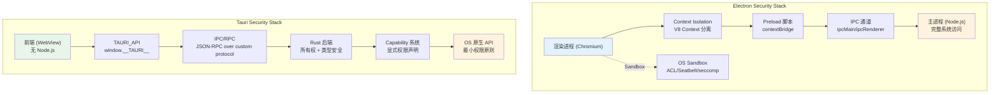
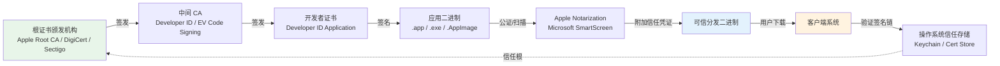
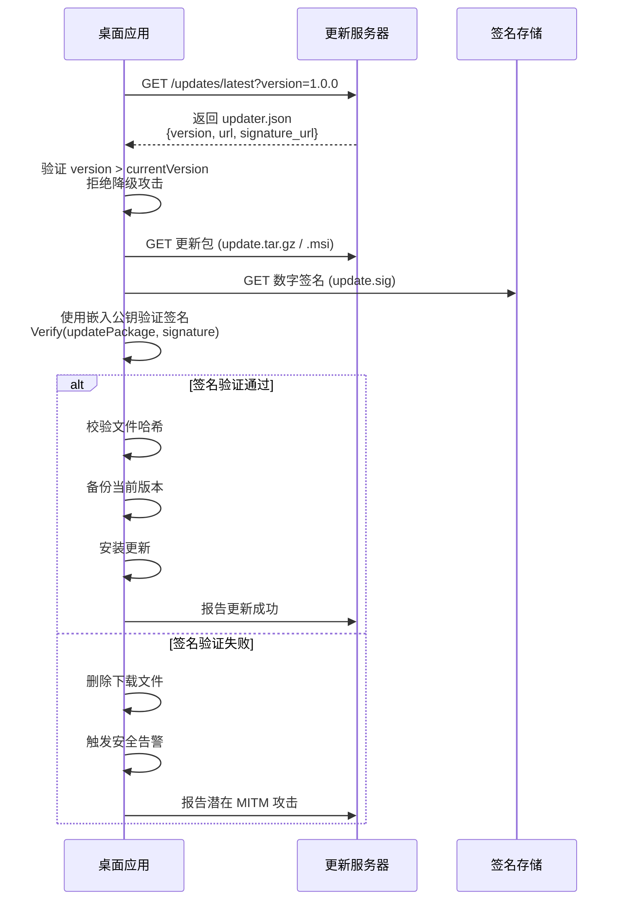

# 桌面应用安全：从代码签名到沙箱

## 引言

桌面应用程序运行在用户拥有完全控制权限的操作系统之上，天然具备访问文件系统、网络、硬件设备乃至系统注册表的能力。这种特权地位使桌面应用成为攻击者的高价值目标：一旦渲染进程中的恶意脚本突破沙箱边界，或主进程被注入恶意代码，整个用户系统的机密性、完整性与可用性都将面临毁灭性威胁。2024 年，Electron 生态中多起供应链攻击事件（如恶意 npm 包通过 `postinstall` 脚本窃取本地凭证）再次警示我们：桌面安全不是"锦上添花"的可选特性，而是生产级应用的底线要求。

本章从**桌面应用安全模型**的理论基础出发，形式化定义代码签名、公证、沙箱与权限模型的核心概念，剖析 Electron 的 Context Isolation / Sandbox / Preload 三层防御体系与 Tauri 的 Rust 内存安全保证。在工程实践映射中，我们将逐条拆解 Electron Security Checklist、Tauri 的 Capability-based 安全模型、Windows EV 证书与 Apple Developer ID 的配置流程、自动更新的签名验证与回滚策略，以及 macOS App Sandbox 与 Windows AppContainer 的实战配置。所有内容均基于 2026 年主流框架的最新稳定版本（Electron 35.x、Tauri 2.x）编写。

---

## 理论严格表述

### 2.1 桌面应用安全模型的形式化定义

桌面应用的安全模型可抽象为四个相互关联的形式化组件：身份认证（Authentication）、访问控制（Access Control）、执行隔离（Execution Isolation）与完整性验证（Integrity Verification）。

**定义 2.1（代码签名，Code Signing）**
代码签名是一个加密过程，形式化为：
`Sign: Binary × PrivateKey → SignedBinary × CertificateChain`
其中 `PrivateKey` 属于受信任的证书颁发机构（CA）或开发者，`CertificateChain` 建立了从开发者到根 CA 的信任链。验证过程为：
`Verify: SignedBinary × TrustedAnchors → {Valid, Invalid, Revoked}`

**定义 2.2（公证，Notarization）**
公证是平台持有者对已签名二进制进行自动化安全扫描的附加信任层。形式化为：
`Notarize: SignedBinary × PlatformService → NotarizedBinary × Ticket`
其中 `Ticket` 是平台服务嵌入二进制或关联的不可伪造凭证，证明该二进制已通过静态分析与恶意软件检测。

**定义 2.3（沙箱，Sandbox）**
沙箱是对进程可访问资源集合的形式化限制：
`Sandbox(P) = {r ∈ Resources | Policy(P, r) = Allow}`
其中 `Policy` 是由操作系统或运行时定义的安全策略函数。沙箱的核心目标是最小权限原则（Principle of Least Privilege）：
`∀P: Sandbox(P) ⊆ Required(P)`
即进程 `P` 实际获得的权限严格不超过其完成任务所需的权限集合。

**定义 2.4（权限模型，Permission Model）**
权限模型定义了应用请求、被授予和行使系统能力的规则集合。形式化为三元组：
`PM = (Capabilities, Grants, Revocations)`

- `Capabilities`：应用声明的能力集合（如文件读取、网络访问、摄像头）；
- `Grants`：用户或系统授权的能力子集；
- `Revocations`：在运行时或更新时被撤销的能力。

### 2.2 Electron 的安全架构理论

Electron 的安全架构建立在 Chromium 的多层沙盒之上，并通过 Context Isolation、Sandbox 与 Preload 脚本形成纵深防御（Defense in Depth）体系。

**定义 2.5（Context Isolation，上下文隔离）**
Context Isolation 是 Electron 在渲染进程中引入的 JavaScript 执行上下文分离机制。形式化为：
`RendererContext = WebPageContext ⊕ PreloadContext`
其中 `⊕` 表示两个上下文运行于独立的 V8 上下文（V8 Context），不共享全局对象。Preload 脚本通过 `contextBridge` 暴露的 API 是两者唯一的通信通道：
`Bridge: PreloadContext × API → WebPageContext × RestrictedAPI`

这一机制消除了"渲染进程中的远程脚本直接访问 `window.require`"的攻击面。在 Context Isolation 禁用的情况下：
`RendererContext = WebPageContext = PreloadContext`
恶意网页脚本可通过原型污染（Prototype Pollution）或 DOM 注入直接调用 Node.js 的 `fs`、`child_process` 等模块。

**定义 2.6（渲染进程沙盒，Renderer Sandbox）**
Electron 的渲染进程沙盒继承自 Chromium 的沙盒实现，在各操作系统上利用不同的底层机制：

- **Windows**：基于访问控制列表（ACL）与令牌限制（Restricted Token），通过 `CreateRestrictedToken` 剥夺渲染进程对敏感系统资源的访问权限；
- **macOS**：基于 Seatbelt（`sandbox-exec` 的继任者），通过配置文件声明允许的系统调用与文件路径；
- **Linux**：利用命名空间（namespaces）与 seccomp-bpf 过滤器，限制渲染进程可执行的系统调用集合。

形式化地，沙盒策略函数 `Policy_Sandbox` 满足：
`Policy_Sandbox(renderer, resource) = Allow ⟹ resource ∈ {网络、GPU、用户显式授权文件}`

**定义 2.7（Preload 脚本的安全边界）**
Preload 脚本是运行在渲染进程但先于网页内容加载的特权脚本。其安全边界可形式化为：
`Preload ⊂ Node.js_Environment ∩ Renderer_Process`
Preload 脚本拥有完整的 Node.js API 访问权限，但必须通过 `contextBridge.exposeInMainWorld` 向网页暴露最小化的 API 表面：
`ExposedAPI = argmin_{API'} { |API'| : WebPageTask(API') = True }`

### 2.3 Tauri 的 Rust 安全保证

Tauri 选择 Rust 作为后端语言，其安全保证源于 Rust 编译期的所有权系统与类型系统。

**定义 2.8（内存安全的形式化保证）**
Rust 的所有权系统通过以下规则在编译期消除数据竞争与内存错误：

- **唯一所有权规则**：任一时刻，每个内存位置有且仅有一个所有者；
- **借用检查规则**：不可变引用（`&T`）可共存，可变引用（`&mut T`）必须唯一；
- **生命周期规则**：引用有效期不超过被引用对象的生命周期。

形式化地，Rust 的类型系统 `Γ` 满足：
`Γ ⊢ e : τ ⟹ e 在运行时不会触发 use-after-free、double-free 或 buffer-overflow`
这意味着 Tauri 的主进程后端在编译期即排除了整类 C/C++ 中常见的内存安全漏洞。

**定义 2.9（进程隔离模型）**
Tauri 的进程模型为：
`Proc_Tauri = {main(Rust), renderer(WebView)}`
与 Electron 不同，Tauri 的渲染进程运行在系统原生的 WebView 中（Windows WebView2、macOS WKWebView、Linux WebKitGTK），不包含 Node.js 运行时。前端代码无法直接访问文件系统、网络或系统 API，所有特权操作必须通过 Tauri 的 Command 系统向 Rust 后端发起 RPC 调用：
`Invoke: WebView × Command × Payload → Rust_Handler × Response`

### 2.4 自动更新的安全理论

自动更新机制若缺乏密码学验证，将成为供应链攻击的理想入口。其安全模型包含三个核心属性：

**定义 2.10（更新完整性，Update Integrity）**
更新包必须满足：
`Verify(UpdatePackage, PublicKey) = Valid ⟹ UpdatePackage 未被篡改`
验证通常基于 Ed25519 或 RSA-2048/4096 的签名机制，更新客户端在应用更新前必须验证签名。

**定义 2.11（回滚策略，Rollback Policy）**
回滚策略定义了在检测到更新缺陷时的恢复过程：
`Rollback: CurrentVersion × PreviousVersion × DefectReport → RestoredSystem`
安全回滚要求：

1. 前一版本的完整二进制必须被保留或可从可信源重新获取；
2. 回滚操作本身需经过与升级相同的签名验证；
3. 回滚后的版本号与状态必须被正确报告给更新服务器，避免再次推送同一缺陷版本。

**定义 2.12（降级攻击防护，Downgrade Attack Protection）**
更新客户端必须拒绝比当前已安装版本更旧的更新包，即使该旧版本包具有有效签名：
`Accept(Update) ⟹ Version(Update) > Version(Installed) ∧ SignatureValid(Update)`

---

## 工程实践映射

### 3.1 Electron 的 Security Checklist

Electron 官方维护了一份必须逐项检查的安全最佳实践清单。以下是最关键的配置项及其工程实现。

#### 3.1.1 禁用 `nodeIntegration`，启用 `contextIsolation`

`nodeIntegration: true` 允许渲染进程的网页直接访问 Node.js API，是最危险的配置之一。现代 Electron 应用必须严格禁用：

```typescript
// main.ts — 主进程窗口创建
import { BrowserWindow } from 'electron'

const win = new BrowserWindow({
  width: 1200,
  height: 800,
  webPreferences: {
    nodeIntegration: false,        // 禁用 Node.js 集成（默认已禁用，显式声明）
    contextIsolation: true,        // 启用上下文隔离（Electron 12+ 默认开启）
    sandbox: true,                 // 启用渲染进程沙盒
    preload: path.join(__dirname, 'preload.js'),  // 使用 Preload 脚本桥接
  }
})
```

#### 3.1.2 内容安全策略（CSP）配置

CSP 是防止 XSS 攻击的第一道防线。Electron 应用应在所有渲染进程的 HTML 中设置严格的 CSP：

```html
<!-- index.html -->
<meta http-equiv="Content-Security-Policy"
  content="default-src 'self';
           script-src 'self' 'unsafe-inline';
           style-src 'self' 'unsafe-inline';
           img-src 'self' data: https:;
           connect-src 'self' https://api.example.com;
           font-src 'self';
           object-src 'none';
           base-uri 'self';
           form-action 'self';
           upgrade-insecure-requests;">
```

严格模式下，应移除 `'unsafe-inline'` 并使用 nonce 或 hash：

```typescript
// 动态生成 nonce 的 preload 脚本示例
import { webFrame } from 'electron'

const nonce = crypto.randomUUID()
webFrame.executeJavaScript(`
  window.__CSP_NONCE__ = '${nonce}'
`)
```

#### 3.1.3 禁用不安全内容加载

`allowRunningInsecureContent` 允许 HTTPS 页面加载 HTTP 资源，会消除同源策略的保护：

```typescript
const win = new BrowserWindow({
  webPreferences: {
    allowRunningInsecureContent: false,   // 禁止混合内容
    webSecurity: true,                     // 启用同源策略（默认）
    experimentalFeatures: false,           // 禁用实验性 Chromium 特性
  }
})
```

#### 3.1.4 Preload 脚本的最小化 API 暴露

Preload 脚本应仅暴露前端完成业务所必需的最小 API 集合：

```typescript
// preload.ts
import { contextBridge, ipcRenderer } from 'electron'

// 定义严格的 API 接口
interface ElectronAPI {
  openFile: () => Promise<string[]>
  onProgressUpdate: (callback: (progress: number) => void) => void
  platform: 'win32' | 'darwin' | 'linux'
}

const api: ElectronAPI = {
  openFile: () => ipcRenderer.invoke('dialog:openFile'),
  onProgressUpdate: (callback) => {
    const wrapped = (_event: Electron.IpcRendererEvent, progress: number) => callback(progress)
    ipcRenderer.on('progress-update', wrapped)
    // 返回清理函数
    return () => ipcRenderer.removeListener('progress-update', wrapped)
  },
  platform: process.platform as ElectronAPI['platform'],
}

contextBridge.exposeInMainWorld('electronAPI', api)
```

```typescript
// 全局类型声明（renderer 进程使用）
declare global {
  interface Window {
    electronAPI: ElectronAPI
  }
}
```

### 3.2 Tauri 的 Capability-based 安全模型

Tauri 2.x 引入了基于能力的细粒度权限系统，将传统的"全部允许"模型替换为"显式声明、最小授权"模型。

#### 3.2.1 能力配置文件

Tauri 应用在 `src-tauri/capabilities/default.json` 中声明前端可访问的 Rust 命令与系统能力：

```json
{
  "$schema": "../gen/schemas/desktop-schema.json",
  "identifier": "default",
  "description": "默认应用能力集",
  "windows": ["main"],
  "permissions": [
    "core:default",
    "fs:allow-read-file",
    "fs:allow-read-dir",
    "fs:allow-write-file",
    {
      "identifier": "fs:scope",
      "allow": [
        { "path": "$APPDATA/*" },
        { "path": "$DOWNLOAD/*" }
      ]
    },
    "dialog:allow-open",
    "dialog:allow-save",
    "notification:default",
    "shell:allow-open",
    {
      "identifier": "shell:allow-execute",
      "allow": [
        {
          "args": ["-la"],
          "cmd": "ls",
          "name": "list-directory",
          "sidecar": false
        }
      ]
    }
  ]
}
```

#### 3.2.2 Rust 后端的命令实现

Rust 命令通过 `#[tauri::command]` 宏暴露，并自动受到能力系统的保护：

```rust
use tauri::{AppHandle, Manager};
use std::path::PathBuf;

/// 读取应用配置目录下的文件内容
#[tauri::command]
async fn read_app_config(
    app: AppHandle,
    filename: String
) -> Result<String, String> {
    let app_data_dir = app
        .path()
        .app_data_dir()
        .map_err(|e| e.to_string())?;

    let file_path = app_data_dir.join(&filename);

    // 路径遍历防护：确保目标路径在允许范围内
    if !file_path.starts_with(&app_data_dir) {
        return Err("路径遍历攻击检测".to_string());
    }

    std::fs::read_to_string(&file_path)
        .map_err(|e| e.to_string())
}

/// 安全的文件写入，限制写入大小
#[tauri::command]
async fn write_app_config(
    app: AppHandle,
    filename: String,
    content: String
) -> Result<(), String> {
    const MAX_CONFIG_SIZE: usize = 1024 * 1024; // 1MB

    if content.len() > MAX_CONFIG_SIZE {
        return Err("配置文件超过大小限制".to_string());
    }

    let app_data_dir = app.path().app_data_dir()
        .map_err(|e| e.to_string())?;
    let file_path = app_data_dir.join(&filename);

    if !file_path.starts_with(&app_data_dir) {
        return Err("无效路径".to_string());
    }

    std::fs::write(&file_path, content)
        .map_err(|e| e.to_string())
}

pub fn run() {
    tauri::Builder::default()
        .invoke_handler(tauri::generate_handler![
            read_app_config,
            write_app_config,
        ])
        .run(tauri::generate_context!())
        .expect("error while running tauri application");
}
```

### 3.3 代码签名配置

#### 3.3.1 Windows EV 代码签名证书

扩展验证（EV）证书是 Windows 上获取即时 SmartScreen 信誉的最高效方式。配置流程如下：

```yaml
# electron-builder.yml（Windows 代码签名配置）
win:
  target:
    - nsis
    - portable
  signingHashAlgorithms:
    - sha256
  certificateFile: ${env.WIN_CERT_PATH}
  certificatePassword: ${env.WIN_CERT_PASSWORD}
  # 或者使用 Azure Key Vault / DigiCert KeyLocker（云 HSM）
  # sign: ./custom-sign.js  # 自定义签名脚本
```

使用 Azure Key Vault 进行云签名（推荐，私钥不出 HSM）：

```javascript
// custom-sign.js — Azure Key Vault 签名脚本
const { sign } = require('@azure/identity')
const { CertificateClient } = require('@azure/keyvault-certificates')
const { CryptographyClient } = require('@azure/keyvault-keys')

exports.default = async function (configuration) {
  const { path, hash, isNest } = configuration

  // 使用 DefaultAzureCredential 进行身份验证
  const credential = new DefaultAzureCredential()
  const vaultUrl = process.env.AZURE_KEYVAULT_URL
  const certificateName = process.env.AZURE_CERT_NAME

  // 调用 Azure Sign Tool 或 signtool 的 KeyVault 集成
  require('child_process').execSync(
    `azuresigntool sign ` +
    `-kvu ${vaultUrl} ` +
    `-kvc ${certificateName} ` +
    `-kva "${process.env.AZURE_CLIENT_ID}" ` +
    `-kvs "${process.env.AZURE_CLIENT_SECRET}" ` +
    `-kvt "${process.env.AZURE_TENANT_ID}" ` +
    `-tr http://timestamp.digicert.com ` +
    `-td sha256 ` +
    `-fd ${hash} ` +
    `"${path}"`,
    { stdio: 'inherit' }
  )
}
```

#### 3.3.2 Apple Developer ID 与公证

macOS 应用必须经过 Developer ID 签名并通过 Apple 公证才能在默认安全设置下运行。

```yaml
# electron-builder.yml（macOS 代码签名与公证）
mac:
  category: public.app-category.developer-tools
  target:
    - dmg
    - zip
  identity: ${env.APPLE_IDENTITY}  # "Developer ID Application: Your Name (TEAM_ID)"
  hardenedRuntime: true
  gatekeeperAssess: false
  entitlements: build/entitlements.mac.plist
  entitlementsInherit: build/entitlements.mac.plist

# macOS 公证配置（notarize 插件）
afterSign: scripts/notarize.js
```

```javascript
// scripts/notarize.js — Electron Notarize 配置
const { notarize } = require('@electron/notarize')

exports.default = async function notarizing(context) {
  const { electronPlatformName, appOutDir } = context

  if (electronPlatformName !== 'darwin') return

  const appName = context.packager.appInfo.productFilename

  return await notarize({
    appPath: `${appOutDir}/${appName}.app`,
    appleId: process.env.APPLE_ID,
    appleIdPassword: process.env.APPLE_APP_SPECIFIC_PASSWORD,
    teamId: process.env.APPLE_TEAM_ID,
    // 或使用 Notary API Key（推荐 CI 环境）
    // appleApiKey: process.env.APPLE_API_KEY,
    // appleApiIssuer: process.env.APPLE_API_ISSUER,
  })
}
```

```xml
<!-- build/entitlements.mac.plist — 加固运行时权限声明 -->
<?xml version="1.0" encoding="UTF-8"?>
<!DOCTYPE plist PUBLIC "-//Apple//DTD PLIST 1.0//EN" "http://www.apple.com/DTDs/PropertyList-1.0.dtd">
<plist version="1.0">
  <dict>
    <!-- 允许 JIT 编译（某些框架需要） -->
    <key>com.apple.security.cs.allow-jit</key>
    <true/>
    <!-- 允许读取外部文件（如用户选择的数据库文件） -->
    <key>com.apple.security.cs.allow-unsigned-executable-memory</key>
    <true/>
    <!-- 禁用库验证（谨慎使用） -->
    <key>com.apple.security.cs.disable-library-validation</key>
    <false/>
    <!-- 允许调试（仅开发环境） -->
    <key>com.apple.security.get-task-allow</key>
    <false/>
  </dict>
</plist>
```

#### 3.3.3 GPG 签名（Linux 分发）

Linux 平台没有统一的代码签名信任链，GPG 签名是社区广泛采用的验证机制：

```bash
# 生成发布密钥对
gpg --full-generate-key
# 选择 RSA/RSA，4096 位，无过期时间

# 导出公钥供用户下载
gpg --armor --export releases@example.com > RELEASES.pub

# 签名 AppImage 或 tarball
gpg --detach-sign --armor \
  --local-user releases@example.com \
  --output MyApp-1.0.0.AppImage.sig \
  MyApp-1.0.0.AppImage

# 验证签名（用户侧）
gpg --verify MyApp-1.0.0.AppImage.sig MyApp-1.0.0.AppImage
```

### 3.4 自动更新实现

#### 3.4.1 Electron AutoUpdater

Electron 的 `autoUpdater` 模块基于 Squirrel（Windows）和 Squirrel.Mac，需配合更新服务器使用：

```typescript
// updater.ts — 主进程自动更新逻辑
import { autoUpdater, dialog } from 'electron'
import log from 'electron-log'

const UPDATE_SERVER_URL = 'https://updates.example.com'
const FEED_URL = `${UPDATE_SERVER_URL}/updates/${process.platform}/${app.getVersion()}`

export function initAutoUpdater(): void {
  // 配置更新源
  if (process.platform === 'win32') {
    autoUpdater.setFeedURL({ url: FEED_URL, serverType: 'json' })
  } else if (process.platform === 'darwin') {
    autoUpdater.setFeedURL({ url: FEED_URL })
  }

  // 下载进度日志
  autoUpdater.on('download-progress', (progressObj) => {
    log.info(`Download speed: ${progressObj.bytesPerSecond}`)
    log.info(`Downloaded ${progressObj.percent}%`)
  })

  // 更新已下载，提示用户安装
  autoUpdater.on('update-downloaded', (event, releaseNotes, releaseName) => {
    dialog.showMessageBox({
      type: 'info',
      title: '应用更新',
      message: `新版本 ${releaseName} 已下载`,
      detail: '应用将在重启后更新。是否立即重启？',
      buttons: ['立即重启', '稍后'],
      defaultId: 0,
    }).then(({ response }) => {
      if (response === 0) {
        autoUpdater.quitAndInstall(true, true)
      }
    })
  })

  // 错误处理：回滚检测
  autoUpdater.on('error', (error) => {
    log.error('AutoUpdater error:', error)
    // 上报错误到监控服务，触发回滚分析
    reportUpdateFailure(app.getVersion(), error.message)
  })

  // 启动时检查更新（延迟 10 秒避免影响启动速度）
  setTimeout(() => {
    autoUpdater.checkForUpdatesAndNotify()
  }, 10000)
}
```

#### 3.4.2 Tauri Updater

Tauri 2.x 的更新器使用静态 JSON 文件描述可用更新，支持签名验证：

```json
// public/updater.json — 更新描述文件
{
  "version": "v1.2.0",
  "notes": "修复安全漏洞，改进性能",
  "pub_date": "2026-04-15T10:00:00Z",
  "platforms": {
    "darwin-x86_64": {
      "signature": "Content of signature file for x86_64 .tar.gz",
      "url": "https://releases.example.com/v1.2.0/MyApp-x86_64.app.tar.gz"
    },
    "darwin-aarch64": {
      "signature": "Content of signature file for aarch64 .tar.gz",
      "url": "https://releases.example.com/v1.2.0/MyApp-aarch64.app.tar.gz"
    },
    "linux-x86_64": {
      "signature": "Content of .AppImage.sig",
      "url": "https://releases.example.com/v1.2.0/MyApp_amd64.AppImage"
    },
    "windows-x86_64": {
      "signature": "Content of .msi.sig",
      "url": "https://releases.example.com/v1.2.0/MyApp_1.2.0_x64_en-US.msi"
    }
  }
}
```

```rust
// src-tauri/src/main.rs — 启用 Tauri updater
fn main() {
    tauri::Builder::default()
        .plugin(tauri_plugin_updater::Builder::new().build())
        .setup(|app| {
            let handle = app.handle().clone();
            tauri::async_runtime::spawn(async move {
                let updater = handle.updater();
                match updater.check().await {
                    Ok(Some(update)) => {
                        println!("发现新版本: {}", update.version);
                        // 下载并安装更新
                        update.download_and_install(|_chunk, _content| {}, || {}).await.ok();
                    }
                    Ok(None) => println!("已是最新版本"),
                    Err(e) => eprintln!("检查更新失败: {}", e),
                }
            });
            Ok(())
        })
        .run(tauri::generate_context!())
        .expect("error while running tauri application");
}
```

#### 3.4.3 签名验证与回滚策略

```typescript
// update-verifier.ts — 自定义更新包签名验证
import crypto from 'crypto'
import fs from 'fs'

const PUBLIC_KEY_PEM = `-----BEGIN PUBLIC KEY-----
MIIBIjANBgkqhkiG9w0BAQEFAAOCAQ8AMIIBCgKCAQEA...
-----END PUBLIC KEY-----`

export function verifyUpdateSignature(
  updateFilePath: string,
  signatureFilePath: string
): boolean {
  const publicKey = crypto.createPublicKey(PUBLIC_KEY_PEM)
  const fileData = fs.readFileSync(updateFilePath)
  const signature = fs.readFileSync(signatureFilePath, 'base64')

  const verifier = crypto.createVerify('SHA256')
  verifier.update(fileData)
  verifier.end()

  const isValid = verifier.verify(publicKey, signature, 'base64')

  if (!isValid) {
    // 签名验证失败：立即删除下载文件，记录安全事件
    fs.unlinkSync(updateFilePath)
    fs.unlinkSync(signatureFilePath)
    throw new SecurityError('Update signature verification failed. Possible MITM attack.')
  }

  return true
}

class SecurityError extends Error {
  constructor(message: string) {
    super(message)
    this.name = 'SecurityError'
  }
}
```

### 3.5 App Sandbox 配置

#### 3.5.1 macOS App Sandbox

macOS App Sandbox 通过限制应用对系统资源的访问来减少攻击面。App Sandbox 应用在提交 Mac App Store 时是必需的。

```xml
<!-- build/entitlements.mas.plist — Mac App Store 沙盒配置 -->
<?xml version="1.0" encoding="UTF-8"?>
<!DOCTYPE plist PUBLIC "-//Apple//DTD PLIST 1.0//EN" "http://www.apple.com/DTDs/PropertyList-1.0.dtd">
<plist version="1.0">
  <dict>
    <key>com.apple.security.app-sandbox</key>
    <true/>

    <!-- 文件访问 -->
    <key>com.apple.security.files.user-selected.read-write</key>
    <true/>
    <key>com.apple.security.files.downloads.read-write</key>
    <true/>

    <!-- 网络访问 -->
    <key>com.apple.security.network.client</key>
    <true/>
    <key>com.apple.security.network.server</key>
    <true/>

    <!-- 硬件访问 -->
    <key>com.apple.security.device.camera</key>
    <true/>
    <key>com.apple.security.device.microphone</key>
    <true/>

    <!-- 打印 -->
    <key>com.apple.security.print</key>
    <true/>

    <!-- 禁止访问：通讯录、日历、位置、HomeKit -->
  </dict>
</plist>
```

#### 3.5.2 Windows AppContainer

Windows 10/11 的 UWP 与部分桌面应用使用 AppContainer 进行沙盒隔离。Electron 应用可通过 MSIX 打包获得 AppContainer 保护：

```xml
<!-- AppxManifest.xml — MSIX 包清单中的能力声明 -->
<Package xmlns="http://schemas.microsoft.com/appx/manifest/foundation/windows10">
  <Capabilities>
    <!-- 互联网访问 -->
    <Capability Name="internetClient" />

    <!-- 用户选择的文件访问 -->
    <uap:Capability Name="documentsLibrary" />

    <!-- 摄像头 -->
    <DeviceCapability Name="webcam" />

    <!-- 麦克风 -->
    <DeviceCapability Name="microphone" />

    <!-- 串口 -->
    <DeviceCapability Name="serialcommunication">
      <Device Id="any">
        <Function Type="name:serialPort" />
      </Device>
    </DeviceCapability>
  </Capabilities>
</Package>
```

### 3.6 反调试与代码混淆

#### 3.6.1 ASAR 加密

Electron 使用 ASAR 格式打包应用资源。`electron-builder` 支持 ASAR 加密，增加静态分析难度：

```yaml
# electron-builder.yml
asar: true
asarUnpack:
  - "**/*.node"          # 原生模块不解包
  - "**/node_modules/sharp/**/*"
extraResources:
  - from: "assets/"
    to: "assets/"
    filter:
      - "**/*"

# 高级：使用 asarIntegrity 进行完整性校验（Electron 28+）
# 需在 afterPack 钩子中计算 ASAR 哈希
```

更高级的 ASAR 保护可通过自定义 `afterPack` 钩子实现 AES 加密：

```javascript
// scripts/encrypt-asar.js
const crypto = require('crypto')
const fs = require('fs')
const path = require('path')

exports.default = async function (context) {
  const asarPath = path.join(context.appOutDir, 'resources', 'app.asar')
  const encryptedPath = `${asarPath}.enc`
  const key = Buffer.from(process.env.ASAR_ENCRYPTION_KEY, 'hex')
  const iv = crypto.randomBytes(16)

  const cipher = crypto.createCipheriv('aes-256-cbc', key, iv)
  const input = fs.createReadStream(asarPath)
  const output = fs.createWriteStream(encryptedPath)

  output.write(iv)  // 将 IV 写入文件头部
  input.pipe(cipher).pipe(output)

  await new Promise((resolve, reject) => {
    output.on('finish', resolve)
    output.on('error', reject)
  })

  fs.renameSync(encryptedPath, asarPath)
}
```

#### 3.6.2 JavaScript 混淆

使用 `javascript-obfuscator` 对渲染进程代码进行混淆：

```javascript
// webpack.renderer.config.js — 集成 JS 混淆
const WebpackObfuscator = require('webpack-obfuscator')

module.exports = {
  // ...其他配置
  plugins: [
    new WebpackObfuscator({
      compact: true,
      controlFlowFlattening: true,
      controlFlowFlatteningThreshold: 0.75,
      deadCodeInjection: true,
      deadCodeInjectionThreshold: 0.4,
      debugProtection: true,
      debugProtectionInterval: 2000,
      disableConsoleOutput: true,
      identifierNamesGenerator: 'mangled-shuffled',
      rotateStringArray: true,
      selfDefending: true,
      stringArray: true,
      stringArrayEncoding: ['base64', 'rc4'],
      stringArrayThreshold: 0.75,
      transformObjectKeys: true,
      unicodeEscapeSequence: false,
    }, ['**/*.node'])  // 排除原生模块
  ]
}
```

#### 3.6.3 反调试技术

```typescript
// anti-debug.ts — 渲染进程反调试检测
export function detectDebugger(): void {
  // 1. DevTools 检测
  const threshold = 160
  setInterval(() => {
    const start = performance.now()
    debugger
    const end = performance.now()
    if (end - start > threshold) {
      // DevTools 打开时 debugger 语句执行时间会显著增加
      reportSuspiciousActivity('debugger-detected')
      // 可选：模糊界面或终止应用
      document.body.innerHTML = ''
      document.body.style.background = '#000'
    }
  }, 1000)

  // 2. 窗口大小异常检测（DevTools 分屏）
  const expectedRatio = window.outerWidth / window.innerWidth
  window.addEventListener('resize', () => {
    const newRatio = window.outerWidth / window.innerWidth
    if (newRatio > 1.5 && newRatio !== expectedRatio) {
      reportSuspiciousActivity('window-ratio-anomaly')
    }
  })

  // 3. Electron 特定：检测 remote-debugging-port
  if ((window as any).electronAPI?.platform === 'win32') {
    // Windows 下可通过检查命令行参数检测
  }
}

function reportSuspiciousActivity(reason: string): void {
  fetch('/api/security-report', {
    method: 'POST',
    headers: { 'Content-Type': 'application/json' },
    body: JSON.stringify({ reason, timestamp: Date.now(), userAgent: navigator.userAgent })
  }).catch(() => {})
}
```

---

## Mermaid 图表

### 图表 1：Electron 与 Tauri 安全架构对比



### 图表 2：代码签名与分发信任链



### 图表 3：自动更新安全流程



---

## 理论要点总结

1. **纵深防御是桌面安全的核心理念**：单一安全机制（如沙盒）不足以抵御所有攻击向量。Electron 的 Context Isolation + Sandbox + CSP + Preload 最小化暴露、Tauri 的 Rust 内存安全 + Capability 权限模型的组合，体现了多层防御的安全工程哲学。

2. **最小权限原则必须贯穿始终**：从渲染进程的 `nodeIntegration: false` 到 Tauri 的 `capabilities/default.json` 白名单，再到 macOS App Sandbox 的 entitlement 声明，生产级桌面应用必须在每一个接口边界上实施最小权限控制。

3. **代码签名不是可选特性，而是分发前提**：在 macOS 10.15+ 和 Windows SmartScreen 的默认策略下，未签名或自签名应用将面临严重的用户信任障碍。EV 证书、Apple Developer ID 与 GPG 签名分别对应 Windows、macOS 和 Linux 平台的信任基础设施。

4. **自动更新的安全闭环需要密码学验证 + 回滚策略**：仅下载更新包不足以保证安全，必须在安装前完成签名验证、哈希校验和版本降级检测。同时，保留上一版本的回滚能力和缺陷版本的黑名单机制是更新系统韧性的关键。

5. **Rust 的所有权系统为桌面后端提供了编译期安全保证**：与 C/C++ 运行时的内存错误（use-after-free、buffer overflow）相比，Tauri 的 Rust 后端在编译阶段即消除了整类漏洞，这是 Tauri 安全架构区别于 Electron 的根本优势之一。

6. **反调试与代码混淆是"增加攻击成本"的辅助手段**：ASAR 加密和 JavaScript 混淆无法替代真正的安全架构设计，但它们能有效提高静态分析和逆向工程的门槛，与安全架构形成互补。

---

## 参考资源

### 官方文档

- [Electron Security Best Practices](https://www.electronjs.org/docs/latest/tutorial/security) — Electron 官方安全最佳实践指南，涵盖 Context Isolation、CSP、权限检查等所有关键配置项。
- [Tauri Security Documentation](https://tauri.app/security/) — Tauri 2.x 安全白皮书，详细阐述 Capability-based 权限模型、进程隔离策略与 Rust 安全保证。
- [Apple Code Signing Guide](https://developer.apple.com/documentation/xcode/creating-distribution-signed-code-for-the-mac) — Apple 官方代码签名与公证流程文档，包含 Developer ID、Notary API 与 Hardened Runtime 配置。
- [Microsoft SmartScreen Overview](https://learn.microsoft.com/en-us/windows/security/application-security/application-control/windows-defender-application-control/windows-defender-application-control-operational-guide) — Windows SmartScreen 信誉系统与代码签名验证机制的技术文档。

### 框架与工具

- [electron-builder Code Signing](https://www.electron.build/code-signing) — electron-builder 的多平台代码签名配置参考，涵盖 Windows EV 证书、macOS 公证与 Azure Key Vault 集成。
- [Tauri Updater Plugin](https://tauri.app/plugin/updater/) — Tauri 2.x 自动更新插件文档，包含 updater.json 格式、签名配置与后台下载 API。
- [Apple Notary API](https://developer.apple.com/documentation/notaryapi) — Apple Notary API 的 REST 接口文档，适用于 CI/CD 环境中的自动化公证流程。
- [OpenSSF Supply Chain Security](https://openssf.org/supply-chain-security/) — 开源安全基金会（OpenSSF）的供应链安全最佳实践，包括 SLSA 框架与签名验证流程。

### 学术与标准

- [NIST SP 800-53 Rev. 5](https://csrc.nist.gov/publications/detail/sp/800-53/rev-5/final) — 美国国家标准与技术研究院的安全与隐私控制目录，包含最小权限原则、沙盒隔离与代码完整性的标准定义。
- [SLSA Framework v1.0](https://slsa.dev/spec/v1.0/) — Supply-chain Levels for Software Artifacts（SLSA）框架，定义了软件供应链安全的四个渐进式级别与验证要求。
