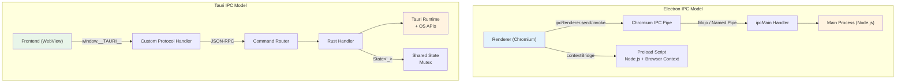
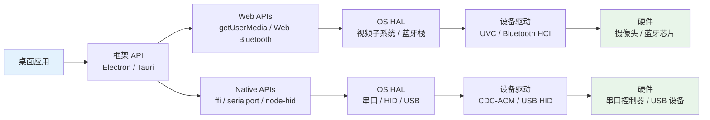
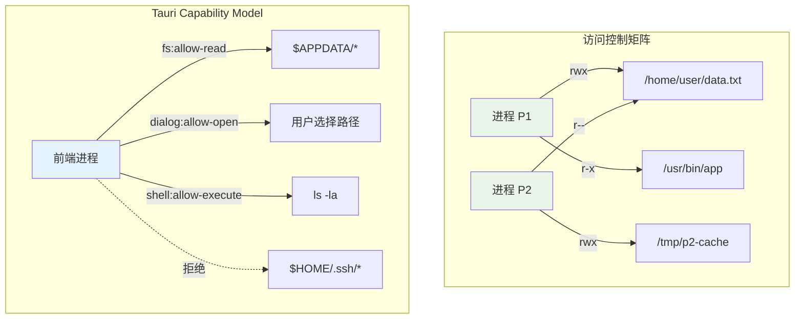

# 原生API集成：从文件系统到硬件

## 引言

桌面应用区别于 Web 应用的核心特征在于其与操作系统的深度耦合能力。一个运行在浏览器标签页中的 React 应用无法直接访问用户的文件系统、无法注册全局快捷键、无法监听系统剪贴板变化，更无法与串口设备或蓝牙外设通信。而桌面应用——无论是基于 Electron 的 Chromium 嵌入式方案，还是 Tauri 的 Rust + WebView 架构——都拥有跨越 Web 沙盒边界、直接调用操作系统原生 API 的特权。

这种特权既是桌面应用的核心竞争力，也是其工程复杂度的主要来源。开发者必须在"前端技术栈的开发效率"与"原生平台 API 的异构性"之间建立可靠的桥接层。本章从**系统 API 调用模型**的理论基础出发，形式化定义进程间通信（IPC）的语义、消息队列与共享内存的权衡、硬件访问抽象层的设计原则，以及文件系统权限模型的形式化表达。在工程实践映射中，我们将逐一剖析 Electron 的 `ipcMain`/`ipcRenderer` 与 `contextBridge`、Tauri 的 Command 系统与 State 管理、Node-ffi 与 Rust FFI 的原生模块调用、文件系统对话框与拖放 API、系统通知与剪贴板、系统托盘与全局快捷键、摄像头/麦克风/串口/蓝牙等硬件访问，以及 Shell 集成与自定义协议处理。

---

## 理论严格表述

### 2.1 桌面应用与操作系统交互的理论模型

桌面应用与操作系统的交互遵循**分层抽象模型（Layered Abstraction Model）**，从用户代码到硬件寄存器之间经过多个抽象层级。

**定义 2.1（系统调用接口，System Call Interface）**
系统调用是用户空间程序请求内核服务的唯一标准化入口。形式化为：
`Syscall: UserSpace × (Request, Args) → KernelSpace × (Response, SideEffects)`
其中 `SideEffects` 可能包括文件 I/O、网络包发送、进程创建或内存映射变更。桌面框架通过封装系统调用为高级 API，使前端开发者无需直接接触底层内核接口。

**定义 2.2（消息循环与事件分发）**
桌面应用的主线程运行一个**消息循环（Message Loop）**，持续从操作系统事件队列中拉取事件并分发给对应的处理器：

```
MessageLoop = while(true) {
  msg = GetMessage(OS_Queue)
  if (msg == Quit) break
  TranslateMessage(msg)
  DispatchMessage(msg) → WindowProc(hwnd, msg, wParam, lParam)
}
```

形式化地，消息循环是一个状态机：
`ML: State × Event → State' × Action`
其中 `State` 包含所有窗口句柄、菜单状态和全局快捷键注册表，`Event` 是操作系统生成的输入事件（键盘、鼠标、定时器、系统通知）。

**定义 2.3（窗口过程函数，Window Procedure）**
窗口过程是操作系统回调应用代码处理特定窗口事件的函数指针。形式化为：
`WindowProc: HWND × MSG × WPARAM × LPARAM → LRESULT`
跨平台框架（Electron、Tauri）将各平台的窗口过程差异封装在内部，向前端暴露统一的事件接口（如 `resize`、`focus`、`blur`）。

### 2.2 进程间通信（IPC）的形式化定义

IPC 是桌面应用架构的核心机制，因为主进程与渲染进程运行在不同的地址空间，无法直接共享对象引用。

**定义 2.4（IPC 通道的代数结构）**
IPC 通道是一个消息传递的代数结构：
`Channel = (Messages, Send, Receive, OrderingGuarantees)`

- `Messages`：可通过通道传输的消息类型集合；
- `Send: Process × Message × Channel → void`：发送操作；
- `Receive: Process × Channel → Message`：接收操作；
- `OrderingGuarantees`：通道提供的顺序保证（FIFO、因果顺序、全序）。

**定义 2.5（消息传递，Message Passing）**
消息传递通过操作系统提供的管道（Pipe）、套接字（Socket）或消息队列（Message Queue）复制数据：
`Send_MP(P₁, m, C): copy(m) → KernelBuffer → copy(m) → P₂`
其时间复杂度为 `O(|m|)`，空间复杂度为 `O(|m|)`（两份数据副本）。优势是天然的隔离性：发送方和接收方不共享地址空间，不存在数据竞争。

**定义 2.6（共享内存，Shared Memory）**
共享内存通过将同一物理内存页映射到多个进程的虚拟地址空间实现零拷贝通信：
`Shm: PhysicalPage → {VA_P₁, VA_P₂, ..., VA_Pₙ}`
`Send_SHM(P₁, m, region): memcpy(m, VA_P₁(region))`
`Receive_SHM(P₂, region): read(VA_P₂(region))`
时间复杂度为 `O(|m|)` 仅一次拷贝，但引入了同步问题，需配合信号量或互斥锁：
`Sync_SHM = (Semaphore, Mutex, AtomicOperations)`

**定义 2.7（远程过程调用，RPC）**
RPC 将跨进程通信抽象为本地函数调用：
`RPC: ClientStub(f, args) → Marshal(args) → Transport → Unmarshal → ServerStub(f, args) → Execute → Marshal(result) → Transport → Unmarshal → result`
Tauri 的 Command 系统是一种语义化的 RPC，Electron 的 `ipcRenderer.invoke` 是异步 RPC 的变体。

**IPC 机制对比**：

| 机制 | 延迟 | 吞吐量 | 同步复杂度 | 安全性 | 代表实现 |
|------|------|--------|-----------|--------|---------|
| 消息传递 | 低 | 中 | 无 | 高（内核隔离） | Electron IPC、Unix Domain Socket |
| 共享内存 | 极低 | 极高 | 高（需锁） | 中（共享地址空间） | Chromium Mojo、Boost.Interprocess |
| RPC | 中 | 中 | 低（框架处理） | 高（接口限定） | Tauri Commands、gRPC |
| 管道/命名管道 | 低 | 中 | 低 | 高 | Windows Named Pipe、FIFO |

### 2.3 硬件访问抽象层

桌面应用访问硬件设备必须通过操作系统提供的驱动程序抽象层（Driver Abstraction Layer, DAL）。

**定义 2.8（硬件访问路径）**
硬件访问的形式化路径为：
`App → FrameworkAPI → OS_HAL → DeviceDriver → HardwareRegister`
其中 `HAL`（Hardware Abstraction Layer）是操作系统内核将设备差异封装为统一接口的层级。例如：

- **摄像头**：应用通过 `MediaDevices.getUserMedia()` → OS 视频子系统 → USB Video Class (UVC) 驱动 → USB 控制器；
- **串口**：应用通过 `SerialPort` API → OS 串口子系统 → CDC-ACM 驱动 → UART 控制器；
- **蓝牙**：应用通过 Web Bluetooth API / 平台原生 API → OS Bluetooth Stack（Windows Bluetooth APIs / CoreBluetooth / BlueZ）→ HCI 驱动 → 蓝牙控制器。

**定义 2.9（权限中介模型）**
现代操作系统在硬件访问路径中插入了**权限中介（Permission Mediator）**：
`PermissionGrant: User × Device × App → {Allow, Deny, Prompt}`
首次访问摄像头、麦克风或蓝牙设备时，操作系统会弹出用户授权对话框，将敏感硬件的访问权委托给用户决策。

### 2.4 文件系统权限模型

文件系统权限模型定义了主体（进程/用户）对客体（文件/目录）的访问控制规则。

**定义 2.10（访问控制矩阵，Access Control Matrix）**
文件系统权限可形式化为访问控制矩阵：
`ACM: Subjects × Objects → 2^{Permissions}`
其中 `Permissions = {read, write, execute, delete, append}`。

在 Unix 模型中，权限被压缩为三段式表示：
`Mode = OwnerBits × GroupBits × OtherBits`
每段包含 `rwx` 三个标志位，例如 `0o755` 表示所有者可读写执行，组和其他用户可读执行。

**定义 2.11（能力列表，Capability List）**
与 ACL（访问控制列表）相对，能力列表将权限与主体绑定而非客体：
`CapList(P) = {(object, rights) | Process P has rights on object}`
Tauri 的 Capability 系统是一种能力列表的变体：前端进程被授予对特定文件路径或 Rust 命令的访问能力。

**定义 2.12（路径遍历安全）**
文件系统操作必须防御路径遍历攻击（Path Traversal）。形式化地，给定用户请求路径 `userPath` 和允许的基础目录 `baseDir`，安全条件为：
`Safe(userPath, baseDir) ⟹ normalize(resolve(baseDir, userPath)).startsWith(normalize(baseDir))`
任何违反此条件的路径都必须被拒绝。

---

## 工程实践映射

### 3.1 Electron 的 IPC 通信

Electron 的 IPC 系统建立在 Chromium 的 Mojo IPC 基础设施之上，提供主进程与渲染进程之间的双向通信能力。

#### 3.1.1 ipcMain 与 ipcRenderer

```typescript
// main.ts — 主进程 IPC 处理器
import { ipcMain, BrowserWindow, dialog } from 'electron'
import fs from 'fs/promises'
import path from 'path'

// 处理渲染进程的文件读取请求
ipcMain.handle('fs:readFile', async (_event, filePath: string) => {
  // 路径安全检查
  const userDataPath = app.getPath('userData')
  const resolvedPath = path.resolve(filePath)

  if (!resolvedPath.startsWith(userDataPath)) {
    throw new Error('Access denied: path outside allowed directory')
  }

  const content = await fs.readFile(resolvedPath, 'utf-8')
  return content
})

// 处理带进度回调的文件复制
ipcMain.handle('fs:copyFile', async (event, source: string, dest: string) => {
  const stat = await fs.stat(source)
  const totalSize = stat.size
  let copiedSize = 0

  const readStream = fs.createReadStream(source)
  const writeStream = fs.createWriteStream(dest)

  readStream.on('data', (chunk) => {
    copiedSize += chunk.length
    const progress = Math.round((copiedSize / totalSize) * 100)
    // 向发送方发送进度更新
    event.sender.send('fs:copyProgress', { progress, source, dest })
  })

  await new Promise<void>((resolve, reject) => {
    writeStream.on('finish', resolve)
    writeStream.on('error', reject)
    readStream.pipe(writeStream)
  })

  return { success: true, bytesCopied: totalSize }
})

// 打开文件对话框
ipcMain.handle('dialog:openFile', async (_event, options) => {
  const result = await dialog.showOpenDialog({
    properties: ['openFile', 'multiSelections'],
    filters: [
      { name: 'Documents', extensions: ['pdf', 'docx', 'txt'] },
      { name: 'All Files', extensions: ['*'] }
    ],
    ...options
  })
  return result.filePaths
})

// 保存文件对话框
ipcMain.handle('dialog:saveFile', async (_event, options) => {
  const result = await dialog.showSaveDialog({
    filters: [
      { name: 'JSON', extensions: ['json'] },
      { name: 'Text', extensions: ['txt'] }
    ],
    ...options
  })
  return result.filePath
})
```

```typescript
// preload.ts — Preload 脚本的安全桥接
import { contextBridge, ipcRenderer } from 'electron'

export interface ElectronAPI {
  readFile: (path: string) => Promise<string>
  copyFile: (source: string, dest: string) => Promise<{ success: boolean; bytesCopied: number }>
  openFile: (options?: Record<string, unknown>) => Promise<string[]>
  saveFile: (options?: Record<string, unknown>) => Promise<string | undefined>
  onCopyProgress: (callback: (data: { progress: number; source: string; dest: string }) => void) => () => void
}

const api: ElectronAPI = {
  readFile: (path) => ipcRenderer.invoke('fs:readFile', path),
  copyFile: (source, dest) => ipcRenderer.invoke('fs:copyFile', source, dest),
  openFile: (options) => ipcRenderer.invoke('dialog:openFile', options),
  saveFile: (options) => ipcRenderer.invoke('dialog:saveFile', options),
  onCopyProgress: (callback) => {
    const handler = (_event: Electron.IpcRendererEvent, data: Parameters<typeof callback>[0]) => callback(data)
    ipcRenderer.on('fs:copyProgress', handler)
    return () => ipcRenderer.removeListener('fs:copyProgress', handler)
  }
}

contextBridge.exposeInMainWorld('electronAPI', api)
```

```typescript
// renderer.ts — 渲染进程调用示例
async function loadDocument(): Promise<void> {
  try {
    const paths = await window.electronAPI.openFile({
      defaultPath: app.getPath('documents')
    })
    if (paths.length > 0) {
      const content = await window.electronAPI.readFile(paths[0])
      document.getElementById('editor')!.textContent = content
    }
  } catch (err) {
    console.error('Failed to load document:', err)
  }
}

// 监听复制进度
const unsubscribe = window.electronAPI.onCopyProgress(({ progress, source, dest }) => {
  console.log(`Copying ${source} → ${dest}: ${progress}%`)
  updateProgressBar(progress)
})

// 组件卸载时取消订阅
// unsubscribe()
```

#### 3.1.2 基于 EventEmitter 的多窗口广播

```typescript
// main.ts — 多窗口状态同步
import { ipcMain, BrowserWindow } from 'electron'

// 向所有渲染进程广播主题变更
ipcMain.on('theme:changed', (_event, theme: 'light' | 'dark') => {
  BrowserWindow.getAllWindows().forEach((win) => {
    if (win.webContents.id !== _event.sender.id) {
      win.webContents.send('theme:update', theme)
    }
  })
})

// 窗口间直接通信（通过主进程中继）
ipcmain.handle('window:sendTo', async (_event, targetWindowId: number, channel: string, ...args: unknown[]) => {
  const target = BrowserWindow.fromId(targetWindowId)
  if (target && !target.isDestroyed()) {
    target.webContents.send(channel, ...args)
    return { success: true }
  }
  return { success: false, error: 'Target window not found' }
})
```

### 3.2 Tauri 的 Command 系统与 State 管理

Tauri 的 IPC 模型基于 JSON-RPC，前端通过 `invoke` 调用 Rust 后端暴露的 Command。

#### 3.2.1 Command 定义与调用

```rust
// src-tauri/src/lib.rs
use tauri::{State, Manager, AppHandle};
use serde::{Serialize, Deserialize};
use std::sync::Mutex;

/// 应用状态：跨 Command 调用的共享数据
struct AppState {
    document_cache: Mutex<std::collections::HashMap<String, String>>,
    settings: Mutex<AppSettings>,
}

#[derive(Default)]
struct AppSettings {
    auto_save: bool,
    theme: String,
}

/// 读取文件的 Tauri Command
#[tauri::command]
async fn read_file(
    path: String,
    app: AppHandle,
    state: State<'_, AppState>
) -> Result<String, String> {
    // 路径安全检查
    let app_data = app.path().app_data_dir()
        .map_err(|e| e.to_string())?;
    let target = std::path::Path::new(&path).canonicalize()
        .map_err(|e| e.to_string())?;

    if !target.starts_with(&app_data) {
        return Err("Path traversal detected".to_string());
    }

    // 检查缓存
    let cache = state.document_cache.lock().unwrap();
    if let Some(content) = cache.get(&path) {
        return Ok(content.clone());
    }
    drop(cache);

    // 读取文件
    let content = std::fs::read_to_string(&target)
        .map_err(|e| e.to_string())?;

    // 写入缓存
    let mut cache = state.document_cache.lock().unwrap();
    cache.insert(path, content.clone());

    Ok(content)
}

/// 写入文件并可选地更新缓存
#[tauri::command]
async fn write_file(
    path: String,
    content: String,
    app: AppHandle,
    state: State<'_, AppState>
) -> Result<(), String> {
    let app_data = app.path().app_data_dir()
        .map_err(|e| e.to_string())?;
    let target = app_data.join(&path);

    // 确保目标路径在允许范围内
    if !target.starts_with(&app_data) {
        return Err("Invalid path".to_string());
    }

    std::fs::write(&target, &content)
        .map_err(|e| e.to_string())?;

    // 更新缓存
    let mut cache = state.document_cache.lock().unwrap();
    cache.insert(path, content);

    Ok(())
}

/// 获取应用设置
#[tauri::command]
fn get_settings(state: State<'_, AppState>) -> AppSettings {
    let settings = state.settings.lock().unwrap();
    AppSettings {
        auto_save: settings.auto_save,
        theme: settings.theme.clone(),
    }
}

/// 更新应用设置
#[tauri::command]
fn update_settings(
    settings: AppSettings,
    state: State<'_, AppState>
) -> Result<(), String> {
    let mut current = state.settings.lock().unwrap();
    *current = settings;
    Ok(())
}

#[cfg_attr(mobile, tauri::mobile_entry_point)]
pub fn run() {
    tauri::Builder::default()
        .manage(AppState {
            document_cache: Mutex::new(std::collections::HashMap::new()),
            settings: Mutex::new(AppSettings::default()),
        })
        .invoke_handler(tauri::generate_handler![
            read_file,
            write_file,
            get_settings,
            update_settings,
        ])
        .run(tauri::generate_context!())
        .expect("error while running tauri application");
}
```

```typescript
// frontend/api.ts — 前端 Tauri API 封装
import { invoke } from '@tauri-apps/api/core'

export interface AppSettings {
  autoSave: boolean
  theme: string
}

export async function readFile(path: string): Promise<string> {
  return invoke<string>('read_file', { path })
}

export async function writeFile(path: string, content: string): Promise<void> {
  return invoke('write_file', { path, content })
}

export async function getSettings(): Promise<AppSettings> {
  return invoke<AppSettings>('get_settings')
}

export async function updateSettings(settings: AppSettings): Promise<void> {
  return invoke('update_settings', { settings })
}
```

#### 3.2.2 事件系统与前端订阅

```rust
// src-tauri/src/events.rs
use tauri::Emitter;

/// 向所有前端窗口广播进度事件
pub fn emit_progress<R: tauri::Runtime>(
    handle: &tauri::AppHandle<R>,
    progress: u32,
    message: &str
) {
    handle.emit("progress-update", serde_json::json!({
        "progress": progress,
        "message": message,
        "timestamp": chrono::Utc::now().to_rfc3339(),
    })).ok();
}
```

```typescript
// frontend/events.ts — 前端事件监听
import { listen, UnlistenFn } from '@tauri-apps/api/event'

export interface ProgressEvent {
  progress: number
  message: string
  timestamp: string
}

export async function onProgress(
  callback: (event: ProgressEvent) => void
): Promise<UnlistenFn> {
  return listen<ProgressEvent>('progress-update', (event) => {
    callback(event.payload)
  })
}

// 使用示例
const unlisten = await onProgress((data) => {
  console.log(`[${data.timestamp}] ${data.message}: ${data.progress}%`)
})

// 取消监听
// unlisten()
```

### 3.3 原生模块调用：Node-ffi 与 Rust FFI

当 Electron 或 Tauri 的内置 API 无法满足需求时，可通过 FFI（Foreign Function Interface）调用原生动态库。

#### 3.3.1 Node-ffi-napi（Electron）

```typescript
// native-bridge.ts — Electron 通过 ffi-napi 调用原生库
import ffi from 'ffi-napi'
import ref from 'ref-napi'

// 加载系统库：例如 Windows 的 user32.dll 获取窗口标题
const user32 = ffi.Library('user32', {
  'GetWindowTextA': ['int', ['long', 'pointer', 'int']],
  'FindWindowA': ['long', ['string', 'string']],
  'SetWindowPos': ['bool', ['long', 'long', 'int', 'int', 'int', 'int', 'uint']],
})

export function getWindowTitle(className: string | null, windowName: string): string {
  const hwnd = user32.FindWindowA(className, windowName)
  if (hwnd === 0) {
    throw new Error(`Window not found: ${windowName}`)
  }

  const buf = Buffer.alloc(256)
  user32.GetWindowTextA(hwnd, buf, 256)
  return buf.toString('utf8').replace(/\0/g, '')
}

// 调用自定义原生库（例如硬件设备 SDK）
const deviceSDK = ffi.Library('./libdevice_sdk', {
  'device_init': ['int', []],
  'device_read': ['int', ['pointer', 'int', 'pointer']],
  'device_close': ['void', []],
})

export interface DeviceData {
  temperature: number
  humidity: number
  status: number
}

export function readDeviceData(): DeviceData {
  const buffer = Buffer.alloc(12)
  const result = deviceSDK.device_read(buffer, 12, ref.NULL)

  if (result !== 0) {
    throw new Error(`Device read failed with code: ${result}`)
  }

  return {
    temperature: buffer.readFloatLE(0),
    humidity: buffer.readFloatLE(4),
    status: buffer.readInt32LE(8),
  }
}
```

#### 3.3.2 Rust FFI（Tauri）

```rust
// src-tauri/src/hardware.rs
use std::ffi::{c_char, c_int, CStr};
use std::os::raw::c_void;

#[repr(C)]
pub struct DeviceData {
    pub temperature: f32,
    pub humidity: f32,
    pub status: i32,
}

// 声明外部 C 库函数
#[link(name = "device_sdk")]
extern "C" {
    fn device_init() -> c_int;
    fn device_read(buffer: *mut c_void, len: c_int, userdata: *mut c_void) -> c_int;
    fn device_close();
    fn device_get_version() -> *const c_char;
}

pub struct DeviceHandle;

impl DeviceHandle {
    pub fn new() -> Result<Self, String> {
        let result = unsafe { device_init() };
        if result != 0 {
            return Err(format!("Device init failed: {}", result));
        }
        Ok(DeviceHandle)
    }

    pub fn read_data(&self) -> Result<DeviceData, String> {
        let mut data: DeviceData = unsafe { std::mem::zeroed() };
        let result = unsafe {
            device_read(
                &mut data as *mut _ as *mut c_void,
                std::mem::size_of::<DeviceData>() as c_int,
                std::ptr::null_mut()
            )
        };

        if result != 0 {
            return Err(format!("Device read failed: {}", result));
        }

        Ok(data)
    }

    pub fn version(&self) -> String {
        unsafe {
            let ptr = device_get_version();
            if ptr.is_null() {
                return "unknown".to_string();
            }
            CStr::from_ptr(ptr).to_string_lossy().into_owned()
        }
    }
}

impl Drop for DeviceHandle {
    fn drop(&mut self) {
        unsafe { device_close() }
    }
}

// 暴露为 Tauri Command
#[tauri::command]
pub async fn read_hardware_device() -> Result<DeviceData, String> {
    let device = DeviceHandle::new()?;
    device.read_data()
}
```

### 3.4 文件系统操作

#### 3.4.1 文件对话框与拖放

```typescript
// electron/file-operations.ts
import { dialog, ipcMain, BrowserWindow } from 'electron'
import fs from 'fs/promises'
import path from 'path'

// 打开目录对话框
ipcMain.handle('dialog:openDirectory', async () => {
  const result = await dialog.showOpenDialog({
    properties: ['openDirectory', 'createDirectory'],
    title: '选择工作目录'
  })
  return result.filePaths[0]
})

// 文件拖放支持：在 HTML 中设置 draggable 区域后，
// 需要在主进程处理拖放路径（macOS 需要特殊处理）
ipcMain.handle('app:getPath', (_event, name: string) => {
  return app.getPath(name as any)
})
```

```html
<!-- renderer/index.html — 拖放区域示例 -->
<!DOCTYPE html>
<html>
<head>
  <style>
    #drop-zone {
      border: 2px dashed #ccc;
      border-radius: 8px;
      padding: 40px;
      text-align: center;
      transition: all 0.3s;
    }
    #drop-zone.drag-over {
      border-color: #4a90d9;
      background: #f0f7ff;
    }
  </style>
</head>
<body>
  <div id="drop-zone">
    <p>拖拽文件到此处</p>
  </div>
  <script>
    const dropZone = document.getElementById('drop-zone')

    // 阻止默认拖放行为
    dropZone.addEventListener('dragover', (e) => {
      e.preventDefault()
      e.stopPropagation()
      dropZone.classList.add('drag-over')
    })

    dropZone.addEventListener('dragleave', () => {
      dropZone.classList.remove('drag-over')
    })

    dropZone.addEventListener('drop', async (e) => {
      e.preventDefault()
      e.stopPropagation()
      dropZone.classList.remove('drag-over')

      // Electron 中可通过 dataTransfer.files 获取文件路径
      const files = Array.from(e.dataTransfer.files)
      for (const file of files) {
        console.log('Dropped file:', file.path)
        // 调用 IPC 读取文件内容
        const content = await window.electronAPI.readFile(file.path)
        console.log('Content length:', content.length)
      }
    })
  </script>
</body>
</html>
```

#### 3.4.2 Tauri 的文件系统插件

```typescript
// tauri/file-operations.ts
import { open, save } from '@tauri-apps/plugin-dialog'
import { readTextFile, writeTextFile, readDir, BaseDirectory } from '@tauri-apps/plugin-fs'

export async function pickAndReadFile(): Promise<{ path: string; content: string } | null> {
  const selected = await open({
    multiple: false,
    directory: false,
    filters: [
      { name: 'Text', extensions: ['txt', 'md'] },
      { name: 'JSON', extensions: ['json'] }
    ]
  })

  if (!selected) return null

  // 在 Tauri 2.x 中，open 返回路径字符串
  const path = selected as string
  const content = await readTextFile(path)
  return { path, content }
}

export async function saveToAppData(filename: string, content: string): Promise<void> {
  // 写入应用的 AppData 目录，无需用户交互
  await writeTextFile(filename, content, {
    baseDir: BaseDirectory.AppData
  })
}

export async function listAppDocuments(): Promise<string[]> {
  const entries = await readDir('', { baseDir: BaseDirectory.Document })
  return entries
    .filter(e => e.isFile)
    .map(e => e.name)
}
```

### 3.5 系统通知

#### 3.5.1 Electron 通知

```typescript
// electron/notifications.ts
import { Notification, ipcMain } from 'electron'

// 注册 IPC 处理器
ipcMain.handle('notification:show', (_event, options) => {
  const notification = new Notification({
    title: options.title || '通知',
    body: options.body || '',
    icon: options.icon || './assets/icon.png',
    silent: options.silent || false,
    urgency: options.urgency || 'normal',  // Linux
    actions: options.actions || [],         // macOS
    replyPlaceholder: options.replyPlaceholder || '',  // macOS inline reply
  })

  notification.on('click', () => {
    // 用户点击通知时激活窗口
    const win = BrowserWindow.getFocusedWindow()
    if (win) {
      if (win.isMinimized()) win.restore()
      win.focus()
    }
  })

  notification.on('reply', (_event, reply) => {
    // macOS 内联回复
    console.log('User replied:', reply)
  })

  notification.show()
  return { id: notification.constructor.name }
})

// 请求通知权限（macOS 需要）
ipcMain.handle('notification:requestPermission', () => {
  return Notification.isSupported()
})
```

#### 3.5.2 Tauri 通知

```typescript
// tauri/notifications.ts
import { isPermissionGranted, requestPermission, sendNotification } from '@tauri-apps/plugin-notification'

export async function initializeNotifications(): Promise<boolean> {
  let permissionGranted = await isPermissionGranted()

  if (!permissionGranted) {
    const permission = await requestPermission()
    permissionGranted = permission === 'granted'
  }

  return permissionGranted
}

export function showNotification(title: string, body: string, icon?: string): void {
  sendNotification({
    title,
    body,
    icon,
    // Tauri 2.x 支持的动作按钮
    actions: [
      { action: 'open', title: '打开' },
      { action: 'dismiss', title: '忽略' }
    ]
  })
}
```

### 3.6 剪贴板操作

```typescript
// electron/clipboard.ts
import { clipboard, ipcMain } from 'electron'

ipcMain.handle('clipboard:readText', () => {
  return clipboard.readText()
})

ipcMain.handle('clipboard:writeText', (_event, text: string) => {
  clipboard.writeText(text)
})

ipcMain.handle('clipboard:readImage', () => {
  const image = clipboard.readImage()
  return image.toDataURL()  // 返回 base64 编码的 Data URL
})

ipcMain.handle('clipboard:writeHtml', (_event, html: string, text?: string) => {
  clipboard.write({
    text: text || html.replace(/<[^>]*>/g, ''),
    html: html
  })
})
```

```typescript
// tauri/clipboard.ts
import { readText, writeText, readImage, writeImage } from '@tauri-apps/plugin-clipboard-manager'

export async function getClipboardText(): Promise<string> {
  return readText()
}

export async function setClipboardText(text: string): Promise<void> {
  return writeText(text)
}

export async function getClipboardImage(): Promise<Uint8Array | null> {
  const image = await readImage()
  return image?.toArray?.() || null
}
```

### 3.7 系统托盘

#### 3.7.1 Electron Tray API

```typescript
// electron/tray.ts
import { Tray, Menu, app, nativeImage } from 'electron'
import path from 'path'

let tray: Tray | null = null

export function createTray(mainWindow: BrowserWindow): void {
  const iconPath = path.join(__dirname, '../assets/tray-icon.png')
  const icon = nativeImage.createFromPath(iconPath)

  // macOS 上需要调整模板图标尺寸
  const trayIcon = process.platform === 'darwin'
    ? icon.resize({ width: 16, height: 16 }).setTemplateImage(true)
    : icon.resize({ width: 16, height: 16 })

  tray = new Tray(trayIcon)

  const contextMenu = Menu.buildFromTemplate([
    {
      label: '显示主窗口',
      click: () => {
        mainWindow.show()
        if (mainWindow.isMinimized()) mainWindow.restore()
        mainWindow.focus()
      }
    },
    {
      label: '新建文档',
      accelerator: 'CmdOrCtrl+N',
      click: () => {
        mainWindow.webContents.send('menu:new-document')
      }
    },
    { type: 'separator' },
    {
      label: '开始专注模式',
      type: 'checkbox',
      checked: false,
      click: (menuItem) => {
        mainWindow.webContents.send('menu:focus-mode', menuItem.checked)
      }
    },
    { type: 'separator' },
    {
      label: '退出',
      accelerator: 'CmdOrCtrl+Q',
      click: () => {
        app.quit()
      }
    }
  ])

  tray.setContextMenu(contextMenu)
  tray.setToolTip('My Desktop App')

  // macOS / Windows：单击托盘图标切换窗口
  tray.on('click', () => {
    if (mainWindow.isVisible()) {
      mainWindow.hide()
    } else {
      mainWindow.show()
      mainWindow.focus()
    }
  })

  // macOS：双击托盘图标
  tray.on('double-click', () => {
    mainWindow.show()
    mainWindow.focus()
  })

  // 显示气球提示（Windows）
  if (process.platform === 'win32') {
    tray.displayBalloon({
      iconType: 'info',
      title: '应用已最小化到托盘',
      content: '点击托盘图标可恢复窗口'
    })
  }
}

export function updateTrayTooltip(text: string): void {
  tray?.setToolTip(text)
}
```

#### 3.7.2 Tauri 托盘

```rust
// src-tauri/src/tray.rs
use tauri::{
    tray::{MouseButton, MouseButtonState, TrayIconBuilder, TrayIconEvent},
    Manager, Runtime,
};

pub fn setup_tray<R: Runtime>(app: &tauri::AppHandle<R>) -> Result<(), Box<dyn std::error::Error>> {
    let tray = TrayIconBuilder::new()
        .icon(app.default_window_icon().unwrap().clone())
        .tooltip("My Tauri App")
        .menu(&tauri::menu::Menu::new(app)?)
        .on_menu_event(|app, event| {
            match event.id.as_ref() {
                "show" => {
                    if let Some(window) = app.get_webview_window("main") {
                        let _ = window.show();
                        let _ = window.set_focus();
                    }
                }
                "quit" => {
                    app.exit(0);
                }
                _ => {}
            }
        })
        .on_tray_icon_event(|tray, event| {
            if let TrayIconEvent::Click {
                button: MouseButton::Left,
                button_state: MouseButtonState::Up,
                ..
            } = event
            {
                let app = tray.app_handle();
                if let Some(window) = app.get_webview_window("main") {
                    let _ = window.show();
                    let _ = window.set_focus();
                }
            }
        })
        .build(app)?;

    Ok(())
}
```

### 3.8 全局快捷键

#### 3.8.1 Electron globalShortcut

```typescript
// electron/shortcuts.ts
import { globalShortcut, ipcMain, BrowserWindow } from 'electron'

export function registerGlobalShortcuts(mainWindow: BrowserWindow): void {
  // 注册显示/隐藏窗口的全局快捷键
  const ret = globalShortcut.register('CommandOrControl+Shift+X', () => {
    if (mainWindow.isVisible()) {
      mainWindow.hide()
    } else {
      mainWindow.show()
      mainWindow.focus()
    }
  })

  if (!ret) {
    console.error('Global shortcut registration failed')
  }

  // 截图快捷键
  globalShortcut.register('CommandOrControl+Shift+S', () => {
    mainWindow.webContents.send('shortcut:screenshot')
  })

  // 快速搜索
  globalShortcut.register('CommandOrControl+Shift+F', () => {
    mainWindow.show()
    mainWindow.focus()
    mainWindow.webContents.send('shortcut:quick-search')
  })
}

export function unregisterAllShortcuts(): void {
  globalShortcut.unregisterAll()
}
```

#### 3.8.2 Tauri 全局快捷键

```rust
// src-tauri/src/shortcuts.rs
use tauri::{Emitter, Manager, Runtime};
use tauri_plugin_global_shortcut::{GlobalShortcutExt, Shortcut};

pub fn setup_shortcuts<R: Runtime>(app: &tauri::AppHandle<R>) -> Result<(), Box<dyn std::error::Error>> {
    app.handle().plugin(
        tauri_plugin_global_shortcut::Builder::new()
            .with_handler(|app, shortcut, event| {
                if event.state == tauri_plugin_global_shortcut::ShortcutState::Pressed {
                    match shortcut {
                        Shortcut::new(Some(tauri::KeyboardModifier::CONTROL), tauri::Code::KeyX) => {
                            if let Some(window) = app.get_webview_window("main") {
                                let is_visible = window.is_visible().unwrap_or(false);
                                if is_visible {
                                    let _ = window.hide();
                                } else {
                                    let _ = window.show();
                                    let _ = window.set_focus();
                                }
                            }
                        }
                        _ => {}
                    }
                }
            })
            .build()
    )?;

    // 注册快捷键
    let shortcut = Shortcut::new(Some(tauri::KeyboardModifier::CONTROL), tauri::Code::KeyX);
    app.global_shortcut().register(shortcut)?;

    Ok(())
}
```

### 3.9 硬件访问

#### 3.9.1 摄像头与麦克风

```typescript
// electron/media.ts
import { ipcMain, desktopCapturer, systemPreferences } from 'electron'

// macOS 需要请求媒体权限
ipcMain.handle('media:requestCamera', async () => {
  if (process.platform === 'darwin') {
    const status = systemPreferences.getMediaAccessStatus('camera')
    if (status !== 'granted') {
      const granted = await systemPreferences.askForMediaAccess('camera')
      return granted
    }
    return true
  }
  return true
})

ipcMain.handle('media:requestMicrophone', async () => {
  if (process.platform === 'darwin') {
    const status = systemPreferences.getMediaAccessStatus('microphone')
    if (status !== 'granted') {
      return await systemPreferences.askForMediaAccess('microphone')
    }
    return true
  }
  return true
})

// 获取屏幕共享源（用于屏幕录制或共享）
ipcMain.handle('media:getScreenSources', async () => {
  const sources = await desktopCapturer.getSources({
    types: ['window', 'screen'],
    thumbnailSize: { width: 320, height: 240 }
  })

  return sources.map(source => ({
    id: source.id,
    name: source.name,
    thumbnail: source.thumbnail.toDataURL()
  }))
})
```

```typescript
// renderer/media.ts — 前端调用 Web APIs
async function startVideoStream(): Promise<void> {
  const granted = await window.electronAPI.requestCamera()
  if (!granted) {
    alert('Camera permission denied')
    return
  }

  const stream = await navigator.mediaDevices.getUserMedia({
    video: { width: 1280, height: 720 },
    audio: false
  })

  const video = document.getElementById('camera') as HTMLVideoElement
  video.srcObject = stream
  video.play()
}

async function startScreenShare(): Promise<void> {
  const sources = await window.electronAPI.getScreenSources()
  // 显示源选择 UI
  const selectedId = await showSourcePicker(sources)

  const stream = await (navigator.mediaDevices as any).getUserMedia({
    audio: false,
    video: {
      mandatory: {
        chromeMediaSource: 'desktop',
        chromeMediaSourceId: selectedId
      }
    }
  })

  const video = document.getElementById('screen') as HTMLVideoElement
  video.srcObject = stream
  video.play()
}
```

#### 3.9.2 串口通信

```typescript
// electron/serialport.ts
import { ipcMain } from 'electron'
import { SerialPort } from 'serialport'

const activePorts = new Map<string, SerialPort>()

ipcMain.handle('serial:list', async () => {
  const ports = await SerialPort.list()
  return ports.map(p => ({
    path: p.path,
    manufacturer: p.manufacturer,
    serialNumber: p.serialNumber,
    vendorId: p.vendorId,
    productId: p.productId
  }))
})

ipcMain.handle('serial:open', async (_event, path: string, options) => {
  const port = new SerialPort({
    path,
    baudRate: options.baudRate || 9600,
    dataBits: options.dataBits || 8,
    stopBits: options.stopBits || 1,
    parity: options.parity || 'none',
    autoOpen: false
  })

  await new Promise<void>((resolve, reject) => {
    port.open((err) => {
      if (err) reject(err)
      else resolve()
    })
  })

  // 数据接收处理
  const parser = port.pipe(new ReadlineParser({ delimiter: '\r\n' }))
  parser.on('data', (line: string) => {
    _event.sender.send('serial:data', { path, data: line })
  })

  activePorts.set(path, port)
  return { success: true, path }
})

ipcMain.handle('serial:write', async (_event, path: string, data: string) => {
  const port = activePorts.get(path)
  if (!port) throw new Error(`Port ${path} not open`)

  return new Promise<void>((resolve, reject) => {
    port.write(data + '\r\n', (err) => {
      if (err) reject(err)
      else port.drain(() => resolve())
    })
  })
})

ipcMain.handle('serial:close', async (_event, path: string) => {
  const port = activePorts.get(path)
  if (port) {
    await new Promise<void>((resolve) => port.close(() => resolve()))
    activePorts.delete(path)
  }
  return { success: true }
})
```

#### 3.9.3 蓝牙（Web Bluetooth API）

```typescript
// renderer/bluetooth.ts — 前端通过 Web Bluetooth 访问

interface BluetoothDeviceInfo {
  id: string
  name: string | undefined
  connected: boolean
}

export async function scanBluetoothDevices(): Promise<BluetoothDeviceInfo[]> {
  try {
    const device = await (navigator as any).bluetooth.requestDevice({
      acceptAllDevices: true,
      optionalServices: ['battery_service', 'device_information']
    })

    const server = await device.gatt.connect()

    // 读取电池服务
    const batteryService = await server.getPrimaryService('battery_service')
    const batteryLevel = await batteryService.getCharacteristic('battery_level')
    const value = await batteryLevel.readValue()
    console.log('Battery level:', value.getUint8(0))

    return [{
      id: device.id,
      name: device.name,
      connected: device.gatt.connected
    }]
  } catch (error) {
    console.error('Bluetooth error:', error)
    return []
  }
}
```

### 3.10 Shell 集成

#### 3.10.1 自定义协议处理（Deep Linking）

```typescript
// electron/deep-link.ts
import { app, ipcMain } from 'electron'

const PROTOCOL = 'myapp'

export function registerProtocolHandler(): void {
  if (process.defaultApp) {
    if (process.argv.length >= 2) {
      app.setAsDefaultProtocolClient(PROTOCOL, process.execPath, [path.resolve(process.argv[1])])
    }
  } else {
    app.setAsDefaultProtocolClient(PROTOCOL)
  }
}

// macOS / Linux：处理已运行实例的协议打开
app.on('open-url', (event, url) => {
  event.preventDefault()
  handleDeepLink(url)
})

// Windows：处理第二个实例启动
const gotTheLock = app.requestSingleInstanceLock()
if (!gotTheLock) {
  app.quit()
} else {
  app.on('second-instance', (_event, commandLine) => {
    const deepLink = commandLine.find(arg => arg.startsWith(`${PROTOCOL}://`))
    if (deepLink) {
      handleDeepLink(deepLink)
    }

    // 激活主窗口
    const win = BrowserWindow.getAllWindows()[0]
    if (win) {
      if (win.isMinimized()) win.restore()
      win.focus()
    }
  })
}

function handleDeepLink(url: string): void {
  const parsed = new URL(url)
  const action = parsed.hostname  // e.g., "open", "auth"
  const params = Object.fromEntries(parsed.searchParams)

  // 向渲染进程发送深度链接数据
  const win = BrowserWindow.getAllWindows()[0]
  if (win) {
    win.webContents.send('deep-link', { action, params })
  }
}

// 处理 OAuth 回调示例
// myapp://auth?token=abc123&refresh=xyz789
```

#### 3.10.2 文件关联

```yaml
# electron-builder.yml — 文件关联配置
fileAssociations:
  - ext: mydoc
    name: MyApp Document
    description: MyApp 文档格式
    icon: build/icons/mydoc.ico
    role: Editor
    isPackage: false
  - ext: myproj
    name: MyApp Project
    description: MyApp 项目文件
    icon: build/icons/myproj.ico
    role: Editor

# macOS 额外配置
extendInfo:
  CFBundleDocumentTypes:
    - CFBundleTypeName: MyApp Document
      CFBundleTypeExtensions: [mydoc]
      CFBundleTypeIconFile: mydoc.icns
      CFBundleTypeRole: Editor
      LSHandlerRank: Owner
```

```typescript
// electron/file-association.ts
import { app, ipcMain } from 'electron'

// 获取启动时传入的文件路径
export function getOpenedFile(): string | null {
  const filePath = process.argv.find(arg => arg.endsWith('.mydoc') || arg.endsWith('.myproj'))
  return filePath || null
}

// macOS：通过 open-file 事件接收文件
app.on('open-file', (event, path) => {
  event.preventDefault()
  const win = BrowserWindow.getAllWindows()[0]
  if (win) {
    win.webContents.send('file-opened', path)
  }
})

// Windows / Linux：在 argv 中解析
ipcMain.handle('app:getOpenedFile', () => {
  return getOpenedFile()
})
```

---

## Mermaid 图表

### 图表 1：IPC 通信架构对比



### 图表 2：硬件访问抽象层



### 图表 3：文件系统权限模型



---

## 理论要点总结

1. **IPC 是桌面架构的枢轴**：主进程与渲染进程之间的所有通信都必须通过明确定义的 IPC 通道完成。Electron 的消息传递模型与 Tauri 的 JSON-RPC Command 系统虽然实现不同，但遵循相同的理论原则——将跨进程调用抽象为受控的、可审计的接口。

2. **共享内存与消息传递存在根本权衡**：共享内存提供最低延迟和最高吞吐量，但引入同步复杂度和安全风险；消息传递（如 Electron IPC、Tauri Commands）天然隔离但存在序列化开销。生产级应用应根据数据量和安全要求选择合适机制。

3. **硬件访问必须遵循"权限中介"原则**：现代操作系统在所有敏感硬件访问路径中插入了用户授权对话框。桌面应用不应假设硬件始终可用，而应在设计时处理权限拒绝、设备断开和状态竞争。

4. **文件系统操作的安全底线是路径规范化**：路径遍历攻击（`../../../etc/passwd`）是最常见且危险的文件系统漏洞。所有涉及用户输入路径的操作必须经过 `resolve` + `normalize` + `startsWith(baseDir)` 的三重验证。

5. **FFI 是突破框架边界的双刃剑**：Node-ffi 和 Rust FFI 使桌面应用能够复用海量的 C/C++ 原生库，但同时也引入了内存不安全代码和平台依赖。FFI 边界应被严格限制在隔离模块中，并辅以完善的错误处理和资源释放机制。

6. **Shell 集成（Deep Link + 文件关联）是桌面应用的原生身份标识**：通过自定义协议处理和文件扩展名关联，桌面应用能够从浏览器、邮件和其他应用中接收外部调用，实现真正的操作系统级集成。

---

## 参考资源

### 官方文档

- [Electron IPC Documentation](https://www.electronjs.org/docs/latest/tutorial/ipc) — Electron 官方 IPC 指南，涵盖 ipcMain、ipcRenderer、contextBridge 与模式化 IPC 的最佳实践。
- [Tauri Commands Documentation](https://tauri.app/develop/calling-rust/) — Tauri 2.x Command 系统文档，包含 State 管理、错误处理、前端调用与事件系统的完整参考。
- [Node.js fs Documentation](https://nodejs.org/api/fs.html) — Node.js 文件系统模块 API 参考，涵盖 `fs/promises`、`fs.createReadStream` 和权限标志的完整说明。
- [W3C Notification API](https://www.w3.org/TR/notifications/) — Web Notification 标准规范，定义了跨平台通知的语义、权限模型和事件接口。

### 框架与工具

- [Electron Tray API](https://www.electronjs.org/docs/latest/api/tray) — 系统托盘图标、上下文菜单与气球提示的完整 API 文档。
- [Tauri Global Shortcut Plugin](https://tauri.app/plugin/global-shortcut/) — Tauri 2.x 全局快捷键插件文档，包含注册、注销与平台差异说明。
- [serialport/node-serialport](https://serialport.io/docs/) — Node.js 串口通信库文档，支持 Windows/macOS/Linux 的串口列表、打开、读写与事件处理。
- [Web Bluetooth API](https://webbluetoothcg.github.io/web-bluetooth/) — W3C Web Bluetooth 社区组规范，定义了浏览器和 WebView 中蓝牙设备的发现、连接与 GATT 服务访问接口。

### 学术与标准

- [Stevens, W. R. "Advanced Programming in the UNIX Environment"](https://www.apuebook.com/) — UNIX 环境高级编程经典教材，第 15-17 章深入讲解了管道、消息队列、共享内存和信号量的 IPC 机制。
- [Microsoft Docs: Windows IPC](https://learn.microsoft.com/en-us/windows/win32/ipc/interprocess-communications) — Windows 官方 IPC 文档，涵盖命名管道、邮槽、共享内存和 RPC 的底层实现。
- [Rust FFI Omnibus](http://jakegoulding.com/rust-ffi-omnibus/) — Rust FFI 综合指南，提供 Rust 与 C/C++、Python、Ruby 等语言互操作的详细示例和最佳实践。
