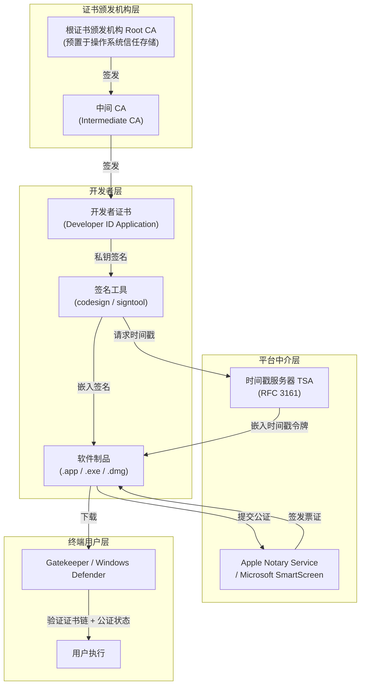
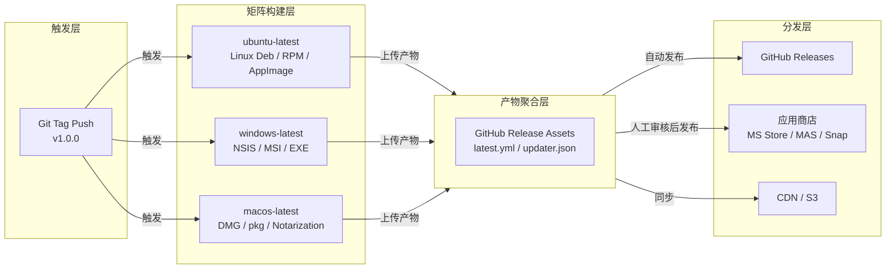
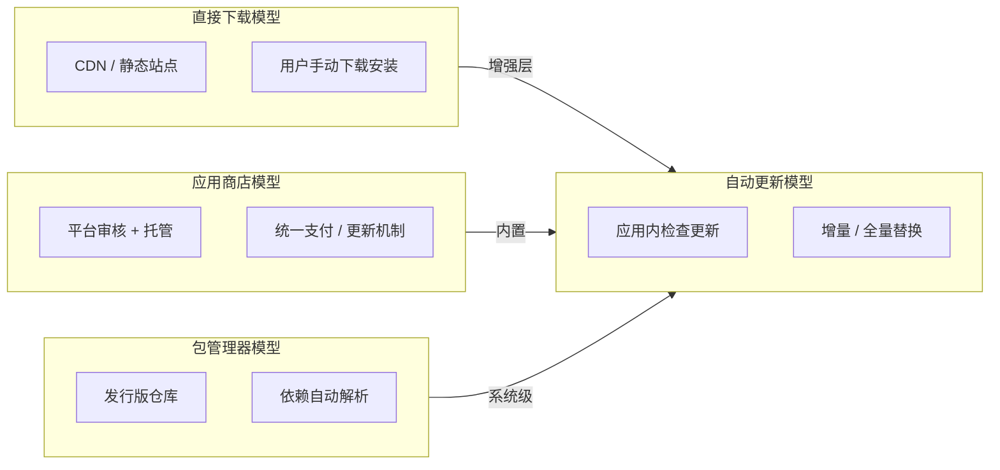

# 打包与分发：从构建到用户

## 引言

桌面应用开发的「最后一公里」并非功能的完备性，而是将构建产物转化为终端用户可感知、可安装、可信任、可持续更新的软件包。与 Web 应用「即时部署、即时访问」的模型不同，桌面软件的分发涉及操作系统底层的包管理系统、安全信任链、平台策略与用户体验的复杂耦合。本文采用双轨并行的叙事结构：在理论层面，构建应用分发的形式化模型，剖析代码签名链的信任拓扑与开源许可在专有分发渠道中的兼容性约束；在工程层面，映射 Electron、Tauri 及原生工具链的多平台打包实践，覆盖从 `electron-builder` 的配置到 GitHub Actions 矩阵构建的完整流水线。

## 理论严格表述

### 应用分发的理论模型

从信息系统的视角审视，桌面应用的分发本质上是一个「软件制品从构建节点向终端消费节点迁移」的分布式过程。依据渠道控制程度与信任中介的差异，可将分发模型归纳为四类原型：

1. **直接下载模型（Direct Download Model）**：开发者通过自有基础设施（如 CDN、对象存储或静态站点）向用户提供可执行安装包。此模型的信任锚点完全由开发者控制，用户通过 HTTPS/TLS 建立传输层信任，但缺乏对软件完整性的密码学验证（除非额外提供签名与校验和）。
2. **应用商店模型（App Store Model）**：平台所有者（如 Apple、Microsoft、Canonical）作为可信第三方中介，统一托管、审查并分发软件。信任链呈现为「开发者 → 平台 → 用户」的三元结构，平台通过代码签名、沙箱策略与内容审核降低用户的安全认知负担。
3. **包管理器模型（Package Manager Model）**：在 Linux 生态中尤为典型，发行版维护者将上游源码编译为符合 FHS（Filesystem Hierarchy Standard）规范的软件包，通过依赖解析器（如 `apt`、`dnf`、`pacman`）完成原子化安装。信任基于发行版签名密钥与维护者信誉网络。
4. **自动更新模型（Auto-update Model）**：作为上述模型的增强层，自动更新机制在应用运行时异步拉取增量或全量更新包。其理论核心在于「双副本原子替换」与「回滚安全性」——更新过程必须保证旧版本可恢复，且新版本在安装前完成完整性校验。

### 软件包格式与元系统

软件包不仅是文件归档，更是一套包含元数据（Metadata）、清单（Manifest）与安装脚本的结构化容器。不同平台演化出异构的包格式谱系：

- **Windows**：`EXE`（自解压可执行文件）、`MSI`（Microsoft Installer，基于 OLE Structured Storage 的数据库格式）、`MSIX`（容器化包格式，继承 UWP 沙箱特性）。
- **macOS**：`DMG`（Apple Disk Image，基于 UDIF 的只读或读写磁盘映像）、`pkg`（基于 XAR 归档的安装包，支持 preinstall/postinstall 脚本）。
- **Linux**：`Deb`（Debian 二进制包，基于 `ar` 归档与 `tar` 压缩）、`RPM`（Red Hat Package Manager，基于 CPIO 的头部标签结构）、`AppImage`（单文件可执行格式，依赖 FUSE 或自挂载）、`Snap`（基于 SquashFS 的不可变容器，通过 `snapd` 守护进程管理）、`Flatpak`（基于 OSTree 的引用计数沙箱，通过 portal 机制与宿主系统交互）。
- **跨平台通用**：`APK`（此处指 Android Package，但在桌面语境下亦指部分 Linux 兼容层方案）、`Tarball`（源码或二进制归档）。

这些格式的差异不仅体现在压缩算法与归档结构上，更深层地反映了各平台对「软件安装」这一概念的形式化理解：Windows 偏向注册表与系统目录的修改，macOS 强调应用程序捆绑包（App Bundle）的原子性，而 Linux 则分裂为系统级包管理（Deb/RPM）与用户级沙箱（AppImage/Snap/Flatpak）两条路径。

### 代码签名链的信任模型

代码签名（Code Signing）是建立「软件来源真实性」与「内容完整性」的密码学机制。其理论基础是 X.509 公钥基础设施（PKI）与证书链（Certificate Chain）验证。

一个典型的代码签名信任链由以下层级构成：

- **根证书颁发机构（Root CA）**：预置于操作系统信任存储（如 Windows 的 Trusted Root Certification Authorities、macOS 的 System Roots）中的自签名证书，作为信任锚点（Trust Anchor）。
- **中间 CA（Intermediate CA）**：由根 CA 签发，承担实际的证书签发工作，以隔离根私钥的暴露风险。
- **开发者证书（Developer Certificate）**：由中间 CA 签发，绑定开发者的公钥与身份标识（Distinguished Name）。
- **签名块（Signature Block）**：开发者使用私钥对软件哈希值进行签名，并将签名、时间戳（Timestamp）与证书链嵌入软件包。

时间戳服务器（Timestamping Authority, TSA）的作用尤为关键：即使开发者证书过期，只要签名时附带了由 TSA 签发的时间戳令牌（RFC 3161），操作系统仍可验证「该签名在证书有效期内完成」。证书吊销状态则通过 CRL（Certificate Revocation List）或 OCSP（Online Certificate Status Protocol）实时查询。

在工程实践中，Windows 要求驱动程序与部分桌面应用通过 EV（Extended Validation）代码签名证书建立信誉，而 macOS 的 Gatekeeper 则强制要求所有分发软件经过 Apple 公证（Notarization），这实质上是对代码签名链的平台化增强——Apple 作为额外的信任中介，对软件进行恶意代码扫描并签发公证票证（Ticket）。

### 数字版权管理与开源许可的兼容性

数字版权管理（DRM, Digital Rights Management）与自由及开源软件（FOSS, Free and Open Source Software）之间存在根本性的张力。DRM 的技术目标是通过访问控制与加密限制用户对数字内容的使用、修改与分发；而 FOSS 许可证（尤其是 GPL 系列）则通过法律手段保障用户的运行、学习、修改与再分发权利。

具体到桌面应用分发场景，以下约束需要严格考量：

- **GPLv3 第 3 条（Tivoization 条款）**：若设备包含 GPLv3 软件，则必须提供安装修改后版本的方法。这意味着通过 Mac App Store 或 Microsoft Store 分发的 GPL 应用，如果平台 DRM 机制阻止用户侧载修改版本，可能触发许可证冲突。
- **App Store 的附加条款**：Apple Mac App Store 与 Microsoft Store 均要求开发者接受附加的分发条款，其中可能包含与 GPL 不兼容的限制（如限制再分发、限制逆向工程）。历史上，GNU 项目明确建议不要将 GPL 软件提交到 Apple App Store。
- **MIT / Apache-2.0 的兼容性**：相对宽松的开源许可证（如 MIT、BSD、Apache-2.0）通常与专有分发渠道及 DRM 机制兼容，因为其核心义务仅要求保留版权声明与许可文本，不强制要求提供对应的源代码或保证用户的修改权。
- **双重许可策略（Dual Licensing）**：部分项目（如 Qt、MySQL）采用商业许可与开源许可并行的模式，允许开发者购买商业许可证以规避 GPL 在专有分发渠道中的限制。

从工程决策角度，采用 Electron 或 Tauri 构建的桌面应用如果计划进入 Mac App Store，应优先选择 MIT 或 Apache-2.0 许可证的依赖库，或在架构上将 GPL 组件隔离为独立进程，通过 IPC 通信以降低许可证传染性（Copyleft）风险。

## 工程实践映射

### Electron Builder：配置驱动的多平台打包

Electron Builder 是目前 Electron 生态中应用最广泛的打包工具，其核心理念是通过声明式配置（`electron-builder.yml` 或 `package.json` 的 `build` 字段）描述目标平台、包格式与发布行为，避免侵入性的构建脚本。

一个典型的多平台配置如下（关键字段已展开）：

```yaml
appId: com.example.myapp
productName: MyApp
directories:
  output: dist
files:
  - 'build/**/*'
  - 'node_modules/**/*'
  - 'package.json'
mac:
  category: public.app-category.productivity
  target:
    - target: dmg
      arch: [x64, arm64]
    - target: zip
  identity: 'Developer ID Application: Example Inc (TEAM_ID)'
  hardenedRuntime: true
  gatekeeperAssess: false
win:
  target:
    - target: nsis
      arch: [x64, ia32]
    - target: msi
  certificateFile: ./certs/win-cert.p12
  certificatePassword: ''
linux:
  target:
    - target: AppImage
      arch: x64
    - target: deb
    - target: rpm
  category: Utility
publish:
  provider: github
  owner: example
  repo: myapp
```

**关键工程细节：**

- **自动更新（Auto-update）**：Electron Builder 内置 `electron-updater` 模块，通过检查 `latest.yml`（Windows/macOS）或 `latest-linux.yml` 中的版本号与下载 URL 触发更新。`publish.provider` 支持 `github`、`s3`、`generic` 等后端。更新包通常采用差分算法（如 `electron-builder` 集成的 `blockmap`）减少下载体积。
- **代码签名（Code Signing）**：macOS 上需指定 `identity` 为「Developer ID Application」证书的名称或哈希；Windows 上支持 `.p12` 证书文件或从 Windows 证书存储（Certificate Store）中按 `subjectName` 查找。签名后，`electron-builder` 会自动将签名信息嵌入到 `CodeResources`（macOS）与 PE 文件的数字签名目录（Windows）中。
- **公证（Notarization）**：自 macOS Catalina 起，`hardenedRuntime` 与 `gatekeeperAssess` 必须配合 Apple 的公证流程。`electron-builder` 支持在 `afterSign` 钩子中调用 `xcrun altool` 或 `notarytool` 提交公证请求，并在 `staple` 后将公证票证附加到 `DMG` 或 `ZIP` 中。

### Electron Forge：插件化的构建生态

Electron Forge 是 Electron 官方维护的构建与发布工具链，其架构基于「 makers 」（生成安装包）、「 publishers 」（发布到远程）与「 plugins 」（扩展构建流程）的三元插件体系。

Forge 的配置入口为 `forge.config.js`：

```javascript
module.exports = {
  packagerConfig: {
    asar: true,
    icon: './assets/icon',
    osxSign: {
      identity: 'Developer ID Application: Example Inc',
      hardenedRuntime: true,
      'gatekeeper-assess': false,
    },
    osxNotarize: {
      tool: 'notarytool',
      appleId: process.env.APPLE_ID,
      appleIdPassword: process.env.APPLE_APP_SPECIFIC_PASSWORD,
      teamId: process.env.APPLE_TEAM_ID,
    },
  },
  makers: [
    {
      name: '@electron-forge/maker-squirrel',
      config: {
        certificateFile: process.env.WIN_CERT_PATH,
        certificatePassword: process.env.WIN_CERT_PASSWORD,
      },
    },
    {
      name: '@electron-forge/maker-dmg',
      config: {
        format: 'ULFO',
      },
    },
    {
      name: '@electron-forge/maker-deb',
      config: {
        options: {
          maintainer: 'Example Inc',
          homepage: 'https://example.com',
        },
      },
    },
    {
      name: '@electron-forge/maker-rpm',
      config: {},
    },
  ],
  publishers: [
    {
      name: '@electron-forge/publisher-github',
      config: {
        repository: {
          owner: 'example',
          name: 'myapp',
        },
        prerelease: false,
      },
    },
  ],
};
```

**与 Electron Builder 的差异化选择：**

Forge 的优势在于与 Electron 核心团队的深度集成、Webpack/Vite 等现代构建工具的原生插件支持（如 `@electron-forge/plugin-vite`），以及更灵活的 JavaScript 配置能力。当项目需要自定义 Webpack 配置、HMR（Hot Module Replacement）开发体验，或需要将打包流程深度嵌入到已有的 Node.js 构建管线时，Forge 通常是更优选择。

### Tauri 的打包体系与更新机制

Tauri 采用 Rust 作为后端运行时，其打包流程与 Electron 有本质差异：Tauri 不携带 Chromium 与 Node.js 运行时，而是依赖操作系统提供的 WebView2（Windows）、WKWebView（macOS）或 WebKitGTK（Linux）。这一架构决策使得 Tauri 的二进制体积通常仅为 Electron 应用的 1/10 到 1/5，但也对打包策略提出了不同要求。

Tauri 的构建入口为 `tauri build`，其行为由 `tauri.conf.json` 控制：

```json
{
  "bundle": {
    "active": true,
    "targets": ["msi", "dmg", "app", "deb", "rpm", "appimage"],
    "identifier": "com.example.myapp",
    "icon": ["icons/32x32.png", "icons/128x128.png", "icons/icon.icns"],
    "resources": [],
    "category": "DeveloperTool",
    "shortDescription": "A Tauri App",
    "longDescription": "A longer description of the application"
  },
  "plugins": {
    "updater": {
      "active": true,
      "endpoints": [
        "https://releases.example.com/{{target}}/{{current_version}}"
      ],
      "dialog": true,
      "pubkey": "dW50cnVzdGVkIGNvbW1lbnQ6..."
    }
  }
}
```

**关键工程实践：**

- **签名密钥管理**：Tauri 的自动更新采用 Ed25519 非对称签名。开发者需使用 `tauri signer generate` 生成公私钥对，公钥硬编码于 `tauri.conf.json` 的 `pubkey` 字段，私钥用于在 CI 中对更新包（`.tar.gz` 或 `.zip`）进行签名。签名后的更新元数据通过 `updater.json`（或自定义端点）分发。
- **跨平台构建限制**：由于 Tauri 依赖平台原生的 WebView 与系统库，目前无法在单一操作系统上交叉编译出所有目标平台的安装包。例如，Windows 安装程序（`.msi`）必须在 Windows 或具备 Wine 与 `wixtoolset` 的 Linux 环境中构建；macOS 的 `.app` 与 `.dmg` 则必须在 macOS 上完成签名与公证。
- **Linux 打包**：Tauri 通过 `cargo-deb` 与 `cargo-generate-rpm` 等 Rust 工具链原生生成 Deb 与 RPM 包，同时支持 AppImage 作为单文件分发格式。对于 Snap 与 Flatpak，需额外配置 `snapcraft.yaml` 或 `flatpak-builder` 清单。

### Windows 安装程序：WiX 与 NSIS

Windows 生态中存在两种主流的打包范式：基于 Windows Installer 服务（`msiexec.exe`）的 MSI 包，与基于脚本的 NSIS 安装程序。

**WiX（Windows Installer XML）**：

- 使用 XML 源文件（`.wxs`）描述安装目录、注册表项、快捷方式与组件规则。
- 支持「重大升级」（Major Upgrade）与「补丁」（Patch），便于企业环境的静默部署与组策略分发。
- 与 Windows 的 UAC（User Account Control）集成良好，可声明提升权限行为。
- 在 Electron Builder 中通过 `target: msi` 隐式调用；在 Tauri 中通过 `cargo-wix` 生成。

**NSIS（Nullsoft Scriptable Install System）**：

- 基于脚本语言描述安装流程，灵活性极高，支持自定义界面、条件逻辑与插件扩展。
- 生成的 `setup.exe` 体积通常小于 MSI，启动速度更快。
- 支持「一键安装」与便携模式（Portable Mode），适合面向消费者的直接下载分发。
- 通过 `electron-builder` 的 `nsis` 配置字段可深度定制：多语言支持、许可协议页、安装类型选择（per-user vs per-machine）。

在企业级分发场景中，MSI 通常更受 IT 管理员青睐，因其支持 `/quiet` 静默安装、日志记录与系统还原点集成；而在消费级市场，NSIS 的灵活 UI 与较小的体积更具优势。

### macOS 分发：DMG、pkg 与公证

macOS 的软件分发流程是所有桌面平台中最严格的，其核心控制点为 Gatekeeper、公证（Notarization）与装订（Staple）。

**DMG（Apple Disk Image）**：
DMG 是面向终端用户的标准分发格式。工程实践中，通常将 `.app` 捆绑包、应用程序文件夹（`/Applications`）的符号链接与背景图片打包到只读 DMG 中。用户拖拽 `.app` 到 `/Applications` 即可完成安装。Electron Builder 与 Electron Forge 均支持通过 `dmg` 配置项自定义窗口尺寸、图标布局与背景图。

**pkg（Installer Package）**：
当应用需要安装系统级组件（如内核扩展、字体、命令行工具或登录项）时，DMG 的拖拽安装不足以满足需求。此时需构建基于 BOM（Bill of Materials）与 payload 的 `pkg` 安装包。`pkg` 支持 preinstall/postinstall 脚本，并可通过 `productbuild` 与 `productsign` 进行签名与分发。

**Notarization 与 Stapling**：
自 macOS 10.15 Catalina 起，所有从互联网下载的软件必须经过 Apple 公证。其流程为：

1. 开发者将已签名的 `.app`、`.dmg` 或 `.pkg` 上传到 Apple 的公证服务（`notarytool`）。
2. Apple 对软件进行静态分析与恶意代码扫描。
3. 扫描通过后，Apple 签发公证票证（Notarization Ticket）。
4. 开发者使用 `xcrun stapler staple` 将票证「装订」到软件包中。
5. 终端用户下载后，Gatekeeper 验证签名与公证票证，无需联网即可确认软件安全性。

在 CI 环境中，公证步骤通常通过 `notarytool` 的命令行接口实现，需配置 Apple ID、应用专用密码（App-Specific Password）与团队 ID：

```bash
xcrun notarytool submit MyApp.dmg \
  --apple-id "$APPLE_ID" \
  --password "$APPLE_APP_SPECIFIC_PASSWORD" \
  --team-id "$APPLE_TEAM_ID" \
  --wait

xcrun stapler staple MyApp.dmg
```

### Linux 生态：AppImage、Deb、RPM、Snap、Flatpak

Linux 桌面分发最大的挑战在于生态碎片化——不存在单一的「Linux 应用商店」，而是多个互不兼容的包管理系统与沙箱运行时并存。

**AppImage**：

- 理念：「一个应用，一个文件」（One App = One File）。将应用、依赖库与桌面入口文件打包到一个自挂载的 SquashFS 映像中。
- 优点：无需 root 权限即可运行，不依赖特定发行版，适合直接下载分发。
- 签名：支持通过 GPG 对 AppImage 进行签名，验证命令为 `./MyApp.AppImage --signature-verify`。
- 局限：无法自动处理系统级依赖（如特定版本的 `glibc`），且不具备自动更新原生机制（需配合 AppImageUpdate）。

**Deb（Debian Package）**：

- 适用于 Debian、Ubuntu 及其衍生发行版。
- 基于 `dpkg` 底层与 `apt` 高级包管理器，支持依赖声明、冲突解决与仓库管理。
- 构建工具：`electron-installer-debian`、`electron-builder`、`cargo-deb`（Tauri）或原生 `dpkg-deb`。
- 签名：通过 GPG 对 `Release` 文件与包清单进行签名，用户需将仓库公钥添加到 `apt-key` 或 `/etc/apt/trusted.gpg.d/`。

**RPM（Red Hat Package Manager）**：

- 适用于 Fedora、RHEL、CentOS、openSUSE 等。
- 使用 `rpmbuild` 与 `spec` 文件定义构建规则，支持宏、脚本与触发器。
- 签名：使用 GPG 对 RPM 包头与载荷进行签名，验证命令为 `rpm -K package.rpm`。

**Snap**：

- Canonical 推出的通用包格式，基于 SquashFS 的只读容器，通过 `snapd` 守护进程管理。
- 严格的 confinement 模式通过 AppArmor 与 Seccomp 限制应用权限，支持 interfaces（如 `network`、`home`、`wayland`）声明能力。
- 发布渠道：Snap Store（snapcraft.io/store）。构建通过 `snapcraft.yaml` 定义，支持多架构（amd64、arm64、armhf）。
- 自动更新：由 `snapd` 在后台自动执行，开发者可通过 `snapcraft` 控制发布通道（stable、candidate、beta、edge）。

**Flatpak**：

- 由 freedesktop.org 推动的跨发行版沙箱格式，基于 OSTree 进行去重存储与增量更新。
- 运行时（Runtime）与 SDK 分离，应用仅需携带自身文件，共享基础运行时（如 `org.freedesktop.Platform`）。
- 权限通过 Flatpak Portal 与静态权限列表管理，支持 PipeWire、Wayland、X11 等图形后端。
- 分发：Flathub（flathub.org）是事实上的中央仓库。构建通过 `flatpak-builder` 与 JSON/YAML 清单完成。
- 签名：OSTree 提交使用 GPG 签名，客户端通过配置的 GPG 密钥验证更新。

对于面向 Linux 桌面用户的应用，推荐采用「AppImage + Flatpak」的双轨策略：AppImage 覆盖追求即开即用的技术用户，Flatpak 则通过 Flathub 触达更广泛的发行版用户群体。

### 应用商店发布流程

将桌面应用提交到官方应用商店不仅是分发渠道的扩展，更是平台安全策略与用户体验规范的全面合规。

**Microsoft Store（MSIX）**：

- 通过 `electron-windows-store` 工具或 MSIX Packaging Tool 将 Electron/Tauri 应用打包为 MSIX。
- MSIX 支持容器化运行、文件系统虚拟化（VFS）与清洁卸载。
- 需注册 Microsoft 合作伙伴中心账号，提交应用图标、截图、描述与隐私政策。
- 审核周期通常为 1-3 个工作日，审核标准涵盖内容合规、性能与安全性。

**Mac App Store（MAS）**：

- 提交到 MAS 的应用必须使用 Apple 签名的「Mac App Distribution」证书与「Mac Installer Distribution」证书。
- 应用必须运行于沙箱（App Sandbox）中，这要求对文件系统访问、网络请求与硬件权限进行严格声明（Entitlements）。
- 由于沙箱限制，部分 Electron API（如 `autoUpdater`）在 MAS 构建中不可用，需切换至 `electron-updater` 的 MAS 兼容模式或通过 Sparkle 框架实现更新。
- 审核标准涵盖 Human Interface Guidelines（HIG）符合度、功能完整性与隐私标签准确性。

**Snap Store**：

- 通过 `snapcraft` CLI 或 Web 界面提交。
- 自动构建服务支持从 GitHub/GitLab 仓库触发多架构构建。
- 发布通道模型（stable/candidate/beta/edge）支持灰度发布。

### Docker 化的桌面应用构建

在多平台 CI/CD 环境中，构建环境的一致性是一大挑战。Docker 容器化技术可有效隔离构建依赖，尤其适用于 Linux 平台打包。

**典型场景：在 Linux 容器中构建 Windows 安装程序**
通过 Wine 与 `wixtoolset` 的容器化封装，可在 Linux CI Runner 上交叉生成 Windows MSI：

```dockerfile
FROM ubuntu:22.04

RUN dpkg --add-architecture i386 \
  && apt-get update \
  && apt-get install -y wine64 wine32 wget cabextract \
  && wget -q https://raw.githubusercontent.com/Winetricks/winetricks/master/src/winetricks \
  && chmod +x winetricks \
  && mv winetricks /usr/local/bin/

RUN wget -q https://github.com/wixtoolset/wix3/releases/download/wix3112rtm/wix311-binaries.zip \
  && unzip wix311-binaries.zip -d /opt/wix \
  && ln -s /opt/wix/candle.exe /usr/local/bin/candle \
  && ln -s /opt/wix/light.exe /usr/local/bin/light
```

**Tauri 的交叉编译容器**：
Tauri 社区维护了 `tauri-apps/tauri` 相关的 Docker 镜像，预装 Rust、Node.js、WebKitGTK 与 `libappindicator`。对于需要在同一台机器上构建 Linux 多种格式（Deb、RPM、AppImage）的场景，容器化可显著降低环境配置成本。

### CI/CD 中的多平台打包

现代桌面应用的发布流程高度依赖持续集成系统。GitHub Actions 凭借其矩阵构建（Matrix Build）能力，已成为多平台打包的事实标准。

一个典型的 GitHub Actions 工作流如下：

```yaml
name: Build and Release

on:
  push:
    tags:
      - 'v*'

jobs:
  build:
    strategy:
      matrix:
        os: [ubuntu-latest, windows-latest, macos-latest]
        include:
          - os: ubuntu-latest
            target: linux
          - os: windows-latest
            target: windows
          - os: macos-latest
            target: macos
    runs-on: ${{ matrix.os }}

    steps:
      - uses: actions/checkout@v4

      - name: Setup Node.js
        uses: actions/setup-node@v4
        with:
          node-version: 20

      - name: Setup Rust
        if: matrix.target == 'linux'
        uses: dtolnay/rust-action@stable

      - name: Install dependencies
        run: npm ci

      - name: Build application
        run: npm run build

      - name: Package with Electron Builder
        run: npx electron-builder --${{ matrix.target }}
        env:
          GH_TOKEN: ${{ secrets.GITHUB_TOKEN }}
          WIN_CSC_LINK: ${{ secrets.WIN_CERT_BASE64 }}
          WIN_CSC_KEY_PASSWORD: ${{ secrets.WIN_CERT_PASSWORD }}
          APPLE_ID: ${{ secrets.APPLE_ID }}
          APPLE_APP_SPECIFIC_PASSWORD: ${{ secrets.APPLE_APP_SPECIFIC_PASSWORD }}
          APPLE_TEAM_ID: ${{ secrets.APPLE_TEAM_ID }}

      - name: Upload artifacts
        uses: actions/upload-artifact@v4
        with:
          name: dist-${{ matrix.target }}
          path: dist/

  release:
    needs: build
    runs-on: ubuntu-latest
    steps:
      - uses: actions/checkout@v4

      - name: Download all artifacts
        uses: actions/download-artifact@v4
        with:
          path: dist/
          merge-multiple: true

      - name: Create GitHub Release
        uses: softprops/action-gh-release@v1
        with:
          files: dist/**/*
          draft: false
          prerelease: false
```

**工程最佳实践：**

- **Secret 管理**：代码签名证书（`.p12`、`.p8`）与密码严禁硬编码于仓库中。应通过 GitHub Actions 的 Encrypted Secrets 注入，并在 macOS 公证流程中使用「应用专用密码」而非主 Apple ID 密码。
- **矩阵隔离**：不同平台的构建应在独立的 Runner 上执行，避免交叉编译带来的工具链污染。对于 macOS 公证，必须使用 `macos-latest` Runner，因为 `notarytool` 依赖 macOS 密钥链与 Xcode 命令行工具。
- **缓存优化**：Rust 的 `target/` 目录与 Node.js 的 `node_modules/` 应通过 `actions/cache` 缓存，以缩短 Tauri 与 Electron 的构建时间。
- **Release 自动化**：通过 `semantic-release` 或 `release-please` 结合 Conventional Commits 自动生成 CHANGELOG、版本号与 GitHub Release，再由 Electron Builder 或 Forge 的 Publisher 插件将安装包上传至 Release Assets。

## Mermaid 图表

### 图表一：代码签名信任链与分发验证流程



### 图表二：CI/CD 多平台打包矩阵架构



### 图表三：桌面应用分发模型对比



## 理论要点总结

1. **分发模型的选择是信任模型的选择**：直接下载将信任锚点完全置于开发者控制的 TLS 证书上；应用商店通过平台中介引入额外的安全审查与信誉背书；包管理器依赖发行版维护者的社区信誉与签名密钥网络。不同模型在控制自由度、安全保证与用户体验之间存在不可兼得的权衡（Trade-off）。

2. **代码签名链的数学基础是 PKI，但其社会基础是 CA 的信誉**：即使 X.509 证书链在密码学上无可辩驳，一旦根 CA 的私钥泄露或中间 CA 滥发证书（如历史上的 DigiNotar 事件），整个信任体系将面临系统性崩溃。时间戳与 OCSP Stapling 是缓解证书生命周期风险的关键机制。

3. **软件包格式是操作系统哲学的外化**：Windows MSI 的数据库结构反映了 Windows 注册表中心化的配置哲学；macOS App Bundle 的原子性体现了 NeXTSTEP 的面向对象文件系统遗产；Linux 包格式的多元化（Deb/RPM/AppImage/Snap/Flatpak）则是自由软件运动「无单一权威」理念的必然结果。

4. **开源许可与专有分发渠道的冲突具有法律刚性**：GPLv3 的 Tivoization 条款与 App Store 的 DRM 机制在逻辑上互斥。工程团队必须在架构设计阶段就将许可证兼容性纳入技术选型，通过进程隔离（如将 GPL 组件置于独立进程并通过 IPC 通信）或选择宽松许可证（MIT/Apache-2.0）依赖来降低法律风险。

5. **自动更新的核心挑战是原子性与回滚**：无论采用 Electron Builder 的 `blockmap` 差分更新、Tauri 的 Ed25519 签名更新包，还是系统级包管理器的原子事务，更新机制必须保证「在更新失败时，旧版本仍可正常启动」。这要求更新流程遵循「下载 → 校验 → staging → 原子替换 → 健康检查」的五阶段协议。

## 参考资源

1. **Electron Builder 官方文档** — *Configuration* 与 *Code Signing* 章节。全面覆盖了 `electron-builder.yml` 的多平台配置语法、自动更新协议与代码签名流程。
   URL: <https://www.electron.build/configuration/configuration>

2. **Electron Forge 官方文档** — *Makers* 与 *Publishers* 章节。详细阐述了 Forge 的插件架构、各平台 Maker 的配置参数与 CI 集成最佳实践。
   URL: <https://www.electronforge.io/config/makers>

3. **Tauri Distribution 文档** — *Signing Updates* 与 *Windows / macOS / Linux* 分发指南。包含 `tauri.conf.json` 的 updater 配置、Ed25519 密钥生成与平台特定打包要求。
   URL: <https://v2.tauri.app/distribute/>

4. **Microsoft Store 开发者文档** — *MSIX 打包* 与 *应用提交* 指南。涵盖 MSIX 容器化特性、Partner Center 提交流程与 Windows 应用认证工具包（WACK）。
   URL: <https://learn.microsoft.com/windows/apps/publish/>

5. **Apple Developer Documentation** — *Distributing Software Outside the Mac App Store* 与 *Notarizing macOS Software Before Distribution*。官方阐述了 Developer ID 签名、公证流程、Gatekeeper 策略与 Staple 机制。
   URL: <https://developer.apple.com/documentation/xcode/notarizing-macos-software-before-distribution>

6. **Flatpak Documentation** — *Building Your First Flatpak* 与 *Flatpak Builder* 参考。介绍了 Flatpak 的 OSTree 存储模型、运行时依赖、Portal 权限与 Flathub 发布流程。
   URL: <https://docs.flatpak.org/en/latest/>

---

*本文档遵循项目写作规范：所有 HTML 标签在正文中均以反引号包裹；Mustache 插值语法仅出现于代码块内；Mermaid 图表使用文本描述语法，在 VitePress 渲染引擎中自动转换为 SVG。*
