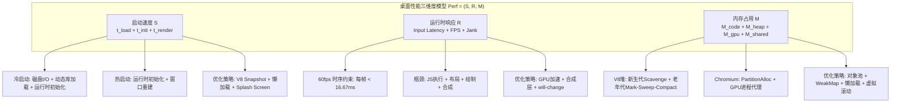
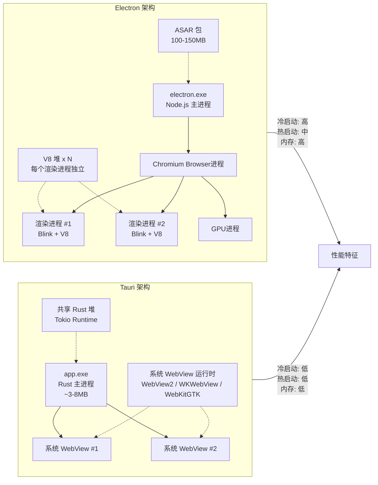
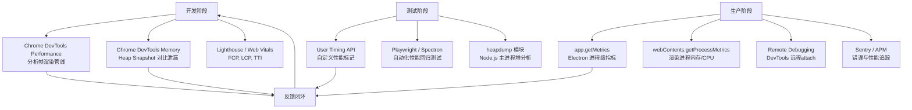

# 桌面应用性能：启动速度、内存与响应

## 引言

桌面应用的性能体验是决定用户留存与产品口碑的核心变量。与 Web 应用不同，桌面应用的用户对启动延迟的容忍度极低——用户习惯于点击图标后毫秒级的响应，任何超过数秒的冷启动都会直接触发"应用卡顿"的负面感知。与此同时，桌面应用通常长时间驻留后台（如通讯工具、笔记软件、音乐播放器），内存泄漏的累积效应远比短时运行的网页致命。在渲染层面，60fps 的流畅交互已从游戏领域的标准演变为所有桌面 UI 的基线期望。

对于基于 JavaScript/TypeScript 的桌面应用（Electron、Tauri 等），性能优化的挑战具有双重性：既要应对前端技术栈固有的运行时开销（V8 垃圾回收、DOM 布局、CSS 合成），又要解决桌面场景特有的资源管理问题（多进程内存膨胀、原生模块加载、窗口生命周期管理）。Electron 因捆绑完整 Chromium 而背负"内存巨兽"的恶名，Tauri 虽以 Rust 后端和系统 WebView 实现了数量级的包体压缩，但其前端仍运行在 WebView 的 JavaScript 环境中，同样面临渲染性能与内存管理的根本约束。

本文建立桌面应用性能的**三维度形式化模型**（启动速度、运行时响应、内存占用），从理论上剖析冷启动与热启动的差异、V8 堆内存管理与泄漏形式化定义、60fps 渲染管线的时序保证，以及资源加载优先级的排队论基础。在工程实践层面，我们将系统梳理 Electron 的启动优化技术栈（代码分割、懒加载、Splash Screen、V8 Snapshot）、Tauri 的轻量启动优势来源、Bundle 大小的极致压缩策略、内存优化手段（垃圾回收调优、对象池、图片懒加载）、GPU 加速渲染配置、多窗口共享进程模型，以及性能监控的工具链与指标体系。

---

## 理论严格表述

### 2.1 桌面应用性能的三维度模型

桌面应用的性能可形式化地定义为一个三维评估空间 `Perf = (S, R, M)`，其中每个维度均存在可量化的度量指标与理论上限。

**定义 2.1（启动速度，Startup Time）**
启动速度 `S` 是从用户触发应用执行（点击图标或开机自启）到应用进入可交互状态（Interactive State）所经过的时间。形式化地：
`S = t_load + t_init + t_render`

- `t_load`：可执行文件与依赖库从磁盘加载到内存的时间，取决于 I/O 带宽与文件大小；
- `t_init`：运行时初始化时间（V8 堆分配、主进程事件循环建立、原生模块加载）；
- `t_render`：首帧渲染时间（HTML/CSS/JS 解析、布局、绘制、合成上屏）。

**定义 2.2（运行时响应，Runtime Responsiveness）**
运行时响应 `R` 是应用在处理用户输入与系统事件时的延迟表现。核心度量包括：

- **输入延迟（Input Latency）**：从物理输入（鼠标点击、键盘按下）到对应 UI 反馈的端到端延迟，理想值 < 100ms；
- **帧率稳定性（Frame Rate Stability）**：每秒渲染帧数（FPS）的方差，`Var(FPS) → 0` 为最优；
- **任务调度抖动（Jank）**：主线程被长任务阻塞导致帧 missed 的次数。

**定义 2.3（内存占用，Memory Footprint）**
内存占用 `M` 是应用在运行期间消耗的进程内存总量，包括：

- `M_code`：代码段内存（JS 字节码、Wasm 模块、原生库 `.text` 段映射）；
- `M_heap`：动态堆内存（V8 堆、Rust/Native 堆、操作系统堆）；
- `M_gpu`：GPU 进程内存（纹理、帧缓冲、命令缓冲区）；
- `M_shared`：共享库与内存映射文件。
总内存 `M_total = Σ(M_code + M_heap + M_gpu + M_shared)`，通常以 RSS（Resident Set Size）或 PSS（Proportional Set Size）度量。

**三维度权衡关系**：
在工程实践中，三维度往往存在非线性权衡。例如，预加载更多代码和资源可降低后续交互延迟（提升 `R`），但会增加 `t_load` 和 `M_code`； aggressive 的内存缓存策略可减少重复计算（提升 `R`），但会推高 `M_heap`。形式化地，存在帕累托前沿 `Pareto(Perf)`，任何优化只能在该前沿上移动，无法同时优化所有维度。

### 2.2 冷启动 vs 热启动的理论

桌面应用的启动可细分为**冷启动（Cold Start）**与**热启动（Warm Start）**，两者的性能特征差异显著。

**定义 2.4（冷启动）**
冷启动发生在应用进程不存在于操作系统内存中的场景。此时，操作系统需要：

1. 从文件系统读取可执行文件（可能触发磁盘 I/O）；
2. 解析 ELF/Mach-O/PE 格式，建立虚拟内存映射；
3. 加载动态链接库（DLL/SO/Dylib），执行重定位与符号解析；
4. 初始化运行时（V8 堆建立、Rust 运行时启动、Node.js 模块系统加载）；
5. 创建窗口、初始化渲染管线、加载首屏资源。

冷启动时间 `S_cold` 的主要瓶颈通常是磁盘 I/O 与动态库加载。对于 Electron 应用，仅 `chrome.dll` / `libffmpeg.so` / `libGLESv2.dylib` 等核心库就可能占用数十至数百 MB 的磁盘读取量。

**定义 2.5（热启动）**
热启动发生在应用进程已存在于内存中（或已被交换到 swap），或操作系统文件缓存（Page Cache）中仍保留应用二进制文件的场景。此时 `t_load` 大幅降低，启动时间主要由运行时重新初始化和窗口重建决定：
`S_warm ≈ t_init + t_render`

对于支持**单实例模式（Single Instance）**的桌面应用，第二次点击图标通常不创建新进程，而是通过 IPC 向已有主进程发送消息，由主进程创建新窗口。此场景下 `S_warm` 可降至 100ms 以内。

**启动加速的理论基础**：
从操作系统层面，启动加速的核心策略是减少冷启动中的 I/O 等待与符号解析开销：

1. **预链接（Prelinking）**：将动态库加载地址预先绑定，减少运行时重定位计算；
2. **内存映射复用**：利用操作系统的 Copy-on-Write 机制，多个进程实例共享同一份代码页；
3. **V8 Snapshot**：将 V8 堆的初始化状态序列化为二进制快照，避免重复的 JS 对象创建与编译；
4. **按需加载（Lazy Loading）**：将非首屏必需的模块标记为延迟加载，推迟其解析与执行。

### 2.3 内存泄漏的形式化定义与桌面场景特征

内存泄漏在桌面应用中具有特殊的危害性——由于应用生命周期以"天"甚至"周"为单位，微小的泄漏速率会在长时间运行后累积为致命的内存膨胀。

**定义 2.6（内存泄漏）**
设应用运行时间为 `t`，堆内存占用为 `M_heap(t)`。若存在 `t₁ < t₂` 使得：
`M_heap(t₂) > M_heap(t₁) + Δ_working`
其中 `Δ_working` 是业务工作集（working set）的合理增长，且不存在 `t₃ > t₂` 使 `M_heap(t₃)` 回落至基线水平，则称应用在 `[t₁, t₂]` 区间发生了内存泄漏。

形式化地，内存泄漏的本质是**不可达对象未被回收**：
设堆内存中的对象集合为 `O = {o₁, o₂, ..., oₙ}`，垃圾回收器的根集合为 `Roots`。对象 `o` 是可达的当且仅当存在从 `Roots` 到 `o` 的引用链。若 `o` 不可达但未被回收，则构成泄漏。在垃圾回收语言（JavaScript、Dart）中，泄漏通常不是由"未调用 free"导致，而是由**意外的可达性（Accidental Reachability）**导致——即开发者未意识到的引用链使对象持续被 `Roots` 引用。

**2.3.1 Chromium 的内存模型**

Electron 的渲染进程继承 Chromium 的多进程内存模型。每个渲染进程拥有独立的地址空间，包含：

- **Blink 渲染引擎内存**：DOM 树、CSSOM 树、布局对象（LayoutObject）、绘制记录（PaintRecord）；
- **V8 JavaScript 堆**：JS 对象、闭包、隐藏类（Hidden Class）、编译后的机器码；
- **GPU 内存代理**：通过命令缓冲区与 GPU 进程通信，纹理和缓冲区实际存储在 GPU 进程地址空间。

Chromium 的内存分配器采用分层设计：

- **PartitionAlloc**：Blink 专用的分区分配器，将同类型对象隔离在不同分区，防止堆喷射攻击并提升缓存局部性；
- **V8 堆**：分为新生代（New Space）和老年代（Old Space），新生代使用 Scavenge 算法（复制存活对象），老年代使用 Mark-Sweep-Compact 或 Orinoco 的并发标记；
- **系统堆**：通过 `malloc`/`free` 分配的大对象和原生模块内存。

**2.3.2 V8 堆管理与垃圾回收**

V8 的垃圾回收器（GC）是桌面应用内存行为的核心决定因素。V8 采用**分代收集（Generational Collection）**假设：大部分对象生命周期极短，只有少数对象长期存活。

V8 堆的结构（以 V8 12.x 为例）：

- **New Space**：年轻代，分为 Semi-Space（From/To 两个等大小区域）。新分配的对象进入 From Space，Scavenge GC 将存活对象复制到 To Space，然后角色互换。Semi-Space 大小通常为 1-16 MB；
- **Old Space**：老年代，存放经过多次 GC 仍存活的对象。使用 Mark-Sweep-Compact 算法，支持并发标记（Concurrent Marking）和增量标记（Incremental Marking）以减少停顿；
- **Large Object Space**：大于特定阈值（通常 256 KB）的对象直接分配于此，避免频繁的复制开销；
- **Code Space**：存放 JIT 编译后的机器码；
- **Map Space**：存放隐藏类（Hidden Class / Map）的元数据。

**桌面应用中的典型泄漏模式**：

1. **闭包泄漏**：事件监听器闭包捕获了大对象，但监听器未被移除；
2. **DOM 分离节点泄漏**：已从 DOM 树移除的节点仍被 JS 引用，Blink 的 PartitionAlloc 无法释放其内存；
3. **缓存无限增长**：缺少淘汰策略的 LRU/Map 缓存持续累积数据；
4. **主进程 ↔ 渲染进程循环引用**：Electron 中通过 IPC 传递的对象若未正确清理，可能导致跨进程引用泄漏；
5. **原生模块内存泄漏**：C++ 原生插件中 `new` 未匹配 `delete`，Rust 中 `Box::leak` 的滥用。

### 2.4 渲染帧率的时序理论

桌面 UI 的流畅性由**帧率（Frame Rate）**量化。人眼对运动连贯性的感知阈值约为 24fps，但对交互响应的满意度阈值远高于此。现代显示器的刷新率通常为 60Hz（16.67ms/帧）或 120Hz（8.33ms/帧），桌面应用的目标帧率应与显示器刷新率同步。

**定义 2.7（帧渲染管线）**
一帧的渲染可分解为以下阶段：
`Input → Event Handling → JavaScript Execution → Style Calculation → Layout → Paint → Composite → VSync Display`

每个阶段必须在 VSync 周期内完成。以 60Hz 为例：
`T_total = T_input + T_script + T_style + T_layout + T_paint + T_composite < 16.67ms`

若任一阶段超时，该帧将被丢弃（Dropped Frame），用户感知为"卡顿（Jank）"。

**渲染瓶颈的理论分析**：

- **JavaScript 瓶颈**：主线程执行长任务（> 50ms）阻塞事件循环。根据 RAIL 模型，用户输入的响应时间应在 100ms 内完成，而一帧内留给 JS 的时间通常不超过 10-12ms；
- **样式计算瓶颈**：复杂的选择器匹配、大量 CSS 变量的级联计算；
- **布局瓶颈（Reflow）**：修改几何属性（width、height、position）触发布局计算，时间复杂度通常为 `O(n)` 到 `O(n²)`，其中 `n` 为 DOM 节点数；
- **绘制瓶颈（Repaint）**：大面积区域的像素重绘，高分辨率屏幕（4K、Retina）的像素数量是 1080p 的 4 倍，绘制成本线性增长；
- **合成瓶颈**：图层（Layer）数量过多导致 GPU 内存压力和合成器线程负载。

**桌面应用的特殊挑战**：
桌面应用窗口尺寸通常大于浏览器标签页（尤其是 4K/UltraWide 显示器），全屏或大面积窗口意味着更多的像素需要每帧重绘。Electron 和 Tauri 的前端运行在 WebView 中，其合成器行为与浏览器一致，但桌面场景的窗口管理（拖拽缩放、多显示器 DPI 切换、窗口最小化/恢复）会引入额外的重排与重绘压力。

### 2.5 资源加载的优先级理论

桌面应用的首屏渲染速度不仅取决于代码执行，还取决于资源的加载时序。资源加载可建模为一个**优先级队列调度问题**。

**定义 2.8（资源优先级）**
设资源集合 `Res = {r₁, r₂, ..., rₙ}`，每个资源具有属性 `(sizeᵢ, priorityᵢ, typeᵢ)`。浏览器的资源加载器根据 `priorityᵢ` 决定请求时序：

- `priority = "VeryHigh"`：HTML 文档、关键 CSS；
- `priority = "High"`：首屏图片、首屏 JavaScript；
- `priority = "Medium"`：非关键脚本、样式；
- `priority = "Low"`：懒加载图片、非首屏资源；
- `priority = "VeryLow"`：预加载的后续页面资源。

**关键渲染路径（Critical Rendering Path）**：
关键渲染路径是阻止首屏渲染的最小资源集合。形式化地，设 `R_critical` 为使页面达到 First Contentful Paint（FCP）所必需的资源集合，则：
`T_fcp ≥ Σ(r ∈ R_critical) T_load(r)`
优化启动速度的核心策略之一是**最小化 `R_critical` 的基数与总大小**。

**预加载策略**：

- **`link rel="preload"`**：声明当前页面必定需要的资源，浏览器会提前发起请求，但需权衡带宽竞争；
- **`link rel="prefetch"`**：声明下一导航可能需要的资源，以最低优先级在空闲时加载；
- **HTTP/2 Server Push**（已逐步废弃）：服务器主动推送资源，但桌面应用的本地文件加载通常不涉及 HTTP，而是 `file://` 或自定义协议。

对于桌面应用，由于资源通常从本地磁盘加载（Electron ASAR / Tauri 资源目录），网络延迟可忽略，但**磁盘 I/O 与解析开销**成为瓶颈。因此，资源加载优化的重点从"减少 RTT"转向"减少读取次数与解析时间"。

---

## 工程实践映射

### 3.1 Electron 的启动优化

Electron 的启动优化围绕减少 `t_load`、`t_init` 和 `t_render` 三个环节展开。

**3.1.1 代码分割与懒加载**

Electron 的主进程与渲染进程均支持代码分割。对于渲染进程，使用 Webpack / Rollup / Vite 的动态导入（`import()`）将非首屏路由拆分为独立 chunk：

```typescript
// renderer/src/router.ts
const routes = [
  {
    path: '/dashboard',
    component: () => import('./views/Dashboard.vue'), // 懒加载
  },
  {
    path: '/settings',
    component: () => import('./views/Settings.vue'),  // 懒加载
  },
]
```

对于主进程，可使用 `require` 的惰性加载避免启动时加载所有原生模块：

```typescript
// main/src/services/native-helper.ts
let nativeModule: any = null;

export function getNativeModule() {
  if (!nativeModule) {
    nativeModule = require('./native/build/Release/helper.node');
  }
  return nativeModule;
}
```

**3.1.2 Splash Screen（启动屏）**

Splash Screen 是改善用户感知的有效手段——即使应用尚未完全加载，用户看到即时反馈会降低对等待时间的感知。

```typescript
// main/src/main.ts
import { BrowserWindow } from 'electron';

let splash: BrowserWindow | null = null;

function createSplashWindow() {
  splash = new BrowserWindow({
    width: 400,
    height: 300,
    frame: false,
    alwaysOnTop: true,
    transparent: true,
    webPreferences: {
      nodeIntegration: false,
      contextIsolation: true,
    },
  });
  splash.loadFile('splash.html');
}

function createMainWindow() {
  const mainWindow = new BrowserWindow({
    width: 1200,
    height: 800,
    show: false, // 先隐藏，等加载完成再显示
    webPreferences: {
      preload: path.join(__dirname, 'preload.js'),
      contextIsolation: true,
      nodeIntegration: false,
    },
  });

  mainWindow.once('ready-to-show', () => {
    splash?.destroy();
    mainWindow.show();
  });

  mainWindow.loadURL('http://localhost:5173'); // 或生产环境文件
}
```

**3.1.3 V8 Snapshot 与 Code Caching**

Electron 基于 Chromium，支持 V8 的 Code Caching 机制。Code Caching 将 JavaScript 源码编译后的字节码缓存到磁盘，下次启动时直接加载字节码，跳过解析与编译阶段。

在 Electron 中，可通过 `--js-flags` 启用相关优化：

```bash
# 启用 V8 代码缓存（默认已启用，但可通过标志调优）
electron . --js-flags="--max-old-space-size=4096 --code-cache"
```

对于主进程的 Node.js 环境，可使用 `v8-compile-cache` 库：

```typescript
// 放在主进程入口文件的最顶部
import v8CompileCache from 'v8-compile-cache';
v8CompileCache.install();
```

**3.1.4 ASAR 打包优化**

Electron 使用 ASAR（Atom Shell Archive）格式将应用文件打包为单个存档，减少文件数量以加速 `require` 和文件读取。但 ASAR 的随机访问性能劣于普通文件系统，大文件的频繁读取可能成为瓶颈。

优化策略：

- 将大型资源文件（视频、音频、大型 JSON）置于 ASAR 外部，通过 `extraResources` 配置：

```json
// package.json
{
  "build": {
    "extraResources": [
      {
        "from": "assets/large-media/",
        "to": "assets/large-media/",
        "filter": ["**/*"]
      }
    ]
  }
}
```

- 避免在启动时遍历 ASAR 内部的大量小文件。预构建文件索引表，将运行时查找转为内存查询。

### 3.2 Tauri 的轻量启动优势

Tauri 的启动速度优势来源于其架构设计的根本差异：**Rust 后端 + 系统 WebView**。

**3.2.1 Rust 后端的快速初始化**

Rust 的运行时极为轻量——无垃圾回收器、无虚拟机预热。Rust 二进制启动时无需像 Node.js 那样加载模块系统、解析 `package.json`、建立 `node_modules` 依赖图。Rust 的静态链接特性使得可执行文件在加载后即可直接进入 `main()` 函数，初始化延迟通常在毫秒级。

Tauri 的核心运行时（基于 `tao` 和 `wry`）经过精心优化，主进程启动流程为：
`Rust main() → tauri::Builder → 窗口创建 → WebView 初始化`

相比之下，Electron 的主进程启动流程为：
`electron.exe → Node.js 初始化 → 模块加载 → 主脚本解析 → BrowserWindow 创建 → Chromium 嵌入初始化`

**3.2.2 系统 WebView 的零成本嵌入**

Tauri 不捆绑 Chromium，而是复用操作系统自带的 WebView 运行时（Windows WebView2、macOS WKWebView、Linux WebKitGTK）。这意味着：

- **无额外的浏览器引擎加载**：WebView 运行时通常已在系统内存中（或被其他应用预加载），`t_load` 显著降低；
- **更小的包体**：无需携带 100MB+ 的 Chromium 二进制；
- **共享系统缓存**：WebView 可复用系统的字体缓存、DNS 缓存、HTTP 缓存（若使用网络请求）。

然而，系统 WebView 的差异性也带来了兼容性成本：各平台 WebView 的 JavaScript 引擎、CSS 特性支持和 DevTools 能力不同，需在 CI 中覆盖多平台测试。

**3.2.3 Tauri 的 Bundle 配置优化**

```toml
# src-tauri/Cargo.toml
[profile.release]
opt-level = 3          # 最高优化级别
lto = true             # 链接时优化，跨 crate 内联
strip = true           # 剥离符号表
panic = "abort"        #  panic 时直接 abort，不展开栈

codegen-units = 1      # 单代码生成单元，最大化优化机会

[profile.release.package."*"]
opt-level = 3
```

通过 `strip = true` 和 `panic = "abort"`，Tauri 的 Release 二进制可进一步压缩数 MB。`lto = true` 允许 Rust 编译器在链接阶段进行跨模块优化，消除死代码并内联跨 crate 函数调用。

### 3.3 Bundle 大小优化

Bundle 大小直接影响 `t_load` 和用户的下载/更新体验。以下策略适用于 Electron、Tauri 及所有基于 Web 技术的桌面应用。

**3.3.1 Tree Shaking 与 Dead Code Elimination**

Tree Shaking 是静态分析驱动的死代码消除技术。通过 ES Module 的静态结构，打包工具（Webpack、Rollup、Vite）可确定哪些导出未被使用，并在最终 Bundle 中剔除。

优化 checklist：

- 优先使用 ES Module 版本的库（`lodash-es` 替代 `lodash`）；
- 避免全量导入大型库（`import * as _ from 'lodash'` → `import debounce from 'lodash/debounce'`）；
- 配置打包工具的 `sideEffects` 字段，精确标记有副作用的模块：

```json
// package.json
{
  "sideEffects": [
    "*.css",
    "*.global.ts"
  ]
}
```

**3.3.2 代码压缩与混淆**

- **Terser / Esbuild**：JavaScript 代码压缩，消除空白、缩短变量名、优化表达式；
- **Gzip / Brotli**：传输压缩（对网络下载有意义，对本地磁盘加载的收益较小但仍可减少 ASAR 大小）；
- **SVG 优化**：使用 `svgo` 去除 SVG 中的编辑器元数据与冗余路径；
- **图片压缩**：WebP/AVIF 格式替代 PNG/JPEG，TinyPNG 或 Sharp 批量压缩。

**3.3.3 资源内联阈值控制**

小型资源（< 4KB）可通过 Base64/DataURL 内联到 JS/CSS 中，减少 HTTP/文件请求数。但过大的内联会膨胀 JS 解析时间。Vite 的默认阈值为 4KB，可根据桌面场景调整：

```typescript
// vite.config.ts
export default defineConfig({
  build: {
    assetsInlineLimit: 4096, // 4KB 以下内联
  },
});
```

对于 Electron，由于 ASAR 的访问成本，适度提高内联阈值（如 8KB）可能有利于启动速度。

**3.3.4 Electron 的 Native Module 裁剪**

Electron 应用若依赖原生 Node 模块（如 SQLite、 Sharp、RobotJS），需为每个平台架构（x64、arm64）编译独立的 `.node` 文件。使用 `electron-rebuild` 并配置仅保留当前平台二进制：

```json
// .npmrc
arch=x64
platform=win32
```

在打包阶段，使用 `electron-builder` 的 `npmRebuild` 和 `nodeGypRebuild` 配置确保仅打包目标平台的原生模块。

### 3.4 内存优化

**3.4.1 垃圾回收调优**

V8 的垃圾回收行为可通过启动参数调优，但需谨慎——不当的 GC 参数可能导致更严重的停顿或内存膨胀。

```bash
# 增加老年代空间上限（适合内存充裕但需要处理大数据量的应用）
electron . --js-flags="--max-old-space-size=4096"

# 启用并发标记以减少 GC 停顿（V8 默认行为，但可通过标志显式确认）
electron . --js-flags="--concurrent-marking"
```

在代码层面，避免在热路径上频繁创建短生命周期对象，以减少新生代的 GC 频率。对象池（Object Pool）是高频场景下的有效策略：

```typescript
// 对象池实现示例
class ObjectPool<T> {
  private pool: T[] = [];
  private factory: () => T;
  private reset: (obj: T) => void;

  constructor(factory: () => T, reset: (obj: T) => void, initialSize = 10) {
    this.factory = factory;
    this.reset = reset;
    for (let i = 0; i < initialSize; i++) {
      this.pool.push(factory());
    }
  }

  acquire(): T {
    return this.pool.pop() ?? this.factory();
  }

  release(obj: T): void {
    this.reset(obj);
    this.pool.push(obj);
  }
}

// 用于大量创建的 canvas 上下文或数据结构
const pointPool = new ObjectPool(
  () => ({ x: 0, y: 0 }),
  (p) => { p.x = 0; p.y = 0; },
  100
);
```

**3.4.2 图片与媒体资源的懒加载**

桌面应用若包含大量图片（如相册、设计工具、文档预览器），应在视口进入时再加载图片，避免启动时一次性加载全部资源。

```typescript
// 使用 IntersectionObserver 实现懒加载（WebView 中完全支持）
const imageObserver = new IntersectionObserver((entries) => {
  entries.forEach((entry) => {
    if (entry.isIntersecting) {
      const img = entry.target as HTMLImageElement;
      img.src = img.dataset.src!;
      imageObserver.unobserve(img);
    }
  });
});

document.querySelectorAll('img[data-src]').forEach((img) => {
  imageObserver.observe(img);
});
```

对于 Electron，由于文件系统访问快速，可采用**虚拟滚动（Virtual Scrolling）**替代分页，仅渲染视口内及缓冲区内的 DOM 节点：

```html
<!-- Vue 3 虚拟滚动示例 -->
<RecycleScroller
  class="scroller"
  :items="largeList"
  :item-size="80"
  key-field="id"
  v-slot="{ item }"
>
  <div class="item">`&#123;&#123; item.name &#125;&#125;`</div>
</RecycleScroller>
```

> 注意：上述 `&#123;&#123; item.name &#125;&#125;` 在 Vue 模板中合法，但在 Markdown 中被 VitePress 解析为 Mustache 插值可能导致渲染错误。若在实际 VitePress 文档中需展示此类代码，应将其置于代码块内（如上所示）或使用 HTML 实体转义。

**3.4.3 分离节点泄漏的防范**

在 Electron/Tauri 的 WebView 中，DOM 节点泄漏是最常见的内存问题之一。当节点从 DOM 中移除但仍被 JS 变量引用时，Blink 无法回收该节点及其关联的布局对象。

防范策略：

- 在组件卸载时显式移除事件监听器；
- 避免全局变量引用 DOM 节点；
- 使用 WeakMap / WeakRef 建立不阻止垃圾回收的关联：

```typescript
// 使用 WeakMap 存储节点元数据，不阻止节点回收
const nodeMetadata = new WeakMap<Element, Metadata>();

function attachMetadata(el: Element, data: Metadata) {
  nodeMetadata.set(el, data);
}
// 当 el 从 DOM 移除且不再有其他引用时，WeakMap 中的条目会自动消失
```

**3.4.4 Electron 主进程的内存管理**

Electron 主进程（Node.js）的内存泄漏同样致命。常见陷阱：

- **全局事件监听器无限增长**：`app.on('ready', ...)` 以外的动态监听器未移除；
- **BrowserWindow 引用未释放**：关闭窗口后仍持有窗口对象的引用，阻止 GC；
- **IPC 消息累积**：主进程通过 `ipcMain.on` 接收的消息若被缓存到数组中且无上限，将导致线性增长。

```typescript
// 反例：泄漏的 IPC 处理器
const messageHistory: unknown[] = [];

ipcMain.on('log-message', (_event, message) => {
  messageHistory.push(message); // 无上限增长！
});

// 正例：有界环形缓冲区
class RingBuffer<T> {
  private buffer: T[] = [];
  constructor(private capacity: number) {}
  push(item: T) {
    if (this.buffer.length >= this.capacity) {
      this.buffer.shift();
    }
    this.buffer.push(item);
  }
}
```

### 3.5 GPU 加速渲染

现代桌面应用的 UI 渲染高度依赖 GPU 加速。Electron 和 Tauri 的 WebView 均支持硬件加速，但配置与限制有所不同。

**3.5.1 启用硬件加速**

Electron 默认启用硬件加速，但某些虚拟机或远程桌面环境可能需要显式配置：

```typescript
// main.ts
import { app } from 'electron';

// 禁用软件渲染 fallback（强制 GPU 加速）
app.commandLine.appendSwitch('disable-software-rasterizer');

// 若应用面向特定 GPU，可启用 Angle 后端调优
app.commandLine.appendSwitch('use-angle', 'default');
```

Tauri 的系统 WebView 硬件加速由操作系统控制，通常默认开启。在 Windows WebView2 中，可通过环境变量或 API 配置渲染后端：

```rust
// src-tauri/src/main.rs
use tauri::Manager;

fn main() {
    tauri::Builder::default()
        .setup(|app| {
            // WebView2 的硬件加速默认启用，无需额外配置
            // 若需调优，可通过 WebView2 环境选项
            Ok(())
        })
        .run(tauri::generate_context!())
        .expect("error while running tauri application");
}
```

**3.5.2 合成层（Compositor Layer）优化**

Web 渲染引擎使用合成层将页面划分为独立的 GPU 纹理，仅重绘变化的图层。通过 CSS 属性可提示浏览器创建独立图层：

```css
.animated-element {
  will-change: transform; /* 提示引擎预创建合成层 */
  transform: translateZ(0); /* 强制提升为合成层（需谨慎使用） */
}
```

> 警告：过度使用 `will-change` 和 `translateZ(0)` 会导致 GPU 内存爆炸。每个合成层都是一块 GPU 纹理，1080p 的图层可能占用 8MB+ 的 GPU 内存。应仅在动画元素上临时启用，动画结束后移除。

**3.5.3 禁用不必要的动画与特效**

在资源受限的设备上，可检测硬件能力并降级特效：

```typescript
// 检测 prefers-reduced-motion 并尊重用户选择
const prefersReducedMotion = window.matchMedia('(prefers-reduced-motion: reduce)').matches;

if (prefersReducedMotion) {
  document.documentElement.classList.add('reduce-motion');
}
```

```css
.reduce-motion * {
  animation-duration: 0.01ms !important;
  transition-duration: 0.01ms !important;
}
```

### 3.6 多窗口性能

桌面应用常采用多窗口架构（如主窗口 + 设置窗口 + 弹窗）。多窗口的性能优化核心在于**进程共享**与**资源复用**。

**3.6.1 Electron 的多窗口进程模型**

Electron 的每个 `BrowserWindow` 默认创建独立的渲染进程。多窗口意味着多份 V8 堆、多份 Blink 渲染引擎实例，内存线性增长。

优化策略：

- **使用 `BrowserView` 替代独立窗口**：在同一渲染进程中嵌入多个视图，共享 V8 堆；
- **使用 `webPreferences.sharedWorker`**：SharedWorker 可在同域的多个渲染进程间共享（实际实现因安全限制而复杂，更推荐 Service Worker 或主进程状态管理）；
- **进程池（Process Pool）**：Chromium 的 `--process-per-site` 或 `--single-process`（仅调试）可减少进程数，但安全性降低；
- **数据共享**：通过主进程作为中介，避免每个窗口独立加载相同的大型数据集。

```typescript
// 主进程维护共享数据，通过 IPC 分发
const sharedCache = new Map<string, unknown>();

ipcMain.handle('get-cache', (_event, key: string) => {
  return sharedCache.get(key);
});

ipcMain.handle('set-cache', (_event, key: string, value: unknown) => {
  sharedCache.set(key, value);
});
```

**3.6.2 Tauri 的多窗口模型**

Tauri 的多窗口共享同一个 Rust 主进程，前端框架（Vue/React/Svelte）的多个窗口实例各自持有独立的 WebView。由于 WebView 的内存开销小于完整 Chromium 渲染进程，Tauri 的多窗口内存增长曲线更为平缓。

Rust 后端的状态可被所有窗口共享：

```rust
use tauri::State;
use std::sync::Mutex;

struct SharedState {
    data: Mutex<Vec<String>>,
}

#[tauri::command]
fn get_shared_data(state: State<SharedState>) -> Vec<String> {
    state.data.lock().unwrap().clone()
}
```

### 3.7 性能监控与诊断

"无法度量的东西就无法优化。"桌面应用的性能监控需要建立从开发到生产环境的完整观测链。

**3.7.1 Electron 的内置指标**

Electron 提供 `app.getMetrics()` 和 `webContents.getProcessMetrics()` 获取进程级性能数据：

```typescript
import { app, webContents } from 'electron';

// 获取应用级别的内存与 CPU 指标
const metrics = app.getMetrics();
console.log(metrics);

// 输出示例：
// {
//   "uptime": 3600,
//   "processes": [
//     { "type": "Browser", "cpu": { "percentCPUUsage": 2.5 }, "memory": { "workingSetSize": 128000 } },
//     { "type": "Renderer", "cpu": { "percentCPUUsage": 5.1 }, "memory": { "workingSetSize": 256000 } }
//   ]
// }

// 定时采集内存指标
setInterval(() => {
  const allWebContents = webContents.getAllWebContents();
  for (const wc of allWebContents) {
    const pid = wc.getProcessId();
    // 通过 Node.js 的 process 模块或第三方库获取详细内存信息
  }
}, 30000);
```

**3.7.2 Chrome DevTools 远程调试**

Electron 的渲染进程可通过 `--remote-debugging-port=9222` 启用远程调试，开发者可使用 Chrome 浏览器连接该端口，使用 Performance、Memory、Lighthouse 面板进行深度分析。

```bash
# 启动 Electron 并开启远程调试
electron . --remote-debugging-port=9222

# 然后在 Chrome 地址栏访问：
# chrome://inspect/#devices
# 或 http://localhost:9222/json/list
```

Tauri 的 WebView 同样支持远程调试（平台依赖）：

- **Windows (WebView2)**：`WEBVIEW2_ADDITIONAL_BROWSER_ARGUMENTS=--remote-debugging-port=9222`；
- **macOS (WKWebView)**：在 Safari 的 Develop 菜单中可直接看到 Tauri 应用；
- **Linux (WebKitGTK)**：`WEBKIT_INSPECTOR_SERVER=127.0.0.1:9222`。

**3.7.3 性能标记与测量（User Timing API）**

在应用代码中插入自定义性能标记，结合 DevTools 或自动化测试采集：

```typescript
// 测量关键业务逻辑的耗时
performance.mark('data-processing-start');
await processLargeDataset();
performance.mark('data-processing-end');
performance.measure('data-processing', 'data-processing-start', 'data-processing-end');

// 读取测量结果
const entries = performance.getEntriesByName('data-processing');
console.log(`Processing took ${entries[0].duration}ms`);
```

**3.7.4 内存泄漏检测**

使用 Chrome DevTools 的 Memory 面板进行堆快照（Heap Snapshot）对比：

1. 在应用启动稳定后，拍摄 Heap Snapshot A；
2. 执行 suspected 泄漏的操作序列（如反复打开/关闭对话框）；
3. 执行垃圾回收（DevTools 中的垃圾桶按钮），拍摄 Heap Snapshot B；
4. 对比两个快照，筛选 "Objects allocated between Snapshot A and B"，查找意外增长的对象类型。

对于 Node.js 主进程的内存泄漏，可使用 `heapdump` 模块生成 `.heapsnapshot` 文件，然后在 Chrome DevTools 中分析：

```typescript
import heapdump from 'heapdump';

// 在可疑时刻生成堆快照
heapdump.writeSnapshot('/path/to/snapshot-' + Date.now() + '.heapsnapshot');
```

---

## Mermaid 图表

### 桌面应用性能三维度模型



### Electron vs Tauri 启动与内存架构对比



### 性能监控与诊断工具链



---

## 理论要点总结

1. **桌面应用性能必须同时在启动速度、运行时响应和内存占用三个维度上建立度量与优化体系**。单一维度的极致优化往往以牺牲其他维度为代价，开发者应在帕累托前沿上根据产品定位做出权衡。

2. **冷启动与热启动的理论差异决定了优化策略的分野**。冷启动的瓶颈在磁盘 I/O 与动态库加载，热启动的瓶颈在运行时初始化与窗口重建。V8 Snapshot、懒加载和 Splash Screen 分别从不同层面缓解启动延迟。

3. **内存泄漏在桌面应用中的危害远高于 Web 应用，其本质是意外可达性导致的不可回收对象累积**。理解 Chromium 的 PartitionAlloc、V8 的分代 GC 模型，以及分离节点、闭包和跨进程引用等典型泄漏模式，是构建长寿命桌面应用的前提。

4. **60fps 的渲染保证要求每帧的全部管线阶段（JS → Style → Layout → Paint → Composite）在 16.67ms 内完成**。桌面应用的大尺寸窗口（4K/UltraWide）进一步放大了布局与绘制阶段的计算压力，GPU 加速与合成层优化是维持流畅度的关键手段。

5. **Electron 的启动优化围绕 ASAR、代码分割、V8 Code Caching 和主进程瘦身展开**。尽管 Electron 因 Chromium 捆绑而背负较大的启动与内存开销，但通过精细的 Bundle 管理和进程架构设计，仍可将其控制在生产级可接受的范围。

6. **Tauri 的轻量优势源于 Rust 无 GC 运行时和系统 WebView 的零成本复用**。其冷启动时间通常在数百毫秒级，包体大小在 3-8MB 级，为资源敏感场景提供了极具竞争力的替代方案。但系统 WebView 的碎片化与调试复杂度是其隐性成本。

7. **多窗口架构下，进程隔离与内存共享的权衡尤为重要**。Electron 的每窗口独立渲染进程保障了崩溃隔离，但内存线性增长；Tauri 的共享 Rust 进程与轻量 WebView 在多窗口场景下内存曲线更为平缓。

8. **性能监控必须贯穿开发、测试和生产全周期**。Chrome DevTools 的 Performance 与 Memory 面板是开发阶段的利器，`app.getMetrics()` 和 User Timing API 是生产阶段的基础，而自动化回归测试是防止性能退化的制度保障。

9. **Bundle 大小优化是启动速度的先行条件**。Tree Shaking、死代码消除、资源压缩和内联阈值控制是前端工程的标准实践，但在桌面场景中还需额外关注原生模块的平台裁剪与 ASAR 的随机访问开销。

10. **GPU 加速已从可选优化演变为默认基线**。`will-change`、`transform` 和硬件加速的合成器管线是现代桌面 UI 的基石，但过度提升合成层将导致 GPU 内存反噬，需在流畅度与资源消耗间取得平衡。

---

## 参考资源

- Electron Documentation: Performance. <https://www.electronjs.org/docs/latest/tutorial/performance>. Electron 官方性能优化指南，涵盖代码加载策略、多线程、网络策略与渲染优化。
- Tauri Documentation: Performance Tuning. <https://tauri.app/develop/resources/>. Tauri 官方资源与性能调优文档，说明 Rust 后端的构建优化、Bundle 裁剪与前端无关性。
- Chrome DevTools: Performance Analysis Reference. <https://developer.chrome.com/docs/devtools/performance>. Google 官方 DevTools 性能分析文档，详解帧时间线、长任务检测、渲染瓶颈定位与内存泄漏诊断。
- V8 Design: Garbage Collection. <https://v8.dev/blog/trash-talk>. V8 官方博客对垃圾回收器的深度解析，涵盖分代收集、并发标记、Orinoco 项目与内存压缩技术。
- Chromium Blog: GPU Acceleration. <https://blog.chromium.org/2021/01/gpu-acceleration-and-compositor-in-chrome.html>. Chromium 官方博客对 GPU 加速架构、合成器（Compositor）工作原理与硬件渲染管线的技术阐述。
