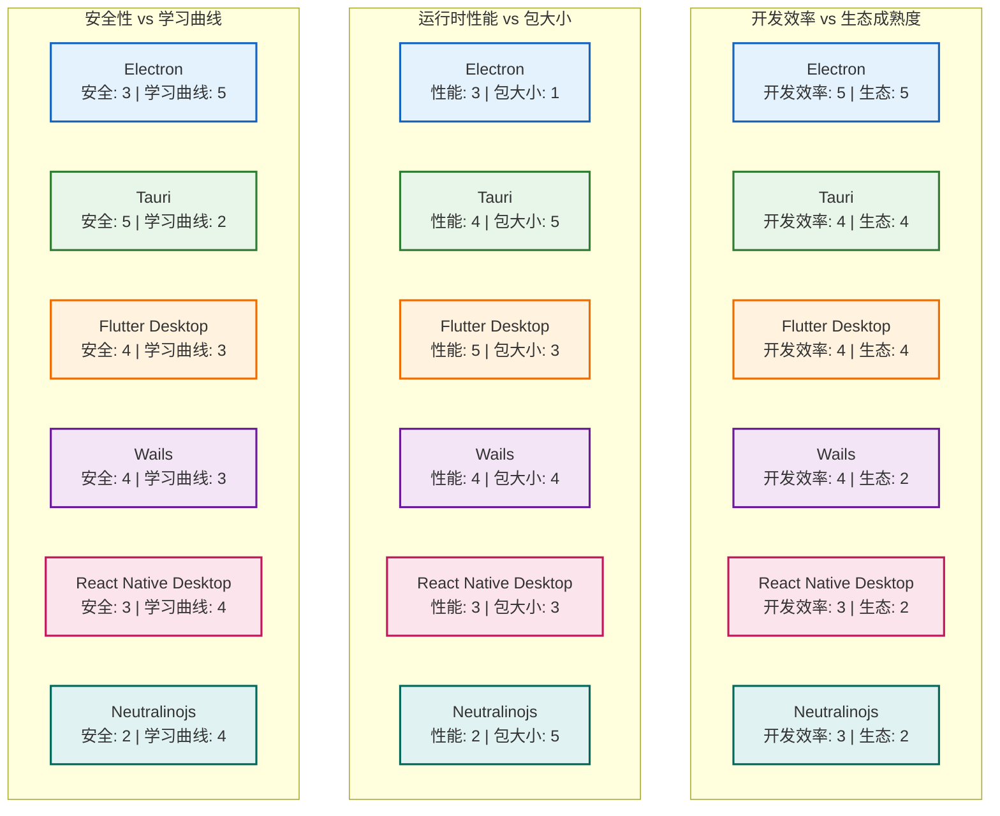
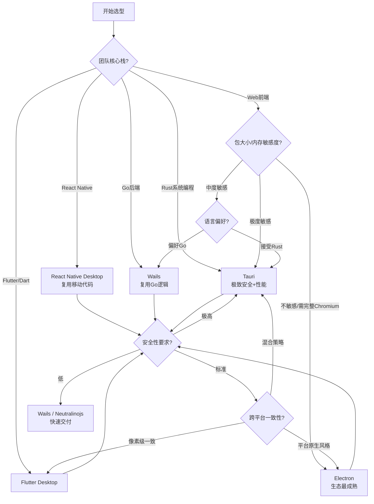
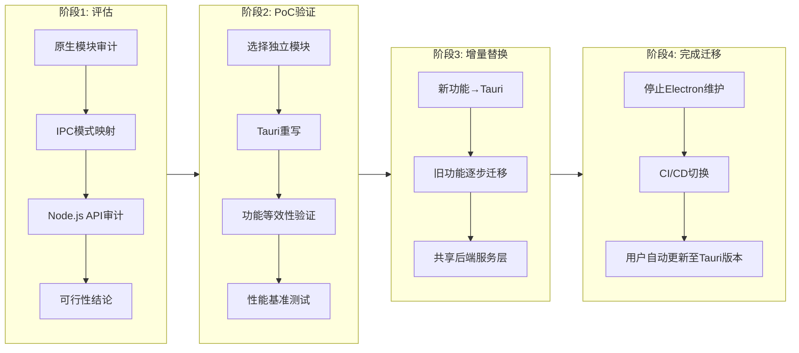
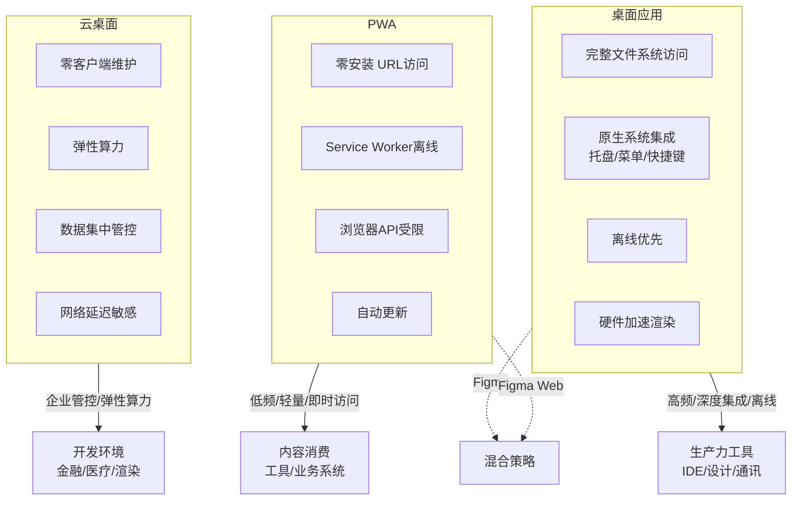

# 桌面开发选型终极指南

## 引言

桌面应用开发在 2020 年代经历了前所未有的技术多元化。从 Electron 一统江湖到 Tauri、Flutter Desktop、React Native Desktop、Wails、Neutralinojs 等方案百花齐放，开发者在享受选择自由的同时，也面临着日益复杂的选型困境。没有"最好"的框架，只有"最适合特定约束"的框架。一个拥有深厚前端积累、需要快速迭代 UI 的团队，与一个追求极致包体大小、具备 Rust 能力的系统编程团队，其最优选择必然南辕北辙。

技术选型的本质是在**多维约束空间**中寻找帕累托最优解。这些约束不仅包括技术层面的性能、包大小和启动速度，还包括团队层面的认知负荷、学习曲线和生态复用，以及商业层面的分发渠道、安全合规和长期维护成本。本文从理论层面建立桌面开发方案的形式化评估模型，引入认知负荷理论与生命周期成本分析框架；在工程实践层面，呈现 2026 年桌面开发技术的全景对比矩阵，绘制从团队背景到技术选择的决策树，深入剖析从 Electron 向 Tauri 迁移的策略与风险，并前瞻 WebAssembly、AI 辅助开发与 AR/VR 桌面的技术边界。

作为本系列的收尾篇，本文不仅是对前文 Electron、Tauri、Flutter Desktop、React Native Desktop、Wails 与 Neutralinojs 深度解析的总结，更是面向实际技术决策的 actionable 指南。无论你正处于项目 kickoff 的选型阶段，还是面临存量 Electron 应用的架构演进压力，亦或是希望理解桌面开发在未来五年的演进方向，本文都将提供系统性的分析框架与数据驱动的决策依据。

---

## 理论严格表述

### 2.1 桌面开发方案的多维度评估模型

技术选型不可简化为"性能排名"或"GitHub Stars 竞赛"。我们建立一个七维评估空间 `E = (Eff, Per, Sz, Sec, Eco, Lear, Cross)`，对每个框架进行形式化刻画。

**定义 2.1（开发效率，Development Efficiency, Eff）**
开发效率度量从需求到可运行代码的速度，包括：

- 热更新（Hot Reload）的响应延迟；
- 调试工具链的完善度（断点、性能分析、内存分析）；
- UI 组件库的丰富程度与复用率；
- 与现有代码库（Web、移动端、后端）的复用能力。
形式化地：`Eff = α₁·T_hotreload + α₂·D_debug + α₃·C_components + α₄·R_reuse`，其中 `αᵢ` 为权重系数。

**定义 2.2（运行时性能，Runtime Performance, Per）**
运行时性能综合度量应用的计算、渲染与响应能力：

- 冷启动时间 `S_cold`（毫秒）；
- 峰值帧率稳定性 `Var(FPS)`；
- 大列表/复杂布局的渲染延迟；
- 后台驻留时的 CPU 占用率。

**定义 2.3（包大小与分发，Bundle Size, Sz）**
包大小直接影响用户的下载意愿、磁盘占用和自动更新带宽。度量包括：

- 压缩后的安装包体积（MB）；
- 安装后的磁盘占用（MB）；
- 增量更新包的大小（MB）。

**定义 2.4（安全性，Security, Sec）**
安全性评估框架抵御攻击的能力与安全模型的强度：

- 渲染进程沙盒强度；
- 原生 API 的访问控制粒度；
- 内存安全保证（GC 语言 vs 所有权系统 vs 手动管理）；
- 历史 CVE 数量与漏洞响应速度。

**定义 2.5（生态成熟度，Ecosystem Maturity, Eco）**
生态成熟度反映社区规模、第三方库可用性与企业采纳度：

- GitHub Stars / npm 周下载量 / Crate 下载量；
- 插件/扩展市场的丰富度；
- 企业级应用案例（VS Code、Figma、Notion 等）；
- 文档完整度与 LTS 支持承诺。

**定义 2.6（学习曲线，Learning Curve, Lear）**
学习曲线度量团队从现有技术栈迁移到目标框架所需的时间成本：

- 语言熟悉度（JS/TS vs Dart vs Rust vs Go）；
- 框架概念与已有知识的重叠度；
- 调试与排错的心智模型差异。

**定义 2.7（跨平台能力，Cross-Platform Capability, Cross）**
跨平台能力评估单一代码库覆盖的目标平台范围与一致性：

- 支持的平台（Windows、macOS、Linux、移动端、Web）；
- 平台特定 API 的适配完整度；
- 平台一致性（像素级统一 vs 原生风格自适应）。

**评估的形式化表达**：
对于框架 `F`，其评估向量为 `V(F) = (Eff(F), Per(F), Sz(F), Sec(F), Eco(F), Lear(F), Cross(F))`。在给定约束向量 `C = (c₁, c₂, ..., c₇)` 下，最优框架 `F*` 满足：
`F* = argmin_F Σ wᵢ · |Vᵢ(F) - cᵢ|`
其中 `wᵢ` 为各维度的业务权重，由产品定位和团队约束决定。

### 2.2 技术选型的认知负荷理论

认知负荷理论（Cognitive Load Theory, CLT）由教育心理学家 John Sweller 提出，描述人类工作记忆的容量限制。将 CLT 应用于技术选型，我们关注的是**团队为掌握和维护技术栈所需投入的心智资源**。

**定义 2.8（内在认知负荷，Intrinsic Cognitive Load）**
内在认知负荷由技术栈本身的复杂度决定，与任务的固有难度相关。例如：

- Rust 的所有权、生命周期和借用检查器构成了较高的内在认知负荷；
- JavaScript 的动态类型和灵活的语义具有较低的内在认知负荷，但隐性运行时错误的风险更高；
- C++ 的手动内存管理与现代 C++ 的复杂模板元编程形成了极高的内在认知负荷。

**定义 2.9（外在认知负荷，Extraneous Cognitive Load）**
外在认知负荷由信息呈现方式和学习材料的质量决定。在技术选型中，表现为：

- 文档的组织方式与示例的完整性；
- 错误信息的清晰度（Rust 的编译器错误提示 vs C++ 的模板展开错误）；
- 工具链的配置复杂度（Tauri 的 `tauri.conf.json` vs Electron 的 `electron-builder.yml`）。

**定义 2.10（相关认知负荷，Germane Cognitive Load）**
相关认知负荷是投入到深层理解与模式构建中的心智资源。理想的技术栈应在可控的内在负荷基础上，最大化相关负荷的产出——即团队投入心智资源后，能够建立可迁移的深层理解。

**技术选型的认知负荷原则**：
`Total_CL = Intrinsic_CL + Extraneous_CL + Germane_CL`
在选型时，应优先选择 `Intrinsic_CL` 与团队现有能力匹配、且 `Extraneous_CL` 较低的技术栈。强行选择 `Intrinsic_CL` 远超团队当前水平的技术（如让纯前端团队直接采用 Rust），将导致 `Total_CL` 溢出，项目进度与代码质量双双受损。

**团队技术栈匹配度的形式化**：
设团队当前能力向量为 `T = (t_JS, t_TS, t_Rust, t_Dart, t_Go, t_Flutter, ...)`，框架 `F` 的技能需求向量为 `Req(F)`。匹配度定义为余弦相似度：
`Match(T, F) = (T · Req(F)) / (||T|| · ||Req(F)||)`
匹配度越接近 1，团队的认知负荷越可控，开发效率越高。

### 2.3 桌面应用的生命周期成本模型

技术选型不能仅看开发阶段的效率，必须从全生命周期视角评估成本。桌面应用的生命周期成本（Total Cost of Ownership, TCO）可分解为：

`TCO = C_dev + C_maint + C_dist + C_update + C_security`

**定义 2.11（开发成本，Development Cost, C_dev）**
`C_dev = Person_Days · Daily_Rate`
开发成本包括原型验证、功能实现、UI 适配、原生模块开发和 CI/CD 搭建。Web 技术栈（Electron、Tauri）的开发成本通常低于原生开发，因为前端代码可在 Web 与桌面间复用。

**定义 2.12（维护成本，Maintenance Cost, C_maint）**
`C_maint = C_bugfix + C_refactor + C_dep_upgrade + C_platform_adapt`
维护成本是桌面应用最易被低估的维度。包括：

- 修复跨平台兼容性 Bug（尤其是 Linux 的 Wayland/X11 差异、Windows 的高 DPI、macOS 的 Apple Silicon 迁移）；
- 依赖升级（Chromium 版本升级、Node.js LTS 迁移、Rust Edition 升级）；
- 框架自身的 Breaking Change 应对（Electron 的上下文隔离迁移、Tauri v1 到 v2 的插件系统重构）。

**定义 2.13（分发成本，Distribution Cost, C_dist）**
`C_dist = C_signing + C_notarization + C_store_fee + C_bandwidth`
分发成本包括：

- 代码签名证书（Windows EV Code Signing、macOS Developer ID）；
- 公证（Notarization）与 App Store 审核；
- 应用商店分成（Microsoft Store、Mac App Store 的 15-30%）；
- 自动更新服务器的带宽与存储。

**定义 2.14（更新成本，Update Cost, C_update）**
`C_update = C_delta_build + C_server + C_user_disruption`
更新成本取决于更新包大小与更新频率。Electron 的 100MB+ 全量更新与 Tauri 的 5MB 增量更新，在千万用户规模下带宽成本差异可达数量级。

**定义 2.15（安全成本，Security Cost, C_security）**
`C_security = C_audit + C_penetration_test + C_incident_response`
安全成本包括第三方安全审计、渗透测试、漏洞响应与补丁发布。Electron 的庞大攻击面（Chromium + Node.js + V8）意味着更高的安全审计成本；Tauri 的 Rust 内存安全保证和精简攻击面可显著降低此项。

---

## 工程实践映射

### 3.1 2026 年桌面开发方案全景对比矩阵

以下矩阵从七个维度对主流桌面开发方案进行量化评估。评分采用 1-5 制（5 为最优），基于 2026 年初的框架版本（Electron 35.x、Tauri 2.x、Flutter Desktop 3.27+、React Native Desktop 0.76+、Wails 2.x、Neutralinojs 5.x）。

| 维度 | Electron | Tauri | Flutter Desktop | React Native Desktop | Wails | Neutralinojs |
|------|----------|-------|-----------------|----------------------|-------|--------------|
| **开发效率 (Eff)** | 5 | 4 | 4 | 3 | 4 | 3 |
| **运行时性能 (Per)** | 3 | 4 | 5 | 3 | 4 | 2 |
| **包大小 (Sz)** | 1 | 5 | 3 | 3 | 4 | 5 |
| **安全性 (Sec)** | 3 | 5 | 4 | 3 | 4 | 2 |
| **生态成熟度 (Eco)** | 5 | 4 | 4 | 2 | 2 | 2 |
| **学习曲线 (Lear)** | 5 | 2 | 3 | 4 | 3 | 4 |
| **跨平台能力 (Cross)** | 4 | 4 | 5 | 3 | 4 | 3 |

**维度详解与框架定位**：

**Electron**：开发效率与生态成熟度的绝对王者。基于完整的 Chromium 和 Node.js，开发者可以使用 npm 上数百万的包，调试体验与浏览器完全一致。然而，包大小（150MB+）、内存占用（200-400MB）和较大的攻击面是其结构性弱点。适合需要极致生态复用、对包大小不敏感、团队为纯前端背景的项目。代表应用：VS Code、Slack、Discord、Figma、Notion。

**Tauri**：安全性与包大小的冠军。Rust 后端的内存安全保证、系统 WebView 的零成本复用、以及能力模型（Capabilities）的细粒度权限控制，使其在安全敏感和资源敏感场景下极具吸引力。3-8MB 的包体意味着用户的下载与更新成本极低。但 Rust 的学习曲线对纯 JS 团队构成显著门槛。适合追求小体积、高安全性、愿意投入 Rust 学习的团队。代表应用：GitButler、Loop、Clover。

**Flutter Desktop**：运行时性能与跨平台一致性的最佳选择。自绘渲染引擎（Skia/Impeller）确保了在所有平台上像素级一致的 UI，120fps 的流畅度在复杂动画场景下优势明显。Dart 语言的学习曲线适中，但桌面端的生态（尤其是第三方插件的桌面支持）仍滞后于移动端。适合已有 Flutter 移动代码库、或需要高度自定义渲染的团队。代表应用：Google Earth、Rive、Reflectly。

**React Native Desktop**：移动端团队的桌面延伸。react-native-windows 和 react-native-macos 允许复用移动端的大部分业务逻辑，但桌面特定的组件（菜单栏、窗口管理、系统托盘）支持不完善，且社区活跃度远低于移动端。适合已有 React Native 移动应用、仅需简单桌面适配的场景。对于从零开始的桌面项目，通常不是最优选择。

**Wails**：Go 后端 + Web 前端的轻量方案。与 Tauri 架构相似，但后端使用 Go 而非 Rust。Go 的并发模型（Goroutine）和垃圾回收使其在 I/O 密集型后端任务中表现出色，且学习曲线远低于 Rust。但生态规模小于 Tauri，企业级案例较少。适合已有 Go 后端服务、希望复用业务逻辑的团队。

**Neutralinojs**：极简主义的实验性方案。不捆绑任何运行时，直接调用系统安装的浏览器或 WebView。包体可小至 1MB，但兼容性极度依赖用户系统的浏览器版本，窗口控制和原生 API 支持非常有限。适合快速原型、内部工具或对兼容性风险有极高容忍度的场景。不建议用于面向消费者的生产级应用。

### 3.2 选型决策树

基于上述七维模型和认知负荷理论，我们构建一个实用的选型决策树。

**决策节点 1：团队核心技术栈是什么？**

- **纯 Web 前端（React/Vue/Svelte/Angular）**
  - 进入决策节点 2
- **Flutter / Dart 背景**
  - **推荐：Flutter Desktop**。复用 Widget 模型和状态管理，桌面特定输入（鼠标悬停、键盘导航）需额外适配。
- **React Native 移动端背景**
  - **推荐：React Native Desktop（react-native-windows + react-native-macos）**。复用业务逻辑层，但需为桌面重写导航和布局层。
- **Go 后端背景**
  - **推荐：Wails**。复用 Go 的业务逻辑与并发模型，前端自由选型。
- **Rust 系统编程背景**
  - **推荐：Tauri**。发挥 Rust 的安全与性能优势，前端使用熟悉的 Web 框架。

**决策节点 2（Web 前端团队）：包大小和内存敏感吗？**

- **极度敏感（目标 < 10MB，内存 < 100MB）**
  - **推荐：Tauri**。接受 Rust 学习成本，获得数量级的体积压缩。
- **中度敏感（目标 < 50MB，内存 < 200MB）**
  - **推荐：Wails 或 Tauri**。若团队不愿学习 Rust，Wails 的 Go 后端是更平滑的过渡。
- **不敏感 / 需要完整 Chromium 特性（WebRTC 高级用法、自定义 Chromium 分支）**
  - **推荐：Electron**。生态最成熟，调试最方便，但接受 150MB+ 包体和较高内存占用。

**决策节点 3：安全性要求级别？**

- **极高（金融、医疗、企业核心工具）**
  - **优先：Tauri**。Rust 的内存安全、Capabilities 权限模型和精简的攻击面是核心优势。
  - **次选：Flutter Desktop**。自绘引擎减少了 Web 技术的攻击面，但 Dart 的 GC 语言属性不如 Rust 的所有权系统严格。
- **标准（通用生产力工具、社交应用）**
  - **Electron 或 Tauri**均可。Electron 需严格配置 `contextIsolation`、`sandbox` 和 CSP。
- **低（内部工具、原型验证）**
  - **Wails 或 Neutralinojs**。快速交付优先，安全模型可后续补强。

**决策节点 4：跨平台一致性要求？**

- **像素级完全一致（设计工具、品牌展示应用）**
  - **推荐：Flutter Desktop**。自绘渲染不受平台主题影响。
- **遵循平台原生设计规范（原生控件感、无障碍优先）**
  - **Web 技术栈（Electron/Tauri/Wails）+ 平台适配 CSS**。通过 `prefers-color-scheme`、平台检测和媒体查询实现自适应。
- **混合策略（核心界面一致，平台细节自适应）**
  - **Electron/Tauri + 条件编译/平台分支**。主流桌面应用的常见策略。

**决策节点 5：长期维护能力与更新基础设施？**

- **强（专职团队、CI/CD 完善、自动更新服务器已就绪）**
  - 任何框架均可，根据其他维度选择。
- **弱（小团队、无专职运维）**
  - **优先：Tauri**。内置更新器（Ed25519 签名）、小更新包、低服务器带宽要求。
  - **次选：Electron + electron-updater**。生态成熟，但更新包较大。

### 3.3 从 Electron 迁移到 Tauri 的策略

随着 Tauri 的成熟，越来越多的团队开始评估从 Electron 迁移的可能性。迁移不是简单的"代码翻译"，而是涉及架构重构、语言转换和心智模型转变的系统工程。

**3.3.1 迁移的可行性评估**

在启动迁移前，应进行全面的可行性评估：

1. **原生模块依赖审计**：列出所有 `.node` 文件和 Node-API 依赖。若关键依赖无 Rust 替代方案，迁移将极为困难。
2. **IPC 模式映射**：Electron 的 `ipcMain`/`ipcRenderer` 模型需映射到 Tauri 的 Command/Invoke 模型。同步 IPC（`sendSync`）在 Tauri 中不存在，需重构为异步。
3. **Node.js API 使用审计**：检查是否使用了 `fs`、`path`、`crypto` 等 Node.js 内置模块。Tauri 的前端无法直接访问这些 API，需通过 Rust Command 封装。
4. **打包与更新机制差异**：Electron 的 ASAR + Squirrel 与 Tauri 的 OS-native 二进制 + JSON 端点更新机制完全不同，需重建 CI/CD 流水线。

**3.3.2 分阶段迁移策略**

对于大型 Electron 应用，"大爆炸式"重写风险极高。推荐采用**增量迁移（Incremental Migration）**或**绞杀者模式（Strangler Fig Pattern）**：

- **阶段 1：概念验证（PoC）**
  选择应用中的一个独立模块（如设置面板或关于页面），用 Tauri 重写并验证功能等效性。评估 Rust 学习成本、构建时间、前端框架兼容性。

- **阶段 2：并行运行**
  在新功能开发中使用 Tauri，旧功能继续维护 Electron 版本。通过共享后端服务（REST API / gRPC）实现数据层统一。

- **阶段 3：功能替换**
  按模块优先级逐个替换 Electron 实现。优先替换对包大小和启动速度敏感的功能模块。

- **阶段 4：Electron 退役**
  当 Tauri 版本覆盖全部核心功能后，停止 Electron 分支的维护。

**3.3.3 常见迁移陷阱**

| 陷阱 | Electron 做法 | Tauri 差异 | 解决方案 |
|------|--------------|-----------|---------|
| **同步 IPC** | `ipcRenderer.sendSync` | 不存在同步调用 | 重构为 `async/await` + `invoke` |
| **Node.js 内置模块** | 渲染进程直接 `require('fs')` | 禁止直接访问 | 封装为 Rust Command，前端通过 `invoke` 调用 |
| **`__dirname` / `process.cwd()`** | Node.js 运行时提供 | 浏览器环境不存在 | 使用 Tauri 的 `appDir()` / `resourceDir()` API |
| **原生模块** | `node-gyp` 编译 `.node` | 使用 Rust FFI 或 `napi-rs` | 寻找 Rust crate 替代，或通过 `sidecar` 运行独立进程 |
| **自动更新** | `electron-updater` + Squirrel | Tauri Updater + JSON 端点 | 重建更新服务器，配置 Ed25519 签名 |
| **多窗口状态共享** | 主进程全局变量 | Rust `State<T>` + `Mutex` | 使用 Tauri 的状态管理 API |

**3.3.4 混合架构过渡方案**

若完全迁移成本过高，可考虑**混合架构**：保留 Electron 主进程作为"兼容层"，逐步将独立功能模块抽取为 Rust 编写的 `sidecar` 进程，通过 STDIO 或本地 gRPC 通信。Tauri 的 `sidecar` 机制允许嵌入外部二进制：

```rust
// src-tauri/src/main.rs
use tauri::api::process::{Command, CommandEvent};

fn main() {
    tauri::Builder::default()
        .setup(|app| {
            let sidecar_command = Command::new_sidecar("legacy-electron-helper")
                .expect("failed to create sidecar command");
            let (mut rx, _child) = sidecar_command.spawn()
                .expect("failed to spawn sidecar");

            tauri::async_runtime::spawn(async move {
                while let Some(event) = rx.recv().await {
                    if let CommandEvent::Stdout(line) = event {
                        println!("Sidecar: {}", line);
                    }
                }
            });
            Ok(())
        })
        .run(tauri::generate_context!())
        .expect("error while running tauri application");
}
```

### 3.4 桌面开发的未来趋势

**3.4.1 WebAssembly 在桌面应用中的崛起**

WebAssembly（Wasm）正在从浏览器沙盒走向桌面原生运行环境。对于 Electron 和 Tauri 应用，Wasm 提供了在 WebView 中以近原生性能运行计算密集型任务的能力。

- **计算密集型任务下沉**：图像处理（Photoshop-like 滤镜）、音频分析、密码学运算、科学计算等任务可用 Rust/C/C++ 编写，编译为 Wasm，在前端以 `WebAssembly.instantiateStreaming` 调用。避免了 Electron 中复杂且平台依赖的 `.node` 原生模块。
- **Wasm System Interface（WASI）**：随着 WASI 的成熟，桌面应用可在 WebView 外运行 Wasm 模块，访问文件系统、网络和环境变量。Tauri 的 Rust 后端可通过 `wasmtime` 或 `wasmer` 嵌入 WASI 运行时，实现安全、可移植的插件系统。
- **组件模型（Component Model）**：W3C WebAssembly Component Model 允许不同语言编译的 Wasm 模块以标准接口互操作。未来桌面应用的架构可能是：Rust/Go 后端 + Web 前端 + Wasm 插件生态。

```typescript
// 前端调用 Wasm 模块示例
const wasmResponse = await fetch('/assets/image_processor.wasm');
const wasmBytes = await wasmResponse.arrayBuffer();
const wasmModule = await WebAssembly.instantiate(wasmBytes, {
  env: { memory: new WebAssembly.Memory({ initial: 256 }) }
});

const { process_image } = wasmModule.instance.exports;
process_image(inputPtr, outputPtr, width, height);
```

**3.4.2 AI 辅助桌面开发**

2025-2026 年，AI 辅助编程工具（GitHub Copilot、Cursor、Windsurf）已深刻改变了桌面应用的开发方式。未来的趋势将从"代码补全"扩展到架构层面：

- **UI 生成**：通过自然语言描述或手绘草图，AI 直接生成跨平台的桌面 UI 代码（HTML/CSS/JS 或 Flutter Widgets）。
- **跨框架迁移**：AI 辅助将 Electron 的 IPC 代码自动翻译为 Tauri 的 Rust Command，或将 React Native 组件映射为桌面原生组件。
- **智能性能优化**：AI 分析 Chrome DevTools Performance 数据，自动识别长任务、内存泄漏和布局抖动，并生成优化建议或补丁。
- **本地 LLM 集成**：桌面应用内置本地大语言模型（via llama.cpp、Ollama、或 Transformers.js），实现离线智能助手、文档分析和代码审查。Tauri 的 Rust 后端特别适合集成 `llama.cpp` 的 C++ 绑定，通过 Command 向前端暴露推理 API。

**3.4.3 AR/VR 与空间计算桌面应用**

Apple Vision Pro 的发布标志着"空间计算（Spatial Computing）"进入消费级市场。桌面开发的边界正在从 2D 屏幕扩展到 3D 空间：

- **WebXR 在桌面的延伸**：Electron 和 Tauri 的 WebView 支持 WebXR API，可用于构建混合现实（MR）桌面应用。开发者可使用 Three.js、Babylon.js 或原生 WebGPU 渲染 3D 场景。
- **2D 窗口的空间排列**：在 Vision Pro 等平台上，传统桌面应用以 2D 平面窗口的形式悬浮于 3D 空间中。Electron 和 Tauri 应用无需修改即可在此环境中运行，但未来的"原生空间应用"可能需要全新的 UI 范式（眼动追踪、手势输入、空间音频）。
- **Flutter 的 Impeller 与 3D**：Flutter 的 Impeller 渲染引擎正在实验性支持 3D 场景渲染。对于需要深度集成空间计算的桌面应用，Flutter Desktop 可能是比 Web 技术栈更具前瞻性的选择。

### 3.5 桌面 vs PWA vs 云桌面的技术边界

在 2026 年，"桌面应用"的定义已不再唯一。PWA（Progressive Web App）和云桌面（Cloud Desktop / DaaS）正在侵蚀传统桌面应用的领地。理解三者的技术边界，是做出正确选型的前提。

**3.5.1 桌面应用（Native / Hybrid Desktop）**

- **优势**：完整的文件系统访问、原生 API 调用、离线能力、硬件加速、系统集成深度（托盘、菜单、快捷键、通知）；
- **劣势**：需要安装、更新成本高、平台差异大、分发受应用商店审核约束；
- **适用场景**：生产力工具（IDE、设计软件、Office 套件）、系统级工具（磁盘清理、VPN 客户端）、高频使用的通讯协作工具。

**3.5.2 PWA（Progressive Web App）**

- **优势**：零安装（URL 访问）、自动更新、跨平台一致、SEO 友好、分享便捷；
- **劣势**：API 能力受浏览器限制（File System Access API 权限受限、无法访问系统托盘/全局快捷键）、离线能力受 Service Worker 缓存限制、性能受制于浏览器标签页资源竞争；
- **适用场景**：内容消费型应用（新闻、博客、媒体）、轻量工具（计算器、转换器、便签）、低频使用的业务系统。

**3.5.3 云桌面（Cloud Desktop / DaaS）**

- **优势**：零客户端维护、算力弹性扩展、数据集中安全管控、跨设备无缝切换；
- **劣势**：网络延迟敏感、订阅成本高、离线不可用、图形性能受限（即便有 GPU 虚拟化，延迟仍高于本地）、数据隐私顾虑；
- **适用场景**：企业 IT 管控环境（开发环境、设计工作站）、安全隔离需求（金融交易、医疗影像）、临时/弹性算力需求（渲染农场、科学计算）。

**技术边界的形式化表达**：

设应用需求为 `D = (offline_need, system_integration, performance_need, distribution_ease, data_sensitivity)`，则：

- 若 `offline_need = high` 且 `system_integration = deep` → 选择**桌面应用**；
- 若 `distribution_ease = critical` 且 `offline_need = low` → 选择**PWA**；
- 若 `data_sensitivity = enterprise` 且 `performance_need = elastic` → 选择**云桌面**。

值得注意的是，这三种形态并非互斥。许多现代产品采用**混合策略**：核心功能以 PWA 提供即时访问，高级功能引导用户安装桌面应用，企业版则提供云桌面托管选项。例如 Figma 的 Web 版本（PWA）与桌面版本（Electron）共享同一套代码库，根据运行环境的能力差异启用不同功能子集。

---

## Mermaid 图表

### 桌面开发框架能力定位图



### 技术选型决策树



### Electron 到 Tauri 的迁移路径



### 桌面、PWA 与云桌面的技术边界



---

## 理论要点总结

1. **桌面开发选型必须建立在多维形式化评估之上，而非单一指标的比较**。开发效率、运行时性能、包大小、安全性、生态成熟度、学习曲线和跨平台能力构成了完整的评估空间，不同产品应根据业务权重在这些维度间做出有意识的权衡。

2. **认知负荷理论揭示了"团队技术栈匹配度"在选型中的决定性作用**。强行让纯前端团队采用 Rust，或让原生开发团队转向 Web 技术栈，都将导致内在认知负荷溢出，损害开发效率和代码质量。最优选择是与团队现有能力向量余弦相似度最高的框架。

3. **生命周期成本模型提醒我们必须超越开发阶段的效率，审视维护、分发、更新和安全的长期成本**。Electron 的初期开发效率最高，但其大更新包、高内存占用和广泛攻击面在长期运营中累积为显著成本；Tauri 的初期 Rust 学习投入可在维护和安全审计阶段获得回报。

4. **2026 年的桌面开发格局呈现"一超多强"态势**：Electron 仍是生态最成熟的通用方案，但 Tauri 在安全敏感和资源敏感场景已形成强有力的替代；Flutter Desktop 在跨平台一致性和渲染性能上独领风骚；Wails 为 Go 生态提供了低摩擦入口；React Native Desktop 和 Neutralinojs 则在特定细分场景下有其存在价值。

5. **从 Electron 迁移到 Tauri 是一项系统工程，而非简单的语法翻译**。原生模块审计、IPC 模式重构、Node.js API 替代和 CI/CD 重建是迁移的四大关卡。对于大型应用，增量迁移和绞杀者模式是控制风险的最佳策略。

6. **WebAssembly 正在重塑桌面应用的插件架构和计算密集型任务处理方式**。将 C++/Rust 的计算逻辑编译为 Wasm，可在保持跨平台一致性的同时避免原生模块的编译与分发噩梦。WASI 的成熟将进一步模糊"浏览器内"与"系统级"Wasm 的边界。

7. **AI 辅助开发不仅提升编码效率，更将改变跨框架迁移和性能优化的工作模式**。从代码翻译到智能性能诊断，AI 正在降低技术栈切换的摩擦成本，但核心架构决策仍需人类工程师的系统性判断。

8. **AR/VR 空间计算为桌面开发开辟了新的维度，但当前阶段仍以 2D 窗口的空间化为主**。WebXR 和 Flutter Impeller 的 3D 能力为早期探索者提供了技术基础，但主流生产力工具的"空间原生"重构仍需 3-5 年的生态成熟。

9. **桌面应用、PWA 和云桌面不是零和竞争关系，而是覆盖了不同约束空间的互补形态**。高频深度集成场景归属桌面，轻量即时访问场景归属 PWA，企业管控和弹性算力场景归属云桌面。领先产品（如 Figma）已采用混合策略，根据用户环境和需求动态切换交付形态。

10. **技术选型的终极目标是让团队能够持续、高效地交付用户价值，而非追逐技术时髦**。框架的 GitHub Stars 和社区热度是信号，但不是决策依据。在充分理解理论模型、对比工程实践、评估团队能力之后，做出的有意识选择——即使它选择了"保守"的 Electron——也是优秀的工程决策。

---

## 参考资源

- State of JS 2025/2026 Survey: Desktop Development. <https://stateofjs.com/en-US/>. 年度 JavaScript 生态调查报告，包含开发者对 Electron、Tauri 等桌面框架的满意度、使用率和痛点统计，是技术选型的重要社区数据参考。
- Electron Official Documentation. <https://www.electronjs.org/docs>. Electron 官方文档，涵盖主进程/渲染进程架构、安全最佳实践、性能优化、自动更新与跨平台构建的权威指南。
- Tauri Documentation v2. <https://tauri.app/docs/>. Tauri 官方文档，详细说明 Rust 后端架构、Capability 安全模型、多平台构建、前端框架无关集成及与 Electron 的架构对比。
- Flutter Desktop Documentation. <https://docs.flutter.dev/desktop>. Flutter 官方桌面支持文档，涵盖 Windows/macOS/Linux 的平台嵌入、自绘渲染引擎（Impeller）、桌面输入适配与发布流程。
- React Native Windows + macOS Documentation. <https://microsoft.github.io/react-native-windows/>. 微软官方维护的 React Native 桌面扩展文档，包含组件映射、新架构（JSI/Fabric）集成与 Windows 特定 API 绑定。
- Wails Documentation. <https://wails.io/docs/introduction>. Wails 官方文档，涵盖 Go 后端绑定生成、前端自由选型、运行时架构与多平台构建。
- Neutralinojs Documentation. <https://neutralino.js.org/docs/>. Neutralinojs 官方文档，说明其极简架构、系统浏览器复用机制、API 限制与适用场景。
- Various Framework Benchmarks (Tauri vs Electron vs Flutter Desktop). <https://github.com/Elanis/web-to-desktop-framework-comparison>. 社区维护的桌面框架对比项目，包含包大小、内存占用、启动速度和功能支持的量化基准测试数据。
