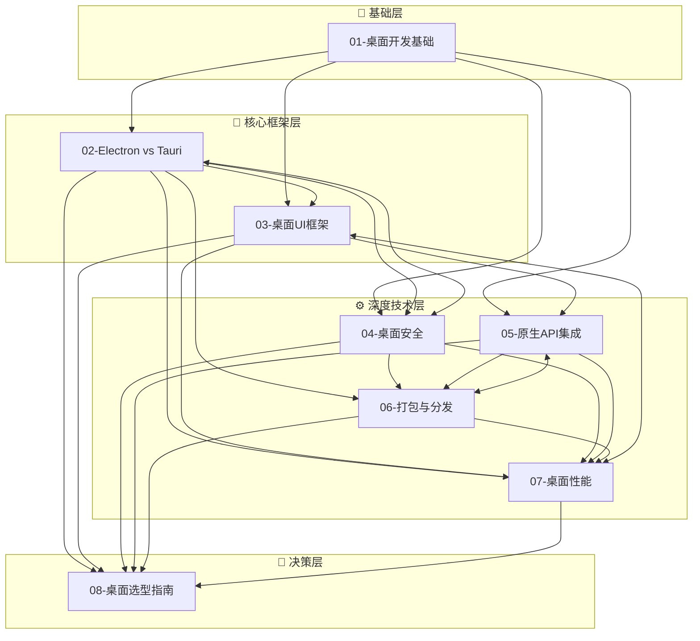

# 桌面开发专题

## 专题概述

在移动互联网大行其道的今天，**桌面应用（Desktop Application）** 依然是生产力工具、创意软件、企业级系统和开发者工具的主战场。从 Visual Studio Code 到 Figma，从 Slack 到 Notion，从 Discord 到 Obsidian——这些广受欢迎的现代桌面应用都有一个共同特征：它们使用 Web 技术（HTML、CSS、JavaScript/TypeScript）构建用户界面，同时通过原生运行时获得操作系统的深度集成能力。这种"Web 技术 + 原生容器"的混合架构，已经成为跨平台桌面开发的主流范式。

Web 技术桌面化的核心优势在于**开发效率与生态共享**。前端开发者可以使用熟悉的组件库、状态管理方案和构建工具来构建桌面 UI；设计团队可以复用 Web 端的设计系统；业务逻辑层可以在 Web 端与桌面端之间高度复用。然而，这种架构也带来独特的挑战：内存占用控制、原生平台能力的桥接、安全沙箱的设计、自动更新机制的构建、以及各操作系统（Windows、macOS、Linux）平台差异的屏蔽。

本专题围绕桌面开发的八大核心维度展开，系统覆盖从基础概念到工程实践、从技术对比到选型决策的完整知识图谱：

- **桌面开发基础**：桌面应用的历史演进、架构模式（原生、混合、PWA、Flutter）、Web 技术桌面化的技术原理
- **Electron vs Tauri**：两大主流框架的架构对比（Chromium + Node.js vs WebView + Rust）、Bundle 体积、内存占用、启动速度、安全模型、生态成熟度
- **桌面 UI 框架**：基于 React、Vue、Svelte、Solid 的桌面端组件库与样式方案，以及原生风格的 UI 框架（如 Tauri 的轻量级方案、Flutter Desktop 的渲染管线）
- **桌面安全**：上下文隔离（Context Isolation）、进程沙箱、内容安全策略（CSP）、代码签名、自动更新的签名验证、反调试与代码保护
- **原生 API 集成**：文件系统访问、系统托盘、全局快捷键、原生对话框、通知中心、硬件访问（串口、蓝牙、USB）、操作系统 API 的桥接模式
- **打包与分发**：Electron Builder、Electron Forge、Tauri CLI 的打包流程；代码签名（Windows 的 EV 证书、macOS 的 Notarization、Apple Silicon / Intel 双架构）；自动更新（Squirrel、NSIS、Tauri Updater）；应用商店分发（Mac App Store、Microsoft Store、Snap/Flatpak）
- **桌面性能**：启动时间优化、主线程与渲染进程的职责分离、内存泄漏诊断、Bundle 体积削减、GPU 加速渲染、原生模块的异步加载
- **桌面选型指南**：根据团队技术栈、应用类型、性能要求、安全等级、分发渠道进行框架与架构决策

桌面开发与前端框架、移动开发等专题存在紧密的知识交叉。掌握本专题，将使你能够基于 Web 技术栈构建专业级的跨平台桌面应用，在开发效率与原生体验之间找到最佳平衡点。

---

## 专题文件导航

本专题共包含 **8 篇核心文章** 与本索引文件，系统覆盖桌面开发领域的理论基础、技术深度与实践选型。以下按推荐学习顺序排列，每篇文章均附有核心内容摘要与直达链接。

### 01. 桌面开发基础

📄 [`01-desktop-fundamentals.md`](./01-desktop-fundamentals.md)

桌面应用开发的入门基石。系统回顾桌面应用的技术演进历程：从 Win32/MFC/Cocoa 的原生开发时代，到 Java Swing/JavaFX 的跨平台尝试，再到 .NET WPF/Electron/Tauri 的现代混合架构。深入讲解 Web 技术桌面化的核心原理——WebView 与 Chromium Embedded Framework（CEF）的渲染模型、JavaScript 与原生代码的双向通信机制（IPC）、以及多进程架构（主进程 + 渲染进程 + GPU 进程）的设计动机。对比分析四种主流桌面应用架构模式：纯原生（Native）、混合 Web（Hybrid Web）、渐进式 Web 应用（PWA with Desktop Integration）、以及自绘 UI（Flutter Desktop / Qt Quick）的技术特征与适用场景。同时介绍桌面应用与 Web 应用在生命周期管理、窗口系统、菜单栏、系统托盘、多实例控制等方面的本质差异。

> **核心关键词**：Desktop Architecture、WebView、Chromium Embedded、IPC、Multi-Process、Native vs Hybrid、PWA

---

### 02. Electron vs Tauri

📄 [`02-electron-tauri-comparison.md`](./02-electron-tauri-comparison.md)

Electron 与 Tauri 是当前 Web 技术桌面开发领域最耀眼的两颗明星。本章进行全方位的技术对比：架构层面——Electron 的 Chromium + Node.js 运行时模型 vs Tauri 的系统 WebView + Rust 后端的轻量化架构；Bundle 体积——Electron 的 100MB+ 基础体积 vs Tauri 的 600KB 级产物体积；内存占用——多 Chromium 实例的内存开销 vs 共享系统 WebView 的内存效率；启动性能——冷启动与热启动的时间对比分析。深入探讨安全模型差异：Electron 的 `contextIsolation` + `preload` 脚本机制、Tauri 的命令系统（Commands）与能力（Capabilities）权限模型。涵盖开发体验对比（TypeScript 支持、热重载、调试工具）、生态成熟度（Electron 的十年积累与庞大社区 vs Tauri 的快速发展与现代设计）、以及真实案例研究（VS Code 的 Electron 架构优化、1Password 的 Tauri 迁移经验）。最后提供基于项目特征的选型决策树。

> **核心关键词**：Electron、Tauri、Chromium、WebView、Rust、Bundle Size、Memory Footprint、Context Isolation、Command System

---

### 03. 桌面 UI 框架

📄 [`03-desktop-ui-frameworks.md`](./03-desktop-ui-frameworks.md)

桌面端的 UI 开发既需要复用 Web 生态的组件积累，又需要适应桌面交互的特殊性（键盘导航、右键菜单、拖拽操作、窗口管理）。本章系统梳理桌面 UI 开发的框架选择：基于 React 的桌面方案（React + Electron/Tauri 的组合、Ant Design / Chakra UI / Radix UI 的桌面适配）；基于 Vue 的桌面方案（Vue 3 + Vite 在桌面端的性能优势、Element Plus / Naive UI 的组件复用）；基于 Svelte / Solid 的轻量级方案（更低的运行时开销、更小的 Bundle 体积）。深入讲解桌面原生风格的 UI 框架——Tauri 官方推荐的轻量方案、Flutter Desktop 的自绘渲染管线与平台适配层、以及原生控件桥接（Native UI Embedding）的技术挑战。涵盖桌面特有的交互模式实现：全局快捷键注册、系统托盘菜单、上下文菜单（Context Menu）、多窗口管理、窗口状态持久化、暗黑模式与系统主题同步、以及高 DPI（Retina）显示适配。

> **核心关键词**：React、Vue、Svelte、Flutter Desktop、Native UI、System Tray、Context Menu、Dark Mode、High DPI

---

### 04. 桌面安全

📄 [`04-desktop-security.md`](./04-desktop-security.md)

桌面应用的安全模型与 Web 应用有本质不同——桌面应用拥有更高的系统权限，一旦被攻破，后果更为严重。本章建立桌面应用安全的纵深防御体系：渲染层安全——Content Security Policy（CSP）在桌面环境的配置、XSS 防护、不可信内容的沙箱渲染；进程隔离——Electron 的 `contextIsolation` 与 `sandbox` 选项的正确配置、Tauri 的进程隔离架构与权限边界；IPC 安全——预加载脚本（preload）的最小权限设计、IPC 通道的输入验证与序列化安全、防止原型链污染攻击；代码完整性——Windows 的代码签名（EV / OV 证书）、macOS 的公证（Notarization）与硬化运行时（Hardened Runtime）、Linux 的 AppImage 签名；自动更新安全——更新包的签名验证、降级攻击防护、更新服务器的 HTTPS 强制与证书固定（Certificate Pinning）。同时涵盖反调试技术、源代码保护（代码混淆、ASAR 加密、V8 字节码编译）、以及供应链安全（依赖库漏洞扫描、原生模块审计）。

> **核心关键词**：Context Isolation、CSP、Code Signing、Notarization、IPC Security、ASAR、Certificate Pinning、Hardened Runtime

---

### 05. 原生 API 集成

📄 [`05-desktop-native-apis.md`](./05-desktop-native-apis.md)

桌面应用的核心价值在于深度集成操作系统能力。本章系统讲解桌面应用与原生 API 的交互模式：文件系统操作——安全的路径处理、文件拖拽（Drag & Drop）、最近文档列表、文件类型关联与打开；系统集成——全局快捷键（Global Shortcut）、系统托盘（System Tray / Menubar）、通知中心（Notification Center / Toast）、徽章计数（Badge Count）、跳转列表（Jump List / Dock Menu）；原生对话框——文件选择器、保存对话框、消息框、打印对话框的调用与自定义；硬件访问——串口通信（SerialPort）、蓝牙（Web Bluetooth / Noble）、USB（WebUSB / node-usb）的集成方案；操作系统 API 桥接——Windows 的 Win32 API 调用（node-ffi / edge-js）、macOS 的 Objective-C/Swift 桥接（NodObjC / node-swift）、Linux 的 D-Bus 通信。深入探讨 Node-API（N-API）与 Rust FFI 在编写跨平台原生扩展时的技术选型与性能考量。

> **核心关键词**：File System、Global Shortcut、System Tray、Notification、SerialPort、Bluetooth、USB、Win32 API、N-API、FFI

---

### 06. 打包与分发

📄 [`06-desktop-packaging-distribution.md`](./06-desktop-packaging-distribution.md)

将桌面应用交付到用户手中是产品化的最后一步，也是最复杂的一步之一。本章系统讲解跨平台打包的完整流程：Electron 生态——Electron Builder 的自动化打包配置（代码签名、多架构构建、自动更新集成）、Electron Forge 的插件化打包体系、以及两者的选型对比；Tauri 生态——Tauri CLI 的打包流程、Bundler 的配置选项（identifier、category、resources、external binaries）、跨平台编译（GitHub Actions / Cross-compilation）。深入代码签名与公证：Windows 的 EV 证书获取与签名流程、SmartScreen 信誉建立；macOS 的开发者证书配置、公证（Notarization）流程与 Stapling、Apple Silicon (arm64) 与 Intel (x64) 的通用二进制（Universal Binary）构建；Linux 的 deb/rpm/AppImage/Snap/Flatpak 五种分发格式对比与选择。涵盖自动更新机制——Electron 的 autoUpdater（Squirrel.Windows / Squirrel.Mac / NSIS）实现原理与服务器部署、Tauri 的 updater 插件与端点配置、增量更新与全量更新的策略选择、更新回滚机制。同时探讨企业内网分发、静默安装、命令行安装参数、以及应用商店上架流程（Microsoft Store、Mac App Store）。

> **核心关键词**：Electron Builder、Electron Forge、Tauri Bundler、Code Signing、Notarization、Auto Update、Universal Binary、AppImage、Microsoft Store

---

### 07. 桌面性能

📄 [`07-desktop-performance.md`](./07-desktop-performance.md)

桌面应用的性能问题往往比 Web 应用更为隐蔽——用户不会频繁关闭和重新打开桌面应用，内存泄漏和性能退化会在长时间运行中逐渐累积。本章建立桌面应用性能优化的系统方法论：启动性能——冷启动与热启动的耗时拆解、Splash Screen 的设计、异步初始化与懒加载策略、V8 代码缓存（Code Caching）与快照（Snapshot）的应用；运行时性能——主线程（Main Process）与渲染进程（Renderer Process）的职责分离原则、CPU 密集型任务向 Worker / Rust 后端的迁移、UI 渲染的 60fps 保障、GPU 加速的启用与调试；内存优化——V8 堆内存监控、原生模块的内存泄漏诊断、关闭窗口时的资源释放、以及 Electron 的 `vm` 模块与上下文隔离对内存的影响。深入 Bundle 体积优化——Tree Shaking 在桌面端的特殊考量、原生模块（native modules）的按需加载、多语言资源的分割与动态加载、以及 ASAR 归档的压缩策略。涵盖性能监控——在桌面环境中集成 Sentry、LogRocket 等监控工具的特殊配置、性能指标（启动时间、内存峰值、CPU 占用）的采集与上报、以及 A/B 测试在桌面端的实施挑战。

> **核心关键词**：Startup Performance、Cold Start、Code Caching、Main Process、Renderer Process、Memory Leak、Tree Shaking、ASAR、Performance Monitoring

---

### 08. 桌面选型指南

📄 [`08-desktop-development-selection-guide.md`](./08-desktop-development-selection-guide.md)

技术选型是桌面应用项目成功的关键决策。本篇作为本专题的收官之作，提供系统化的桌面开发技术选型框架。通过多维度评估矩阵对比 Electron、Tauri、Flutter Desktop、NW.js、Wails、Fyne 等主流方案在以下维度的表现：Bundle 体积与内存占用、启动速度、开发效率（语言/框架熟悉度、热重载、调试体验）、原生平台集成深度、安全模型成熟度、社区生态与商业支持、跨平台一致性（Windows/macOS/Linux 的覆盖度与平台特性适配）。深入分析不同应用场景的选型建议：开发者工具（VS Code 类——Electron 的优势）、轻量级生产力工具（Obsidian 类——Electron/Tauri 均可）、系统级工具（1Password 类——Tauri 的体积优势）、创意软件（Figma 类——自研 CEF / Electron 的自定义空间）、企业级内部工具（Tauri 的安全与体积优势）。详解从原型到生产的架构演进路径、团队技术栈迁移的成本评估、以及桌面端与 Web 端/移动端代码共享的策略（Tauri 的移动端扩展、Flutter 的三端统一）。同时提供桌面项目启动的技术评审 checklist 与常见反模式警示。

> **核心关键词**：Technology Selection、Decision Matrix、Electron vs Tauri vs Flutter、Cross-Platform、Code Sharing、Architecture Decision

---

## 学习路径建议

桌面开发的知识体系兼具前端技术与原生系统编程的交叉特性。以下是按能力层级划分的推荐学习路径：

### 🌱 初级（Junior Developer）

**目标**：掌握桌面应用的基础开发流程，能够构建简单的跨平台桌面应用

1. 从 **01-桌面开发基础** 开始，理解桌面应用与 Web 应用的本质差异，掌握多进程架构的基本概念（约 1 小时）
2. 选择 **Electron** 或 **Tauri** 作为入门框架（建议根据团队技术栈选择），阅读 **02-Electron vs Tauri** 的对应入门章节，完成官方示例项目的构建与运行（约 3 小时）
3. 学习 **03-桌面 UI 框架** 中你所使用前端框架（React/Vue/Svelte）的桌面适配要点，确保熟悉全局快捷键、系统托盘等基础原生 API 的调用方式（约 2 小时）
4. 阅读 **04-桌面安全** 的基础章节，理解 `contextIsolation` 的含义，确保不关闭安全选项（约 30 分钟）

**预期成果**：能够独立搭建桌面应用开发环境，构建包含基础窗口、菜单、对话框功能的简单桌面应用，理解基本的安全配置要求。

### 🚀 中级（Mid-Level Developer）

**目标**：能够开发功能完整的桌面应用，掌握打包分发与基础性能优化

1. 深入 **05-原生 API 集成**，根据应用需求集成文件系统、通知、系统托盘、全局快捷键等功能，理解 IPC 通信的安全设计（约 4 小时）
2. 完整学习 **06-打包与分发**，完成应用的代码签名配置（开发证书即可），实现自动更新机制的集成（约 3 小时）
3. 阅读 **07-桌面性能** 的基础章节，使用 Chrome DevTools 分析渲染进程性能，识别并修复明显的内存泄漏问题（约 2 小时）
4. 对比阅读 **02-Electron vs Tauri** 的深度对比章节，理解所选框架的架构局限与优化空间（约 1 小时）
5. 学习 **04-桌面安全** 的进阶章节，配置 CSP、实施 IPC 输入验证、理解代码签名的必要性（约 1 小时）

**预期成果**：能够开发功能完整、可打包分发、具备自动更新能力的桌面应用，实施基础的安全配置与性能优化。

### 🏆 高级（Senior Developer / Desktop Engineer）

**目标**：设计可扩展的桌面应用架构，主导技术选型与性能调优

1. 深入 **07-桌面性能**，实施启动时间优化（代码缓存、懒加载、快照），建立内存监控与性能回归机制（约 4 小时）
2. 掌握 **05-原生 API 集成** 的高级章节，开发自定义原生扩展（N-API / Rust FFI），桥接操作系统专有 API（约 4 小时）
3. 研读 **08-桌面选型指南**，基于项目特征做出框架选型决策，撰写架构决策记录（ADR）（约 2 小时）
4. 学习 **04-桌面安全** 的完整内容，建立代码签名、公证、自动更新验证的完整安全流水线（约 2 小时）
5. 深入 **06-打包与分发** 的企业级章节，配置多架构构建（x64 + arm64）、企业内网分发、应用商店上架（约 2 小时）

**预期成果**：能够设计支撑复杂业务场景的桌面应用架构，主导技术选型，建立安全与性能的工程规范。

### 🎯 专家（Staff+ / Principal Engineer）

**目标**：推动组织级桌面开发卓越，影响桌面技术生态

1. 建立跨团队的桌面开发技术委员会，定义桌面应用开发的架构标准、安全规范与发布流程
2. 推动桌面性能的平台化监控，建立启动时间、内存占用、崩溃率的统一看板与告警机制
3. 在 **07-桌面性能** 的基础上，自研或定制桌面性能分析工具，建立自动化的性能回归测试体系
4. 深入参与 Electron 或 Tauri 开源项目的贡献，将业务实践中的改进反馈给上游社区
5. 探索桌面端与 Web 端/移动端的代码共享最大化方案，建立组织级的跨平台组件库与工具链

**预期成果**：桌面开发成为组织的技术优势，产品在体积、启动速度、稳定性方面处于行业领先水平，桌面实践对外输出影响力。

---

## 知识关联图谱

以下 Mermaid 图展示了本专题 8 篇文章之间的知识依赖关系与逻辑脉络。箭头方向表示推荐阅读顺序，双向连线表示内容交叉引用。

### 图谱解读

- **基础层**：**01-桌面开发基础** 是所有后续文章的共同前提，建立了桌面应用架构的多进程模型与 Web 技术桌面化的核心概念
- **核心框架层**：**02-Electron vs Tauri** 与 **03-桌面 UI 框架** 是进入实际开发的入口。在选定技术栈后，UI 框架的选择与原生 API 的调用将成为日常工作的主要内容
- **深度技术层**：这四篇文章覆盖了桌面应用工程化的关键挑战——安全、原生集成、分发与性能。它们之间没有严格的先后顺序，可根据项目阶段（开发期侧重安全与原生 API，发布期侧重打包分发，运营期侧重性能优化）选择性深入
- **决策层**：**08-桌面选型指南** 需要在理解其他文章的基础上阅读，是知识向架构决策能力的转化节点

---

## 交叉引用

桌面开发是跨平台技术栈的重要组成部分，与以下专题存在深度的知识交叉：

### [框架模型专题](/framework-models/)

桌面应用的前端层本质上是运行在桌面容器中的 Web 应用，因此前端框架的选择与使用模式直接决定了桌面端的开发体验与性能表现。React 的 Concurrent Features、Vue 的响应式编译优化、Svelte 的编译时体积削减，这些框架特性在桌面端同样适用且往往更加重要（因为桌面应用的用户期望更流畅的交互）。**03-桌面 UI 框架** 中的组件库选择与状态管理方案，需要结合框架模型专题中的最新演进进行决策。建议在深入学习桌面 UI 开发前，先确保对所选前端框架有扎实的理解。

### [移动开发专题](/mobile-development/)

桌面开发与移动开发在跨平台技术选型上存在有趣的交集。Flutter 同时支持桌面端与移动端，是构建全平台统一体验的有力选择；Tauri v2 也扩展了对 iOS 与 Android 的支持，使得 Rust + WebView 的技术栈可以覆盖三端；React Native 通过 react-native-windows 和 react-native-macos 项目也进入了桌面领域。如果你的产品需要同时覆盖桌面与移动平台，**08-桌面选型指南** 中的跨平台统一方案评估将与移动开发专题形成直接互补。建议在规划多平台产品路线图时，同时参考两个专题的选型框架。

---

## 权威引用与延伸阅读

本专题的知识体系建立在桌面开发领域的官方文档、工业实践与开源社区贡献之上。以下列出核心参考文献与推荐资源。

### 官方文档

- **[Electron Documentation](https://www.electronjs.org/docs)**：Electron 的官方文档，涵盖应用生命周期、主进程与渲染进程、原生 API、安全最佳实践、分发与更新的完整指南。安全清单（Security Checklist）是必读的入门材料。
- **[Tauri Documentation](https://tauri.app/v1/guides/)**：Tauri 的官方文档，涵盖 Rust 后端开发、前端集成、打包配置、安全模型、插件系统的详细说明。Architecture 章节对理解 Tauri 的设计理念尤为关键。
- **[Flutter Desktop Documentation](https://docs.flutter.dev/desktop)**：Flutter 桌面端的官方文档，涵盖 Windows、macOS、Linux 的平台适配与构建配置。
- **[Wails Documentation](https://wails.io/docs/introduction)**：Go 语言桌面应用框架 Wails 的文档，是 Tauri 的 Go 语言替代方案参考。

### 经典资源

- **[Electron Fiddle](https://www.electronjs.org/fiddle)**：Electron 官方提供的快速实验环境，无需配置即可运行和分享 Electron 代码片段，是学习 Electron API 的最佳工具。
- **[Awesome Electron](https://github.com/sindresorhus/awesome-electron)**：Electron 生态的精选资源列表，涵盖工具、模板、教程和示例应用。
- **[Awesome Tauri](https://github.com/tauri-apps/awesome-tauri)**：Tauri 生态的精选资源列表，收录了使用 Tauri 构建的知名应用与社区插件。

### 安全参考

- **[Electron Security Guidelines](https://www.electronjs.org/docs/latest/tutorial/security)**：Electron 官方安全指南，包含 17 条安全建议与最佳实践，是构建安全 Electron 应用的必读文档。
- **[OWASP Desktop Application Security](https://owasp.org/www-project-desktop-app-security-top-10/)**：OWASP 桌面应用安全 Top 10，涵盖了桌面应用面临的主要安全威胁与防护策略。
- **[Apple Notarization Guide](https://developer.apple.com/documentation/security/notarizing_macos_software_before_distribution)**：macOS 应用公证的官方指南，涵盖证书配置、公证流程与常见问题。

### 性能与架构

- **"Electron Performance Checklist"**（Electron 官方博客）：系统化的 Electron 性能优化建议，涵盖启动时间、内存、Bundle 体积的优化策略。
- **[Chromium Multi-Process Architecture](https://www.chromium.org/developers/design-documents/multi-process-architecture/)**：Chromium 多进程架构的官方设计文档，理解 Electron 底层运行时的必读材料。
- **[V8 Blog](https://v8.dev/blog)**：V8 引擎优化技术博客，对理解桌面端 JavaScript 执行性能有直接帮助。

### 案例研究

- **"VS Code: The First Second"**（Microsoft 博客）：Visual Studio Code 团队分享的启动性能优化经验，是 Electron 应用性能优化的标杆案例。
- **"1Password 8: The Next Generation"**（1Password 博客）：1Password 从 Electron 迁移到 Rust + 原生 UI 的技术决策过程与经验总结，对理解桌面技术选型有重要参考价值。
- **"Notion's Electron Journey"**：Notion 团队在 Electron 应用开发中的架构演进与性能优化实践。

### 社区与生态

- **[Electron Discord](https://discord.gg/electron)** 与 **[Tauri Discord](https://discord.gg/tauri)**：两个框架的官方社区，活跃的开发者讨论与问题解答渠道。
- **[Electron Forge](https://www.electronforge.io/)** 与 **[Electron Builder](https://www.electron.build/)** 文档：Electron 生态中两大主流打包工具的完整文档。

---

## 快速开始

如果你是第一次访问本专题，建议按以下顺序开始：

1. 📖 阅读 **01-桌面开发基础**，理解桌面应用的多进程架构与 Web 技术桌面化的核心原理（约 45 分钟）
2. 🔧 根据你的语言偏好选择框架：熟悉 Rust 者优先尝试 **Tauri**，熟悉 Node.js 者优先尝试 **Electron**。阅读 **02-Electron vs Tauri** 的对应入门章节，完成官方 quick-start 项目的构建（约 2 小时）
3. 🎨 在 **03-桌面 UI 框架** 中找到你所使用前端框架的桌面适配指南，将熟悉的组件库引入桌面项目（约 1 小时）
4. 🛡️ 阅读 **04-桌面安全** 的安全清单章节，确认开发环境的安全配置正确（约 20 分钟）
5. 📦 提前浏览 **06-打包与分发** 的概述章节，了解从代码到可执行文件的完整路径（约 30 分钟）

桌面开发是一场 Web 技术与原生能力的融合之旅。你既可以使用熟悉的前端技术快速构建界面，又能够深入操作系统底层提供原生体验。愿本专题成为你构建下一代桌面应用的可靠指南。
