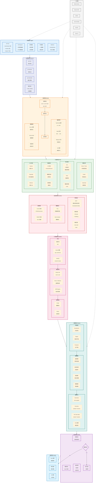

```mermaid
%%{init: {'theme': 'base', 'themeVariables': { 'fontSize': '14px'}}}%%
flowchart TB
    subgraph Trigger["🚀 触发器 (Trigger)"]
        direction TB
        
        GitPush["Git Push
        <br/>• main/master 分支
        <br/>• develop 分支
        <br/>• feature/* 分支"]
        PullRequest["Pull Request
        <br/>• 代码审查触发
        <br/>• PR 创建/更新"]
        Scheduled["定时触发
        <br/>• 每日构建
        <br/>• 定时部署"]
        Manual["手动触发
        <br/>• 一键部署
        <br/>• 紧急发布"]
        Webhook["Webhook
        <br/>• GitHub/GitLab
        <br/>• 第三方集成"]
    end
    
    subgraph Source["📥 源码阶段 (Source)"]
        Clone["git clone
        <br/>检出代码"]
        Checkout["git checkout
        <br/>切换分支"]
        Submodule["git submodule
        <br/>更新子模块"]
        CacheRestore["缓存恢复
        <br/>• node_modules
        <br/>• 构建缓存"]
    end
    
    subgraph Build["🔨 构建阶段 (Build)"]
        direction TB
        
        Install["依赖安装
        <br/>npm ci / yarn install
        <br/>pip install"]
        
        Compile["编译阶段"]
        
        subgraph CompileSteps["编译步骤"]
            TSC["TypeScript 编译
        <br/>tsc --build"]
            Babel["Babel 转译
        <br/>ES6+ → ES5"]
            Webpack["Webpack 打包
        <br/>资源处理"]
            Vite["Vite 构建
        <br/>极速打包"]
        end
        
        BuildApp["应用构建"]
        
        subgraph BuildSteps["构建步骤"]
            NextJS["Next.js 构建
        <br/>静态导出"]
            DockerBuild["Docker Build
        <br/>镜像构建"]
            Assets["资源处理
        <br/>压缩/合并"]
        end
        
        Install --> Compile
        Compile --> BuildApp
    end
    
    subgraph Test["🧪 测试阶段 (Test)"]
        direction TB
        
        subgraph StaticAnalysis["静态分析"]
            Lint["ESLint / TSLint
        <br/>代码规范检查"]
            Prettier["Prettier
        <br/>代码格式化"]
            TypeCheck["TypeScript
        <br/>类型检查"]
        end
        
        subgraph UnitTest["单元测试"]
            Jest["Jest
        <br/>• 测试执行
        <br/>• 覆盖率报告"]
            Vitest["Vitest
        <br/>• 极速测试"]
            Coverage["覆盖率阈值
        <br/>> 80%"]
        end
        
        subgraph IntegrationTest["集成测试"]
            API["API 测试
        <br/>Postman/Newman"]
            DBTest["数据库测试
        <br/>迁移验证"]
            Service["服务集成
        <br/>端到端"]
        end
        
        subgraph E2ETest["E2E 测试"]
            Cypress["Cypress
        <br/>前端 E2E"]
            Playwright["Playwright
        <br/>多浏览器测试"]
            Selenium["Selenium
        <br/>传统 E2E"]
        end
    end
    
    subgraph Security["🔒 安全阶段 (Security)"]
        direction TB
        
        subgraph CodeSecurity["代码安全"]
            SAST["SAST
        <br/>静态应用安全测试
        <br/>SonarQube/CodeQL"]
            Secrets["密钥扫描
        <br/>• GitLeaks
        <br/>• TruffleHog"]
            Dependencies["依赖扫描
        <br/>• npm audit
        <br/>• Snyk"]
        end
        
        subgraph ImageSecurity["镜像安全"]
            Trivy["Trivy
        <br/>容器漏洞扫描"]
            SnykContainer["Snyk Container
        <br/>镜像安全"]
        end
        
        subgraph Compliance["合规检查"]
            License["License 检查
        <br/>FOSSA/ScanCode"]
            Owasp["OWASP 检查
        <br/>Top 10 漏洞"]
        end
    end
    
    subgraph Artifact["📦 制品阶段 (Artifact)"]
        direction TB
        
        subgraph Package["打包"]
            Zip["压缩打包
        <br/>dist/"]
            DockerImage["Docker 镜像
        <br/>tag: commit-sha"]
            NPM["NPM 包
        <br/>semantic-release"]
        end
        
        subgraph Registry["制品仓库"]
            DockerHub["Docker Hub
        <br/>/ ECR / ACR"]
            Nexus["Nexus / Artifactory
        <br/>通用制品库"]
            NPMRegistry["NPM Registry
        <br/>私有包管理"]
        end
        
        subgraph Sign["签名验证"]
            Cosign["Cosign
        <br/>镜像签名"]
            Notary["Notary
        <br/>内容信任"]
        end
        
        Package --> Registry
        Registry --> Sign
    end
    
    subgraph Deploy["🚀 部署阶段 (Deploy)"]
        direction TB
        
        subgraph Environment["环境选择"]
            Dev["Development
        <br/>开发环境"]
            Staging["Staging
        <br/>预发布环境"]
            Prod["Production
        <br/>生产环境"]
        end
        
        subgraph Strategy["部署策略"]
            BlueGreen["蓝绿部署
        <br/>零停机切换"]
            Canary["金丝雀发布
        <br/>灰度发布"]
            Rolling["滚动更新
        <br/>渐进式部署"]
            Recreate["重建部署
        <br/>停机部署"]
        end
        
        subgraph Platform["部署平台"]
            Kubernetes["Kubernetes
        <br/>helm upgrade"]
            Serverless["Serverless
        <br/>Lambda / Functions"]
            VM["VM / Bare Metal
        <br/>Ansible / Terraform"]
            CDN["CDN 部署
        <br/>静态资源"]
        end
        
        Environment --> Strategy
        Strategy --> Platform
    end
    
    subgraph Verify["✅ 验证阶段 (Verify)"]
        Smoke["冒烟测试
        <br/>关键功能验证"]
        Health["健康检查
        <br/>/health 端点"]
        Monitor["监控告警
        <br/>• 错误率
        <br/>• 响应时间"]
        Rollback{"需要回滚?"}
        RollbackExec["执行回滚
        <br/>一键还原"]
    end
    
    subgraph Notify["📢 通知阶段 (Notify)"]
        Slack["Slack 通知
        <br/>构建结果"]
        Email["邮件通知
        <br/>团队邮箱"]
        Jira["Jira 更新
        <br/>工单状态"]
    end
    
    subgraph Tools["🔧 工具栈"]
        GitHubActions["GitHub Actions"]
        GitLabCI["GitLab CI/CD"]
        Jenkins["Jenkins"]
        AzureDevOps["Azure DevOps"]
        CircleCI["CircleCI"]
        TravisCI["Travis CI"]
    end
    
    %% 流程连接
    Trigger --> Source
    Source --> Build
    Build --> Test
    Test --> Security
    Security --> Artifact
    Artifact --> Deploy
    Deploy --> Verify
    Verify --> Notify
    
    Rollback -->|Yes| RollbackExec
    Rollback -->|No| Notify
    
    Verify --> Rollback
    
    Tools -.-> Trigger
    Tools -.-> Build
    Tools -.-> Test
    Tools -.-> Deploy
    
    %% 样式
    classDef trigger fill:#e3f2fd,stroke:#1565c0,stroke-width:2px
    classDef source fill:#e8eaf6,stroke:#3f51b5,stroke-width:2px
    classDef build fill:#fff3e0,stroke:#ef6c00,stroke-width:2px
    classDef test fill:#e8f5e9,stroke:#2e7d32,stroke-width:2px
    classDef security fill:#ffebee,stroke:#c62828,stroke-width:2px
    classDef artifact fill:#fce4ec,stroke:#c2185b,stroke-width:2px
    classDef deploy fill:#e0f2f1,stroke:#00695c,stroke-width:2px
    classDef verify fill:#f3e5f5,stroke:#7b1fa2,stroke-width:2px
    classDef notify fill:#e1f5fe,stroke:#0277bd,stroke-width:2px
    classDef tools fill:#f5f5f5,stroke:#616161,stroke-width:2px
    
    class Trigger,GitPush,PullRequest,Scheduled,Manual,Webhook trigger
    class Source,Clone,Checkout,Submodule,CacheRestore source
    class Build,Install,Compile,CompileSteps,BuildApp,BuildSteps build
    class Test,StaticAnalysis,UnitTest,IntegrationTest,E2ETest test
    class Security,CodeSecurity,ImageSecurity,Compliance security
    class Artifact,Package,Registry,Sign artifact
    class Deploy,Environment,Strategy,Platform deploy
    class Verify,Smoke,Health,Monitor,Rollback,RollbackExec verify
    class Notify,Slack,Email,Jira notify
    class Tools,GitHubActions,GitLabCI,Jenkins,AzureDevOps,CircleCI,TravisCI tools
```
