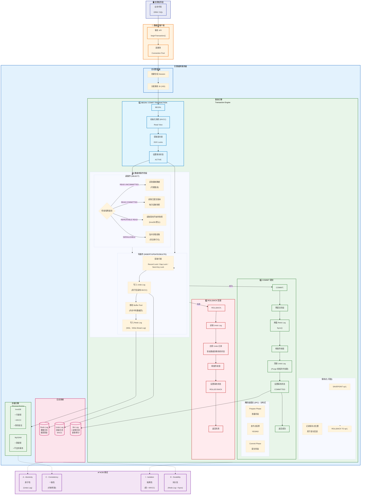

```mermaid
%%{init: {'theme': 'base', 'themeVariables': { 'fontSize': '15px'}}}%%
flowchart TB
    subgraph App["🖥️ 应用程序层"]
        AppCode["业务代码
        <br/>ORM / SQL"]
    end
    
    subgraph DBClient["📡 数据库客户端"]
        ConnectionPool["连接池
        <br/>Connection Pool"]
        TransactionAPI["事务 API
        <br/>beginTransaction()"]
    end
    
    subgraph DBServer["🗄️ 数据库服务器"]
        direction TB
        
        subgraph SessionManager["会话管理器
        Session Manager"]
            CreateSession["创建会话 Session"]
            AssignTxID["分配事务 ID (XID)"]
        end
        
        subgraph TransactionEngine["事务引擎
        Transaction Engine"]
            direction TB
            
            subgraph BEGIN["1️⃣ BEGIN / START TRANSACTION"]
                BeginCmd["BEGIN;"]
                InitSnapshot["初始化快照 (MVCC)
                <br/>Read View"]
                LockResources["获取意向锁
                <br/>IS/IX Locks"]
                SetStatus["设置事务状态
                <br/>ACTIVE"]
            end
            
            subgraph Operations["2️⃣ 数据库操作阶段"]
                direction TB
                
                subgraph ReadOps["读操作 (SELECT)"]
                    ReadCheck{"检查隔离级别"}
                    ReadCheck -->|READ UNCOMMITTED| RU["读取最新数据
                    <br/>(可能脏读)"]
                    ReadCheck -->|READ COMMITTED| RC["读取已提交版本
                    <br/>每次读新快照"]
                    ReadCheck -->|REPEATABLE READ| RR["读取事务开始时快照
                    <br/>(InnoDB 默认)"]
                    ReadCheck -->|SERIALIZABLE| SER["加共享锁读取
                    <br/>(完全串行化)"]
                end
                
                subgraph WriteOps["写操作 (INSERT/UPDATE/DELETE)"]
                    AcquireLock["获取行锁
                    <br/>Record Lock / Gap Lock / Next-Key Lock"]
                    WriteUndoLog["写入 Undo Log
                    <br/>(用于回滚和 MVCC)"]
                    ModifyBuffer["修改 Buffer Pool
                    <br/>(内存中的数据页)"]
                    WriteRedoLog["写入 Redo Log
                    <br/>(WAL - Write Ahead Log)"]
                end
                
                ReadOps -.-> WriteOps
            end
            
            subgraph Savepoint["保存点 (可选)"]
                SaveCmd["SAVEPOINT sp1;"]
                RecordSave["记录保存点位置
                <br/>用于部分回滚"]
                RollbackTo["ROLLBACK TO sp1;"]
            end
            
            subgraph COMMIT["3️⃣ COMMIT 提交"]
                CommitCmd["COMMIT;"]
                PreCommit["预提交阶段"]
                
                subgraph TwoPC["两阶段提交 (2PC) - 分布式"]
                    Prepare["Prepare Phase
                    <br/>准备阶段"]
                    Vote["各节点投票
                    <br/>YES/NO"]
                    CommitPhase["Commit Phase
                    <br/>提交阶段"]
                end
                
                FlushRedoLog["刷盘 Redo Log
                <br/>fsync()"]
                ReleaseLocks["释放所有锁"]
                ClearUndoLog["清理 Undo Log
                <br/>(Purge 线程异步处理)"]
                SetCommitted["设置事务状态
                <br/>COMMITTED"]
                ReturnOK["返回成功"]
            end
            
            subgraph ROLLBACK["3️⃣ ROLLBACK 回滚"]
                RollbackCmd["ROLLBACK;"]
                ReadUndoLog["读取 Undo Log"]
                ApplyUndo["应用 Undo 记录
                <br/>恢复数据到事务前状态"]
                ReleaseLocksRB["释放所有锁"]
                SetRolledBack["设置事务状态
                <br/>ROLLED BACK"]
                ReturnErr["返回失败"]
            end
        end
        
        subgraph StorageEngine["存储引擎
        Storage Engine"]
            InnoDB["InnoDB
        <br/>• 行级锁
        <br/>• MVCC
        <br/>• 事务安全"]
            MyISAM["MyISAM
        <br/>• 表级锁
        <br/>• 不支持事务"]
        end
        
        subgraph LogSystem["日志系统"]
            RedoLog[(Redo Log<br/>重做日志<br/>崩溃恢复)]
            UndoLog[(Undo Log<br/>回滚日志<br/>MVCC)]
            BinLog[(Bin Log<br/>二进制日志<br/>复制/审计)]
        end
    end
    
    subgraph ACID["✅ ACID 保证"]
        Atomicity["A - Atomicity
        <br/>原子性
        <br/>(Undo Log)"]
        Consistency["C - Consistency
        <br/>一致性
        <br/>(约束检查)"]
        Isolation["I - Isolation
        <br/>隔离性
        <br/>(锁 + MVCC)"]
        Durability["D - Durability
        <br/>持久性
        <br/>(Redo Log + fsync)"]
    end
    
    %% 流程连接
    AppCode --> TransactionAPI
    TransactionAPI --> ConnectionPool
    ConnectionPool --> CreateSession
    CreateSession --> AssignTxID
    AssignTxID --> BeginCmd
    
    BeginCmd --> InitSnapshot
    InitSnapshot --> LockResources
    LockResources --> SetStatus
    SetStatus --> ReadOps
    SetStatus --> WriteOps
    
    WriteOps --> AcquireLock
    AcquireLock --> WriteUndoLog
    WriteUndoLog --> ModifyBuffer
    ModifyBuffer --> WriteRedoLog
    
    WriteRedoLog --> RedoLog
    WriteUndoLog --> UndoLog
    
    Operations -->|成功| CommitCmd
    Operations -->|失败| RollbackCmd
    Savepoint --> RollbackTo
    
    CommitCmd --> PreCommit
    PreCommit --> FlushRedoLog
    FlushRedoLog --> ReleaseLocks
    ReleaseLocks --> ClearUndoLog
    ClearUndoLog --> SetCommitted
    SetCommitted --> BinLog
    SetCommitted --> ReturnOK
    
    RollbackCmd --> ReadUndoLog
    ReadUndoLog --> ApplyUndo
    ApplyUndo --> ReleaseLocksRB
    ReleaseLocksRB --> SetRolledBack
    SetRolledBack --> ReturnErr
    
    TransactionEngine --> StorageEngine
    
    LogSystem -.-> Atomicity
    LogSystem -.-> Durability
    TransactionEngine -.-> Isolation
    StorageEngine -.-> Consistency
    
    %% 样式
    classDef app fill:#e8eaf6,stroke:#3f51b5,stroke-width:2px
    classDef client fill:#fff3e0,stroke:#ef6c00,stroke-width:2px
    classDef server fill:#e3f2fd,stroke:#1565c0,stroke-width:2px
    classDef engine fill:#e8f5e9,stroke:#2e7d32,stroke-width:2px
    classDef log fill:#fce4ec,stroke:#c2185b,stroke-width:2px
    classDef acid fill:#f3e5f5,stroke:#7b1fa2,stroke-width:2px
    classDef begin fill:#e1f5fe,stroke:#0277bd,stroke-width:2px
    classDef commit fill:#e8f5e9,stroke:#2e7d32,stroke-width:2px
    classDef rollback fill:#ffebee,stroke:#c62828,stroke-width:2px
    
    class App,AppCode app
    class DBClient,ConnectionPool,TransactionAPI client
    class DBServer,SessionManager server
    class TransactionEngine engine
    class StorageEngine,InnoDB,MyISAM engine
    class LogSystem,RedoLog,UndoLog,BinLog log
    class ACID,Atomicity,Consistency,Isolation,Durability acid
    class BEGIN,BeginCmd,InitSnapshot,LockResources,SetStatus begin
    class COMMIT,CommitCmd,PreCommit,FlushRedoLog,ReleaseLocks,ClearUndoLog,SetCommitted,ReturnOK commit
    class ROLLBACK,RollbackCmd,ReadUndoLog,ApplyUndo,ReleaseLocksRB,SetRolledBack,ReturnErr rollback
```
