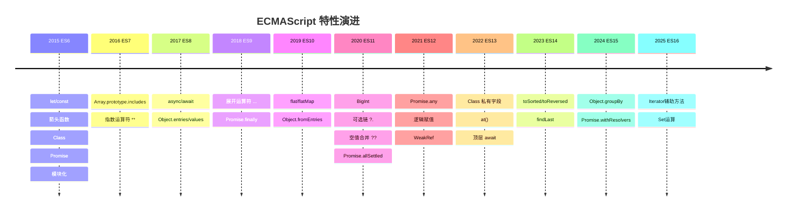
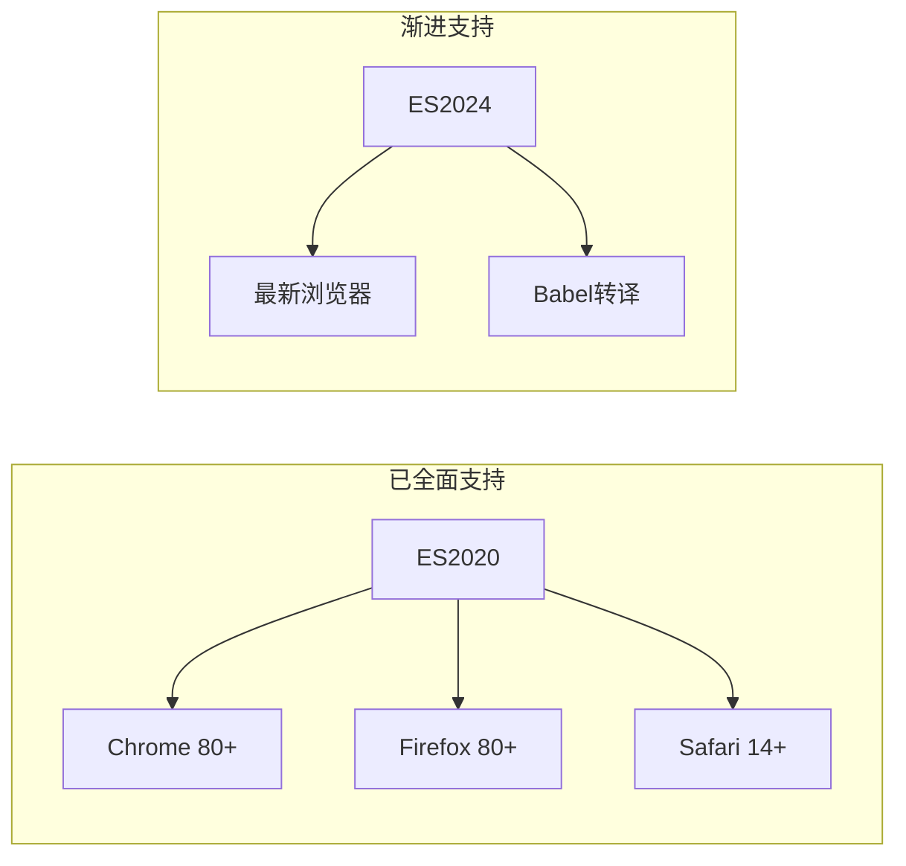
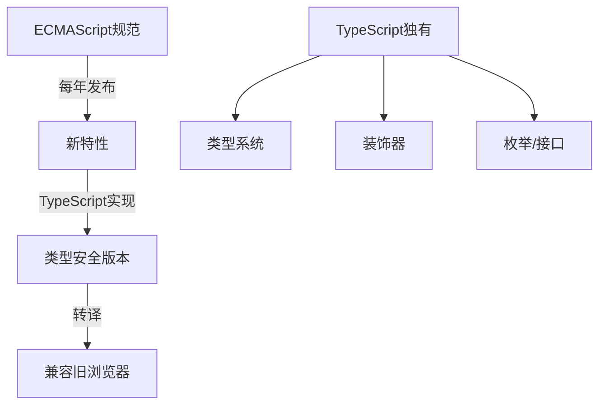

# ECMAScript 标准演进时间线 (ES2020 - ES2026)

> ECMAScript 是 JavaScript 语言的标准规范，由 TC39 委员会每年发布一个新版本。理解这一演进脉络有助于把握语言发展方向，做出更合理的技术选型。

## 特性演进时间线



## 关键特性详解

### ES2020 (ES11) — 现代 JavaScript 的里程碑

ES2020 引入了多个改变开发方式的特性：

| 特性 | 语法 | 解决痛点 |
|------|------|----------|
| BigInt | `9007199254740993n` | 超过 2^53 的精确整数 |
| 可选链 | `obj?.a?.b` | 深层属性访问的 null 检查 |
| 空值合并 | `value ?? default` | 仅对 null/undefined 生效的默认值 |
| Promise.allSettled | `Promise.allSettled([p1, p2])` | 等待所有 Promise 完成 |
| 动态 import | `await import('./mod')` | 运行时条件加载 |

```javascript
// 可选链 + 空值合并的组合
const userCity = user?.address?.city ?? 'Unknown';

// 对比传统写法
const userCity = user && user.address && user.address.city ? user.address.city : 'Unknown';
```

### ES2022 (ES13) — Class 的完善

```javascript
class Counter &#123;
  #count = 0;           // 私有字段
  static #instances = 0; // 静态私有字段

  increment() &#123;
    this.#count++;
    Counter.#instances++;
  &#125;

  get #formatted() &#123;   // 私有访问器
    return `Count: $&#123;this.#count&#125;`;
  &#125;
&#125;
```

## 浏览器支持状态



| 版本 | Chrome | Firefox | Safari | Node.js |
|------|--------|---------|--------|---------|
| ES2020 | 80 | 80 | 14 | 14.0 |
| ES2021 | 85 | 85 | 14.1 | 16.0 |
| ES2022 | 94 | 93 | 15.4 | 18.0 |
| ES2023 | 110 | 115 | 16.4 | 20.0 |
| ES2024 | 122 | 123 | 17.4 | 22.0 |

## TypeScript 与 ECMAScript 的关系



TypeScript 是 ECMAScript 的超集，这意味着：

- 所有有效的 JavaScript 都是有效的 TypeScript
- TypeScript 在 ECMAScript 特性基础上增加了类型系统
- TypeScript 编译器可以将新特性转译为旧环境兼容的代码

## 参考资源

- [语言语义导读](/fundamentals/language-semantics) — ES2020-ES2025 特性矩阵
- [10-fundamentals/10.1-language-semantics](/fundamentals/language-semantics) — 语言核心特性全览

---

 [← 返回架构图首页](./)
