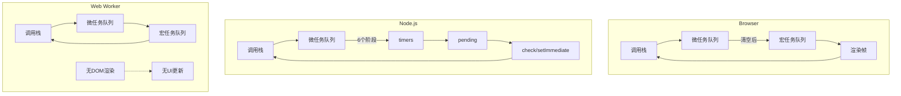
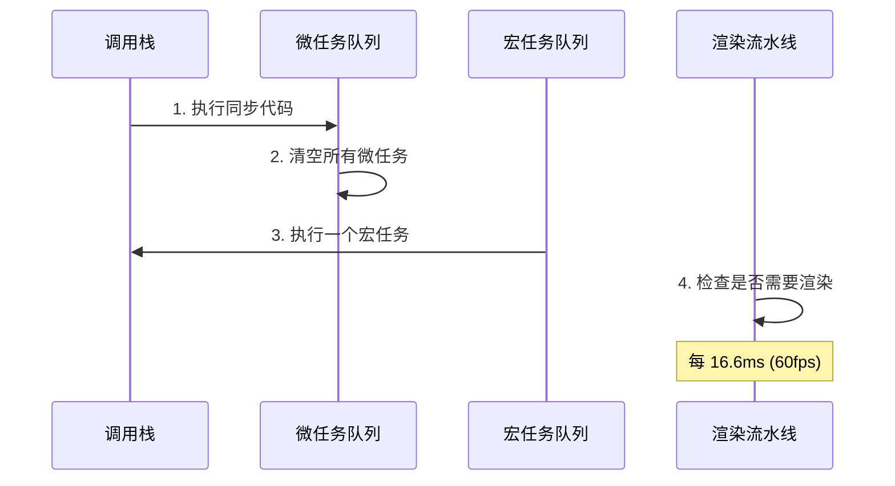
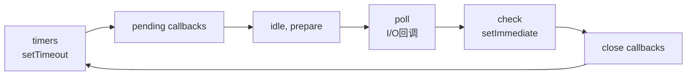
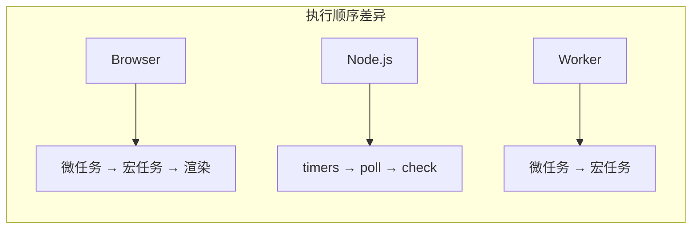

# Event Loop 架构对比 - Browser vs Node.js vs Worker

> Event Loop 是 JavaScript 异步编程的核心机制。不同运行时的 Event Loop 实现存在显著差异，理解这些差异对编写高性能、跨平台的代码至关重要。

## 三大运行时对比



## 浏览器 Event Loop

浏览器的 Event Loop 以**渲染帧**为核心驱动力：



### 微任务 vs 宏任务

| 类型 | 优先级 | 示例 | 触发时机 |
|------|--------|------|----------|
| **微任务** | 高 | Promise.then、queueMicrotask、MutationObserver | 当前宏任务结束后立即执行 |
| **宏任务** | 低 | setTimeout、setInterval、I/O、UI事件 | 下一轮 Event Loop |

```javascript
console.log('1');
setTimeout(() => console.log('2'), 0);
Promise.resolve().then(() => console.log('3'));
console.log('4');
// 输出: 1 → 4 → 3 → 2
```

## Node.js Event Loop

Node.js 的 Event Loop 分为**六个阶段**：



| 阶段 | 说明 | 示例 |
|------|------|------|
| timers | 执行 setTimeout/setInterval 回调 | `setTimeout(cb, 0)` |
| pending callbacks | 执行延迟到下一轮的 I/O 回调 | TCP 错误回调 |
| idle, prepare | Node 内部使用 | - |
| poll | 检索新的 I/O 事件 | fs.readFile 回调 |
| check | 执行 setImmediate 回调 | `setImmediate(cb)` |
| close callbacks | 执行 close 事件回调 | `socket.on('close')` |

### process.nextTick 的特殊性

```javascript
// nextTick 优先级高于所有微任务
setTimeout(() => console.log('timeout'), 0);
setImmediate(() => console.log('immediate'));
Promise.resolve().then(() => console.log('promise'));
process.nextTick(() => console.log('nextTick'));

// Node.js 输出: nextTick → promise → timeout → immediate
```

## Web Worker 的 Event Loop

Web Worker 运行在独立线程中，其 Event Loop 更简洁：

```javascript
// main.js
const worker = new Worker('worker.js');
worker.postMessage(&#123; data: largeArray &#125;);
worker.onmessage = (e) => &#123;
  console.log('Result:', e.data);
&#125;;

// worker.js
self.onmessage = (e) => &#123;
  // 在独立线程中执行，不阻塞主线程
  const result = heavyComputation(e.data);
  self.postMessage(result);
&#125;;
```

| 特性 | 主线程 | Web Worker |
|------|--------|-----------|
| DOM 访问 | ✅ | ❌ |
| 全局对象 | `window` | `self` |
| 渲染更新 | ✅ | ❌ |
| 通信方式 | - | postMessage |
| Event Loop | 含渲染 | 纯任务调度 |

## 关键差异总结



| 场景 | Browser | Node.js | Worker |
|------|---------|---------|--------|
| `setTimeout(0)` | 最小 4ms | 立即（timers阶段） | 立即 |
| `setImmediate` | 不支持 | check 阶段 | 不支持 |
| `requestAnimationFrame` | 渲染前 | 不支持 | 不支持 |
| 微任务清空时机 | 每次宏任务后 | 每个阶段之间 | 每次宏任务后 |

## 参考资源

- [执行模型导读](/fundamentals/execution-model) — 调用栈、事件循环、V8 编译管线
- **并发异步示例** — Web Workers、SharedArrayBuffer

---

 [← 返回架构图首页](./)
