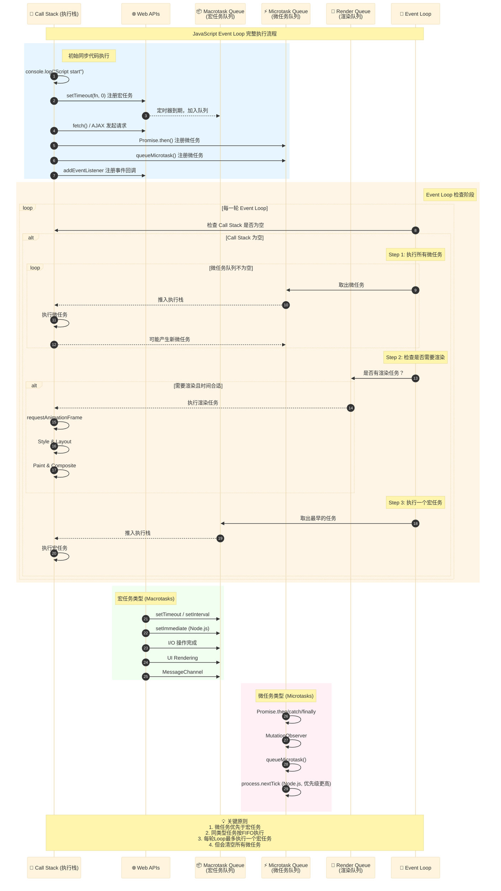

```mermaid
%%{init: {'theme': 'base', 'themeVariables': { 'fontSize': '16px'}}}%%
sequenceDiagram
    autonumber
    participant CallStack as 🥞 Call Stack (执行栈)
    participant WebAPIs as 🌐 Web APIs
    participant Macrotask as 📦 Macrotask Queue<br/>(宏任务队列)
    participant Microtask as ⚡ Microtask Queue<br/>(微任务队列)
    participant Render as 🎨 Render Queue<br/>(渲染队列)
    participant EventLoop as 🔄 Event Loop

    Note over CallStack,EventLoop: JavaScript Event Loop 完整执行流程

    rect rgb(230, 245, 255)
        Note right of CallStack: 初始同步代码执行
        CallStack->>CallStack: console.log("Script start")
        CallStack->>WebAPIs: setTimeout(fn, 0) 注册宏任务
        WebAPIs-->>Macrotask: 定时器到期，加入队列
        CallStack->>WebAPIs: fetch() / AJAX 发起请求
        CallStack->>Microtask: Promise.then() 注册微任务
        CallStack->>Microtask: queueMicrotask() 注册微任务
        CallStack->>WebAPIs: addEventListener 注册事件回调
    end

    rect rgb(255, 245, 230)
        Note right of EventLoop: Event Loop 检查阶段
        loop 每一轮 Event Loop
            EventLoop->>CallStack: 检查 Call Stack 是否为空
            
            alt Call Stack 为空
                Note over EventLoop: Step 1: 执行所有微任务
                loop 微任务队列不为空
                    EventLoop->>Microtask: 取出微任务
                    Microtask-->>CallStack: 推入执行栈
                    CallStack->>CallStack: 执行微任务
                    CallStack-->>Microtask: 可能产生新微任务
                end
                
                Note over EventLoop: Step 2: 检查是否需要渲染
                EventLoop->>Render: 是否有渲染任务？
                
                alt 需要渲染且时间合适
                    Render-->>CallStack: 执行渲染任务
                    CallStack->>CallStack: requestAnimationFrame
                    CallStack->>CallStack: Style & Layout
                    CallStack->>CallStack: Paint & Composite
                end
                
                Note over EventLoop: Step 3: 执行一个宏任务
                EventLoop->>Macrotask: 取出最早的任务
                Macrotask-->>CallStack: 推入执行栈
                CallStack->>CallStack: 执行宏任务
            end
        end
    end

    rect rgb(240, 255, 240)
        Note over WebAPIs: 宏任务类型 (Macrotasks)
        WebAPIs->>Macrotask: setTimeout / setInterval
        WebAPIs->>Macrotask: setImmediate (Node.js)
        WebAPIs->>Macrotask: I/O 操作完成
        WebAPIs->>Macrotask: UI Rendering
        WebAPIs->>Macrotask: MessageChannel
    end

    rect rgb(255, 240, 245)
        Note over Microtask: 微任务类型 (Microtasks)
        Microtask->>Microtask: Promise.then/catch/finally
        Microtask->>Microtask: MutationObserver
        Microtask->>Microtask: queueMicrotask()
        Microtask->>Microtask: process.nextTick (Node.js, 优先级更高)
    end

    Note over CallStack,EventLoop: 💡 关键原则<br/>1. 微任务优先于宏任务<br/>2. 同类型任务按FIFO执行<br/>3. 每轮Loop最多执行一个宏任务<br/>4. 但会清空所有微任务
```
