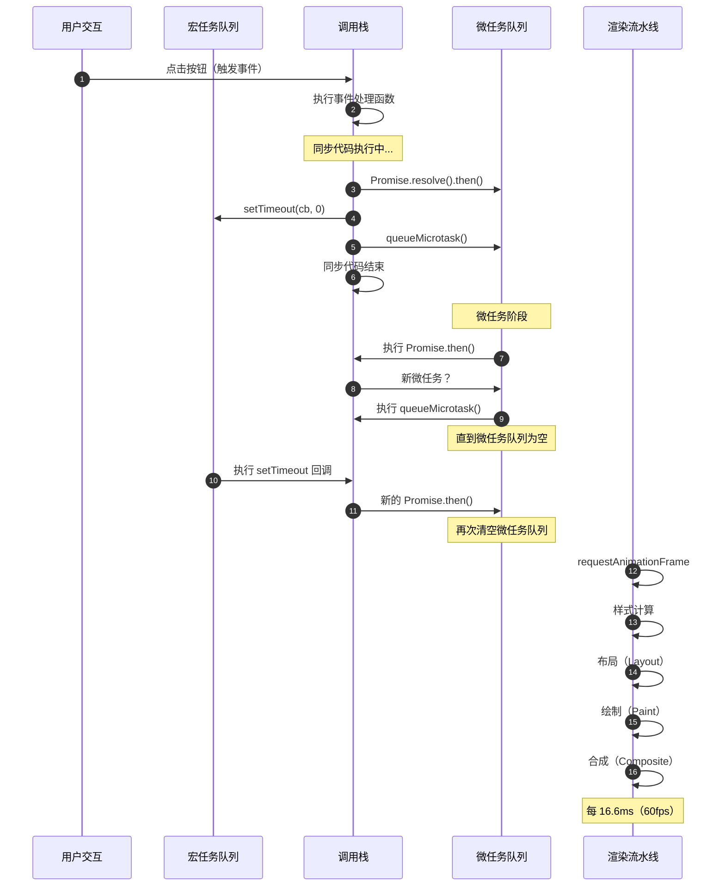

# Event Loop 详细执行流程（时序图）

> 本图展示了 Event Loop 中同步代码、微任务、宏任务和渲染的精确执行顺序。理解这一时序对于避免竞态条件和优化性能至关重要。

## 完整时序图



## 典型代码执行分析

```javascript
console.log('1. 同步');

setTimeout(() => &#123;
  console.log('2. 宏任务1');
  Promise.resolve().then(() => console.log('3. 微任务1内的微任务'));
&#125;, 0);

Promise.resolve().then(() => &#123;
  console.log('4. 微任务1');
  setTimeout(() => console.log('5. 微任务内的宏任务'), 0);
&#125;);

queueMicrotask(() => console.log('6. queueMicrotask'));

requestAnimationFrame(() => console.log('7. rAF'));

console.log('8. 同步结束');

// 执行顺序：
// 1. 同步
// 8. 同步结束
// 4. 微任务1
// 6. queueMicrotask
// 2. 宏任务1
// 3. 微任务1内的微任务
// 7. rAF（在下一帧）
// 5. 微任务内的宏任务
```

## 微任务的级联执行

```mermaid
flowchart TD
    A[开始执行宏任务] --> B[同步代码执行]
    B --> C&#123;微任务队列为空?&#125;
    C -->|否| D[取出所有微任务]
    D --> E[依次执行]
    E --> F&#123;执行中产生新微任务?&#125;
    F -->|是| C
    F -->|否| G[微任务阶段结束]
    G --> H[下一宏任务]
```

**关键规则**：微任务阶段会一直执行直到微任务队列完全为空，包括新产生的微任务。

```javascript
// 微任务级联示例
let count = 0;
function scheduleMicrotasks() &#123;
  if (count &lt; 5) &#123;
    count++;
    Promise.resolve().then(() => &#123;
      console.log(`微任务 $&#123;count&#125;`);
      scheduleMicrotasks(); // 产生新微任务
    &#125;);
  &#125;
&#125;
scheduleMicrotasks();
// 输出：微任务 1 → 微任务 2 → ... → 微任务 5（连续执行）
```

## 常见陷阱

### 陷阱1：微任务阻塞渲染

```javascript
// 危险！微任务过多会阻塞渲染
function blockRender() &#123;
  for (let i = 0; i &lt; 10000; i++) &#123;
    Promise.resolve().then(() => &#123;
      // 大量微任务
    &#125;);
  &#125;
&#125;
// 渲染会延迟，导致卡顿
```

### 陷阱2：Promise 与 setTimeout 的竞态

```javascript
// 看似同时，实则微任务先执行
setTimeout(() => console.log('timeout'), 0);
Promise.resolve().then(() => console.log('promise'));
// 输出：promise → timeout
```

### 陷阱3：async/await 的本质

```javascript
async function example() &#123;
  console.log('A');
  await Promise.resolve(); // 后续代码变为微任务
  console.log('B'); // 微任务中执行
&#125;

example();
console.log('C');
// 输出：A → C → B
```

## 性能优化建议

| 场景 | 推荐方案 | 避免 |
|------|----------|------|
| 需要下一帧执行 | `requestAnimationFrame` | `setTimeout(fn, 0)` |
| 异步初始化 | `queueMicrotask` | 同步阻塞 |
| 批量DOM更新 | `requestAnimationFrame` + `DocumentFragment` | 多次微任务修改DOM |
| 延迟执行 | `setTimeout` / `requestIdleCallback` | 大量微任务排队 |

## 参考资源

- [执行模型导读](/fundamentals/execution-model) — 事件循环的底层原理
- **并发异步专题** — Web Workers 与多线程

---

 [← 返回架构图首页](./)
