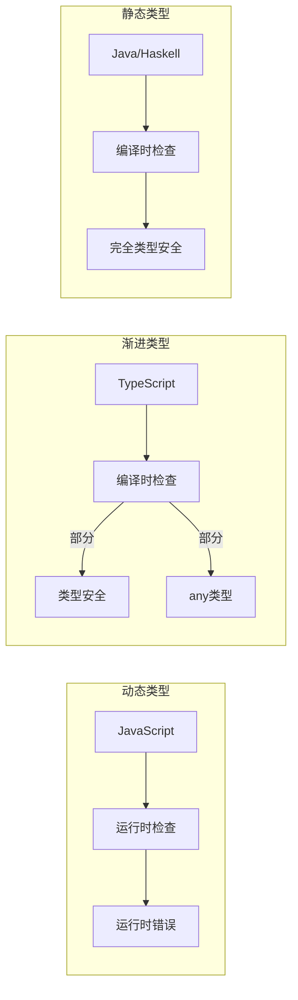
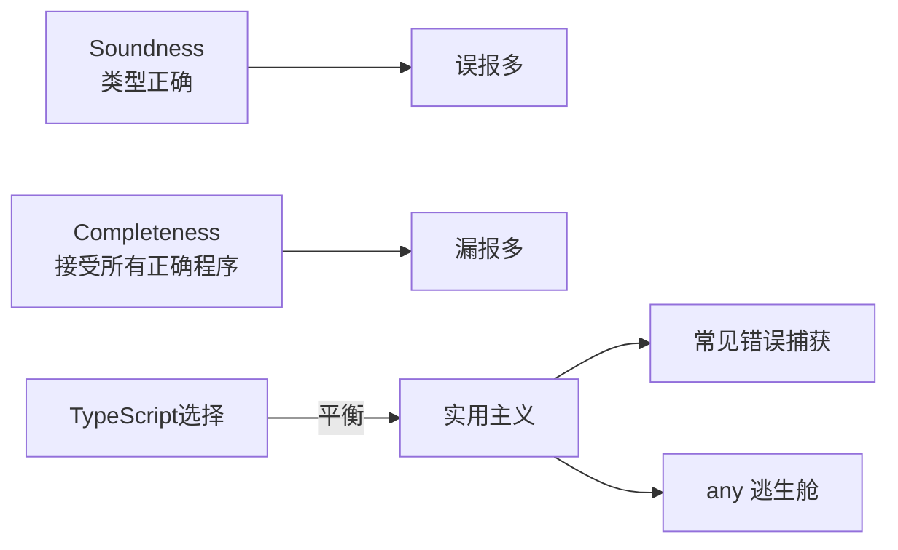

# 渐进类型系统精度格 (Gradual Typing Lattice)

> 渐进类型（Gradual Typing）允许开发者在动态类型和静态类型之间平滑过渡。TypeScript 是最成功的渐进类型系统实现之一。

## 类型系统精度格

```mermaid
flowchart BT
    %% 顶部：完全动态
    A[any] --> B[unknown]

    %% 中间层：渐进类型
    B --> C[string | number | boolean]
    B --> D[object]
    B --> E[void]

    %% 更精确的类型
    C --> F[string]
    C --> G[number]
    C --> H[boolean]
    C --> I[literal 'hello']
    C --> J[literal 42]

    D --> K[&#123; name: string &#125;]
    D --> L[Array&lt;T&gt;]
    D --> M[Function]

    K --> N[&#123; name: 'Alice' &#125;]

    %% 底部：never
    F --> O[never]
    G --> O
    H --> O
    I --> O
    J --> O
    N --> O
    L --> O
    M --> O
    E --> O

    style A fill:#ff6b6b,color:#fff
    style O fill:#4ecdc4,color:#fff
```

## 渐进类型的核心思想



| 特性 | 动态类型 (JS) | 渐进类型 (TS) | 静态类型 (Java) |
|------|--------------|--------------|----------------|
| 类型检查时机 | 运行时 | 编译时 | 编译时 |
| 类型错误发现 | 运行时报错 | 编译时报错 | 编译时报错 |
| 迁移成本 | 无 | 低（可渐进） | 高（需重写） |
| 类型精度 | 无 | 可调 | 高 |
| 运行时开销 | 可能有检查 | 零（擦除） | 零或低 |

## TypeScript 的类型层级

```typescript
// 最宽松的类型：any
let anything: any = 4;
anything = 'string'; // ✅
anything.toFixed();  // ✅ 编译通过，运行时可能报错

// 安全的顶级类型：unknown
let unknownValue: unknown = 4;
unknownValue.toFixed(); // ❌ 编译错误
if (typeof unknownValue === 'number') &#123;
  unknownValue.toFixed(); // ✅ 类型收窄后安全
&#125;

// 最严格的类型：never
function throwError(): never &#123;
  throw new Error('error');
&#125;
```

## Soundness 与 Completeness 的权衡



TypeScript 的设计哲学是**实用性优先于 soundness**：

```typescript
// 不 sound 但实用的例子
const arr: any[] = [1, 'two', 3];
const numbers: number[] = arr as number[]; // 编译通过，运行时不安全
// TypeScript 允许 as 断言，因为这是有用的逃生舱
```

## 参考资源

- [类型系统导读](/fundamentals/type-system) — 结构类型、泛型、变型
- [10-fundamentals/10.2-type-system](/fundamentals/type-system) — 渐进类型理论深度解析

---

 [← 返回架构图首页](./)
