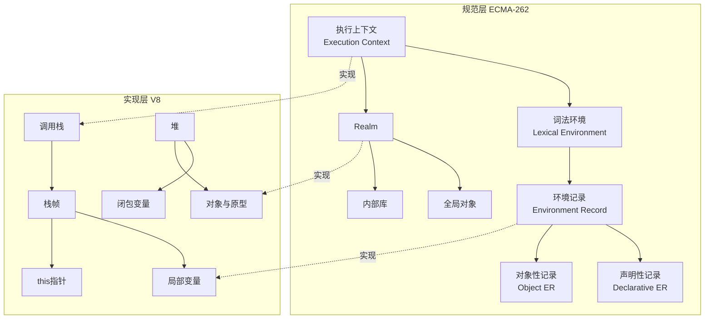
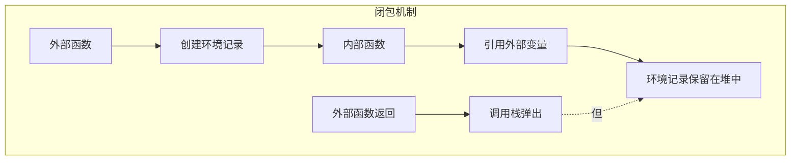

# JavaScript 执行模型与 ECMA-262 规范对应

> 本文档将 JavaScript 代码的执行流程与 ECMA-262 规范中的抽象概念进行映射，帮助理解代码在引擎中的实际运行方式。

## 执行模型全景



## 执行上下文栈

```mermaid
flowchart TB
    subgraph 调用栈
        A[全局执行上下文] --> B[foo()]
        B --> C[bar()]
        C --> D[baz()]
    end
    subgraph 每个上下文的组成
        E[词法环境] --> F[变量环境]
        E --> G[this绑定]
        F --> H[环境记录]
        H --> I[Outer引用]
    end
```

### 执行上下文的创建过程

```javascript
// 代码执行前的准备阶段
function example() &#123;
  let local = 1;      // 在词法环境中创建绑定
  const fixed = 2;    // 创建不可变绑定
  function inner() &#123;&#125; // 创建函数对象并初始化
&#125;

// 执行上下文的三个阶段：
// 1. 创建阶段：建立词法环境，提升变量/函数声明
// 2. 执行阶段：逐行执行代码
// 3. 销毁阶段：弹出调用栈（闭包变量保留在堆中）
```

## Realm 与全局对象

Realm 是 ECMA-262 中的独立执行环境，每个 Realm 有自己的全局对象：

```mermaid
flowchart LR
    subgraph Realm A
        A1[windowA] --> A2[ArrayA]
        A1 --> A3[JSONA]
    end
    subgraph Realm B
        B1[windowB] --> B2[ArrayB]
        B1 --> B3[JSONB]
    end
    A2 -.x.-> B2
    A1 -.->|iframe| B1
```

```javascript
// 不同 Realm 的数组构造函数不同
const iframe = document.createElement('iframe');
document.body.appendChild(iframe);

const iframeArray = iframe.contentWindow.Array;
console.log(Array === iframeArray); // false

const arr = [];
console.log(arr instanceof Array); // true
console.log(arr instanceof iframeArray); // false
```

## 闭包的规范解释



```javascript
function createCounter() &#123;
  let count = 0; // 环境记录中的绑定
  return &#123;
    increment: () => ++count,
    getValue: () => count,
  &#125;;
&#125;

const counter = createCounter();
// createCounter 的执行上下文已弹出，但环境记录被闭包引用保留
```

## 执行模型与性能

### 隐藏类与内联缓存（IC）

V8 通过隐藏类（Hidden Class）优化属性访问。当对象结构稳定时，属性访问可被编译为固定偏移量的内存读取，性能接近 C 结构体字段访问。

```javascript
// ✅ 单形态（Monomorphic）— 最优
function getX(obj) { return obj.x }
getX({ x: 1 })
getX({ x: 2 })

// ❌ 多形态（Polymorphic）— 次优
getX({ x: 1 })
getX({ x: 1, y: 2 })  // 不同隐藏类

// ❌ 超形态（Megamorphic）— 退化
for (let i = 0; i < 100; i++) {
  getX({ [`prop${i}`]: i })  // 每次都不同
}
```

### 尾调用优化（TCO）

ES6 规范规定了尾调用优化，但仅 Safari/JavaScriptCore 实现。V8 和 SpiderMonkey 出于调试考虑未实现。

```javascript
// 理论上可优化为循环
function factorial(n, acc = 1n) {
  if (n === 0n) return acc
  return factorial(n - 1n, acc * n)  // 尾调用
}

// 实际建议：手动改写为循环
function factorialLoop(n) {
  let acc = 1n
  for (let i = 2n; i <= n; i++) acc *= i
  return acc
}
```

## 参考资源

- [执行模型导读](/fundamentals/execution-model) — V8 引擎架构深度解析
- [ECMAScript 规范导读](/fundamentals/ecmascript-spec) — 抽象操作与完成记录
- [对象模型深度专题](/object-model/) — 原型链与属性查找机制
- [V8 博客](https://v8.dev/blog) — 引擎内部实现细节

---

 [← 返回架构图首页](./)
