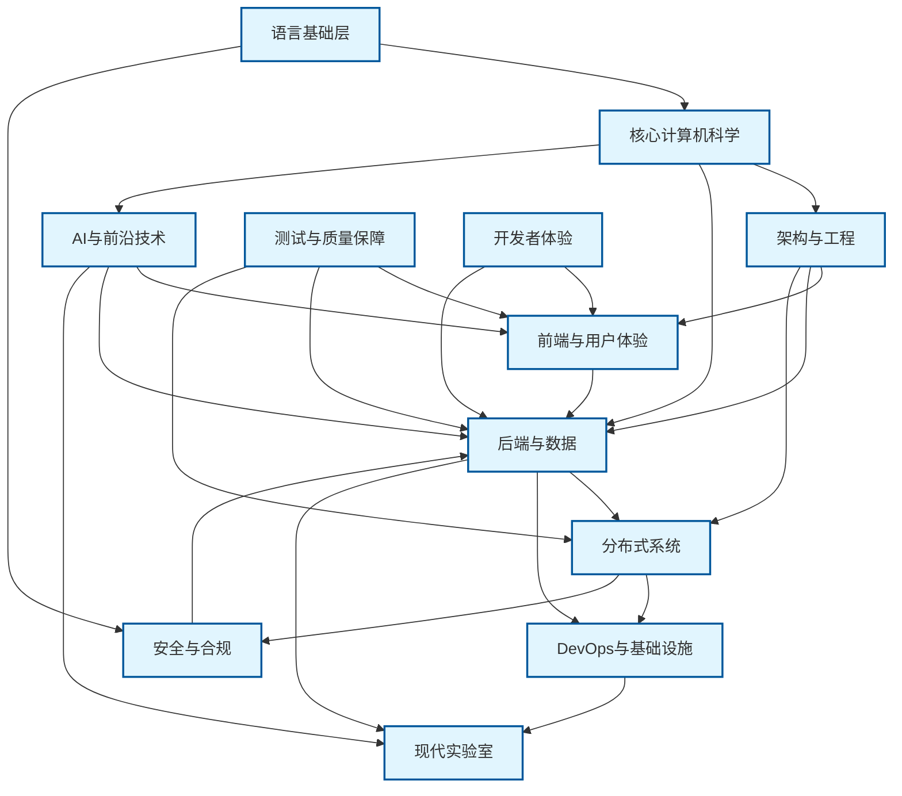

# JSTS Code Lab 模块依赖关系图谱

> 本图谱基于 `MODULE_INVENTORY.json` 自动生成，展示所有模块的依赖关系、领域分组与成熟度状态。

## 概览

JSTS Code Lab 目前包含 **90 个学习模块**，覆盖从语言基础到前沿技术的完整知识体系。模块按成熟度分为：

- **成熟 (Mature)**：内容完善、测试覆盖充分 — 52 个
- **可用 (Usable)**：核心功能已实现，持续优化中 — 38 个
- **占位 (Placeholder)**：已规划待实现 — 0 个

## 图例

| 符号 | 形状 | 含义 |
|------|------|------|
| ● | 矩形 | 成熟模块 (Mature) |
| ○ | 圆形 | 可用模块 (Usable) |
| ◌ | 菱形 | 占位模块 (Placeholder) |

## 领域集群总览

以下高阶视图展示 12 个领域集群之间的依赖关系：



---

## 完整模块依赖图

下图展示所有 90 个模块的详细依赖关系，按领域分组：

```mermaid
flowchart TB
    direction TB
    subgraph foundation["语言基础层"]
        direction TB
    M00_language_core["● 00&#8209;language&#8209;core"]
    M01_ecmascript_evolution["● 01&#8209;ecmascript&#8209;evolution"]
    M10_js_ts_comparison["● 10&#8209;js&#8209;ts&#8209;comparison"]
    M40_type_theory_formal["● 40&#8209;type&#8209;theory&#8209;formal"]
    M41_formal_semantics["● 41&#8209;formal&#8209;semantics"]
    end
    subgraph core_cs["核心计算机科学"]
        direction TB
    M02_design_patterns["● 02&#8209;design&#8209;patterns"]
    M04_data_structures["● 04&#8209;data&#8209;structures"]
    M05_algorithms["● 05&#8209;algorithms"]
    M03_concurrency["● 03&#8209;concurrency"]
    M14_execution_flow(("○ 14&#8209;execution&#8209;flow"))
    M15_data_flow(("○ 15&#8209;data&#8209;flow"))
    end
    subgraph architecture["架构与工程"]
        direction TB
    M06_architecture_patterns["● 06&#8209;architecture&#8209;patterns"]
    M53_app_architecture["● 53&#8209;app&#8209;architecture"]
    M59_fullstack_patterns(("○ 59&#8209;fullstack&#8209;patterns"))
    M88_lowcode_platform(("○ 88&#8209;lowcode&#8209;platform"))
    end
    subgraph frontend["前端与用户体验"]
        direction TB
    M18_frontend_frameworks["● 18&#8209;frontend&#8209;frameworks"]
    M50_browser_runtime["● 50&#8209;browser&#8209;runtime"]
    M51_ui_components["● 51&#8209;ui&#8209;components"]
    M52_web_rendering["● 52&#8209;web&#8209;rendering"]
    M35_accessibility_a11y(("○ 35&#8209;accessibility&#8209;a11y"))
    M36_web_assembly(("○ 36&#8209;web&#8209;assembly"))
    M37_pwa(("○ 37&#8209;pwa"))
    M57_design_system["● 57&#8209;design&#8209;system"]
    M58_data_visualization["● 58&#8209;data&#8209;visualization"]
    M84_webxr(("○ 84&#8209;webxr"))
    end
    subgraph backend["后端与数据"]
        direction TB
    M19_backend_development["● 19&#8209;backend&#8209;development"]
    M20_database_orm["● 20&#8209;database&#8209;orm"]
    M21_api_security["● 21&#8209;api&#8209;security"]
    M24_graphql(("○ 24&#8209;graphql"))
    M38_web_security(("○ 38&#8209;web&#8209;security"))
    M61_api_gateway["● 61&#8209;api&#8209;gateway"]
    M62_message_queue["● 62&#8209;message&#8209;queue"]
    M63_caching_strategies["● 63&#8209;caching&#8209;strategies"]
    M64_search_engine["● 64&#8209;search&#8209;engine"]
    M67_multi_tenancy["● 67&#8209;multi&#8209;tenancy"]
    M66_feature_flags(("○ 66&#8209;feature&#8209;flags"))
    M68_plugin_system(("○ 68&#8209;plugin&#8209;system"))
    end
    subgraph distributed["分布式系统"]
        direction TB
    M25_microservices(("○ 25&#8209;microservices"))
    M26_event_sourcing(("○ 26&#8209;event&#8209;sourcing"))
    M30_real_time_communication(("○ 30&#8209;real&#8209;time&#8209;communication"))
    M70_distributed_systems["● 70&#8209;distributed&#8209;systems"]
    M71_consensus_algorithms["● 71&#8209;consensus&#8209;algorithms"]
    M72_container_orchestration(("○ 72&#8209;container&#8209;orchestration"))
    M73_service_mesh_advanced(("○ 73&#8209;service&#8209;mesh&#8209;advanced"))
    end
    subgraph devops["DevOps与基础设施"]
        direction TB
    M22_deployment_devops(("○ 22&#8209;deployment&#8209;devops"))
    M23_toolchain_configuration["● 23&#8209;toolchain&#8209;configuration"]
    M12_package_management(("○ 12&#8209;package&#8209;management"))
    M13_code_organization(("○ 13&#8209;code&#8209;organization"))
    M11_benchmarks(("○ 11&#8209;benchmarks"))
    M31_serverless(("○ 31&#8209;serverless"))
    M32_edge_computing(("○ 32&#8209;edge&#8209;computing"))
    M69_cli_framework["● 69&#8209;cli&#8209;framework"]
    end
    subgraph ai["AI与前沿技术"]
        direction TB
    M33_ai_integration(("○ 33&#8209;ai&#8209;integration"))
    M54_intelligent_performance["● 54&#8209;intelligent&#8209;performance"]
    M55_ai_testing["● 55&#8209;ai&#8209;testing"]
    M56_code_generation["● 56&#8209;code&#8209;generation"]
    M76_ml_engineering["● 76&#8209;ml&#8209;engineering"]
    M77_quantum_computing["● 77&#8209;quantum&#8209;computing"]
    M82_edge_ai["● 82&#8209;edge&#8209;ai"]
    M85_nlp_engineering["● 85&#8209;nlp&#8209;engineering"]
    M89_autonomous_systems["● 89&#8209;autonomous&#8209;systems"]
    M94_ai_agent_lab(("○ 94&#8209;ai&#8209;agent&#8209;lab"))
    end
    subgraph security["安全与合规"]
        direction TB
    M34_blockchain_web3(("○ 34&#8209;blockchain&#8209;web3"))
    M83_blockchain_advanced(("○ 83&#8209;blockchain&#8209;advanced"))
    M81_cybersecurity["● 81&#8209;cybersecurity"]
    M80_formal_verification["● 80&#8209;formal&#8209;verification"]
    M78_metaprogramming["● 78&#8209;metaprogramming"]
    M79_compiler_design["● 79&#8209;compiler&#8209;design"]
    end
    subgraph testing["测试与质量保障"]
        direction TB
    M07_testing["● 07&#8209;testing"]
    M08_performance["● 08&#8209;performance"]
    M28_testing_advanced(("○ 28&#8209;testing&#8209;advanced"))
    M39_performance_monitoring(("○ 39&#8209;performance&#8209;monitoring"))
    M17_debugging_monitoring(("○ 17&#8209;debugging&#8209;monitoring"))
    M74_observability["● 74&#8209;observability"]
    M75_chaos_engineering["● 75&#8209;chaos&#8209;engineering"]
    end
    subgraph dx["开发者体验"]
        direction TB
    M09_real_world_examples["● 09&#8209;real&#8209;world&#8209;examples"]
    M16_application_development(("○ 16&#8209;application&#8209;development"))
    M27_internationalization(("○ 27&#8209;internationalization"))
    M29_documentation(("○ 29&#8209;documentation"))
    M60_developer_experience["● 60&#8209;developer&#8209;experience"]
    end
    subgraph modern_labs["现代实验室"]
        direction TB
    M86_graph_database["● 86&#8209;graph&#8209;database"]
    M86_tanstack_start_cloudflare["● 86&#8209;tanstack&#8209;start&#8209;cloudflare"]
    M87_realtime_analytics(("○ 87&#8209;realtime&#8209;analytics"))
    M90_web_apis_lab["● 90&#8209;web&#8209;apis&#8209;lab"]
    M91_nodejs_core_lab(("○ 91&#8209;nodejs&#8209;core&#8209;lab"))
    M92_observability_lab["● 92&#8209;observability&#8209;lab"]
    M93_deployment_edge_lab(("○ 93&#8209;deployment&#8209;edge&#8209;lab"))
    M95_auth_modern_lab(("○ 95&#8209;auth&#8209;modern&#8209;lab"))
    M96_orm_modern_lab(("○ 96&#8209;orm&#8209;modern&#8209;lab"))
    M65_analytics["● 65&#8209;analytics"]
    end
    style M00_language_core fill:#c8e6c9,stroke:#2e7d32,stroke-width:2px
    style M01_ecmascript_evolution fill:#c8e6c9,stroke:#2e7d32,stroke-width:2px
    style M02_design_patterns fill:#c8e6c9,stroke:#2e7d32,stroke-width:2px
    style M03_concurrency fill:#c8e6c9,stroke:#2e7d32,stroke-width:2px
    style M04_data_structures fill:#c8e6c9,stroke:#2e7d32,stroke-width:2px
    style M05_algorithms fill:#c8e6c9,stroke:#2e7d32,stroke-width:2px
    style M06_architecture_patterns fill:#c8e6c9,stroke:#2e7d32,stroke-width:2px
    style M07_testing fill:#c8e6c9,stroke:#2e7d32,stroke-width:2px
    style M08_performance fill:#c8e6c9,stroke:#2e7d32,stroke-width:2px
    style M09_real_world_examples fill:#c8e6c9,stroke:#2e7d32,stroke-width:2px
    style M10_js_ts_comparison fill:#c8e6c9,stroke:#2e7d32,stroke-width:2px
    style M11_benchmarks fill:#fff9c4,stroke:#f57f17,stroke-width:2px
    style M12_package_management fill:#fff9c4,stroke:#f57f17,stroke-width:2px
    style M13_code_organization fill:#fff9c4,stroke:#f57f17,stroke-width:2px
    style M14_execution_flow fill:#fff9c4,stroke:#f57f17,stroke-width:2px
    style M15_data_flow fill:#fff9c4,stroke:#f57f17,stroke-width:2px
    style M16_application_development fill:#fff9c4,stroke:#f57f17,stroke-width:2px
    style M17_debugging_monitoring fill:#fff9c4,stroke:#f57f17,stroke-width:2px
    style M18_frontend_frameworks fill:#c8e6c9,stroke:#2e7d32,stroke-width:2px
    style M19_backend_development fill:#c8e6c9,stroke:#2e7d32,stroke-width:2px
    style M20_database_orm fill:#c8e6c9,stroke:#2e7d32,stroke-width:2px
    style M21_api_security fill:#c8e6c9,stroke:#2e7d32,stroke-width:2px
    style M22_deployment_devops fill:#fff9c4,stroke:#f57f17,stroke-width:2px
    style M23_toolchain_configuration fill:#c8e6c9,stroke:#2e7d32,stroke-width:2px
    style M24_graphql fill:#fff9c4,stroke:#f57f17,stroke-width:2px
    style M25_microservices fill:#fff9c4,stroke:#f57f17,stroke-width:2px
    style M26_event_sourcing fill:#fff9c4,stroke:#f57f17,stroke-width:2px
    style M27_internationalization fill:#fff9c4,stroke:#f57f17,stroke-width:2px
    style M28_testing_advanced fill:#fff9c4,stroke:#f57f17,stroke-width:2px
    style M29_documentation fill:#fff9c4,stroke:#f57f17,stroke-width:2px
    style M30_real_time_communication fill:#fff9c4,stroke:#f57f17,stroke-width:2px
    style M31_serverless fill:#fff9c4,stroke:#f57f17,stroke-width:2px
    style M32_edge_computing fill:#fff9c4,stroke:#f57f17,stroke-width:2px
    style M33_ai_integration fill:#fff9c4,stroke:#f57f17,stroke-width:2px
    style M34_blockchain_web3 fill:#fff9c4,stroke:#f57f17,stroke-width:2px
    style M35_accessibility_a11y fill:#fff9c4,stroke:#f57f17,stroke-width:2px
    style M36_web_assembly fill:#fff9c4,stroke:#f57f17,stroke-width:2px
    style M37_pwa fill:#fff9c4,stroke:#f57f17,stroke-width:2px
    style M38_web_security fill:#fff9c4,stroke:#f57f17,stroke-width:2px
    style M39_performance_monitoring fill:#fff9c4,stroke:#f57f17,stroke-width:2px
    style M40_type_theory_formal fill:#c8e6c9,stroke:#2e7d32,stroke-width:2px
    style M41_formal_semantics fill:#c8e6c9,stroke:#2e7d32,stroke-width:2px
    style M50_browser_runtime fill:#c8e6c9,stroke:#2e7d32,stroke-width:2px
    style M51_ui_components fill:#c8e6c9,stroke:#2e7d32,stroke-width:2px
    style M52_web_rendering fill:#c8e6c9,stroke:#2e7d32,stroke-width:2px
    style M53_app_architecture fill:#c8e6c9,stroke:#2e7d32,stroke-width:2px
    style M54_intelligent_performance fill:#c8e6c9,stroke:#2e7d32,stroke-width:2px
    style M55_ai_testing fill:#c8e6c9,stroke:#2e7d32,stroke-width:2px
    style M56_code_generation fill:#c8e6c9,stroke:#2e7d32,stroke-width:2px
    style M57_design_system fill:#c8e6c9,stroke:#2e7d32,stroke-width:2px
    style M58_data_visualization fill:#c8e6c9,stroke:#2e7d32,stroke-width:2px
    style M59_fullstack_patterns fill:#fff9c4,stroke:#f57f17,stroke-width:2px
    style M60_developer_experience fill:#c8e6c9,stroke:#2e7d32,stroke-width:2px
    style M61_api_gateway fill:#c8e6c9,stroke:#2e7d32,stroke-width:2px
    style M62_message_queue fill:#c8e6c9,stroke:#2e7d32,stroke-width:2px
    style M63_caching_strategies fill:#c8e6c9,stroke:#2e7d32,stroke-width:2px
    style M64_search_engine fill:#c8e6c9,stroke:#2e7d32,stroke-width:2px
    style M65_analytics fill:#c8e6c9,stroke:#2e7d32,stroke-width:2px
    style M66_feature_flags fill:#fff9c4,stroke:#f57f17,stroke-width:2px
    style M67_multi_tenancy fill:#c8e6c9,stroke:#2e7d32,stroke-width:2px
    style M68_plugin_system fill:#fff9c4,stroke:#f57f17,stroke-width:2px
    style M69_cli_framework fill:#c8e6c9,stroke:#2e7d32,stroke-width:2px
    style M70_distributed_systems fill:#c8e6c9,stroke:#2e7d32,stroke-width:2px
    style M71_consensus_algorithms fill:#c8e6c9,stroke:#2e7d32,stroke-width:2px
    style M72_container_orchestration fill:#fff9c4,stroke:#f57f17,stroke-width:2px
    style M73_service_mesh_advanced fill:#fff9c4,stroke:#f57f17,stroke-width:2px
    style M74_observability fill:#c8e6c9,stroke:#2e7d32,stroke-width:2px
    style M75_chaos_engineering fill:#c8e6c9,stroke:#2e7d32,stroke-width:2px
    style M76_ml_engineering fill:#c8e6c9,stroke:#2e7d32,stroke-width:2px
    style M77_quantum_computing fill:#c8e6c9,stroke:#2e7d32,stroke-width:2px
    style M78_metaprogramming fill:#c8e6c9,stroke:#2e7d32,stroke-width:2px
    style M79_compiler_design fill:#c8e6c9,stroke:#2e7d32,stroke-width:2px
    style M80_formal_verification fill:#c8e6c9,stroke:#2e7d32,stroke-width:2px
    style M81_cybersecurity fill:#c8e6c9,stroke:#2e7d32,stroke-width:2px
    style M82_edge_ai fill:#c8e6c9,stroke:#2e7d32,stroke-width:2px
    style M83_blockchain_advanced fill:#fff9c4,stroke:#f57f17,stroke-width:2px
    style M84_webxr fill:#fff9c4,stroke:#f57f17,stroke-width:2px
    style M85_nlp_engineering fill:#c8e6c9,stroke:#2e7d32,stroke-width:2px
    style M86_graph_database fill:#c8e6c9,stroke:#2e7d32,stroke-width:2px
    style M86_tanstack_start_cloudflare fill:#c8e6c9,stroke:#2e7d32,stroke-width:2px
    style M87_realtime_analytics fill:#fff9c4,stroke:#f57f17,stroke-width:2px
    style M88_lowcode_platform fill:#fff9c4,stroke:#f57f17,stroke-width:2px
    style M89_autonomous_systems fill:#c8e6c9,stroke:#2e7d32,stroke-width:2px
    style M90_web_apis_lab fill:#c8e6c9,stroke:#2e7d32,stroke-width:2px
    style M91_nodejs_core_lab fill:#fff9c4,stroke:#f57f17,stroke-width:2px
    style M92_observability_lab fill:#c8e6c9,stroke:#2e7d32,stroke-width:2px
    style M93_deployment_edge_lab fill:#fff9c4,stroke:#f57f17,stroke-width:2px
    style M94_ai_agent_lab fill:#fff9c4,stroke:#f57f17,stroke-width:2px
    style M95_auth_modern_lab fill:#fff9c4,stroke:#f57f17,stroke-width:2px
    style M96_orm_modern_lab fill:#fff9c4,stroke:#f57f17,stroke-width:2px
    M00_language_core --> M01_ecmascript_evolution
    M00_language_core --> M02_design_patterns
    M00_language_core --> M03_concurrency
    M00_language_core --> M04_data_structures
    M00_language_core --> M05_algorithms
    M00_language_core --> M06_architecture_patterns
    M00_language_core --> M07_testing
    M00_language_core --> M08_performance
    M00_language_core --> M09_real_world_examples
    M00_language_core --> M10_js_ts_comparison
    M00_language_core --> M14_execution_flow
    M00_language_core --> M15_data_flow
    M00_language_core --> M18_frontend_frameworks
    M00_language_core --> M19_backend_development
    M00_language_core --> M40_type_theory_formal
    M00_language_core --> M41_formal_semantics
    M00_language_core --> M50_browser_runtime
    M00_language_core --> M78_metaprogramming
    M01_ecmascript_evolution --> M03_concurrency
    M01_ecmascript_evolution --> M14_execution_flow
    M01_ecmascript_evolution --> M18_frontend_frameworks
    M01_ecmascript_evolution --> M36_web_assembly
    M02_design_patterns --> M06_architecture_patterns
    M02_design_patterns --> M53_app_architecture
    M02_design_patterns --> M68_plugin_system
    M04_data_structures --> M05_algorithms
    M04_data_structures --> M86_graph_database
    M04_data_structures --> M64_search_engine
    M05_algorithms --> M64_search_engine
    M05_algorithms --> M76_ml_engineering
    M05_algorithms --> M85_nlp_engineering
    M05_algorithms --> M77_quantum_computing
    M03_concurrency --> M30_real_time_communication
    M03_concurrency --> M70_distributed_systems
    M03_concurrency --> M62_message_queue
    M03_concurrency --> M32_edge_computing
    M14_execution_flow --> M50_browser_runtime
    M15_data_flow --> M16_application_development
    M06_architecture_patterns --> M19_backend_development
    M06_architecture_patterns --> M53_app_architecture
    M06_architecture_patterns --> M59_fullstack_patterns
    M06_architecture_patterns --> M25_microservices
    M53_app_architecture --> M59_fullstack_patterns
    M53_app_architecture --> M18_frontend_frameworks
    M53_app_architecture --> M88_lowcode_platform
    M50_browser_runtime --> M18_frontend_frameworks
    M50_browser_runtime --> M52_web_rendering
    M50_browser_runtime --> M37_pwa
    M18_frontend_frameworks --> M51_ui_components
    M18_frontend_frameworks --> M52_web_rendering
    M18_frontend_frameworks --> M53_app_architecture
    M51_ui_components --> M52_web_rendering
    M51_ui_components --> M57_design_system
    M51_ui_components --> M58_data_visualization
    M52_web_rendering --> M53_app_architecture
    M52_web_rendering --> M54_intelligent_performance
    M35_accessibility_a11y --> M57_design_system
    M35_accessibility_a11y --> M37_pwa
    M36_web_assembly --> M77_quantum_computing
    M36_web_assembly --> M84_webxr
    M37_pwa --> M90_web_apis_lab
    M57_design_system --> M58_data_visualization
    M19_backend_development --> M20_database_orm
    M19_backend_development --> M21_api_security
    M19_backend_development --> M24_graphql
    M19_backend_development --> M61_api_gateway
    M19_backend_development --> M38_web_security
    M20_database_orm --> M67_multi_tenancy
    M20_database_orm --> M96_orm_modern_lab
    M20_database_orm --> M86_tanstack_start_cloudflare
    M21_api_security --> M38_web_security
    M21_api_security --> M81_cybersecurity
    M21_api_security --> M95_auth_modern_lab
    M21_api_security --> M61_api_gateway
    M38_web_security --> M81_cybersecurity
    M61_api_gateway --> M63_caching_strategies
    M61_api_gateway --> M66_feature_flags
    M61_api_gateway --> M62_message_queue
    M62_message_queue --> M70_distributed_systems
    M62_message_queue --> M26_event_sourcing
    M63_caching_strategies --> M64_search_engine
    M64_search_engine --> M65_analytics
    M64_search_engine --> M87_realtime_analytics
    M67_multi_tenancy --> M66_feature_flags
    M68_plugin_system --> M69_cli_framework
    M25_microservices --> M70_distributed_systems
    M25_microservices --> M73_service_mesh_advanced
    M25_microservices --> M72_container_orchestration
    M26_event_sourcing --> M62_message_queue
    M30_real_time_communication --> M87_realtime_analytics
    M70_distributed_systems --> M71_consensus_algorithms
    M70_distributed_systems --> M74_observability
    M70_distributed_systems --> M75_chaos_engineering
    M70_distributed_systems --> M61_api_gateway
    M71_consensus_algorithms --> M72_container_orchestration
    M23_toolchain_configuration --> M60_developer_experience
    M23_toolchain_configuration --> M11_benchmarks
    M12_package_management --> M13_code_organization
    M22_deployment_devops --> M31_serverless
    M22_deployment_devops --> M72_container_orchestration
    M22_deployment_devops --> M93_deployment_edge_lab
    M31_serverless --> M32_edge_computing
    M31_serverless --> M93_deployment_edge_lab
    M69_cli_framework --> M60_developer_experience
    M11_benchmarks --> M08_performance
    M11_benchmarks --> M54_intelligent_performance
    M33_ai_integration --> M55_ai_testing
    M33_ai_integration --> M56_code_generation
    M33_ai_integration --> M76_ml_engineering
    M33_ai_integration --> M82_edge_ai
    M33_ai_integration --> M89_autonomous_systems
    M33_ai_integration --> M94_ai_agent_lab
    M33_ai_integration --> M85_nlp_engineering
    M76_ml_engineering --> M77_quantum_computing
    M76_ml_engineering --> M82_edge_ai
    M76_ml_engineering --> M85_nlp_engineering
    M76_ml_engineering --> M54_intelligent_performance
    M85_nlp_engineering --> M89_autonomous_systems
    M89_autonomous_systems --> M94_ai_agent_lab
    M56_code_generation --> M60_developer_experience
    M56_code_generation --> M78_metaprogramming
    M54_intelligent_performance --> M08_performance
    M55_ai_testing --> M07_testing
    M34_blockchain_web3 --> M83_blockchain_advanced
    M40_type_theory_formal --> M41_formal_semantics
    M40_type_theory_formal --> M79_compiler_design
    M40_type_theory_formal --> M80_formal_verification
    M41_formal_semantics --> M80_formal_verification
    M78_metaprogramming --> M56_code_generation
    M78_metaprogramming --> M79_compiler_design
    M79_compiler_design --> M80_formal_verification
    M81_cybersecurity --> M21_api_security
    M80_formal_verification --> M07_testing
    M07_testing --> M28_testing_advanced
    M07_testing --> M55_ai_testing
    M08_performance --> M54_intelligent_performance
    M08_performance --> M39_performance_monitoring
    M28_testing_advanced --> M55_ai_testing
    M39_performance_monitoring --> M74_observability
    M39_performance_monitoring --> M92_observability_lab
    M17_debugging_monitoring --> M74_observability
    M74_observability --> M75_chaos_engineering
    M74_observability --> M92_observability_lab
    M09_real_world_examples --> M16_application_development
    M09_real_world_examples --> M59_fullstack_patterns
    M16_application_development --> M59_fullstack_patterns
    M60_developer_experience --> M29_documentation
    M27_internationalization --> M16_application_development
    M86_graph_database --> M64_search_engine
    M86_tanstack_start_cloudflare --> M59_fullstack_patterns
    M65_analytics --> M87_realtime_analytics
    M90_web_apis_lab --> M91_nodejs_core_lab
    M91_nodejs_core_lab --> M93_deployment_edge_lab
    M92_observability_lab --> M93_deployment_edge_lab
    M94_ai_agent_lab --> M95_auth_modern_lab
    M95_auth_modern_lab --> M96_orm_modern_lab
    M93_deployment_edge_lab --> M32_edge_computing
```

---

## 按成熟度分层的模块视图


---

## 模块清单

| 编号 | 模块名称 | 成熟度 | 实现文件 | 测试文件 | README |
|------|---------|--------|---------|---------|--------|
| 00 | 00-language-core | 成熟 | 20 | 5 | — |
| 01 | 01-ecmascript-evolution | 成熟 | 23 | 15 | — |
| 02 | 02-design-patterns | 成熟 | 24 | 23 | — |
| 03 | 03-concurrency | 成熟 | 6 | 4 | — |
| 04 | 04-data-structures | 成熟 | 6 | 6 | — |
| 05 | 05-algorithms | 成熟 | 6 | 6 | — |
| 06 | 06-architecture-patterns | 成熟 | 4 | 4 | — |
| 07 | 07-testing | 成熟 | 5 | 5 | — |
| 08 | 08-performance | 成熟 | 5 | 5 | — |
| 09 | 09-real-world-examples | 成熟 | 7 | 7 | — |
| 10 | 10-js-ts-comparison | 成熟 | 25 | 17 | ✅ |
| 11 | 11-benchmarks | 可用 | 1 | 1 | — |
| 12 | 12-package-management | 可用 | 2 | 2 | — |
| 13 | 13-code-organization | 可用 | 1 | 1 | — |
| 14 | 14-execution-flow | 可用 | 1 | 1 | — |
| 15 | 15-data-flow | 可用 | 1 | 1 | — |
| 16 | 16-application-development | 可用 | 1 | 1 | — |
| 17 | 17-debugging-monitoring | 可用 | 1 | 1 | — |
| 18 | 18-frontend-frameworks | 成熟 | 9 | 3 | — |
| 19 | 19-backend-development | 成熟 | 3 | 3 | — |
| 20 | 20-database-orm | 成熟 | 5 | 4 | — |
| 21 | 21-api-security | 成熟 | 3 | 3 | — |
| 22 | 22-deployment-devops | 可用 | 2 | 2 | — |
| 23 | 23-toolchain-configuration | 成熟 | 9 | 3 | — |
| 24 | 24-graphql | 可用 | 1 | 1 | — |
| 25 | 25-microservices | 可用 | 1 | 1 | — |
| 26 | 26-event-sourcing | 可用 | 1 | 1 | — |
| 27 | 27-internationalization | 可用 | 1 | 1 | — |
| 28 | 28-testing-advanced | 可用 | 1 | 1 | — |
| 29 | 29-documentation | 可用 | 1 | 1 | — |
| 30 | 30-real-time-communication | 可用 | 1 | 1 | — |
| 31 | 31-serverless | 可用 | 1 | 1 | — |
| 32 | 32-edge-computing | 可用 | 1 | 1 | — |
| 33 | 33-ai-integration | 可用 | 1 | 1 | — |
| 34 | 34-blockchain-web3 | 可用 | 1 | 1 | — |
| 35 | 35-accessibility-a11y | 可用 | 1 | 1 | — |
| 36 | 36-web-assembly | 可用 | 2 | 1 | — |
| 37 | 37-pwa | 可用 | 3 | 1 | — |
| 38 | 38-web-security | 可用 | 1 | 1 | — |
| 39 | 39-performance-monitoring | 可用 | 1 | 1 | — |
| 40 | 40-type-theory-formal | 成熟 | 7 | 5 | — |
| 41 | 41-formal-semantics | 成熟 | 3 | 3 | — |
| 50 | 50-browser-runtime | 成熟 | 5 | 5 | — |
| 51 | 51-ui-components | 成熟 | 6 | 6 | — |
| 52 | 52-web-rendering | 成熟 | 6 | 6 | — |
| 53 | 53-app-architecture | 成熟 | 6 | 6 | — |
| 54 | 54-intelligent-performance | 成熟 | 5 | 5 | — |
| 55 | 55-ai-testing | 成熟 | 6 | 6 | ✅ |
| 56 | 56-code-generation | 成熟 | 5 | 1 | — |
| 57 | 57-design-system | 成熟 | 7 | 7 | ✅ |
| 58 | 58-data-visualization | 成熟 | 8 | 8 | ✅ |
| 59 | 59-fullstack-patterns | 可用 | 1 | 1 | — |
| 60 | 60-developer-experience | 成熟 | 8 | 8 | — |
| 61 | 61-api-gateway | 成熟 | 9 | 9 | ✅ |
| 62 | 62-message-queue | 成熟 | 9 | 9 | ✅ |
| 63 | 63-caching-strategies | 成熟 | 8 | 8 | ✅ |
| 64 | 64-search-engine | 成熟 | 6 | 6 | ✅ |
| 65 | 65-analytics | 成熟 | 3 | 3 | — |
| 66 | 66-feature-flags | 可用 | 2 | 2 | — |
| 67 | 67-multi-tenancy | 成熟 | 7 | 7 | ✅ |
| 68 | 68-plugin-system | 可用 | 1 | 1 | — |
| 69 | 69-cli-framework | 成熟 | 7 | 7 | ✅ |
| 70 | 70-distributed-systems | 成熟 | 8 | 8 | ✅ |
| 71 | 71-consensus-algorithms | 成熟 | 13 | 9 | — |
| 72 | 72-container-orchestration | 可用 | 1 | 1 | — |
| 73 | 73-service-mesh-advanced | 可用 | 1 | 1 | — |
| 74 | 74-observability | 成熟 | 6 | 6 | ✅ |
| 75 | 75-chaos-engineering | 成熟 | 4 | 4 | — |
| 76 | 76-ml-engineering | 成熟 | 8 | 8 | ✅ |
| 77 | 77-quantum-computing | 成熟 | 12 | 11 | — |
| 78 | 78-metaprogramming | 成熟 | 7 | 7 | ✅ |
| 79 | 79-compiler-design | 成熟 | 5 | 5 | — |
| 80 | 80-formal-verification | 成熟 | 16 | 16 | ✅ |
| 81 | 81-cybersecurity | 成熟 | 9 | 9 | ✅ |
| 82 | 82-edge-ai | 成熟 | 9 | 9 | ✅ |
| 83 | 83-blockchain-advanced | 可用 | 1 | 1 | — |
| 84 | 84-webxr | 可用 | 1 | 1 | — |
| 85 | 85-nlp-engineering | 成熟 | 9 | 9 | ✅ |
| 86 | 86-graph-database | 成熟 | 6 | 6 | ✅ |
| 86 | 86-tanstack-start-cloudflare | 成熟 | 8 | 0 | ✅ |
| 87 | 87-realtime-analytics | 可用 | 1 | 1 | — |
| 88 | 88-lowcode-platform | 可用 | 2 | 1 | — |
| 89 | 89-autonomous-systems | 成熟 | 7 | 7 | ✅ |
| 90 | 90-web-apis-lab | 成熟 | 9 | 1 | ✅ |
| 91 | 91-nodejs-core-lab | 可用 | 4 | 1 | ✅ |
| 92 | 92-observability-lab | 成熟 | 5 | 1 | ✅ |
| 93 | 93-deployment-edge-lab | 可用 | 3 | 1 | ✅ |
| 94 | 94-ai-agent-lab | 可用 | 3 | 1 | ✅ |
| 95 | 95-auth-modern-lab | 可用 | 4 | 1 | ✅ |
| 96 | 96-orm-modern-lab | 可用 | 4 | 1 | ✅ |

---

## 关键依赖路径说明

1. **语言基础层** (00-language-core) 是所有其他模块的根基，向几乎所有领域输出依赖。
2. **核心 CS** 模块 (设计模式、数据结构、算法、并发) 向上支撑架构、前端、后端和分布式系统。
3. **设计模式 → 架构模式 → 全栈模式** 构成架构能力的主干路径。
4. **并发 → 分布式系统 → 共识算法** 构成分布式能力演进路径。
5. **AI 集成 → ML 工程 → 边缘 AI / NLP** 构成 AI 技术栈。
6. **现代实验室** 模块 (90-96) 作为最新技术实践的集成验证场。

---

*本图谱由脚本自动生成，最后更新于 2026-04-20*
