# ESM/CJS 模块解析与互操作流程

> 模块解析是 JavaScript 工程化的核心机制。本文档详细展示 Node.js 中 ESM 和 CJS 的模块解析算法，以及两种模块系统的互操作方案。

## 模块解析算法对比

```mermaid
flowchart TD
    subgraph ESM解析
        A[import 'x'] --> B&#123;URL格式?&#125;
        B -->|是| C[直接加载]
        B -->|否| D[裸导入]
        D --> E[node_modules查找]
        E --> F[package.json exports]
        F --> G[条件导出解析]
        G --> H[加载目标文件]
    end
    subgraph CJS解析
        I[require'x'] --> J&#123;核心模块?&#125;
        J -->|是| K[加载核心模块]
        J -->|否| L&#123;以./或../开头?&#125;
        L -->|是| M[相对路径解析]
        M --> N[.js/.json/.node]
        L -->|否| O[node_modules查找]
        O --> P[逐层向上遍历]
        P --> Q[解析main字段]
    end
```

## ESM 模块解析

### 裸导入解析流程

```mermaid
flowchart LR
    A[import 'lodash'] --> B[node_modules/lodash/package.json]
    B --> C&#123;exports字段?&#125;
    C -->|是| D[条件导出匹配]
    C -->|否| E[main字段]
    D --> F[import/require条件]
    F --> G[types条件]
    G --> H[加载目标文件]
```

```json
// 条件导出示例
&#123;
  "exports": &#123;
    ".": &#123;
      "import": &#123;
        "types": "./dist/index.d.mts",
        "default": "./dist/index.mjs"
      &#125;,
      "require": &#123;
        "types": "./dist/index.d.cts",
        "default": "./dist/index.cjs"
      &#125;
    &#125;,
    "./package.json": "./package.json"
  &#125;
&#125;
```

## CJS 模块解析

### require() 的完整路径

```mermaid
flowchart TD
    A[require'module'] --> B[核心模块?]
    B -->|是| C[返回核心模块]
    B -->|否| D[路径以/开头?]
    D -->|是| E[绝对路径]
    D -->|否| F[路径以./或../开头?]
    F -->|是| G[相对路径解析]
    G --> H[添加.js/.json/.node]
    F -->|否| I[node_modules查找]
    I --> J[当前目录/node_modules]
    J --> K[父目录/node_modules]
    K --> L[/node_modules]
    L --> M[解析package.json]
```

### 文件扩展名解析

```javascript
// require('./module') 的查找顺序：
// 1. ./module.js
// 2. ./module.json
// 3. ./module.node
// 4. ./module/index.js
// 5. ./module/index.json
// 6. ./module/index.node
```

## ESM/CJS 互操作

### Node.js 互操作规则

```mermaid
flowchart LR
    subgraph ESM导入CJS
        A[import foo from 'cjs'] --> B[获取module.exports]
        B --> C[作为默认导出]
        A --> D[import &#123; named &#125;] --> E[获取exports.xxx]
    end
    subgraph CJS导入ESM
        F[require'esm'] --> G[❌ 错误]
        F --> H[await import'esm'] --> I[✅ 动态导入]
    end
```



| 方向 | 语法 | 结果 | 说明 |
|------|------|------|------|
| ESM → CJS | `import def from 'cjs'` | `module.exports` | 作为默认导出 |
| ESM → CJS | `import &#123; named &#125; from 'cjs'` | `exports.named` | Node 14+ 支持 |
| CJS → ESM | `require('esm')` | ❌ 错误 | CJS 不能同步 require ESM |
| CJS → ESM | `await import('esm')` | ✅ 正常 | 动态 import 可用 |

### 双模式包的最佳实践

```json
&#123;
  "name": "my-lib",
  "type": "module",
  "main": "./dist/index.cjs",
  "module": "./dist/index.mjs",
  "types": "./dist/index.d.ts",
  "exports": &#123;
    ".": &#123;
      "import": &#123;
        "types": "./dist/index.d.mts",
        "default": "./dist/index.mjs"
      &#125;,
      "require": &#123;
        "types": "./dist/index.d.cts",
        "default": "./dist/index.cjs"
      &#125;
    &#125;
  &#125;
&#125;
```

## 参考资源

- [模块系统导读](/fundamentals/module-system) — ESM/CJS 核心机制深度解析
- [模块系统专题](/module-system/) — 完整专题（8篇深度文档）

---

 [← 返回架构图首页](./)
