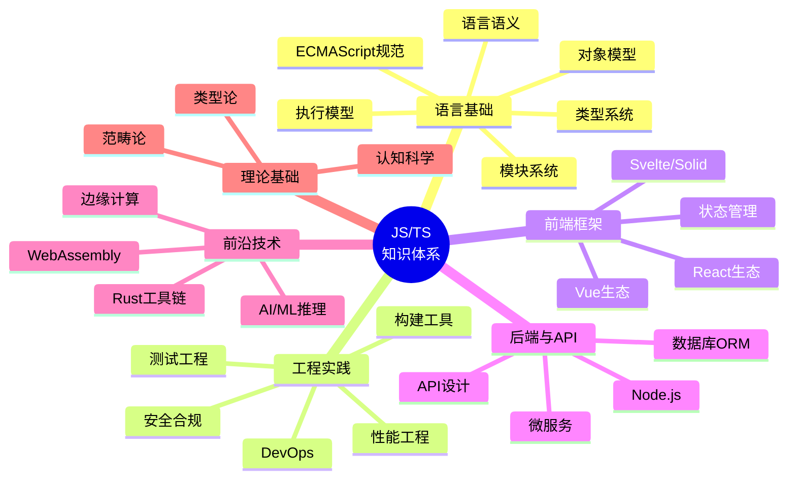
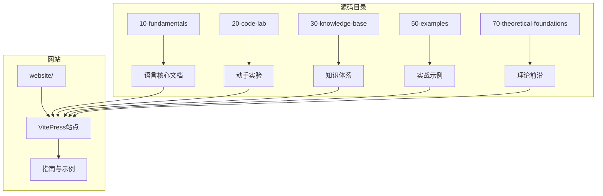
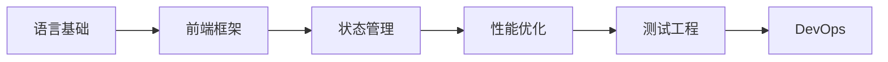
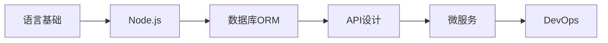

# JavaScript/TypeScript 全景知识库 - 项目知识图谱

> 本项目构建了一个完整的 JavaScript/TypeScript 学习与知识体系。本图谱展示了各专题间的关联关系，帮助学习者规划最优学习路径。

## 知识图谱总览

## 核心学习路径

## 专题关联矩阵

| 专题 | 前置知识 | 关联专题 | 难度 |
|------|----------|----------|------|
| 语言语义 | 无 | 类型系统、执行模型 | 🌱 初级 |
| 类型系统 | 语言语义 | 执行模型、对象模型 | 🌿 中级 |
| 执行模型 | 语言语义 | 性能工程、内存模型 | 🌿 中级 |
| 模块系统 | 语言语义 | DevOps、微服务 | 🌿 中级 |
| 状态管理 | 前端框架 | 设计模式、性能工程 | 🌿 中级 |
| 微服务 | 模块系统、API设计 | DevOps、数据库 | 🍂 高级 |
| WebAssembly | 执行模型、性能工程 | 边缘计算、Rust | 🍂 高级 |
| 范畴论 | 类型系统 | 函数式编程 | 🍁 专家 |

## 项目结构导航

## 推荐学习路径

### 路径一：前端工程师进阶

### 路径二：全栈工程师

### 路径三：前沿技术探索

## 知识图谱使用指南

### 如何阅读此图谱

1. **找到当前位置**：根据你的经验水平确定所在区域
2. **识别前置知识**：查看指向当前节点的入边（ prerequisite ）
3. **规划学习路径**：沿着出边探索后续主题
4. **交叉验证**：在相关专题之间建立联系

### 知识深度分层

| 层级 | 颜色标记 | 说明 |
|------|----------|------|
| 基础 | 🌱 | 必须掌握的核心概念 |
| 中级 | 🌿 | 工程实践常用技术 |
| 高级 | 🍂 | 特定场景的深度优化 |
| 专家 | 🍁 | 理论研究与前沿探索 |

## 参考资源

- [项目首页](/) — 完整知识体系列表
- [理论前沿](/theoretical-foundations/) — 36篇理论摘要
- [代码实验室](/code-lab/) — 动手实验集合
- [学习路径](/learning-paths/) — 系统性成长路线

---

 [← 返回架构图首页](./)
