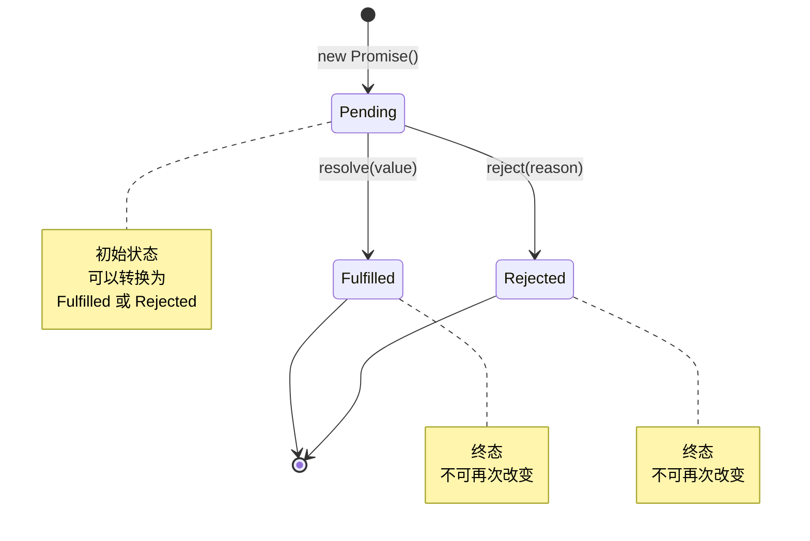
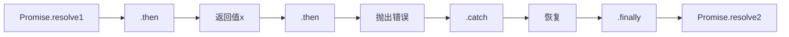
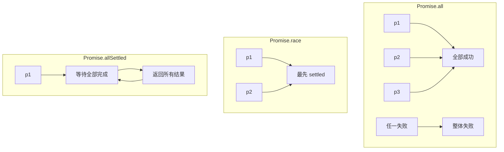
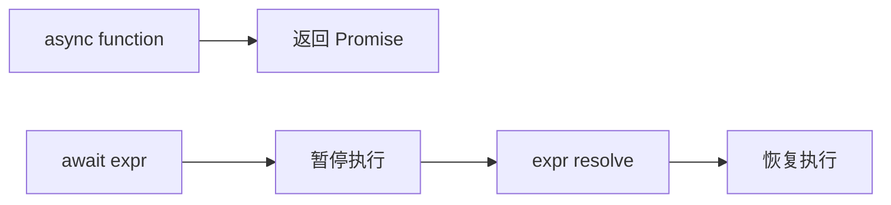

# Promise 状态机转换图

> Promise 是 JavaScript 异步编程的核心抽象。理解其状态机模型对于编写可靠的异步代码至关重要。

## Promise 状态机



## then/catch 的调用链



## 关键规则

### 规则1：状态不可变

```javascript
const p = new Promise((resolve, reject) => &#123;
  resolve('first');
  resolve('second'); // 被忽略，状态已确定
  reject('error');   // 被忽略
&#125;);

p.then(v => console.log(v)); // 输出: first
```

### 规则2：then 返回新 Promise

```javascript
const p1 = Promise.resolve(1);
const p2 = p1.then(v => v * 2);

console.log(p1 === p2); // false，总是返回新 Promise
```

### 规则3：错误传播

```javascript
Promise.resolve()
  .then(() => &#123; throw new Error('A'); &#125;)
  .then(() => console.log('B'))  // 跳过
  .catch(e => console.log(e))     // 捕获: Error A
  .then(() => console.log('C'));  // 继续执行: C
```

## Promise 组合



| 方法 | 成功条件 | 失败条件 | 返回值 |
|------|----------|----------|--------|
| `Promise.all` | 全部 resolve | 任一 reject | 结果数组 |
| `Promise.race` | 最先 settle | 最先 reject | 单个结果 |
| `Promise.allSettled` | 全部完成 | 不会失败 | 状态对象数组 |
| `Promise.any` | 任一 resolve | 全部 reject | 单个结果 |

## async/await 的本质



```javascript
// async/await 是 Promise 的语法糖
async function example() &#123;
  const result = await fetch('/api'); // 等待 Promise resolve
  return result.json();               // 自动包装为 Promise
&#125;

// 等价于：
function example() &#123;
  return fetch('/api')
    .then(result => result.json());
&#125;
```

## 高级模式与陷阱

### 微任务队列与事件循环

Promise 的回调通过微任务（microtask）队列执行，优先级高于宏任务（macrotask）：

```javascript
console.log('1')
setTimeout(() => console.log('2'), 0)
Promise.resolve().then(() => console.log('3'))
console.log('4')

// 输出: 1, 4, 3, 2
// 解释: 同步 → 微任务 → 宏任务
```

### Promise 链中的常见陷阱

| 陷阱 | 错误写法 | 正确写法 |
|------|----------|----------|
| 忘记返回 | `.then(() => { fetch('/a') })` | `.then(() => fetch('/a'))` |
| 嵌套地狱 | `.then(() => { return fetch().then() })` | `.then(() => fetch()).then()` |
| 吞掉错误 | `.catch(() => {})` | `.catch(e => { log(e); throw e })` |
| 并发误用 | `await Promise.all([await a, await b])` | `await Promise.all([a, b])` |

### Promise.withResolvers（ES2024）

```javascript
const { promise, resolve, reject } = Promise.withResolvers()

// 典型场景：将事件转化为 Promise
function waitForEvent(emitter, event) {
  const { promise, resolve } = Promise.withResolvers()
  emitter.once(event, resolve)
  return promise
}
```

## 参考资源

- [执行模型导读](/fundamentals/execution-model) — 事件循环与异步机制
- [JavaScript 语法速查表](/cheatsheets/javascript-cheatsheet) — async/await 模式
- [ES2024+ 新特性速查表](/cheatsheets/es2024-cheatsheet) — Promise.withResolvers

---

 [← 返回架构图首页](./)
