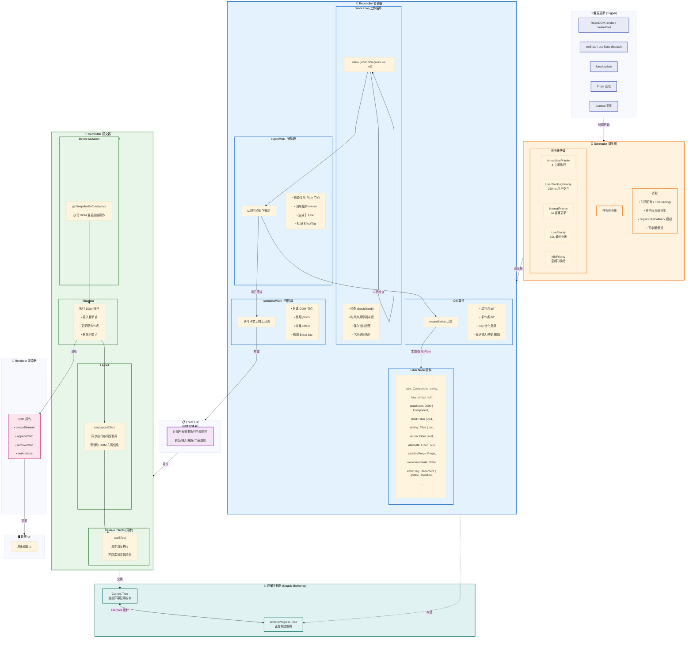

```mermaid
%%{init: {'theme': 'base', 'themeVariables': { 'fontSize': '15px'}}}%%
flowchart TB
    subgraph Trigger["🚀 触发更新 (Trigger)"]
        ReactDOM[ReactDOM.render / createRoot]
        SetState[setState / useState dispatch]
        ForceUpdate[forceUpdate]
        PropsChange[Props 变化]
        ContextChange[Context 变化]
    end
    
    subgraph Scheduler["⏰ Scheduler 调度器"]
        direction TB
        Priority["任务优先级"]
        
        subgraph Priorities["优先级等级"]
            Immediate[ImmediatePriority<br/>-1 立即执行]
            UserBlocking[UserBlockingPriority<br/>250ms 用户交互]
            Normal[NormalPriority<br/>5s 普通更新]
            Low[LowPriority<br/>10s 低优先级]
            Idle[IdlePriority<br/>空闲时执行]
        end
        
        SchedulerFunc["功能:
        <br/>• 时间切片 (Time Slicing)
        <br/>• 任务优先级排序
        <br/>• requestIdleCallback 模拟
        <br/>• 可中断/恢复"]
    end
    
    subgraph Reconciler["🔄 Reconciler 协调器<br/>(Render Phase - 可中断)"]
        direction TB
        
        subgraph WorkLoop["Work Loop 工作循环"]
            WL["while (workInProgress !== null)"]
            WLFunc["• 检查 shouldYield()
            <br/>• 时间片用尽则中断
            <br/>• 保存当前进度
            <br/>• 下次继续执行"]
        end
        
        subgraph FiberNode["Fiber Node 结构"]
            FiberStruct["{
            <br/>  type: Component | string,
            <br/>  key: string | null,
            <br/>  stateNode: DOM | Component,
            <br/>  child: Fiber | null,
            <br/>  sibling: Fiber | null,
            <br/>  return: Fiber | null,
            <br/>  alternate: Fiber | null,
            <br/>  pendingProps: Props,
            <br/>  memoizedState: State,
            <br/>  effectTag: Placement | Update | Deletion,
            <br/>  ...
            <br/>}"]
        end
        
        subgraph BeginWork["beginWork - 递阶段"]
            BW["从根节点向下遍历"]
            BWFunc["• 创建/复用 Fiber 节点
            <br/>• 调用组件 render
            <br/>• 生成子 Fiber
            <br/>• 标记 EffectTag"]
        end
        
        subgraph CompleteWork["completeWork - 归阶段"]
            CW["从叶子节点向上回溯"]
            CWFunc["• 创建 DOM 节点
            <br/>• 处理 props
            <br/>• 收集 Effect
            <br/>• 构建 Effect List"]
        end
        
        subgraph Diffing["Diff 算法"]
            Diff[" reconciliation 比较"]
            DiffFunc["• 单节点 diff
            <br/>• 多节点 diff
            <br/>• key 优化复用
            <br/>• 标记插入/更新/删除"]
        end
    end
    
    subgraph EffectList["📋 Effect List<br/>(副作用链表)"]
        EL["存储所有需要执行的副作用
        <br/>更新/插入/删除/生命周期"]
    end
    
    subgraph Committer["✅ Committer 提交器<br/>(Commit Phase - 不可中断)"]
        direction TB
        
        subgraph BeforeMutation["Before Mutation"]
            BM["getSnapshotBeforeUpdate
        <br/>执行 DOM 变更前的操作"]
        end
        
        subgraph Mutation["Mutation"]
            Mut["执行 DOM 操作
        <br/>• 插入新节点
        <br/>• 更新现有节点
        <br/>• 删除旧节点"]
        end
        
        subgraph Layout["Layout"]
            Lay["useLayoutEffect
        <br/>同步执行布局副作用
        <br/>可读取 DOM 布局信息"]
        end
        
        subgraph Passive["Passive Effects (异步)"]
            PE["useEffect
        <br/>异步调度执行
        <br/>不阻塞浏览器绘制"]
        end
    end
    
    subgraph Renderer["🎨 Renderer 渲染器"]
        DOM["DOM 操作
        <br/>• createElement
        <br/>• appendChild
        <br/>• removeChild
        <br/>• setAttribute"]
    end
    
    subgraph FinalUI["🖥️ 最终 UI"]
        Browser["浏览器显示"]
    end
    
    %% 流程连接
    Trigger -->|创建更新| Scheduler
    Scheduler -->|调度任务| Reconciler
    
    WL --> BW
    BW --> Diff
    Diff -->|生成/复用 Fiber| FiberNode
    BW -->|递归完成| CW
    CW -->|构建| EffectList
    
    WL -->|中断检查| WL
    
    EffectList -->|提交| Committer
    
    BM --> Mut
    Mut -->|调用| DOM
    Mut --> Lay
    Lay --> PE
    
    DOM -->|更新| FinalUI
    
    %% 双缓冲机制
    subgraph DoubleBuffering["🔄 双缓冲机制 (Double Buffering)"]
        Current["Current Tree<br/>当前屏幕显示的树"]
        WorkInProgress["WorkInProgress Tree<br/>正在构建的树"]
        Current <-->|alternate 指针| WorkInProgress
    end
    
    Reconciler -.->|构建| WorkInProgress
    Committer -.->|交换| Current
    
    %% 样式
    classDef trigger fill:#e8eaf6,stroke:#3f51b5,stroke-width:2px
    classDef scheduler fill:#fff3e0,stroke:#ef6c00,stroke-width:2px
    classDef reconciler fill:#e3f2fd,stroke:#1565c0,stroke-width:2px
    classDef committer fill:#e8f5e9,stroke:#2e7d32,stroke-width:2px
    classDef renderer fill:#fce4ec,stroke:#c2185b,stroke-width:2px
    classDef effect fill:#f3e5f5,stroke:#7b1fa2,stroke-width:2px
    classDef buffer fill:#e0f2f1,stroke:#00695c,stroke-width:2px
    
    class ReactDOM,SetState,ForceUpdate,PropsChange,ContextChange trigger
    class Scheduler,Priority,Priorities,SchedulerFunc scheduler
    class Reconciler,WorkLoop,BeginWork,CompleteWork,Diffing,FiberNode reconciler
    class Committer,BeforeMutation,Mutation,Layout,Passive committer
    class DOM renderer
    class EL effect
    class Current,WorkInProgress,DoubleBuffering buffer
```
