# TypeScript 类型系统层次结构

> TypeScript 的类型系统是一个图灵完备的静态类型语言。理解其层次结构有助于掌握从基础到高级的类型编程技术。

## 类型层次结构

```mermaid
flowchart BT
    %% 底层
    never

    %% 字面量类型
    literal42["literal 42"] --> number
    literalHello["literal 'hello'"] --> string
    literalTrue["literal true"] --> boolean

    %% 原始类型
    number --> Primitive
    string --> Primitive
    boolean --> Primitive
    symbol --> Primitive
    bigint --> Primitive
    undefined --> Primitive
    null --> Primitive

    %% 复合类型
    Primitive --> Object
    Array --> Object
    Function --> Object
    Tuple --> Array

    %% 联合与交叉
    stringOrNumber["string | number"] --> union
    nameAndAge["&#123;name&#125; & &#123;age&#125;"] --> intersection

    %% 泛型
    T --> Generic
    ArrayT["Array&lt;T&gt;"] --> Generic
    PromiseT["Promise&lt;T&gt;"] --> Generic

    %% 条件类型
    ExtendsT["T extends U ? X : Y"] --> Conditional

    %% 映射类型
    ReadonlyT["Readonly&lt;T&gt;"] --> Mapped
    PartialT["Partial&lt;T&gt;"] --> Mapped

    %% 顶层类型
    Object --> unknown
    union --> unknown
    intersection --> unknown
    Generic --> unknown
    Conditional --> unknown
    Mapped --> unknown
    unknown --> any
```



## 类型层级速查

| 层级 | 类型 | 说明 |
|------|------|------|
| **顶层** | `unknown` | 安全的顶级类型 |
| **顶层** | `any` | 关闭类型检查 |
| **原始** | `string/number/boolean` | 基本数据类型 |
| **复合** | `object/Array/Function` | 引用类型 |
| **泛型** | `Array&lt;T&gt;/Promise&lt;T&gt;` | 参数化类型 |
| **条件** | `T extends U ? X : Y` | 类型级三元运算 |
| **映射** | `&#123;[K in T]: V&#125;` | 遍历属性键 |
| **底层** | `never` | 空集/不可达 |

## 类型兼容性

```typescript
// 协变（Covariant）：子类型可赋值给父类型
let animal: Animal = new Dog(); // ✅

// 逆变（Contravariant）：函数参数
let f1: (x: Animal) => void = (x: Dog) => &#123;&#125;; // ❌
let f2: (x: Dog) => void = (x: Animal) => &#123;&#125;; // ✅

// 双向协变（Bivariant）：TypeScript 配置项
// strictFunctionTypes: true 时禁用双向协变
```

## 类型工具进阶

```typescript
// 递归类型
type DeepReadonly&lt;T&gt; = &#123;
  readonly [K in keyof T]: T[K] extends object
    ? DeepReadonly&lt;T[K]&gt;
    : T[K];
&#125;;

// 模板字面量类型
type EventName&lt;T extends string&gt; = `on$&#123;Capitalize&lt;T&gt;&#125;`;
// EventName<'click'> = 'onClick'

// 类型级编程：斐波那契
type Fibonacci&lt;N extends number&gt; = /* ... */;
```

## 类型编程能力矩阵

| 能力等级 | 掌握内容 | 典型应用 |
|----------|----------|----------|
| L1 基础 | 原始类型、接口、类型别名 | 日常类型标注 |
| L2 中级 | 泛型、联合/交叉类型、类型守卫 | 通用工具函数、API 类型 |
| L3 高级 | 条件类型、映射类型、infer | 类型工具库（type-fest） |
| L4 专家 | 递归类型、模板字面量、类型体操 | 框架类型定义、DSL |
| L5 大师 | 图灵完备类型编程 | 编译器插件、形式化验证 |

## 类型安全边界

TypeScript 的类型系统在编译时擦除（type erasure），运行时无类型信息：

```typescript
// 编译时类型检查
interface User { id: number; name: string }
const user: User = { id: 1, name: 'Alice' }

// 运行时无类型信息
console.log(typeof user)  // 'object'（不是 'User'）

// 需要运行时验证的场景
import { z } from 'zod'
const UserSchema = z.object({ id: z.number(), name: z.string() })
const validated = UserSchema.parse(unknownData)  // 运行时安全
```

## 参考资源

- [类型系统导读](/fundamentals/type-system) — 结构类型、泛型、变型
- [TypeScript 类型系统专题](/typescript-type-system/) — 19篇深度文档
- [TypeScript 速查表](/cheatsheets/typescript-cheatsheet) — 工具类型与类型体操
- [type-fest](https://github.com/sindresorhus/type-fest) — 常用工具类型库

---

 [← 返回架构图首页](./)
