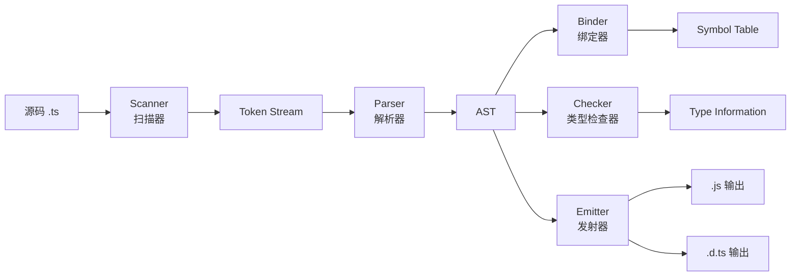
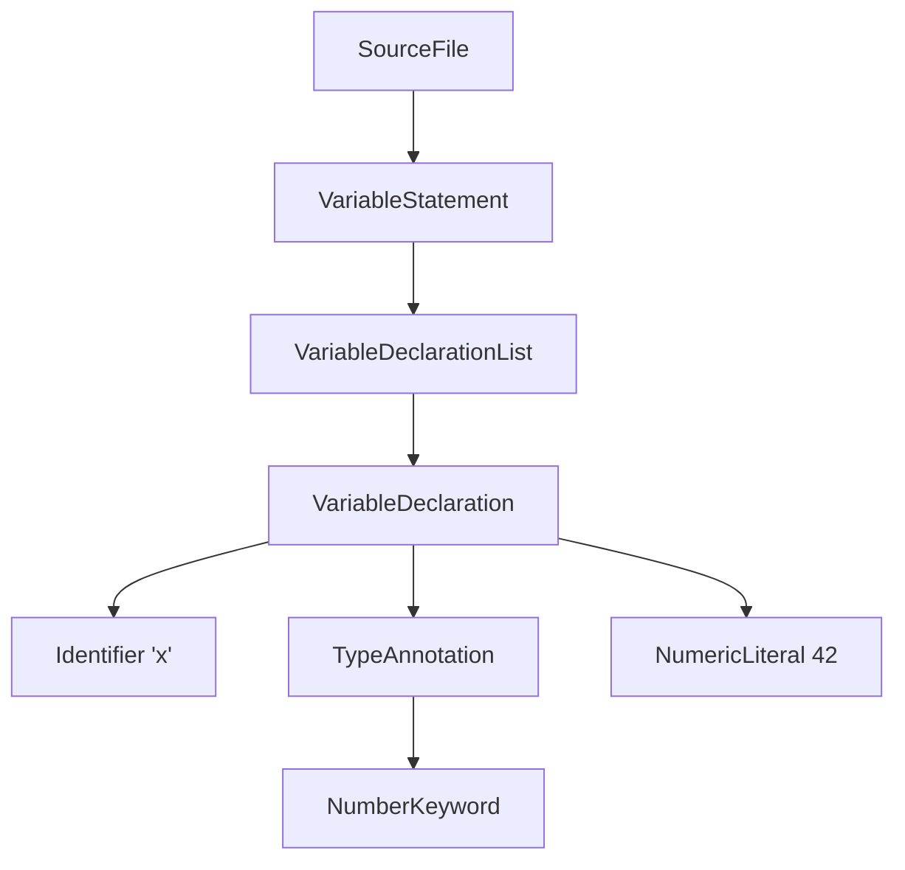
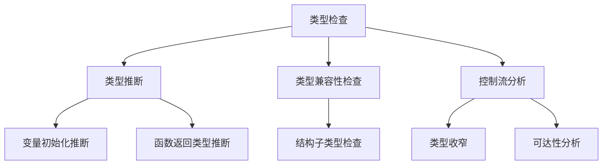
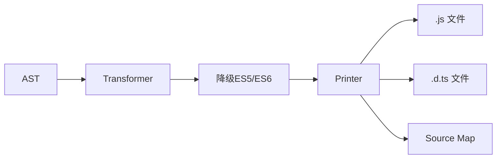
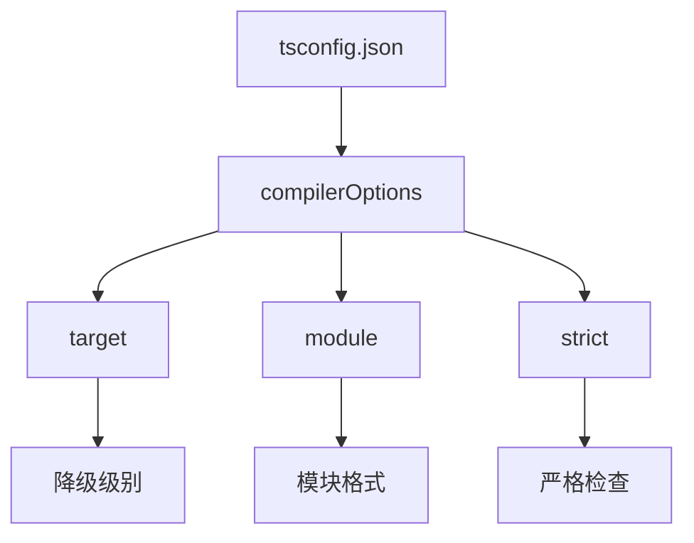
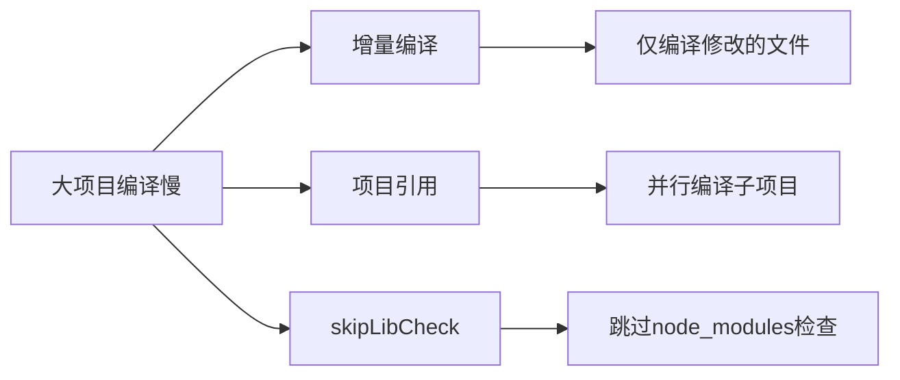

# TypeScript 编译器架构

> TypeScript 编译器（tsc）是一个功能丰富的转译器和类型检查器。理解其内部架构有助于诊断复杂的类型问题和优化编译性能。

## 编译器管线



## 各阶段详解

### 1. Scanner（扫描器）

将源代码字符流转换为 Token 序列：

```typescript
// 源码
const x: number = 42;

// Token 序列
// [ConstKeyword, Identifier, Colon, NumberKeyword, Equals, NumericLiteral(42), Semicolon]
```

### 2. Parser（解析器）

将 Token 序列构建为抽象语法树（AST）：



### 3. Binder（绑定器）

建立标识符与声明之间的符号表：

```typescript
// 创建 Symbol
const symbol = createSymbol(/*flags*/ SymbolFlags.Variable, 'x');

// 建立作用域链
// 全局作用域 → 模块作用域 → 函数作用域 → 块级作用域
```

### 4. Checker（类型检查器）

核心类型检查逻辑：



### 5. Emitter（发射器）

生成输出文件：



## TSConfig 配置对编译器的影响



| 配置项 | 影响阶段 | 说明 |
|--------|----------|------|
| `target` | Emitter | 输出 JavaScript 版本 |
| `module` | Emitter | 模块系统格式 |
| `strict` | Checker | 启用所有严格类型检查 |
| `noEmit` | Emitter | 跳过文件生成 |
| `declaration` | Emitter | 生成 .d.ts 文件 |

## 编译性能优化



```json
// tsconfig.json 性能优化
&#123;
  "compilerOptions": &#123;
    "incremental": true,
    "tsBuildInfoFile": "./.tsbuildinfo",
    "skipLibCheck": true,
    "composite": true
  &#125;
&#125;
```

## 参考资源

- [类型系统导读](/fundamentals/type-system) — TypeScript 类型理论基础
- [TSGo 原生编译器](/fundamentals/academic-frontiers) — TypeScript 编译器重写计划

---

 [← 返回架构图首页](./)
