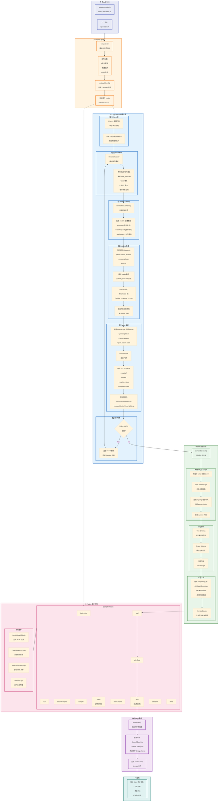

```mermaid
%%{init: {'theme': 'base', 'themeVariables': { 'fontSize': '14px'}}}%%
flowchart TB
    subgraph Input["📥 输入 (Input)"]
        EntryConfig["webpack.config.js
        <br/>entry: './src/index.js'"]
        CLI["CLI 命令
        <br/>npx webpack"]
    end
    
    subgraph Compiler["🚀 Compiler 启动"]
        WebpackCLI["webpack-cli
        <br/>解析命令行参数"]
        MergeConfig["合并配置:
        <br/>• 默认配置
        <br/>• 配置文件
        <br/>• CLI 参数"]
        CreateCompiler["webpack(config)
        <br/>创建 Compiler 实例"]
        CompilerHooks["注册插件 hooks
        <br/>beforeRun, run, ..."]
    end
    
    subgraph Compilation["📦 Compilation 编译过程"]
        direction TB
        
        subgraph EntryPhase["1️⃣ Entry 入口"]
            Entry["从 entry 配置开始
        <br/>单/多入口处理"]
            EntryDeps["创建 EntryDependency
        <br/>添加到编译队列"]
        end
        
        subgraph ResolvePhase["2️⃣ Resolve 解析"]
            Resolve["ResolverFactory
        <br/>模块路径解析"]
            ResolveSteps["• 解析绝对/相对路径
        <br/>• 解析 node_modules
        <br/>• alias 替换
        <br/>• 尝试扩展名
        <br/>• 缓存解析结果"]
        end
        
        subgraph ModuleFactory["3️⃣ Module Factory"]
            NormalModuleFactory["NormalModuleFactory
        <br/>创建模块实例"]
            CreateData["生成 module 创建数据:
        <br/>• request (原始请求)
        <br/>• userRequest (用户书写)
        <br/>• rawRequest (未经解析)"]
        end
        
        subgraph LoadersPhase["4️⃣ Loaders 处理"]
            MatchLoaders["匹配规则 (Rule.test):
        <br/>• test, include, exclude
        <br/>• resourceQuery
        <br/>• issuer"]
            ResolveLoaders["解析 loader 路径
        <br/>从 node_modules 加载"]
            RunLoaders["runLoaders()
        <br/>执行 loader 链:
        <br/>Pitching → Normal → Post"]
            LoaderResult["返回转换后的源码
        <br/>和 source map"]
        end
        
        subgraph ParserPhase["5️⃣ Parser 解析"]
            SelectParser["根据 module.type 选择 Parser
        <br/>• javascript/auto
        <br/>• javascript/esm
        <br/>• json, wasm, asset"]
            AST["acorn/espree
        <br/>生成 AST"]
            WalkAST["遍历 AST 识别依赖:
        <br/>• require()
        <br/>• import
        <br/>• require.ensure
        <br/>• require.context"]
            AddDeps["添加依赖到:
        <br/>• module.dependencies
        <br/>• module.blocks (Code Splitting)"]
        end
        
        subgraph Recursion["6️⃣ 递归构建"]
            CheckDeps{"还有未处理的
        <br/>依赖?"}
            ProcessDep["处理下一个依赖
        <br/>回到 Resolve 阶段"]
        end
    end
    
    subgraph Seal["🔒 Seal 封装阶段"]
        SealStart["compilation.seal()
        <br/>开始优化和分块"]
        
        subgraph ChunkGraph["构建 Chunk Graph"]
            EntryChunks["为每个 entry 创建 chunk"]
            SplitChunks["SplitChunksPlugin
        <br/>代码分割策略"]
            AsyncChunks["处理 import() 动态导入
        <br/>创建 async chunks"]
            RuntimeChunks["提取 runtime 代码"]
        end
        
        subgraph Optimize["优化阶段"]
            TreeShaking["Tree Shaking
        <br/>标记未使用导出"]
            ScopeHoisting["Scope Hoisting
        <br/>模块合并优化"]
            Minimize["代码压缩
        <br/>TerserPlugin"]
        end
        
        subgraph CodeGen["代码生成"]
            Template["使用 Template 生成:
        <br/>• WebpackBootstrap
        <br/>• 模块加载函数
        <br/>• 模块代码包装"]
            ConcatSource["ConcatSource
        <br/>合并所有模块源码"]
        end
    end
    
    subgraph Plugins["🔌 Plugins 插件执行"]
        direction TB
        
        subgraph Hooks["Compiler Hooks"]
            beforeRun["beforeRun"]
            run["run"]
            beforeCompile["beforeCompile"]
            compile["compile"]
            make["make
        <br/>(开始构建)"]
            afterCompile["afterCompile"]
            seal["seal"]
            afterSeal["afterSeal"]
            emit["emit
        <br/>(生成资源)"]
            afterEmit["afterEmit"]
            done["done"]
        end
        
        subgraph CommonPlugins["常用插件"]
            HtmlWP["HtmlWebpackPlugin
        <br/>生成 HTML 文件"]
            CleanWP["CleanWebpackPlugin
        <br/>清理输出目录"]
            MiniCSS["MiniCssExtractPlugin
        <br/>提取 CSS 文件"]
            DefineP["DefinePlugin
        <br/>注入全局常量"]
        end
        
        Hooks --> CommonPlugins
    end
    
    subgraph OutputPhase["📤 Output 输出"]
        EmitAssets["emitAssets()
        <br/>输出文件到磁盘"]
        OutputFiles["生成文件:
        <br/>• [name].[hash].js
        <br/>• [name].[hash].css
        <br/>• 资源文件 (images/fonts)"]
        SourceMap["生成 Source Map
        <br/>.js.map 文件"]
    end
    
    subgraph Final["✅ 完成"]
        Stats["输出 Stats 统计信息:
        <br/>• 构建时间
        <br/>• 资源大小
        <br/>• 警告/错误"]
    end
    
    %% 流程连接
    Input --> WebpackCLI
    WebpackCLI --> MergeConfig
    MergeConfig --> CreateCompiler
    CreateCompiler --> CompilerHooks
    CompilerHooks --> EntryPhase
    
    Entry --> EntryDeps
    EntryDeps --> Resolve
    Resolve --> ResolveSteps
    ResolveSteps --> NormalModuleFactory
    NormalModuleFactory --> CreateData
    CreateData --> MatchLoaders
    MatchLoaders --> ResolveLoaders
    ResolveLoaders --> RunLoaders
    RunLoaders --> LoaderResult
    LoaderResult --> SelectParser
    SelectParser --> AST
    AST --> WalkAST
    WalkAST --> AddDeps
    AddDeps --> CheckDeps
    CheckDeps -->|Yes| ProcessDep
    ProcessDep --> Resolve
    CheckDeps -->|No| SealStart
    
    SealStart --> EntryChunks
    EntryChunks --> SplitChunks
    SplitChunks --> AsyncChunks
    AsyncChunks --> RuntimeChunks
    RuntimeChunks --> TreeShaking
    TreeShaking --> ScopeHoisting
    ScopeHoisting --> Minimize
    Minimize --> Template
    Template --> ConcatSource
    
    CompilerHooks -.-> Hooks
    Seal -.-> seal
    seal -.-> afterSeal
    afterSeal -.-> emit
    emit --> EmitAssets
    
    EmitAssets --> OutputFiles
    OutputFiles --> SourceMap
    SourceMap --> Stats
    
    %% 样式
    classDef input fill:#e8eaf6,stroke:#3f51b5,stroke-width:2px
    classDef compiler fill:#fff3e0,stroke:#ef6c00,stroke-width:2px
    classDef compilation fill:#e3f2fd,stroke:#1565c0,stroke-width:2px
    classDef seal fill:#e8f5e9,stroke:#2e7d32,stroke-width:2px
    classDef plugins fill:#fce4ec,stroke:#c2185b,stroke-width:2px
    classDef output fill:#f3e5f5,stroke:#7b1fa2,stroke-width:2px
    classDef final fill:#e0f2f1,stroke:#00695c,stroke-width:2px
    
    class Input,EntryConfig,CLI input
    class Compiler,WebpackCLI,MergeConfig,CreateCompiler,CompilerHooks compiler
    class Compilation,EntryPhase,ResolvePhase,ModuleFactory,LoadersPhase,ParserPhase,Recursion compilation
    class Seal,SealStart,ChunkGraph,Optimize,CodeGen seal
    class Plugins,Hooks,CommonPlugins plugins
    class OutputPhase,EmitAssets,OutputFiles,SourceMap output
    class Final,Stats final
```
