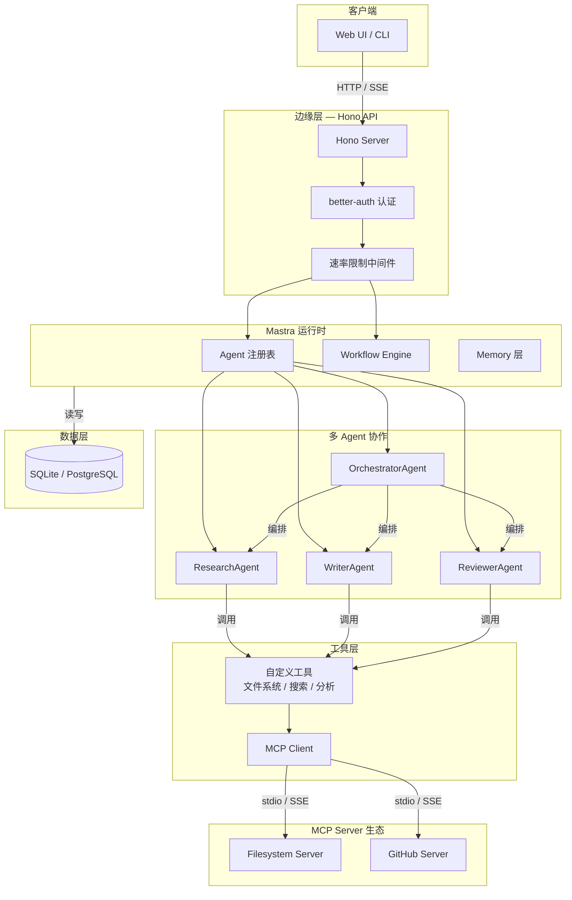
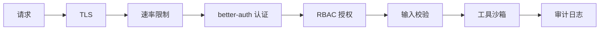

# AI Agent 架构设计

## 概述

本文档阐述一个基于 **Mastra + Model Context Protocol (MCP) + Hono** 的多 Agent 协作系统的架构设计。该系统模拟真实研发团队的工作流，包含研究员、写手、审校员和编排器四种 Agent 角色，通过声明式工作流引擎实现 DAG（有向无环图）编排，并借助 MCP 协议标准化工具接入。

核心设计目标包括：**可扩展的 Agent 注册与发现机制**、**类型安全的工作流编排**、**标准化的工具调用协议**、**多层安全防御体系**，以及对多种边缘运行时（Cloudflare Workers、Node.js、Docker）的部署兼容性。

## 核心内容

### 1. 整体架构分层

系统采用六层架构设计，各层职责清晰、边界明确：

| 层级 | 组件 | 职责 |
|------|------|------|
| **客户端** | Web UI / CLI | 用户交互入口，支持 HTTP 与 SSE 实时通信 |
| **边缘层** | Hono Server + better-auth | 请求路由、CORS、速率限制、认证授权 |
| **运行时** | Mastra 引擎 | Agent 注册表、工作流调度、记忆层管理 |
| **Agent 层** | Research / Write / Review / Orchestrator | 具备独立人格、系统提示与工具集的 AI 实体 |
| **工具层** | 自定义工具 + MCP Client | 文件系统访问、网络搜索、代码分析等能力 |
| **数据层** | SQLite / PostgreSQL | 审计日志、工作流状态、用户数据持久化 |

编排器 Agent（OrchestratorAgent）作为中央调度器，负责任务分解与分配。Worker Agent（ResearchAgent、WriterAgent、ReviewerAgent）无状态运行，接收任务即执行。所有状态通过 **Shared State** 在工作流步骤间传递，Agent 之间不直接通信，这种设计降低了耦合度，便于独立扩展和故障隔离。

### 2. Mastra 工作流引擎

Mastra 的工作流引擎基于声明式 DAG，核心概念包括：

| 概念 | 说明 |
|------|------|
| `Agent` | 具备独立人格、系统提示与工具集的 AI 实体 |
| `Workflow` | 声明式的 DAG，定义 Agent 执行顺序与依赖关系 |
| `Step` | 工作流中的单个执行节点，可包含条件分支与循环 |
| `Trigger` | 唤醒工作流的初始事件与输入数据 |
| `Shared State` | 跨步骤的共享状态对象，Agent 可读取/写入 |

工作流执行遵循严格的依赖顺序。以技术文档生成工作流为例：研究阶段（ResearchAgent）收集资料 → 写作阶段（WriterAgent）基于研究笔记撰写初稿 → 审查阶段（ReviewerAgent）评估质量 → 条件分支决定是否重写。每个 Step 可配置 `retryPolicy`（最大重试次数、指数退避间隔）和 `timeoutMs`（防止无限挂起），工作流级别支持补偿逻辑，失败时执行清理并释放资源。

### 3. MCP 协议集成

**Model Context Protocol（MCP）** 是 AI 时代的标准化工具接口，采用 JSON-RPC 2.0 作为通信格式，支持 stdio、SSE 和 HTTP Streamable 三种传输层。

协议定义四种核心通信原语：

| 原语 | 方向 | 用途 |
|------|------|------|
| **Tools** | Client → Server | LLM 可调用的函数，附带输入 Schema 描述 |
| **Resources** | Client → Server | 只读数据源，如文件、配置、API 响应缓存 |
| **Prompts** | Client → Server | 可复用的提示词模板，支持参数化渲染 |
| **Sampling** | Server → Client | Server 请求 Client 代为执行 LLM 推理 |

MCP Client 管理器封装了多 Server 连接、工具缓存和统一调用接口。Agent 通过 `McpClientManager` 发现并使用远程工具，无需关心底层传输细节。这种设计使得工具可以像插件一样动态加载，新能力的接入仅需配置 Server 地址，无需修改 Agent 代码。

### 4. Agent 通信模型

本项目采用 **中心化编排** 模式：

- **OrchestratorAgent** 作为中央调度器，基于任务类型进行路由决策
- **Worker Agent** 无状态，接收任务即执行，执行完毕将结果写回 Shared State
- 所有状态通过工作流引擎传递，Agent 间不直接通信

> MCP 解决 Agent 如何调用工具，A2A（Agent-to-Agent）解决 Agent 如何与其他 Agent 对话。当前实现中 Agent 间协作通过 Orchestrator 间接完成，未来可引入 Google A2A 协议实现 Agent 间的对等通信与任务委托。

### 5. 安全架构

安全设计贯穿请求处理全链路，形成纵深防御体系：

| 层级 | 机制 | 说明 |
|------|------|------|
| 传输层 | TLS 1.3 / HTTPS | 全链路加密，防止中间人攻击 |
| 接入层 | IP + 用户双重速率限制 | 基于 `hono-rate-limiter`，防止暴力请求 |
| 认证层 | OAuth 2.0 + Session Cookie | `better-auth` 提供类型安全的认证会话 |
| 授权层 | RBAC | `admin` / `developer` / `viewer` 三级角色 |
| 应用层 | Zod Schema 输入校验 | 所有 API 入口强制执行参数校验与类型推导 |
| 工具层 | 路径沙箱 + 最小权限 | 文件系统操作限制在安全根目录内 |
| 观测层 | 审计日志 | 完整的 Agent 调用、工具调用、工作流执行日志 |

审计日志中间件基于 Hono 的 `createMiddleware` 实现，记录每次请求的 `userId`、`action`、`method`、`statusCode`、`duration`、`ip` 和 `userAgent`，为安全审计和性能分析提供数据基础。

### 6. 关键代码实现

#### Agent 定义

```typescript
// agents/research-agent.ts
import { Agent } from '@mastra/core/agent'
import { openai } from '@ai-sdk/openai'
import { webSearchTool, fileAnalysisTool } from '../tools'

export const researchAgent = new Agent({
  name: 'ResearchAgent',
  instructions: `
    你是一位技术研究员，擅长深度分析开源项目和技术文档。
    你需要：
    1. 使用 webSearchTool 搜索最新技术资料
    2. 使用 fileAnalysisTool 分析代码仓库结构
    3. 输出结构化的研究报告，包含技术选型建议
  `,
  model: openai('gpt-4o'),
  tools: { webSearchTool, fileAnalysisTool },
})
```

#### 工作流声明

```typescript
// workflows/tech-doc-workflow.ts
import { Workflow } from '@mastra/core/workflows'
import { z } from 'zod'
import { researchAgent, writerAgent, reviewerAgent } from '../agents'

const triggerSchema = z.object({
  topic: z.string().describe('技术文档主题'),
  depth: z.enum(['overview', 'detailed']).default('overview'),
})

export const techDocWorkflow = new Workflow({
  name: 'tech-doc-workflow',
  triggerSchema,
})
  .step('research', async ({ context }) => {
    const { topic, depth } = context.triggerData
    const result = await researchAgent.generate(
      `研究主题：${topic}，深度：${depth}`
    )
    return { researchNotes: result.text }
  })
  .step('write', {
    dependsOn: ['research'],
    handler: async ({ context }) => {
      const notes = context.getStepResult('research')?.researchNotes
      const result = await writerAgent.generate(
        `基于以下研究笔记撰写技术文档：\n${notes}`
      )
      return { draftContent: result.text }
    },
  })
  .step('review', {
    dependsOn: ['write'],
    handler: async ({ context }) => {
      const draft = context.getStepResult('write')?.draftContent
      const result = await reviewerAgent.generate(
        `审查以下技术文档并给出评分和改进建议：\n${draft}`
      )
      const scoreMatch = result.text.match(/评分：(\d+)/)
      const passed = scoreMatch ? parseInt(scoreMatch[1]) >= 7 : false
      return { reviewReport: result.text, passed }
    },
  })
  .step('rewrite', {
    dependsOn: ['review'],
    when: async ({ context }) => {
      const review = context.getStepResult('review')
      return review?.passed === false
    },
    handler: async ({ context }) => {
      const draft = context.getStepResult('write')?.draftContent
      const report = context.getStepResult('review')?.reviewReport
      const result = await writerAgent.generate(
        `根据审查意见改进文档：\n审查意见：${report}\n原文：${draft}`
      )
      return { revisedContent: result.text }
    },
  })
  .commit()
```

#### Hono API 路由

```typescript
// server/index.ts
import { Hono } from 'hono'
import { cors } from 'hono/cors'
import { rateLimiter } from 'hono-rate-limiter'
import { authHandler } from './middleware/auth'
import { techDocWorkflow } from '../workflows/tech-doc-workflow'
import { zValidator } from '@hono/zod-validator'
import { z } from 'zod'

const app = new Hono()

app.use(cors({ origin: process.env.FRONTEND_URL }))
app.use(rateLimiter({
  windowMs: 60 * 1000,
  max: 30,
  keyGenerator: (c) => c.req.header('x-forwarded-for') || c.req.ip,
}))
app.use('/api/*', authHandler)

app.post('/api/workflows/tech-doc/start',
  zValidator('json', z.object({
    topic: z.string().min(1),
    depth: z.enum(['overview', 'detailed']).optional()
  })),
  async (c) => {
    const body = c.req.valid('json')
    const { runId, start } = techDocWorkflow.createRun()
    const result = await start({ triggerData: body })
    return c.json({ runId, status: result.status, results: result.results })
  }
)

// SSE 实时推送工作流进度
app.get('/api/workflows/:runId/events', async (c) => {
  const runId = c.req.param('runId')
  const stream = new ReadableStream({
    start(controller) {
      const unsubscribe = techDocWorkflow.watch(runId, (event) => {
        controller.enqueue(`data: ${JSON.stringify(event)}\n\n`)
      })
      c.req.raw.signal.addEventListener('abort', () => {
        unsubscribe()
        controller.close()
      })
    },
  })
  return new Response(stream, {
    headers: {
      'Content-Type': 'text/event-stream',
      'Cache-Control': 'no-cache',
    },
  })
})
```

#### MCP Client 管理器

```typescript
// lib/mcp-client.ts
import { Client } from '@modelcontextprotocol/sdk/client/index.js'
import { StdioClientTransport } from '@modelcontextprotocol/sdk/client/stdio.js'
import { SSEClientTransport } from '@modelcontextprotocol/sdk/client/sse.js'
import type { Tool } from '@modelcontextprotocol/sdk/types.js'

interface ServerConfig {
  name: string
  transport: 'stdio' | 'sse'
  command?: string
  args?: string[]
  url?: string
}

export class McpClientManager {
  private clients = new Map<string, Client>()
  private toolsCache = new Map<string, Tool[]>()

  async connectServer(config: ServerConfig) {
    const transport =
      config.transport === 'stdio'
        ? new StdioClientTransport({
            command: config.command!,
            args: config.args || [],
          })
        : new SSEClientTransport(new URL(config.url!))

    const client = new Client({ name: 'app-client', version: '1.0.0' })
    await client.connect(transport)

    const tools = await client.listTools()
    this.clients.set(config.name, client)
    this.toolsCache.set(config.name, tools.tools)

    console.log(`MCP server connected: ${config.name} (${tools.tools.length} tools)`)
  }

  async callTool(serverName: string, toolName: string, args: Record<string, unknown>) {
    const client = this.clients.get(serverName)
    if (!client) throw new Error(`Server ${serverName} not connected`)
    return client.callTool({ name: toolName, arguments: args })
  }

  getAllTools(): { server: string; tools: Tool[] }[] {
    return Array.from(this.toolsCache.entries()).map(([server, tools]) => ({
      server, tools,
    }))
  }

  async disconnectAll() {
    for (const [name, client] of this.clients) {
      await client.close()
      console.log(`MCP server disconnected: ${name}`)
    }
    this.clients.clear()
    this.toolsCache.clear()
  }
}
```

#### Zod 输入校验与类型推导

```typescript
// schemas/agent-schemas.ts
import { z } from 'zod'

export const ResearchInputSchema = z.object({
  topic: z.string().min(1).max(200),
  sources: z.array(z.enum(['web', 'github', 'docs'])).default(['web']),
  maxResults: z.number().int().min(1).max(50).default(10),
})

export const ReviewOutputSchema = z.object({
  score: z.number().int().min(1).max(10),
  passed: z.boolean(),
  suggestions: z.array(z.string()),
  categoryScores: z.record(z.number().int().min(1).max(10)),
})

export type ResearchInput = z.infer<typeof ResearchInputSchema>
export type ReviewOutput = z.infer<typeof ReviewOutputSchema>
```

## Mermaid 图表

### 系统整体架构图



### 工作流执行时序图

```mermaid
sequenceDiagram
    participant User
    participant Hono
    participant WF as Workflow Engine
    participant R as ResearchAgent
    participant W as WriterAgent
    participant V as ReviewerAgent

    User->>Hono: POST /workflows/techDoc/start
    Hono->>WF: execute(triggerData)

    WF->>R: Step 1: research
    R-->>WF: researchNotes

    WF->>W: Step 2: write (依赖 research)
    W-->>WF: draftContent

    WF->>V: Step 3: review (依赖 write)
    V-->>WF: reviewReport + passed?

    alt passed == false
        WF->>W: Step 3b: rewrite (条件分支)
        W-->>WF: revisedContent
    end

    WF->>WF: Step 4: finalize
    WF-->>Hono: 执行完成
    Hono-->>User: &#123; runId, status &#125;
```



### MCP Client 管理器类图

```mermaid
classDiagram
    class McpClientManager &#123;
        +Map~string,Client~ clients
        +Map~string,Tool[]~ toolsCache
        +connectServer(config)
        +callTool(server, tool, args)
        +getAllTools()
        +disconnectAll()
    &#125;

    class Client &#123;
        +connect(transport)
        +listTools()
        +callTool(params)
        +close()
    &#125;

    class StdioClientTransport &#123;
        +command: string
        +args: string[]
    &#125;

    class SSEClientTransport &#123;
        +url: URL
    &#125;

    McpClientManager --> Client : manages
    Client --> StdioClientTransport : uses
    Client --> SSEClientTransport : uses
```

### 安全防御链路图



## 最佳实践总结

1. **Agent 设计遵循单一职责原则**：每个 Agent 只负责一个领域（研究、写作、审校），通过编排器协调，避免单个 Agent 承担过多上下文导致输出质量下降。

2. **工作流使用显式依赖声明**：通过 `dependsOn` 明确步骤间的数据流，避免隐式依赖导致的时序错误。条件分支使用 `when` 谓词，保持工作流逻辑的透明性。

3. **工具调用通过 MCP 抽象**：所有外部能力（文件系统、GitHub、搜索）统一通过 MCP 协议接入，Agent 代码无需修改即可切换工具实现，实现「工具即插件」的架构。

4. **输入校验前置到 API 层**：所有外部请求经过 Zod Schema 校验后才进入业务逻辑，结合 TypeScript 类型推导，在编译期和运行期双重保障数据安全。

5. **全链路可观测**：通过审计日志中间件记录每次 Agent 调用和工作流执行的耗时、状态、用户信息，为故障排查和成本分析提供数据支撑。

6. **SSE 流式输出降低延迟感知**：对于长时间运行的 Agent 任务，使用 Server-Sent Events 实时推送中间状态，避免客户端超时等待，提升用户体验。

## 参考资源

- [Mastra Documentation](https://mastra.ai/docs) — Mastra AI Agent 框架官方文档，涵盖 Agent 定义、工作流 API 和记忆层配置
- [Model Context Protocol Specification](https://modelcontextprotocol.io/) — MCP 协议规范与 TypeScript SDK 文档
- [Anthropic — Model Context Protocol Intro](https://www.anthropic.com/news/model-context-protocol) — MCP 协议最初发布的官方博客
- [Hono Documentation](https://hono.dev/) — Hono 边缘优先 Web 框架，支持 Cloudflare Workers、Deno 和 Node.js
- [better-auth Documentation](https://www.better-auth.com/) — 类型安全的认证库，支持 OAuth 2.0、Session 和 RBAC
- [Google A2A Protocol](https://google.github.io/A2A/) — Agent-to-Agent 通信协议规范
- [Zod Documentation](https://zod.dev/) — TypeScript 模式验证与类型推导库
