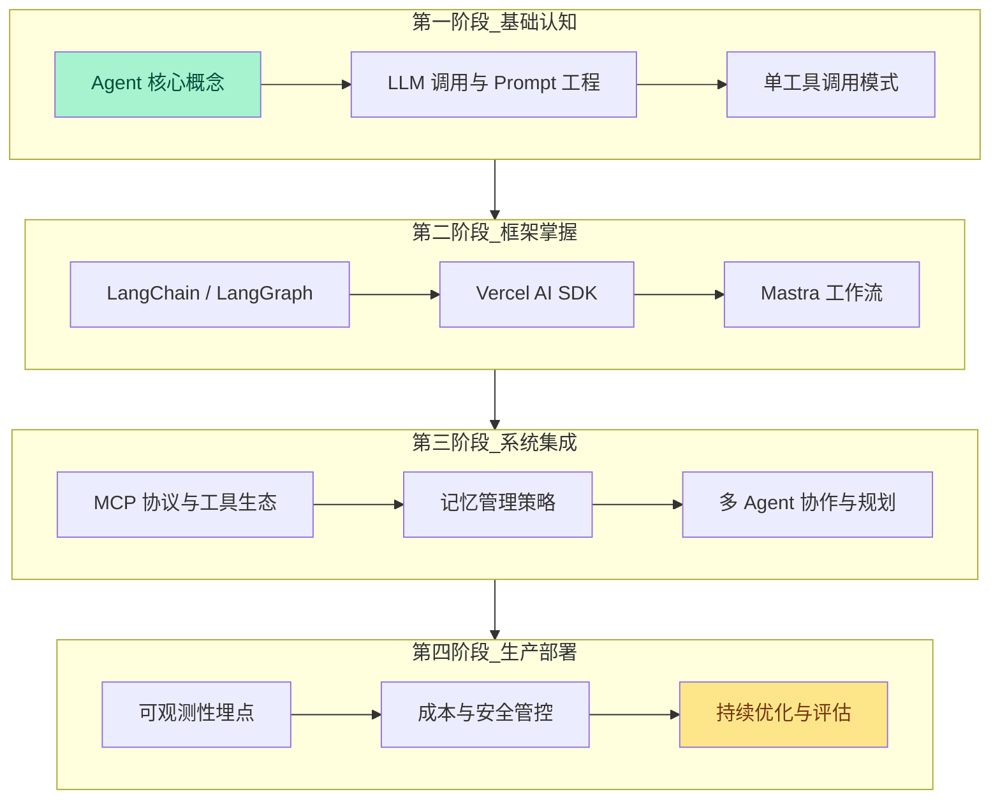
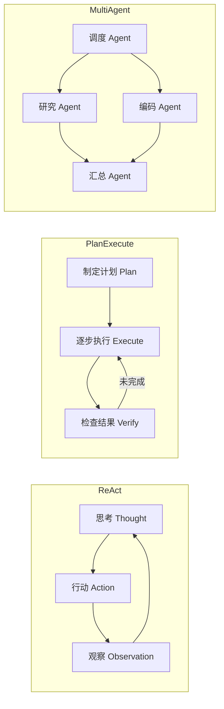

# AI Agent 开发示例 — 总览

> 本示例库聚焦 **AI Agent（人工智能代理）** 的工程设计实践，涵盖从基础概念到生产级部署的完整链路。所有示例均以 TypeScript 为首选语言，结合现代 LLM 编排框架，演示如何构建具备感知、推理、行动与记忆能力的自治系统。

AI Agent 正迅速从实验性原型演进为生产系统的核心组件。不同于传统的请求-响应式 API 调用，Agent 具备**持续状态**、**工具调用能力**和**自主决策循环**，能够在复杂环境中完成多步骤任务。本目录提供的示例遵循以下设计原则：

- **类型安全优先**：所有示例使用 TypeScript 严格模式，充分利用 Zod 进行运行时契约验证
- **框架无关的抽象**：在介绍具体框架的同时，强调跨框架的通用 Agent 设计模式
- **可观测性内置**：每条 Agent 执行链路均包含结构化日志、成本追踪与性能指标
- **渐进式复杂度**：从单 Agent 工具调用到多 Agent 协作网络，逐步展开架构深度

---

## 学习路径

以下流程图展示了从零基础到生产部署的推荐学习顺序。建议按照阶段递进，每个阶段均包含理论输入、代码实现与复盘检查三个环节。



### 各阶段关键产出

| 阶段 | 核心技能 | 预期产出 | 验证标准 |
|------|---------|---------|---------|
| **第一阶段** | 理解 Agent 循环（感知→推理→行动） | 可运行的天气查询 Agent | 能正确解析工具返回并生成自然语言回复 |
| **第二阶段** | 掌握至少一种编排框架的 DSL | 基于 LangGraph 的状态机或 Mastra 工作流 | 代码通过类型检查并包含单元测试 |
| **第三阶段** | 集成外部工具与长期记忆 | 支持多轮对话的 RAG Agent | 能跨会话保持用户偏好上下文 |
| **第四阶段** | 构建可观测、可回滚的系统 | 部署到云端并接入监控 | P99 延迟、Token 成本、错误率可量化 |

---

## 核心概念 — Agent、Tool、Memory、Planner

### Agent（智能体）

Agent 是具备**目标导向行为**的自治计算实体。在 LLM 驱动的语境下，Agent 的核心是一个循环：

1. **感知（Perception）**：接收用户输入或环境状态变化
2. **推理（Reasoning）**：基于系统提示（System Prompt）与历史上下文进行思考
3. **行动（Action）**：决定调用工具、生成回复或请求更多信息
4. **观察（Observation）**：收集工具返回值或外部事件，反馈到下一轮循环

学术界通常将 LLM-based Agent 的架构归纳为 **感知-大脑-行动** 三元组（Wang et al., 2024）。其中，大脑（Brain）即大语言模型本身，负责认知与决策；行动（Action）通过工具（Tool）扩展；感知（Perception）则依赖记忆（Memory）与环境接口。

```typescript
// 最简化的 Agent 循环骨架（伪代码）
interface AgentLoop {
  systemPrompt: string;
  memory: MemoryStore;
  tools: Tool[];
  llm: LanguageModel;
}

async function runAgent(agent: AgentLoop, userInput: string): Promise<string> {
  const context = await agent.memory.load(userInput);
  const plan = await agent.llm.generate({
    system: agent.systemPrompt,
    messages: context,
    tools: agent.tools,
  });
  if (plan.toolCall) {
    const observation = await executeTool(plan.toolCall);
    await agent.memory.save(observation);
    return runAgent(agent, `Observation: ${observation}`);
  }
  return plan.content;
}
```

### Tool（工具）

工具是 Agent 与外部世界交互的**唯一通道**。通过工具，Agent 可以获取实时信息、执行副作用操作或调用专用算法。工具的定义通常包含以下要素：

| 要素 | 说明 | 示例 |
|------|------|------|
| **Name** | 工具的唯一标识符 | `search_web`、`send_email` |
| **Description** | 供 LLM 决策时参考的自然语言描述 | "当需要获取最新新闻时使用" |
| **Parameters** | JSON Schema 或 Zod 定义的结构化输入 | `{ query: string, limit: number }` |
| **Handler** | 实际执行逻辑的异步函数 | 调用搜索引擎 API |
| **Return Type** | 输出结构的类型定义 | `{ results: SearchResult[] }` |

工具设计的最佳实践强调**描述即契约（Description-as-Contract）**：LLM 仅通过工具名称与描述决定是否调用，因此描述必须精确、无歧义。同时，工具应遵循**幂等性**与**最小权限**原则，避免 Agent 的误调用造成不可逆影响。

```typescript
import { z } from 'zod';

const SearchToolSchema = z.object({
  query: z.string().describe('搜索关键词，需用英文表达以获得更好结果'),
  limit: z.number().min(1).max(10).default(5).describe('返回结果数量上限'),
});

type SearchInput = z.infer<typeof SearchToolSchema>;

const searchTool = {
  name: 'web_search',
  description: '使用 DuckDuckGo 搜索互联网公开信息。当用户询问时事、最新技术动态或需要验证的事实时调用此工具。',
  parameters: SearchToolSchema,
  handler: async (input: SearchInput) => {
    // 实际实现调用搜索 API
    const results = await duckDuckGoSearch(input.query, input.limit);
    return { results };
  },
};
```

### Memory（记忆）

记忆系统解决 Agent 的**状态持久化**问题。没有记忆的 Agent 每次交互都是无状态的，无法完成需要上下文延续的复杂任务。记忆通常分为两个层级：

- **短期记忆（Short-term Memory）**：当前会话的上下文窗口，直接作为 LLM 的输入消息历史。受限于模型的上下文长度（通常为 128K tokens），需要配合摘要（Summarization）或滑动窗口（Sliding Window）策略进行管理。
- **长期记忆（Long-term Memory）**：跨会话持久化的知识库，通常基于向量数据库（Vector Store）实现语义检索。经典模式包括 RAG（Retrieval-Augmented Generation）与知识图谱（Knowledge Graph）。

```typescript
// 分层记忆接口示例
interface MemorySystem {
  // 短期记忆：直接参与 LLM 上下文
  workingMemory: Message[];

  // 长期记忆：通过检索注入
  vectorStore: VectorStore;

  async save(experience: Experience): Promise<void>;
  async retrieve(query: string, topK: number): Promise<Experience[]>;
  async summarize(window: Message[]): Promise<string>;
}
```

高级记忆策略还包括：**情景记忆（Episodic Memory）** 存储具体事件轨迹，**语义记忆（Semantic Memory）** 存储抽象知识，以及 **程序记忆（Procedural Memory）** 存储工具调用模式。在工程实现中，常使用 LangChain 的 `ConversationBufferMemory`、Vercel AI SDK 的 `createContext` 或 Mastra 的 `Memory` 模块来简化这些抽象。

### Planner（规划器）

Planner 负责将**高层目标**分解为**可执行的子任务序列**。规划能力直接决定了 Agent 处理复杂任务的上限。常见的规划范式包括：

| 范式 | 核心思想 | 适用场景 | 代表实现 |
|------|---------|---------|---------|
| **ReAct** | 推理（Reasoning）与行动（Acting）交替进行，每步均生成思考过程 | 需要逐步探索的单 Agent 任务 | LangChain `createReactAgent` |
| **Plan-and-Execute** | 先一次性生成完整计划，再按顺序执行 | 目标明确、步骤可预见的任务 | LangGraph `createPlanExecute` |
| **Tree of Thoughts** | 维护多个候选思考路径，通过评估函数剪枝 | 需要回溯探索的搜索问题 | 自定义实现 |
| **Multi-Agent Collaboration** | 多个专精 Agent 分工协作，通过消息传递协调 | 复杂系统需要领域隔离 | AutoGen、CrewAI、Mastra Workflow |



在生产环境中，ReAct 因其**低开销**与**良好的可解释性**而被广泛采用；而对于需要严格阶段控制的流程（如软件工程任务），Plan-and-Execute 或显式的状态机（LangGraph）更为稳健。Mastra 的工作流引擎（Workflow Engine）则提供了声明式的 DAG 编排能力，适合构建可审计的业务流程。

---

## 技术栈全景 — LangChain、Mastra、Vercel AI SDK、MCP

当前 TypeScript / JavaScript 生态中，AI Agent 的技术栈呈现**多框架并存、协议层统一**的趋势。以下从设计哲学、核心抽象、生态成熟度与适用场景四个维度进行系统对比。

### LangChain & LangGraph

LangChain 是历史最悠久的 LLM 应用编排框架之一，其 JavaScript/TypeScript 版本（`langchain` / `@langchain/core`）提供了从模型接口、提示模板到工具调用、记忆管理的完整链路。

**LangChain 核心抽象：**

| 抽象层 | 职责 | 典型类/函数 |
|--------|------|-----------|
| **Chat Model** | 封装 OpenAI、Anthropic、Gemini 等模型调用 | `ChatOpenAI`, `ChatAnthropic` |
| **Prompt Template** | 结构化提示的模板化与变量注入 | `ChatPromptTemplate.fromMessages` |
| **Tool** | 可调用函数的 Schema 与执行逻辑封装 | `tool()` 辅助函数 |
| **Chain** | 组合多个组件的静态执行图（已逐渐被 LangGraph 取代） | `LLMChain`, `RetrievalQAChain` |
| **Memory** | 对话历史的存储与检索策略 | `BufferMemory`, `VectorStoreRetrieverMemory` |

**LangGraph** 是 LangChain 生态的进阶编排层，它将 Agent 执行流程建模为**状态机（State Machine）**，节点（Node）代表计算步骤，边（Edge）代表状态转移。这种显式图结构带来了三大优势：

1. **可持久化**：任意时刻的状态均可序列化到数据库，支持断点续跑
2. **人机协同（Human-in-the-loop）**：可在任意节点暂停，等待人类审批或修正
3. **循环控制**：通过条件边（Conditional Edge）精确控制循环终止条件

```typescript
// LangGraph 状态机示例：简单的研究-撰写 Agent
import { StateGraph, END } from '@langchain/langgraph';
import { BaseMessage } from '@langchain/core/messages';

interface AgentState {
  messages: BaseMessage[];
  researchNotes: string;
  draftCount: number;
}

const workflow = new StateGraph<AgentState>({
  channels: {
    messages: { value: (x, y) => x.concat(y), default: () => [] },
    researchNotes: { value: (x, y) => y ?? x, default: () => '' },
    draftCount: { value: (x, y) => y ?? x, default: () => 0 },
  },
});

workflow.addNode('research', researchNode);
workflow.addNode('write', writeNode);
workflow.addNode('review', reviewNode);

workflow.setEntryPoint('research');
workflow.addEdge('research', 'write');
workflow.addConditionalEdges('write', (state) =>
  state.draftCount > 3 ? 'review' : 'research'
);
workflow.addEdge('review', END);

const app = workflow.compile();
```

### Vercel AI SDK

Vercel AI SDK（`ai` 包）是由 Vercel 维护的、面向前端与全栈开发者的轻量级 LLM 工具库。其设计哲学强调**流式 UI（Streaming UI）** 与**框架无关的模型调用层**。

核心模块包括：

- **`ai/core`**：统一的模型调用 API（`generateText`, `streamText`, `generateObject`, `streamObject`），支持 OpenAI、Anthropic、Google、Mistral 等数十个提供商
- **`ai/rsc`**：React Server Components 集成，允许 LLM 流直接渲染为 React 组件树（即 Generative UI）
- **`ai/ui`**：前端 hooks（`useChat`, `useCompletion`），简化聊天界面的状态管理

Vercel AI SDK 在 Agent 场景中的优势在于**工具调用与流式输出的无缝结合**：

```typescript
import { generateText, tool } from 'ai';
import { openai } from '@ai-sdk/openai';
import { z } from 'zod';

const result = await generateText({
  model: openai('gpt-4o'),
  system: '你是一个研究助手，擅长搜索并总结信息。',
  tools: {
    search: tool({
      description: '搜索互联网信息',
      parameters: z.object({ query: z.string() }),
      execute: async ({ query }) => searchDuckDuckGo(query),
    }),
  },
  maxSteps: 5, // 自动进行多步工具调用
  prompt: '2025 年 TypeScript 生态有哪些重要的新框架？',
});
```

与 LangChain 相比，Vercel AI SDK 更加**轻量**和**声明式**，但生态工具链（如长期记忆、向量检索）需要自行集成。它特别适合以 Next.js 为技术栈、强调实时交互体验的项目。

### Mastra

Mastra 是一个新兴的 **TypeScript-first Agent 框架**，由 Open-source 团队构建，强调**工作流即代码（Workflow-as-Code）** 与**类型安全的端到端链路**。其设计目标是在 LangChain 的灵活性与 Vercel AI SDK 的简洁性之间取得平衡。

Mastra 的四大核心模块：

| 模块 | 功能 | 特点 |
|------|------|------|
| **Agent** | 定义具备系统提示、工具集与记忆的智能体 | 原生支持多 Provider 切换 |
| **Workflow** | 通过 DAG 编排多步骤任务 | 支持并行分支、条件路由、重试策略 |
| **Memory** | 分层记忆存储（工作记忆、语义记忆、 episodic） | 内置向量检索与摘要 |
| **Integrations** | 预封装的第三方服务连接器 | Notion、Slack、GitHub、PostgreSQL 等 |

```typescript
// Mastra Agent 定义示例
import { Agent } from '@mastra/core';

export const researchAgent = new Agent({
  name: 'ResearchAgent',
  instructions:
    '你是一个严谨的研究助手。在回答前，总是先调用搜索工具验证事实，并引用来源。',
  model: {
    provider: 'OPEN_AI',
    name: 'gpt-4o',
  },
  tools: { webSearch, calculator },
  memory: {
    vectorStore: 'pgvector', // 使用 PostgreSQL + pgvector
    embeddingModel: 'text-embedding-3-small',
  },
});
```

Mastra 的 Workflow 引擎在类型推导方面表现尤为突出：每个步骤的输入输出类型在编译时即被约束，极大减少了 Agent 编排中常见的类型漂移问题。

### MCP（Model Context Protocol）

MCP 是由 Anthropic 于 2024 年底开源的**开放协议**，旨在标准化 LLM 应用与外部数据源、工具之间的集成方式（Anthropic, 2024）。它采用客户端-服务器架构：

- **MCP Host**：承载 LLM 对话的应用程序（如 Claude Desktop、IDE 插件）
- **MCP Client**：在 Host 内部维护与 Server 的 1:1 连接
- **MCP Server**：暴露特定能力（如文件系统访问、Git 操作、数据库查询）的轻量级服务

```
┌─────────────────────────────────────────────────────────────┐
│                        MCP Host                              │
│  ┌─────────────┐  ┌─────────────┐  ┌─────────────────────┐  │
│  │  MCP Client │  │  MCP Client │  │    LLM Interface    │  │
│  │  (FileSys)  │  │   (GitHub)  │  │   (Claude / GPT)    │  │
│  └──────┬──────┘  └──────┬──────┘  └─────────────────────┘  │
└─────────┼────────────────┼──────────────────────────────────┘
          │                │
          ▼                ▼
  ┌──────────────┐  ┌──────────────┐
  │ MCP Server   │  │ MCP Server   │
  │ Filesystem   │  │   GitHub     │
  └──────────────┘  └──────────────┘
```

MCP 对 Agent 开发的意义在于**工具生态的解耦**：开发者不再需要为每个框架单独编写工具封装，而是可以让任何兼容 MCP 的 Agent 直接消费标准化的工具服务器。本示例库的 [MCP 集成指南](./mcp-integration.md) 详细演示了如何在 TypeScript Agent 中充当 MCP Client，并自建 MCP Server。

### 技术栈选型决策矩阵

| 维度 | LangChain / LangGraph | Vercel AI SDK | Mastra | 纯 MCP + SDK |
|------|----------------------|---------------|--------|-------------|
| **学习曲线** | 中等（概念较多） | 低（API 极简） | 中等（TypeScript 友好） | 高（需自行编排） |
| **类型安全** | 良好 | 优秀 | 优秀 | 依赖实现 |
| **流式 UI** | 支持但非核心 | 原生支持 | 支持 | 需自行集成 |
| **持久化/断点续跑** | LangGraph 原生支持 | 需自行实现 | Workflow 原生支持 | 需自行实现 |
| **多 Agent 协作** | LangGraph 显式图 | 需自行设计 | Workflow DAG | 需协议层协调 |
| **生态成熟度** | 最丰富 | 快速增长 | 新兴 | 协议标准 |
| **推荐场景** | 复杂状态机、研究型 Agent | Next.js 实时应用 | 企业级类型安全工作流 | 工具标准化、跨团队复用 |

---

## 示例目录

本目录包含以下核心示例文档，覆盖架构设计、协议集成与渐进式教程三种学习模式：

| 序号 | 主题 | 文件 | 难度 | 预计时长 | 涉及技术 |
|------|------|------|------|---------|---------|
| 01 | Agent 架构设计模式与决策框架 | [查看](./architecture.md) | 中级 | 45 min | LangGraph、Mastra、状态机 |
| 02 | MCP 协议集成与自定义 Server 开发 | [查看](./mcp-integration.md) | 高级 | 60 min | MCP、TypeScript、Stdio/SSE |
| 03 | 从零构建研究型 Agent：完整教程 | [查看](./tutorial.md) | 初级→中级 | 90 min | Vercel AI SDK、RAG、工具调用 |

### 示例 01：Agent 架构设计模式

[architecture.md](./architecture.md) 深入探讨了生产环境中 Agent 的架构选型。文档包含以下内容：

- **单 Agent vs 多 Agent**：何时应该拆分 Agent 职责？拆分的粒度如何把握？
- **状态机设计**：使用 LangGraph 建模复杂的审批流程与循环控制
- **错误恢复策略**：工具调用失败时的重试、降级与人工介入机制
- **成本优化**：通过提示压缩、缓存与模型路由（Router）降低 Token 消耗

### 示例 02：MCP 集成与自定义 Server

[mcp-integration.md](./mcp-integration.md) 是当前生态中最实用的 MCP 工程指南之一：

- **协议握手**：详解 `initialize`、`notifications/initialized` 与能力协商（Capability Negotiation）
- **传输层选择**：Stdio（本地子进程）与 SSE（HTTP 流）的适用场景与性能对比
- **工具发现（Tool Discovery）**：动态 Schema 注册与运行时工具列表更新
- **安全边界**：Server 的权限沙箱、超时控制与输入验证策略

### 示例 03：从零构建研究型 Agent

[tutorial.md](./tutorial.md) 是一篇手把手的渐进式教程，适合第一次接触 Agent 开发的工程师：

- **环境搭建**：安装 `ai` SDK、配置 API Key、启用 TypeScript 严格模式
- **第一步**：实现一个能调用搜索引擎的单轮 Agent
- **第二步**：引入多步推理（Multi-step Reasoning），让 Agent 自动迭代搜索结果
- **第三步**：接入向量数据库（Pinecone / pgvector），实现长期记忆与个性化
- **第四步**：部署到 Vercel，配置 Edge Function 与流式响应

---

## 与理论专题的映射

AI Agent 的工程设计离不开底层理论支撑。本示例库与网站的理论专题形成**实践-理论双轨**映射关系，建议结合阅读以获得系统性理解。

| 示例主题 | 理论支撑 | 关键概念 |
|---------|---------|---------|
| [Agent 架构设计](./architecture.md) | 并发与异步模型 — 事件循环、异步状态机、背压控制 | Agent 循环本质上是异步生成器（Async Generator）与事件驱动的结合体 |
| [MCP 协议集成](./mcp-integration.md) | [模块系统](/module-system/) — ESM、接口契约、版本兼容性 | MCP 的 Schema 即接口契约，工具发现机制对应动态模块加载 |
| [研究型 Agent 教程](./tutorial.md) | 数据结构与算法 — 向量检索、近似最近邻（ANN）、图遍历 | RAG 的核心是向量空间中的 ANN 搜索；多步推理可建模为图遍历 |
| 工具调用与函数绑定 | [TypeScript 类型系统](/typescript-type-system/) — 运行时类型检查、Zod Schema、泛型约束 | Zod Schema 作为 LLM 与 TypeScript 类型系统的桥梁 |
| 记忆管理与上下文压缩 | 执行模型 — 调用栈、闭包、垃圾回收 | 短期记忆对应调用栈帧；长期记忆的摘要机制类似 GC 中的代际假设 |

### 深入阅读建议

- **LangChain 官方文档**：<https://python.langchain.com/docs/> （概念层与 JS 版本一致）
- **MCP Specification**：<https://modelcontextprotocol.io/specification/2024-11-05/> （协议标准原文）
- **Vercel AI SDK 文档**：<https://sdk.vercel.ai/docs/> （API 参考与 RSC 指南）
- **Mastra 文档**：<https://mastra.ai/docs/> （TypeScript Agent 框架参考）

---

## 安全与工程规范

在将 Agent 投入生产前，必须通过以下安全检查清单：

### 输入安全

| 检查项 | 风险 | 缓解措施 |
|--------|------|---------|
| **提示注入（Prompt Injection）** | 恶意输入覆盖系统提示，导致 Agent 执行非预期操作 | 使用分隔符隔离用户输入；输出侧进行意图校验 |
| **工具参数污染** | LLM 生成的参数包含恶意 payload | 严格的 Zod Schema 校验；工具 handler 内二次校验 |
| **间接提示注入** | 通过工具返回值（如网页内容）注入指令 | 对工具输出进行摘要而非全文注入；使用可信源白名单 |

### 输出安全

| 检查项 | 风险 | 缓解措施 |
|--------|------|---------|
| **信息泄露** | Agent 泄露系统提示、记忆内容或其他用户数据 | 记忆隔离（按 userId 分区）；系统提示标记为不可泄露 |
| **幻觉传播** | Agent 将 LLM 幻觉当作事实，通过工具写入外部系统 | 关键写操作必须经过人类确认（Human-in-the-loop） |
| **成本爆炸** | 无限循环或递归调用导致 Token 费用激增 | 设置 `maxSteps`、`maxTokens` 与全局预算上限 |

### 运行时安全

```typescript
// 安全的 Agent 运行时装甲示例
interface SafeAgentConfig {
  maxSteps: number;        // 最大推理步数，防止无限循环
  maxTokensPerStep: number; // 每步 Token 上限
  totalBudgetTokens: number; // 全局 Token 预算
  allowedTools: string[];   // 工具白名单
  requireConfirmation: string[]; // 需要人工确认的工具名列表
  timeoutMs: number;        // 单步超时
}

async function runWithGuardrails(
  agent: Agent,
  input: string,
  config: SafeAgentConfig
): Promise<Result> {
  const controller = new AbortController();
  const timeout = setTimeout(() => controller.abort(), config.timeoutMs);

  try {
    const result = await agent.run(input, {
      signal: controller.signal,
      maxSteps: config.maxSteps,
      toolWhitelist: config.allowedTools,
    });
    return result;
  } finally {
    clearTimeout(timeout);
  }
}
```

---

## 性能优化指南

Agent 系统的性能瓶颈通常不在 LLM 调用本身，而在于**编排开销**与**I/O 等待**。以下是经过验证的优化策略：

### 延迟优化

| 策略 | 原理 | 适用场景 |
|------|------|---------|
| **流式输出（Streaming）** | 首 Token 到达即开始渲染，降低感知延迟 | 聊天界面、实时协作 |
| **并行工具调用** | 同时发起多个独立工具请求 | 需要多个数据源的研究任务 |
| **提示缓存（Prompt Caching）** | 缓存不变的系统提示与上下文前缀 | 长系统提示、多轮对话 |
| **模型路由** | 简单任务用轻量模型，复杂任务用强模型 | 混合任务负载 |

### 成本优化

```typescript
// 模型路由示例：根据任务复杂度选择模型
import { generateText } from 'ai';
import { openai } from '@ai-sdk/openai';

async function routedGenerate(prompt: string, complexity: 'low' | 'high') {
  const model = complexity === 'low'
    ? openai('gpt-4o-mini')   // 低成本、高速度
    : openai('gpt-4o');       // 高能力、高成本

  return generateText({ model, prompt });
}
```

### 吞吐量优化

- **批处理（Batching）**：将多个独立请求合并为一次 LLM API 调用（若提供商支持）
- **连接池**：对数据库、向量检索等 I/O 密集型操作使用连接池
- **边缘部署**：将 Agent 部署到 Edge Function，缩短网络往返

---

## 测试与评估

Agent 的测试比传统软件更为复杂，因为输出具有**非确定性**。推荐采用分层测试策略：

### 单元测试：工具与记忆

```typescript
import { describe, it, expect } from 'vitest';
import { searchTool } from '../tools/search';

describe('searchTool', () => {
  it('应返回符合 Zod Schema 的结构', async () => {
    const result = await searchTool.handler({ query: 'TypeScript', limit: 3 });
    expect(result.results).toHaveLength(3);
    expect(result.results[0]).toHaveProperty('title');
    expect(result.results[0]).toHaveProperty('url');
  });

  it('应对空查询抛出友好错误', async () => {
    await expect(searchTool.handler({ query: '', limit: 1 }))
      .rejects.toThrow('查询不能为空');
  });
});
```

### 集成测试：Agent 端到端轨迹

使用 **轨迹评估（Trajectory Evaluation）** 验证 Agent 是否按预期路径完成任务：

| 评估维度 | 方法 | 工具 |
|---------|------|------|
| **任务完成度** | 检查最终输出是否满足目标 | 自定义断言 + LLM-as-Judge |
| **工具调用正确性** | 验证工具名称、参数与调用顺序 | LangSmith、Mastra Evals |
| **成本效率** | 统计完成任务的步数与 Token 数 | 内置 Token 计数器 |
| **安全性** | 注入测试用例，验证 Agent 不被劫持 | 红队测试（Red Teaming） |

### 持续评估（Continuous Evaluation）

在生产环境中，应建立**评估数据集（Eval Dataset）** 并持续回归：

1. 收集真实用户查询的匿名化样本
2. 人工标注期望输出或期望工具调用序列
3. 在每次代码变更后自动运行评估流水线
4. 设定阈值：任务完成度下降 > 5% 时阻断发布

---

## 参考资源

### 学术论文与权威文献

- Wang, L., Ma, C., Feng, X., et al. (2024). "A Survey on Large Language Model based Autonomous Agents". *Frontiers of Computer Science*, 18(6), 186345. <https://doi.org/10.1007/s11704-024-40231-1> —— 系统性综述了 LLM-based Agent 的架构、规划、记忆与工具使用，是本领域的奠基性文献之一。
- Anthropic. (2024). *Model Context Protocol (MCP) Specification*. <https://modelcontextprotocol.io/specification/2024-11-05/> —— MCP 协议的官方标准文档，定义了客户端-服务器交互、工具发现、资源订阅等核心机制。
- Vercel. (2025). *AI SDK Documentation*. <https://sdk.vercel.ai/docs> —— Vercel AI SDK 的官方文档，涵盖 `generateText`, `streamObject`, `useChat` 等核心 API 的详细用法与 TypeScript 类型定义。
- LangChain AI. (2025). *LangGraph: Build language agents as graphs*. <https://langchain-ai.github.io/langgraph/> —— LangGraph 的官方文档与概念指南，详细介绍了状态机、持久化、人机协同等高级特性。
- Khoussainov, R., et al. (2024). *Mastra: The TypeScript Agent Framework*. <https://mastra.ai/docs> —— Mastra 框架的官方文档，强调类型安全的工作流编排与多 Agent 协作模式。

### 官方文档与规范

- [OpenAI Function Calling Guide](https://platform.openai.com/docs/guides/function-calling) —— 工具调用的底层协议与最佳实践
- [Anthropic Tool Use Documentation](https://docs.anthropic.com/en/docs/build-with-claude/tool-use) —— Claude 系列模型的工具使用指南，包含并行工具调用示例
- [Google Gemini Function Calling](https://ai.google.dev/gemini-api/docs/function-calling) —— Gemini API 的函数调用与多模态工具支持
- [Zod Documentation](https://zod.dev/) —— TypeScript 运行时 Schema 验证库，是 Agent 工具参数定义的事实标准

### 社区与开源项目

- [LangSmith](https://smith.langchain.com/) —— LangChain 官方的可观测性平台，支持轨迹追踪、评估数据集与 A/B 测试
- [AI SDK by Vercel - Examples](https://github.com/vercel/ai/tree/main/examples) —— 官方维护的示例集合，包含 Next.js、Svelte、Vue 等框架的集成示例
- [MCP Servers Repository](https://github.com/modelcontextprotocol/servers) —— 官方 MCP Server 实现参考，涵盖文件系统、GitHub、PostgreSQL 等常用服务
- [AutoGen by Microsoft](https://github.com/microsoft/autogen) —— 多 Agent 对话与协作的研究框架，适合探索高级协作模式

### 经典著作与课程

- *Building LLM Apps* —– Valentina Alto. 2024. 全面介绍从提示工程到 Agent 编排的工程实践。
- *AI Engineering* —– Chip Huyen. 2025. 深入讲解 LLM 系统的数据飞轮、评估策略与生产部署。
- *Designing Machine Learning Systems* —– Chip Huyen. 2022. 虽聚焦传统 ML，但其系统设计方法论（监控、反馈循环、影子模式）对 Agent 系统同样适用。

---

## 贡献与维护

本示例库采用与网站一致的贡献规范：

1. **TypeScript 严格模式**：所有示例必须启用 `strict: true`，不允许隐式 `any`
2. **可运行验证**：每个代码片段需经过实际运行验证，禁止伪代码冒充可运行示例
3. **版本锁定**：明确标注框架（`ai`, `langchain`, `@mastra/core` 等）的测试兼容版本
4. **安全审查**：涉及外部调用的示例必须包含超时、重试与输入校验
5. **文档同步**：示例代码变更后，同步更新对应的架构说明与决策注释

如需新增示例或修正现有内容，请遵循上述规范提交 Pull Request，并在描述中注明测试通过的框架版本与 Node.js 运行时版本。
