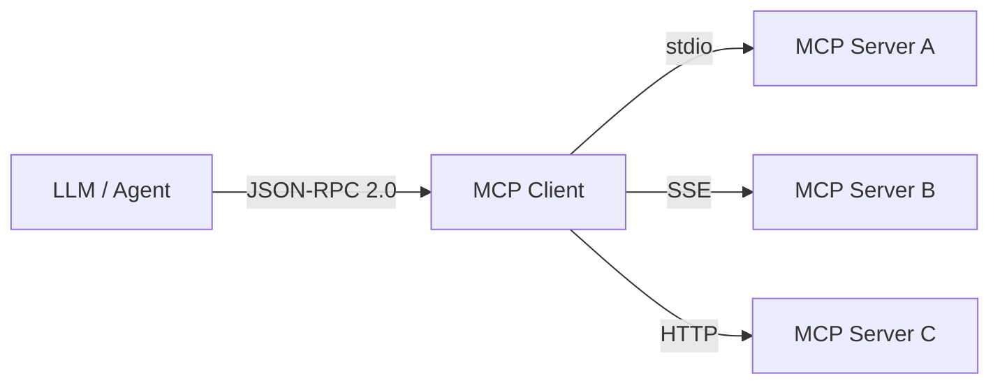
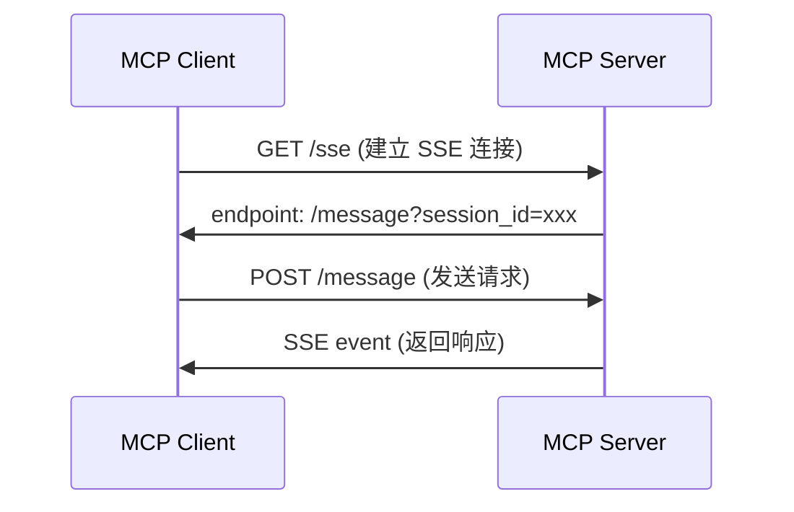
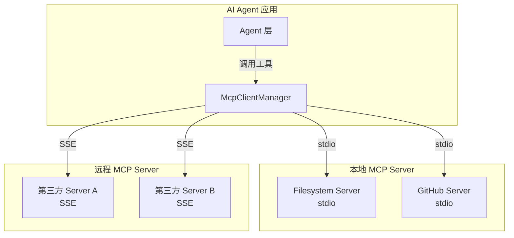

# MCP 协议集成实战

## 概述

**Model Context Protocol（MCP）** 是 AI 时代的「USB-C」接口，由 Anthropic 推出并已进入 Linux Foundation 标准化流程。它标准化了 LLM 与外部工具、数据源之间的通信方式，使得 Agent 能够以统一的方式发现、调用和管理外部能力。

本文档从协议核心规范出发，深入解析三种传输层实现（stdio、SSE、HTTP Streamable），演示自定义 MCP Server 的开发流程，并涵盖错误处理、安全沙箱、调试测试等生产级实践。掌握 MCP 协议是构建可扩展 AI Agent 系统的关键能力。

## 核心内容

### 1. 协议核心规范

MCP 基于 **JSON-RPC 2.0** 消息格式进行通信，采用请求-响应模式，支持标准错误码体系。

**请求消息结构**：

```json
{
  "jsonrpc": "2.0",
  "id": 1,
  "method": "tools/call",
  "params": {
    "name": "read_file",
    "arguments": { "path": "docs/readme.md" }
  }
}
```

**响应消息结构**：

```json
{
  "jsonrpc": "2.0",
  "id": 1,
  "result": {
    "content": [
      { "type": "text", "text": "文件内容..." }
    ]
  }
}
```

**错误消息结构**：

```json
{
  "jsonrpc": "2.0",
  "id": 1,
  "error": {
    "code": -32602,
    "message": "Invalid params: 缺少 path 字段"
  }
}
```

**标准错误码对照表**：

| 错误码 | 含义 | 典型场景 |
|--------|------|---------|
| -32700 | Parse error | JSON 解析失败，请求格式损坏 |
| -32600 | Invalid Request | 非 JSON-RPC 2.0 格式，缺少必要字段 |
| -32601 | Method not found | 调用的方法不存在于 Server 注册表中 |
| -32602 | Invalid params | 参数校验失败，如类型不匹配或缺少必填项 |
| -32603 | Internal error | Server 内部执行异常，建议查看 Server 日志 |

### 2. 传输层实现

MCP 协议支持三种传输层，各有适用场景和权衡。

#### 2.1 stdio（标准输入输出）

stdio 传输通过启动子进程并操作 stdin/stdout 进行通信，是最轻量的传输方式。

**优点**：

- 零网络依赖，本地进程间直接通信
- 天然沙箱隔离，进程边界即为安全边界
- 适合敏感操作（如文件系统访问、本地命令执行）

**缺点**：

- 仅支持单 Client 连接
- 进程管理复杂（需处理崩溃检测、自动重启）

#### 2.2 SSE（Server-Sent Events）

SSE 传输基于 HTTP 长连接，Server 向 Client 推送事件流，Client 通过独立 POST 请求发送命令。

**优点**：

- 支持多 Client 并发连接
- 跨网络、跨机器，防火墙友好
- 适合远程服务、Web 环境和微服务架构

**缺点**：

- 需要网络基础设施和连接保活机制
- 需处理断线重连和会话恢复

SSE Transport MCP Server 示例：

```typescript
// sse-server.ts
import express from 'express';
import { Server } from '@modelcontextprotocol/sdk/server/index.js';
import { SSEServerTransport } from '@modelcontextprotocol/sdk/server/sse.js';
import { CallToolRequestSchema, ListToolsRequestSchema } from '@modelcontextprotocol/sdk/types.js';

const app = express();
const server = new Server(
  { name: 'weather-sse-server', version: '1.0.0' },
  { capabilities: { tools: {} } }
);

server.setRequestHandler(ListToolsRequestSchema, async () => ({
  tools: [
    {
      name: 'get_weather',
      description: '获取指定城市的当前天气',
      inputSchema: {
        type: 'object',
        properties: {
          city: { type: 'string', description: '城市名称（如 Beijing）' },
          units: { type: 'string', enum: ['celsius', 'fahrenheit'], default: 'celsius' },
        },
        required: ['city'],
      },
    },
  ],
}));

server.setRequestHandler(CallToolRequestSchema, async (request) => {
  const { name, arguments: args } = request.params;
  if (name === 'get_weather') {
    const { city, units = 'celsius' } = args as { city: string; units?: string };
    const temp = units === 'celsius' ? 22 : 72;
    return {
      content: [{ type: 'text', text: `${city} 当前温度: ${temp}°${units === 'celsius' ? 'C' : 'F'}` }],
    };
  }
  throw new Error(`Unknown tool: ${name}`);
});

let transport: SSEServerTransport;

app.get('/sse', async (req, res) => {
  transport = new SSEServerTransport('/message', res);
  await server.connect(transport);
});

app.post('/message', async (req, res) => {
  if (transport) {
    await transport.handlePostMessage(req, res);
  } else {
    res.status(400).json({ error: 'No active SSE connection' });
  }
});

app.listen(3000, () => console.log('MCP SSE Server running on http://localhost:3000'));
```

#### 2.3 HTTP Streamable（MCP 2025-03 新增）

HTTP Streamable 传输是无状态的纯 HTTP 通信，每个请求独立处理，无需维护长连接。

**优点**：

- 完全无状态，天然适配 Serverless 函数和负载均衡环境
- 无需 SSE 的会话管理，简化了部署和运维
- 兼容标准 HTTP 中间件（缓存、CDN、WAF）

**适用场景**：Vercel / Cloudflare Workers / AWS Lambda 等无服务器平台。

```typescript
// streamable-server.ts
import { Server } from '@modelcontextprotocol/sdk/server/index.js';
import { StreamableHTTPServerTransport } from '@modelcontextprotocol/sdk/server/streamableHttp.js';
import { CallToolRequestSchema, ListToolsRequestSchema } from '@modelcontextprotocol/sdk/types.js';
import http from 'http';

const server = new Server(
  { name: 'http-server', version: '1.0.0' },
  { capabilities: { tools: {} } }
);

server.setRequestHandler(ListToolsRequestSchema, async () => ({
  tools: [{ name: 'echo', description: 'Echo back the input', inputSchema: { type: 'object', properties: { message: { type: 'string' } }, required: ['message'] } }],
}));

server.setRequestHandler(CallToolRequestSchema, async (request) => {
  const { name, arguments: args } = request.params;
  if (name === 'echo') {
    return { content: [{ type: 'text', text: `Echo: ${(args as { message: string }).message}` }] };
  }
  throw new Error('Unknown tool');
});

const httpServer = http.createServer(async (req, res) => {
  if (req.url === '/mcp' && req.method === 'POST') {
    const transport = new StreamableHTTPServerTransport({ sessionIdGenerator: undefined });
    await server.connect(transport);
    await transport.handleRequest(req, res);
  } else {
    res.writeHead(404).end('Not Found');
  }
});

httpServer.listen(3001, () => console.log('MCP HTTP Server on http://localhost:3001/mcp'));
```

### 3. MCP Client 集成架构

在 AI Agent 应用中，MCP Client 作为工具调用层的中介，负责管理多 Server 连接、工具发现和统一调用。

**工具发现流程**：

```typescript
// 1. 连接 Server
await mcpManager.connectServer({
  name: "filesystem",
  transport: "stdio",
  command: "tsx",
  args: ["mcp-servers/filesystem-server/index.ts"],
});

// 2. 获取所有工具
const tools = mcpManager.getAllTools();
// &#123; server: "filesystem", tool: &#123; name: "read_file", ... &#125; &#125;

// 3. 调用工具
const result = await mcpManager.callTool("filesystem", "read_file", {
  path: "docs/readme.md",
});
```

**带重试的错误处理模式**：

```typescript
class McpClientManager {
  private servers = new Map<string, Client>();

  async callToolWithRetry(
    serverName: string,
    toolName: string,
    args: Record<string, unknown>,
    options: { retries?: number; delayMs?: number } = {}
  ) {
    const { retries = 3, delayMs = 1000 } = options;
    const client = this.servers.get(serverName);
    if (!client) throw new Error(`Server ${serverName} not connected`);

    let lastError: Error;
    for (let attempt = 0; attempt <= retries; attempt++) {
      try {
        const response = await client.callTool({ name: toolName, arguments: args });
        if (response.isError) {
          throw new Error(`Tool error: ${response.content.map(c => (c as { text: string }).text).join('\n')}`);
        }
        return response;
      } catch (err) {
        lastError = err as Error;
        if (attempt < retries) {
          console.warn(`Attempt ${attempt + 1} failed, retrying in ${delayMs}ms...`);
          await new Promise(r => setTimeout(r, delayMs * (attempt + 1)));
        }
      }
    }
    throw lastError!;
  }
}
```

### 4. 开发自定义 MCP Server

#### 4.1 最小实现模板

基于 stdio 传输的最小 MCP Server 只需约 30 行代码：

```typescript
import { Server } from "@modelcontextprotocol/sdk/server/index.js";
import { StdioServerTransport } from "@modelcontextprotocol/sdk/server/stdio.js";
import { CallToolRequestSchema, ListToolsRequestSchema } from "@modelcontextprotocol/sdk/types.js";

const server = new Server(
  { name: "my-server", version: "1.0.0" },
  { capabilities: { tools: {} } }
);

server.setRequestHandler(ListToolsRequestSchema, async () => ({
  tools: [
    {
      name: "hello",
      description: "Say hello",
      inputSchema: {
        type: "object",
        properties: { name: { type: "string" } },
        required: ["name"],
      },
    },
  ],
}));

server.setRequestHandler(CallToolRequestSchema, async (request) => {
  const { name, arguments: args } = request.params;
  if (name === "hello") {
    return {
      content: [{ type: "text", text: `Hello, ${(args as { name: string }).name}!` }],
    };
  }
  throw new Error("Unknown tool");
});

const transport = new StdioServerTransport();
await server.connect(transport);
```

#### 4.2 Resources 与 Prompts 能力扩展

除了 Tools，MCP Server 还可暴露 Resources（只读数据）和 Prompts（可复用模板）：

```typescript
const server = new Server(
  { name: 'knowledge-base', version: '1.0.0' },
  {
    capabilities: {
      tools: {},
      resources: {},
      prompts: {},
    },
  }
);

// 暴露资源列表
server.setRequestHandler(ListResourcesRequestSchema, async () => ({
  resources: [
    { uri: 'docs://api-reference', name: 'API Reference', mimeType: 'text/markdown' },
    { uri: 'docs://changelog', name: 'Changelog', mimeType: 'text/markdown' },
  ],
}));

// 读取资源内容
server.setRequestHandler(ReadResourceRequestSchema, async (request) => {
  const { uri } = request.params;
  if (uri === 'docs://api-reference') {
    return {
      contents: [{ uri, mimeType: 'text/markdown', text: '# API Reference\n...' }],
    };
  }
  throw new Error(`Resource not found: ${uri}`);
});

// 暴露提示模板
server.setRequestHandler(ListPromptsRequestSchema, async () => ({
  prompts: [
    {
      name: 'code-review',
      description: '对代码变更进行审查',
      arguments: [
        { name: 'diff', description: 'Git diff 内容', required: true },
        { name: 'language', description: '编程语言', required: false },
      ],
    },
  ],
}));

server.setRequestHandler(GetPromptRequestSchema, async (request) => {
  const { name, arguments: args } = request.params;
  if (name === 'code-review') {
    return {
      messages: [
        {
          role: 'user',
          content: {
            type: 'text',
            text: `请审查以下 ${args?.language || ''} 代码变更：\n\n${args?.diff}`,
          },
        },
      ],
    };
  }
  throw new Error(`Prompt not found: ${name}`);
});
```

#### 4.3 安全最佳实践

生产级 MCP Server 必须遵循以下安全准则：

1. **输入校验**：严格校验工具参数，防止注入攻击和路径遍历
2. **路径沙箱**：文件系统操作限制在安全根目录内，禁止越界访问
3. **最小权限**：Server 仅暴露必要的工具与资源，关闭未使用的能力
4. **错误隐藏**：生产环境不暴露内部错误堆栈，避免信息泄露
5. **审计日志**：记录所有工具调用、调用者身份和参数详情

**路径沙箱实现示例**：

```typescript
import { resolve, relative, isAbsolute } from 'path';

class SafeFileSystem {
  private root: string;

  constructor(rootDir: string) {
    this.root = resolve(rootDir);
  }

  private sanitizePath(requestedPath: string): string {
    const target = isAbsolute(requestedPath)
      ? resolve(requestedPath)
      : resolve(this.root, requestedPath);

    const rel = relative(this.root, target);
    if (rel.startsWith('..') || rel === '..') {
      throw new Error('Access denied: path outside sandbox');
    }
    return target;
  }

  readFile(path: string): string {
    const safePath = this.sanitizePath(path);
    return `Contents of ${safePath}`;
  }
}
```

### 5. 调试与测试

#### 5.1 MCP Inspector

MCP Inspector 是官方提供的可视化调试工具，支持交互式测试工具调用：

```bash
npx @modelcontextprotocol/inspector tsx mcp-servers/filesystem-server/index.ts
```

#### 5.2 手动测试 stdio Server

```bash
# 启动 Server 并获取工具列表
echo '{"jsonrpc":"2.0","id":1,"method":"tools/list"}' | \
  tsx mcp-servers/filesystem-server/index.ts

# 测试工具调用
echo '{"jsonrpc":"2.0","id":2,"method":"tools/call","params":{"name":"read_file","arguments":{"path":"package.json"}}}' | \
  tsx mcp-servers/filesystem-server/index.ts
```

#### 5.3 日志级别控制

```bash
# 开发环境开启详细日志
DEBUG=mcp:* npm run dev

# 仅查看 SDK 日志
DEBUG=mcp:sdk npm run dev
```

#### 5.4 单元测试 MCP Server

使用 `InMemoryTransport` 可在测试环境中绕过真实进程/网络通信：

```typescript
// tests/hello-server.test.ts
import { Client } from '@modelcontextprotocol/sdk/client/index.js';
import { InMemoryTransport } from '@modelcontextprotocol/sdk/inMemory.js';
import { createHelloServer } from '../src/hello-server';

describe('Hello MCP Server', () => {
  it('should list available tools', async () => {
    const server = createHelloServer();
    const [clientTransport, serverTransport] = InMemoryTransport.createLinkedPair();

    await Promise.all([
      server.connect(serverTransport),
      new Client({ name: 'test-client', version: '1.0.0' }).connect(clientTransport),
    ]);

    const tools = await client.listTools();
    expect(tools.tools).toHaveLength(1);
    expect(tools.tools[0].name).toBe('hello');
  });
});
```

## Mermaid 图表

### MCP 协议架构概览



### stdio 传输时序图

```mermaid
sequenceDiagram
    participant Client as MCP Client
    participant Process as Server Process

    Client->>Process: 启动子进程
    Client->>Process: &#123;"jsonrpc":"2.0",...&#125; (stdin)
    Process->>Client: &#123;"jsonrpc":"2.0",...&#125; (stdout)
    Client->>Process: 关闭 stdin
    Process->>Client: 进程退出
```



### SSE 传输时序图



### 本项目 MCP 集成架构



## 最佳实践总结

1. **根据部署环境选择传输层**：本地开发优先 stdio，远程服务使用 SSE，Serverless 场景选择 HTTP Streamable。不要在无状态环境中强行使用 SSE 长连接。

2. **工具 Schema 设计追求自描述**：`inputSchema` 应包含字段的 `description`、`type`、`enum` 和 `default`，让 LLM 能自主理解如何正确调用工具，减少调用失败率。

3. **Client 侧实现重试与熔断**：MCP Server 可能因网络抖动或进程重启而暂时不可用，Client 应实现指数退避重试，并对连续失败的 Server 进行熔断，避免级联故障。

4. **Server 侧严格实施沙箱隔离**：尤其是文件系统和命令执行类工具，必须通过路径解析校验将操作限制在授权目录内，防止路径遍历攻击。

5. **利用 InMemoryTransport 进行单元测试**：在测试环境中使用内存传输替代真实进程/网络，可大幅提升测试速度和稳定性，同时避免测试间的端口冲突。

6. **启用 MCP Inspector 进行交互式调试**：在开发阶段使用 Inspector 可视化地测试工具调用，验证 Schema 设计和错误处理逻辑，显著缩短调试周期。

## 参考资源

- [MCP Specification](https://modelcontextprotocol.io/specification/2025-03-26) — MCP 官方协议规范（2025-03-26 版本），涵盖完整的消息格式与生命周期定义
- [MCP SDK for TypeScript](https://github.com/modelcontextprotocol/typescript-sdk) — 官方 TypeScript SDK 源码，包含 Client、Server 和 Transport 实现
- [MCP Inspector](https://github.com/modelcontextprotocol/inspector) — 可视化调试工具，支持交互式工具测试和日志查看
- [MCP Server 生态](https://github.com/modelcontextprotocol/servers) — 官方维护的 Server 集合，涵盖文件系统、GitHub、Slack 等常用工具
- [Anthropic MCP 公告](https://www.anthropic.com/news/model-context-protocol) — MCP 协议最初发布的官方博客文章
- [MCP on Linux Foundation](https://www.linuxfoundation.org/press/linux-foundation-announces-model-context-protocol-as-a-standards-project) — MCP 进入 Linux Foundation 作为标准项目的公告
- [Vercel AI SDK MCP 集成](https://sdk.vercel.ai/docs/ai-sdk-core/tools-and-tool-calling#model-context-protocol-mcp-tools) — AI SDK 中的 MCP 工具调用支持文档
- [JSON-RPC 2.0 Specification](https://www.jsonrpc.org/specification) — MCP 底层通信协议规范
