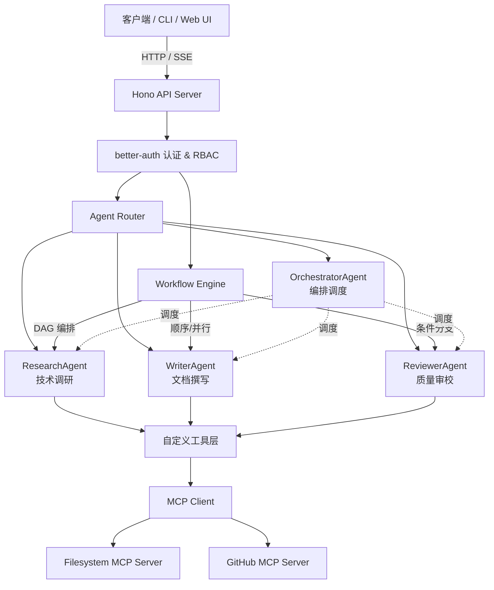
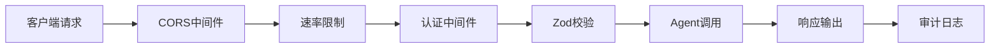

# AI Agent 生产级开发教程

## 概述

本教程带你从零搭建一个**可部署的 AI Agent 生产级系统**。系统模拟真实研发团队工作流：研究员收集信息、写手撰写文档、审校员把关质量、编排器协调全局。核心技术栈包括 **Mastra**（Agent 框架）、**Vercel AI SDK v6**（统一模型接入）、**MCP**（工具标准化协议）、**Hono**（边缘 API 框架）和 **better-auth**（认证授权）。

完成本教程后，你将能够：理解 AI Agent 的核心架构设计模式；掌握 MCP 协议的原理与 TypeScript 实现；使用 Mastra 定义 Agent、开发工具与编排工作流；构建具备认证、限流、错误处理的生产级 API；将系统部署到 Cloudflare Workers、Vercel 或 Docker 环境。

## 核心内容

### 1. 系统架构与技术栈



| 层级 | 技术 | 版本 | 用途 |
|------|------|------|------|
| **Agent 框架** | Mastra | ^0.6.0 | Agent 定义、工作流引擎、记忆层 |
| **AI SDK** | Vercel AI SDK v6 | ^4.2.0 | 统一模型接入、流式输出、工具调用 |
| **协议** | MCP | ^1.7.0 | 模型上下文协议，工具标准化 |
| **API 框架** | Hono | ^4.7.0 | 边缘运行时友好的 HTTP 框架 |
| **认证** | better-auth | ^1.2.0 | OAuth、Session、RBAC |
| **ORM** | Drizzle ORM | ^0.40.0 | 类型安全的数据库操作 |
| **数据库** | SQLite / PostgreSQL / D1 | — | 数据持久化 |
| **测试** | Vitest | ^3.0.0 | 单元测试与集成测试 |
| **部署** | Cloudflare Workers / Node.js / Docker | — | 多平台部署 |

### 2. 环境准备

Node.js 版本需 ≥ 20.0.0：

```bash
node -v
nvm install 20 && nvm use 20

cd examples/ai-agent-production
npm install
cp .env.example .env
```

配置 `.env` 文件，填入至少一个 AI 提供商的 API Key：

```env
# OpenAI（推荐用于生产）
OPENAI_API_KEY=sk-xxxxxxxxxxxxxxxxxxxxxxxx

# Anthropic Claude
ANTHROPIC_API_KEY=sk-ant-xxxxxxxxxxxxxxxx

# DeepSeek（性价比高，适合开发环境）
DEEPSEEK_API_KEY=sk-xxxxxxxxxxxxxxxx

# 可选：Langfuse 观测平台
LANGFUSE_PUBLIC_KEY=pk-xxxxxxxx
LANGFUSE_SECRET_KEY=sk-xxxxxxxx
LANGFUSE_BASE_URL=https://cloud.langfuse.com

# MCP Server 配置
MCP_FS_ROOT=./safe-workspace
GITHUB_TOKEN=ghp_xxxxxxxxxxxxxxxx
```

初始化数据库：

```bash
npm run db:migrate
npm run db:studio   # 可选：可视化查看数据
```

> **提示**：开发环境可使用 DeepSeek 等性价比更高的模型，生产环境建议使用 GPT-4o 或 Claude 3.5 Sonnet。

### 3. MCP Server 搭建

MCP（Model Context Protocol）标准化了 AI 模型与外部工具的交互。核心概念包括：Server（提供 Tools/Resources/Prompts）、Client（连接 Server 并调用工具）、Transport（stdio 或 SSE 通信层）。

#### 3.1 本地 Filesystem MCP Server

```typescript
// mcp-servers/filesystem-server/index.ts
import { Server } from "@modelcontextprotocol/sdk/server/index.js";
import { StdioServerTransport } from "@modelcontextprotocol/sdk/server/stdio.js";

const server = new Server(
  { name: "filesystem-server", version: "1.0.0" },
  { capabilities: { tools: {} } }
);

server.setRequestHandler("tools/list", async () => ({
  tools: [
    {
      name: "read-file",
      description: "读取文件内容",
      inputSchema: {
        type: "object",
        properties: { path: { type: "string", description: "文件路径" } },
        required: ["path"],
      },
    },
    {
      name: "write-file",
      description: "写入文件内容",
      inputSchema: {
        type: "object",
        properties: { path: { type: "string" }, content: { type: "string" } },
        required: ["path", "content"],
      },
    },
  ],
}));

server.setRequestHandler("tools/call", async (request) => {
  const { name, arguments: args } = request.params;
  switch (name) {
    case "read-file": {
      const content = await fs.readFile(args.path, "utf-8");
      return { content: [{ type: "text", text: content }] };
    }
    case "write-file": {
      await fs.writeFile(args.path, args.content);
      return { content: [{ type: "text", text: "写入成功" }] };
    }
    default:
      throw new Error(`未知工具: ${name}`);
  }
});

const transport = new StdioServerTransport();
await server.connect(transport);
```

#### 3.2 MCP Client 封装

```typescript
// src/lib/mcp-client.ts
import { Client } from "@modelcontextprotocol/sdk/client/index.js";
import { StdioClientTransport } from "@modelcontextprotocol/sdk/client/stdio.js";
import { SSEClientTransport } from "@modelcontextprotocol/sdk/client/sse.js";

export interface McpServerConfig {
  name: string;
  transport: "stdio" | "sse";
  command?: string;
  args?: string[];
  url?: string;
}

export class McpClientManager {
  private clients = new Map<string, Client>();
  private toolsCache = new Map<string, Tool[]>();

  async connectServer(config: McpServerConfig): Promise<void> {
    const transport = config.transport === "stdio"
      ? new StdioClientTransport({ command: config.command!, args: config.args ?? [] })
      : new SSEClientTransport(new URL(config.url!));

    const client = new Client(
      { name: "ai-agent-client", version: "1.0.0" },
      { capabilities: { tools: {}, resources: {}, prompts: {} } }
    );
    await client.connect(transport);
    this.clients.set(config.name, client);

    const tools = await client.listTools().then((r) => r.tools);
    this.toolsCache.set(config.name, tools);
    console.log(`[MCP] 已连接 Server: ${config.name}`);
  }

  async callTool(serverName: string, toolName: string, args: Record<string, unknown>) {
    const client = this.clients.get(serverName);
    if (!client) throw new Error(`MCP Server 未找到: ${serverName}`);
    return client.callTool({ name: toolName, arguments: args });
  }

  getAllTools() {
    const result: Array<{ server: string; tool: Tool }> = [];
    for (const [server, tools] of this.toolsCache) {
      for (const tool of tools) result.push({ server, tool });
    }
    return result;
  }
}

export const mcpManager = new McpClientManager();
```

### 4. Agent 定义与编排

#### 4.1 研究员 Agent

```typescript
// src/mastra/agents/researcher.ts
import { Agent } from "@mastra/core/agent";
import { getDefaultModelInstance } from "../../lib/ai-sdk.js";
import { webSearchTool, fetchPageTool } from "../tools/web-search.js";

export const researchAgent = new Agent({
  name: "ResearchAgent",
  instructions: `
你是一位资深技术研究员，专注于为研发团队提供高质量的技术调研报告。

## 角色定位
- 深入理解技术主题的背景、原理与生态
- 善于从多个来源交叉验证信息的准确性
- 输出结构化、可引用的调研结果

## 行为准则
1. 每次调研前，先使用 web-search 工具收集最新资料
2. 对关键信息来源使用 fetch-page 工具获取详细内容
3. 调研报告必须包含：背景概述、核心概念、主流方案对比、实践建议
4. 所有结论需标注信息来源（URL）
5. 若信息存在冲突，需列出不同观点并说明倾向性理由

## 输出规范
- 使用 Markdown 格式，标题层级不超过 3 级
- 关键术语首次出现时需加粗
- 代码示例使用 TypeScript 语法
`,
  model: getDefaultModelInstance(),
  tools: { webSearch: webSearchTool, fetchPage: fetchPageTool },
});
```

#### 4.2 写手与审校 Agent

```typescript
// src/mastra/agents/writer.ts
import { Agent } from "@mastra/core/agent";
import { getDefaultModelInstance } from "../../lib/ai-sdk.js";
import { writeFileTool } from "../tools/file-system.js";

export const writerAgent = new Agent({
  name: "WriterAgent",
  instructions: `
你是一位技术文档工程师，擅长将复杂的技术概念转化为清晰、准确的文档。
行为准则：收到研究资料后先梳理大纲；使用 write-file 工具写入指定路径；
所有代码示例必须经过语法检查；保持术语和格式风格一致。
`,
  model: getDefaultModelInstance(),
  tools: { writeFile: writeFileTool },
});
```

```typescript
// src/mastra/agents/reviewer.ts
import { Agent } from "@mastra/core/agent";
import { getDefaultModelInstance } from "../../lib/ai-sdk.js";
import { readFileTool, analyzeCodeTool } from "../tools/code-analyzer.js";

export const reviewerAgent = new Agent({
  name: "ReviewerAgent",
  instructions: `
你是一位技术文档审校专家，负责把关文档质量。
审校维度：准确性、完整性、可读性、一致性。
输出结构化审查报告，包含总体评分（1-10）、通过项、建议项、阻塞项。
`,
  model: getDefaultModelInstance(),
  tools: { readFile: readFileTool, analyzeCode: analyzeCodeTool },
});
```

#### 4.3 编排器 Agent 与 Mastra 全局配置

```typescript
// src/mastra/agents/orchestrator.ts
import { Agent } from "@mastra/core/agent";
import { getDefaultModelInstance } from "../../lib/ai-sdk.js";

export const orchestratorAgent = new Agent({
  name: "OrchestratorAgent",
  instructions: `
你是智能研发团队的「项目经理」，协调研究员、写手与审校员的高效协作。
决策规则：信息收集 → ResearchAgent；内容生成 → WriterAgent；
质量把关 → ReviewerAgent；多阶段复杂任务 → 组合为工作流。
异常处理：网络超时指数退避重试 3 次；工具调用失败记录日志并尝试替代方案；
不可恢复错误终止工作流并通知人工。
`,
  model: getDefaultModelInstance(),
  tools: {},
});
```

```typescript
// mastra.config.ts
import { Mastra } from "@mastra/core";
import { createLogger } from "@mastra/core/logger";

import { researchAgent, writerAgent, reviewerAgent, orchestratorAgent } from "./src/mastra/agents";
import { techDocWorkflow, codeReviewWorkflow } from "./src/mastra/workflows";

export const mastra = new Mastra({
  agents: { researcher: researchAgent, writer: writerAgent, reviewer: reviewerAgent, orchestrator: orchestratorAgent },
  workflows: { techDoc: techDocWorkflow, codeReview: codeReviewWorkflow },
  logger: createLogger({
    name: "ai-agent-production",
    level: process.env.NODE_ENV === "production" ? "info" : "debug",
  }),
});
```

### 5. 多 Agent 工作流编排

```typescript
// src/mastra/workflows/tech-doc-workflow.ts
import { Workflow } from "@mastra/core/workflows";
import { z } from "zod";

export const techDocWorkflow = new Workflow({
  name: "tech-doc-workflow",
  triggerSchema: z.object({
    topic: z.string().describe("技术主题"),
    outputPath: z.string().describe("文档输出路径"),
    maxRetries: z.number().int().min(0).max(3).default(2),
  }),
})
  .step("research", {
    execute: async ({ context, mastra }) => {
      const agent = mastra.getAgent("researcher");
      const result = await agent.generate(`请对 "${context.triggerData.topic}" 进行全面技术调研。`);
      return { researchNotes: result.text, topic: context.triggerData.topic };
    },
  })
  .step("write", {
    execute: async ({ context, mastra }) => {
      const agent = mastra.getAgent("writer");
      const notes = context.getStepResult<{ researchNotes: string }>("research")?.researchNotes ?? "";
      const result = await agent.generate(
        `基于以下调研资料撰写技术文档。\n\n${notes}\n\n将文档写入: ${context.triggerData.outputPath}`
      );
      return { draftContent: result.text, outputPath: context.triggerData.outputPath };
    },
  })
  .step("review", {
    execute: async ({ context, mastra }) => {
      const agent = mastra.getAgent("reviewer");
      const outputPath = context.getStepResult<{ outputPath: string }>("write")?.outputPath ?? "";
      const result = await agent.generate(`请审查文件 "${outputPath}" 中的技术文档质量。`);
      return { reviewReport: result.text, passed: !result.text.includes("阻塞项") };
    },
  })
  .if(
    ({ context }) => context.getStepResult<{ passed: boolean }>("review")?.passed === false,
    (workflow) =>
      workflow.step("rewrite", {
        execute: async ({ context, mastra }) => {
          const agent = mastra.getAgent("writer");
          const report = context.getStepResult<{ reviewReport: string }>("review")?.reviewReport ?? "";
          const result = await agent.generate(`根据审查意见修改文档:\n\n${report}`);
          return { rewritten: true, draftContent: result.text };
        },
      })
  )
  .step("finalize", {
    execute: async ({ context }) => {
      const review = context.getStepResult<{ passed: boolean }>("review");
      return { success: review?.passed ?? false, topic: context.triggerData.topic };
    },
  });

techDocWorkflow.commit();
```

### 6. Hono API 服务器

#### 6.1 服务器入口

```typescript
// src/server/index.ts
import { Hono } from "hono";
import { logger } from "hono/logger";
import { cors } from "hono/cors";
import { HTTPException } from "hono/http-exception";

import { authMiddleware } from "./middleware/auth.js";
import { rateLimit } from "./middleware/rate-limit.js";
import agentsRoutes from "./routes/agents.js";
import workflowsRoutes from "./routes/workflows.js";
import mcpRoutes from "./routes/mcp.js";

const app = new Hono();

app.use(logger());
app.use(cors({
  origin: process.env.NODE_ENV === "production" ? ["https://your-domain.com"] : "*",
  allowMethods: ["GET", "POST", "PUT", "DELETE", "OPTIONS"],
  allowHeaders: ["Content-Type", "Authorization", "X-Requested-With"],
  credentials: true,
}));
app.use(rateLimit({ windowMs: 60_000, maxRequests: 120 }));
app.use(authMiddleware);

app.get("/health", (c) => c.json({ status: "ok", timestamp: new Date().toISOString(), version: "1.0.0" }));

app.route("/api/agents", agentsRoutes);
app.route("/api/workflows", workflowsRoutes);
app.route("/api/mcp", mcpRoutes);

app.onError((err, c) => {
  console.error("[Error]", err);
  if (err instanceof HTTPException) {
    return c.json({ success: false, error: err.message, status: err.status }, err.status);
  }
  return c.json({ success: false, error: process.env.NODE_ENV === "production" ? "服务器内部错误" : err.message }, 500);
});

app.notFound((c) => c.json({ success: false, error: "接口不存在" }, 404));

const port = Number(process.env.PORT ?? 3000);
if (import.meta.url.startsWith("file://") && process.argv[1]) {
  const { serve } = await import("@hono/node-server");
  serve({ fetch: app.fetch, port });
  console.log(`Server running at http://localhost:${port}`);
}

export default app;
```

#### 6.2 Agent 调用路由

```typescript
// src/server/routes/agents.ts
import { Hono } from "hono";
import { zValidator } from "@hono/zod-validator";
import { z } from "zod";
import { mastra } from "../../../mastra.config.js";
import { requireAuth, requireRole } from "../middleware/auth.js";
import { rateLimit } from "../middleware/rate-limit.js";

const app = new Hono();

const invokeSchema = z.object({
  agent: z.enum(["researcher", "writer", "reviewer", "orchestrator"]),
  prompt: z.string().min(1).max(10000),
  stream: z.boolean().default(false),
  options: z.object({
    maxTokens: z.number().int().min(1).max(8192).optional(),
    temperature: z.number().min(0).max(2).optional(),
  }).optional(),
});

app.get("/", (c) => {
  return c.json({
    agents: [
      { name: "researcher", description: "技术研究员：收集信息、检索数据、分析背景" },
      { name: "writer", description: "技术写手：基于研究资料撰写文档" },
      { name: "reviewer", description: "审校专家：审查文档与代码质量" },
      { name: "orchestrator", description: "编排器：协调多 Agent 协作" },
    ],
  });
});

// 非流式调用
app.post("/invoke", requireAuth, requireRole("admin", "developer"),
  rateLimit({ windowMs: 60_000, maxRequests: 30 }),
  zValidator("json", invokeSchema),
  async (c) => {
    const body = c.req.valid("json");
    const agent = mastra.getAgent(body.agent);
    const start = performance.now();
    const result = await agent.generate(body.prompt, {
      maxTokens: body.options?.maxTokens,
      temperature: body.options?.temperature,
    });
    return c.json({ success: true, agent: body.agent, output: result.text, usage: result.usage, latencyMs: Math.round(performance.now() - start) });
  }
);

// SSE 流式调用
app.post("/invoke/stream", requireAuth, requireRole("admin", "developer"),
  rateLimit({ windowMs: 60_000, maxRequests: 20 }),
  zValidator("json", invokeSchema.omit({ stream: true })),
  async (c) => {
    const body = c.req.valid("json");
    const agent = mastra.getAgent(body.agent);
    const stream = await agent.stream(body.prompt, {
      maxTokens: body.options?.maxTokens,
      temperature: body.options?.temperature,
    });

    c.header("Content-Type", "text/event-stream");
    c.header("Cache-Control", "no-cache");
    c.header("Connection", "keep-alive");

    return new Response(new ReadableStream({
      async start(controller) {
        try {
          for await (const chunk of stream.textStream) {
            controller.enqueue(new TextEncoder().encode(`data: ${JSON.stringify({ chunk })}\n\n`));
          }
          controller.enqueue(new TextEncoder().encode(`data: ${JSON.stringify({ done: true })}\n\n`));
          controller.close();
        } catch (err) {
          const message = err instanceof Error ? err.message : String(err);
          controller.enqueue(new TextEncoder().encode(`data: ${JSON.stringify({ error: message })}\n\n`));
          controller.close();
        }
      },
    }));
  }
);

export default app;
```

### 7. 部署指南

#### 7.1 本地部署

```bash
# 方式 1：同时启动 Hono + MCP Servers
npm run dev

# 方式 2：多进程分别启动
npm run mcp:filesystem   # 终端 1
npm run mcp:github       # 终端 2
npm run dev              # 终端 3
```

#### 7.2 Vercel 部署

```bash
npm i -g vercel && vercel login
vercel        # 开发环境
vercel --prod # 生产环境
```

> **注意**：Vercel Serverless Functions 有执行时间限制（免费版 10 秒，Hobby 版 60 秒），长时间运行的 Agent 调用建议使用流式输出或迁移到专用服务器。

#### 7.3 Docker 部署

```dockerfile
FROM node:20-alpine
WORKDIR /app
COPY package*.json ./
RUN npm ci --only=production
COPY . .
RUN npm run build
EXPOSE 3000
CMD ["node", "dist/server/index.js"]
```

```bash
docker build -t ai-agent-production .
docker run -p 3000:3000 --env-file .env ai-agent-production
```

#### 7.4 Cloudflare Workers 部署

```bash
npm i -g wrangler
wrangler login
wrangler deploy
```

### 8. 监控与调试

#### 8.1 Langfuse 集成

```typescript
// src/lib/ai-sdk.ts
import { generateText } from "ai";
import { openai } from "@ai-sdk/openai";
import { Langfuse } from "langfuse";

const langfuse = new Langfuse({
  publicKey: process.env.LANGFUSE_PUBLIC_KEY!,
  secretKey: process.env.LANGFUSE_SECRET_KEY!,
  baseUrl: process.env.LANGFUSE_BASE_URL!,
});

export async function tracedGenerate(prompt: string, options?: any) {
  const trace = langfuse.trace({ name: "agent-generate", input: prompt });
  const span = trace.span({ name: "llm-call" });

  try {
    const result = await generateText({ model: openai("gpt-4o"), prompt, ...options });
    span.end({ output: result.text, usage: result.usage });
    return result;
  } catch (error) {
    span.end({ error: String(error) });
    throw error;
  }
}
```

#### 8.2 调试技巧

```bash
# 健康检查
curl http://localhost:3000/health

# 运行全部测试
npm test

# 单独测试 Agent / 工作流
npx vitest run tests/agents/researcher.test.ts
npx vitest run tests/workflows/tech-doc-workflow.test.ts
```

### 9. 进阶扩展

#### 9.1 自定义工具开发

```typescript
// src/mastra/tools/custom-api.ts
import { createTool } from "@mastra/core/tools";
import { z } from "zod";

export const weatherTool = createTool({
  id: "get-weather",
  description: "获取指定城市的天气信息",
  inputSchema: z.object({
    city: z.string().describe("城市名称"),
    date: z.string().optional().describe("日期，格式 YYYY-MM-DD"),
  }),
  execute: async ({ context }) => {
    const response = await fetch(
      `https://api.weather.com/v1/current?city=${encodeURIComponent(context.city)}`
    );
    return response.json();
  },
});
```

#### 9.2 记忆层与多模型 Fallback

```typescript
// mastra.config.ts
export const mastra = new Mastra({
  agents: { /* ... */ },
  workflows: { /* ... */ },
  memory: {
    storage: process.env.NODE_ENV === "production"
      ? new PostgresStorage({ connectionString: process.env.DATABASE_URL })
      : new MemoryStorage(),
  },
});

// src/lib/ai-sdk.ts
import { openai } from "@ai-sdk/openai";
import { anthropic } from "@ai-sdk/anthropic";

export function getDefaultModelInstance() {
  const provider = process.env.DEFAULT_MODEL_PROVIDER ?? "openai";
  return provider === "anthropic"
    ? anthropic("claude-3-5-sonnet-20241022")
    : openai("gpt-4o");
}
```

## Mermaid 图表

### Agent 协作时序图

```mermaid
sequenceDiagram
    participant User
    participant Hono
    participant WF as Workflow Engine
    participant R as ResearchAgent
    participant W as WriterAgent
    participant V as ReviewerAgent

    User->>Hono: POST /api/workflows/techDoc/start
    Hono->>WF: execute(triggerData)

    WF->>R: Step 1: research
    R-->>WF: researchNotes

    WF->>W: Step 2: write (依赖 research)
    W-->>WF: draftContent

    WF->>V: Step 3: review (依赖 write)
    V-->>WF: reviewReport + passed?

    alt passed == false
        WF->>W: Step 3b: rewrite (条件分支)
        W-->>WF: revisedContent
    end

    WF->>WF: Step 4: finalize
    WF-->>Hono: 执行完成
    Hono-->>User: &#123; runId, status &#125;
```



### API 请求处理流程



## 最佳实践总结

1. **Agent 提示词工程是核心资产**：为每个 Agent 编写详尽的 `instructions`，包含角色定位、行为准则、输出规范和异常处理策略。提示词质量直接决定 Agent 输出的可靠性和一致性。

2. **工作流使用显式依赖与条件分支**：通过 `dependsOn` 声明步骤间的数据依赖，使用 `.if()` 实现条件分支。避免隐式状态共享，确保工作流执行的可预测性和可调试性。

3. **API 层实施多层防御**：CORS + 速率限制 + OAuth 认证 + RBAC 授权 + Zod 校验构成五层防御体系。生产环境务必开启所有安全中间件，切勿仅依赖边缘网关。

4. **流式输出优化长时任务体验**：Agent 推理可能耗时数十秒，使用 SSE 流式传输实时返回 Token，避免客户端超时。同时在前端设计加载状态和进度指示器。

5. **工具 Schema 追求自描述**：为每个工具参数提供 `description`、`type` 和 `enum`，让 LLM 能自主选择正确的工具并填充有效参数，减少工具调用失败率。

6. **多环境配置隔离**：使用 `.env` 文件区分开发、测试和生产环境。敏感配置（API Key、数据库密码）绝不硬编码，通过环境变量注入。

7. **观测先行于部署**：在正式部署前集成 Langfuse 或同类可观测性平台，建立 Token 消耗、延迟和错误率的基线，便于后续性能优化和成本控制。

## 参考资源

- [Mastra Documentation](https://mastra.ai/docs) — Mastra AI Agent 框架官方文档，涵盖 Agent、Workflow 和 Memory API
- [Vercel AI SDK Documentation](https://sdk.vercel.ai/docs) — 统一模型接入 SDK，支持流式生成、工具调用和结构化输出
- [Model Context Protocol Specification](https://modelcontextprotocol.io/) — MCP 协议规范与 SDK 文档
- [Hono Documentation](https://hono.dev/) — 边缘优先 Web 框架，支持多运行时部署
- [better-auth Documentation](https://www.better-auth.com/) — 类型安全认证库，支持 OAuth 2.0 和 RBAC
- [Anthropic MCP 公告](https://www.anthropic.com/news/model-context-protocol) — MCP 协议最初发布的官方博客
- [Langfuse Documentation](https://langfuse.com/docs) — 开源 LLM 可观测性平台，支持追踪、评估和提示词管理
