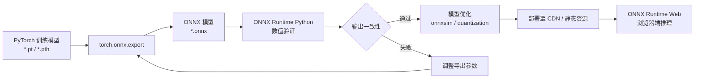
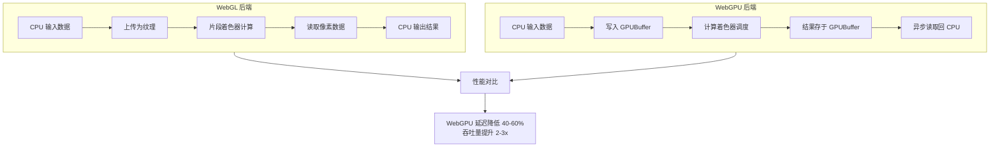

# AI/ML 推理示例总览

人工智能与机器学习的浪潮正在深刻重塑前端开发的边界。从客户端实时图像分类、自然语言处理到浏览器端的大型语言模型推理，JavaScript/TypeScript 生态系统已经不再仅仅是 AI 应用的展示层，而是逐渐成为模型推理的直接执行环境。这一转变的背后，是 WebAssembly、WebGPU、WebGL 等浏览器技术的成熟，以及 ONNX Runtime Web、TensorFlow.js、Transformers.js 等专用推理框架的快速发展。

本文档系统梳理了在 JS/TS 生态中进行 AI/ML 推理的完整技术栈，重点关注浏览器端和边缘运行时的模型部署、硬件加速利用、性能优化策略，以及与 AI 编码工作流的深度集成。无论你是希望为 Web 应用添加智能功能的前端开发者，还是探索边缘 AI 部署方案的全栈工程师，这里都将提供经过生产环境验证的实践指南。

## 目录

- [AI/ML 推理示例总览](#aiml-推理示例总览)
  - [目录](#目录)
  - [浏览器端 AI 推理的技术演进](#浏览器端-ai-推理的技术演进)
    - [三次技术跃迁](#三次技术跃迁)
    - [客户端推理的核心价值](#客户端推理的核心价值)
  - [推理运行时与框架选型](#推理运行时与框架选型)
    - [ONNX Runtime Web](#onnx-runtime-web)
    - [TensorFlow.js](#tensorflowjs)
    - [Transformers.js](#transformersjs)
    - [选型决策矩阵](#选型决策矩阵)
  - [ONNX Runtime Web 深度集成](#onnx-runtime-web-深度集成)
    - [模型导出与验证](#模型导出与验证)
    - [浏览器端加载策略](#浏览器端加载策略)
    - [会话配置与后端选择](#会话配置与后端选择)
  - [硬件加速：从 WebGL 到 WebGPU](#硬件加速从-webgl-到-webgpu)
    - [WebGL 后端的原理与局限](#webgl-后端的原理与局限)
    - [WebGPU 的革命性改进](#webgpu-的革命性改进)
    - [Wasm SIMD 作为兜底方案](#wasm-simd-作为兜底方案)
  - [模型优化与量化策略](#模型优化与量化策略)
    - [模型压缩技术栈](#模型压缩技术栈)
    - [量化技术详解](#量化技术详解)
  - [边缘部署与隐私计算](#边缘部署与隐私计算)
    - [边缘函数与 Wasm 运行时](#边缘函数与-wasm-运行时)
    - [联邦学习与本地训练](#联邦学习与本地训练)
  - [AI 编码工作流专题映射](#ai-编码工作流专题映射)
  - [生产环境最佳实践](#生产环境最佳实践)
    - [模型版本管理与灰度发布](#模型版本管理与灰度发布)
    - [资源加载与用户体验](#资源加载与用户体验)
    - [错误处理与模型失效](#错误处理与模型失效)
  - [相关示例与延伸阅读](#相关示例与延伸阅读)
    - [本目录示例](#本目录示例)
    - [跨专题关联](#跨专题关联)
  - [参考与引用](#参考与引用)

---

## 浏览器端 AI 推理的技术演进

将机器学习模型部署到浏览器端执行，这一构想早在十年前就已出现，但直到最近几年才真正具备生产可行性。早期的尝试主要依赖服务器端推理配合前端展示，或将极其简化的模型通过 JavaScript 手工实现。如今，得益于底层技术的突破，浏览器已经能够直接运行由 PyTorch、TensorFlow 等主流框架训练出的复杂模型。

### 三次技术跃迁

**第一次跃迁：WebGL 加速**。2015 年前后，deeplearn.js（TensorFlow.js 的前身）首次利用 WebGL 的着色器管线在 GPU 上执行矩阵运算，实现了比 CPU JavaScript 快数十倍的推理速度。这一突破证明了浏览器 GPU 计算的可行性，但也暴露了 WebGL API 的局限性：它并非为通用计算设计，数据上传下载开销大，且各浏览器实现差异显著。

**第二次跃迁：WebAssembly 标准化**。2017-2019 年间，WebAssembly MVP 及 SIMD 提案的落地为浏览器端推理提供了第二条加速路径。ONNX Runtime 和 TensorFlow.js 相继推出 Wasm 后端，利用 Wasm 的接近原生性能和 SIMD 向量指令加速 CPU 推理。虽然绝对速度不及 GPU 后端，但 Wasm 后端具有兼容性广、启动开销低的优势，成为移动端和低端设备的重要补充。

**第三次跃迁：WebGPU 时代**。2023 年起，WebGPU 标准在 Chrome、Firefox 和 Safari 中逐步稳定可用。作为下一代 Web 图形和计算 API，WebGPU 提供了显式的 GPU 计算管线、统一的内存模型和更细粒度的调度控制。TensorFlow.js 和 ONNX Runtime Web 的 WebGPU 后端展现出远超 WebGL 的性能和稳定性，标志着浏览器端 AI 推理进入了新的时代。

### 客户端推理的核心价值

在浏览器端执行模型推理，而非将数据发送至云端，带来了三个维度的战略价值：

**隐私与合规**。用户数据无需离开本地设备即可完成处理，这对于医疗健康、金融分析、个人助理等敏感场景至关重要。随着 GDPR、CCPA 等数据保护法规的趋严，客户端推理成为满足"数据最小化"原则的有效技术手段。

**延迟与可用性**。消除了网络往返的时间开销，使得实时交互成为可能——摄像头画面的实时风格迁移、语音输入的即时转录、游戏画面的实时物体检测等场景都依赖低延迟的本地推理。同时，离线可用性保证了应用在无网络环境（如飞行模式、偏远地区）下的核心功能不受影响。

**成本与扩展性**。将计算负载从云端数据中心转移至用户的终端设备，可以显著降低服务器算力成本和带宽消耗。对于拥有海量用户的产品而言，这种边缘计算的范式转变能够带来可观的运营支出优化。

## 推理运行时与框架选型

JavaScript/TypeScript 生态中可用于模型推理的运行时和框架日益丰富，选型决策需要综合考量模型格式支持、硬件后端覆盖、包体积、API 设计以及社区活跃度等因素。

### ONNX Runtime Web

ONNX Runtime Web 是微软主导的跨平台推理引擎的浏览器版本，支持 ONNX（Open Neural Network Exchange）格式模型。ONNX 作为深度学习框架的通用中间表示，允许开发者将在 PyTorch、TensorFlow、scikit-learn 等框架中训练的模型导出为统一的 `.onnx` 文件，再由 ONNX Runtime 加载执行。

ONNX Runtime Web 的最大优势在于生态兼容性。对于已有 PyTorch 训练流水线的团队，导出至 ONNX 并部署到浏览器的路径最为直接。它支持 WebGPU、WebGL 和 Wasm 三种执行后端，可以根据设备能力自动选择最优方案。其 JavaScript API 设计简洁直观，Promise 化的推理接口与现代前端异步编程模式无缝契合。

### TensorFlow.js

TensorFlow.js 是 Google 推出的浏览器端机器学习框架，提供两层 API：底层 OP 级 API 用于精细控制计算图，高层 Layers API 则与 Keras 风格一致，便于快速搭建和训练模型。除了加载预训练模型，TensorFlow.js 还支持直接在浏览器中训练小型模型（如迁移学习、在线学习）。

TensorFlow.js 的模型格式（JSON + 二进制权重）经过专门优化，支持权重共享和延迟加载。其预训练模型库（tfjs-models）提供了大量开箱即用的模型，涵盖姿态检测、人脸 landmark、文本 toxic 检测、问答系统等常见任务。对于需要快速原型验证的项目，TensorFlow.js 往往是最快的上手路径。

### Transformers.js

Transformers.js 将 Hugging Face 的 Transformers 库带到了浏览器端，支持 BERT、GPT-2、T5、CLIP、Whisper 等大量预训练模型的直接运行。它基于 ONNX Runtime Web 构建，但提供了更符合自然语言处理工作流的高级 API。

Transformers.js 的出现使得在浏览器中直接运行大型语言模型成为可能。虽然受限于设备内存和计算能力，完整的 GPT 级模型尚无法在普通浏览器中流畅运行，但 DistilBERT、TinyBERT 等蒸馏和量化后的轻量模型已经能够提供令人满意的推理速度，适用于文本分类、命名实体识别、语义搜索等任务。

### 选型决策矩阵

| 维度 | ONNX Runtime Web | TensorFlow.js | Transformers.js |
|------|------------------|---------------|-----------------|
| 模型来源 | PyTorch/TF/ONNX 导出 | Keras/TF 原生或转换 | Hugging Face 生态 |
| 典型任务 | 通用 CV/NLP/音频 | CV 为主，支持训练 | NLP 为主，LLM 推理 |
| 后端支持 | WebGPU/WebGL/Wasm | WebGPU/WebGL/Wasm/CPU | Wasm（基于 ONNX RT） |
| 包体积 | 中等（核心 + 后端） | 较大（全功能） | 较小（按需加载模型） |
| 学习曲线 | 低（直接推理） | 中（两层 API） | 低（高级封装） |

## ONNX Runtime Web 深度集成

ONNX Runtime Web 作为连接 Python 深度学习生态与 JavaScript 前端生态的桥梁， deserves 更深入的专项讨论。本节从模型准备、加载优化、推理执行到错误处理，完整呈现其生产级集成方案。

### 模型导出与验证

从 PyTorch 导出到 ONNX 的过程通常使用 `torch.onnx.export` 函数完成。导出时需要仔细定义输入示例（dummy input）和动态轴（dynamic axes），以确保导出的计算图支持可变 batch size 和序列长度。导出完成后，应使用 ONNX Runtime 的 Python 版本验证模型输出的数值一致性，排除导出过程中的精度损失或算子不支持问题。

此流程图展示了从训练模型到浏览器部署的完整流水线。中间的模型优化环节至关重要——通过 `onnxsim` 消除冗余算子、常量折叠和死代码消除，可以减小模型体积并加速推理；通过 INT8 或 FP16 量化，可以在几乎不损失精度的情况下将模型体积压缩至原来的四分之一甚至更小。

### 浏览器端加载策略

ONNX Runtime Web 的 `InferenceSession` 创建过程支持多种模型加载方式：

**ArrayBuffer 加载**。适用于模型体积较小（< 5MB）或需要将模型内联到主 bundle 的场景。通过 `fetch` 获取 ArrayBuffer 后直接传入 `createSession`。

**URL 路径加载**。ORT Web 内部会自动 `fetch` 指定 URL 的模型文件。这是最常用的方式，配合 HTTP/2 服务器推送或预加载链接可以缩短首屏时间。

**分片渐进加载**。对于超大型模型（如数百 MB 的视觉 Transformer），可以利用 Service Worker 拦截模型请求，实现分片下载和缓存，优先加载推理所需的前几层权重，实现渐进式可用。

### 会话配置与后端选择

创建 `InferenceSession` 时，可以通过 `sessionOptions` 显式指定执行后端和优化级别：

- `executionProviders: ['webgpu', 'wasm']` 表示优先尝试 WebGPU，若不可用则降级至 Wasm。
- `graphOptimizationLevel: 'all'` 启用所有图级别优化，包括算子融合、常量折叠和布局转换。
- `enableMemPattern: true` 启用内存复用模式，减少大型模型推理过程中的峰值内存占用。

对于需要处理连续输入流的应用（如实时摄像头推理），建议复用同一个 `InferenceSession` 实例，避免重复创建和销毁带来的开销。输入张量的内存可以预先分配并复用，只需在每帧更新数据内容。

## 硬件加速：从 WebGL 到 WebGPU

浏览器端 AI 推理的性能高度依赖于底层硬件加速 API 的选择。理解 WebGL、WebGPU 和 Wasm SIMD 三种后端的技术特性，是进行推理性能调优的基础。

### WebGL 后端的原理与局限

WebGL 后端利用 GPU 的片段着色器执行通用矩阵乘法（GEMM）和卷积运算。它将计算任务编码为纹理渲染操作，输入数据存储为纹理，计算结果通过帧缓冲对象读取回 CPU。这种间接的编程模型带来了显著的开销：每次推理都需要在 GPU 纹理和 CPU 内存之间来回拷贝数据，且 WebGL 的同步机制限制了计算管线的吞吐量。

此外，WebGL 的上下文管理复杂，与页面的 Canvas 渲染共享 GPU 资源时容易产生冲突。在移动设备上，WebGL 上下文丢失（context loss）是常见的问题，需要应用层实现恢复逻辑。

### WebGPU 的革命性改进

WebGPU 作为 WebGL 的继任者，从根本上改变了浏览器 GPU 计算的模式：

**显式计算管线**。WebGPU 引入了独立的计算着色器（Compute Shader）和计算管线（Compute Pipeline），无需再伪装为图形渲染操作。输入数据通过 `GPUBuffer` 直接传递，输出结果也通过 `GPUBuffer` 读取，避免了纹理编码解码的开销。

**统一内存与显式调度**。WebGPU 的命令编码器（Command Encoder）允许开发者将多个计算操作批量提交至 GPU 队列，减少 CPU-GPU 之间的通信开销。对于推理中的多层网络，可以将整个前向传播编码为单次命令提交，实现接近原生 GPU 代码的执行效率。

**更广泛的硬件支持**。WebGPU 基于 Vulkan、Metal 和 Direct3D 12 等现代底层 API 构建，能够充分利用各平台的先进特性。在支持 Apple Silicon 的 Mac 设备上，WebGPU 后端通常展现出比 WebGL 后端高出 2-3 倍的推理速度。

### Wasm SIMD 作为兜底方案

在 WebGPU 和 WebGL 均不可用的环境中（如旧版浏览器、禁用 GPU 的虚拟机、特定的服务器端 Wasm 运行时），Wasm SIMD 后端提供了可靠的性能兜底。Wasm SIMD 提案引入了 128 位向量类型和丰富的向量运算指令，使得 CPU 推理可以充分利用现代处理器的 SIMD 执行单元。

对于移动端设备，Wasm SIMD 往往是比 WebGL 更稳定的选择——避免了 GPU 驱动兼容性问题和上下文丢失风险，且在中低端设备上的功耗表现通常优于强制使用 GPU 的方案。

## 模型优化与量化策略

未经优化的深度学习模型通常体积庞大、内存占用高、推理延迟大，无法直接部署到资源受限的浏览器环境。模型优化是端侧 AI 工程化的核心环节。

### 模型压缩技术栈

**算子融合与图优化**。通过将多个连续的简单算子（如 Conv + BatchNorm + ReLU）融合为单个融合算子，可以减少内核启动开销和中间结果的内存读写。ONNX Runtime 和 TensorFlow Lite 的转换工具均内置了丰富的图优化 pass。

**知识蒸馏**。训练一个小型学生模型来模仿大型教师模型的行为，在保持较高准确率的同时显著减小模型体积。DistilBERT、MobileNet 系列模型都是知识蒸馏的成功范例，适合作为浏览器端部署的基线模型。

**剪枝**。移除模型中对输出影响较小的权重连接或整个神经元通道，降低模型的计算密度。结构化剪枝（移除整个卷积核）对硬件执行更为友好，非结构化剪枝虽然压缩率更高，但需要专用稀疏计算库支持。

### 量化技术详解

量化是将模型权重和激活值从高精度浮点数（通常是 FP32）转换为低精度表示（FP16、INT8 甚至 INT4）的过程。量化后的模型体积更小、内存带宽需求更低，且定点运算在现代硬件上通常比浮点运算更快。

**训练后量化（PTQ）**。在模型训练完成后，通过校准数据集统计激活值的分布范围，确定最佳的缩放因子和零点偏移。PTQ 实现简单，但可能引入较大的精度损失，尤其是对量化敏感的模型结构（如 Transformer 的 LayerNorm 和 Softmax 层）。

**量化感知训练（QAT）**。在训练过程中模拟低精度运算的量化误差，使模型学会适应量化后的数值分布。QAT 通常能获得比 PTQ 更高的精度保持率，但需要重新训练模型，计算成本较高。

在浏览器端部署场景中，INT8 量化通常是体积、速度和精度的最佳平衡点。ONNX Runtime 支持两种 INT8 量化模式：动态量化（在推理时实时计算缩放因子，精度较高但速度较慢）和静态量化（预计算缩放因子并嵌入模型，速度最优）。

## 边缘部署与隐私计算

浏览器端 AI 推理是更广义的边缘计算（Edge Computing）和隐私计算（Privacy-Preserving Computation）的一部分。随着 Wasm 运行时和边缘网络的发展，JS/TS 生态中的 AI 推理能力正在突破浏览器的边界。

### 边缘函数与 Wasm 运行时

Cloudflare Workers、Vercel Edge Functions、Netlify Edge 等边缘计算平台均支持 WebAssembly 模块的执行。开发者可以将 ONNX Runtime 或 TensorFlow.js 的 Wasm 后端部署到全球分布的边缘节点，使得模型推理发生在离用户最近的网络边缘，兼顾低延迟和隐私保护。

在这些环境中，模型通常以静态资源形式存储在边缘缓存中，推理请求触发边缘函数加载模型并执行推理，结果直接返回给客户端。由于边缘函数的 CPU 时间限制（通常单次请求限制在 50ms-500ms 之间），部署到边缘的模型必须经过严格的量化和优化。

### 联邦学习与本地训练

虽然浏览器端训练大型模型仍不现实，但基于 TensorFlow.js 的迁移学习和联邦学习已经在特定场景中得到应用。用户在本地设备上用个人数据微调预训练模型的最后几层，只将模型权重的增量（而非原始数据）上传至服务器聚合。这种"数据不动模型动"的范式在保护隐私的同时实现了模型的持续进化。

Transformers.js 近期也推出了在浏览器中运行小型 LLM（如 Phi-2、Gemma 2B）进行微调和推理的实验性功能，虽然速度尚无法与云端 GPU 相比，但对于教育、 prototyping 和极度注重隐私的场景已具备实用价值。

## AI 编码工作流专题映射

AI/ML 推理在浏览器端的应用与本站点的 [AI 编码工作流专题](/ai-coding-workflow/) 形成了有趣的双向映射关系。一方面，AI 编码工作流探讨了如何利用大语言模型和 AI 辅助工具提升开发效率；另一方面，将 AI 模型直接集成到前端应用中，使得终端用户也能享受 AI 能力的赋能，这正是 AI 技术民主化的体现。

AI 编码工作流专题中讨论的模型选择、提示工程、RAG（检索增强生成）和 Agent 模式等概念，同样适用于面向终端用户的 AI 功能设计。例如，在构建一个浏览器端的智能文档助手时，可以复用编码工作流中的 RAG 架构：使用 Transformers.js 在本地对文档进行向量编码，将向量索引存储在浏览器的 IndexedDB 中，用户提问时本地执行相似度检索，再将检索到的上下文片段与用户问题一并提交给云端的大模型 API 生成回答。这种混合架构兼顾了隐私、延迟和回答质量。

此外，AI 编码工作流专题还涵盖了模型评估、A/B 测试和用户反馈闭环等内容，这些方法论对于部署在生产环境中的客户端 AI 功能同样至关重要。持续监控模型在真实用户数据上的推理准确率和性能表现，建立用户反馈收集机制，是确保 AI 功能长期价值的关键。

## 生产环境最佳实践

将 AI/ML 推理功能部署到生产环境，需要建立覆盖模型全生命周期的工程化体系。

### 模型版本管理与灰度发布

模型文件应纳入版本控制系统（对于大体积模型，可使用 Git LFS 或模型注册中心），每次模型更新对应明确的版本标签。前端应用通过版本化的 URL 加载模型，支持灰度发布策略——新模型先在小范围用户群体中验证效果，再逐步扩大覆盖范围。

### 资源加载与用户体验

模型加载是 AI 功能的首屏瓶颈。建议实施以下策略：

- **骨架屏与渐进式加载**。在模型下载期间展示功能占位界面，下载进度通过 `fetch` 的 ReadableStream API 实时反馈给用户。
- **后台预加载**。对于用户高概率会使用的 AI 功能，在用户浏览其他页面时后台静默预加载模型权重。
- **智能降级**。若模型加载超时或设备性能不足，自动切换至轻量级模型或云端推理 API，确保核心功能可用。

### 错误处理与模型失效

客户端推理面临比服务端更多的不确定性：浏览器兼容性差异、设备内存不足、GPU 驱动错误、模型文件损坏等。应用应实现健壮的错误捕获和降级逻辑，当推理失败时向用户展示友好的提示，并将诊断信息上报至监控系统。

定期使用自动化测试流水线验证模型在主流浏览器和设备上的推理一致性和性能表现，及时发现因浏览器更新或硬件变化导致的回归问题。

## 相关示例与延伸阅读

### 本目录示例

- **[ONNX Runtime Web 图像分类示例](./onnx-runtime-web.md)** — 完整演示从 PyTorch 模型导出、优化到浏览器端实时推理的端到端流程，包含 WebGPU 后端配置、输入预处理、结果后处理及性能监控。

### 跨专题关联

- **[AI 编码工作流专题](/ai-coding-workflow/)** — 深入探讨大语言模型辅助开发、RAG 架构、Agent 模式和 AI 驱动的自动化测试策略。
- **[性能工程专题](/performance-engineering/)** — 涵盖浏览器性能剖析、内存管理、GPU 计算优化及 Web Worker 多线程策略。
- **[WebAssembly 示例](../webassembly/)** — 系统讲解 Wasm 模块集成、内存管理和跨语言互操作，为理解 ONNX Runtime Web 的底层机制提供基础。

## 参考与引用

[1] Microsoft. "ONNX Runtime Documentation." <https://onnxruntime.ai/docs/> — ONNX Runtime 官方文档，涵盖模型导出、优化、量化和各平台推理 API 的详细说明。

[2] Google. "TensorFlow.js Documentation." <https://www.tensorflow.org/js> — TensorFlow.js 官方文档，包含 Layers API、模型转换、后端配置和浏览器端训练指南。

[3] Hugging Face. "Transformers.js Documentation." <https://huggingface.co/docs/transformers.js> — Transformers.js 官方文档，说明了如何在浏览器中运行 Hugging Face 生态的预训练模型。

[4] W3C. "WebGPU Specification." W3C Working Draft, 2023. <https://www.w3.org/TR/webgpu/> — WebGPU 官方规范，定义了浏览器访问 GPU 计算能力的 JavaScript API。

[5] Gholami, A., et al. "A Survey of Quantization Methods for Efficient Neural Network Inference." arXiv preprint arXiv:2103.13630, 2021. — 系统综述了神经网络量化技术的发展，包括 PTQ、QAT 和二值化量化的原理与比较。
