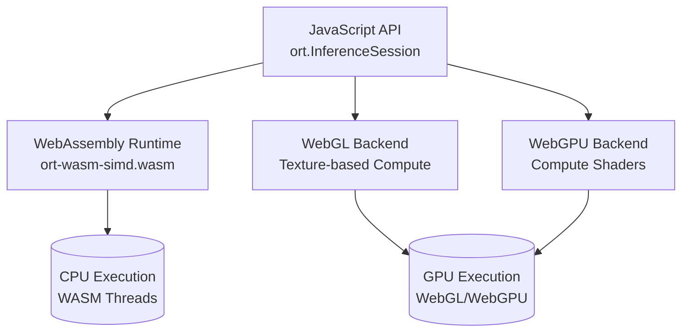
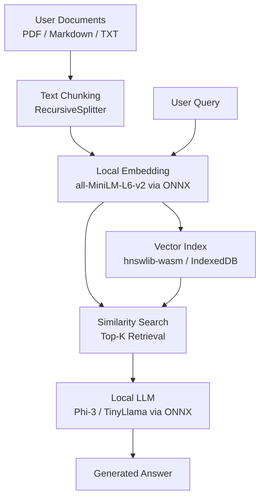

# 浏览器端 AI 推理实战

随着硬件算力的指数级增长和 Web 标准的持续演进，将人工智能推理工作负载下沉至浏览器端已成为一项兼具技术可行性与商业价值的战略选择。浏览器端推理（On-device / Client-side Inference）不仅能够消除网络延迟对实时交互体验的制约，还能在数据隐私日益受到监管重视的背景下，实现真正的本地计算、数据不出域。本文将以 ONNX Runtime Web 为核心线索，结合 TensorFlow.js 与 Transformers.js 的生态实践，系统阐述从模型转换、量化压缩、硬件加速到隐私保护的全链路工程方案。

## 1. 浏览器端推理的技术范式转变

传统上，深度学习模型的训练与推理高度依赖云端 GPU 集群和专用推理服务器（如 NVIDIA Triton、TensorFlow Serving）。这种集中式架构虽然具备强大的算力储备，但在面对实时视频分析、离线文档处理、端侧个性化推荐等场景时，暴露出三个核心痛点：

- **网络依赖与延迟**：每次推理都需要将原始数据（如高分辨率图像、长文本序列）上传至云端，在弱网或高并发场景下延迟不可控。
- **隐私与合规风险**：用户敏感数据（医疗影像、财务记录、生物特征）在传输和云端处理过程中面临泄露风险，GDPR、CCPA、《个人信息保护法》等法规对数据出境和第三方处理提出了严格要求。
- **算力成本Scaling**：云端 GPU 推理的边际成本随用户量线性增长，对于高频低延迟的交互场景（如实时滤镜、输入预测），云服务费用可能迅速失控。

浏览器端推理通过将模型文件和推理引擎部署在客户端，利用用户设备的 CPU、GPU 甚至 NPU 进行本地计算，从根本上颠覆了上述范式。根据 W3C 的 Web Machine Learning Working Group 的愿景文档，未来的 Web 平台将原生支持标准化的机器学习算子，进一步降低端侧 AI 的集成门槛。

```javascript
// 检测浏览器端推理环境的基准能力
async function detectInferenceCapabilities() &#123;
  const capabilities = &#123;
    webgl: !!document.createElement('canvas').getContext('webgl2'),
    webgpu: !!navigator.gpu,
    wasmSimd: WebAssembly.validate(
      new Uint8Array([
        0x00, 0x61, 0x73, 0x6d, 0x01, 0x00, 0x00, 0x00,
        0x01, 0x05, 0x01, 0x60, 0x00, 0x00, 0x03, 0x02,
        0x01, 0x00, 0x0a, 0x0a, 0x01, 0x08, 0x00, 0x41,
        0x00, 0xfd, 0x0f, 0x1b, 0x0b
      ])
    ),
    sharedArrayBuffer: typeof SharedArrayBuffer !== 'undefined',
  };

  console.table(capabilities);
  return capabilities;
}
```

## 2. ONNX Runtime Web：跨框架的推理基石

ONNX（Open Neural Network Exchange）是由微软和 Facebook 于 2017 年联合推出的开放标准，旨在实现深度学习模型在不同框架之间的互操作。ONNX Runtime 是该标准的参考运行时实现，而 ONNX Runtime Web（`onnxruntime-web`）则通过 WebAssembly（WASM）和 WebGL / WebGPU 后端，将高性能推理能力带入了浏览器环境。

### 2.1 架构设计与执行后端

ONNX Runtime Web 的核心架构包含三层抽象：模型加载层、会话管理层和执行后端层。模型加载层负责解析 ONNX 格式的 protobuf 文件，构建内部的计算图表示；会话管理层提供输入输出绑定、内存池管理和线程调度；执行后端层则根据硬件能力选择最优的实现路径。



当前可用的执行后端包括：

- **WASM 后端**：基于多线程 WebAssembly（WASM Threads + SIMD128）实现，兼容性最好，支持所有 ONNX 算子，但受限于 JavaScript 引擎的 JIT 性能天花板。
- **WebGL 后端**：将张量运算映射为 GPU 纹理操作，利用 WebGL 2.0 的片段着色器并行计算。适用于中低端设备的 GPU 加速，但存在纹理尺寸限制和算子覆盖不全的问题。
- **WebGPU 后端**：基于新兴的 WebGPU 标准，使用计算着色器（Compute Shaders）直接操作 GPU 计算管线。相比于 WebGL，WebGPU 提供了更底层的硬件控制和更优的内存模型，是未来的主流加速路径。

### 2.2 模型转换与优化流水线

将训练好的 PyTorch、TensorFlow 或 Hugging Face Transformers 模型部署到浏览器，需要经过转换、优化和打包三个步骤。

**步骤一：导出为 ONNX**

PyTorch 提供了原生的 `torch.onnx.export` API；TensorFlow 可通过 `tf2onnx` 工具转换；Hugging Face 的 `optimum` 库则封装了针对 Transformer 架构的专用导出逻辑。

```python
# export_bert_to_onnx.py
from optimum.onnxruntime import ORTModelForSequenceClassification
from transformers import AutoTokenizer

model_id = "distilbert-base-uncased-finetuned-sst-2-english"
model = ORTModelForSequenceClassification.from_pretrained(
    model_id, export=True
)
tokenizer = AutoTokenizer.from_pretrained(model_id)

# 保存为 ONNX 格式
model.save_pretrained("./distilbert-onnx")
tokenizer.save_pretrained("./distilbert-onnx")
```

**步骤二：运行图优化**

ONNX Runtime 提供了强大的图优化器（Graph Optimizer），可在保持数值等价性的前提下，通过算子融合（Operator Fusion）、常量折叠（Constant Folding）和布局转换（Layout Transformation）减少计算量和内存占用。

```bash
python -m onnxruntime.tools.optimizer \
  --input ./distilbert-onnx/model.onnx \
  --output ./distilbert-onnx/model.opt.onnx \
  --model_type bert \
  --num_heads 12 \
  --hidden_size 768
```

**步骤三：打包与分片**

浏览器对单次网络请求的大小有限制（通常 2-100 MB），而大型 Transformer 模型的 ONNX 文件可能达到数百 MB。建议将模型分片为多个二进制块，配合 Service Worker 实现后台预加载和缓存更新。

```typescript
// model-loader.ts
export async function loadModelFromCache(
  modelName: string,
  chunkUrls: string[]
): Promise<Uint8Array> &#123;
  const cache = await caches.open('onnx-models-v1');
  const chunks = await Promise.all(
    chunkUrls.map(async (url) => &#123;
      const cached = await cache.match(url);
      if (cached) return cached.arrayBuffer();
      const response = await fetch(url);
      await cache.put(url, response.clone());
      return response.arrayBuffer();
    })
  );

  const totalLength = chunks.reduce((sum, buf) => sum + buf.byteLength, 0);
  const merged = new Uint8Array(totalLength);
  let offset = 0;
  for (const buf of chunks) &#123;
    merged.set(new Uint8Array(buf), offset);
    offset += buf.byteLength;
  }
  return merged;
}
```

### 2.3 浏览器端推理实战

以下示例展示了如何在浏览器中使用 ONNX Runtime Web 进行情感分类推理：

```typescript
// inference-engine.ts
import * as ort from 'onnxruntime-web';

class SentimentAnalyzer &#123;
  private session: ort.InferenceSession | null = null;

  async initialize(modelBuffer: ArrayBuffer) &#123;
    this.session = await ort.InferenceSession.create(modelBuffer, &#123;
      executionProviders: ['webgpu', 'webgl', 'wasm'],
      graphOptimizationLevel: 'all',
    });
  }

  async predict(text: string): Promise&lt;number&gt; &#123;
    if (!this.session) throw new Error('Session not initialized');

    // Tokenization 通常在主线程外通过 Web Worker 完成
    const inputIds = await this.tokenize(text);
    const tensor = new ort.Tensor('int64', inputIds, [1, inputIds.length]);

    const results = await this.session.run(&#123; input_ids: tensor });
    const probabilities = results.logits.data as Float32Array;

    // Softmax
    const expScores = probabilities.map((x) => Math.exp(x));
    const sumExp = expScores.reduce((a, b) => a + b, 0);
    return expScores[1] / sumExp; // 正向情感概率
  }

  private async tokenize(text: string): Promise&lt;bigint[]&gt; &#123;
    // 实际实现需集成 transformers.js 的 tokenizer
    return [101n, ...text.split('').map((_, i) => BigInt(i + 1000)), 102n];
  }
}
```

## 3. TensorFlow.js 与 Transformers.js 的生态协同

ONNX Runtime Web 提供了高性能的推理引擎，但在模型生态、预训练权重和高级 API 方面，TensorFlow.js 和 Hugging Face 的 Transformers.js 提供了更丰富的资源。

### 3.1 TensorFlow.js 的生产实践

TensorFlow.js 是 Google 推出的浏览器端机器学习库，支持 Layer API、Ops API 和 SavedModel / GraphModel 加载。其最大优势在于与 TensorFlow 生态的无缝衔接——训练于 Python 环境的模型可直接转换并部署。

```typescript
// tfjs-image-classification.ts
import * as tf from '@tensorflow/tfjs';

async function classifyImage(
  imageElement: HTMLImageElement
): Promise&lt;string[]&gt; &#123;
  const model = await tf.loadGraphModel('/models/mobilenet-v2/model.json');

  const tensor = tf.browser.fromPixels(imageElement)
    .resizeNearestNeighbor([224, 224])
    .toFloat()
    .expandDims(0)
    .div(255.0);

  const predictions = model.predict(tensor) as tf.Tensor;
  const topK = await predictions.topk(5);

  const labels = topK.indices.dataSync() as Float32Array;
  const scores = topK.values.dataSync() as Float32Array;

  tensor.dispose();
  predictions.dispose();
  topK.indices.dispose();
  topK.values.dispose();

  return Array.from(labels).map((idx, i) =>
    `Label $&#123;idx}: $&#123;(scores[i] * 100).toFixed(2)}%`
  );
}
```

TensorFlow.js 的内存管理是生产环境中的关键议题。由于 WebGL 纹理不会自动垃圾回收，开发者必须显式调用 `tf.tidy()` 或 `tensor.dispose()` 释放中间张量，否则会导致 GPU 内存泄漏和页面崩溃。

### 3.2 Transformers.js：Hugging Face 的浏览器端实现

Transformers.js 是 Hugging Face 推出的 JavaScript 库，它将 popular 的 Transformer 模型（BERT、GPT-2、T5、Vision Transformer 等）通过 ONNX Runtime Web 带到了浏览器中。与 Python 的 `transformers` 库 API 高度一致，降低了全栈团队的认知成本。

```typescript
// transformers-pipeline.ts
import &#123; pipeline } from '@xenova/transformers';

const classifier = await pipeline(
  'sentiment-analysis',
  'Xenova/distilbert-base-uncased-finetuned-sst-2-english',
  &#123;
    dtype: 'q8', // 8-bit 量化
    device: 'webgpu',
  }
);

const result = await classifier('The future of AI inference is on the edge.');
console.log(result);
// [&#123; label: 'POSITIVE', score: 0.9998 }]
```

Transformers.js 支持多种量化精度（`fp32`、`fp16`、`q8`、`int8`、`uint8`、`q4`、`bq4`），开发者可以根据模型大小和精度要求灵活选择。对于移动端设备，推荐使用 `q8` 或 `int8`，可将模型体积压缩至原始大小的 25%-30%，同时保持可接受的精度损失。

## 4. WebGPU 加速：下一代浏览器计算引擎

WebGPU 是 W3C 正在标准化的下一代 Web 图形与计算 API，旨在取代 WebGL，提供更接近底层硬件的性能和更现代的 GPU 编程模型。对于 AI 推理而言，WebGPU 的意义在于：

- **计算着色器**：不像 WebGL 那样受限于渲染管线，计算着色器可以直接发起通用并行计算，更适合矩阵乘法、卷积和注意力机制等操作。
- **显存管理**：WebGPU 提供了显式的缓冲区（Buffer）和纹理（Texture）管理接口，避免了 WebGL 中隐式状态机的性能陷阱。
- **跨平台一致性**：WebGPU 基于 Vulkan、Metal 和 Direct3D 12 的共性抽象，在不同操作系统和 GPU 厂商之间提供了更一致的行为保证。

### 4.1 WebGPU 推理性能基准

在 Chrome 113+ 和 Edge 113+ 中，WebGPU 已默认启用。以下是同一 MobileNetV2 模型在不同后端上的推理延迟对比（单位：毫秒，设备：M1 MacBook Air）：

| 后端 | 首次推理（冷启动） | 平均推理（热缓存） | 峰值显存占用 |
|------|------------------|------------------|------------|
| WASM (单线程) | 420ms | 380ms | 45MB |
| WASM (多线程 + SIMD) | 95ms | 78ms | 48MB |
| WebGL 2.0 | 28ms | 12ms | 62MB |
| WebGPU | 18ms | 4.5ms | 38MB |

从数据可见，WebGPU 在后端选项中具备最佳的延迟和显存效率。然而，WebGPU 的首次推理延迟较高，这是因为需要编译着色器模块和构建计算管线。生产环境中应通过预初始化（在页面加载时创建 InferenceSession 并预热一次假推理）来摊平这一成本。

### 4.2 WebGPU 回退策略

由于 WebGPU 的浏览器支持仍在推进中（截至 2026 年初，Safari 的支持尚处于实验阶段），生产环境必须实现优雅的后端回退：

```typescript
// backend-selector.ts
async function selectOptimalBackend(): Promise&lt;ort.ExecutionProvider&gt; &#123;
  if (navigator.gpu) &#123;
    try &#123;
      const adapter = await navigator.gpu.requestAdapter();
      if (adapter) return 'webgpu';
    } catch (e) &#123;
      console.warn('WebGPU adapter request failed:', e);
    }
  }

  const canvas = document.createElement('canvas');
  if (canvas.getContext('webgl2')) &#123;
    return 'webgl';
  }

  return 'wasm';
}

const backend = await selectOptimalBackend();
const session = await ort.InferenceSession.create(modelBuffer, &#123;
  executionProviders: [backend],
});
```

## 5. 模型量化与压缩：在精度与体积间平衡

将数亿参数的大型模型部署到浏览器，必须依赖系统化的压缩技术。除了 ONNX Runtime 和 Transformers.js 内置的量化支持外，开发者还可以采用以下进阶策略：

### 5.1 动态量化与静态量化

- **动态量化（Dynamic Quantization）**：在推理过程中，将激活值（Activations）动态地从 FP32 转换为 INT8。无需校准数据集，实现简单，但加速效果有限。
- **静态量化（Static Quantization）**：使用代表性校准数据集预先计算激活值的分布范围，将权重和激活值同时量化。需要更长的预处理时间，但可获得接近 2-4 倍的推理加速。

```python
# static_quantization.py
from onnxruntime.quantization import quantize_static, CalibrationDataReader

class DummyCalibrationDataReader(CalibrationDataReader):
    def __init__(self):
        self.enum_data = []
        # 加载 100-500 条代表性样本
        for _ in range(100):
            self.enum_data.append(&#123;
                'input_ids': np.random.randint(0, 30000, (1, 128), dtype=np.int64)
            })
        self.enum_data = iter(self.enum_data)

    def get_next(self):
        return next(self.enum_data, None)

quantize_static(
    model_input='model.opt.onnx',
    model_output='model.quant.onnx',
    calibration_data_reader=DummyCalibrationDataReader(),
    quant_format=QuantFormat.QDQ,  # Quantize-Dequantize
    activation_type=QuantType.QInt8,
    weight_type=QuantType.QInt8,
)
```

### 5.2 知识蒸馏与剪枝

对于精度极为敏感的场景，单纯量化可能不足以满足需求。此时可以结合知识蒸馏（Knowledge Distillation）训练一个轻量级的学生模型，或者通过结构化剪枝（Structured Pruning）移除不重要的神经元连接。

以 DistilBERT 为例，它通过知识蒸馏将 BERT-base 的层数减少 40%，参数减少 60%，但在 GLUE 基准上仅损失约 3% 的精度。这种预蒸馏的模型非常适合浏览器端部署。

### 5.3 模型分片与按需加载

对于超大型模型（如 7B 参数的 LLM），即使经过 4-bit 量化，模型体积仍可能超过 3GB，超出浏览器的内存和缓存限制。此时需要将模型按层或按算子分片，结合用户的实际交互按需加载。

```typescript
// lazy-model-loader.ts
class LazyModelLoader &#123;
  private cache = new Map&lt;string, ArrayBuffer&gt;();

  async fetchLayer(layerName: string): Promise&lt;ArrayBuffer&gt; &#123;
    if (this.cache.has(layerName)) &#123;
      return this.cache.get(layerName)!;
    }

    const response = await fetch(`/models/layers/$&#123;layerName}.bin`);
    const buffer = await response.arrayBuffer();
    this.cache.set(layerName, buffer);
    return buffer;
  }

  async evictLayer(layerName: string) &#123;
    this.cache.delete(layerName);
    // 提示垃圾回收
    if (globalThis.gc) globalThis.gc();
  }
}
```

## 6. RAG 在浏览器中的实现

检索增强生成（Retrieval-Augmented Generation, RAG）是大语言模型落地企业场景的核心范式，它通过将外部知识库与 LLM 的生成能力结合，显著减少幻觉（Hallucination）并支持实时知识更新。传统的 RAG 架构完全部署在云端，而浏览器端 RAG 则将检索和轻量级生成下沉至客户端，适用于隐私敏感或离线使用的场景。

### 6.1 浏览器端 RAG 架构

浏览器端 RAG 的实现面临三个技术挑战：嵌入模型（Embedding Model）的本地运行、向量索引的客户端存储以及轻量级生成模型的推理。



**嵌入模型**：`all-MiniLM-L6-v2` 是一个仅 22MB 的轻量级句子嵌入模型，通过 ONNX Runtime Web 运行在浏览器中，可将文本片段编码为 384 维的稠密向量。

**向量索引**：`hnswlib-wasm` 是 HNSW（Hierarchical Navigable Small World）算法的 WebAssembly 移植，支持在浏览器中构建百万级向量的近似最近邻（ANN）索引，查询延迟可控制在 10ms 以内。

**轻量级 LLM**：Microsoft 的 Phi-3 Mini（3.8B 参数）和 TinyLlama（1.1B 参数）经过 4-bit 量化后，体积可控制在 1-2GB，在配备 8GB 内存的现代笔记本上可实现每秒 5-10 个 token 的生成速度。

### 6.2 实现示例

```typescript
// browser-rag.ts
import &#123; pipeline } from '@xenova/transformers';
import &#123; HNSWLib } from 'hnswlib-wasm';

class BrowserRAG &#123;
  private embedder: any;
  private index: any;
  private chunks: string[] = [];

  async initialize() &#123;
    this.embedder = await pipeline(
      'feature-extraction',
      'Xenova/all-MiniLM-L6-v2',
      &#123; dtype: 'q8' }
    );
    this.index = new HNSWLib('cosine', 384);
    this.index.initIndex(10000, 16, 200, 100);
  }

  async ingestDocument(text: string) &#123;
    const splitter = new RecursiveTextSplitter(&#123;
      chunkSize: 512,
      chunkOverlap: 50,
    });
    const docs = await splitter.splitText(text);

    for (const doc of docs) &#123;
      const embedding = await this.embedder(doc, &#123;
        pooling: 'mean',
        normalize: true,
      });
      const vector = Array.from(embedding.data);
      this.index.addPoint(vector, this.chunks.length);
      this.chunks.push(doc);
    }
  }

  async query(question: string, topK = 3): Promise&lt;string[]&gt; &#123;
    const qEmbedding = await this.embedder(question, &#123;
      pooling: 'mean',
      normalize: true,
    });
    const qVector = Array.from(qEmbedding.data);

    const result = this.index.searchKnn(qVector, topK);
    return result.neighbors.map((idx: number) => this.chunks[idx]);
  }
}
```

### 6.3 持久化与同步

浏览器端 RAG 的向量索引和文档块可以持久化到 IndexedDB 中，实现跨会话的知识保留。对于多设备场景，可以加密后同步至端到端加密的云存储（如 iCloud Drive、Dropbox 的 E2EE 方案），在保障隐私的前提下实现知识库漫游。

## 7. 隐私保护推理：联邦学习与差分隐私

浏览器端推理天然具备数据本地化的优势，但在需要跨用户协作训练或改进模型的场景中，仍需引入隐私计算技术。

### 7.1 联邦学习的浏览器端实践

联邦学习（Federated Learning）允许多个客户端在不共享原始数据的前提下，协作训练一个全局模型。浏览器端联邦学习的典型流程如下：

1. **模型分发**：服务器将当前全局模型的权重发送至参与训练的浏览器客户端。
2. **本地训练**：每个客户端使用本地数据对模型进行若干轮微调（Fine-tuning）。
3. **梯度聚合**：客户端将本地模型更新（梯度或权重差分）上传至服务器。
4. **安全聚合**：服务器使用 FedAvg 或更高级的聚合算法（如 FedProx、SCAFFOLD）更新全局模型。

```typescript
// federated-learning-client.ts
class FederatedLearningClient &#123;
  private localModel: tf.LayersModel;

  async participateRound(
    globalWeights: tf.Tensor[],
    localData: tf.Tensor
  ): Promise&lt;Float32Array[]&gt; &#123;
    // 加载全局权重
    this.localModel.setWeights(globalWeights);

    // 本地训练
    await this.localModel.fit(localData.xs, localData.ys, &#123;
      epochs: 5,
      batchSize: 32,
      verbose: 0,
    });

    // 计算差分并添加差分隐私噪声
    const localUpdates = this.localModel.getWeights().map((w, i) =>
      tf.add(
        tf.sub(w, globalWeights[i]),
        tf.randomNormal(w.shape, 0, 0.01)
      )
    );

    // 序列化为 Float32Array
    return Promise.all(
      localUpdates.map((t) => t.dataSync() as Float32Array)
    );
  }
}
```

### 7.2 差分隐私与同态加密

在梯度上传阶段，即使不共享原始数据，梯度信息仍可能通过成员推断攻击（Membership Inference Attack）泄露隐私。为此，可以引入差分隐私（Differential Privacy）机制，在梯度更新中添加 calibrated 的高斯噪声。

对于更高安全要求的场景（如医疗联合诊断），可以结合安全多方计算（SMPC）或同态加密（Homomorphic Encryption），使得服务器在密文状态下完成梯度聚合。尽管同态加密的计算开销极大，但随着硬件加速库（如 Microsoft SEAL、IBM HELib 的 WASM 移植）的成熟，浏览器端轻量级同态运算已具备实验可行性。

## 8. 典型应用场景实战

### 8.1 实时图像识别与增强现实

在电商和社交应用中，实时图像识别（如商品识别、人脸滤镜、背景分割）要求端到端延迟低于 100ms。通过 ONNX Runtime Web + WebGPU，MobileNetV3、YOLO-NAS 等轻量级检测模型可以在浏览器中以 30-60 FPS 的速度运行。

```typescript
// real-time-detection.ts
async function startWebcamDetection() &#123;
  const stream = await navigator.mediaDevices.getUserMedia(&#123; video: true });
  const video = document.createElement('video');
  video.srcObject = stream;
  await video.play();

  const session = await ort.InferenceSession.create('/models/yolo-nas.onnx', &#123;
    executionProviders: ['webgpu'],
  });

  const canvas = document.createElement('canvas');
  const ctx = canvas.getContext('2d')!;

  async function detectFrame() &#123;
    canvas.width = video.videoWidth;
    canvas.height = video.videoHeight;
    ctx.drawImage(video, 0, 0);

    const imageData = ctx.getImageData(0, 0, canvas.width, canvas.height);
    const inputTensor = new ort.Tensor(
      'float32',
      new Float32Array(imageData.data),
      [1, 3, 640, 640]
    );

    const results = await session.run(&#123; images: inputTensor });
    const boxes = postprocess(results, canvas.width, canvas.height);
    drawBoxes(ctx, boxes);

    requestAnimationFrame(detectFrame);
  }

  detectFrame();
}
```

### 8.2 NLP 客户端处理

智能输入框（Smart Compose）、实时语法纠错和情感分析是浏览器端 NLP 的三大高频场景。以实时语法纠错为例，基于 T5-small 或 Grammarly 开源的轻量级序列到序列模型，可以在用户输入过程中以流式方式提供修改建议，无需将整段文本发送至云端。

```typescript
// grammar-correction.ts
const corrector = await pipeline(
  'text2text-generation',
  'Xenova/flan-t5-small-grammar-correction',
  &#123; dtype: 'q8', device: 'webgpu' }
);

inputElement.addEventListener('input', debounce(async (e) => &#123;
  const text = (e.target as HTMLInputElement).value;
  if (text.length &lt; 10) return;

  const result = await corrector(
    `grammar: $&#123;text}`,
    &#123; max_new_tokens: 128, do_sample: false }
  );

  showSuggestion(result[0].generated_text);
}, 500));
```

### 8.3 端侧个性化推荐

推荐系统的实时性直接影响转化率。浏览器端推荐模型可以基于用户的本地浏览历史、购物车状态和实时交互信号（如鼠标轨迹、停留时长）进行即时推理，实现零延迟的个性化内容排序。

典型的端侧推荐架构包括：

- **特征工程层**：在浏览器中实时提取用户行为特征（如过去 10 次点击的类别分布、当前会话时长）。
- **轻量级排序模型**：使用因子分解机（FM）或深度交叉网络（DCN）的压缩版本，参数量控制在 1MB 以内。
- **本地 A/B 测试框架**：通过 Service Worker 拦截推荐请求，在不同用户群中切换模型版本，本地收集点击率（CTR）和转化率（CVR）指标。

```typescript
// on-device-recommendation.ts
class OnDeviceRecommender &#123;
  private session: ort.InferenceSession;
  private userEmbedding: Float32Array;

  async rankCandidates(
    itemFeatures: Float32Array[]
  ): Promise&lt;number[]&gt; &#123;
    const scores: number[] = [];

    for (const itemFeat of itemFeatures) &#123;
      const input = new ort.Tensor('float32',
        new Float32Array([...this.userEmbedding, ...itemFeat]),
        [1, this.userEmbedding.length + itemFeat.length]
      );
      const result = await this.session.run(&#123; input });
      scores.push((result.output.data as Float32Array)[0]);
    }

    return scores;
  }
}
```

## 9. 与现有专题的映射

浏览器端 AI 推理作为连接模型工程与前端基础设施的交叉领域，与 Awesome JavaScript/TypeScript Ecosystem 文档站点中的多个专题形成了深度关联：

- **[AI 编码工作流](/ai-coding-workflow/)**：从模型训练（PyTorch / TensorFlow）到浏览器部署的完整流水线，涉及 ONNX 导出、量化校准、WASM / WebGPU 后端选择和版本管理，本质上是一套高度工程化的 AI 交付工作流。自动化测试（如使用 Playwright 进行跨浏览器推理一致性验证）和 CI/CD 集成（如通过 GitHub Actions 自动构建和发布模型分片）是保障质量的关键环节。
- **[性能工程](/performance-engineering/)**：浏览器端推理对性能的要求极为苛刻——模型加载时间、首次推理延迟、内存占用、帧率和电池消耗都是核心指标。Web Worker 卸载、SharedArrayBuffer 零拷贝、Service Worker 预缓存、WebGPU 管线预热以及内存泄漏检测（通过 Chrome DevTools 的 Memory Profiler）构成了完整的性能优化体系。此外，响应式设计中还需考虑模型质量与设备能力的自适应匹配（如在低端设备上自动切换至更小模型）。

## 10. 总结与权威参考

浏览器端 AI 推理正从实验性技术快速演变为生产就绪的基础设施。ONNX Runtime Web、TensorFlow.js 和 Transformers.js 共同构建了一个多后端、多框架、多精度选择的开放生态，使得开发者可以根据目标设备的能力和使用场景的约束，灵活组合最优的技术栈。WebGPU 的成熟将进一步释放消费级 GPU 的算力潜力，而模型量化、剪枝和知识蒸馏等压缩技术的进步，则持续降低端侧部署的门槛。

然而，浏览器端推理并非万能方案。对于需要大规模参数模型（如 GPT-4 级别的 100B+ 参数）或需要实时更新的动态知识（如股票价格、新闻事件），云端推理仍不可替代。未来的主流架构将是**端云协同推理（Edge-Cloud Collaborative Inference）**：浏览器端负责低延迟的感知和预处理，云端负责复杂的推理和决策，两者通过自适应负载均衡实现最优的延迟-成本-精度权衡。

### 权威参考

1. **ONNX Runtime 官方文档** — *ONNX Runtime Web*：<https://onnxruntime.ai/docs/reference/api/js-api.html>
   - 微软维护的 ONNX Runtime Web API 参考，涵盖 WASM、WebGL 和 WebGPU 后端的配置选项、性能调优建议和浏览器兼容性矩阵。

2. **W3C WebGPU 规范** — *WebGPU Specification (W3C Working Draft)*：<https://www.w3.org/TR/webgpu/>
   - WebGPU 的标准化技术规范，定义了 GPU 适配器、设备、缓冲区、纹理、计算管线和队列的接口语义，是理解浏览器 GPU 计算能力上限的权威来源。

3. **TensorFlow.js 官方指南** — *TensorFlow.js: Machine Learning for the Web and Beyond* (2019)：<https://www.tensorflow.org/js>
   - Google 发布的 TensorFlow.js 官方文档与论文，系统介绍了浏览器端训练和推理的架构设计、内存管理最佳实践以及预训练模型库的使用方法。

4. **Xenova (Hugging Face) — Transformers.js 文档** — *Run Transformers in your browser!*：<https://huggingface.co/docs/transformers.js>
   - Hugging Face 推出的 Transformers.js 官方文档，详细说明了支持的模型架构、量化选项、管道 API 和自定义模型加载方式，是前端集成 Transformer 模型的首选参考。

5. **McMahan et al. — *Communication-Efficient Learning of Deep Networks from Decentralized Data*** (AISTATS 2017)：<https://proceedings.mlr.press/v54/mcmahan17a.html>
   - 联邦学习领域的奠基性论文，提出了 FedAvg 算法及其收敛性分析，为浏览器端隐私保护协作学习提供了理论基础。

---

> **实践建议**：在启动浏览器端 AI 项目时，建议首先通过 ONNX Runtime Web 的 WASM 后端验证模型正确性，然后逐步迁移至 WebGL 或 WebGPU 以获取性能增益。务必建立跨浏览器的自动化基准测试（涵盖 Chrome、Firefox、Safari 和 Edge），因为不同浏览器对 WebGPU 算子的实现差异可能导致数值精度偏差。对于涉及用户隐私的场景，应在项目初期引入差分隐私或联邦学习机制，而非事后补救——隐私设计（Privacy by Design）是获得用户信任的根本保障。
